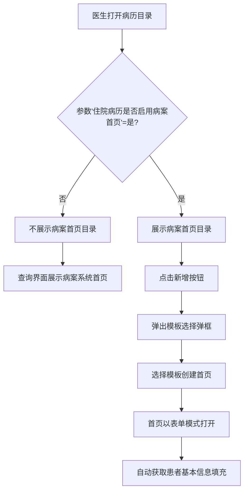
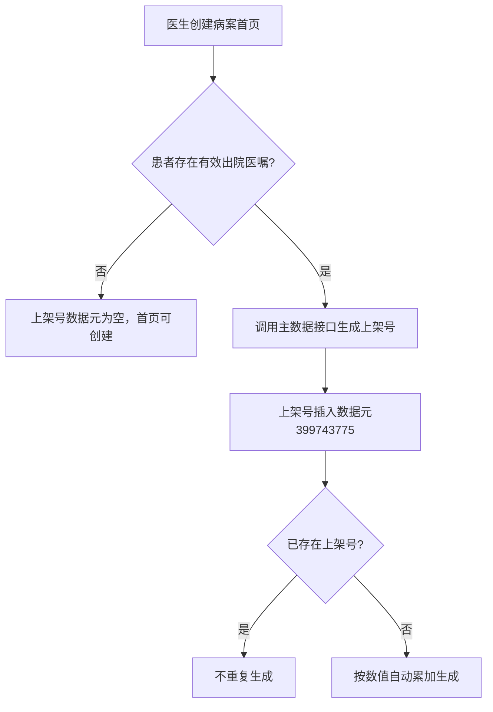

# BLGL-13-BASY-001病案首页创建与目录管理_ Analyst - Spec

> **需求编号**：BLGL-13-BASY-001
> **父需求**：BLGL-13-BASY
> **关联PM Spec**：BLGL-13-BASY-001_病案首页创建与目录管理_PM-spec.md
> **Spec版本**：V1.0
> **编写时间**：2026-08-13
> **编写人**：需求分析师

---

## 一、功能编号体系

### 1.1 功能层级结构

```
BLGL-13-BASY-001: 病案首页创建与目录管理
  ├─ BLGL-13-BASY-001-01: 病案首页开启参数控制
  ├─ BLGL-13-BASY-001-02: 病历目录创建病案首页
  ├─ BLGL-13-BASY-001-03: 首页目录各界面展示
  └─ BLGL-13-BASY-001-04: 首页上架号生成（丽水配置）
```

### 1.2 功能编号表

| REQ-ID | 功能名称 | 类型 | 优先级 | 说明 |
|--------|---------|------|--------|------|
| BLGL-13-BASY-001-01 | 病案首页开启参数控制 | 功能 | P0 | 参数"住院病历是否启用病案首页"控制首页启用与目录展示 |
| BLGL-13-BASY-001-02 | 病历目录创建病案首页 | 功能 | P0 | 病历目录点击新增弹出模板选择，创建首页并进入表单模式 |
| BLGL-13-BASY-001-03 | 首页目录各界面展示 | 功能 | P1 | 查询/全院查询/归档/借阅/护理查看界面展示首页目录 |
| BLGL-13-BASY-001-04 | 首页上架号生成 | 功能 | P2 | 出院医嘱执行时生成上架号，创建首页时读入（丽水需求） |

---

## 二、核心业务流程

### 2.1 病案首页创建流程



### 2.2 上架号生成流程



---

## 三、功能规格说明

### BLGL-13-BASY-001-01: 病案首页开启参数控制

#### 3.1.1 功能概述

通过参数"住院病历是否启用病案首页"控制病案首页功能是否启用，参数为是时首页目录展示，参数为否时不展示首页目录，查询界面展示病案系统的首页。

#### 3.1.2 用户角色

| 角色 | 使用场景 | 权限要求 | 操作频率 |
|------|---------|---------|---------|
| 配置管理员 | 配置病案首页启用参数 | 病历配置权限 | 低频 |
| 住院医生 | 查看病案首页目录 | 病历书写权限 | 高频 |

#### 3.1.3 业务流程（Given/When/Then）

##### 主流程（1 个）

**Scenario 1: 参数启用首页**

```gherkin
Given:
  - 参数"住院病历是否启用病案首页"= 是
  - 患者处于住院状态

When:
  - 医生打开病历目录

Then:
  - 病历目录展示病案首页目录
  - 点击新增弹出首页模板选择弹框
```

##### 异常流程（3 个）

**Scenario 2: 业务异常——参数未启用**

```gherkin
Given:
  - 参数"住院病历是否启用病案首页"= 否

When:
  - 医生打开病历目录

Then:
  - 病历目录不展示病案首页目录
  - 查询界面病案首页目录展示病案系统的首页
```

**Scenario 3: 数据异常——参数与界面不一致**

```gherkin
Given:
  - 参数切换后配置未保存成功

When:
  - 医生打开病历目录

Then:
  - 首页目录展示状态与实际参数不一致（待确认是否为此场景）

⏳ 待确认：参数切换保存问题的具体异常场景需结合确认
```

**Scenario 4: 系统异常——参数服务不可用**

```gherkin
Given:
  - 参数配置服务异常

When:
  - 医生打开病历目录

Then:
  - 首页目录按默认状态展示（默认否）
  - 记录系统异常日志
```

##### 边界流程（2 个）

**Scenario 5: 边界——参数默认值**

```gherkin
Given:
  - 参数未配置（默认值=否）

When:
  - 医生打开病历目录

Then:
  - 病案首页目录不展示
  - 查询界面展示病案系统首页
```

**Scenario 6: 边界——参数值为空**

```gherkin
Given:
  - 参数值为空

When:
  - 医生打开病历目录

Then:
  - 按默认值"否"处理，不展示首页目录
```

#### 3.1.5 验收标准

| AC编号 | 验收标准 | 对应REQ-ID | 验证方法 | 验证场景 |
|--------|---------|-----------|---------|---------|
| AC-001 | 参数=是时病历目录展示病案首页目录，点击新增弹出模板选择弹框 | BLGL-13-BASY-001-01 | 功能测试 | Scenario 1 |
| AC-002 | 参数=否时病历目录不展示首页目录，查询界面展示病案系统首页 | BLGL-13-BASY-001-01 | 功能测试 | Scenario 2 |

---

### BLGL-13-BASY-001-02: 病历目录创建病案首页

#### 3.2.1 功能概述

医生在病历目录点击病案首页目录的新增按钮，弹出模板选择弹框，选择模板后创建病案首页，首页以表单模式打开（元素外不可编辑），并自动获取患者基本信息。

#### 3.2.2 用户角色

| 角色 | 使用场景 | 权限要求 | 操作频率 |
|------|---------|---------|---------|
| 住院医生 | 创建病案首页 | 病历书写权限 | 中频 |

#### 3.2.3 业务流程（Given/When/Then）

##### 主流程（1 个）

**Scenario 1: 创建病案首页**

```gherkin
Given:
  - 参数启用=是
  - 病案首页目录已展示
  - 模板已配置

When:
  - 医生点击病案首页目录新增按钮
  - 弹出模板选择弹框
  - 医生选择模板确认创建

Then:
  - 病案首页创建成功
  - 首页以表单模式打开，元素外不可编辑
  - 自动获取患者基本信息填充首页
```

##### 异常流程（3 个）

**Scenario 2: 业务异常——无可用模板**

```gherkin
Given:
  - 当前患者无可用的病案首页模板

When:
  - 医生点击病案首页目录新增

Then:
  - 弹出模板选择弹框为空
  - 提示无可用模板，首页不创建
```

**Scenario 3: 数据异常——患者信息获取失败**

```gherkin
Given:
  - 患者信息接口异常

When:
  - 首页创建成功进入表单模式

Then:
  - 首页字段为空，等待手动录入
  - 患者信息获取失败提示（待确认具体提示方式）
```

**Scenario 4: 系统异常——创建接口超时**

```gherkin
Given:
  - 首页创建接口超时

When:
  - 医生确认创建首页

Then:
  - 提示创建失败请重试
  - 病历目录状态保持不变
```

##### 边界流程（2 个）

**Scenario 5: 边界——患者多次住院创建首页**

```gherkin
Given:
  - 患者本次住院再次创建病案首页

When:
  - 医生创建首页

Then:
  - 每次住院分别创建独立首页，同一就诊ID首页唯一
```

**Scenario 6: 边界——首页已创建再次点击新增**

```gherkin
Given:
  - 当前就诊已有病案首页

When:
  - 医生再次点击病案首页目录新增

Then:
  - ⏳ 待确认：是否限制重复创建（需结合病历目录创建规则确认）
```

#### 3.2.5 验收标准

| AC编号 | 验收标准 | 对应REQ-ID | 验证方法 | 验证场景 |
|--------|---------|-----------|---------|---------|
| AC-001 | 点击新增弹出模板选择弹框，选择模板后首页创建成功 | BLGL-13-BASY-001-02 | 功能测试 | Scenario 1 |
| AC-002 | 首页以表单模式打开，元素外不可编辑 | BLGL-13-BASY-001-02 | 功能测试 | Scenario 1 |
| AC-003 | 无可用模板时提示并阻止创建 | BLGL-13-BASY-001-02 | 功能测试 | Scenario 2 |

---

### BLGL-13-BASY-001-03: 首页目录各界面展示

#### 3.3.1 功能概述

病案首页目录在病历查询、全院查询、病历归档、病案借阅等界面统一展示，并封装给护理的病历查看界面展示住院病历的病案首页目录。

#### 3.3.2 用户角色

| 角色 | 使用场景 | 权限要求 | 操作频率 |
|------|---------|---------|---------|
| 住院医生 | 查询/归档/借阅界面查看首页目录 | 病历查询权限 | 高频 |
| 病案室人员 | 病案查询首页目录 | 病案查询权限 | 中频 |
| 护理人员 | 护理病历查看界面看首页目录 | 护理查看权限 | 中频 |

#### 3.3.3 业务流程（Given/When/Then）

##### 主流程（1 个）

**Scenario 1: 各界面展示首页目录**

```gherkin
Given:
  - 参数 COMMON072 = 是
  - 患者有已创建的病案首页

When:
  - 医生打开病历查询/全院查询界面
  - 或病案室打开病历归档/病案借阅界面
  - 或护理打开病历查看界面

Then:
  - 各界面均展示住院病历的病案首页目录
  - 可点击进入查看首页
```

##### 异常流程（3 个）

**Scenario 2: 业务异常——患者无病案首页**

```gherkin
Given:
  - 患者无病案首页

When:
  - 医生在病历查询界面查看

Then:
  - 病案首页目录不展示或置灰（待确认具体表现）

⏳ 待确认：无首页时目录展示表现需确认
```

**Scenario 3: 数据异常——参数未启用**

```gherkin
Given:
  - 参数 COMMON072 = 否

When:
  - 医生打开病历查询界面

Then:
  - 病案首页目录不展示
```

**Scenario 4: 系统异常——首页数据加载失败**

```gherkin
Given:
  - 首页目录数据查询接口异常

When:
  - 医生打开病历查询界面

Then:
  - 病案首页目录显示加载异常提示
  - 其他文书目录正常展示
```

##### 边界流程（2 个）

**Scenario 5: 边界——多界面同时展示**

```gherkin
Given:
  - 患者有已创建的病案首页

When:
  - 医生同时打开病历查询与全院查询界面

Then:
  - 两个界面均展示病案首页目录，数据一致
```

**Scenario 6: 边界——首页已提交**

```gherkin
Given:
  - 患者病案首页已提交

When:
  - 医生在病历查询界面查看

Then:
  - 首页目录展示，可查看已提交内容
```

#### 3.3.5 验收标准

| AC编号 | 验收标准 | 对应REQ-ID | 验证方法 | 验证场景 |
|--------|---------|-----------|---------|---------|
| AC-001 | 病历查询、全院查询、归档、借阅界面均展示病案首页目录 | BLGL-13-BASY-001-03 | 功能测试 | Scenario 1 |
| AC-002 | 护理病历查看界面展示病案首页目录 | BLGL-13-BASY-001-03 | 功能测试 | Scenario 1 |

---

### BLGL-13-BASY-001-04: 首页上架号生成

#### 3.4.1 功能概述

当患者存在有效出院医嘱（流转类型是死亡或出院）时，创建病历首页时生成上架号到病历中记录，同一就诊ID只生成一次，多次住院分别生成。

#### 3.4.2 用户角色

| 角色 | 使用场景 | 权限要求 | 操作频率 |
|------|---------|---------|---------|
| 住院医生 | 创建首页时自动生成上架号 | 病历书写权限 | 中频 |

#### 3.4.3 业务流程（Given/When/Then）

##### 主流程（1 个）

**Scenario 1: 生成上架号**

```gherkin
Given:
  - 患者存在有效出院医嘱（流转类型是死亡或出院）
  - 当前就诊ID尚无上架号

When:
  - 医生创建病历首页

Then:
  - 生成上架号并插入数据元（399743775）
  - 上架号按给定数值自动累加
  - 后续医嘱作废/取消入院/取消出区时不对已生成上架号作废
```

##### 异常流程（3 个）

**Scenario 2: 业务异常——提交时上架号为空**

```gherkin
Given:
  - 首页上架号数据元为空（模板未配置）

When:
  - 医生提交病案首页

Then:
  - 不允许提交（：提交时若上架号为空不允许提交）
```

**Scenario 3: 数据异常——主数据接口无返回**

```gherkin
Given:
  - 调用主数据接口获取上架号无返回

When:
  - 医生创建首页触发上架号生成

Then:
  - 上架号数据元为空
  - 待同步按钮时再次尝试生成
```

**Scenario 4: 系统异常——主数据服务不可用**

```gherkin
Given:
  - 主数据服务不可用

When:
  - 医生创建首页

Then:
  - 上架号不生成，首页正常创建
  - 记录系统异常日志，同步按钮时重试
```

##### 边界流程（2 个）

**Scenario 5: 边界——同一就诊ID重复生成**

```gherkin
Given:
  - 当前就诊ID已生成上架号

When:
  - 医生再次创建首页

Then:
  - 上架号不重复生成，使用已生成的上架号
```

**Scenario 6: 边界——同步按钮触发上架号生成**

```gherkin
Given:
  - 首页上架号为空
  - 患者已执行出院医嘱

When:
  - 医生点击同步按钮

Then:
  - 自动生成上架号并填充
```

#### 3.4.5 验收标准

| AC编号 | 验收标准 | 对应REQ-ID | 验证方法 | 验证场景 |
|--------|---------|-----------|---------|---------|
| AC-001 | 患者有有效出院医嘱时创建首页自动生成上架号 | BLGL-13-BASY-001-04 | 功能测试 | Scenario 1 |
| AC-002 | 同一就诊ID上架号不重复生成 | BLGL-13-BASY-001-04 | 功能测试 | Scenario 5 |
| AC-003 | 提交时上架号为空则不允许提交 | BLGL-13-BASY-001-04 | 功能测试 | Scenario 2 |

---

## 四、排除范围

本需求不包含以下功能项：

1. **病案首页数据获取与录入** - 归属 BLGL-13-BASY-002~006
2. **病案首页提交与校验** - 归属 BLGL-13-BASY-007
5. **首页模板配置管理** - 归属 BLGL-12-MBGL

---

## 五、业务规则清单

| 规则ID | 规则名称 | 规则描述 | 来源 | 优先级 |
|--------|---------|---------|------|--------|
| BR-001 | 首页启用参数控制 | 参数"住院病历是否启用病案首页"=是时首页目录展示，=否时展示病案系统首页 | | P0 |
| BR-002 | 首页目录各界面展示 | 首页目录在病历查询、全院查询、病历归档、病案借阅界面展示 | | P1 |
| BR-003 | 首页创建模板选择 | 病案首页目录创建病历模式和其他病历一致，点击新增弹框映射模板 | | P0 |
| BR-004 | 首页表单模式 | 病案首页及其附页控制元素外不可编辑，调用编辑器表单模式 | | P0 |
| BR-005 | 上架号唯一性 | 同一就诊ID只生成一次上架号，多次住院分别生成 | | P1 |
| BR-006 | 上架号生成时机 | 患者存在有效出院医嘱时，创建首页时生成上架号 | | P1 |
| BR-007 | 提交上架号校验 | 提交时上架号为空（模板配置）则不允许提交 | | P1 |

---

## 六、关联文档

| 文档类型 | 文档路径 | 说明 |
|---------|---------|------|
| PM-Spec（业务视角） | 本目录 BLGL-13-BASY-001_病案首页创建与目录管理_PM-spec.md（V0.1） | PM 产出的 Spec 文档 |
| Spec（研发视角） | 本目录 BLGL-13-BASY-001_病案首页创建与目录管理-Spec.md（V1.0） | 业务背景与目标 Spec |
| 功能点Spec（模块级） | BLGL-13-BASY 13病案首页功能点Spec.md（V1.0，上级目录） | Phase 1 功能点索引 |
| data-model.md | 待产出 | 架构师产出的数据建模文档 |
| design.md | 待产出 | 架构师产出的技术方案文档 |
| api-contract.md | 待产出 | 开发经理产出的 API 契约文档 |

---

## 七、待确认问题清单

| 编号 | 问题描述 | 缺失信息 | 影响范围 | 建议补充方 |
|------|---------|---------|---------|-----------|
| Q-001 | 病案首页生命周期状态定义（新建/保存/提交） | 状态机定义 | 数据模型-状态定义 | 产品经理 |
| Q-002 | 患者无病案首页时目录展示表现 | 界面表现规则 | 首页目录各界面展示 | 产品经理 |
| Q-003 | 当前就诊已有首页时是否限制重复创建 | 创建规则 | 病历目录创建首页 | 模块负责人 |
| Q-004 | 首页创建响应时间性能指标 | 性能指标 | 非功能性要求 | 产品经理 |

---

## 填写检查清单

| 序号 | 检查项 | 是否完成 |
|:----:|--------|:--------:|
| 1 | 功能编号带父子层级 | ✅ |
| 2 | 每个 REQ-ID 有功能概述和用户角色 | ✅ |
| 3 | 主流程至少 1 个 Given/When/Then 场景 | ✅ |
| 4 | 异常流程至少 3 个 Given/When/Then 场景 | ✅ |
| 5 | 边界流程至少 2 个 Given/When/Then 场景 | ✅ |
| 6 | 每个 Given/When/Then 内容具体，不模糊 | ✅ |
| 7 | 数据字段定义完整（字段名、类型、必填、说明、概念ID） | ✅ |
| 8 | 验收标准 AC 编号独立，可验证 | ✅ |
| 9 | 验收标准无"功能正常"等模糊表述 | ✅ |
| 10 | 排除范围明确列出 | ✅ |
| 11 | 业务规则清单列出所有规则，每条标注来源 | ✅ |
| 12 | 流程图使用 Mermaid 格式（≥2 个） | ✅ |
| 13 | 关联文档索引包含 Phase 1 功能点Spec | ✅ |
| 14 | 待确认问题清单汇总了全文所有 ⏳ 项 | ✅ |
| 15 | 全文无占位符 `< >` 残留 | ✅ |
| 16 | 全文陈述可溯源至资料区（S1~S10 溯源核查） | ✅ |
| 17 | 人工审核确认完成 | ⏳ 待确认 |

---

**文档状态**：⬜ 待审核
**维护责任**：需求分析师规范组
**下次更新**：根据评审反馈优化

---

## 版本历史

| 版本 | 日期 | 变更说明 | 编写人 |
|------|------|---------|--------|
| V1.0 | 2026-08-13 | 初始版本 | 需求分析师 |
