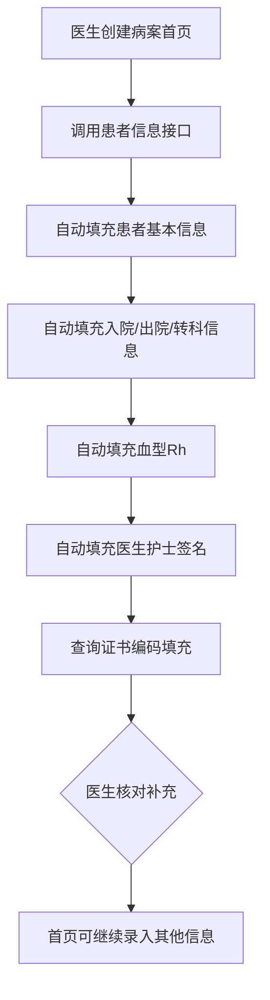
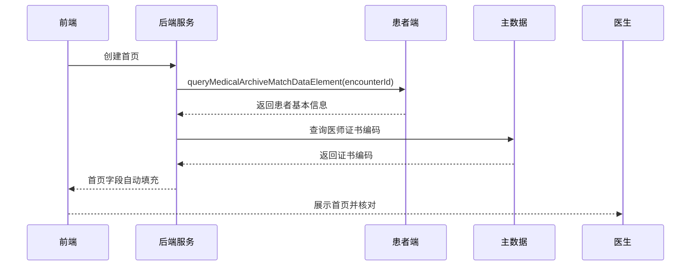

# BLGL-13-BASY-002 患者基本信息自动获取 - Spec

> **功能编号**：BLGL-13-BASY-002
> **文档类型**：Spec（研发视角）
> **文档版本**：V1.0
> **编写时间**：2026-08-13
> **编写人**：RACC

---

## 文档索引

本节提供本文档的章节结构索引与关联文档索引，便于读者快速定位与检索。

#### 章节索引

**Spec（研发视角）**

| 章节号 | 章节名称 | 内容说明 |
|--------|---------|---------|
| 1、 | 文档概述 | 文档目的、文档范围、术语定义、阅读指南、参考文档 |
| 2、 | 功能背景与定位 | 功能背景、功能定位、目标用户、核心价值 |
| 3、 | 业务流程设计 | 主流程/异常流程/边界流程（Given/When/Then） |
| 4、 | 数据模型设计 | 核心数据结构、状态定义、系统参数定义 |
| 5、 | 接口契约设计 | API列表、接口详细设计、错误码定义 |
| 6、 | 技术方案设计 | 页面路径、技术栈、关键技术点、部署方案 |
| 7、 | 测试用例预设计 | 功能/边界/异常/性能测试用例 |
| 8、 | 非功能性要求 | 性能、安全、可用性、兼容性 |
| 9、 | 依赖与风险 | 外部依赖、风险项 |
| 10、 | 附录 | 流程图、时序图、参考文档 |

**PM-Spec（业务视角）**

| 章节号 | 章节名称 | 内容说明 |
|--------|---------|---------|
| 一 | 目标 | 功能定位与核心价值 |
| 二 | 约束 | 业务/技术/非功能性约束 |
| 三 | 验收标准 | 验收条件与验证方法 |
| 四 | 排除范围 | 本次不做项与明确边界 |
| 五 | 关键决策记录 | 方案决策与选型理由 |
| 六 | 优先级 | 优先级定义 |
| 七 | 关联文档 | 关联文档索引 |
| 附录 | 填写检查清单 | 质量检查 |

**Analyst-Spec（产品视角）**

| 章节号 | 章节名称 | 内容说明 |
|--------|---------|---------|
| 一 | 功能编号体系 | 带父子层级的编号树 |
| 二 | 核心业务流程 | Mermaid 流程图 |
| 三 | 功能规格说明 | 各子功能点的概述、用户角色、业务流程、验收标准 |
| 四 | 排除范围 | 本需求不包含的功能项 |
| 五 | 业务规则清单 | 规则ID、规则名称、规则描述、优先级 |
| 六 | 关联文档 | 文档类型、文档路径、说明 |
| 七 | 待确认问题清单 | 所有 ⏳ 待确认项的汇总 |
| - | 填写检查清单 | 检查项与完成状态 |

#### 版本历史

| 版本 | 日期 | 变更说明 | 编写人 |
|------|------|---------|--------|
| V1.0 | 2026-08-13 | 初始版本 | RACC |

#### 关联文档索引

| 序号 | 文档名称 | 文档类型 | 版本 | 位置 |
|------|---------|---------|------|------|
| 1 | BLGL-13-BASY-002_患者基本信息自动获取_PM-spec.md | PM-Spec（业务视角） | V0.1 | 本目录 |
| 2 | BLGL-13-BASY-002_患者基本信息自动获取_Analyst-spec.md | Analyst-Spec（产品视角） | V1.0 | 本目录 |
| 3 | BLGL-13-BASY-002_患者基本信息自动获取-Spec.md | Spec（研发视角） | V1.0 | 本目录 |
| 4 | BLGL-13-BASY 13病案首页功能点Spec.md | 功能点Spec（模块级） | V1.0 | 上级目录 |

---

## 1、文档概述

### 1.1、文档目的

本文档旨在明确"患者基本信息自动获取"功能（BLGL-13-BASY-002）的业务背景与设计方案，为需求分析、研发实现、测试验收及评审提供统一的业务上下文、设计口径与决策依据。

**具体目的包括**：

1. 梳理患者基本信息自动获取功能的业务由来与历史需求演进脉络，说明"为什么要做"；
2. 明确功能的定位边界、目标用户与核心价值，回答"做成什么"；
3. 描述功能的业务流程、数据模型、接口契约与技术方案，回答"怎么做"；
4. 预设计测试用例并明确非功能性要求、依赖与风险，为研发与验收提供依据；
5. 作为 SPEC（功能编号体系、功能详情、业务规则、验收标准等章节）的业务前提与设计输入，保证各层文档业务口径一致。

### 1.2、文档范围

#### 1.2.1 纳入范围

本文档覆盖患者基本信息自动获取的完整业务背景与设计，包括：

- 患者基本信息（姓名、性别、出生日期、年龄、民族、国籍、证件类型、身份证件号码、职业、婚姻状况）自动获取
- 入院/出院信息（入院途径、入院/出院科室、入院/出院病区、入院/出院日期时间、住院天数）自动获取
- 转科信息自动获取（概念ID 399336492）
- 血型/Rh血型从患者入区健康状况自动获取
- 员工签名信息自动获取（科主任、主任/副主任医师、主治医师、住院医师、责任护士等）与证书编码获取
- 地址信息（出生地、籍贯、现住址、户口地址、工作单位及邮编）
- 新生儿体重/年龄显示格式处理
- 首页字段自动获取（组织机构代码、医疗付费方式、健康卡号、住院号等）

#### 1.2.2 排除范围

本文档不涉及以下内容（详见其他功能点或模块）：

- 诊断信息同步与录入——见 BLGL-13-BASY-003
- 手术信息获取与管理——见 BLGL-13-BASY-004
- 费用信息获取与更新——见 BLGL-13-BASY-005
- 重症监护与三方数据获取——见 BLGL-13-BASY-006
- 首页参数与映射配置——见 BLGL-13-BASY-010

### 1.3、术语定义

| 术语 | 定义 |
|------|------|
| 数据元 | 病案首页模板中的最小数据单元，绑定概念ID |
| 概念ID | 数据元在术语体系中的唯一标识（如年龄概念ID 391004208） |
| 患者头像 | 患者基本信息组件，首页数据元可打开患者头像同步信息 |
| 入区健康状况 | 患者入区时登记的健康状态信息，血型/Rh来源 |
| 动态数据 | 数据元属性，可绑定员工集合/患者信息等 |
| 员工签名链接地址 | 动态数据-内容配置，用于取员工签名图片 |
| 年龄月 | 一周岁以下患儿年龄的月龄表示（概念ID 399336375） |

### 1.4、阅读指南

- **章节关系**：第1~2章为阅读铺垫与业务全貌（背景、定位、用户、价值）；第3~10章为设计实现层（流程、数据、接口、技术、测试、非功能、依赖风险、附录），可直接用于研发与测试。与 Analyst-Spec、PM-Spec 的详细规则/验收口径互相引用，保持一致。
- **读者对象**：
  - 产品经理/需求分析师：阅读第1~2章了解业务全貌，据此维护 PM-Spec 与功能清单；
  - 研发：阅读第3~6章用于开发实现，第9~10章用于依赖评估与联调；
  - 测试：阅读第3章、第7~8章用于用例设计与验收；
  - 评审人员：以本文档为业务口径与设计基准，核对各层文档一致性。

### 1.5、参考文档

| 序号 | 文档名称 | 版本/日期 |
|------|---------|----------|
| 1 | 【历史需求】病案首页需求-0727.xlsx | - |
| 2 | BLGL-13-BASY-002_患者基本信息自动获取_PM-spec.md | V0.1 |
| 3 | BLGL-13-BASY-002_患者基本信息自动获取_Analyst-spec.md | V1.0 |
| 4 | BLGL-13-BASY 13病案首页功能点Spec.md | V1.0 |
| 5 | WiNEX-病案首页_功能清单_20260325_162900.md | 2026-03-25 |

---

## 2、功能背景与定位

### 2.1 功能背景

患者基本信息自动获取是病案首页数据完整性的基础，需满足：

- **法规/规范依据**：病案首页需满足《江苏省病历书写规范》
- **管理要求**：患者基本信息需从患者端/住院信息自动获取，避免人工录入错误
- **现状痛点**：医生在首页上填写的主治医师等签名，同步时患者信息为空会清空医生填写内容
- **历史需求演进**：从"基本信息获取"→"血型RH同步"→"员工签名自动获取"→"图片签名"→"证书编码获取"

### 2.2 功能定位

"患者基本信息自动获取"是WiNEX病历管理-病案首页模块的基础数据层，定位为：

- **数据来源定位**：首页患者基本信息的自动填充来源
- **签名支撑定位**：为首页医生/护士签名数据元提供员工信息与证书编码
- **合规支撑定位**：保障首页患者信息满足病历书写规范要求

### 2.3 目标用户

| 用户角色 | 主要使用场景 |
|---------|-------------|
| 住院医生 | 创建首页时查看自动获取的患者基本信息并核对补充 |
| 责任护士 | 首页签名（责任护士）自动获取 |

### 2.4 核心价值

| 价值维度 | 价值描述 |
|---------|---------|
| 数据准确性 | 患者基本信息自动获取，减少人工录入错误 |
| 效率提升 | 创建首页即自动填充，避免医生跨系统查找 |
| 合规性 | 签名信息与证书编码自动获取，满足规范要求 |

---

## 3、业务流程设计（Given/When/Then）

### 3.1 主流程

**Scenario 1: 创建首页自动获取患者基本信息**

```gherkin
Given:
  - 参数"住院病历是否启用病案首页"= 是
  - 患者已入区，住院信息已填写

When:
  - 医生创建病案首页
  - 系统调用患者信息接口

Then:
  - 姓名、性别、出生日期、年龄、民族、国籍、证件类型、身份证件号码、职业类别、婚姻状况自动填充
  - 入院/出院信息、转科信息、血型/Rh自动填充
  - 科主任、主任（副主任）医师、主治医师、住院医师、责任护士等签名自动填充
```

### 3.2 异常流程

**Scenario 2: 业务异常——患者信息为空导致同步清空医生填写**

```gherkin
Given:
  - 医生已在首页手工填写主治医师签名
  - 患者信息中该医师姓名为空
  - 参数"病案首页不需要自动获取的元素"未配置

When:
  - 医生点击同步按钮

Then:
  - 患者信息为空的医师姓名会清空医生已填写的姓名（待配置参数避免）

⏳ 待确认：具体参数名称与默认行为需结合确认
```

**Scenario 3: 数据异常——证书编码接口无返回**

```gherkin
Given:
  - 首页填写科主任数据元
  - 主数据接口查询医师执业证书编码无返回

When:
  - 医生填写/更新医师数据元

Then:
  - 证书编码数据元为空
  - 首页正常保存，证书编码后续同步补齐
```

**Scenario 4: 系统异常——患者信息接口超时**

```gherkin
Given:
  - 患者信息接口超时

When:
  - 医生创建病案首页

Then:
  - 首页创建成功，基本信息字段留空
  - 医生可通过同步按钮/患者头像重新获取
  - 记录系统异常日志
```

### 3.3 边界流程

**Scenario 5: 边界场景——多胞胎新生儿体重**

```gherkin
Given:
  - 产妇病案首页
  - 新生儿期住院的多胞胎

When:
  - 医生点击新生儿体重数据元弹出弹框

Then:
  - 支持录入多个新生儿体重，用"/"连接
  - 存储时也用"/"连接
```

**Scenario 6: 边界场景——年龄显示格式（一周岁以下）**

```gherkin
Given:
  - 患儿年龄为2个月又15天
  - 参数"年龄一周岁以下年龄月显示格式"=2（2 15/30月）

When:
  - 首页显示患儿年龄

Then:
  - 年龄月显示"2 15/30月"（概念ID 399336375）
  - 参数"不满一周岁是否首页上年龄和年龄月是否都填写"=否时仅填写年龄月
```

---

## 4、数据模型设计

### 4.1 核心数据结构

#### 4.1.1 核心保存请求

| 字段名 | 类型 | 必填 | 备注 |
|--------|------|------|------|
| encounterId | Long | 是 | 患者就诊标识 |
| 患者基本信息 | - | - | 姓名、性别、出生日期、年龄、民族、国籍、证件类型、身份证件号码、职业、婚姻状况 |
| 血型/Rh | - | - | 从患者入区健康状况获取 |
| 转科科别 | - | - | 概念ID 399336492 |

#### 4.1.2 核心表/实体

| 表/实体 | 关键字段 | 说明 |
|---------|---------|------|
| INP_EMR_MAHP | fullName, genderNo, birthDate, age, ageMonth, nationalityNo, healthCardNo, caseNo | 首页主表 |
| INP_EMR_MAHP_NEWBORN | nbwtg, nbwtInHosp | 首页新生儿表 |

### 4.2 状态定义

| 状态码 | 状态名称 | 说明 |
|--------|---------|------|
| ⏳ 待确认 | 首页生命周期状态 | 状态定义未在资料区完整找到 |

### 4.3 系统参数定义

| 参数编码 | 参数名称 | 说明 |
|---------|---------|------|
| 病案首页的门诊诊断是否只显示主诊断 | 病历业务配置-病案首页配置-基本参数配置，默认是 | 控制门诊诊断显示 |
| 病案首页年龄一周岁以下年龄月显示格式 | 病历业务配置-病案首页配置-基础参数，默认2 | 控制一周岁以下年龄月显示格式 |
| 病案首页年龄几天以下到时参数 | 病历业务配置-病案首页配置-基础参数，默认0 | 控制几天以下年龄显示 |
| 不满一周岁是否首页上年龄和年龄月是否都填写 | 病历业务配置-病案首页配置-基础参数，默认否 | 控制一周岁以下填写方式 |
| 几岁以上显示患者年龄只显示岁 | 病历业务配置-病案首页配置-基础参数，默认1 | 控制年龄显示岁 |
| 病案首页不需要自动获取的元素 | 病历业务配置-病案首页配置 | 控制哪些字段不需要同步 |

---

## 5、接口契约设计

### 5.1 API列表

| 序号 | API名称（代码函数） | 路径 | 方法 | 说明 |
|:----:|---------|------|:----:|------|
| 1 | queryMedicalArchiveMatchDataElementByEncounterId | /api/v1/emr_medical_archive/match_data_element/query/by_encounter_id | POST | 患者信息匹配数据元查询 |
| 2 | queryMedicalArchiveHistoryMatchDataElementByEncounterId | /api/v1/emr_history_medical_archive/match_data_element/query/by_encounter_id | POST | 历次就诊相关信息匹配数据元 |

### 5.2 接口详细设计

#### 5.2.1 患者信息匹配数据元查询

**请求参数**:
```json
{
  "encounterId": 123456,
  "conceptIds": ["391004208", "399336492"]
}
```

**返回值（成功）**:
```json
{
  "success": true,
  "data": [
    {"conceptId": "391004208", "value": "1岁", "valueNo": "001"},
    {"conceptId": "399336492", "value": "B→C", "valueNo": "003"}
  ]
}
```

**返回值（失败）**:
```json
{
  "success": false,
  "message": "患者信息获取失败",
  "data": null
}
```

> 📌 接口路径与函数名来自代码 InpatientMedicalArchiveController；返回结构字段待与接口文档核对，部分为 `⏳ 待确认`。

### 5.3 错误码定义

| 错误码 | 错误信息 | 处理方式 |
|--------|---------|---------|
| ⏳ 待确认 | - | 错误码定义未在资料区找到 |

---

## 6、技术方案设计

### 6.1 页面路径

- **页面路径**: winning-webui-inpatient-clinicalnote-pango/src/pages/EmrMedicalRecord（病历书写容器，首页数据元展示）
- **路由**: 病历目录-病案首页
- **核心逻辑模块**: InpatientEmrMedicalArchiveBaseInfoService、InpatientMedicalArchiveController

### 6.2 技术栈

| 类别 | 技术 | 版本 |
|------|------|------|
| 前端框架 | Vue（winning-webui-inpatient-clinicalnote-pango） | ⏳ 待确认 |
| 后端框架 | Java Spring Boot + Akso MVC | ⏳ 待确认 |

### 6.3 关键技术点

- 首页数据元绑定动态数据（员工集合/患者信息），支持打开患者头像同步基本信息
- 签名图片显示：动态数据-内容配置为"员工签名链接地址"的取签名图片，未维护签名图片时自动生成文字图片
- 证书编码：根据选择的医师名称查询主数据接口获取，医师姓名变更时证书编码同步变更

### 6.4 部署方案

⏳ 待确认：部署方案未在资料区中找到

---

## 7、测试用例预设计

### 7.1 功能测试

| 用例编号 | 测试场景 | Given | When | Then |
|---------|---------|-------|------|------|
| TC-001 | 创建首页获取患者基本信息 | 患者已入区，参数启用 | 创建病案首页 | 姓名、性别、年龄、民族等自动填充 |
| TC-002 | 血型/Rh同步 | 患者入区健康状况有血型/Rh | 创建首页 | 血型和Rh自动获取 |
| TC-003 | 员工签名自动获取 | 住院信息已填写医生护士 | 创建首页 | 科主任等签名自动填充 |

### 7.2 边界测试

| 用例编号 | 测试场景 | Given | When | Then |
|---------|---------|-------|------|------|
| TC-004 | 多胞胎新生儿体重 | 多胞胎产妇 | 点击新生儿体重数据元录入 | 多个体重用"/"连接存储 |
| TC-005 | 一周岁以下年龄格式 | 患儿2个月15天，参数=2 | 首页显示年龄 | 显示"2 15/30月" |

### 7.3 异常测试

| 用例编号 | 测试场景 | Given | When | Then |
|---------|---------|-------|------|------|
| TC-006 | 患者信息接口超时 | 接口异常 | 创建首页 | 首页创建成功，字段留空，可同步补齐 |
| TC-007 | 证书编码无返回 | 主数据接口无返回 | 填写医师数据元 | 证书编码为空，首页正常保存 |

### 7.4 性能测试

| 用例编号 | 测试场景 | 指标 |
|---------|---------|------|
| TC-008 | 患者信息获取响应时间 | ⏳ 待确认 |

---

## 8、非功能性要求

### 8.1 性能要求

| 指标 | 要求 |
|------|------|
| 患者信息获取响应时间 | ⏳ 待确认 |

### 8.2 安全要求

| 要求 | 说明 |
|------|------|
| 患者隐私保护 | 患者基本信息属隐私数据，需遵循病历权限与隐私控制 |

**医疗行业特殊要求**

| 要求 | 说明 |
|------|------|
| 患者信息准确性 | 血型等医疗敏感信息需从入区健康状况准确获取 |

### 8.3 可用性要求

| 指标 | 要求值 |
|------|--------|
| ⏳ 待确认 | - |

### 8.4 兼容性要求

| 类型 | 要求 |
|------|------|
| 患者端接口兼容 | 患者基本信息对接患者端接口 |

---

## 9、依赖与风险

### 9.1 外部依赖

| 依赖项 | 说明 |
|--------|------|
| 患者端/住院信息 | 患者基本信息、血型、签名来源 |
| 主数据 | 医师证书编码查询 |
| 护士站新生儿登记 | 新生儿体重来源 |

### 9.2 风险项

| 风险项 | 等级 | 说明 | 应对方案 |
|--------|------|------|---------|
| 签名信息被清空 | 中 | 患者信息为空会清空医生填写内容 | 增加参数控制不需要自动获取的元素 |
| 证书编码一致性 | 中 | 医师姓名变更需同步证书编码 | 三种更新场景均触发证书编码同步 |

---

## 10、附录

### 10.1 流程图



### 10.2 时序图



### 10.3 参考文档

- WiNEX-病案首页_功能清单_20260325_162900.md（第2.2节数据获取与管理）
- 【历史需求】病案首页需求-0727.xlsx（、239726、287259、265822、779929、818875、239727、239728 等）
- BLGL-13-BASY 13病案首页功能点Spec.md（V1.0）
- 关联Spec: BLGL-13-BASY-003 诊断信息同步与录入 -Spec.md

---

## 填写检查清单

| 序号 | 检查项 | 是否完成 |
|:----:|--------|:--------:|
| 1 | 章节索引与正文章节一致 | ✅ |
| 2 | 版本历史记录完整 | ✅ |
| 3 | 关联文档索引已登记全部Spec | ✅ |
| 4 | 文档目的明确回答"为什么做/做成什么/怎么做" | ✅ |
| 5 | 纳入范围/排除范围清晰 | ✅ |
| 6 | 术语定义覆盖关键概念，从资料区可溯源 | ✅ |
| 7 | 参考文档已登记 | ✅ |
| 8 | 功能背景基于法规/规范/需求来源组织 | ✅ |
| 9 | 功能定位体现业务价值（3~5个定位点） | ✅ |
| 10 | 目标用户角色覆盖完整，在需求原文中有出处 | ✅ |
| 11 | 核心价值可陈述，与 Phase 1 口径一致 | ✅ |
| 12 | 业务流程：主流程≥1、异常≥3、边界≥2，Given/When/Then 具体 | ✅ |
| 13 | 数据模型：字段/表/状态/参数可溯源（概念ID/表名/参数编码） | ✅ |
| 14 | 接口契约：API列表+详细设计+错误码齐全或标记待确认 | ✅（错误码 ⏳） |
| 15 | 技术方案：页面路径/技术栈/关键点/部署方案或标记待确认 | ✅ |
| 16 | 测试用例：功能/边界/异常/性能覆盖，与第3章场景对应 | ✅ |
| 17 | 非功能性要求：性能/安全/可用性/兼容性指标可量化或标记待确认 | ✅ |
| 18 | 依赖与风险：外部依赖登记完整，风险有具体应对方案或标记待确认 | ✅ |
| 19 | 附录：流程图/时序图与正文流程一致 | ✅ |
| 20 | 全文无占位符 `< >` 残留 | ✅ |
| 21 | 全文陈述可溯源至资料区，无来源的已标记 ⏳ | ✅ |
| 22 | 人工审核确认完成 | ⏳ 待确认 |

---

**文档状态**：⬜ 待审核
**维护责任**：RACC
**下次更新**：根据评审反馈优化
