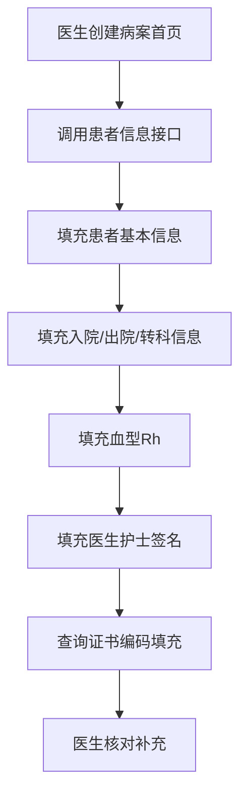
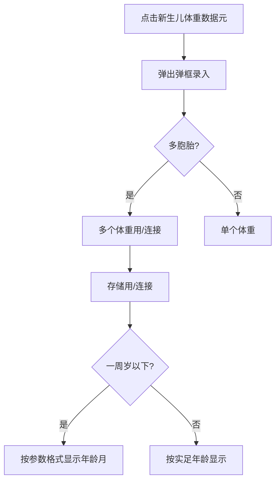

# BLGL-13-BASY-002患者基本信息自动获取_ Analyst - Spec

> **需求编号**：BLGL-13-BASY-002
> **父需求**：BLGL-13-BASY
> **关联PM Spec**：BLGL-13-BASY-002_患者基本信息自动获取_PM-spec.md
> **Spec版本**：V1.0
> **编写时间**：2026-08-13
> **编写人**：需求分析师

---

## 一、功能编号体系

### 1.1 功能层级结构

```
BLGL-13-BASY-002: 患者基本信息自动获取
  ├─ BLGL-13-BASY-002-01: 患者基本信息获取
  ├─ BLGL-13-BASY-002-02: 入院/出院/转科信息获取
  ├─ BLGL-13-BASY-002-03: 血型/Rh血型获取
  ├─ BLGL-13-BASY-002-04: 员工签名与证书编码获取
  ├─ BLGL-13-BASY-002-05: 地址信息获取
  └─ BLGL-13-BASY-002-06: 新生儿体重与年龄显示
```

### 1.2 功能编号表

| REQ-ID | 功能名称 | 类型 | 优先级 | 说明 |
|--------|---------|------|--------|------|
| BLGL-13-BASY-002-01 | 患者基本信息获取 | 功能 | P0 | 姓名/性别/出生日期/年龄/民族/证件等自动获取 |
| BLGL-13-BASY-002-02 | 入院/出院/转科信息获取 | 功能 | P1 | 入院出院科室病区、转科科别自动获取 |
| BLGL-13-BASY-002-03 | 血型/Rh血型获取 | 功能 | P0 | 从患者入区健康状况获取 |
| BLGL-13-BASY-002-04 | 员工签名与证书编码获取 | 功能 | P0 | 医生护士签名与证书编码自动获取 |
| BLGL-13-BASY-002-05 | 地址信息获取 | 功能 | P1 | 出生地/籍贯/现住址/户口/工作单位及邮编 |
| BLGL-13-BASY-002-06 | 新生儿体重与年龄显示 | 功能 | P1 | 多胞胎体重录入与年龄显示格式 |

---

## 二、核心业务流程

### 2.1 患者基本信息获取流程



### 2.2 新生儿体重与年龄显示流程



---

## 三、功能规格说明

### BLGL-13-BASY-002-01: 患者基本信息获取

#### 3.1.1 功能概述

从患者头像/患者端获取姓名、性别代码、出生日期、年龄、国籍代码、民族、证件类型、身份证件号码、职业类别代码、婚姻状况代码等基本信息自动填充首页。

#### 3.1.2 用户角色

| 角色 | 使用场景 | 权限要求 | 操作频率 |
|------|---------|---------|---------|
| 住院医生 | 创建首页查看自动获取的基本信息 | 病历书写权限 | 高频 |
| 责任护士 | 查看首页患者信息 | 病历查看权限 | 中频 |

#### 3.1.3 业务流程（Given/When/Then）

##### 主流程（1 个）

**Scenario 1: 创建首页获取患者基本信息**

```gherkin
Given:
  - 患者已入区，住院信息已填写
  - 参数"住院病历是否启用病案首页"=是

When:
  - 医生创建病案首页
  - 系统调用患者信息接口

Then:
  - 姓名、性别代码、出生日期、年龄、国籍代码、民族、证件类型、身份证件号码、职业类别代码、婚姻状况代码自动填充
  - 首页字段与患者头像信息一致
```

##### 异常流程（3 个）

**Scenario 2: 业务异常——同步清空医生填写**

```gherkin
Given:
  - 医生已在首页手工填写主治医师签名
  - 患者信息中该医师姓名为空
  - 未配置"病案首页不需要自动获取的元素"

When:
  - 医生点击同步按钮

Then:
  - 患者信息为空的医师姓名会清空医生已填写的姓名（存在该缺陷）
```

**Scenario 3: 数据异常——患者信息字段缺失**

```gherkin
Given:
  - 患者信息中某字段（如职业类别）为空

When:
  - 系统获取患者基本信息

Then:
  - 该字段首页留空
  - 医生可手工补充
```

**Scenario 4: 系统异常——患者信息接口超时**

```gherkin
Given:
  - 患者信息接口超时

When:
  - 医生创建病案首页

Then:
  - 首页创建成功，基本信息字段留空
  - 医生可通过同步按钮/打开患者头像重新获取
```

##### 边界流程（2 个）

**Scenario 5: 边界——健康卡号获取**

```gherkin
Given:
  - 患者身份类型标识代码为居民健康卡

When:
  - 系统获取健康卡号

Then:
  - 对应的身份标识号码作为健康卡号填充（概念ID 399300431，）
```

**Scenario 6: 边界——无健康卡患者**

```gherkin
Given:
  - 患者无居民健康卡

When:
  - 系统获取健康卡号

Then:
  - 健康卡号字段为空
```

#### 3.1.5 验收标准

| AC编号 | 验收标准 | 对应REQ-ID | 验证方法 | 验证场景 |
|--------|---------|-----------|---------|---------|
| AC-001 | 创建首页后姓名、性别、出生日期、年龄、民族等自动填充且与患者头像一致 | BLGL-13-BASY-002-01 | 功能测试 | Scenario 1 |
| AC-002 | 患者身份为居民健康卡时健康卡号自动填充 | BLGL-13-BASY-002-01 | 功能测试 | Scenario 5 |

---

### BLGL-13-BASY-002-02: 入院/出院/转科信息获取

#### 3.2.1 功能概述

自动获取入院途径代码、入院/出院科室名称、入院/出院病区名称、入院/出院日期时间、实际住院天数、转科科别等信息。

#### 3.2.2 用户角色

| 角色 | 使用场景 | 权限要求 | 操作频率 |
|------|---------|---------|---------|
| 住院医生 | 查看首页入院出院信息 | 病历书写权限 | 高频 |

#### 3.2.3 业务流程（Given/When/Then）

##### 主流程（1 个）

**Scenario 1: 入院出院信息获取**

```gherkin
Given:
  - 患者已入区且已出区

When:
  - 医生创建病案首页

Then:
  - 入院途径代码、入院科室、入院病区、入院日期时间自动获取
  - 出院科室、出院病区、出院日期时间自动获取
  - 实际住院天数按"出院时间-入院时间"计算
```

##### 异常流程（3 个）

**Scenario 2: 业务异常——出院时间取值优先级**

```gherkin
Given:
  - 患者已出区且有出院医嘱

When:
  - 首页创建获取出院日期时间

Then:
  - 优先取患者出区时间
  - 无出区时间时取患者出院医嘱中的出院时间
```

**Scenario 3: 数据异常——转科信息多次转科**

```gherkin
Given:
  - 患者A→B→C转科

When:
  - 首页获取转科科别

Then:
  - 转科科别显示"B→C"（概念ID 399336492，）
```

**Scenario 4: 系统异常——出区时间接口异常**

```gherkin
Given:
  - 出区时间接口异常

When:
  - 首页获取出院日期时间

Then:
  - 取出院医嘱中的出院时间作为兜底
```

##### 边界流程（2 个）

**Scenario 5: 边界——未转科患者**

```gherkin
Given:
  - 患者未转科

When:
  - 首页获取转科科别

Then:
  - 转科科别为空
```

**Scenario 6: 边界——死亡患者出院时间**

```gherkin
Given:
  - 患者死亡

When:
  - 首页获取出院日期时间

Then:
  - ⏳ 待确认：死亡患者出院时间自动取死亡时间（已分析）
```

#### 3.2.5 验收标准

| AC编号 | 验收标准 | 对应REQ-ID | 验证方法 | 验证场景 |
|--------|---------|-----------|---------|---------|
| AC-001 | 多次转科时转科科别显示"B→C" | BLGL-13-BASY-002-02 | 功能测试 | Scenario 3 |
| AC-002 | 出院日期时间优先取出区时间，无则取出院医嘱时间 | BLGL-13-BASY-002-02 | 功能测试 | Scenario 2 |

---

### BLGL-13-BASY-002-03: 血型/Rh血型获取

#### 3.3.1 功能概述

病案首页中血型和Rh字段自动获取到患者的入区健康状况中的血型和Rh。

#### 3.3.2 用户角色

| 角色 | 使用场景 | 权限要求 | 操作频率 |
|------|---------|---------|---------|
| 住院医生 | 查看首页血型信息 | 病历书写权限 | 高频 |

#### 3.3.3 业务流程（Given/When/Then）

##### 主流程（1 个）

**Scenario 1: 血型Rh自动获取**

```gherkin
Given:
  - 患者入区健康状况已登记血型和Rh

When:
  - 医生创建病案首页

Then:
  - 血型和Rh自动获取填充首页
  - 血型显示符合映射规则（Rh值映射：1阴、2阳、3不详、4未查，）
```

##### 异常流程（3 个）

**Scenario 2: 业务异常——三方Rh值映射**

```gherkin
Given:
  - 三方传的Rh值为"阳性+"

When:
  - 后端查询接口返回

Then:
  - 映射为值"2阳性"，不直接显示"阳性+"
```

**Scenario 3: 数据异常——血型未登记**

```gherkin
Given:
  - 患者入区健康状况无血型登记

When:
  - 创建首页获取血型

Then:
  - 血型字段为空
  - 医生可手工补充
```

**Scenario 4: 系统异常——血型接口异常**

```gherkin
Given:
  - 血型获取接口异常

When:
  - 创建首页

Then:
  - 血型字段留空，首页正常创建
```

##### 边界流程（2 个）

**Scenario 5: 边界——血型数字显示**

```gherkin
Given:
  - 参数控制血型显示方式为数字

When:
  - 首页显示血型

Then:
  - 血型以数字显示（A/B/AB/O型改为数字，）
```

**Scenario 6: 边界——血型文字显示**

```gherkin
Given:
  - 血型显示方式为文字

When:
  - 首页显示血型

Then:
  - 血型以文字显示（A/B/AB/O型）
```

#### 3.3.5 验收标准

| AC编号 | 验收标准 | 对应REQ-ID | 验证方法 | 验证场景 |
|--------|---------|-----------|---------|---------|
| AC-001 | 血型和Rh从患者入区健康状况自动获取 | BLGL-13-BASY-002-03 | 功能测试 | Scenario 1 |
| AC-002 | 三方传"阳性+"时映射为"2阳性" | BLGL-13-BASY-002-03 | 集成测试 | Scenario 2 |

---

### BLGL-13-BASY-002-04: 员工签名与证书编码获取

#### 3.4.1 功能概述

病案首页中科主任、主任（副主任）医师、主治医师、住院医师、责任护士、进修医师、实习医师、质控护士、质控医师、责任医师在患者入区时住院信息会填写，创建病案首页时获取就诊住院信息上的医生和护士信息填充到首页。医师证书编码根据选择的医师名称查询主数据自动获取。

#### 3.4.2 用户角色

| 角色 | 使用场景 | 权限要求 | 操作频率 |
|------|---------|---------|---------|
| 住院医生 | 查看首页自动获取的签名 | 病历书写权限 | 高频 |
| 责任护士 | 查看首页责任护士签名 | 病历查看权限 | 中频 |

#### 3.4.3 业务流程（Given/When/Then）

##### 主流程（1 个）

**Scenario 1: 员工签名与证书编码获取**

```gherkin
Given:
  - 患者入区时住院信息已填写医生和护士信息

When:
  - 医生创建病案首页

Then:
  - 科主任、主任（副主任）医师、主治医师、住院医师、责任护士等签名自动填充
  - 根据选择的医师名称查询主数据，证书编码自动获取并落库
  - 签名按模板配置显示为文本或图片
```

##### 异常流程（3 个）

**Scenario 2: 业务异常——无签名图片**

```gherkin
Given:
  - 动态数据配置为"员工签名链接地址"
  - 选中员工未维护签名图片

When:
  - 首页显示该员工签名

Then:
  - 自动生成文字图片显示
```

**Scenario 3: 数据异常——证书编码无返回**

```gherkin
Given:
  - 主数据接口查询证书编码无返回

When:
  - 首页填写医师数据元

Then:
  - 证书编码为空
  - 首页正常保存，后续同步补齐
```

**Scenario 4: 系统异常——签名图片服务异常**

```gherkin
Given:
  - 签名图片服务异常

When:
  - 首页显示图片签名

Then:
  - 降级为文字签名显示
```

##### 边界流程（2 个）

**Scenario 5: 边界——医师姓名变更**

```gherkin
Given:
  - 首页已填写医师姓名后医师变更

When:
  - 医生修改医师数据元

Then:
  - 证书编码同步变更（创建/下拉选择/同步三类场景，）
```

**Scenario 6: 边界——签名元素CA签名配置**

```gherkin
Given:
  - 参数"病案首页中哪些签名元素使用CA签名"配置了科主任签名

When:
  - 首页未提交状态点击科主任签名元素

Then:
  - 调用CA签名进行签署
```

#### 3.4.5 验收标准

| AC编号 | 验收标准 | 对应REQ-ID | 验证方法 | 验证场景 |
|--------|---------|-----------|---------|---------|
| AC-001 | 创建首页时员工签名自动填充 | BLGL-13-BASY-002-04 | 功能测试 | Scenario 1 |
| AC-002 | 医师姓名变更时证书编码同步变更 | BLGL-13-BASY-002-04 | 功能测试 | Scenario 5 |
| AC-003 | 无签名图片时自动生成文字图片 | BLGL-13-BASY-002-04 | 功能测试 | Scenario 2 |

---

### BLGL-13-BASY-002-05: 地址信息获取

#### 3.5.1 功能概述

地址信息通常需填写到区/县级。点击元素可弹出地区选择弹框，选择后存储地区编码和名称。现住址/户口地址/工作单位信息从患者信息获取，邮编可根据地址自动获取。

#### 3.5.2 用户角色

| 角色 | 使用场景 | 权限要求 | 操作频率 |
|------|---------|---------|---------|
| 住院医生 | 填写首页地址信息 | 病历书写权限 | 中频 |

#### 3.5.3 业务流程（Given/When/Then）

##### 主流程（1 个）

**Scenario 1: 地址信息获取**

```gherkin
Given:
  - 患者信息已维护现住址/户口地址/工作单位

When:
  - 医生创建首页

Then:
  - 现住址/户口地址/工作单位信息自动获取
  - 邮编根据地址自动获取（患者组件配置勾选"是否展示邮编"）
  - 出生地/籍贯可点击弹出地区选择弹框
```

##### 异常流程（3 个）

**Scenario 2: 业务异常——地址录入不符合要求**

```gherkin
Given:
  - 首页地址信息录入不符合要求

When:
  - 医生提交病案首页

Then:
  - 智能提醒提示详细信息
```

**Scenario 3: 数据异常——地址邮编无自动匹配**

```gherkin
Given:
  - 患者组件未勾选"是否展示邮编"

When:
  - 首页获取地址信息

Then:
  - 邮编字段不自动获取
```

**Scenario 4: 系统异常——地区选择接口异常**

```gherkin
Given:
  - 地区选择弹框接口异常

When:
  - 医生点击地址元素

Then:
  - 弹框加载失败提示，地址不修改
```

##### 边界流程（2 个）

**Scenario 5: 边界——地址省市县元素拆分**

```gherkin
Given:
  - 首页模板出生地改为省、市、县三个元素，籍贯省、市两个元素

When:
  - 医生填写地址

Then:
  - 5个元素均可选择到地址
```

**Scenario 6: 边界——地址详情拼接**

```gherkin
Given:
  - 工作单位及详细地址需拆分存储

When:
  - 首页获取工作单位地址

Then:
  - 工作单位省/市/县/乡编码及详细地址分别落库
```

#### 3.5.5 验收标准

| AC编号 | 验收标准 | 对应REQ-ID | 验证方法 | 验证场景 |
|--------|---------|-----------|---------|---------|
| AC-001 | 地址信息从患者信息自动获取，邮编按配置自动获取 | BLGL-13-BASY-002-05 | 功能测试 | Scenario 1 |
| AC-002 | 地址录入不符合要求时提交提示详细信息 | BLGL-13-BASY-002-05 | 功能测试 | Scenario 2 |

---

### BLGL-13-BASY-002-06: 新生儿体重与年龄显示

#### 3.6.1 功能概述

新生儿体重支持多胞胎录入，多个体重用"/"连接并存储；年龄按一周岁以下/以上格式参数显示。

#### 3.6.2 用户角色

| 角色 | 使用场景 | 权限要求 | 操作频率 |
|------|---------|---------|---------|
| 住院医生 | 录入新生儿体重、查看年龄 | 病历书写权限 | 中频 |
| 护士 | 新生儿登记 | 护理登记权限 | 中频 |

#### 3.6.3 业务流程（Given/When/Then）

##### 主流程（1 个）

**Scenario 1: 新生儿体重录入**

```gherkin
Given:
  - 新生儿期住院患儿/产妇病历

When:
  - 医生点击新生儿体重数据元弹出弹框

Then:
  - 支持录入新生儿体重，多胞胎多个体重用"/"连接
  - 存储时也用"/"连接
```

##### 异常流程（3 个）

**Scenario 2: 业务异常——年龄天数超过配置不填充**

```gherkin
Given:
  - 参数"年龄大于多少天时新生儿出生体重不填充"设置为2天
  - 患儿年龄3天

When:
  - 首页获取新生儿出生体重

Then:
  - 新生儿出生体重不填充，不带出值
```

**Scenario 3: 数据异常——新生儿入院体重无登记**

```gherkin
Given:
  - 护士站新生儿登记处无入院体重

When:
  - 首页获取新生儿入院体重

Then:
  - 入院体重字段为空
```

**Scenario 4: 系统异常——年龄格式参数异常**

```gherkin
Given:
  - 年龄显示格式参数配置错误

When:
  - 首页显示患儿年龄

Then:
  - 按默认格式（2 15/30月）显示
```

##### 边界流程（2 个）

**Scenario 5: 边界——一周岁以下年龄格式**

```gherkin
Given:
  - 患儿实足年龄2个月又15天
  - 参数=2（2 15/30月）

When:
  - 首页显示年龄

Then:
  - 年龄月显示"2 15/30月"（概念ID 399336375）
```

**Scenario 6: 边界——不满一周岁年龄月是否都填写**

```gherkin
Given:
  - 参数"不满一周岁是否首页上年龄和年龄月是否都填写"=否

When:
  - 首页显示一周岁以下患儿年龄

Then:
  - 只需填写年龄月，不填年龄
```

#### 3.6.5 验收标准

| AC编号 | 验收标准 | 对应REQ-ID | 验证方法 | 验证场景 |
|--------|---------|-----------|---------|---------|
| AC-001 | 多胞胎新生儿体重用"/"连接录入并存储 | BLGL-13-BASY-002-06 | 功能测试 | Scenario 1 |
| AC-002 | 一周岁以下年龄按"2 15/30月"格式显示 | BLGL-13-BASY-002-06 | 功能测试 | Scenario 5 |
| AC-003 | 年龄超过配置天数时新生儿体重不填充 | BLGL-13-BASY-002-06 | 功能测试 | Scenario 2 |

---

## 四、排除范围

本需求不包含以下功能项：

1. **诊断信息同步与录入** - 归属 BLGL-13-BASY-003
2. **手术信息获取与管理** - 归属 BLGL-13-BASY-004
3. **费用信息获取与更新** - 归属 BLGL-13-BASY-005
4. **重症监护与三方数据获取** - 归属 BLGL-13-BASY-006
5. **首页参数与映射配置** - 归属 BLGL-13-BASY-010

---

## 五、业务规则清单

| 规则ID | 规则名称 | 规则描述 | 来源 | 优先级 |
|--------|---------|---------|------|--------|
| BR-001 | 患者基本信息自动获取 | 姓名、性别、出生日期、年龄、民族、国籍、证件类型、身份证件号码、职业类别、婚姻状况从患者头像获取 | 、DATA002 | P0 |
| BR-002 | 血型Rh获取 | 血型和Rh从患者入区健康状况自动获取 | | P0 |
| BR-003 | 转科科别格式 | 多次转科用"→"连接，如B→C | | P1 |
| BR-004 | 出院时间取值 | 优先取患者出区时间，无则取出院医嘱时间 | | P1 |
| BR-005 | 员工签名获取 | 创建首页时获取就诊住院信息的医生护士信息填充签名 | | P0 |
| BR-006 | 证书编码获取 | 填写医师数据元时按医师姓名查询主数据获取证书编码并落库 | | P0 |
| BR-007 | 签名显示方式 | 动态数据配置"员工签名链接地址"取签名图片，否则文本 | | P1 |
| BR-008 | 新生儿体重多胞胎 | 多个体重用"/"连接录入与存储 | | P1 |
| BR-009 | 年龄显示格式 | 一周岁以下按参数格式显示年龄月（几月几天/2 15/30月） | | P1 |

---

## 六、关联文档

| 文档类型 | 文档路径 | 说明 |
|---------|---------|------|
| PM-Spec（业务视角） | 本目录 BLGL-13-BASY-002_患者基本信息自动获取_PM-spec.md（V0.1） | PM 产出的 Spec 文档 |
| Spec（研发视角） | 本目录 BLGL-13-BASY-002_患者基本信息自动获取-Spec.md（V1.0） | 业务背景与目标 Spec |
| 功能点Spec（模块级） | BLGL-13-BASY 13病案首页功能点Spec.md（V1.0，上级目录） | Phase 1 功能点索引 |
| data-model.md | 待产出 | 架构师产出的数据建模文档 |
| design.md | 待产出 | 架构师产出的技术方案文档 |
| api-contract.md | 待产出 | 开发经理产出的 API 契约文档 |

---

## 七、待确认问题清单

| 编号 | 问题描述 | 缺失信息 | 影响范围 | 建议补充方 |
|------|---------|---------|---------|-----------|
| Q-001 | 患者信息为空时清空医生填写内容的具体参数名 | 参数配置 | 患者基本信息获取 | 产品经理 |
| Q-002 | 死亡患者出院时间自动取死亡时间的具体实现 | 取值规则 | 出院时间获取 | 产品经理 |
| Q-003 | 首页生命周期状态定义 | 状态机 | 数据模型-状态定义 | 产品经理 |
| Q-004 | 患者信息获取性能指标 | 性能指标 | 非功能性要求 | 产品经理 |

---

## 填写检查清单

| 序号 | 检查项 | 是否完成 |
|:----:|--------|:--------:|
| 1 | 功能编号带父子层级 | ✅ |
| 2 | 每个 REQ-ID 有功能概述和用户角色 | ✅ |
| 3 | 主流程至少 1 个 Given/When/Then 场景 | ✅ |
| 4 | 异常流程至少 3 个 Given/When/Then 场景 | ✅ |
| 5 | 边界流程至少 2 个 Given/When/Then 场景 | ✅ |
| 6 | 每个 Given/When/Then 内容具体，不模糊 | ✅ |
| 7 | 数据字段定义完整（字段名、类型、必填、说明、概念ID） | ✅ |
| 8 | 验收标准 AC 编号独立，可验证 | ✅ |
| 9 | 验收标准无"功能正常"等模糊表述 | ✅ |
| 10 | 排除范围明确列出 | ✅ |
| 11 | 业务规则清单列出所有规则，每条标注来源 | ✅ |
| 12 | 流程图使用 Mermaid 格式（≥2 个） | ✅ |
| 13 | 关联文档索引包含 Phase 1 功能点Spec | ✅ |
| 14 | 待确认问题清单汇总了全文所有 ⏳ 项 | ✅ |
| 15 | 全文无占位符 `< >` 残留 | ✅ |
| 16 | 全文陈述可溯源至资料区（S1~S10 溯源核查） | ✅ |
| 17 | 人工审核确认完成 | ⏳ 待确认 |

---

**文档状态**：⬜ 待审核
**维护责任**：需求分析师规范组
**下次更新**：根据评审反馈优化

---

## 版本历史

| 版本 | 日期 | 变更说明 | 编写人 |
|------|------|---------|--------|
| V1.0 | 2026-08-13 | 初始版本 | 需求分析师 |
