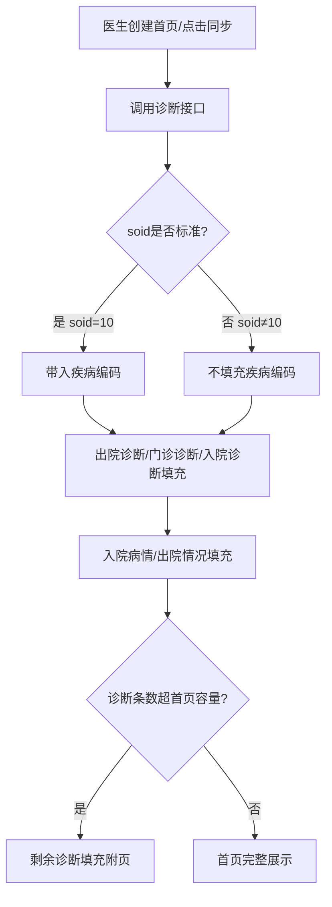
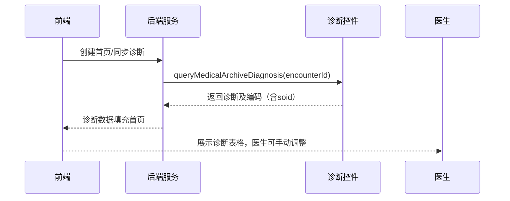

# BLGL-13-BASY-003 诊断信息同步与录入 - Spec

> **功能编号**：BLGL-13-BASY-003
> **文档类型**：Spec（研发视角）
> **文档版本**：V1.0
> **编写时间**：2026-08-13
> **编写人**：RACC

---

## 文档索引

本节提供本文档的章节结构索引与关联文档索引，便于读者快速定位与检索。

#### 章节索引

**Spec（研发视角）**

| 章节号 | 章节名称 | 内容说明 |
|--------|---------|---------|
| 1、 | 文档概述 | 文档目的、文档范围、术语定义、阅读指南、参考文档 |
| 2、 | 功能背景与定位 | 功能背景、功能定位、目标用户、核心价值 |
| 3、 | 业务流程设计 | 主流程/异常流程/边界流程（Given/When/Then） |
| 4、 | 数据模型设计 | 核心数据结构、状态定义、系统参数定义 |
| 5、 | 接口契约设计 | API列表、接口详细设计、错误码定义 |
| 6、 | 技术方案设计 | 页面路径、技术栈、关键技术点、部署方案 |
| 7、 | 测试用例预设计 | 功能/边界/异常/性能测试用例 |
| 8、 | 非功能性要求 | 性能、安全、可用性、兼容性 |
| 9、 | 依赖与风险 | 外部依赖、风险项 |
| 10、 | 附录 | 流程图、时序图、参考文档 |

**PM-Spec（业务视角）**

| 章节号 | 章节名称 | 内容说明 |
|--------|---------|---------|
| 一 | 目标 | 功能定位与核心价值 |
| 二 | 约束 | 业务/技术/非功能性约束 |
| 三 | 验收标准 | 验收条件与验证方法 |
| 四 | 排除范围 | 本次不做项与明确边界 |
| 五 | 关键决策记录 | 方案决策与选型理由 |
| 六 | 优先级 | 优先级定义 |
| 七 | 关联文档 | 关联文档索引 |
| 附录 | 填写检查清单 | 质量检查 |

**Analyst-Spec（产品视角）**

| 章节号 | 章节名称 | 内容说明 |
|--------|---------|---------|
| 一 | 功能编号体系 | 带父子层级的编号树 |
| 二 | 核心业务流程 | Mermaid 流程图 |
| 三 | 功能规格说明 | 各子功能点的概述、用户角色、业务流程、验收标准 |
| 四 | 排除范围 | 本需求不包含的功能项 |
| 五 | 业务规则清单 | 规则ID、规则名称、规则描述、优先级 |
| 六 | 关联文档 | 文档类型、文档路径、说明 |
| 七 | 待确认问题清单 | 所有 ⏳ 待确认项的汇总 |
| - | 填写检查清单 | 检查项与完成状态 |

#### 版本历史

| 版本 | 日期 | 变更说明 | 编写人 |
|------|------|---------|--------|
| V1.0 | 2026-08-13 | 初始版本 | RACC |

#### 关联文档索引

| 序号 | 文档名称 | 文档类型 | 版本 | 位置 |
|------|---------|---------|------|------|
| 1 | BLGL-13-BASY-003_诊断信息同步与录入_PM-spec.md | PM-Spec（业务视角） | V0.1 | 本目录 |
| 2 | BLGL-13-BASY-003_诊断信息同步与录入_Analyst-spec.md | Analyst-Spec（产品视角） | V1.0 | 本目录 |
| 3 | BLGL-13-BASY-003_诊断信息同步与录入-Spec.md | Spec（研发视角） | V1.0 | 本目录 |
| 4 | BLGL-13-BASY 13病案首页功能点Spec.md | 功能点Spec（模块级） | V1.0 | 上级目录 |

---

## 1、文档概述

### 1.1、文档目的

本文档旨在明确"诊断信息同步与录入"功能（BLGL-13-BASY-003）的业务背景与设计方案，为需求分析、研发实现、测试验收及评审提供统一的业务上下文、设计口径与决策依据。

**具体目的包括**：

1. 梳理诊断信息同步与录入功能的业务由来与历史需求演进脉络，说明"为什么要做"；
2. 明确功能的定位边界、目标用户与核心价值，回答"做成什么"；
3. 描述功能的业务流程、数据模型、接口契约与技术方案，回答"怎么做"；
4. 预设计测试用例并明确非功能性要求、依赖与风险，为研发与验收提供依据；
5. 作为 SPEC（功能编号体系、功能详情、业务规则、验收标准等章节）的业务前提与设计输入，保证各层文档业务口径一致。

### 1.2、文档范围

#### 1.2.1 纳入范围

本文档覆盖诊断信息同步与录入的完整业务背景与设计，包括：

- 出院诊断及编码自动同步（西医/中医分开获取）
- 门诊诊断及编码自动获取（支持配置是否只显示主诊断）
- 入院诊断及编码获取
- 诊断控件弹出诊断录入
- 诊断显示格式与排序（自增长/延伸排序/分栏排序）
- 标准/非标准诊断编码处理（soid判断）
- 入院病情/出院情况自动获取
- 中医诊断引用（病、证、治则治法）

#### 1.2.2 排除范围

本文档不涉及以下内容（详见其他功能点或模块）：

- 患者基本信息自动获取——见 BLGL-13-BASY-002
- 手术信息获取与管理——见 BLGL-13-BASY-004
- 首页提交与校验——见 BLGL-13-BASY-007
- 诊断相关规则校验——见 BLGL-13-BASY-007（提交校验）

### 1.3、术语定义

| 术语 | 定义 |
|------|------|
| 诊断控件 | 病历书写中管理诊断信息的控件，首页诊断数据源 |
| 出院诊断 | 患者出院时的诊断，含西医/中医 |
| 门诊诊断 | 患者门诊就诊的诊断，支持只显示主诊断 |
| 标准诊断 | soid为10的诊断，可带入疾病编码 |
| 非标准诊断 | soid为非10的诊断，不带入疾病编码 |
| 入院病情 | 诊断对应的入院时病情状态（概念ID 391002119） |
| 出院情况 | 诊断对应的出院时情况（概念ID 391002135） |
| 中医诊断 | 中医出院诊断/门诊诊断，含病、证、治则治法 |

### 1.4、阅读指南

- **章节关系**：第1~2章为阅读铺垫与业务全貌（背景、定位、用户、价值）；第3~10章为设计实现层（流程、数据、接口、技术、测试、非功能、依赖风险、附录），可直接用于研发与测试。与 Analyst-Spec、PM-Spec 的详细规则/验收口径互相引用，保持一致。
- **读者对象**：
  - 产品经理/需求分析师：阅读第1~2章了解业务全貌，据此维护 PM-Spec 与功能清单；
  - 研发：阅读第3~6章用于开发实现，第9~10章用于依赖评估与联调；
  - 测试：阅读第3章、第7~8章用于用例设计与验收；
  - 评审人员：以本文档为业务口径与设计基准，核对各层文档一致性。

### 1.5、参考文档

| 序号 | 文档名称 | 版本/日期 |
|------|---------|----------|
| 1 | 【历史需求】病案首页需求-0727.xlsx | - |
| 2 | BLGL-13-BASY-003_诊断信息同步与录入_PM-spec.md | V0.1 |
| 3 | BLGL-13-BASY-003_诊断信息同步与录入_Analyst-spec.md | V1.0 |
| 4 | BLGL-13-BASY 13病案首页功能点Spec.md | V1.0 |
| 5 | WiNEX-病案首页_功能清单_20260325_162900.md | 2026-03-25 |

---

## 2、功能背景与定位

### 2.1 功能背景

诊断信息同步与录入是病案首页的核心数据内容，需满足：

- **法规/规范依据**：病案首页需满足《江苏省病历书写规范》
- **管理要求**：诊断信息需从诊断控件自动同步，保证首页诊断与病历一致
- **现状痛点**：诊断显示顺序与诊断控件不一致，子诊断被放到附页
- **历史需求演进**：从"出院诊断及编码获取"→"门诊诊断及编码获取"→"入院病情/出院情况同步"→"非标准诊断不显示编码"→"诊断显示顺序调整"

### 2.2 功能定位

"诊断信息同步与录入"是WiNEX病历管理-病案首页模块的核心数据层，定位为：

- **数据同步定位**：首页诊断从诊断控件自动同步
- **编码规范定位**：标准/非标准诊断编码处理
- **显示格式定位**：诊断表格填充与排序规则

### 2.3 目标用户

| 用户角色 | 主要使用场景 |
|---------|-------------|
| 住院医生 | 查看/录入首页诊断、点击诊断元素弹出诊断控件 |

### 2.4 核心价值

| 价值维度 | 价值描述 |
|---------|---------|
| 数据一致性 | 首页诊断与诊断控件一致 |
| 编码准确性 | 标准/非标准诊断编码区分处理 |
| 效率提升 | 诊断自动同步，避免重复录入 |

---

## 3、业务流程设计（Given/When/Then）

### 3.1 主流程

**Scenario 1: 出院诊断自动同步**

```gherkin
Given:
  - 患者诊断控件已录入出院诊断
  - 参数"住院病历是否启用病案首页"=是

When:
  - 医生创建病案首页或点击同步诊断
  - 系统调用诊断接口

Then:
  - 出院诊断及编码自动同步，西医诊断和中医诊断分开获取
  - 获取后根据表格中的出院诊断元素从上到下从左到右填充
  - 入院病情/出院情况同步获取填充
```

### 3.2 异常流程

**Scenario 2: 业务异常——非标准诊断不显示编码**

```gherkin
Given:
  - 诊断为非标准诊断（soid为非10）

When:
  - 新建首页/首页新增诊断/同步诊断数据

Then:
  - 疾病编码不自动填充
```

**Scenario 3: 数据异常——诊断接口无返回**

```gherkin
Given:
  - 诊断控件接口无返回诊断数据

When:
  - 医生点击同步诊断

Then:
  - 首页诊断表格不新增内容
  - 保留已填写诊断
```

**Scenario 4: 系统异常——诊断接口超时**

```gherkin
Given:
  - 诊断接口超时

When:
  - 医生创建首页触发诊断获取

Then:
  - 首页诊断表格为空
  - 医生可点击诊断元素手动录入
  - 记录系统异常日志
```

### 3.3 边界流程

**Scenario 5: 边界场景——门诊诊断主诊断配置**

```gherkin
Given:
  - 参数"病案首页的门诊诊断是否只显示主诊断"=是

When:
  - 系统获取门诊诊断

Then:
  - 只获取第一条主诊断
  - 参数=否时获取全部诊断，诊断用"、"连接，编码也用"、"连接
```

**Scenario 6: 边界场景——诊断条数超首页容量填充附页**

```gherkin
Given:
  - 首页模板出院诊断元素有限
  - 患者诊断条数超过首页容量

When:
  - 系统获取诊断

Then:
  - 首页无法展示完的诊断填充至附页
  - 附页支持展示剩余诊断信息
```

---

## 4、数据模型设计

### 4.1 核心数据结构

#### 4.1.1 核心保存请求

| 字段名 | 类型 | 必填 | 备注 |
|--------|------|------|------|
| encounterId | Long | 是 | 患者就诊标识 |
| 诊断名称 | String | 是 | 出院/门诊/入院诊断名称 |
| 诊断编码 | String | 是 | 标准诊断带入编码 |
| 入院病情 | String | 否 | 概念ID 391002119 |
| 出院情况 | String | 否 | 概念ID 391002135 |

#### 4.1.2 核心表/实体

| 表/实体 | 关键字段 | 说明 |
|---------|---------|------|
| INP_EMR_MAHP_DIAG | inpEmrMahpDiagId, encounterId, 诊断字段 | 首页诊断表 |

### 4.2 状态定义

| 状态码 | 状态名称 | 说明 |
|--------|---------|------|
| ⏳ 待确认 | 诊断上报状态 | 是否上报/上报序号 |

### 4.3 系统参数定义

| 参数编码 | 参数名称 | 说明 |
|---------|---------|------|
| MEDICAL005 | 病案首页的门诊诊断是否只显示主诊断，默认是 | 控制门诊诊断显示 |
| 出院诊断疾病编码取值方式 | 诊断编码取值方式（院内编码/标准编码） | 控制诊断编码取值 |
| 出院诊断诊断名称取值方式 | 诊断名称取值（诊断描述/诊断说明） | 控制诊断名称取值 |
| MEDICAL019 | 病案首页诊断/手术表格行填充模式 | 行自增长/附页填充 |
| 首页诊断为自增长模式时诊断排序模式设置 | 延伸排序/分栏排序，默认延伸排序 | 控制诊断排序 |

---

## 5、接口契约设计

### 5.1 API列表

| 序号 | API名称（代码函数） | 路径 | 方法 | 说明 |
|:----:|---------|------|:----:|------|
| 1 | queryMedicalArchiveDiagnosisMatchDataElementByEncounterId | /api/v1/emr_medical_archive_diagnosis/match_data_element/query/by_encounter_id | POST | 诊断信息匹配数据元查询 |
| 2 | saveInpatientEmrMedicalArchiveDiagnosis | /api/v1/emr/medical_archive/diagnosis/save | POST | 保存首页诊断数据 |
| 3 | queryInpatientEmrMahpDiagByExample | /api/v1/emr/medical_archive/diagnosis/query | POST | 查询首页诊断数据 |
| 4 | updateInpatientEmrMahpDiagReportFlag | /api/v1/emr/medical_archive/diag_report_flag/update | POST | 修改诊断上报标志 |

### 5.2 接口详细设计

#### 5.2.1 诊断信息匹配数据元查询

**请求参数**:
```json
{
  "encounterId": 123456
}
```

**返回值（成功）**:
```json
{
  "success": true,
  "data": [
    {
      "diagName": "急性阑尾炎",
      "diagCode": "K35.8",
      "soid": "10",
      "inHospCondition": "1",
      "dischargeCondition": "1"
    }
  ]
}
```

**返回值（失败）**:
```json
{
  "success": false,
  "message": "诊断信息获取失败",
  "data": null
}
```

> 📌 接口路径与函数名来自代码 InpatientMedicalArchiveController；返回结构字段待与接口文档核对，部分为 `⏳ 待确认`。

### 5.3 错误码定义

| 错误码 | 错误信息 | 处理方式 |
|--------|---------|---------|
| ⏳ 待确认 | - | 错误码定义未在资料区找到 |

---

## 6、技术方案设计

### 6.1 页面路径

- **页面路径**: winning-webui-inpatient-clinicalnote-pango/src/pages/EmrMedicalRecord（病历书写容器，首页诊断表格）
- **路由**: 病历目录-病案首页
- **核心逻辑模块**: InpatientEmrMedicalArchiveDiagnosisInfoService、InpatientMedicalArchiveController

### 6.2 技术栈

| 类别 | 技术 | 版本 |
|------|------|------|
| 前端框架 | Vue（winning-webui-inpatient-clinicalnote-pango） | ⏳ 待确认 |
| 后端框架 | Java Spring Boot + Akso MVC | ⏳ 待确认 |

### 6.3 关键技术点

- 诊断接口增加soid字段，前端根据soid判断是否带入疾病编码（标准/非标准诊断，）
- 诊断显示顺序与诊断控件一致，主诊断下方为子诊断
- 中医诊断引用病、证、治则治法，治法跟随证之后单独一行显示

### 6.4 部署方案

⏳ 待确认：部署方案未在资料区中找到

---

## 7、测试用例预设计

### 7.1 功能测试

| 用例编号 | 测试场景 | Given | When | Then |
|---------|---------|-------|------|------|
| TC-001 | 出院诊断自动同步 | 诊断控件已录入出院诊断 | 创建首页/同步 | 出院诊断及编码自动填充 |
| TC-002 | 门诊诊断主诊断配置 | 参数=是 | 获取门诊诊断 | 只显示第一条主诊断 |
| TC-003 | 入院病情出院情况同步 | 诊断控件已录入 | 创建首页 | 入院病情/出院情况自动填充 |

### 7.2 边界测试

| 用例编号 | 测试场景 | Given | When | Then |
|---------|---------|-------|------|------|
| TC-004 | 诊断超容量填充附页 | 诊断条数超首页容量 | 获取诊断 | 剩余诊断填充至附页 |
| TC-005 | 门诊诊断多条连接 | 参数=否 | 获取门诊诊断 | 诊断用"、"连接 |

### 7.3 异常测试

| 用例编号 | 测试场景 | Given | When | Then |
|---------|---------|-------|------|------|
| TC-006 | 非标准诊断不显示编码 | soid非10 | 同步诊断 | 疾病编码不填充 |
| TC-007 | 诊断接口超时 | 接口异常 | 创建首页 | 诊断为空，可手动录入 |

### 7.4 性能测试

| 用例编号 | 测试场景 | 指标 |
|---------|---------|------|
| TC-008 | 诊断获取响应时间 | ⏳ 待确认 |

---

## 8、非功能性要求

### 8.1 性能要求

| 指标 | 要求 |
|------|------|
| 诊断获取响应时间 | ⏳ 待确认 |

### 8.2 安全要求

| 要求 | 说明 |
|------|------|
| 诊断数据准确性 | 诊断编码需遵循标准编码规范 |

**医疗行业特殊要求**

| 要求 | 说明 |
|------|------|
| 诊断编码合法性 | 标准诊断带入编码，非标准诊断不填充编码 |

### 8.3 可用性要求

| 指标 | 要求值 |
|------|--------|
| ⏳ 待确认 | - |

### 8.4 兼容性要求

| 类型 | 要求 |
|------|------|
| 诊断控件接口兼容 | 首页诊断对接诊断控件接口 |

---

## 9、依赖与风险

### 9.1 外部依赖

| 依赖项 | 说明 |
|--------|------|
| 诊断控件 | 首页诊断数据源 |
| 主数据/术语库 | 标准/非标准诊断判断（soid）、诊断编码 |

### 9.2 风险项

| 风险项 | 等级 | 说明 | 应对方案 |
|--------|------|------|---------|
| 诊断顺序不一致 | 中 | 首页引用诊断时子诊断被放附页 | 首页诊断顺序跟诊断控件保持一致 |
| 非标准诊断编码 | 中 | 非标准诊断带入编码会导致数据不准确 | 前端根据soid判断不带入编码 |

---

## 10、附录

### 10.1 流程图



### 10.2 时序图



### 10.3 参考文档

- WiNEX-病案首页_功能清单_20260325_162900.md（第2.3节诊疗信息管理-诊断信息）
- 【历史需求】病案首页需求-0727.xlsx（、239725、298187、287261、989108、856718、1049350、1173009 等）
- BLGL-13-BASY 13病案首页功能点Spec.md（V1.0）
- 关联Spec: BLGL-13-BASY-004 手术信息获取与管理 -Spec.md

---

## 填写检查清单

| 序号 | 检查项 | 是否完成 |
|:----:|--------|:--------:|
| 1 | 章节索引与正文章节一致 | ✅ |
| 2 | 版本历史记录完整 | ✅ |
| 3 | 关联文档索引已登记全部Spec | ✅ |
| 4 | 文档目的明确回答"为什么做/做成什么/怎么做" | ✅ |
| 5 | 纳入范围/排除范围清晰 | ✅ |
| 6 | 术语定义覆盖关键概念，从资料区可溯源 | ✅ |
| 7 | 参考文档已登记 | ✅ |
| 8 | 功能背景基于法规/规范/需求来源组织 | ✅ |
| 9 | 功能定位体现业务价值（3~5个定位点） | ✅ |
| 10 | 目标用户角色覆盖完整，在需求原文中有出处 | ✅ |
| 11 | 核心价值可陈述，与 Phase 1 口径一致 | ✅ |
| 12 | 业务流程：主流程≥1、异常≥3、边界≥2，Given/When/Then 具体 | ✅ |
| 13 | 数据模型：字段/表/状态/参数可溯源（概念ID/表名/参数编码） | ✅ |
| 14 | 接口契约：API列表+详细设计+错误码齐全或标记待确认 | ✅（错误码 ⏳） |
| 15 | 技术方案：页面路径/技术栈/关键点/部署方案或标记待确认 | ✅ |
| 16 | 测试用例：功能/边界/异常/性能覆盖，与第3章场景对应 | ✅ |
| 17 | 非功能性要求：性能/安全/可用性/兼容性指标可量化或标记待确认 | ✅ |
| 18 | 依赖与风险：外部依赖登记完整，风险有具体应对方案或标记待确认 | ✅ |
| 19 | 附录：流程图/时序图与正文流程一致 | ✅ |
| 20 | 全文无占位符 `< >` 残留 | ✅ |
| 21 | 全文陈述可溯源至资料区，无来源的已标记 ⏳ | ✅ |
| 22 | 人工审核确认完成 | ⏳ 待确认 |

---

**文档状态**：⬜ 待审核
**维护责任**：RACC
**下次更新**：根据评审反馈优化
