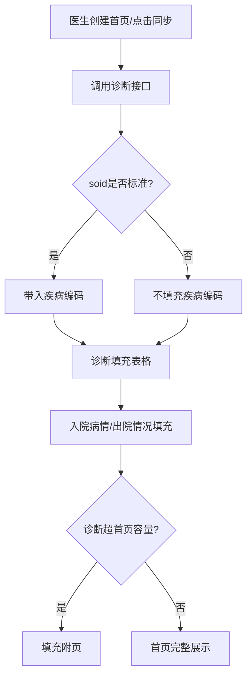
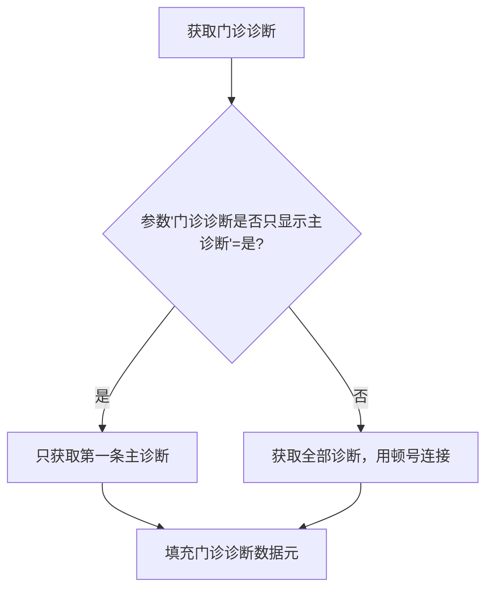

# BLGL-13-BASY-003诊断信息同步与录入_ Analyst - Spec

> **需求编号**：BLGL-13-BASY-003
> **父需求**：BLGL-13-BASY
> **关联PM Spec**：BLGL-13-BASY-003_诊断信息同步与录入_PM-spec.md
> **Spec版本**：V1.0
> **编写时间**：2026-08-13
> **编写人**：需求分析师

---

## 一、功能编号体系

### 1.1 功能层级结构

```
BLGL-13-BASY-003: 诊断信息同步与录入
  ├─ BLGL-13-BASY-003-01: 出院诊断及编码同步
  ├─ BLGL-13-BASY-003-02: 门诊诊断及编码获取
  ├─ BLGL-13-BASY-003-03: 入院诊断及编码获取
  ├─ BLGL-13-BASY-003-04: 诊断显示与排序
  ├─ BLGL-13-BASY-003-05: 标准/非标准诊断编码处理
  ├─ BLGL-13-BASY-003-06: 入院病情与出院情况同步
  └─ BLGL-13-BASY-003-07: 中医诊断引用
```

### 1.2 功能编号表

| REQ-ID | 功能名称 | 类型 | 优先级 | 说明 |
|--------|---------|------|--------|------|
| BLGL-13-BASY-003-01 | 出院诊断及编码同步 | 功能 | P0 | 出院诊断自动同步，西医中医分开 |
| BLGL-13-BASY-003-02 | 门诊诊断及编码获取 | 功能 | P0 | 门诊诊断按主诊断配置获取 |
| BLGL-13-BASY-003-03 | 入院诊断及编码获取 | 功能 | P1 | 入院诊断自动获取 |
| BLGL-13-BASY-003-04 | 诊断显示与排序 | 功能 | P1 | 诊断表格填充与排序规则 |
| BLGL-13-BASY-003-05 | 标准/非标准诊断编码处理 | 功能 | P0 | soid判断是否带编码 |
| BLGL-13-BASY-003-06 | 入院病情与出院情况同步 | 功能 | P1 | 诊断行级入院病情出院情况 |
| BLGL-13-BASY-003-07 | 中医诊断引用 | 功能 | P1 | 病、证、治则治法引用 |

---

## 二、核心业务流程

### 2.1 诊断同步流程



### 2.2 门诊诊断获取流程



---

## 三、功能规格说明

### BLGL-13-BASY-003-01: 出院诊断及编码同步

#### 3.1.1 功能概述

病案首页支持自动同步诊断控件中的出院诊断以及编码，西医诊断和中医诊断分开获取，获取后根据表格中的出院诊断元素从上到下从左到右填充。支持点击病案首页上的诊断元素弹出诊断控件进行诊断录入。

#### 3.1.2 用户角色

| 角色 | 使用场景 | 权限要求 | 操作频率 |
|------|---------|---------|---------|
| 住院医生 | 查看/同步首页出院诊断 | 病历书写权限 | 高频 |

#### 3.1.3 业务流程（Given/When/Then）

##### 主流程（1 个）

**Scenario 1: 出院诊断同步**

```gherkin
Given:
  - 诊断控件已录入出院诊断及编码

When:
  - 医生创建病案首页或点击同步

Then:
  - 出院诊断及编码自动同步，西医中医分开获取
  - 获取后按表格元素从上到下从左到右填充
```

##### 异常流程（3 个）

**Scenario 2: 业务异常——诊断修改未同步**

```gherkin
Given:
  - 患者的诊断修改后，之前填好的首页

When:
  - 医生点击同步按钮

Then:
  - 诊断同步更新（：诊断修改后首页再点同步需同步更新）
```

**Scenario 3: 数据异常——诊断接口无返回**

```gherkin
Given:
  - 诊断控件接口无返回

When:
  - 医生点击同步诊断

Then:
  - 首页诊断表格不新增内容，保留已填写诊断
```

**Scenario 4: 系统异常——诊断接口超时**

```gherkin
Given:
  - 诊断接口超时

When:
  - 医生创建首页触发诊断获取

Then:
  - 首页诊断表格为空，可点击诊断元素手动录入
```

##### 边界流程（2 个）

**Scenario 5: 边界——诊断条数超容量**

```gherkin
Given:
  - 首页模板出院诊断元素有限
  - 患者诊断条数超首页容量

When:
  - 系统获取诊断

Then:
  - 剩余诊断填充至附页
```

**Scenario 6: 边界——诊断名称为空**

```gherkin
Given:
  - 诊断控件中某诊断名称为空

When:
  - 系统获取诊断

Then:
  - 该诊断条目不填充
```

#### 3.1.5 验收标准

| AC编号 | 验收标准 | 对应REQ-ID | 验证方法 | 验证场景 |
|--------|---------|-----------|---------|---------|
| AC-001 | 出院诊断及编码自动同步，西医中医分开获取 | BLGL-13-BASY-003-01 | 功能测试 | Scenario 1 |
| AC-002 | 诊断修改后点击同步可更新首页诊断 | BLGL-13-BASY-003-01 | 功能测试 | Scenario 2 |

---

### BLGL-13-BASY-003-02: 门诊诊断及编码获取

#### 3.2.1 功能概述

根据参数"病案首页的门诊诊断是否只显示主诊断"控制门诊诊断获取方式：参数是时只获取第一条主诊断；参数否时获取门诊全部诊断，诊断用"、"连接，编码也用"、"连接。

#### 3.2.2 用户角色

| 角色 | 使用场景 | 权限要求 | 操作频率 |
|------|---------|---------|---------|
| 住院医生 | 查看/录入首页门诊诊断 | 病历书写权限 | 中频 |

#### 3.2.3 业务流程（Given/When/Then）

##### 主流程（1 个）

**Scenario 1: 门诊诊断获取**

```gherkin
Given:
  - 患者有门诊诊断记录
  - 参数"病案首页的门诊诊断是否只显示主诊断"=是

When:
  - 医生创建首页

Then:
  - 门诊诊断和编码只获取第一条主诊断
  - 支持点击门诊诊断元素弹出诊断弹框
```

##### 异常流程（3 个）

**Scenario 2: 业务异常——门诊诊断参数为否**

```gherkin
Given:
  - 参数"门诊诊断是否只显示主诊断"=否

When:
  - 医生创建首页

Then:
  - 获取门诊全部诊断，诊断用"、"连接，编码用"、"连接
```

**Scenario 3: 数据异常——门诊诊断无记录**

```gherkin
Given:
  - 患者无门诊诊断记录

When:
  - 医生创建首页

Then:
  - 门诊诊断字段为空
```

**Scenario 4: 系统异常——门诊诊断接口异常**

```gherkin
Given:
  - 门诊诊断接口异常

When:
  - 医生创建首页

Then:
  - 门诊诊断字段留空，可手动录入
```

##### 边界流程（2 个）

**Scenario 5: 边界——门诊中医诊断显示**

```gherkin
Given:
  - 参数 MEDICAL005 控制中医门诊诊断

When:
  - 首页显示门诊中医诊断

Then:
  - 只显示一条主诊断数据
```

**Scenario 6: 边界——门诊西医诊断多条展示**

```gherkin
Given:
  - 门诊西医诊断多条

When:
  - 首页门诊诊断表格展示

Then:
  - 需将所有门诊西医诊断单独制作在独立表格中，表格名称设置399336608
```

#### 3.2.5 验收标准

| AC编号 | 验收标准 | 对应REQ-ID | 验证方法 | 验证场景 |
|--------|---------|-----------|---------|---------|
| AC-001 | 参数=是时只显示第一条主诊断 | BLGL-13-BASY-003-02 | 功能测试 | Scenario 1 |
| AC-002 | 参数=否时获取全部诊断用顿号连接 | BLGL-13-BASY-003-02 | 功能测试 | Scenario 2 |

---

### BLGL-13-BASY-003-03: 入院诊断及编码获取

#### 3.3.1 功能概述

入院诊断及编码自动获取，病案首页主表新增西医入院诊断名称/编码，获取患者首条入院诊断做展示。

#### 3.3.2 用户角色

| 角色 | 使用场景 | 权限要求 | 操作频率 |
|------|---------|---------|---------|
| 住院医生 | 查看首页入院诊断 | 病历书写权限 | 中频 |

#### 3.3.3 业务流程（Given/When/Then）

##### 主流程（1 个）

**Scenario 1: 入院诊断获取**

```gherkin
Given:
  - 患者诊断控件已录入入院诊断

When:
  - 医生创建病案首页

Then:
  - 西医入院诊断名称（选择型）获取患者首条入院诊断
  - 西医入院诊断编码（文本型）获取对应编码
```

##### 异常流程（3 个）

**Scenario 2: 业务异常——入院中医诊断带出症型**

```gherkin
Given:
  - 参数控制入院中医诊断是否需要带出症型

When:
  - 首页自动获取入院中医诊断

Then:
  - 参数为否时只获取入院中医主诊断的名称和编码，不带症型
```

**Scenario 3: 数据异常——无入院诊断**

```gherkin
Given:
  - 患者无入院诊断

When:
  - 首页获取入院诊断

Then:
  - 入院诊断字段为空
```

**Scenario 4: 系统异常——入院诊断接口异常**

```gherkin
Given:
  - 入院诊断获取接口异常

When:
  - 医生创建首页

Then:
  - 入院诊断留空，可手动录入
```

##### 边界流程（2 个）

**Scenario 5: 边界——入院诊断最多显示个数**

```gherkin
Given:
  - 参数"病案首页的入院诊断最多显示个数"设置为N

When:
  - 首页显示入院诊断

Then:
  - 最多显示N个入院诊断
```

**Scenario 6: 边界——入院诊断多条**

```gherkin
Given:
  - 患者入院诊断多条

When:
  - 首页显示入院诊断

Then:
  - 模板中诊断以表格形式体现（功能清单 DIAG002）
```

#### 3.3.5 验收标准

| AC编号 | 验收标准 | 对应REQ-ID | 验证方法 | 验证场景 |
|--------|---------|-----------|---------|---------|
| AC-001 | 西医入院诊断名称/编码自动获取 | BLGL-13-BASY-003-03 | 功能测试 | Scenario 1 |
| AC-002 | 入院中医诊断参数为否时不带症型 | BLGL-13-BASY-003-03 | 功能测试 | Scenario 2 |

---

### BLGL-13-BASY-003-04: 诊断显示与排序

#### 3.4.1 功能概述

病案首页诊断/手术表格行填充模式为行自增长时，诊断排序模式支持延伸排序/分栏排序（默认延伸排序）。延伸排序：诊断条目/2在左右填充；分栏排序：先填充完原始诊断表格再增长行数。

#### 3.4.2 用户角色

| 角色 | 使用场景 | 权限要求 | 操作频率 |
|------|---------|---------|---------|
| 住院医生 | 查看首页诊断排序 | 病历书写权限 | 高频 |

#### 3.4.3 业务流程（Given/When/Then）

##### 主流程（1 个）

**Scenario 1: 诊断排序模式应用**

```gherkin
Given:
  - 参数"病案首页诊断/手术表格行填充模式"=行自增长
  - 参数"首页诊断为自增长模式时诊断排序模式设置"=延伸排序

When:
  - 首页诊断条数大于首页模板诊断条目

Then:
  - 延伸排序：为诊断条目/2，在左右填充
```

##### 异常流程（3 个）

**Scenario 2: 业务异常——分栏排序**

```gherkin
Given:
  - 参数"诊断排序模式设置"=分栏排序

When:
  - 首页诊断条数大于模板诊断条目

Then:
  - 先填充完原始诊断表格，再增长行数
```

**Scenario 3: 数据异常——诊断顺序与诊断控件不一致**

```gherkin
Given:
  - 首页引用诊断时子诊断被放附页

When:
  - 医生调整诊断顺序

Then:
  - 首页诊断顺序与诊断控件保持一致
```

**Scenario 4: 系统异常——排序参数异常**

```gherkin
Given:
  - 排序参数配置异常

When:
  - 首页显示诊断

Then:
  - 按默认排序模式（延伸排序）显示
```

##### 边界流程（2 个）

**Scenario 5: 边界——入院病情顺序联动**

```gherkin
Given:
  - 首页调整出院诊断顺序

When:
  - 医生移动诊断行

Then:
  - 入院病情栏数字跟随诊断同步移动
```

**Scenario 6: 边界——诊断表格空值**

```gherkin
Given:
  - 首页诊断表格某行无数据

When:
  - 首页展示诊断表格

Then:
  - 空值行按空值显示优化处理
```

#### 3.4.5 验收标准

| AC编号 | 验收标准 | 对应REQ-ID | 验证方法 | 验证场景 |
|--------|---------|-----------|---------|---------|
| AC-001 | 延伸排序时诊断条目/2在左右填充 | BLGL-13-BASY-003-04 | 功能测试 | Scenario 1 |
| AC-002 | 调整诊断顺序时入院病情跟随移动 | BLGL-13-BASY-003-04 | 功能测试 | Scenario 5 |

---

### BLGL-13-BASY-003-05: 标准/非标准诊断编码处理

#### 3.5.1 功能概述

新建病案首页自动获取诊断、首页新增诊断、同步诊断数据三个场景时，调用诊断接口，接口增加soid字段，前端根据soid判断是否带入诊断的疾病编码。soid是10的为标准诊断带入疾病编码，soid为非10的为非标准诊断不带入疾病编码。

#### 3.5.2 用户角色

| 角色 | 使用场景 | 权限要求 | 操作频率 |
|------|---------|---------|---------|
| 住院医生 | 查看首页诊断编码 | 病历书写权限 | 高频 |

#### 3.5.3 业务流程（Given/When/Then）

##### 主流程（1 个）

**Scenario 1: 标准诊断带编码**

```gherkin
Given:
  - 诊断为标准诊断（soid=10）

When:
  - 新建首页/首页新增诊断/同步诊断

Then:
  - 带入疾病编码到首页
```

##### 异常流程（3 个）

**Scenario 2: 业务异常——非标准诊断**

```gherkin
Given:
  - 诊断为非标准诊断（soid≠10）

When:
  - 新建首页/首页新增诊断/同步诊断

Then:
  - 不带入疾病编码到首页
```

**Scenario 3: 数据异常——soid字段缺失**

```gherkin
Given:
  - 诊断接口未返回soid字段

When:
  - 前端判断是否带编码

Then:
  - 按非标准诊断处理，不填充编码
```

**Scenario 4: 系统异常——接口soid解析失败**

```gherkin
Given:
  - 接口返回soid格式异常

When:
  - 前端解析soid

Then:
  - 按非标准诊断处理，不填充编码，记录日志
```

##### 边界流程（2 个）

**Scenario 5: 边界——标准编码缺失**

```gherkin
Given:
  - 诊断为标准诊断但主数据无对应编码

When:
  - 系统获取诊断编码

Then:
  - 诊断编码为空
```

**Scenario 6: 边界——灰码手术过滤**

```gherkin
Given:
  - 参数"手术名称是否过滤掉灰码"开启

When:
  - 首页手术控件调用手术信息

Then:
  - 过滤掉灰码手术
```

#### 3.5.5 验收标准

| AC编号 | 验收标准 | 对应REQ-ID | 验证方法 | 验证场景 |
|--------|---------|-----------|---------|---------|
| AC-001 | soid=10时带入疾病编码 | BLGL-13-BASY-003-05 | 功能测试 | Scenario 1 |
| AC-002 | soid≠10时不带入疾病编码 | BLGL-13-BASY-003-05 | 功能测试 | Scenario 2 |

---

### BLGL-13-BASY-003-06: 入院病情与出院情况同步

#### 3.6.1 功能概述

病案首页诊断接口增加入院病情和出院情况字段，创建病案首页、引用诊断信息、同步诊断信息时调用诊断接口，同步获取入院病情和出院情况填充到病案首页的出院诊断表格中。

#### 3.6.2 用户角色

| 角色 | 使用场景 | 权限要求 | 操作频率 |
|------|---------|---------|---------|
| 住院医生 | 查看首页诊断入院病情/出院情况 | 病历书写权限 | 高频 |

#### 3.6.3 业务流程（Given/When/Then）

##### 主流程（1 个）

**Scenario 1: 入院病情出院情况同步**

```gherkin
Given:
  - 临床诊断控件出院诊断已增加入院病情和出院情况字段

When:
  - 医生创建首页/引用诊断/同步诊断

Then:
  - 入院病情（391002119）和出院情况（391002135）同步填充到首页出院诊断表格
```

##### 异常流程（3 个）

**Scenario 2: 业务异常——入院病情弹框**

```gherkin
Given:
  - 首页出院诊断表格中入院病情字段

When:
  - 医生点击入院病情数据元

Then:
  - 弹出弹框进行录入
```

**Scenario 3: 数据异常——诊断控件未启用字段**

```gherkin
Given:
  - 医生站诊断控件未启用入院病情和出院情况

When:
  - 首页同步诊断

Then:
  - 入院病情/出院情况不填充
```

**Scenario 4: 系统异常——同步接口异常**

```gherkin
Given:
  - 诊断同步接口异常

When:
  - 医生同步诊断

Then:
  - 入院病情/出院情况不更新，保留已有内容
```

##### 边界流程（2 个）

**Scenario 5: 边界——仅有入院病情**

```gherkin
Given:
  - 首页出院诊断表格只有入院病情列

When:
  - 系统同步诊断

Then:
  - 只填充入院病情（备注：北人民仅有入院病情）
```

**Scenario 6: 边界——入院病情空值**

```gherkin
Given:
  - 诊断控件入院病情为空

When:
  - 首页同步诊断

Then:
  - 入院病情留空
```

#### 3.6.5 验收标准

| AC编号 | 验收标准 | 对应REQ-ID | 验证方法 | 验证场景 |
|--------|---------|-----------|---------|---------|
| AC-001 | 创建/引用/同步诊断时入院病情出院情况自动填充 | BLGL-13-BASY-003-06 | 功能测试 | Scenario 1 |
| AC-002 | 调整诊断顺序时入院病情跟随移动 | BLGL-13-BASY-003-06 | 功能测试 | Scenario 5（与003-04联动） |

---

### BLGL-13-BASY-003-07: 中医诊断引用

#### 3.7.1 功能概述

病案首页诊断列表-中医诊断需引用病、证、治则治法（需按照顺序引用）。中医出院诊断数据元/标题概念ID：399336320、中医疾病编码数据元/标题概念ID：399621618、中医入院病情数据元/标题概念ID：399733279，治法需要跟随证之后单独一行显示。

#### 3.7.2 用户角色

| 角色 | 使用场景 | 权限要求 | 操作频率 |
|------|---------|---------|---------|
| 住院医生 | 引用首页中医诊断 | 病历书写权限 | 中频 |

#### 3.7.3 业务流程（Given/When/Then）

##### 主流程（1 个）

**Scenario 1: 中医诊断引用**

```gherkin
Given:
  - 患者诊断控件有中医诊断（病、证、治则治法）

When:
  - 医生点击中医诊断引用

Then:
  - 病、证、治则、治法按顺序引用
  - 治法跟随证之后单独一行显示
```

##### 异常流程（3 个）

**Scenario 2: 业务异常——中医诊断双病名**

```gherkin
Given:
  - 首页门急诊中医诊断显示两个病名

When:
  - 首页获取中医门诊诊断

Then:
  - 参数 MEDICAL005 控制中医门诊诊断只显示主诊断
```

**Scenario 3: 数据异常——中医证候与并发症重复**

```gherkin
Given:
  - 中医证候与并发症重复

When:
  - 首页诊断引用

Then:
  - 病历诊断顺序与病案首页保持一致
```

**Scenario 4: 系统异常——中医术语接口异常**

```gherkin
Given:
  - 中医诊断术语接口异常

When:
  - 医生引用中医诊断

Then:
  - 引用失败提示，不加载中医诊断
```

##### 边界流程（2 个）

**Scenario 5: 边界——入院中医诊断证型控制**

```gherkin
Given:
  - 参数"病案首页的入院中医诊断是否显示主要疾病的证型"

When:
  - 首页获取入院中医诊断

Then:
  - 参数=是时传中医疾病诊断描述+中医症候诊断描述
```

**Scenario 6: 边界——中医诊断表格对齐**

```gherkin
Given:
  - 中医病案首页出院中医诊断和出院诊断表格

When:
  - 首页展示中医诊断表格

Then:
  - 中医诊断与出院诊断表格对齐
```

#### 3.7.5 验收标准

| AC编号 | 验收标准 | 对应REQ-ID | 验证方法 | 验证场景 |
|--------|---------|-----------|---------|---------|
| AC-001 | 中医诊断按病证治则治法顺序引用，治法跟随证后单独一行 | BLGL-13-BASY-003-07 | 功能测试 | Scenario 1 |
| AC-002 | 中医门诊诊断受MEDICAL005参数控制 | BLGL-13-BASY-003-07 | 功能测试 | Scenario 2 |

---

## 四、排除范围

本需求不包含以下功能项：

1. **手术信息获取与管理** - 归属 BLGL-13-BASY-004
2. **首页提交与校验** - 归属 BLGL-13-BASY-007
4. **诊断相关提交规则校验** - 归属 BLGL-13-BASY-007

---

## 五、业务规则清单

| 规则ID | 规则名称 | 规则描述 | 来源 | 优先级 |
|--------|---------|---------|------|--------|
| BR-001 | 出院诊断同步 | 出院诊断及编码自动同步诊断控件，西医中医分开获取，按表格元素填充 | | P0 |
| BR-002 | 门诊诊断主诊断配置 | 参数为是时只获取第一条主诊断，为否时全部诊断顿号连接 | | P0 |
| BR-003 | 标准/非标准诊断 | soid=10带编码，soid≠10不带编码 | | P0 |
| BR-004 | 入院病情出院情况同步 | 创建/引用/同步诊断时同步入院病情出院情况 | | P1 |
| BR-005 | 诊断排序模式 | 延伸排序：诊断条目/2左右填充；分栏排序：先填原表格再增长 | | P1 |
| BR-006 | 诊断显示顺序 | 首页诊断顺序跟诊断控件保持一致 | | P1 |
| BR-007 | 中医诊断引用 | 病证治则治法按顺序引用，治法跟随证后单独一行 | | P1 |
| BR-008 | 入院病情顺序联动 | 调整出院诊断顺序时入院病情跟随移动 | | P1 |

---

## 六、关联文档

| 文档类型 | 文档路径 | 说明 |
|---------|---------|------|
| PM-Spec（业务视角） | 本目录 BLGL-13-BASY-003_诊断信息同步与录入_PM-spec.md（V0.1） | PM 产出的 Spec 文档 |
| Spec（研发视角） | 本目录 BLGL-13-BASY-003_诊断信息同步与录入-Spec.md（V1.0） | 业务背景与目标 Spec |
| 功能点Spec（模块级） | BLGL-13-BASY 13病案首页功能点Spec.md（V1.0，上级目录） | Phase 1 功能点索引 |
| data-model.md | 待产出 | 架构师产出的数据建模文档 |
| design.md | 待产出 | 架构师产出的技术方案文档 |
| api-contract.md | 待产出 | 开发经理产出的 API 契约文档 |

---

## 七、待确认问题清单

| 编号 | 问题描述 | 缺失信息 | 影响范围 | 建议补充方 |
|------|---------|---------|---------|-----------|
| Q-001 | 诊断上报状态/序号定义 | 数据字段 | 诊断上报标志 | 产品经理 |
| Q-002 | 诊断接口返回结构具体字段 | 接口契约 | 接口详细设计 | 开发经理 |
| Q-003 | 诊断获取性能指标 | 性能指标 | 非功能性要求 | 产品经理 |
| Q-004 | 诊断表格空值显示优化具体规则 | 显示规则 | 诊断显示 | 产品经理 |

---

## 填写检查清单

| 序号 | 检查项 | 是否完成 |
|:----:|--------|:--------:|
| 1 | 功能编号带父子层级 | ✅ |
| 2 | 每个 REQ-ID 有功能概述和用户角色 | ✅ |
| 3 | 主流程至少 1 个 Given/When/Then 场景 | ✅ |
| 4 | 异常流程至少 3 个 Given/When/Then 场景 | ✅ |
| 5 | 边界流程至少 2 个 Given/When/Then 场景 | ✅ |
| 6 | 每个 Given/When/Then 内容具体，不模糊 | ✅ |
| 7 | 数据字段定义完整（字段名、类型、必填、说明、概念ID） | ✅ |
| 8 | 验收标准 AC 编号独立，可验证 | ✅ |
| 9 | 验收标准无"功能正常"等模糊表述 | ✅ |
| 10 | 排除范围明确列出 | ✅ |
| 11 | 业务规则清单列出所有规则，每条标注来源 | ✅ |
| 12 | 流程图使用 Mermaid 格式（≥2 个） | ✅ |
| 13 | 关联文档索引包含 Phase 1 功能点Spec | ✅ |
| 14 | 待确认问题清单汇总了全文所有 ⏳ 项 | ✅ |
| 15 | 全文无占位符 `< >` 残留 | ✅ |
| 16 | 全文陈述可溯源至资料区（S1~S10 溯源核查） | ✅ |
| 17 | 人工审核确认完成 | ⏳ 待确认 |

---

**文档状态**：⬜ 待审核
**维护责任**：需求分析师规范组
**下次更新**：根据评审反馈优化

---

## 版本历史

| 版本 | 日期 | 变更说明 | 编写人 |
|------|------|---------|--------|
| V1.0 | 2026-08-13 | 初始版本 | 需求分析师 |
