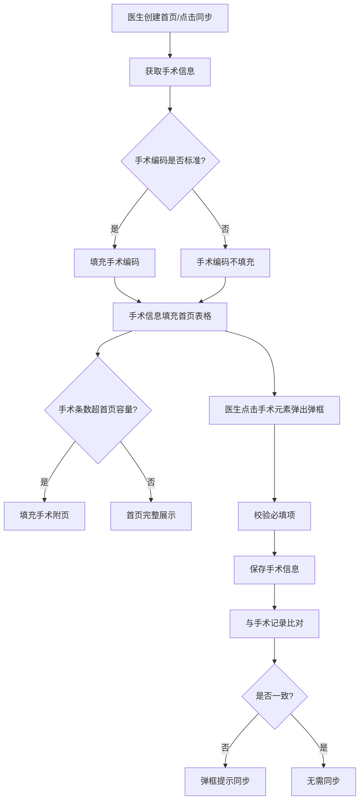
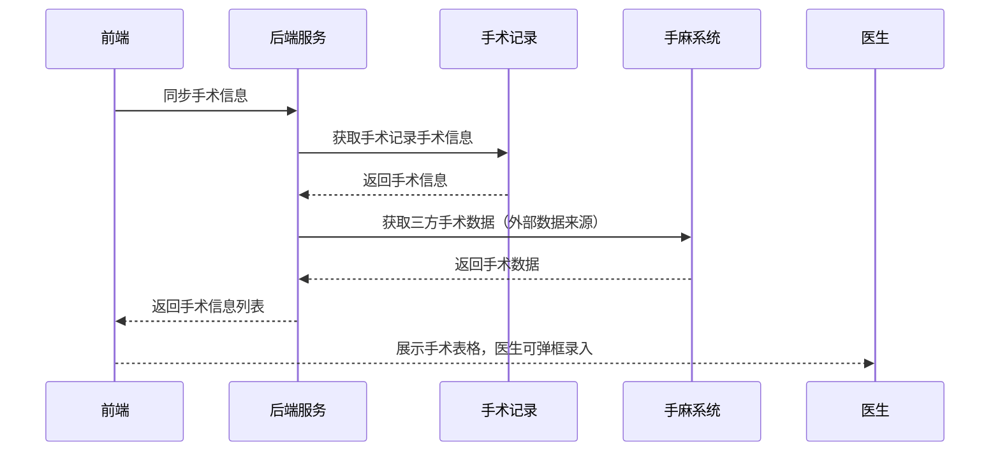

# BLGL-13-BASY-004 手术信息获取与管理 - Spec

> **功能编号**：BLGL-13-BASY-004
> **文档类型**：Spec（研发视角）
> **文档版本**：V1.0
> **编写时间**：2026-08-13
> **编写人**：RACC

---

## 文档索引

本节提供本文档的章节结构索引与关联文档索引，便于读者快速定位与检索。

#### 章节索引

**Spec（研发视角）**

| 章节号 | 章节名称 | 内容说明 |
|--------|---------|---------|
| 1、 | 文档概述 | 文档目的、文档范围、术语定义、阅读指南、参考文档 |
| 2、 | 功能背景与定位 | 功能背景、功能定位、目标用户、核心价值 |
| 3、 | 业务流程设计 | 主流程/异常流程/边界流程（Given/When/Then） |
| 4、 | 数据模型设计 | 核心数据结构、状态定义、系统参数定义 |
| 5、 | 接口契约设计 | API列表、接口详细设计、错误码定义 |
| 6、 | 技术方案设计 | 页面路径、技术栈、关键技术点、部署方案 |
| 7、 | 测试用例预设计 | 功能/边界/异常/性能测试用例 |
| 8、 | 非功能性要求 | 性能、安全、可用性、兼容性 |
| 9、 | 依赖与风险 | 外部依赖、风险项 |
| 10、 | 附录 | 流程图、时序图、参考文档 |

**PM-Spec（业务视角）**

| 章节号 | 章节名称 | 内容说明 |
|--------|---------|---------|
| 一 | 目标 | 功能定位与核心价值 |
| 二 | 约束 | 业务/技术/非功能性约束 |
| 三 | 验收标准 | 验收条件与验证方法 |
| 四 | 排除范围 | 本次不做项与明确边界 |
| 五 | 关键决策记录 | 方案决策与选型理由 |
| 六 | 优先级 | 优先级定义 |
| 七 | 关联文档 | 关联文档索引 |
| 附录 | 填写检查清单 | 质量检查 |

**Analyst-Spec（产品视角）**

| 章节号 | 章节名称 | 内容说明 |
|--------|---------|---------|
| 一 | 功能编号体系 | 带父子层级的编号树 |
| 二 | 核心业务流程 | Mermaid 流程图 |
| 三 | 功能规格说明 | 各子功能点的概述、用户角色、业务流程、验收标准 |
| 四 | 排除范围 | 本需求不包含的功能项 |
| 五 | 业务规则清单 | 规则ID、规则名称、规则描述、优先级 |
| 六 | 关联文档 | 文档类型、文档路径、说明 |
| 七 | 待确认问题清单 | 所有 ⏳ 待确认项的汇总 |
| - | 填写检查清单 | 检查项与完成状态 |

#### 版本历史

| 版本 | 日期 | 变更说明 | 编写人 |
|------|------|---------|--------|
| V1.0 | 2026-08-13 | 初始版本 | RACC |

#### 关联文档索引

| 序号 | 文档名称 | 文档类型 | 版本 | 位置 |
|------|---------|---------|------|------|
| 1 | BLGL-13-BASY-004_手术信息获取与管理_PM-spec.md | PM-Spec（业务视角） | V0.1 | 本目录 |
| 2 | BLGL-13-BASY-004_手术信息获取与管理_Analyst-spec.md | Analyst-Spec（产品视角） | V1.0 | 本目录 |
| 3 | BLGL-13-BASY-004_手术信息获取与管理-Spec.md | Spec（研发视角） | V1.0 | 本目录 |
| 4 | BLGL-13-BASY 13病案首页功能点Spec.md | 功能点Spec（模块级） | V1.0 | 上级目录 |

---

## 1、文档概述

### 1.1、文档目的

本文档旨在明确"手术信息获取与管理"功能（BLGL-13-BASY-004）的业务背景与设计方案，为需求分析、研发实现、测试验收及评审提供统一的业务上下文、设计口径与决策依据。

**具体目的包括**：

1. 梳理手术信息获取与管理功能的业务由来与历史需求演进脉络，说明"为什么要做"；
2. 明确功能的定位边界、目标用户与核心价值，回答"做成什么"；
3. 描述功能的业务流程、数据模型、接口契约与技术方案，回答"怎么做"；
4. 预设计测试用例并明确非功能性要求、依赖与风险，为研发与验收提供依据；
5. 作为 SPEC（功能编号体系、功能详情、业务规则、验收标准等章节）的业务前提与设计输入，保证各层文档业务口径一致。

### 1.2、文档范围

#### 1.2.1 纳入范围

本文档覆盖手术信息获取与管理的完整业务背景与设计，包括：

- 首页手术信息从手术记录/操作记录/手麻/治疗医嘱获取（MEDICAL020 配置）
- 手术表格弹框录入与校验（必填项设置）
- 与手术记录手术信息比对同步（不一致提醒）
- 联合手术数据同步
- 手术附页表格填充（横向/纵向）
- 手术级别、切口规则校验
- 手术持续时间/麻醉持续时间自动计算
- 手术/中医治疗操作配置

#### 1.2.2 排除范围

本文档不涉及以下内容（详见其他功能点或模块）：

- 诊断信息同步与录入——见 BLGL-13-BASY-003
- 首页提交与校验（手术相关提交校验）——见 BLGL-13-BASY-007
- 首页参数与映射配置（手术表格配置）——见 BLGL-13-BASY-010

### 1.3、术语定义

| 术语 | 定义 |
|------|------|
| 手术记录 | 记录手术过程的手术文书 |
| 操作记录 | 记录有创诊疗操作的操作文书 |
| 联合手术 | 多条手术作为一组手术，除名称编码外其他字段自动填充 |
| 主要手术 | 手术信息中的主手术标记，首页支持录入多个 |
| 手术附页 | 首页附页中展示剩余手术信息的表格 |
| 手术级别 | 手术分级目录中的级别 |
| 切口愈合等级 | 手术切口的愈合等级 |
| 标准手术编码 | 手术编码与ICD编码一致 |

### 1.4、阅读指南

- **章节关系**：第1~2章为阅读铺垫与业务全貌（背景、定位、用户、价值）；第3~10章为设计实现层（流程、数据、接口、技术、测试、非功能、依赖风险、附录），可直接用于研发与测试。与 Analyst-Spec、PM-Spec 的详细规则/验收口径互相引用，保持一致。
- **读者对象**：
  - 产品经理/需求分析师：阅读第1~2章了解业务全貌，据此维护 PM-Spec 与功能清单；
  - 研发：阅读第3~6章用于开发实现，第9~10章用于依赖评估与联调；
  - 测试：阅读第3章、第7~8章用于用例设计与验收；
  - 评审人员：以本文档为业务口径与设计基准，核对各层文档一致性。

### 1.5、参考文档

| 序号 | 文档名称 | 版本/日期 |
|------|---------|----------|
| 1 | 【历史需求】病案首页需求-0727.xlsx | - |
| 2 | BLGL-13-BASY-004_手术信息获取与管理_PM-spec.md | V0.1 |
| 3 | BLGL-13-BASY-004_手术信息获取与管理_Analyst-spec.md | V1.0 |
| 4 | BLGL-13-BASY 13病案首页功能点Spec.md | V1.0 |
| 5 | WiNEX-病案首页_功能清单_20260325_162900.md | 2026-03-25 |

---

## 2、功能背景与定位

### 2.1 功能背景

手术信息获取与管理是病案首页的核心数据内容，需满足：

- **法规/规范依据**：病案首页手术信息需符合手术分级管理要求
- **管理要求**：手术信息从手术记录/手麻/治疗医嘱多来源获取
- **现状痛点**：手术记录与首页手术信息不一致需提醒同步，手术必填项校验不足
- **历史需求演进**：从"手术信息获取"→"手术信息弹框校验"→"手麻数据来源"→"手术附页表格填充"→"联合手术同步"→"手术持续时间计算"

### 2.2 功能定位

"手术信息获取与管理"是WiNEX病历管理-病案首页模块的核心数据层，定位为：

- **数据获取定位**：首页手术信息多来源自动获取
- **一致性定位**：与手术记录信息比对同步
- **规范定位**：手术必填项、级别、切口规则校验

### 2.3 目标用户

| 用户角色 | 主要使用场景 |
|---------|-------------|
| 住院医生 | 查看/录入首页手术信息、比对同步 |
| 手术医生/护士 | 术者可填写护士（部分操作由护士执行） |

### 2.4 核心价值

| 价值维度 | 价值描述 |
|---------|---------|
| 数据一致性 | 首页手术信息与手术记录一致 |
| 规范合规 | 手术必填项、切口规则校验满足上报要求 |
| 效率提升 | 手术信息自动获取，多来源覆盖 |

---

## 3、业务流程设计（Given/When/Then）

### 3.1 主流程

**Scenario 1: 首页手术信息获取与录入**

```gherkin
Given:
  - 参数 MEDICAL020 首页手术信息获取来源已配置
  - 手术记录/操作记录已有手术信息（或配置外部数据来源）

When:
  - 医生创建病案首页或点击同步
  - 系统获取手术信息填充首页手术表格

Then:
  - 手术编码、手术日期、手术级别、手术名称、术者、一助、二助、愈合等级、麻醉方式、麻醉方法自动获取
  - 医生点击手术相关元素弹出手术表格弹框进行录入排序
  - 填写手术信息时按参数"手术信息弹框填写时连带必填项设置"校验必填字段
```

### 3.2 异常流程

**Scenario 2: 业务异常——手术信息变更比对**

```gherkin
Given:
  - 手术记录非草稿非新建状态，每次调保存手术信息
  - 已创建病案首页

When:
  - 手术记录手术信息与首页手术信息不一致

Then:
  - 弹框提示"手术信息有变更，是否打开病案首页进行同步"
  - 选择是则打开首页，未提交直接弹出同步病历数据弹框；已提交提示"病案首页已提交，需先撤销首页后点击同步按钮"（HIST011）
```

**Scenario 3: 数据异常——非标准手术编码**

```gherkin
Given:
  - 手术信息填充时判断是否标准手术编码

When:
  - 服务编码与ICD编码不一致（非标准手术）

Then:
  - 手术编码不填充（功能清单 HIST011）
```

**Scenario 4: 系统异常——手麻接口超时**

```gherkin
Given:
  - 外部数据（手麻）接口超时

When:
  - 首页同步手术信息

Then:
  - 手术信息不获取，医生可手工录入
  - 记录系统异常日志
```

### 3.3 边界流程

**Scenario 5: 边界场景——手术条数上限**

```gherkin
Given:
  - 参数"首页中手术信息最多能录入多少条"=100

When:
  - 医生录入手术信息

Then:
  - 最多录入100条（功能清单 SURG002）
```

**Scenario 6: 边界场景——手术信息超首页容量填充附页**

```gherkin
Given:
  - 患者在院进行了15个手术，首页只能展示10个

When:
  - 首页手术信息填充

Then:
  - 剩余5个在附页中展示（功能清单 HIST011）
  - 手术附页表格按手术条目数自动复制填充
```

---

## 4、数据模型设计

### 4.1 核心数据结构

#### 4.1.1 核心保存请求

| 字段名 | 类型 | 必填 | 备注 |
|--------|------|------|------|
| encounterId | Long | 是 | 患者就诊标识 |
| 手术编码 | String | 是 | 标准手术编码 |
| 手术名称 | String | 是 | 手术名称 |
| 手术日期 | Date | 是 | 手术日期 |
| 手术级别 | String | 否 | 手术级别 |
| 术者 | String | 是 | 术者 |
| 是否主要手术 | Boolean | 否 | 主手术标记 |

#### 4.1.2 核心表/实体

| 表/实体 | 关键字段 | 说明 |
|---------|---------|------|
| INP_EMR_MAHP_SURGERY | inpEmrMahpSurgeryId, encounterId | 首页西医手术表 |
| INP_EMR_MAHP_TCM_SURGERY | inpEmrMahpTcmSurgeryId, encounterId | 首页中医手术表 |
| INP_EMR_SURGERY | inpEmrSurgeryId, encounterId | 手术记录手术表（比对来源，） |
| INP_EMR_SURGERY_RECORD | inpSurgeryRecordId | 手术记录表 |

### 4.2 状态定义

| 状态码 | 状态名称 | 说明 |
|--------|---------|------|
| ⏳ 待确认 | 手术上报状态 | 是否上报/上报序号 |

### 4.3 系统参数定义

| 参数编码 | 参数名称 | 说明 |
|---------|---------|------|
| MEDICAL020 | 首页手术信息获取来源配置 | 外部数据/病历文书/无 |
| 手术信息弹框填写时连带必填项设置 | 病历业务配置-病案首页配置-基本配置 | 手术必填字段设置 |
| 首页中手术信息最多能录入多少条 | 默认100 | 手术条数上限 |
| MEDICAL018 | 手术控件填写模式 | 表格形式/字段形式 |
| 是否启用联合手术数据同步 | 默认否 | 联合手术同步 |
| 病案首页手术附表填充方式 | 无/横向填充/纵向填充 | 附页填充方式 |

---

## 5、接口契约设计

### 5.1 API列表

| 序号 | API名称（代码函数） | 路径 | 方法 | 说明 |
|:----:|---------|------|:----:|------|
| 1 | queryMedicalArchiveSurgeryMatchDataElementByEncounterId | /api/v1/emr_medical_archive_surgery/match_data_element/query/by_encounter_id | POST | 手术信息匹配数据元查询 |
| 2 | saveInpatientEmrMedicalArchiveSurgery | /api/v1/emr/medical_archive/surgery/save | POST | 保存首页手术数据 |
| 3 | queryInpatientEmrMedicalArchiveSurgeryList | /api/v1/emr/medical_archive/surgery_list/query | POST | 查询首页手术信息列表 |
| 4 | checkInpEmrMahpSurgeryWithEmrSurgery | /api/v1/emr/medical_archive/surgery_with_emr/check | POST | 比对首页手术与手术记录 |
| 5 | syncInpatientEmrSurgeryInfoToMedicalArchive | /api/v1/emr/surgery_info_to_medical_archive/sync | POST | 同步手术记录手术信息到首页 |
| 6 | changeInpatientEmrMedicalArchiveSurgerySeqNo | /api/v1/emr/medical_archive/surgery_seq_no/change | POST | 调整手术信息顺序 |
| 7 | calculateSurgeryLevel | /api/v1/emr/medical_archive/surgery_level/calculate | POST | 计算手术等级 |
| 8 | checkEmrMahpSurgeryIncisionHealLvRule | /api/v1/emr_mahp/surgery/incision_heal_lv_rule/check | POST | 校验手术和切口规则 |

### 5.2 接口详细设计

#### 5.2.1 保存首页手术数据

**请求参数**:
```json
{
  "encounterId": 123456,
  "surgeryList": [
    {
      "surgeryCode": "ICD9-001",
      "surgeryName": "阑尾切除术",
      "surgeryDate": "2026-08-01",
      "surgeryLevel": "1",
      "operatorName": "张三",
      "mainSurgeryFlag": true
    }
  ]
}
```

**返回值（成功）**:
```json
{
  "success": true,
  "data": null
}
```

**返回值（失败）**:
```json
{
  "success": false,
  "message": "手术信息存在必填项未填写，请填写！",
  "data": null
}
```

> 📌 接口路径与函数名来自代码 InpatientMedicalArchiveController；入参/出参字段结构待与接口文档核对，部分为 `⏳ 待确认`。

### 5.3 错误码定义

| 错误码 | 错误信息 | 处理方式 |
|--------|---------|---------|
| ⏳ 待确认 | 手术信息存在必填项未填写，请填写！ | 弹框提示并标红未填单元格 |
| ⏳ 待确认 | 病案首页已提交，需先撤销首页后点击同步 | 提示信息 |

---

## 6、技术方案设计

### 6.1 页面路径

- **页面路径**: winning-webui-inpatient-clinicalnote-pango/src/pages/EmrMedicalRecord（病历书写容器，首页手术表格）
- **路由**: 病历目录-病案首页
- **核心逻辑模块**: InpatientEmrMedicalArchiveSurgeryInfoService、InpatientMedicalArchiveController

### 6.2 技术栈

| 类别 | 技术 | 版本 |
|------|------|------|
| 前端框架 | Vue（winning-webui-inpatient-clinicalnote-pango） | ⏳ 待确认 |
| 后端框架 | Java Spring Boot + Akso MVC | ⏳ 待确认 |

### 6.3 关键技术点

- 手术名称唯一性判断：首页手术弹框根据手术日期和手术名称两者完全一致时判断不能重复录入（功能清单 HIST011）
- 手术持续时间计算：手术结束日期-手术开始日期，精确到2位小数
- 麻醉持续时间计算：麻醉开始时间-麻醉结束时间，精确到2位小数
- 联合手术：点击联合手术直接复制上一条手术信息填充

### 6.4 部署方案

⏳ 待确认：部署方案未在资料区中找到

---

## 7、测试用例预设计

### 7.1 功能测试

| 用例编号 | 测试场景 | Given | When | Then |
|---------|---------|-------|------|------|
| TC-001 | 手术信息自动获取 | 手术记录已有手术信息 | 创建首页/同步 | 手术编码、名称、日期、级别等自动填充 |
| TC-002 | 手术弹框必填校验 | 配置必填项 | 填写手术信息 | 未填必填项不允许保存并标红 |
| TC-003 | 与手术记录比对 | 手术记录手术信息变更 | 保存手术信息 | 弹框提示是否打开首页同步 |

### 7.2 边界测试

| 用例编号 | 测试场景 | Given | When | Then |
|---------|---------|-------|------|------|
| TC-004 | 手术条数上限100 | 已录99条 | 再录入1条 | 达到上限100条 |
| TC-005 | 手术超容量填充附页 | 15个手术首页只能展示10个 | 手术信息填充 | 剩余5个在附页展示 |

### 7.3 异常测试

| 用例编号 | 测试场景 | Given | When | Then |
|---------|---------|-------|------|------|
| TC-006 | 非标准手术编码 | 服务编码与ICD不一致 | 填充手术信息 | 手术编码不填充 |
| TC-007 | 手麻接口超时 | 接口异常 | 同步手术 | 手术不获取，可手工录入 |

### 7.4 性能测试

| 用例编号 | 测试场景 | 指标 |
|---------|---------|------|
| TC-008 | 手术信息获取响应时间 | ⏳ 待确认 |

---

## 8、非功能性要求

### 8.1 性能要求

| 指标 | 要求 |
|------|------|
| 手术信息获取响应时间 | ⏳ 待确认 |

### 8.2 安全要求

| 要求 | 说明 |
|------|------|
| 手术数据准确性 | 手术编码需符合标准编码规范 |

**医疗行业特殊要求**

| 要求 | 说明 |
|------|------|
| 手术信息合规 | 手术必填项校验满足上报要求，切口规则校验 |

### 8.3 可用性要求

| 指标 | 要求值 |
|------|--------|
| ⏳ 待确认 | - |

### 8.4 兼容性要求

| 类型 | 要求 |
|------|------|
| 手麻系统兼容 | 对接三方手麻系统 |

---

## 9、依赖与风险

### 9.1 外部依赖

| 依赖项 | 说明 |
|--------|------|
| 手术记录/操作记录 | 首页手术信息来源 |
| 手麻系统/接口组 | 三方手术数据来源 |
| 主数据/术语库 | 手术级别、手术类别 |

### 9.2 风险项

| 风险项 | 等级 | 说明 | 应对方案 |
|--------|------|------|---------|
| 手术信息不一致 | 中 | 手术记录与首页手术信息不一致 | 比对规则+同步提醒 |
| 手术数据截断 | 中 | 手术录入与传输存在10条以上截断缺陷 | 修复截断缺陷 |
| 手术必填项校验 | 中 | 从手术记录同步的手术必填项未校验 | 提交时校验同步手术必填项 |

---

## 10、附录

### 10.1 流程图



### 10.2 时序图



### 10.3 参考文档

- WiNEX-病案首页_功能清单_20260325_162900.md（第2.3节诊疗信息管理-手术信息）
- 【历史需求】病案首页需求-0727.xlsx（、279634、621051、675976、876733、918285、892233、1003362 等）
- BLGL-13-BASY 13病案首页功能点Spec.md（V1.0）
- 关联Spec: BLGL-13-BASY-003 诊断信息同步与录入 -Spec.md

---

## 填写检查清单

| 序号 | 检查项 | 是否完成 |
|:----:|--------|:--------:|
| 1 | 章节索引与正文章节一致 | ✅ |
| 2 | 版本历史记录完整 | ✅ |
| 3 | 关联文档索引已登记全部Spec | ✅ |
| 4 | 文档目的明确回答"为什么做/做成什么/怎么做" | ✅ |
| 5 | 纳入范围/排除范围清晰 | ✅ |
| 6 | 术语定义覆盖关键概念，从资料区可溯源 | ✅ |
| 7 | 参考文档已登记 | ✅ |
| 8 | 功能背景基于法规/规范/需求来源组织 | ✅ |
| 9 | 功能定位体现业务价值（3~5个定位点） | ✅ |
| 10 | 目标用户角色覆盖完整，在需求原文中有出处 | ✅ |
| 11 | 核心价值可陈述，与 Phase 1 口径一致 | ✅ |
| 12 | 业务流程：主流程≥1、异常≥3、边界≥2，Given/When/Then 具体 | ✅ |
| 13 | 数据模型：字段/表/状态/参数可溯源（概念ID/表名/参数编码） | ✅ |
| 14 | 接口契约：API列表+详细设计+错误码齐全或标记待确认 | ✅ |
| 15 | 技术方案：页面路径/技术栈/关键点/部署方案或标记待确认 | ✅ |
| 16 | 测试用例：功能/边界/异常/性能覆盖，与第3章场景对应 | ✅ |
| 17 | 非功能性要求：性能/安全/可用性/兼容性指标可量化或标记待确认 | ✅ |
| 18 | 依赖与风险：外部依赖登记完整，风险有具体应对方案或标记待确认 | ✅ |
| 19 | 附录：流程图/时序图与正文流程一致 | ✅ |
| 20 | 全文无占位符 `< >` 残留 | ✅ |
| 21 | 全文陈述可溯源至资料区，无来源的已标记 ⏳ | ✅ |
| 22 | 人工审核确认完成 | ⏳ 待确认 |

---

**文档状态**：⬜ 待审核
**维护责任**：RACC
**下次更新**：根据评审反馈优化
