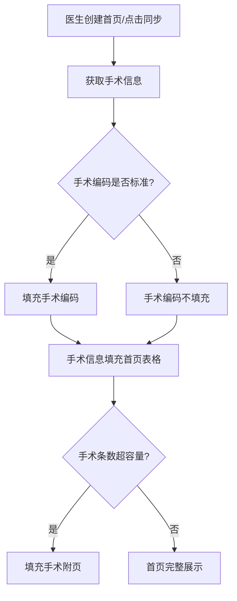
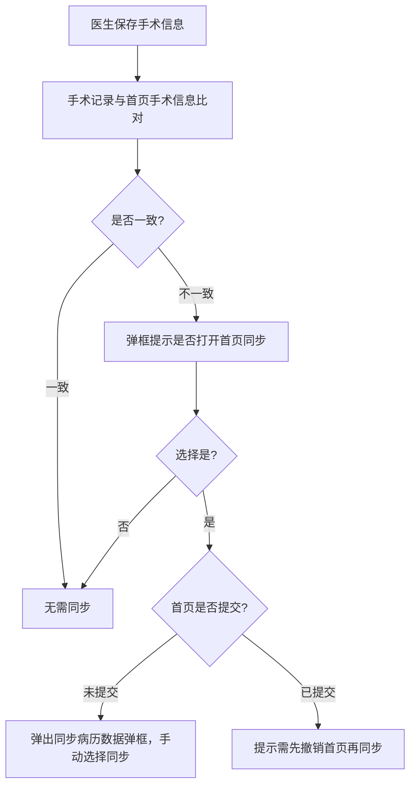

# BLGL-13-BASY-004手术信息获取与管理_ Analyst - Spec

> **需求编号**：BLGL-13-BASY-004
> **父需求**：BLGL-13-BASY
> **关联PM Spec**：BLGL-13-BASY-004_手术信息获取与管理_PM-spec.md
> **Spec版本**：V1.0
> **编写时间**：2026-08-13
> **编写人**：需求分析师

---

## 一、功能编号体系

### 1.1 功能层级结构

```
BLGL-13-BASY-004: 手术信息获取与管理
  ├─ BLGL-13-BASY-004-01: 手术信息获取
  ├─ BLGL-13-BASY-004-02: 手术表格弹框录入与校验
  ├─ BLGL-13-BASY-004-03: 手术信息比对同步
  ├─ BLGL-13-BASY-004-04: 联合手术数据同步
  ├─ BLGL-13-BASY-004-05: 手术附页表格填充
  ├─ BLGL-13-BASY-004-06: 手术级别与切口规则校验
  └─ BLGL-13-BASY-004-07: 手术持续时间/麻醉持续时间计算
```

### 1.2 功能编号表

| REQ-ID | 功能名称 | 类型 | 优先级 | 说明 |
|--------|---------|------|--------|------|
| BLGL-13-BASY-004-01 | 手术信息获取 | 功能 | P0 | 从手术记录/手麻/治疗医嘱获取 |
| BLGL-13-BASY-004-02 | 手术表格弹框录入与校验 | 功能 | P0 | 弹框录入+必填项校验 |
| BLGL-13-BASY-004-03 | 手术信息比对同步 | 功能 | P0 | 与手术记录比对，不一致提醒 |
| BLGL-13-BASY-004-04 | 联合手术数据同步 | 功能 | P1 | 联合手术复制上一条手术信息 |
| BLGL-13-BASY-004-05 | 手术附页表格填充 | 功能 | P1 | 手术超容量填充附页 |
| BLGL-13-BASY-004-06 | 手术级别与切口规则校验 | 功能 | P1 | 切口等级对照校验 |
| BLGL-13-BASY-004-07 | 手术持续时间/麻醉持续时间计算 | 功能 | P1 | 自动计算持续时长 |

---

## 二、核心业务流程

### 2.1 手术信息获取流程



### 2.2 手术信息比对同步流程



---

## 三、功能规格说明

### BLGL-13-BASY-004-01: 手术信息获取

#### 3.1.1 功能概述

首页手术信息按参数 MEDICAL020 配置从手术记录/操作记录/手麻/治疗医嘱获取。选择外部数据时支持勾选三方手麻+治疗医嘱；选择病历文书时支持勾选手术记录+操作记录。

#### 3.1.2 用户角色

| 角色 | 使用场景 | 权限要求 | 操作频率 |
|------|---------|---------|---------|
| 住院医生 | 查看/同步首页手术信息 | 病历书写权限 | 高频 |

#### 3.1.3 业务流程（Given/When/Then）

##### 主流程（1 个）

**Scenario 1: 手术信息自动获取**

```gherkin
Given:
  - 参数 MEDICAL020 首页手术信息获取来源已配置为病历文书/外部数据
  - 手术记录/操作记录已有手术信息（或三方手麻/治疗医嘱有数据）

When:
  - 医生创建病案首页或点击同步

Then:
  - 手术编码、手术日期、手术级别、手术名称、术者、一助、二助、愈合等级、麻醉方式、麻醉方法自动获取
  - 获取后填充首页手术表格
```

##### 异常流程（3 个）

**Scenario 2: 业务异常——手术信息来源未配置**

```gherkin
Given:
  - 参数 MEDICAL020 未配置（默认无）

When:
  - 医生创建首页

Then:
  - 首页手术由医生手工填写，不主动获取数据
```

**Scenario 3: 数据异常——手术记录无手术信息**

```gherkin
Given:
  - 手术记录无手术信息

When:
  - 医生点击同步

Then:
  - 首页手术表格不新增内容
```

**Scenario 4: 系统异常——外部数据接口超时**

```gherkin
Given:
  - 手麻/接口组接口超时

When:
  - 医生点击同步手术

Then:
  - 手术信息不获取，医生可手工录入
```

##### 边界流程（2 个）

**Scenario 5: 边界——治疗医嘱去重**

```gherkin
Given:
  - 参数"病案首页手术信息引用治疗医嘱，是否去重显示"=是

When:
  - 首页引用治疗医嘱手术信息

Then:
  - 同一治疗只引用一次，校验手术ICD编码，同一编码只引用首次
```

**Scenario 6: 边界——术者填写护士**

```gherkin
Given:
  - 参数"术者是否同步加载护士"=是

When:
  - 医生填写术者

Then:
  - 术者支持选择护士
```

#### 3.1.5 验收标准

| AC编号 | 验收标准 | 对应REQ-ID | 验证方法 | 验证场景 |
|--------|---------|-----------|---------|---------|
| AC-001 | 按参数配置从病历文书/外部数据获取手术信息 | BLGL-13-BASY-004-01 | 功能测试 | Scenario 1 |
| AC-002 | 参数未配置时手术由手工填写 | BLGL-13-BASY-004-01 | 功能测试 | Scenario 2 |

---

### BLGL-13-BASY-004-02: 手术表格弹框录入与校验

#### 3.2.1 功能概述

医生点击首页手术相关元素弹出手术表格弹框进行录入排序。手术信息弹框填写时按参数"手术信息弹框填写时连带必填项设置"校验必填字段。

#### 3.2.2 用户角色

| 角色 | 使用场景 | 权限要求 | 操作频率 |
|------|---------|---------|---------|
| 住院医生 | 手术弹框录入 | 病历书写权限 | 高频 |

#### 3.2.3 业务流程（Given/When/Then）

##### 主流程（1 个）

**Scenario 1: 手术弹框录入**

```gherkin
Given:
  - 参数"手术信息弹框填写时连带必填项设置"已配置必填字段

When:
  - 医生点击首页手术相关元素弹出手术表格弹框
  - 医生录入手术信息

Then:
  - 填写手术信息时校验必填字段
  - 手术弹框点击确认时校验所有手术行对应必填项
  - 必填项未填写不允许保存，未填单元格标红
```

##### 异常流程（3 个）

**Scenario 2: 业务异常——必填项未填**

```gherkin
Given:
  - 手术弹框有必填项未填写

When:
  - 医生点击确认保存手术

Then:
  - 弹框提示"手术信息存在必填项未填写，请填写！"
  - 未填写的单元格标红显示
```

**Scenario 3: 数据异常——手术操作类别为空**

```gherkin
Given:
  - 获取的手术/操作类别为空

When:
  - 手术弹框校验必填项

Then:
  - 此条手术不做校验
```

**Scenario 4: 系统异常——弹框数据加载失败**

```gherkin
Given:
  - 手术弹框数据加载接口异常

When:
  - 医生点击手术元素

Then:
  - 弹框加载失败提示，不打开弹框
```

##### 边界流程（2 个）

**Scenario 5: 边界——手术类别必填区分**

```gherkin
Given:
  - 参数"必填类别"配置手术类必填，操作类不限制

When:
  - 手术弹框校验必填项

Then:
  - 手术类必填项校验，操作类不校验
```

**Scenario 6: 边界——术后并发症联动**

```gherkin
Given:
  - 手术弹窗"是否有术后并发症"为否或空

When:
  - 医生选择术后并发症名称

Then:
  - 提醒"请先确认是否有术后并发症"
```

#### 3.2.5 验收标准

| AC编号 | 验收标准 | 对应REQ-ID | 验证方法 | 验证场景 |
|--------|---------|-----------|---------|---------|
| AC-001 | 手术弹框按配置校验必填项，未填不允许保存并标红 | BLGL-13-BASY-004-02 | 功能测试 | Scenario 1 |
| AC-002 | 手术类/操作类必填项区分校验 | BLGL-13-BASY-004-02 | 功能测试 | Scenario 5 |

---

### BLGL-13-BASY-004-03: 手术信息比对同步

#### 3.3.1 功能概述

手术记录非草稿和非新建状态每次调保存手术信息时，对比手术记录手术信息表与病案首页手术信息表是否一致，不一致时弹框提示"手术信息有变更，是否打开病案首页进行同步"。

#### 3.3.2 用户角色

| 角色 | 使用场景 | 权限要求 | 操作频率 |
|------|---------|---------|---------|
| 住院医生 | 手术记录保存时触发比对 | 病历书写权限 | 高频 |

#### 3.3.3 业务流程（Given/When/Then）

##### 主流程（1 个）

**Scenario 1: 手术信息比对**

```gherkin
Given:
  - 参数"住院病历是否启用病案首页"=是
  - 已创建病案首页
  - 手术记录非草稿非新建状态

When:
  - 医生保存手术信息

Then:
  - 对比手术记录与首页手术信息
  - 比对字段：手术名称、手术编码、手术日期、手术医生、手术级别、一助、二助、切口愈合等级、麻醉方法、麻醉医师
  - 不一致时弹框提示是否打开首页同步
```

##### 异常流程（3 个）

**Scenario 2: 业务异常——已提交首页同步**

```gherkin
Given:
  - 首页已提交状态
  - 手术信息不一致

When:
  - 医生选择打开首页同步

Then:
  - 提示"病案首页已提交，需先撤销首页后点击同步按钮"（需求 HIST011）
```

**Scenario 3: 数据异常——手术记录有新增手术**

```gherkin
Given:
  - 手术记录有新增的手术，首页没有对应的手术

When:
  - 保存手术信息触发比对

Then:
  - 判断不一致，需要同步（比对规则1，需求 HIST011）
```

**Scenario 4: 系统异常——比对接口异常**

```gherkin
Given:
  - 手术比对接口异常

When:
  - 医生保存手术信息

Then:
  - 比对不执行，手术保存成功
  - 记录异常日志
```

##### 边界流程（2 个）

**Scenario 5: 边界——首页手术非来源手术记录**

```gherkin
Given:
  - 首页手术信息不是来源手术记录，医生自己新增

When:
  - 保存手术信息触发比对

Then:
  - 无需与手术记录进行对比（比对规则3，需求 HIST011）
```

**Scenario 6: 边界——同步记录主键**

```gherkin
Given:
  - 首页同步手术记录的手术信息

When:
  - 系统记录同步来源

Then:
  - 记录同步的是手术记录的哪一条记录（手术信息主键，需求 HIST011）
```

#### 3.3.5 验收标准

| AC编号 | 验收标准 | 对应REQ-ID | 验证方法 | 验证场景 |
|--------|---------|-----------|---------|---------|
| AC-001 | 手术记录与首页手术信息不一致时弹框提示同步 | BLGL-13-BASY-004-03 | 功能测试 | Scenario 1 |
| AC-002 | 已提交首页同步时提示先撤销 | BLGL-13-BASY-004-03 | 功能测试 | Scenario 2 |

---

### BLGL-13-BASY-004-04: 联合手术数据同步

#### 3.4.1 功能概述

参数"是否启用联合手术数据同步"设置为是时，点击联合手术直接复制上一条手术信息（手术名称、编码、前后缀、联合手术不复制）填充至本条手术。点击取消联合手术，联合手术列标志置为空，已复制数据不清空。

#### 3.4.2 用户角色

| 角色 | 使用场景 | 权限要求 | 操作频率 |
|------|---------|---------|---------|
| 住院医生 | 录入联合手术 | 病历书写权限 | 中频 |

#### 3.4.3 业务流程（Given/When/Then）

##### 主流程（1 个）

**Scenario 1: 联合手术同步**

```gherkin
Given:
  - 参数"是否启用联合手术数据同步"=是

When:
  - 医生点击联合手术

Then:
  - 直接复制上一条手术信息填充至本条手术
  - 同一组手术除手术名称、编码不一致，其他字段按联合主手术自动填充
  - 联合手术标志设置
```

##### 异常流程（3 个）

**Scenario 2: 业务异常——取消联合手术**

```gherkin
Given:
  - 手术已设置为联合手术

When:
  - 医生点击取消联合手术

Then:
  - 联合手术列标志置为空
  - 已复制的数据不做清空，继续保留
```

**Scenario 3: 数据异常——无上一条手术**

```gherkin
Given:
  - 手术列表第一条点击联合手术

When:
  - 医生点击联合手术

Then:
  - 无上一条手术可复制
```

**Scenario 4: 系统异常——联合手术接口异常**

```gherkin
Given:
  - 联合手术接口异常

When:
  - 医生点击联合手术

Then:
  - 同步失败提示，不复制手术信息
```

##### 边界流程（2 个）

**Scenario 5: 边界——联合手术附页生成**

```gherkin
Given:
  - 参数"病案首页手术为联合手术，是否生成至附页"

When:
  - 首页手术为联合手术

Then:
  - 按参数判断是否生成至附页
```

**Scenario 6: 边界——多组联合手术**

```gherkin
Given:
  - 可选中多条手术为一组手术

When:
  - 医生设置联合手术

Then:
  - 同一组手术除名称编码不一致，其他字段按联合主手术填充（功能清单 SURG004）
```

#### 3.4.5 验收标准

| AC编号 | 验收标准 | 对应REQ-ID | 验证方法 | 验证场景 |
|--------|---------|-----------|---------|---------|
| AC-001 | 点击联合手术复制上一条手术信息填充 | BLGL-13-BASY-004-04 | 功能测试 | Scenario 1 |
| AC-002 | 取消联合手术后标志置空，已复制数据保留 | BLGL-13-BASY-004-04 | 功能测试 | Scenario 2 |

---

### BLGL-13-BASY-004-05: 手术附页表格填充

#### 3.5.1 功能概述

首页模板需包含手术附页表格（名称"病案首页_手术附页"），手术弹框填写完成相关字段后按列对应数据元ID将值填充进相关数据元。按手术条目数自动复制手术附页表格。附页填充方式支持无/横向填充/纵向填充。

#### 3.5.2 用户角色

| 角色 | 使用场景 | 权限要求 | 操作频率 |
|------|---------|---------|---------|
| 住院医生 | 查看首页手术附页 | 病历书写权限 | 中频 |

#### 3.5.3 业务流程（Given/When/Then）

##### 主流程（1 个）

**Scenario 1: 手术附页填充**

```gherkin
Given:
  - 首页模板包含"病案首页_手术附页"表格
  - 患者手术条数超首页容量或需展示附页

When:
  - 手术弹框填写完成相关字段

Then:
  - 按照手术条目数自动复制手术附页表格
  - 按列对应数据元ID将值填充进相关数据元
  - 手术条目删减时附页表格按实际情况删减调整
```

##### 异常流程（3 个）

**Scenario 2: 业务异常——附页未填写明细**

```gherkin
Given:
  - 某条手术未填写附页明细内容

When:
  - 手术附页填充

Then:
  - 此条手术不填充手术附表明细
```

**Scenario 3: 数据异常——附页填充方式无**

```gherkin
Given:
  - 参数"病案首页手术附表填充方式"=无

When:
  - 手术控件写了数据

Then:
  - 不往附页的手术表格填充
```

**Scenario 4: 系统异常——附页数据元映射失败**

```gherkin
Given:
  - 手术附页数据元ID映射缺失

When:
  - 手术附页填充

Then:
  - 该字段不填充，记录映射异常
```

##### 边界流程（2 个）

**Scenario 5: 边界——纵向填充**

```gherkin
Given:
  - 参数"病案首页手术附表填充方式"=纵向填充

When:
  - 手术附页填充

Then:
  - 手术以列的形式填充（乐山模式，）
```

**Scenario 6: 边界——操作排除附页**

```gherkin
Given:
  - 参数控制按手术类别是否生成手术附页
  - 手术条目为操作类

When:
  - 手术附页填充

Then:
  - 操作不需要附页，排除操作
```

#### 3.5.5 验收标准

| AC编号 | 验收标准 | 对应REQ-ID | 验证方法 | 验证场景 |
|--------|---------|-----------|---------|---------|
| AC-001 | 按手术条目数自动复制手术附页表格并填充 | BLGL-13-BASY-004-05 | 功能测试 | Scenario 1 |
| AC-002 | 操作类手术不生成附页 | BLGL-13-BASY-004-05 | 功能测试 | Scenario 6 |

---

### BLGL-13-BASY-004-06: 手术级别与切口规则校验

#### 3.6.1 功能概述

病案首页切口等级需要对照手术术语值，不一致时提醒并需医生填写书写原因。参数"病案首页是否校验切口等级"配置为术语（切口等级）时调用主数据查询手术编码术语或临床服务中的手术切口等级。

#### 3.6.2 用户角色

| 角色 | 使用场景 | 权限要求 | 操作频率 |
|------|---------|---------|---------|
| 住院医生 | 首页手术级别/切口校验 | 病历书写权限 | 高频 |

#### 3.6.3 业务流程（Given/When/Then）

##### 主流程（1 个）

**Scenario 1: 切口等级校验**

```gherkin
Given:
  - 参数"病案首页是否校验切口等级"=术语（切口等级）

When:
  - 医生录入手术切口等级

Then:
  - 切口等级对照手术术语值
  - 不一致时提醒并需医生填写书写原因
```

##### 异常流程（3 个）

**Scenario 2: 业务异常——手术级别锁定**

```gherkin
Given:
  - 参数控制手术级别字段由手术分级目录带出并锁定

When:
  - 医生填写手术级别

Then:
  - 手术级别只读，禁止手动修改
```

**Scenario 3: 数据异常——手术级别自动计算**

```gherkin
Given:
  - 参数 MEDICAL067 配置调用主数据规则接口

When:
  - 首页获取手术信息

Then:
  - 根据手术编码自动匹配手术级别
```

**Scenario 4: 系统异常——主数据规则接口异常**

```gherkin
Given:
  - 手术级别计算接口异常

When:
  - 医生录入手术信息

Then:
  - 手术级别不自动填充，可手工选择
```

##### 边界流程（2 个）

**Scenario 5: 边界——麻醉方式非空连带必填**

```gherkin
Given:
  - 首页规则配置"麻醉方式非空时的连带必填项设置"

When:
  - 手术/操作录入麻醉方式非空

Then:
  - 参数设置的字段需要必填
```

**Scenario 6: 边界——切口愈合等级拼接**

```gherkin
Given:
  - 切口愈合等级为文本类型（数据元391002276）

When:
  - 首页前端页面显示

Then:
  - 拼接显示"切口/愈合等级"，如"1/甲"
```

#### 3.6.5 验收标准

| AC编号 | 验收标准 | 对应REQ-ID | 验证方法 | 验证场景 |
|--------|---------|-----------|---------|---------|
| AC-001 | 切口等级对照术语值不一致时提醒并填写书写原因 | BLGL-13-BASY-004-06 | 功能测试 | Scenario 1 |
| AC-002 | 手术级别配置只读时禁止手动修改 | BLGL-13-BASY-004-06 | 功能测试 | Scenario 2 |

---

### BLGL-13-BASY-004-07: 手术持续时间/麻醉持续时间计算

#### 3.7.1 功能概述

新建首页或点击同步获取首页手术数据时，若接口返回手术持续时间以接口返回为准；若未返回则按手术结束日期-开始日期计算持续时间。麻醉持续时间=麻醉开始时间-麻醉结束时间，结果以小时为单位精确到2位小数。

#### 3.7.2 用户角色

| 角色 | 使用场景 | 权限要求 | 操作频率 |
|------|---------|---------|---------|
| 住院医生 | 首页手术信息 | 病历书写权限 | 中频 |

#### 3.7.3 业务流程（Given/When/Then）

##### 主流程（1 个）

**Scenario 1: 手术持续时间计算**

```gherkin
Given:
  - 病案首页配置》手术表格配置同时启用列：手术及操作日期、手术结束日期、手术持续时间（小时）

When:
  - 医生新建首页/点击同步/录入手术时间

Then:
  - 若接口返回手术持续时间以接口返回为准
  - 未返回时按手术结束日期-开始日期计算持续时间
  - 医生手工新增手术按录入时间计算
  - 结果以小时为单位精确到2位小数
```

##### 异常流程（3 个）

**Scenario 2: 业务异常——手术时间未填**

```gherkin
Given:
  - 手术开始时间或结束时间未填写

When:
  - 系统计算手术持续时间

Then:
  - 持续时间不计算
```

**Scenario 3: 数据异常——麻醉时间缺项**

```gherkin
Given:
  - 麻醉开始时间或结束时间有一项为空

When:
  - 系统计算麻醉持续时间

Then:
  - 该条不计算麻醉持续时间
```

**Scenario 4: 系统异常——时间格式异常**

```gherkin
Given:
  - 手术时间字段格式异常

When:
  - 系统计算持续时间

Then:
  - 计算失败，持续时间留空，记录日志
```

##### 边界流程（2 个）

**Scenario 5: 边界——X.00只保留整数**

```gherkin
Given:
  - 计算结果为X.00小时

When:
  - 首页展示持续时间

Then:
  - 只保留整数位
```

**Scenario 6: 边界——持续时间变更重算**

```gherkin
Given:
  - 已录入手术的开始时间和结束时间发生变更

When:
  - 医生修改时间

Then:
  - 持续时间重新计算更新
```

#### 3.7.5 验收标准

| AC编号 | 验收标准 | 对应REQ-ID | 验证方法 | 验证场景 |
|--------|---------|-----------|---------|---------|
| AC-001 | 手术持续时间按结束-开始时间自动计算，精确到2位小数 | BLGL-13-BASY-004-07 | 功能测试 | Scenario 1 |
| AC-002 | 麻醉持续时间按开始-结束时间自动计算 | BLGL-13-BASY-004-07 | 功能测试 | Scenario 1 |

---

## 四、排除范围

本需求不包含以下功能项：

1. **诊断信息同步与录入** - 归属 BLGL-13-BASY-003
2. **首页提交与校验（手术相关提交校验）** - 归属 BLGL-13-BASY-007
4. **手术表格配置管理** - 归属 BLGL-13-BASY-010

---

## 五、业务规则清单

| 规则ID | 规则名称 | 规则描述 | 来源 | 优先级 |
|--------|---------|---------|------|--------|
| BR-001 | 手术信息获取来源 | 按MEDICAL020配置从病历文书/外部数据获取 | | P0 |
| BR-002 | 手术弹框必填校验 | 按参数配置校验必填字段，未填不允许保存并标红 | | P0 |
| BR-003 | 手术名称唯一性 | 首页手术弹框根据手术日期和手术名称完全一致判断不能重复录入 | | P0 |
| BR-004 | 手术信息比对同步 | 手术记录与首页不一致时提醒同步，比对规则3种 | 需求 HIST011 | P0 |
| BR-005 | 非标准手术编码 | 服务编码与ICD编码不一致时手术编码不填充 | 功能清单 HIST011 | P1 |
| BR-006 | 联合手术同步 | 点击联合手术复制上一条手术信息，取消不清空 | | P1 |
| BR-007 | 手术附页填充 | 按手术条目数复制附页表格，填充方式支持无/横向/纵向 | 、1003362 | P1 |
| BR-008 | 切口等级校验 | 切口等级对照手术术语值，不一致提醒 | | P1 |
| BR-009 | 手术持续时间计算 | 手术结束-开始时间，精确到2位小数 | | P1 |

---

## 六、关联文档

| 文档类型 | 文档路径 | 说明 |
|---------|---------|------|
| PM-Spec（业务视角） | 本目录 BLGL-13-BASY-004_手术信息获取与管理_PM-spec.md（V0.1） | PM 产出的 Spec 文档 |
| Spec（研发视角） | 本目录 BLGL-13-BASY-004_手术信息获取与管理-Spec.md（V1.0） | 业务背景与目标 Spec |
| 功能点Spec（模块级） | BLGL-13-BASY 13病案首页功能点Spec.md（V1.0，上级目录） | Phase 1 功能点索引 |
| data-model.md | 待产出 | 架构师产出的数据建模文档 |
| design.md | 待产出 | 架构师产出的技术方案文档 |
| api-contract.md | 待产出 | 开发经理产出的 API 契约文档 |

---

## 七、待确认问题清单

| 编号 | 问题描述 | 缺失信息 | 影响范围 | 建议补充方 |
|------|---------|---------|---------|-----------|
| Q-001 | 手术上报状态/序号定义 | 数据字段 | 手术上报标志 | 产品经理 |
| Q-002 | 手术接口返回结构具体字段 | 接口契约 | 接口详细设计 | 开发经理 |
| Q-003 | 手术信息获取性能指标 | 性能指标 | 非功能性要求 | 产品经理 |
| Q-004 | 手术附页数据元ID映射关系 | 数据元映射 | 手术附页填充 | 模块负责人 |

---

## 填写检查清单

| 序号 | 检查项 | 是否完成 |
|:----:|--------|:--------:|
| 1 | 功能编号带父子层级 | ✅ |
| 2 | 每个 REQ-ID 有功能概述和用户角色 | ✅ |
| 3 | 主流程至少 1 个 Given/When/Then 场景 | ✅ |
| 4 | 异常流程至少 3 个 Given/When/Then 场景 | ✅ |
| 5 | 边界流程至少 2 个 Given/When/Then 场景 | ✅ |
| 6 | 每个 Given/When/Then 内容具体，不模糊 | ✅ |
| 7 | 数据字段定义完整（字段名、类型、必填、说明、概念ID） | ✅ |
| 8 | 验收标准 AC 编号独立，可验证 | ✅ |
| 9 | 验收标准无"功能正常"等模糊表述 | ✅ |
| 10 | 排除范围明确列出 | ✅ |
| 11 | 业务规则清单列出所有规则，每条标注来源 | ✅ |
| 12 | 流程图使用 Mermaid 格式（≥2 个） | ✅ |
| 13 | 关联文档索引包含 Phase 1 功能点Spec | ✅ |
| 14 | 待确认问题清单汇总了全文所有 ⏳ 项 | ✅ |
| 15 | 全文无占位符 `< >` 残留 | ✅ |
| 16 | 全文陈述可溯源至资料区（S1~S10 溯源核查） | ✅ |
| 17 | 人工审核确认完成 | ⏳ 待确认 |

---

**文档状态**：⬜ 待审核
**维护责任**：需求分析师规范组
**下次更新**：根据评审反馈优化

---

## 版本历史

| 版本 | 日期 | 变更说明 | 编写人 |
|------|------|---------|--------|
| V1.0 | 2026-08-13 | 初始版本 | 需求分析师 |
