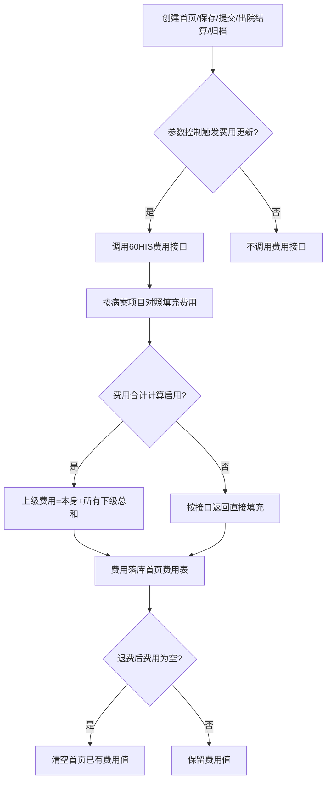
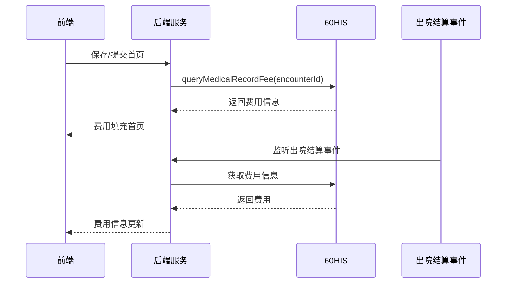

# BLGL-13-BASY-005 费用信息获取与更新 - Spec

> **功能编号**：BLGL-13-BASY-005
> **文档类型**：Spec（研发视角）
> **文档版本**：V1.0
> **编写时间**：2026-08-13
> **编写人**：RACC

---

## 文档索引

本节提供本文档的章节结构索引与关联文档索引，便于读者快速定位与检索。

#### 章节索引

**Spec（研发视角）**

| 章节号 | 章节名称 | 内容说明 |
|--------|---------|---------|
| 1、 | 文档概述 | 文档目的、文档范围、术语定义、阅读指南、参考文档 |
| 2、 | 功能背景与定位 | 功能背景、功能定位、目标用户、核心价值 |
| 3、 | 业务流程设计 | 主流程/异常流程/边界流程（Given/When/Then） |
| 4、 | 数据模型设计 | 核心数据结构、状态定义、系统参数定义 |
| 5、 | 接口契约设计 | API列表、接口详细设计、错误码定义 |
| 6、 | 技术方案设计 | 页面路径、技术栈、关键技术点、部署方案 |
| 7、 | 测试用例预设计 | 功能/边界/异常/性能测试用例 |
| 8、 | 非功能性要求 | 性能、安全、可用性、兼容性 |
| 9、 | 依赖与风险 | 外部依赖、风险项 |
| 10、 | 附录 | 流程图、时序图、参考文档 |

**PM-Spec（业务视角）**

| 章节号 | 章节名称 | 内容说明 |
|--------|---------|---------|
| 一 | 目标 | 功能定位与核心价值 |
| 二 | 约束 | 业务/技术/非功能性约束 |
| 三 | 验收标准 | 验收条件与验证方法 |
| 四 | 排除范围 | 本次不做项与明确边界 |
| 五 | 关键决策记录 | 方案决策与选型理由 |
| 六 | 优先级 | 优先级定义 |
| 七 | 关联文档 | 关联文档索引 |
| 附录 | 填写检查清单 | 质量检查 |

**Analyst-Spec（产品视角）**

| 章节号 | 章节名称 | 内容说明 |
|--------|---------|---------|
| 一 | 功能编号体系 | 带父子层级的编号树 |
| 二 | 核心业务流程 | Mermaid 流程图 |
| 三 | 功能规格说明 | 各子功能点的概述、用户角色、业务流程、验收标准 |
| 四 | 排除范围 | 本需求不包含的功能项 |
| 五 | 业务规则清单 | 规则ID、规则名称、规则描述、优先级 |
| 六 | 关联文档 | 文档类型、文档路径、说明 |
| 七 | 待确认问题清单 | 所有 ⏳ 待确认项的汇总 |
| - | 填写检查清单 | 检查项与完成状态 |

#### 版本历史

| 版本 | 日期 | 变更说明 | 编写人 |
|------|------|---------|--------|
| V1.0 | 2026-08-13 | 初始版本 | RACC |

#### 关联文档索引

| 序号 | 文档名称 | 文档类型 | 版本 | 位置 |
|------|---------|---------|------|------|
| 1 | BLGL-13-BASY-005_费用信息获取与更新_PM-spec.md | PM-Spec（业务视角） | V0.1 | 本目录 |
| 2 | BLGL-13-BASY-005_费用信息获取与更新_Analyst-spec.md | Analyst-Spec（产品视角） | V1.0 | 本目录 |
| 3 | BLGL-13-BASY-005_费用信息获取与更新-Spec.md | Spec（研发视角） | V1.0 | 本目录 |
| 4 | BLGL-13-BASY 13病案首页功能点Spec.md | 功能点Spec（模块级） | V1.0 | 上级目录 |

---

## 1、文档概述

### 1.1、文档目的

本文档旨在明确"费用信息获取与更新"功能（BLGL-13-BASY-005）的业务背景与设计方案，为需求分析、研发实现、测试验收及评审提供统一的业务上下文、设计口径与决策依据。

**具体目的包括**：

1. 梳理费用信息获取与更新功能的业务由来与历史需求演进脉络，说明"为什么要做"；
2. 明确功能的定位边界、目标用户与核心价值，回答"做成什么"；
3. 描述功能的业务流程、数据模型、接口契约与技术方案，回答"怎么做"；
4. 预设计测试用例并明确非功能性要求、依赖与风险，为研发与验收提供依据；
5. 作为 SPEC（功能编号体系、功能详情、业务规则、验收标准等章节）的业务前提与设计输入，保证各层文档业务口径一致。

### 1.2、文档范围

#### 1.2.1 纳入范围

本文档覆盖费用信息获取与更新的完整业务背景与设计，包括：

- 首页费用信息从60HIS接口获取
- 费用信息自动更新（创建/保存/提交/出院结算/归档触发）
- 费用合计计算（上级合并下级）
- 费用类别对照与填充
- 中医费用获取
- 费用信息清空（退费场景）

#### 1.2.2 排除范围

本文档不涉及以下内容（详见其他功能点或模块）：

- 患者基本信息自动获取——见 BLGL-13-BASY-002
- 首页提交与校验——见 BLGL-13-BASY-007
- 医疗付费方式对照配置——见 BLGL-13-BASY-010

### 1.3、术语定义

| 术语 | 定义 |
|------|------|
| 费用信息 | 病案首页的费用类别数据（诊察费/床位费/中药费/西药费等） |
| 病案项目对照 | 将首页需要的费用类别与术语概念ID对照 |
| 费用合计计算 | 病案首页获取费用时上级是否合并下级进行计算 |
| 出院结算事件 | 患者出院结算时触发费用更新的事件 |
| 病案项目代码概念域 | 费用上下级关系的术语 |

### 1.4、阅读指南

- **章节关系**：第1~2章为阅读铺垫与业务全貌（背景、定位、用户、价值）；第3~10章为设计实现层（流程、数据、接口、技术、测试、非功能、依赖风险、附录），可直接用于研发与测试。与 Analyst-Spec、PM-Spec 的详细规则/验收口径互相引用，保持一致。
- **读者对象**：
  - 产品经理/需求分析师：阅读第1~2章了解业务全貌，据此维护 PM-Spec 与功能清单；
  - 研发：阅读第3~6章用于开发实现，第9~10章用于依赖评估与联调；
  - 测试：阅读第3章、第7~8章用于用例设计与验收；
  - 评审人员：以本文档为业务口径与设计基准，核对各层文档一致性。

### 1.5、参考文档

| 序号 | 文档名称 | 版本/日期 |
|------|---------|----------|
| 1 | 【历史需求】病案首页需求-0727.xlsx | - |
| 2 | BLGL-13-BASY-005_费用信息获取与更新_PM-spec.md | V0.1 |
| 3 | BLGL-13-BASY-005_费用信息获取与更新_Analyst-spec.md | V1.0 |
| 4 | BLGL-13-BASY 13病案首页功能点Spec.md | V1.0 |
| 5 | WiNEX-病案首页_功能清单_20260325_162900.md | 2026-03-25 |

---

## 2、功能背景与定位

### 2.1 功能背景

费用信息获取与更新是病案首页的重要内容，需满足：

- **法规/规范依据**：病案首页费用信息需符合医保费用上报要求
- **管理要求**：费用信息从60HIS接口自动获取
- **现状痛点**：先写首页后有退费，已填充费用需清空
- **历史需求演进**：从"费用信息获取"→"费用监听HIS出院结算"→"费用计算优化"→"费用同步优化"

### 2.2 功能定位

"费用信息获取与更新"是WiNEX病历管理-病案首页模块的数据层功能，定位为：

- **数据获取定位**：首页费用信息从HIS接口获取
- **更新触发定位**：创建/保存/提交/出院结算/归档时触发费用更新
- **计算定位**：费用合计计算与类别对照

### 2.3 目标用户

| 用户角色 | 主要使用场景 |
|---------|-------------|
| 住院医生 | 查看首页费用信息 |
| 病案室人员 | 查看首页费用信息 |

### 2.4 核心价值

| 价值维度 | 价值描述 |
|---------|---------|
| 数据准确性 | 费用从HIS自动获取，避免手工录入错误 |
| 实时性 | 保存/提交/出院结算时自动更新费用 |
| 合规性 | 费用合计计算满足医保上报 |

---

## 3、业务流程设计（Given/When/Then）

### 3.1 主流程

**Scenario 1: 费用信息自动获取**

```gherkin
Given:
  - 参数 MEDICAL007 病案首页费用获取及更新=接口获取
  - 患者已产生费用

When:
  - 医生创建病案首页/点击保存/提交

Then:
  - 从60HIS接口获取费用信息
  - 按病案项目对照填充至首页费用字段
  - 费用类别（诊察费/床位费/输氧费/中药费/西药费等）正确填充
```

### 3.2 异常流程

**Scenario 2: 业务异常——退费后费用清空**

```gherkin
Given:
  - 首页已填充某分类费用
  - 后产生退费，接口返回为空

When:
  - 医生点击保存/提交或同步费用

Then:
  - 首页数据元中已有费用值被清空
  - 后端给前端接口传所有病案项目，为空项传空值
```

**Scenario 3: 数据异常——费用接口无返回**

```gherkin
Given:
  - 60HIS费用接口无返回

When:
  - 首页获取费用信息

Then:
  - 费用字段留空，等待下次触发更新
```

**Scenario 4: 系统异常——费用接口超时**

```gherkin
Given:
  - 60HIS费用接口超时

When:
  - 医生保存首页触发费用更新

Then:
  - 费用不更新，保留已有费用
  - 记录系统异常日志
```

### 3.3 边界流程

**Scenario 5: 边界场景——出院结算/归档触发更新**

```gherkin
Given:
  - 参数"出院结算和病历归档是否触发首页费用信息更新"=是

When:
  - 患者出院结算/病历归档

Then:
  - 监听出院结算事件和病历归档获取费用信息落到首页费用表
  - 创建首页和提交首页时根据参数判断是否调用费用接口（参数是则不调用）
```

**Scenario 6: 边界场景——费用合计计算**

```gherkin
Given:
  - 参数"病案首页是否启用费用合计计算"=是

When:
  - 首页获取费用

Then:
  - 上级包含下级关系，上级费用=本身+所有下级总和
  - 例：西药费=西药费+抗菌药物费
```

---

## 4、数据模型设计

### 4.1 核心数据结构

#### 4.1.1 核心保存请求

| 字段名 | 类型 | 必填 | 备注 |
|--------|------|------|------|
| encounterId | Long | 是 | 患者就诊标识 |
| 费用类别 | String | 是 | 诊察费/床位费等 |
| 费用金额 | BigDecimal | 是 | 费用金额 |

#### 4.1.2 核心表/实体

| 表/实体 | 关键字段 | 说明 |
|---------|---------|------|
| INP_EMR_MAHP_LATEST_COST | inpEmrMahpLatestCostId, encounterId | 首页最新费用表 |
| MAHP_COST | mahpCostId, encounterId | 首页费用表 |

### 4.2 状态定义

| 状态码 | 状态名称 | 说明 |
|--------|---------|------|
| ⏳ 待确认 | 费用更新状态 | 状态定义未在资料区完整找到 |

### 4.3 系统参数定义

| 参数编码 | 参数名称 | 说明 |
|---------|---------|------|
| MEDICAL007 | 病案首页费用获取及更新，默认接口获取 | 控制费用获取方式 |
| 出院结算和病历归档是否触发首页费用信息更新 | 默认否 | 控制出院结算/归档触发更新 |
| 病案首页是否启用费用合计计算 | 默认是 | 上级合并下级计算 |

---

## 5、接口契约设计

### 5.1 API列表

| 序号 | API名称（代码函数） | 路径 | 方法 | 说明 |
|:----:|---------|------|:----:|------|
| 1 | queryMedicalRecordFeeByEncounterId | /api/v1/emr_medical_fee/query/by_encounter_id | POST | 获取病案费用信息 |
| 2 | batchSaveMedicalRecordFee | /api/v1/emr_medical_record/fee/batch_save | POST | 补偿病案费用信息 |

### 5.2 接口详细设计

#### 5.2.1 获取病案费用信息

**请求参数**:
```json
{
  "encounterId": 123456
}
```

**返回值（成功）**:
```json
{
  "success": true,
  "data": [
    {"feeCategory": "诊察费", "feeAmount": 100.00, "feeCategoryId": "399202568"},
    {"feeCategory": "床位费", "feeAmount": 200.00, "feeCategoryId": "399202567"}
  ]
}
```

**返回值（失败）**:
```json
{
  "success": false,
  "message": "费用信息获取失败",
  "data": null
}
```

> 📌 接口路径与函数名来自代码 InpatientMedicalArchiveController；返回结构字段待与接口文档核对，部分为 `⏳ 待确认`。

### 5.3 错误码定义

| 错误码 | 错误信息 | 处理方式 |
|--------|---------|---------|
| ⏳ 待确认 | - | 错误码定义未在资料区找到 |

---

## 6、技术方案设计

### 6.1 页面路径

- **页面路径**: winning-webui-inpatient-clinicalnote-pango/src/pages/EmrMedicalRecord（病历书写容器，首页费用字段）
- **路由**: 病历目录-病案首页
- **核心逻辑模块**: InpatientEmrMedicalArchiveBaseInfoService（queryMedicalRecordFeeByEncounterId）、InpatientMedicalArchiveController

### 6.2 技术栈

| 类别 | 技术 | 版本 |
|------|------|------|
| 前端框架 | Vue（winning-webui-inpatient-clinicalnote-pango） | ⏳ 待确认 |
| 后端框架 | Java Spring Boot + Akso MVC | ⏳ 待确认 |

### 6.3 关键技术点

- 费用获取依赖病案项目对照（概念ID），原则上首页费用类别和术语类别保持一致（功能清单 DATA032）
- 保存和提交时自动更新费用信息
- 费用合计计算：上级费用=本身+所有下级总和，上级未返回按0元组装

### 6.4 部署方案

⏳ 待确认：部署方案未在资料区中找到

---

## 7、测试用例预设计

### 7.1 功能测试

| 用例编号 | 测试场景 | Given | When | Then |
|---------|---------|-------|------|------|
| TC-001 | 费用信息自动获取 | 参数=接口获取，患者有费用 | 创建首页/保存 | 费用类别与金额填充 |
| TC-002 | 保存提交更新费用 | 参数启用 | 点击保存/提交 | 费用信息自动更新刷新 |
| TC-003 | 出院结算触发更新 | 参数=是 | 患者出院结算 | 费用信息更新落库 |

### 7.2 边界测试

| 用例编号 | 测试场景 | Given | When | Then |
|---------|---------|-------|------|------|
| TC-004 | 费用合计计算 | 参数=是，西药费+抗菌药物费 | 获取费用 | 西药费=西药费+抗菌药物费 |
| TC-005 | 退费清空 | 某费用已填充后退费 | 同步费用 | 已有值被清空 |

### 7.3 异常测试

| 用例编号 | 测试场景 | Given | When | Then |
|---------|---------|-------|------|------|
| TC-006 | 费用接口无返回 | 接口无返回 | 获取费用 | 费用字段留空 |
| TC-007 | 费用接口超时 | 接口超时 | 保存首页 | 费用不更新，保留已有 |

### 7.4 性能测试

| 用例编号 | 测试场景 | 指标 |
|---------|---------|------|
| TC-008 | 费用获取响应时间 | ⏳ 待确认 |

---

## 8、非功能性要求

### 8.1 性能要求

| 指标 | 要求 |
|------|------|
| 费用获取响应时间 | ⏳ 待确认 |

### 8.2 安全要求

| 要求 | 说明 |
|------|------|
| 费用数据准确性 | 费用金额对接HIS确保准确 |

**医疗行业特殊要求**

| 要求 | 说明 |
|------|------|
| 医保费用合规 | 费用类别与医保上报一致 |

### 8.3 可用性要求

| 指标 | 要求值 |
|------|--------|
| ⏳ 待确认 | - |

### 8.4 兼容性要求

| 类型 | 要求 |
|------|------|
| 60HIS接口兼容 | 对接60HIS费用接口 |

---

## 9、依赖与风险

### 9.1 外部依赖

| 依赖项 | 说明 |
|--------|------|
| 60HIS | 费用信息来源 |
| 病案项目对照 | 费用类别映射 |
| 出院结算/归档事件 | 触发费用更新 |

### 9.2 风险项

| 风险项 | 等级 | 说明 | 应对方案 |
|--------|------|------|---------|
| 费用数据不一致 | 中 | 首页费用与HIS结算不一致 | 保存/提交/结算时自动更新 |
| 退费清空 | 中 | 退费后费用未清空 | 接口返回空值时清空首页已有值 |

---

## 10、附录

### 10.1 流程图



### 10.2 时序图



### 10.3 参考文档

- WiNEX-病案首页_功能清单_20260325_162900.md（第2.4节基础功能管理-费用信息）
- 【历史需求】病案首页需求-0727.xlsx（、282927、815453、892194、1203668、740891 等）
- BLGL-13-BASY 13病案首页功能点Spec.md（V1.0）
- 关联Spec: BLGL-13-BASY-004 手术信息获取与管理 -Spec.md

---

## 填写检查清单

| 序号 | 检查项 | 是否完成 |
|:----:|--------|:--------:|
| 1 | 章节索引与正文章节一致 | ✅ |
| 2 | 版本历史记录完整 | ✅ |
| 3 | 关联文档索引已登记全部Spec | ✅ |
| 4 | 文档目的明确回答"为什么做/做成什么/怎么做" | ✅ |
| 5 | 纳入范围/排除范围清晰 | ✅ |
| 6 | 术语定义覆盖关键概念，从资料区可溯源 | ✅ |
| 7 | 参考文档已登记 | ✅ |
| 8 | 功能背景基于法规/规范/需求来源组织 | ✅ |
| 9 | 功能定位体现业务价值（3~5个定位点） | ✅ |
| 10 | 目标用户角色覆盖完整，在需求原文中有出处 | ✅ |
| 11 | 核心价值可陈述，与 Phase 1 口径一致 | ✅ |
| 12 | 业务流程：主流程≥1、异常≥3、边界≥2，Given/When/Then 具体 | ✅ |
| 13 | 数据模型：字段/表/状态/参数可溯源（概念ID/表名/参数编码） | ✅ |
| 14 | 接口契约：API列表+详细设计+错误码齐全或标记待确认 | ✅（错误码 ⏳） |
| 15 | 技术方案：页面路径/技术栈/关键点/部署方案或标记待确认 | ✅ |
| 16 | 测试用例：功能/边界/异常/性能覆盖，与第3章场景对应 | ✅ |
| 17 | 非功能性要求：性能/安全/可用性/兼容性指标可量化或标记待确认 | ✅ |
| 18 | 依赖与风险：外部依赖登记完整，风险有具体应对方案或标记待确认 | ✅ |
| 19 | 附录：流程图/时序图与正文流程一致 | ✅ |
| 20 | 全文无占位符 `< >` 残留 | ✅ |
| 21 | 全文陈述可溯源至资料区，无来源的已标记 ⏳ | ✅ |
| 22 | 人工审核确认完成 | ⏳ 待确认 |

---

**文档状态**：⬜ 待审核
**维护责任**：RACC
**下次更新**：根据评审反馈优化
