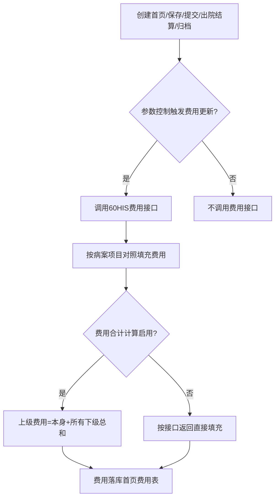
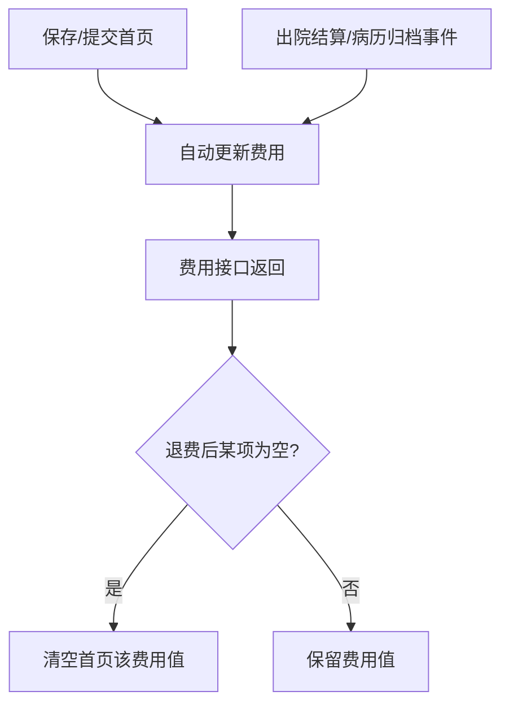

# BLGL-13-BASY-005费用信息获取与更新_ Analyst - Spec

> **需求编号**：BLGL-13-BASY-005
> **父需求**：BLGL-13-BASY
> **关联PM Spec**：BLGL-13-BASY-005_费用信息获取与更新_PM-spec.md
> **Spec版本**：V1.0
> **编写时间**：2026-08-13
> **编写人**：需求分析师

---

## 一、功能编号体系

### 1.1 功能层级结构

```
BLGL-13-BASY-005: 费用信息获取与更新
  ├─ BLGL-13-BASY-005-01: 费用信息获取
  ├─ BLGL-13-BASY-005-02: 费用信息自动更新
  ├─ BLGL-13-BASY-005-03: 费用合计计算
  ├─ BLGL-13-BASY-005-04: 中医费用获取
  └─ BLGL-13-BASY-005-05: 费用信息清空（退费场景）
```

### 1.2 功能编号表

| REQ-ID | 功能名称 | 类型 | 优先级 | 说明 |
|--------|---------|------|--------|------|
| BLGL-13-BASY-005-01 | 费用信息获取 | 功能 | P0 | 从60HIS接口获取费用信息 |
| BLGL-13-BASY-005-02 | 费用信息自动更新 | 功能 | P0 | 保存/提交/结算/归档触发更新 |
| BLGL-13-BASY-005-03 | 费用合计计算 | 功能 | P1 | 上级合并下级计算 |
| BLGL-13-BASY-005-04 | 中医费用获取 | 功能 | P1 | 中医病案首页费用字段 |
| BLGL-13-BASY-005-05 | 费用信息清空（退费场景） | 功能 | P1 | 退费后清空首页已有费用值 |

---

## 二、核心业务流程

### 2.1 费用信息获取流程



### 2.2 费用更新触发流程



---

## 三、功能规格说明

### BLGL-13-BASY-005-01: 费用信息获取

#### 3.1.1 功能概述

病案首页费用获取对接60HIS，首页字段从HIS接口获取。模板上使用正确的数据元，按照病案项目对照将首页需要的费用类别启用并设置对应概念标识。

#### 3.1.2 用户角色

| 角色 | 使用场景 | 权限要求 | 操作频率 |
|------|---------|---------|---------|
| 住院医生 | 查看首页费用信息 | 病历书写权限 | 高频 |
| 病案室人员 | 查看首页费用信息 | 病案查询权限 | 中频 |

#### 3.1.3 业务流程（Given/When/Then）

##### 主流程（1 个）

**Scenario 1: 费用信息获取**

```gherkin
Given:
  - 参数 MEDICAL007 病案首页费用获取及更新=接口获取
  - 模板使用正确的费用数据元

When:
  - 医生创建首页

Then:
  - 从60HIS接口获取费用信息
  - 按病案项目对照填充至首页费用字段
  - 首页费用类别和术语类别保持一致
```

##### 异常流程（3 个）

**Scenario 2: 业务异常——病案项目对照缺失**

```gherkin
Given:
  - 某费用类别未在病案项目对照中启用

When:
  - 首页获取费用信息

Then:
  - 该费用类别不填充
```

**Scenario 3: 数据异常——费用接口无返回**

```gherkin
Given:
  - 60HIS费用接口无返回

When:
  - 首页获取费用

Then:
  - 费用字段留空，等待下次触发更新
```

**Scenario 4: 系统异常——费用接口超时**

```gherkin
Given:
  - 60HIS费用接口超时

When:
  - 医生保存首页

Then:
  - 费用不更新，保留已有费用
```

##### 边界流程（2 个）

**Scenario 5: 边界——费用类别有效位数**

```gherkin
Given:
  - 首页费用信息含多余有效位数

When:
  - 首页展示费用

Then:
  - 只保留有效位数
```

**Scenario 6: 边界——结算自付金额为0**

```gherkin
Given:
  - 结算自付金额为0

When:
  - 首页展示自付金额

Then:
  - 首页显示0，不显示"-"
```

#### 3.1.5 验收标准

| AC编号 | 验收标准 | 对应REQ-ID | 验证方法 | 验证场景 |
|--------|---------|-----------|---------|---------|
| AC-001 | 创建首页时费用信息从HIS接口获取填充 | BLGL-13-BASY-005-01 | 功能测试 | Scenario 1 |
| AC-002 | 结算自付金额为0时显示0不显示"-" | BLGL-13-BASY-005-01 | 功能测试 | Scenario 6 |

---

### BLGL-13-BASY-005-02: 费用信息自动更新

#### 3.2.1 功能概述

病案首页点击保存及提交时自动更新费用信息，刷新费用数据。参数"出院结算和病历归档是否触发首页费用信息更新"=是时监听出院结算事件和病历归档获取费用信息落库。

#### 3.2.2 用户角色

| 角色 | 使用场景 | 权限要求 | 操作频率 |
|------|---------|---------|---------|
| 住院医生 | 保存/提交首页触发费用更新 | 病历书写权限 | 高频 |

#### 3.2.3 业务流程（Given/When/Then）

##### 主流程（1 个）

**Scenario 1: 保存提交更新费用**

```gherkin
Given:
  - 患者有费用信息

When:
  - 医生点击保存或提交病案首页

Then:
  - 自动更新费用信息，刷新费用数据
```

##### 异常流程（3 个）

**Scenario 2: 业务异常——出院结算触发**

```gherkin
Given:
  - 参数"出院结算和病历归档是否触发首页费用信息更新"=是

When:
  - 患者出院结算/病历归档

Then:
  - 监听出院结算事件和病历归档获取费用信息落到首页费用表
  - 创建首页和提交首页时根据参数判断是否调用费用接口（参数是则不调用）
```

**Scenario 3: 数据异常——结算事件未触发**

```gherkin
Given:
  - 参数=是但结算事件未触发

When:
  - 患者出院

Then:
  - 费用信息不自动更新
  - 医生可通过保存/提交触发更新
```

**Scenario 4: 系统异常——更新接口异常**

```gherkin
Given:
  - 费用更新接口异常

When:
  - 医生保存首页

Then:
  - 费用不更新，保留已有费用，记录日志
```

##### 边界流程（2 个）

**Scenario 5: 边界——参数为否**

```gherkin
Given:
  - 参数"出院结算和病历归档是否触发首页费用信息更新"=否

When:
  - 创建首页/提交首页

Then:
  - 调用费用信息接口（：参数否时调用）
```

**Scenario 6: 边界——多次保存**

```gherkin
Given:
  - 医生多次保存首页

When:
  - 每次点击保存

Then:
  - 每次保存都更新费用信息
```

#### 3.2.5 验收标准

| AC编号 | 验收标准 | 对应REQ-ID | 验证方法 | 验证场景 |
|--------|---------|-----------|---------|---------|
| AC-001 | 点击保存及提交时自动更新费用信息 | BLGL-13-BASY-005-02 | 功能测试 | Scenario 1 |
| AC-002 | 参数=是时出院结算/归档触发费用更新 | BLGL-13-BASY-005-02 | 功能测试 | Scenario 2 |

---

### BLGL-13-BASY-005-03: 费用合计计算

#### 3.3.1 功能概述

参数"病案首页是否启用费用合计计算"=是时，病案首页获取费用时上级合并下级进行计算：上级费用=本身+所有下级总和；上级费用没返回只返回下级费用时也需要组装。

#### 3.3.2 用户角色

| 角色 | 使用场景 | 权限要求 | 操作频率 |
|------|---------|---------|---------|
| 住院医生 | 查看首页费用合计 | 病历书写权限 | 中频 |

#### 3.3.3 业务流程（Given/When/Then）

##### 主流程（1 个）

**Scenario 1: 费用合计计算**

```gherkin
Given:
  - 参数"病案首页是否启用费用合计计算"=是
  - 费用上下级关系已配置（病案项目代码概念域）

When:
  - 首页获取费用

Then:
  - 上级费用=本身+所有下级总和
  - 例：西药费=西药费+抗菌药物费
```

##### 异常流程（3 个）

**Scenario 2: 业务异常——上级费用未返回**

```gherkin
Given:
  - 上级费用没返回，只返回下级费用

When:
  - 首页获取费用

Then:
  - 上级费用默认为0元，按下级费用组装计算
  - 例：西药费未返回即0元，抗菌药物费1元，西药费计算总和为1元
```

**Scenario 3: 数据异常——费用关系未配置**

```gherkin
Given:
  - 费用上下级关系未配置

When:
  - 首页获取费用

Then:
  - 按接口返回数据直接填充
```

**Scenario 4: 系统异常——计算接口异常**

```gherkin
Given:
  - 费用计算服务异常

When:
  - 首页获取费用

Then:
  - 按接口返回直接填充，不进行合计计算
```

##### 边界流程（2 个）

**Scenario 5: 边界——合计计算未启用**

```gherkin
Given:
  - 参数"病案首页是否启用费用合计计算"=否

When:
  - 首页获取费用

Then:
  - 按照接口返回数据直接填充，每个类别接口返回多少就填充多少
```

**Scenario 6: 边界——对接60HIS**

```gherkin
Given:
  - 病案首页费用合计计算对接60HIS

When:
  - 首页费用合计计算

Then:
  - 对接60HIS系统必须设置为是（功能清单 COST003）
```

#### 3.3.5 验收标准

| AC编号 | 验收标准 | 对应REQ-ID | 验证方法 | 验证场景 |
|--------|---------|-----------|---------|---------|
| AC-001 | 合计计算启用时上级费用=本身+所有下级总和 | BLGL-13-BASY-005-03 | 功能测试 | Scenario 1 |
| AC-002 | 上级费用未返回时按下级费用组装计算 | BLGL-13-BASY-005-03 | 功能测试 | Scenario 2 |

---

### BLGL-13-BASY-005-04: 中医费用获取

#### 3.4.1 功能概述

中医病案首页从对接60HIS获取费用数据，需实现中医费用落库、中医费用填充至首页。费用字段包括配方颗粒费、中医辨证论治费、中医诊断费、中医治疗费等。

#### 3.4.2 用户角色

| 角色 | 使用场景 | 权限要求 | 操作频率 |
|------|---------|---------|---------|
| 住院医生 | 查看首页中医费用 | 病历书写权限 | 中频 |

#### 3.4.3 业务流程（Given/When/Then）

##### 主流程（1 个）

**Scenario 1: 中医费用获取**

```gherkin
Given:
  - 中医病案首页
  - 对接60HIS

When:
  - 首页获取费用信息

Then:
  - 中医费用落库
  - 中医费用填充至首页费用字段
```

##### 异常流程（3 个）

**Scenario 2: 业务异常——中医费用未配置**

```gherkin
Given:
  - 中医费用类别未在病案项目对照中启用

When:
  - 首页获取中医费用

Then:
  - 该类别不填充
```

**Scenario 3: 数据异常——费用字段缺失**

```gherkin
Given:
  - 60HIS未返回某中医费用字段

When:
  - 首页获取费用

Then:
  - 该字段留空
```

**Scenario 4: 系统异常——费用接口异常**

```gherkin
Given:
  - 60HIS费用接口异常

When:
  - 首页获取中医费用

Then:
  - 中医费用不更新，保留已有值
```

##### 边界流程（2 个）

**Scenario 5: 边界——配方颗粒费**

```gherkin
Given:
  - 病案首页费用信息表增加配方颗粒费字段

When:
  - 首页获取费用

Then:
  - 配方颗粒费填充
```

**Scenario 6: 边界——中医治疗费细分**

```gherkin
Given:
  - 中医治疗费有多个细分字段

When:
  - 首页获取费用

Then:
  - 中医外治费/中医骨伤费/针刺与灸法费等分别填充
```

#### 3.4.5 验收标准

| AC编号 | 验收标准 | 对应REQ-ID | 验证方法 | 验证场景 |
|--------|---------|-----------|---------|---------|
| AC-001 | 中医费用从60HIS获取并落库填充首页 | BLGL-13-BASY-005-04 | 功能测试 | Scenario 1 |
| AC-002 | 配方颗粒费等字段正确填充 | BLGL-13-BASY-005-04 | 功能测试 | Scenario 5 |

---

### BLGL-13-BASY-005-05: 费用信息清空（退费场景）

#### 3.5.1 功能概述

先写首页时某分类有费用，后产生退费，需把已填充的费用清空。后端给前端接口传所有病案项目，为空项直接传空值，接口为空时同步清空首页数据元已有值。

#### 3.5.2 用户角色

| 角色 | 使用场景 | 权限要求 | 操作频率 |
|------|---------|---------|---------|
| 住院医生 | 查看首页费用（退费场景） | 病历书写权限 | 中频 |

#### 3.5.3 业务流程（Given/When/Then）

##### 主流程（1 个）

**Scenario 1: 退费清空费用**

```gherkin
Given:
  - 首页某分类已填充费用
  - 后产生退费，接口返回该分类为空

When:
  - 医生点击同步/保存/提交

Then:
  - 后端给前端传所有病案项目，为空项传空值
  - 首页数据元中已有费用值被清空
```

##### 异常流程（3 个）

**Scenario 2: 业务异常——部分退费**

```gherkin
Given:
  - 某费用分类部分退费

When:
  - 首页同步费用

Then:
  - 该分类填充退费后的剩余金额
```

**Scenario 3: 数据异常——接口异常未返回**

```gherkin
Given:
  - 费用接口未返回

When:
  - 首页同步费用

Then:
  - 费用不清空，保留已有值
```

**Scenario 4: 系统异常——同步接口异常**

```gherkin
Given:
  - 同步费用接口异常

When:
  - 医生点击同步

Then:
  - 费用不更新，保留已有值，记录日志
```

##### 边界流程（2 个）

**Scenario 5: 边界——费用全部清空**

```gherkin
Given:
  - 全部费用退费

When:
  - 首页同步费用

Then:
  - 首页费用字段全部清空
```

**Scenario 6: 边界——费用新增**

```gherkin
Given:
  - 首页某分类费用为空，后新增费用

When:
  - 首页同步费用

Then:
  - 新增费用填充至首页
```

#### 3.5.5 验收标准

| AC编号 | 验收标准 | 对应REQ-ID | 验证方法 | 验证场景 |
|--------|---------|-----------|---------|---------|
| AC-001 | 退费后接口返回空值时清空首页已有费用值 | BLGL-13-BASY-005-05 | 功能测试 | Scenario 1 |
| AC-002 | 全部退费时首页费用字段全部清空 | BLGL-13-BASY-005-05 | 功能测试 | Scenario 5 |

---

## 四、排除范围

本需求不包含以下功能项：

1. **患者基本信息自动获取** - 归属 BLGL-13-BASY-002
2. **首页提交与校验** - 归属 BLGL-13-BASY-007
4. **医疗付费方式对照配置** - 归属 BLGL-13-BASY-010

---

## 五、业务规则清单

| 规则ID | 规则名称 | 规则描述 | 来源 | 优先级 |
|--------|---------|---------|------|--------|
| BR-001 | 费用获取方式 | 参数 MEDICAL007=接口获取时从HIS获取，按病案项目对照填充 | | P0 |
| BR-002 | 保存提交更新费用 | 点击保存及提交时自动更新费用信息 | | P0 |
| BR-003 | 结算归档触发更新 | 参数=是时监听出院结算和归档触发费用更新 | | P1 |
| BR-004 | 费用合计计算 | 上级费用=本身+所有下级总和，上级未返回按0组装 | | P1 |
| BR-005 | 退费清空 | 退费后接口返回空值时清空首页已有费用值 | | P1 |
| BR-006 | 自付金额显示 | 结算自付金额为0时显示0不显示"-" | | P1 |

---

## 六、关联文档

| 文档类型 | 文档路径 | 说明 |
|---------|---------|------|
| PM-Spec（业务视角） | 本目录 BLGL-13-BASY-005_费用信息获取与更新_PM-spec.md（V0.1） | PM 产出的 Spec 文档 |
| Spec（研发视角） | 本目录 BLGL-13-BASY-005_费用信息获取与更新-Spec.md（V1.0） | 业务背景与目标 Spec |
| 功能点Spec（模块级） | BLGL-13-BASY 13病案首页功能点Spec.md（V1.0，上级目录） | Phase 1 功能点索引 |
| data-model.md | 待产出 | 架构师产出的数据建模文档 |
| design.md | 待产出 | 架构师产出的技术方案文档 |
| api-contract.md | 待产出 | 开发经理产出的 API 契约文档 |

---

## 七、待确认问题清单

| 编号 | 问题描述 | 缺失信息 | 影响范围 | 建议补充方 |
|------|---------|---------|---------|-----------|
| Q-001 | 费用更新状态定义 | 状态机 | 数据模型-状态定义 | 产品经理 |
| Q-002 | 费用接口返回结构具体字段 | 接口契约 | 接口详细设计 | 开发经理 |
| Q-003 | 费用获取性能指标 | 性能指标 | 非功能性要求 | 产品经理 |
| Q-004 | 病案项目对照完整映射关系 | 数据元映射 | 费用类别填充 | 模块负责人 |

---

## 填写检查清单

| 序号 | 检查项 | 是否完成 |
|:----:|--------|:--------:|
| 1 | 功能编号带父子层级 | ✅ |
| 2 | 每个 REQ-ID 有功能概述和用户角色 | ✅ |
| 3 | 主流程至少 1 个 Given/When/Then 场景 | ✅ |
| 4 | 异常流程至少 3 个 Given/When/Then 场景 | ✅ |
| 5 | 边界流程至少 2 个 Given/When/Then 场景 | ✅ |
| 6 | 每个 Given/When/Then 内容具体，不模糊 | ✅ |
| 7 | 数据字段定义完整（字段名、类型、必填、说明、概念ID） | ✅ |
| 8 | 验收标准 AC 编号独立，可验证 | ✅ |
| 9 | 验收标准无"功能正常"等模糊表述 | ✅ |
| 10 | 排除范围明确列出 | ✅ |
| 11 | 业务规则清单列出所有规则，每条标注来源 | ✅ |
| 12 | 流程图使用 Mermaid 格式（≥2 个） | ✅ |
| 13 | 关联文档索引包含 Phase 1 功能点Spec | ✅ |
| 14 | 待确认问题清单汇总了全文所有 ⏳ 项 | ✅ |
| 15 | 全文无占位符 `< >` 残留 | ✅ |
| 16 | 全文陈述可溯源至资料区（S1~S10 溯源核查） | ✅ |
| 17 | 人工审核确认完成 | ⏳ 待确认 |

---

**文档状态**：⬜ 待审核
**维护责任**：需求分析师规范组
**下次更新**：根据评审反馈优化

---

## 版本历史

| 版本 | 日期 | 变更说明 | 编写人 |
|------|------|---------|--------|
| V1.0 | 2026-08-13 | 初始版本 | 需求分析师 |
