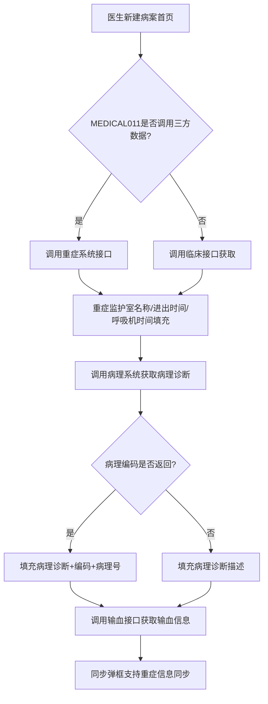
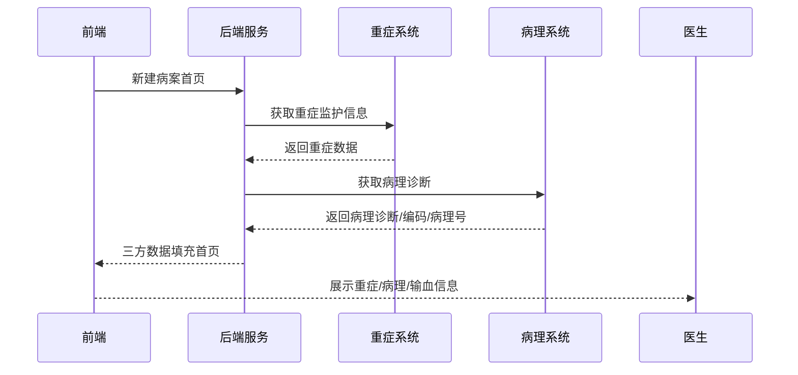

# BLGL-13-BASY-006 重症监护与三方数据获取 - Spec

> **功能编号**：BLGL-13-BASY-006
> **文档类型**：Spec（研发视角）
> **文档版本**：V1.0
> **编写时间**：2026-08-13
> **编写人**：RACC

---

## 文档索引

本节提供本文档的章节结构索引与关联文档索引，便于读者快速定位与检索。

#### 章节索引

**Spec（研发视角）**

| 章节号 | 章节名称 | 内容说明 |
|--------|---------|---------|
| 1、 | 文档概述 | 文档目的、文档范围、术语定义、阅读指南、参考文档 |
| 2、 | 功能背景与定位 | 功能背景、功能定位、目标用户、核心价值 |
| 3、 | 业务流程设计 | 主流程/异常流程/边界流程（Given/When/Then） |
| 4、 | 数据模型设计 | 核心数据结构、状态定义、系统参数定义 |
| 5、 | 接口契约设计 | API列表、接口详细设计、错误码定义 |
| 6、 | 技术方案设计 | 页面路径、技术栈、关键技术点、部署方案 |
| 7、 | 测试用例预设计 | 功能/边界/异常/性能测试用例 |
| 8、 | 非功能性要求 | 性能、安全、可用性、兼容性 |
| 9、 | 依赖与风险 | 外部依赖、风险项 |
| 10、 | 附录 | 流程图、时序图、参考文档 |

**PM-Spec（业务视角）**

| 章节号 | 章节名称 | 内容说明 |
|--------|---------|---------|
| 一 | 目标 | 功能定位与核心价值 |
| 二 | 约束 | 业务/技术/非功能性约束 |
| 三 | 验收标准 | 验收条件与验证方法 |
| 四 | 排除范围 | 本次不做项与明确边界 |
| 五 | 关键决策记录 | 方案决策与选型理由 |
| 六 | 优先级 | 优先级定义 |
| 七 | 关联文档 | 关联文档索引 |
| 附录 | 填写检查清单 | 质量检查 |

**Analyst-Spec（产品视角）**

| 章节号 | 章节名称 | 内容说明 |
|--------|---------|---------|
| 一 | 功能编号体系 | 带父子层级的编号树 |
| 二 | 核心业务流程 | Mermaid 流程图 |
| 三 | 功能规格说明 | 各子功能点的概述、用户角色、业务流程、验收标准 |
| 四 | 排除范围 | 本需求不包含的功能项 |
| 五 | 业务规则清单 | 规则ID、规则名称、规则描述、优先级 |
| 六 | 关联文档 | 文档类型、文档路径、说明 |
| 七 | 待确认问题清单 | 所有 ⏳ 待确认项的汇总 |
| - | 填写检查清单 | 检查项与完成状态 |

#### 版本历史

| 版本 | 日期 | 变更说明 | 编写人 |
|------|------|---------|--------|
| V1.0 | 2026-08-13 | 初始版本 | RACC |

#### 关联文档索引

| 序号 | 文档名称 | 文档类型 | 版本 | 位置 |
|------|---------|---------|------|------|
| 1 | BLGL-13-BASY-006_重症监护与三方数据获取_PM-spec.md | PM-Spec（业务视角） | V0.1 | 本目录 |
| 2 | BLGL-13-BASY-006_重症监护与三方数据获取_Analyst-spec.md | Analyst-Spec（产品视角） | V1.0 | 本目录 |
| 3 | BLGL-13-BASY-006_重症监护与三方数据获取-Spec.md | Spec（研发视角） | V1.0 | 本目录 |
| 4 | BLGL-13-BASY 13病案首页功能点Spec.md | 功能点Spec（模块级） | V1.0 | 上级目录 |

---

## 1、文档概述

### 1.1、文档目的

本文档旨在明确"重症监护与三方数据获取"功能（BLGL-13-BASY-006）的业务背景与设计方案，为需求分析、研发实现、测试验收及评审提供统一的业务上下文、设计口径与决策依据。

**具体目的包括**：

1. 梳理重症监护与三方数据获取功能的业务由来与历史需求演进脉络，说明"为什么要做"；
2. 明确功能的定位边界、目标用户与核心价值，回答"做成什么"；
3. 描述功能的业务流程、数据模型、接口契约与技术方案，回答"怎么做"；
4. 预设计测试用例并明确非功能性要求、依赖与风险，为研发与验收提供依据；
5. 作为 SPEC（功能编号体系、功能详情、业务规则、验收标准等章节）的业务前提与设计输入，保证各层文档业务口径一致。

### 1.2、文档范围

#### 1.2.1 纳入范围

本文档覆盖重症监护与三方数据获取的完整业务背景与设计，包括：

- 重症监护信息自动获取（重症监护室名称、进出时间、呼吸机使用时间）
- 病理诊断获取（病理诊断、疾病编码、病理号）
- 输血信息获取（红细胞、血小板、血浆、自体输血）
- 呼吸机使用时间自动获取（有创呼吸机）
- 生活能力评定得分获取
- 重症监护室名称对照配置

#### 1.2.2 排除范围

本文档不涉及以下内容（详见其他功能点或模块）：

- 患者基本信息自动获取——见 BLGL-13-BASY-002
- 手术信息获取与管理（手术信息三方来源）——见 BLGL-13-BASY-004
- 首页参数与映射配置（重症监护室名称对照）——见 BLGL-13-BASY-010

### 1.3、术语定义

| 术语 | 定义 |
|------|------|
| 重症监护信息 | 首页重症监护室名称、进出室时间、呼吸机使用时间 |
| 病理诊断 | 病理系统提供的病理诊断、疾病编码、病理号 |
| 输血信息 | 红细胞、血小板、血浆、全血的取血量 |
| 呼吸机使用时间 | 有创呼吸机时长，按临床服务配置计算 |
| 生活能力评定得分 | 入院/出院日常生活能力评定量表得分 |
| 重症监护室名称对照 | 将院内科室码转换为重症科室标准字典 |

### 1.4、阅读指南

- **章节关系**：第1~2章为阅读铺垫与业务全貌（背景、定位、用户、价值）；第3~10章为设计实现层（流程、数据、接口、技术、测试、非功能、依赖风险、附录），可直接用于研发与测试。与 Analyst-Spec、PM-Spec 的详细规则/验收口径互相引用，保持一致。
- **读者对象**：
  - 产品经理/需求分析师：阅读第1~2章了解业务全貌，据此维护 PM-Spec 与功能清单；
  - 研发：阅读第3~6章用于开发实现，第9~10章用于依赖评估与联调；
  - 测试：阅读第3章、第7~8章用于用例设计与验收；
  - 评审人员：以本文档为业务口径与设计基准，核对各层文档一致性。

### 1.5、参考文档

| 序号 | 文档名称 | 版本/日期 |
|------|---------|----------|
| 1 | 【历史需求】病案首页需求-0727.xlsx | - |
| 2 | BLGL-13-BASY-006_重症监护与三方数据获取_PM-spec.md | V0.1 |
| 3 | BLGL-13-BASY-006_重症监护与三方数据获取_Analyst-spec.md | V1.0 |
| 4 | BLGL-13-BASY 13病案首页功能点Spec.md | V1.0 |
| 5 | WiNEX-病案首页_功能清单_20260325_162900.md | 2026-03-25 |

---

## 2、功能背景与定位

### 2.1 功能背景

重症监护与三方数据获取是病案首页的数据完整性补充，需满足：

- **法规/规范依据**：重症监护信息、病理诊断需在病案首页体现
- **管理要求**：重症监护室数据需对接重症系统自动同步
- **现状痛点**：病案室电话联系获取输血量/不良反应数据，效率低
- **历史需求演进**：从"重症数据对接"→"病理诊断同步"→"重症监护信息自动获取"→"有创呼吸机时长自动获取"

### 2.2 功能定位

"重症监护与三方数据获取"是WiNEX病历管理-病案首页模块的数据层功能，定位为：

- **三方对接定位**：首页重症/病理/输血等数据从三方系统自动获取
- **参数控制定位**：MEDICAL011 等参数控制是否调用三方数据
- **数据完整性定位**：补充首页诊疗数据完整性

### 2.3 目标用户

| 用户角色 | 主要使用场景 |
|---------|-------------|
| 住院医生 | 查看首页重症监护、病理、输血、呼吸机信息 |
| 病案室人员 | 查看首页三方数据 |

### 2.4 核心价值

| 价值维度 | 价值描述 |
|---------|---------|
| 数据自动获取 | 重症/病理/输血数据三方自动获取，减少手工录入 |
| 效率提升 | 无需电话联系获取数据 |
| 数据准确 | 病理诊断、疾病编码从病理系统同步 |

---

## 3、业务流程设计（Given/When/Then）

### 3.1 主流程

**Scenario 1: 重症监护信息自动获取**

```gherkin
Given:
  - 参数 MEDICAL011 病案首页是否调用接口组提供的三方数据集合=是

When:
  - 医生新建病案首页
  - 系统调用重症系统接口

Then:
  - 重症监护室名称（399337111）、进重症监护室时间（399337116）、出重症监护室时间（399337117）、呼吸机使用时间（399336656）自动填充
  - 【同步】弹框增加"重症信息"的同步
```

### 3.2 异常流程

**Scenario 2: 业务异常——重症监护数据取值来源配置**

```gherkin
Given:
  - 参数"病案首页重症监护数据取值来源"=2（患者住院科室中重症科室）

When:
  - 首页获取重症信息

Then:
  - 根据患者住院科室筛选重症监护科室信息填充
```

**Scenario 3: 数据异常——病理系统未返回编码**

```gherkin
Given:
  - 病理系统中病理诊断没有返回诊断编码

When:
  - 首页获取病理诊断

Then:
  - 支持填充病历诊断描述
```

**Scenario 4: 系统异常——三方接口超时**

```gherkin
Given:
  - 重症/病理/输血三方接口超时

When:
  - 医生创建首页

Then:
  - 三方数据不获取，字段留空
  - 医生可通过同步按钮重试
  - 记录系统异常日志
```

### 3.3 边界流程

**Scenario 5: 边界场景——呼吸机时间计算**

```gherkin
Given:
  - 参数"有创呼吸机对应临床服务名称设置"已配置

When:
  - 首页创建+同步按钮

Then:
  - 调用医嘱查询接口，过滤有创呼吸机临床服务医嘱
  - 计算开始时间-结束时间（分钟）求和，/60转为小时保留整数
```

**Scenario 6: 边界场景——重症监护室名称重复对照**

```gherkin
Given:
  - 同一科室已存在重症监护室名称对照

When:
  - 配置人员再次保存对照关系

Then:
  - 提示"XXX科室存在重复对照，请重新对照"
```

---

## 4、数据模型设计

### 4.1 核心数据结构

#### 4.1.1 核心保存请求

| 字段名 | 类型 | 必填 | 备注 |
|--------|------|------|------|
| encounterId | Long | 是 | 患者就诊标识 |
| 重症监护室名称 | String | 否 | 概念ID 399337111 |
| 进重症监护室时间 | Date | 否 | 概念ID 399337116 |
| 出重症监护室时间 | Date | 否 | 概念ID 399337117 |
| 呼吸机使用时间 | String | 否 | 概念ID 399336656 |

#### 4.1.2 核心表/实体

| 表/实体 | 关键字段 | 说明 |
|---------|---------|------|
| INP_EMR_MAHP_ICU | inpEmrMahpIcuId, encounterId | 首页重症监护表 |

### 4.2 状态定义

| 状态码 | 状态名称 | 说明 |
|--------|---------|------|
| ⏳ 待确认 | 三方数据同步状态 | 状态定义未在资料区完整找到 |

### 4.3 系统参数定义

| 参数编码 | 参数名称 | 说明 |
|---------|---------|------|
| MEDICAL011 | 病案首页是否调用接口组提供的三方数据集合，默认否 | 控制三方数据调用 |
| 首页获取重症监护信息接口地址 | 病案首页配置-基础参数 | 重症接口地址 |
| 病案首页重症监护数据取值来源 | 0-无、1-卫宁重症监护系统、2-患者住院科室中重症科室，默认1 | 重症数据来源 |
| 有创呼吸机对应临床服务名称设置 | 默认空 | 呼吸机时间计算配置 |

---

## 5、接口契约设计

### 5.1 API列表

| 序号 | API名称（代码函数） | 路径 | 方法 | 说明 |
|:----:|---------|------|:----:|------|
| 1 | saveInpEmrMahpIcu | /api/v1/emr_medical_archive/icu/save | POST | 保存首页重症监护信息 |
| 2 | queryBreathTimeByExampleMulti | /api/v1/inp_breath_time/query/by_example | POST | 查询呼吸机使用时间 |
| 3 | queryBloodExample | /api/v1/inp_emr_blood/query/by_example | POST | 查询输血信息 |
| 4 | queryEsbForOtherInfo | /api/v1/emr_medical_archive/esb_info/by_encounter_id | POST | 查询ESB日常评分等信息 |

### 5.2 接口详细设计

#### 5.2.1 保存首页重症监护信息

**请求参数**:
```json
{
  "encounterId": 123456,
  "icuList": [
    {
      "icuName": "ICU一区",
      "inIcuTime": "2026-08-01 10:00:00",
      "outIcuTime": "2026-08-03 08:00:00",
      "breathTime": "12"
    }
  ]
}
```

**返回值（成功）**:
```json
{
  "success": true,
  "data": null
}
```

**返回值（失败）**:
```json
{
  "success": false,
  "message": "重症监护信息保存失败",
  "data": null
}
```

> 📌 接口路径与函数名来自代码 InpatientMedicalArchiveController；入参/出参字段结构待与接口文档核对，部分为 `⏳ 待确认`。

### 5.3 错误码定义

| 错误码 | 错误信息 | 处理方式 |
|--------|---------|---------|
| ⏳ 待确认 | XXX科室存在重复对照，请重新对照 | 保存时提示 |

---

## 6、技术方案设计

### 6.1 页面路径

- **页面路径**: winning-webui-inpatient-clinicalnote-pango/src/pages/EmrMedicalRecord（病历书写容器，首页重症字段）
- **路由**: 病历目录-病案首页
- **核心逻辑模块**: InpatientEmrMedicalArchiveService（saveInpEmrMahpIcu）、InpatientEmrMedicalArchiveEsbInfoService、InpatientMedicalArchiveController

### 6.2 技术栈

| 类别 | 技术 | 版本 |
|------|------|------|
| 前端框架 | Vue（winning-webui-inpatient-clinicalnote-pango） | ⏳ 待确认 |
| 后端框架 | Java Spring Boot + Akso MVC | ⏳ 待确认 |

### 6.3 关键技术点

- 重症监护室名称对照：将院内科室码转换为重症科室标准字典，同一现场只支持一套编码体系
- 呼吸机使用时间：按临床服务过滤医嘱，计算开始-结束时间求和/60转为小时
- 病理诊断获取：MEDICAL011=是时调用接口组接口获取病理信息

### 6.4 部署方案

⏳ 待确认：部署方案未在资料区中找到

---

## 7、测试用例预设计

### 7.1 功能测试

| 用例编号 | 测试场景 | Given | When | Then |
|---------|---------|-------|------|------|
| TC-001 | 重症信息自动获取 | MEDICAL011=是 | 新建首页 | 重症监护室名称、进出时间、呼吸机时间填充 |
| TC-002 | 病理诊断同步 | 病理系统有数据 | 新建首页 | 病理诊断、疾病编码、病理号填充 |
| TC-003 | 输血信息获取 | 有输血信息 | 新建首页 | 红细胞/血小板/血浆填充 |

### 7.2 边界测试

| 用例编号 | 测试场景 | Given | When | Then |
|---------|---------|-------|------|------|
| TC-004 | 呼吸机时间计算 | 配置临床服务 | 创建首页 | 时间求和/60转小时保留整数 |
| TC-005 | 重症科室重复对照 | 已存在对照 | 再次保存 | 提示重复对照 |

### 7.3 异常测试

| 用例编号 | 测试场景 | Given | When | Then |
|---------|---------|-------|------|------|
| TC-006 | 病理编码未返回 | 病理无编码 | 获取病理诊断 | 填充诊断描述 |
| TC-007 | 三方接口超时 | 接口异常 | 创建首页 | 三方数据不获取，可同步重试 |

### 7.4 性能测试

| 用例编号 | 测试场景 | 指标 |
|---------|---------|------|
| TC-008 | 三方数据获取响应时间 | ⏳ 待确认 |

---

## 8、非功能性要求

### 8.1 性能要求

| 指标 | 要求 |
|------|------|
| 三方数据获取响应时间 | ⏳ 待确认 |

### 8.2 安全要求

| 要求 | 说明 |
|------|------|
| 患者数据隐私 | 重症/病理/输血数据属敏感医疗信息，遵循病历权限控制 |

**医疗行业特殊要求**

| 要求 | 说明 |
|------|------|
| 病理诊断准确性 | 病理诊断从病理系统准确同步 |

### 8.3 可用性要求

| 指标 | 要求值 |
|------|--------|
| ⏳ 待确认 | - |

### 8.4 兼容性要求

| 类型 | 要求 |
|------|------|
| 重症系统兼容 | 对接卫宁重症监护系统 |
| 病理系统兼容 | 对接病理系统/接口组 |

---

## 9、依赖与风险

### 9.1 外部依赖

| 依赖项 | 说明 |
|--------|------|
| 重症系统 | 重症监护信息来源 |
| 病理系统 | 病理诊断来源 |
| 接口组 | 三方数据统一封装 |
| 输血系统 | 输血信息、不良反应来源 |

### 9.2 风险项

| 风险项 | 等级 | 说明 | 应对方案 |
|--------|------|------|---------|
| 三方接口依赖 | 中 | 重症/病理/输血接口依赖三方稳定性 | 接口超时降级，字段留空可手工录入 |
| 重症监护室对照 | 中 | 同一现场只支持一套编码体系 | 重复对照校验提示 |

---

## 10、附录

### 10.1 流程图



### 10.2 时序图



### 10.3 参考文档

- WiNEX-病案首页_功能清单_20260325_162900.md（第2.2节数据获取-重症/病理）
- 【历史需求】病案首页需求-0727.xlsx（、325374、764915、965234、982867、991024 等）
- BLGL-13-BASY 13病案首页功能点Spec.md（V1.0）
- 关联Spec: BLGL-13-BASY-004 手术信息获取与管理 -Spec.md

---

## 填写检查清单

| 序号 | 检查项 | 是否完成 |
|:----:|--------|:--------:|
| 1 | 章节索引与正文章节一致 | ✅ |
| 2 | 版本历史记录完整 | ✅ |
| 3 | 关联文档索引已登记全部Spec | ✅ |
| 4 | 文档目的明确回答"为什么做/做成什么/怎么做" | ✅ |
| 5 | 纳入范围/排除范围清晰 | ✅ |
| 6 | 术语定义覆盖关键概念，从资料区可溯源 | ✅ |
| 7 | 参考文档已登记 | ✅ |
| 8 | 功能背景基于法规/规范/需求来源组织 | ✅ |
| 9 | 功能定位体现业务价值（3~5个定位点） | ✅ |
| 10 | 目标用户角色覆盖完整，在需求原文中有出处 | ✅ |
| 11 | 核心价值可陈述，与 Phase 1 口径一致 | ✅ |
| 12 | 业务流程：主流程≥1、异常≥3、边界≥2，Given/When/Then 具体 | ✅ |
| 13 | 数据模型：字段/表/状态/参数可溯源（概念ID/表名/参数编码） | ✅ |
| 14 | 接口契约：API列表+详细设计+错误码齐全或标记待确认 | ✅（错误码 ⏳） |
| 15 | 技术方案：页面路径/技术栈/关键点/部署方案或标记待确认 | ✅ |
| 16 | 测试用例：功能/边界/异常/性能覆盖，与第3章场景对应 | ✅ |
| 17 | 非功能性要求：性能/安全/可用性/兼容性指标可量化或标记待确认 | ✅ |
| 18 | 依赖与风险：外部依赖登记完整，风险有具体应对方案或标记待确认 | ✅ |
| 19 | 附录：流程图/时序图与正文流程一致 | ✅ |
| 20 | 全文无占位符 `< >` 残留 | ✅ |
| 21 | 全文陈述可溯源至资料区，无来源的已标记 ⏳ | ✅ |
| 22 | 人工审核确认完成 | ⏳ 待确认 |

---

**文档状态**：⬜ 待审核
**维护责任**：RACC
**下次更新**：根据评审反馈优化
