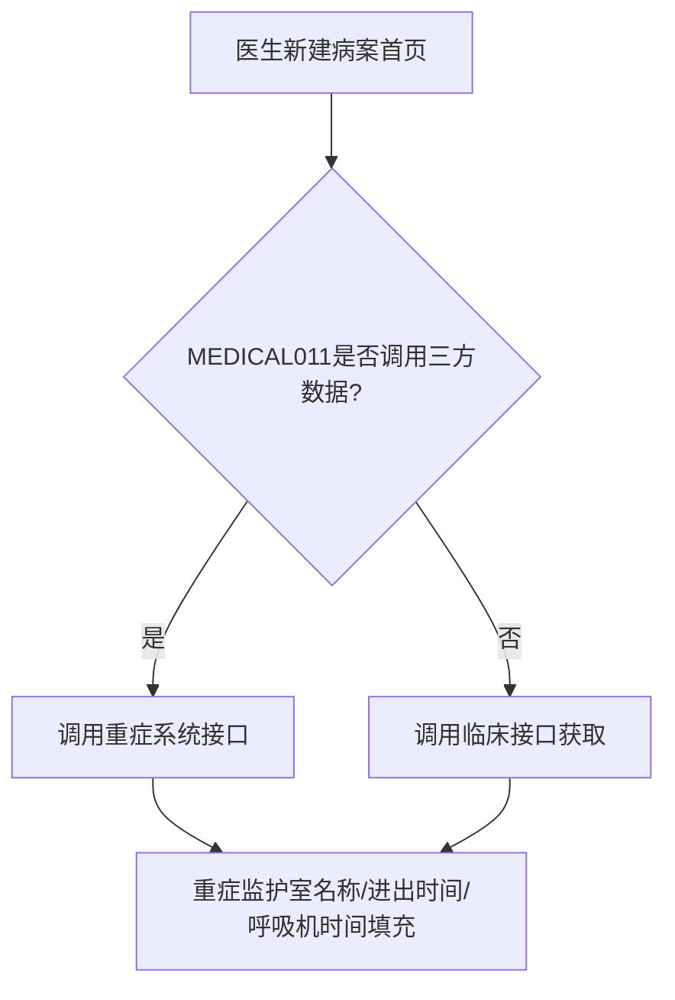
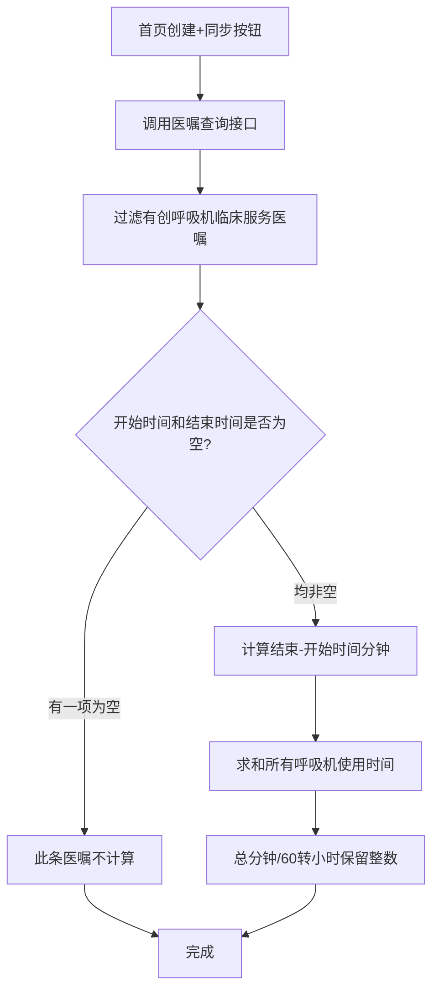

# BLGL-13-BASY-006重症监护与三方数据获取_ Analyst - Spec

> **需求编号**：BLGL-13-BASY-006
> **父需求**：BLGL-13-BASY
> **关联PM Spec**：BLGL-13-BASY-006_重症监护与三方数据获取_PM-spec.md
> **Spec版本**：V1.0
> **编写时间**：2026-08-13
> **编写人**：需求分析师

---

## 一、功能编号体系

### 1.1 功能层级结构

```
BLGL-13-BASY-006: 重症监护与三方数据获取
  ├─ BLGL-13-BASY-006-01: 重症监护信息获取
  ├─ BLGL-13-BASY-006-02: 病理诊断获取
  ├─ BLGL-13-BASY-006-03: 输血信息获取
  ├─ BLGL-13-BASY-006-04: 呼吸机使用时间获取
  └─ BLGL-13-BASY-006-05: 生活能力评定得分获取
```

### 1.2 功能编号表

| REQ-ID | 功能名称 | 类型 | 优先级 | 说明 |
|--------|---------|------|--------|------|
| BLGL-13-BASY-006-01 | 重症监护信息获取 | 功能 | P0 | 重症室名称/进出时间/呼吸机时间 |
| BLGL-13-BASY-006-02 | 病理诊断获取 | 功能 | P0 | 病理诊断/编码/病理号同步 |
| BLGL-13-BASY-006-03 | 输血信息获取 | 功能 | P1 | 红细胞/血小板/血浆/自体血 |
| BLGL-13-BASY-006-04 | 呼吸机使用时间获取 | 功能 | P1 | 有创呼吸机时长计算 |
| BLGL-13-BASY-006-05 | 生活能力评定得分获取 | 功能 | P1 | 入院/出院ADL得分 |

---

## 二、核心业务流程

### 2.1 重症监护信息获取流程



### 2.2 呼吸机时间计算流程



---

## 三、功能规格说明

### BLGL-13-BASY-006-01: 重症监护信息获取

#### 3.1.1 功能概述

根据参数 MEDICAL011 判断是否调用接口组提供的三方数据，当参数为"是"时从调用接口组提供的接口获取重症信息填充首页。重症监护数据取值来源参数支持 0-无、1-卫宁重症监护系统、2-患者住院科室中重症科室。

#### 3.1.2 用户角色

| 角色 | 使用场景 | 权限要求 | 操作频率 |
|------|---------|---------|---------|
| 住院医生 | 查看首页重症监护信息 | 病历书写权限 | 中频 |
| 病案室人员 | 查看首页重症信息 | 病案查询权限 | 中频 |

#### 3.1.3 业务流程（Given/When/Then）

##### 主流程（1 个）

**Scenario 1: 重症监护信息自动获取**

```gherkin
Given:
  - 参数 MEDICAL011=是
  - 重症系统已提供重症信息

When:
  - 医生新建病案首页

Then:
  - 重症监护室名称（399337111）、进重症监护室时间（399337116）、出重症监护室时间（399337117）、呼吸机使用时间（399336656）自动填充
  - 同步弹框增加"重症信息"的同步
```

##### 异常流程（3 个）

**Scenario 2: 业务异常——重症数据取值来源为2**

```gherkin
Given:
  - 参数"病案首页重症监护数据取值来源"=2（患者住院科室中重症科室）

When:
  - 首页获取重症信息

Then:
  - 查询INP_RHB_RECORD_DEPT_PERMISSION表患者本次住院科室
  - 筛选所有重症类型科室数据填充
```

**Scenario 3: 数据异常——重症接口无返回**

```gherkin
Given:
  - 重症系统接口无返回

When:
  - 医生新建首页

Then:
  - 重症字段留空，等待同步按钮重试
```

**Scenario 4: 系统异常——重症接口超时**

```gherkin
Given:
  - 重症系统接口超时

When:
  - 医生新建首页

Then:
  - 重症信息不获取，字段留空，记录日志
```

##### 边界流程（2 个）

**Scenario 5: 边界——重症监护室名称对照**

```gherkin
Given:
  - 重症监护室名称对照已配置（院内科室码→重症科室标准字典）

When:
  - 首页填充重症监护室名称

Then:
  - 填充对照后的标准名称（399337111）
```

**Scenario 6: 边界——重症科室名称重复**

```gherkin
Given:
  - 配置人员对同一科室重复对照

When:
  - 保存对照关系

Then:
  - 提示"XXX科室存在重复对照，请重新对照"
```

#### 3.1.5 验收标准

| AC编号 | 验收标准 | 对应REQ-ID | 验证方法 | 验证场景 |
|--------|---------|-----------|---------|---------|
| AC-001 | MEDICAL011=是时新建首页自动获取重症监护信息 | BLGL-13-BASY-006-01 | 功能测试 | Scenario 1 |
| AC-002 | 重症监护室名称重复对照时提示 | BLGL-13-BASY-006-01 | 功能测试 | Scenario 6 |

---

### BLGL-13-BASY-006-02: 病理诊断获取

#### 3.2.1 功能概述

根据参数 MEDICAL011 判断是否调用接口组提供的三方数据，当参数为"是"时从接口组提供的接口获取病理信息。病理诊断（399336514）、病理诊断编码（399587047）、病理号（399300419）从病理系统同步到病案首页。

#### 3.2.2 用户角色

| 角色 | 使用场景 | 权限要求 | 操作频率 |
|------|---------|---------|---------|
| 住院医生 | 查看首页病理诊断 | 病历书写权限 | 中频 |

#### 3.2.3 业务流程（Given/When/Then）

##### 主流程（1 个）

**Scenario 1: 病理诊断获取**

```gherkin
Given:
  - 参数 MEDICAL011=是
  - 病理系统已提供病理信息

When:
  - 医生新建病案首页

Then:
  - 病理诊断（399336514）、病理诊断编码（399587047）、病理号（399300419）自动填充
```

##### 异常流程（3 个）

**Scenario 2: 业务异常——病理编码未返回**

```gherkin
Given:
  - 病理系统中病理诊断没有返回诊断编码

When:
  - 首页获取病理诊断

Then:
  - 支持填充病历诊断描述
```

**Scenario 3: 数据异常——病理号按约定格式**

```gherkin
Given:
  - 病理号需按照约定格式传入

When:
  - 首页获取病理号

Then:
  - 病理号按约定格式填充
```

**Scenario 4: 系统异常——病理接口超时**

```gherkin
Given:
  - 病理系统接口超时

When:
  - 医生新建首页

Then:
  - 病理字段留空，可同步重试
```

##### 边界流程（2 个）

**Scenario 5: 边界——病理数据来源配置**

```gherkin
Given:
  - 参数"病理报告数据获取"配置

When:
  - 首页获取病理诊断

Then:
  - 支持从业务中台或病理报告获取（功能清单 DATA023）
```

**Scenario 6: 边界——病理诊断无编码**

```gherkin
Given:
  - 病理诊断无编码

When:
  - 首页获取病理诊断

Then:
  - 只填充病理诊断描述
```

#### 3.2.5 验收标准

| AC编号 | 验收标准 | 对应REQ-ID | 验证方法 | 验证场景 |
|--------|---------|-----------|---------|---------|
| AC-001 | 病理诊断、疾病编码、病理号从病理系统同步 | BLGL-13-BASY-006-02 | 功能测试 | Scenario 1 |
| AC-002 | 病理编码未返回时填充诊断描述 | BLGL-13-BASY-006-02 | 功能测试 | Scenario 2 |

---

### BLGL-13-BASY-006-03: 输血信息获取

#### 3.3.1 功能概述

首页新建时获取患者的输血信息，调医嘱提供输血信息接口，获取红细胞、血小板、血浆、全血的取血量，返回多条时累加对应项目。自体输血从手麻系统获取，输血不良反应从输血系统获取。

#### 3.3.2 用户角色

| 角色 | 使用场景 | 权限要求 | 操作频率 |
|------|---------|---------|---------|
| 住院医生 | 查看首页输血信息 | 病历书写权限 | 低频 |

#### 3.3.3 业务流程（Given/When/Then）

##### 主流程（1 个）

**Scenario 1: 输血信息获取**

```gherkin
Given:
  - 患者有输血信息

When:
  - 医生新建病案首页

Then:
  - 调医嘱输血信息接口获取红细胞、血小板、血浆、全血取血量
  - 返回多条时累加对应项目
  - 红细胞（399336665）、血小板（399336669）、血浆（399336668）填充
```

##### 异常流程（3 个）

**Scenario 2: 业务异常——自体输血获取**

```gherkin
Given:
  - 患者有自体输血

When:
  - 医生新建首页

Then:
  - 调手术接口对自体输血量（399336732）自动获取同步
```

**Scenario 3: 数据异常——不良反应自动获取**

```gherkin
Given:
  - 患者有输血不良反应

When:
  - 医生新建首页

Then:
  - 调书写系统同步患者不良反应数据（399301322）
```

**Scenario 4: 系统异常——输血接口异常**

```gherkin
Given:
  - 输血接口异常

When:
  - 医生新建首页

Then:
  - 输血信息不获取，可手工录入
```

##### 边界流程（2 个）

**Scenario 5: 边界——输血数据对接三方接口**

```gherkin
Given:
  - 病历数据同步》外部数据配置查询类型为接口

When:
  - 首页获取输血信息

Then:
  - 直接配置通过查询三方接口获取数据
```

**Scenario 6: 边界——冷沉淀暂不处理**

```gherkin
Given:
  - 输血数据含冷沉淀

When:
  - 首页获取输血信息

Then:
  - 冷沉淀暂不处理
```

#### 3.3.5 验收标准

| AC编号 | 验收标准 | 对应REQ-ID | 验证方法 | 验证场景 |
|--------|---------|-----------|---------|---------|
| AC-001 | 新建首页自动获取输血信息，多条累加 | BLGL-13-BASY-006-03 | 功能测试 | Scenario 1 |
| AC-002 | 自体输血量从手麻系统自动获取 | BLGL-13-BASY-006-03 | 功能测试 | Scenario 2 |

---

### BLGL-13-BASY-006-04: 呼吸机使用时间获取

#### 3.4.1 功能概述

参数"有创呼吸机对应临床服务名称设置"配置后，首页创建+同步按钮时：先调用医嘱查询接口，过滤所有有创呼吸机临床服务医嘱的开始时间和结束时间，计算结束-开始时间（分钟）求和，总分钟/60转小时保留整数。

#### 3.4.2 用户角色

| 角色 | 使用场景 | 权限要求 | 操作频率 |
|------|---------|---------|---------|
| 住院医生 | 查看首页呼吸机使用时间 | 病历书写权限 | 中频 |

#### 3.4.3 业务流程（Given/When/Then）

##### 主流程（1 个）

**Scenario 1: 呼吸机时间计算**

```gherkin
Given:
  - 参数"有创呼吸机对应临床服务名称设置"已配置
  - 患者有有创呼吸机医嘱

When:
  - 首页创建+同步按钮

Then:
  - 调用医嘱查询接口，过滤有创呼吸机临床服务医嘱
  - 计算开始-结束时间（分钟）求和
  - 总分钟/60转小时，四舍五入保留整数
```

##### 异常流程（3 个）

**Scenario 2: 业务异常——呼吸机时间缺项**

```gherkin
Given:
  - 某条呼吸机医嘱开始时间和结束时间有一项为空

When:
  - 系统计算呼吸机时间

Then:
  - 此条医嘱不计算
```

**Scenario 3: 数据异常——无呼吸机医嘱**

```gherkin
Given:
  - 患者无有创呼吸机医嘱

When:
  - 首页获取呼吸机时间

Then:
  - 呼吸机使用时间为空
```

**Scenario 4: 系统异常——医嘱查询接口异常**

```gherkin
Given:
  - 医嘱查询接口异常

When:
  - 首页创建

Then:
  - 呼吸机时间不计算，字段留空
```

##### 边界流程（2 个）

**Scenario 5: 边界——呼吸机收费项目配置**

```gherkin
Given:
  - 参数"呼吸机使用时间对应收费项目配置"已配置

When:
  - 首页获取呼吸机使用时间

Then:
  - 按收费项目配置获取（功能清单 HIST021）
```

**Scenario 6: 边界——自动提取重症时间**

```gherkin
Given:
  - 患者有重症医学科记录

When:
  - 首页获取重症时间

Then:
  - 自动提取重症医学科时间
```

#### 3.4.5 验收标准

| AC编号 | 验收标准 | 对应REQ-ID | 验证方法 | 验证场景 |
|--------|---------|-----------|---------|---------|
| AC-001 | 有创呼吸机时长按临床服务自动计算 | BLGL-13-BASY-006-04 | 功能测试 | Scenario 1 |
| AC-002 | 呼吸机医嘱时间缺项时不计算 | BLGL-13-BASY-006-04 | 功能测试 | Scenario 2 |

---

### BLGL-13-BASY-006-05: 生活能力评定得分获取

#### 3.5.1 功能概述

接口组提供查询患者最新的入院和出院的日常生活能力评定得分接口，病历增加参数"病案首页是否调用接口组提供的三方数据集合"判断是否调用（默认否）。入院日常生活能力评定量表得分（399336637）、出院日常生活能力评定量表得分（399336332）。

#### 3.5.2 用户角色

| 角色 | 使用场景 | 权限要求 | 操作频率 |
|------|---------|---------|---------|
| 住院医生 | 查看首页ADL得分 | 病历书写权限 | 低频 |

#### 3.5.3 业务流程（Given/When/Then）

##### 主流程（1 个）

**Scenario 1: ADL得分获取**

```gherkin
Given:
  - 参数"病案首页是否调用接口组提供的三方数据集合"=是

When:
  - 医生新建首页

Then:
  - 调用接口组查询患者最新入院和出院日常生活能力评定得分
  - 入院ADL得分（399336637）、出院ADL得分（399336332）填充
```

##### 异常流程（3 个）

**Scenario 2: 业务异常——参数为否**

```gherkin
Given:
  - 参数"病案首页是否调用接口组提供的三方数据集合"=否

When:
  - 医生新建首页

Then:
  - 不调用ADL接口，得分字段为空
```

**Scenario 3: 数据异常——ADL评分未同步**

```gherkin
Given:
  - 护理文书生活自理能力评估表已填写

When:
  - 首页获取ADL得分

Then:
  - ADL评分与住院护理文书生活自理能力评估表同步
```

**Scenario 4: 系统异常——接口组接口异常**

```gherkin
Given:
  - 接口组接口异常

When:
  - 医生新建首页

Then:
  - ADL得分不获取，字段留空
```

##### 边界流程（2 个）

**Scenario 5: 边界——附页ADL得分**

```gherkin
Given:
  - 首页附页中日常生活能力出院和入院评分

When:
  - 首页附页填充

Then:
  - 自动获取护理填写的评分
```

**Scenario 6: 边界——ADL得分合并需求**

```gherkin
Given:
  - 生活评定能力得分、病理字段

When:
  - 首页获取

Then:
  - 字段对接处理
```

#### 3.5.5 验收标准

| AC编号 | 验收标准 | 对应REQ-ID | 验证方法 | 验证场景 |
|--------|---------|-----------|---------|---------|
| AC-001 | 参数=是时ADL得分从接口组自动获取 | BLGL-13-BASY-006-05 | 功能测试 | Scenario 1 |
| AC-002 | 参数=否时ADL得分不获取 | BLGL-13-BASY-006-05 | 功能测试 | Scenario 2 |

---

## 四、排除范围

本需求不包含以下功能项：

1. **患者基本信息自动获取** - 归属 BLGL-13-BASY-002
2. **手术信息获取与管理（三方来源）** - 归属 BLGL-13-BASY-004
4. **重症监护室名称对照配置** - 归属 BLGL-13-BASY-010

---

## 五、业务规则清单

| 规则ID | 规则名称 | 规则描述 | 来源 | 优先级 |
|--------|---------|---------|------|--------|
| BR-001 | 三方数据调用控制 | 参数 MEDICAL011=是时调用接口组三方数据 | | P0 |
| BR-002 | 重症数据来源 | 取值来源：0-无、1-卫宁重症、2-住院科室重症科室 | | P0 |
| BR-003 | 重症监护室对照唯一 | 同一现场只支持一套编码体系，重复对照提示 | | P1 |
| BR-004 | 病理诊断同步 | 病理诊断、编码、病理号从病理系统同步 | | P0 |
| BR-005 | 输血信息获取 | 红细胞/血小板/血浆取血量，多条累加 | 需求 HIST021 | P1 |
| BR-006 | 呼吸机时间计算 | 临床服务医嘱时间差求和/60转小时保留整数 | | P1 |
| BR-007 | ADL得分获取 | 参数=是时调接口组获取入院/出院ADL得分 | 需求 HIST029 | P1 |

---

## 六、关联文档

| 文档类型 | 文档路径 | 说明 |
|---------|---------|------|
| PM-Spec（业务视角） | 本目录 BLGL-13-BASY-006_重症监护与三方数据获取_PM-spec.md（V0.1） | PM 产出的 Spec 文档 |
| Spec（研发视角） | 本目录 BLGL-13-BASY-006_重症监护与三方数据获取-Spec.md（V1.0） | 业务背景与目标 Spec |
| 功能点Spec（模块级） | BLGL-13-BASY 13病案首页功能点Spec.md（V1.0，上级目录） | Phase 1 功能点索引 |
| data-model.md | 待产出 | 架构师产出的数据建模文档 |
| design.md | 待产出 | 架构师产出的技术方案文档 |
| api-contract.md | 待产出 | 开发经理产出的 API 契约文档 |

---

## 七、待确认问题清单

| 编号 | 问题描述 | 缺失信息 | 影响范围 | 建议补充方 |
|------|---------|---------|---------|-----------|
| Q-001 | 三方数据同步状态定义 | 状态机 | 数据模型-状态定义 | 产品经理 |
| Q-002 | 三方接口返回结构具体字段 | 接口契约 | 接口详细设计 | 开发经理 |
| Q-003 | 三方数据获取性能指标 | 性能指标 | 非功能性要求 | 产品经理 |
| Q-004 | 输血接口配置方式 | 接口配置 | 输血信息获取 | 模块负责人 |

---

## 填写检查清单

| 序号 | 检查项 | 是否完成 |
|:----:|--------|:--------:|
| 1 | 功能编号带父子层级 | ✅ |
| 2 | 每个 REQ-ID 有功能概述和用户角色 | ✅ |
| 3 | 主流程至少 1 个 Given/When/Then 场景 | ✅ |
| 4 | 异常流程至少 3 个 Given/When/Then 场景 | ✅ |
| 5 | 边界流程至少 2 个 Given/When/Then 场景 | ✅ |
| 6 | 每个 Given/When/Then 内容具体，不模糊 | ✅ |
| 7 | 数据字段定义完整（字段名、类型、必填、说明、概念ID） | ✅ |
| 8 | 验收标准 AC 编号独立，可验证 | ✅ |
| 9 | 验收标准无"功能正常"等模糊表述 | ✅ |
| 10 | 排除范围明确列出 | ✅ |
| 11 | 业务规则清单列出所有规则，每条标注来源 | ✅ |
| 12 | 流程图使用 Mermaid 格式（≥2 个） | ✅ |
| 13 | 关联文档索引包含 Phase 1 功能点Spec | ✅ |
| 14 | 待确认问题清单汇总了全文所有 ⏳ 项 | ✅ |
| 15 | 全文无占位符 `< >` 残留 | ✅ |
| 16 | 全文陈述可溯源至资料区（S1~S10 溯源核查） | ✅ |
| 17 | 人工审核确认完成 | ⏳ 待确认 |

---

**文档状态**：⬜ 待审核
**维护责任**：需求分析师规范组
**下次更新**：根据评审反馈优化

---

## 版本历史

| 版本 | 日期 | 变更说明 | 编写人 |
|------|------|---------|--------|
| V1.0 | 2026-08-13 | 初始版本 | 需求分析师 |
