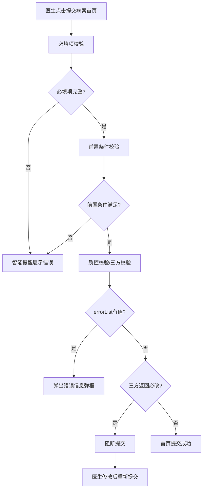
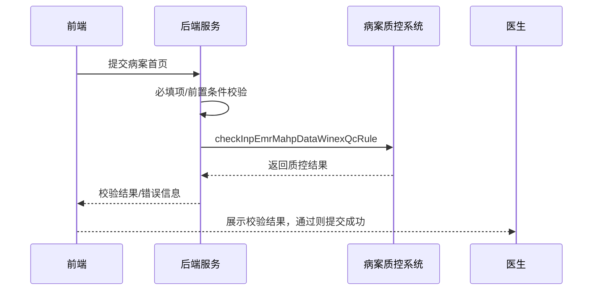

# BLGL-13-BASY-007 首页提交与校验 - Spec

> **功能编号**：BLGL-13-BASY-007
> **文档类型**：Spec（研发视角）
> **文档版本**：V1.0
> **编写时间**：2026-08-13
> **编写人**：RACC

---

## 文档索引

本节提供本文档的章节结构索引与关联文档索引，便于读者快速定位与检索。

#### 章节索引

**Spec（研发视角）**

| 章节号 | 章节名称 | 内容说明 |
|--------|---------|---------|
| 1、 | 文档概述 | 文档目的、文档范围、术语定义、阅读指南、参考文档 |
| 2、 | 功能背景与定位 | 功能背景、功能定位、目标用户、核心价值 |
| 3、 | 业务流程设计 | 主流程/异常流程/边界流程（Given/When/Then） |
| 4、 | 数据模型设计 | 核心数据结构、状态定义、系统参数定义 |
| 5、 | 接口契约设计 | API列表、接口详细设计、错误码定义 |
| 6、 | 技术方案设计 | 页面路径、技术栈、关键技术点、部署方案 |
| 7、 | 测试用例预设计 | 功能/边界/异常/性能测试用例 |
| 8、 | 非功能性要求 | 性能、安全、可用性、兼容性 |
| 9、 | 依赖与风险 | 外部依赖、风险项 |
| 10、 | 附录 | 流程图、时序图、参考文档 |

**PM-Spec（业务视角）**

| 章节号 | 章节名称 | 内容说明 |
|--------|---------|---------|
| 一 | 目标 | 功能定位与核心价值 |
| 二 | 约束 | 业务/技术/非功能性约束 |
| 三 | 验收标准 | 验收条件与验证方法 |
| 四 | 排除范围 | 本次不做项与明确边界 |
| 五 | 关键决策记录 | 方案决策与选型理由 |
| 六 | 优先级 | 优先级定义 |
| 七 | 关联文档 | 关联文档索引 |
| 附录 | 填写检查清单 | 质量检查 |

**Analyst-Spec（产品视角）**

| 章节号 | 章节名称 | 内容说明 |
|--------|---------|---------|
| 一 | 功能编号体系 | 带父子层级的编号树 |
| 二 | 核心业务流程 | Mermaid 流程图 |
| 三 | 功能规格说明 | 各子功能点的概述、用户角色、业务流程、验收标准 |
| 四 | 排除范围 | 本需求不包含的功能项 |
| 五 | 业务规则清单 | 规则ID、规则名称、规则描述、优先级 |
| 六 | 关联文档 | 文档类型、文档路径、说明 |
| 七 | 待确认问题清单 | 所有 ⏳ 待确认项的汇总 |
| - | 填写检查清单 | 检查项与完成状态 |

#### 版本历史

| 版本 | 日期 | 变更说明 | 编写人 |
|------|------|---------|--------|
| V1.0 | 2026-08-13 | 初始版本 | RACC |

#### 关联文档索引

| 序号 | 文档名称 | 文档类型 | 版本 | 位置 |
|------|---------|---------|------|------|
| 1 | BLGL-13-BASY-007_首页提交与校验_PM-spec.md | PM-Spec（业务视角） | V0.1 | 本目录 |
| 2 | BLGL-13-BASY-007_首页提交与校验_Analyst-spec.md | Analyst-Spec（产品视角） | V1.0 | 本目录 |
| 3 | BLGL-13-BASY-007_首页提交与校验-Spec.md | Spec（研发视角） | V1.0 | 本目录 |
| 4 | BLGL-13-BASY 13病案首页功能点Spec.md | 功能点Spec（模块级） | V1.0 | 上级目录 |

---

## 1、文档概述

### 1.1、文档目的

本文档旨在明确"首页提交与校验"功能（BLGL-13-BASY-007）的业务背景与设计方案，为需求分析、研发实现、测试验收及评审提供统一的业务上下文、设计口径与决策依据。

**具体目的包括**：

1. 梳理首页提交与校验功能的业务由来与历史需求演进脉络，说明"为什么要做"；
2. 明确功能的定位边界、目标用户与核心价值，回答"做成什么"；
3. 描述功能的业务流程、数据模型、接口契约与技术方案，回答"怎么做"；
4. 预设计测试用例并明确非功能性要求、依赖与风险，为研发与验收提供依据；
5. 作为 SPEC（功能编号体系、功能详情、业务规则、验收标准等章节）的业务前提与设计输入，保证各层文档业务口径一致。

### 1.2、文档范围

#### 1.2.1 纳入范围

本文档覆盖首页提交与校验的完整业务背景与设计，包括：

- 首页提交时必填项校验与级联规则校验
- 诊断/手术规则校验（损伤中毒外部因素、病理诊断必填等）
- 出院情况逻辑校验（与出院医嘱一致）
- 未提交病历校验（提交首页前校验其他未提交病历）
- 对接病案质控校验（60病案/WiNEX病案/三方）
- 质控结果展示（智能提醒-病历校验）

#### 1.2.2 排除范围

本文档不涉及以下内容（详见其他功能点或模块）：

- 首页创建与目录管理——见 BLGL-13-BASY-001
- 病案系统对接与数据上报——见 BLGL-13-BASY-008
- 首页撤销提交与修改——见 BLGL-13-BASY-009

### 1.3、术语定义

| 术语 | 定义 |
|------|------|
| 病历校验 | 提交首页时执行的前置校验（必填项/级联规则/诊断手术规则） |
| 质控校验 | 提交首页时调用病案质控系统/三方质控的校验 |
| errorList | 病案接口返回的错误信息列表 |
| qcResult | 质控校验结果列表 |
| 智能提醒-病历校验 | 病历校验结果展示区域 |
| 前置条件校验 | 提交前的业务前置条件校验 |

### 1.4、阅读指南

- **章节关系**：第1~2章为阅读铺垫与业务全貌（背景、定位、用户、价值）；第3~10章为设计实现层（流程、数据、接口、技术、测试、非功能、依赖风险、附录），可直接用于研发与测试。与 Analyst-Spec、PM-Spec 的详细规则/验收口径互相引用，保持一致。
- **读者对象**：
  - 产品经理/需求分析师：阅读第1~2章了解业务全貌，据此维护 PM-Spec 与功能清单；
  - 研发：阅读第3~6章用于开发实现，第9~10章用于依赖评估与联调；
  - 测试：阅读第3章、第7~8章用于用例设计与验收；
  - 评审人员：以本文档为业务口径与设计基准，核对各层文档一致性。

### 1.5、参考文档

| 序号 | 文档名称 | 版本/日期 |
|------|---------|----------|
| 1 | 【历史需求】病案首页需求-0727.xlsx | - |
| 2 | BLGL-13-BASY-007_首页提交与校验_PM-spec.md | V0.1 |
| 3 | BLGL-13-BASY-007_首页提交与校验_Analyst-spec.md | V1.0 |
| 4 | BLGL-13-BASY 13病案首页功能点Spec.md | V1.0 |
| 5 | WiNEX-病案首页_功能清单_20260325_162900.md | 2026-03-25 |

---

## 2、功能背景与定位

### 2.1 功能背景

首页提交与校验是病案首页的质量保障，需满足：

- **法规/规范依据**：病案首页提交需满足病历书写规范与质控要求
- **管理要求**：提交首页时执行必填项、级联规则、诊断/手术规则校验
- **现状痛点**：提交时校验失败的错误提示需返回前端展示
- **历史需求演进**：从"提交时校验"（功能清单 HIST003）→"首页提交校验提示"→"提交弹框逻辑优化"→"提交校验未提交病历"→"提交对接三方质控"

### 2.2 功能定位

"首页提交与校验"是WiNEX病历管理-病案首页模块的质量保障层，定位为：

- **校验保障定位**：首页提交前的必填项与规则校验
- **质控对接定位**：对接病案质控系统校验
- **拦截定位**：校验不通过阻断提交

### 2.3 目标用户

| 用户角色 | 主要使用场景 |
|---------|-------------|
| 住院医生 | 提交首页时执行校验，查看校验结果 |
| 质控人员 | 查看首页质控缺陷 |

### 2.4 核心价值

| 价值维度 | 价值描述 |
|---------|---------|
| 数据质量 | 提交前校验保障首页数据规范 |
| 合规性 | 诊断/手术规则校验满足上报要求 |
| 拦截保护 | 校验不通过阻断提交，避免错误数据上报 |

---

## 3、业务流程设计（Given/When/Then）

### 3.1 主流程

**Scenario 1: 首页提交校验流程**

```gherkin
Given:
  - 首页已填写完成
  - 参数"住院病历是否启用病案首页"=是

When:
  - 医生点击提交病案首页
  - 系统按顺序执行校验

Then:
  - 必填项校验→前置条件校验→质控校验、三方校验（顺序执行）
  - 校验通过后首页提交成功
  - 校验失败时在智能提醒-病历校验展示错误信息
```

### 3.2 异常流程

**Scenario 2: 业务异常——errorList有值弹框**

```gherkin
Given:
  - 病案接口返回 errorList 有值

When:
  - 医生提交病案首页

Then:
  - 弹出弹窗显示病案接口对应的错误信息
```

**Scenario 3: 数据异常——未提交病历存在**

```gherkin
Given:
  - 病历目录中存在未提交的病历

When:
  - 医生提交病案首页

Then:
  - 弹出提示，提醒医生提交未提交的病历
  - 提交完成之后才能提交病案首页
```

**Scenario 4: 系统异常——质控接口超时**

```gherkin
Given:
  - 病案质控/三方质控接口超时

When:
  - 医生提交首页

Then:
  - 质控校验不执行，首页提交状态待确认
  - 提示质控服务异常，记录日志
```

### 3.3 边界流程

**Scenario 5: 边界场景——三方质控拦截**

```gherkin
Given:
  - 参数"提交病案首页时给三方系统推送数据的对接方式"已配置
  - 三方返回"必改"错误

When:
  - 医生提交病案首页

Then:
  - "必改"限制医生不允许提交，需修改后再提交
  - "提示"允许医生继续提交首页
  - "提示"/"必改"均需展示给医生查看
```

**Scenario 6: 边界场景——出区前提交限制**

```gherkin
Given:
  - 参数 COMMON130 开启出区前不能提交部分病历的功能
  - 首页属于监控类型 COMMON131 中配置

When:
  - 医生在患者出区前提交首页

Then:
  - 不能提交首页（功能清单 SUB001）
```

---

## 4、数据模型设计

### 4.1 核心数据结构

#### 4.1.1 核心保存请求

| 字段名 | 类型 | 必填 | 备注 |
|--------|------|------|------|
| encounterId | Long | 是 | 患者就诊标识 |
| 校验结果 | String | 否 | 校验错误信息列表 |

#### 4.1.2 核心表/实体

| 表/实体 | 关键字段 | 说明 |
|---------|---------|------|
| INP_EMR_MAHP | inpEmrMahpId, encounterId | 首页主表（提交状态） |
| INPATIENT_EMR_SUBMITTED_RECORD | inpEmrSubmittedRecordId | 提交记录表 |

### 4.2 状态定义

| 状态码 | 状态名称 | 说明 |
|--------|---------|------|
| 已提交 | 首页已提交状态 | 提交成功后状态 |
| 未提交 | 首页未提交状态 | 可修改状态 |
| 已撤销提交 | 撤销提交状态 | 撤销后可修改 |

### 4.3 系统参数定义

| 参数编码 | 参数名称 | 说明 |
|---------|---------|------|
| COMMON130 | 是否开启出区前不能提交部分病历的功能 | 出区前提交限制 |
| COMMON131 | 患者出区前不能提交的病历监控类型 | 监控类型配置 |
| COMMON274 | 病案首页质控调用模式 | 60病案质控/60病案传输数据/三方 |
| 住院病历是否调用WiNEX病案首页质控 | 默认否 | 是否调用WiNEX病案质控 |

---

## 5、接口契约设计

### 5.1 API列表

| 序号 | API名称（代码函数） | 路径 | 方法 | 说明 |
|:----:|---------|------|:----:|------|
| 1 | saveEmrMedicalArchiveContentData | /api/v2/emr_inpatient/medical_archive_content/data_element/save | POST | 首页数据保存（提交时触发校验） |
| 2 | checkInpEmrMahpDataWinexQcRule | /api/v1/emr_medical_archive/data_winex_qc_rule/check | POST | 首页数据调用WiNEX病案质控 |
| 3 | checkInpEmrElements | /api/v1/inp/emr/elements/check | POST | 校验病历元素信息（通用） |
| 4 | checkEmrMahpSurgeryIncisionHealLvRule | /api/v1/emr_mahp/surgery/incision_heal_lv_rule/check | POST | 校验手术和切口规则 |

### 5.2 接口详细设计

#### 5.2.1 首页数据调用WiNEX病案质控

**请求参数**:
```json
{
  "encounterId": 123456,
  "inpEmrMahpId": 789
}
```

**返回值（成功）**:
```json
{
  "success": true,
  "data": {
    "errorList": [],
    "qcResult": []
  }
}
```

**返回值（失败）**:
```json
{
  "success": false,
  "message": "质控校验失败",
  "data": null
}
```

> 📌 接口路径与函数名来自代码 InpatientMedicalArchiveController；返回结构字段待与接口文档核对，部分为 `⏳ 待确认`。

### 5.3 错误码定义

| 错误码 | 错误信息 | 处理方式 |
|--------|---------|---------|
| errorList | 病案接口错误信息列表 | 弹框展示错误信息 |
| qcResult | 质控校验结果 | 智能提醒-质控校验展示缺陷 |

---

## 6、技术方案设计

### 6.1 页面路径

- **页面路径**: winning-webui-inpatient-clinicalnote-pango/src/pages/EmrMedicalRecord（病历书写容器，首页提交按钮）
- **路由**: 病历目录-病案首页
- **核心逻辑模块**: InpatientEmrMedicalArchiveService（saveEmrMedicalArchiveContentData）、InpEmrMedicalArchiveQcService、InpatientMedicalArchiveController

### 6.2 技术栈

| 类别 | 技术 | 版本 |
|------|------|------|
| 前端框架 | Vue（winning-webui-inpatient-clinicalnote-pango） | ⏳ 待确认 |
| 后端框架 | Java Spring Boot + Akso MVC | ⏳ 待确认 |

### 6.3 关键技术点

- 提交校验顺序：必填项→前置条件校验→质控校验、三方校验
- errorList有值弹框，errorList为空直接返回校验内容
- 首页提交时调用病案质控接口，返回错误展示在病历校验模块
- 提交后发送病历保存事件（sendEmrSaveEvent）

### 6.4 部署方案

⏳ 待确认：部署方案未在资料区中找到

---

## 7、测试用例预设计

### 7.1 功能测试

| 用例编号 | 测试场景 | Given | When | Then |
|---------|---------|-------|------|------|
| TC-001 | 首页提交校验通过 | 必填项完整，规则校验通过 | 提交首页 | 首页提交成功 |
| TC-002 | 必填项校验失败 | 必填项未填 | 提交首页 | 智能提醒展示错误信息 |
| TC-003 | 手术规则校验 | 切口等级不一致 | 提交首页 | 提醒并需填写原因 |

### 7.2 边界测试

| 用例编号 | 测试场景 | Given | When | Then |
|---------|---------|-------|------|------|
| TC-004 | 三方质控拦截 | 三方返回必改 | 提交首页 | 阻断提交 |
| TC-005 | 出区前提交限制 | 参数开启，首页属监控类型 | 出区前提交 | 不能提交 |

### 7.3 异常测试

| 用例编号 | 测试场景 | Given | When | Then |
|---------|---------|-------|------|------|
| TC-006 | errorList有值弹框 | 接口返回errorList | 提交首页 | 弹出错误信息弹框 |
| TC-007 | 未提交病历存在 | 有其他未提交病历 | 提交首页 | 提示先提交未提交病历 |

### 7.4 性能测试

| 用例编号 | 测试场景 | 指标 |
|---------|---------|------|
| TC-008 | 首页提交校验响应时间 | ⏳ 待确认 |

---

## 8、非功能性要求

### 8.1 性能要求

| 指标 | 要求 |
|------|------|
| 首页提交校验响应时间 | ⏳ 待确认 |

### 8.2 安全要求

| 要求 | 说明 |
|------|------|
| 提交权限控制 | 首页提交需有权限 |

**医疗行业特殊要求**

| 要求 | 说明 |
|------|------|
| 质控合规 | 首页提交前必须通过质控校验 |

### 8.3 可用性要求

| 指标 | 要求值 |
|------|--------|
| ⏳ 待确认 | - |

### 8.4 兼容性要求

| 类型 | 要求 |
|------|------|
| 病案质控系统兼容 | 对接60病案/WiNEX病案/三方质控 |

---

## 9、依赖与风险

### 9.1 外部依赖

| 依赖项 | 说明 |
|--------|------|
| 病案质控系统 | 质控校验 |
| 三方质控系统 | 提交质控拦截 |
| 病历目录 | 未提交病历校验 |

### 9.2 风险项

| 风险项 | 等级 | 说明 | 应对方案 |
|--------|------|------|---------|
| 质控接口依赖 | 中 | 质控接口超时影响提交 | 接口超时降级提示 |
| 校验顺序错误 | 中 | 校验顺序错误导致提交异常 | 按必填项→前置→质控顺序执行 |

---

## 10、附录

### 10.1 流程图



### 10.2 时序图



### 10.3 参考文档

- WiNEX-病案首页_功能清单_20260325_162900.md（第2.1节提交时校验/第2.8节提交）
- 【历史需求】病案首页需求-0727.xlsx（、843133、1153857、1106114、720254、1358694 等）
- BLGL-13-BASY 13病案首页功能点Spec.md（V1.0）
- 关联Spec: BLGL-13-BASY-008 病案系统对接与数据上报 -Spec.md

---

## 填写检查清单

| 序号 | 检查项 | 是否完成 |
|:----:|--------|:--------:|
| 1 | 章节索引与正文章节一致 | ✅ |
| 2 | 版本历史记录完整 | ✅ |
| 3 | 关联文档索引已登记全部Spec | ✅ |
| 4 | 文档目的明确回答"为什么做/做成什么/怎么做" | ✅ |
| 5 | 纳入范围/排除范围清晰 | ✅ |
| 6 | 术语定义覆盖关键概念，从资料区可溯源 | ✅ |
| 7 | 参考文档已登记 | ✅ |
| 8 | 功能背景基于法规/规范/需求来源组织 | ✅ |
| 9 | 功能定位体现业务价值（3~5个定位点） | ✅ |
| 10 | 目标用户角色覆盖完整，在需求原文中有出处 | ✅ |
| 11 | 核心价值可陈述，与 Phase 1 口径一致 | ✅ |
| 12 | 业务流程：主流程≥1、异常≥3、边界≥2，Given/When/Then 具体 | ✅ |
| 13 | 数据模型：字段/表/状态/参数可溯源（概念ID/表名/参数编码） | ✅ |
| 14 | 接口契约：API列表+详细设计+错误码齐全或标记待确认 | ✅ |
| 15 | 技术方案：页面路径/技术栈/关键点/部署方案或标记待确认 | ✅ |
| 16 | 测试用例：功能/边界/异常/性能覆盖，与第3章场景对应 | ✅ |
| 17 | 非功能性要求：性能/安全/可用性/兼容性指标可量化或标记待确认 | ✅ |
| 18 | 依赖与风险：外部依赖登记完整，风险有具体应对方案或标记待确认 | ✅ |
| 19 | 附录：流程图/时序图与正文流程一致 | ✅ |
| 20 | 全文无占位符 `< >` 残留 | ✅ |
| 21 | 全文陈述可溯源至资料区，无来源的已标记 ⏳ | ✅ |
| 22 | 人工审核确认完成 | ⏳ 待确认 |

---

**文档状态**：⬜ 待审核
**维护责任**：RACC
**下次更新**：根据评审反馈优化
