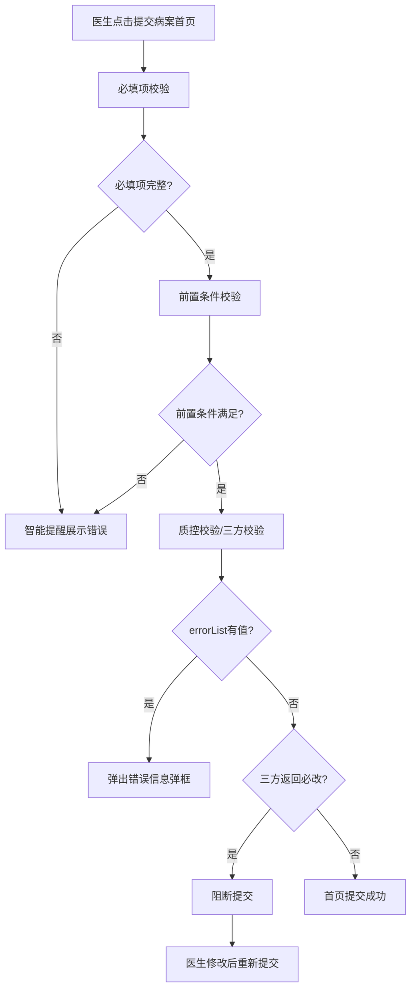
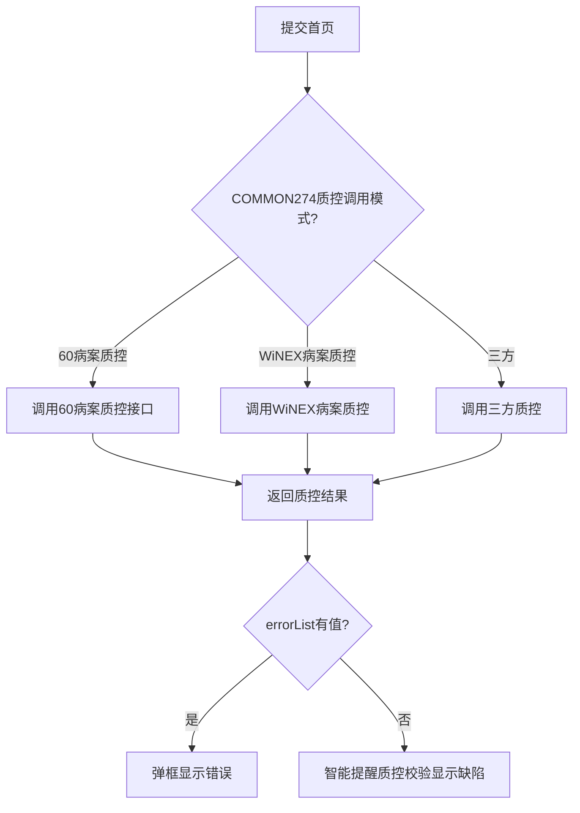

# BLGL-13-BASY-007首页提交与校验_ Analyst - Spec

> **需求编号**：BLGL-13-BASY-007
> **父需求**：BLGL-13-BASY
> **关联PM Spec**：BLGL-13-BASY-007_首页提交与校验_PM-spec.md
> **Spec版本**：V1.0
> **编写时间**：2026-08-13
> **编写人**：需求分析师

---

## 一、功能编号体系

### 1.1 功能层级结构

```
BLGL-13-BASY-007: 首页提交与校验
  ├─ BLGL-13-BASY-007-01: 必填项与级联规则校验
  ├─ BLGL-13-BASY-007-02: 诊断/手术规则校验
  ├─ BLGL-13-BASY-007-03: 出院情况逻辑校验
  ├─ BLGL-13-BASY-007-04: 未提交病历校验
  ├─ BLGL-13-BASY-007-05: 病案质控校验
  └─ BLGL-13-BASY-007-06: 三方质控拦截
```

### 1.2 功能编号表

| REQ-ID | 功能名称 | 类型 | 优先级 | 说明 |
|--------|---------|------|--------|------|
| BLGL-13-BASY-007-01 | 必填项与级联规则校验 | 功能 | P0 | 提交时校验必填项及级联规则 |
| BLGL-13-BASY-007-02 | 诊断/手术规则校验 | 功能 | P0 | 损伤中毒/病理诊断/切口规则校验 |
| BLGL-13-BASY-007-03 | 出院情况逻辑校验 | 功能 | P1 | 与出院医嘱一致校验 |
| BLGL-13-BASY-007-04 | 未提交病历校验 | 功能 | P1 | 提交前校验未提交病历 |
| BLGL-13-BASY-007-05 | 病案质控校验 | 功能 | P0 | 对接60病案/WiNEX病案质控 |
| BLGL-13-BASY-007-06 | 三方质控拦截 | 功能 | P1 | 三方"必改"阻断提交 |

---

## 二、核心业务流程

### 2.1 首页提交流程



### 2.2 质控校验流程



---

## 三、功能规格说明

### BLGL-13-BASY-007-01: 必填项与级联规则校验

#### 3.1.1 功能概述

提交首页时校验病历必填项及级联规则逻辑必填项，校验失败时在智能提醒-病历校验展示错误信息。

#### 3.1.2 用户角色

| 角色 | 使用场景 | 权限要求 | 操作频率 |
|------|---------|---------|---------|
| 住院医生 | 提交首页触发校验 | 病历书写权限 | 高频 |
| 质控人员 | 查看校验结果 | 质控查看权限 | 中频 |

#### 3.1.3 业务流程（Given/When/Then）

##### 主流程（1 个）

**Scenario 1: 必填项校验**

```gherkin
Given:
  - 首页已填写
  - 必填项规则已配置

When:
  - 医生点击提交病案首页

Then:
  - 校验必填项及级联规则
  - 校验通过则继续下一步校验
  - 校验失败则智能提醒展示错误信息
```

##### 异常流程（3 个）

**Scenario 2: 业务异常——必填项缺失**

```gherkin
Given:
  - 首页某必填项未填写

When:
  - 医生提交首页

Then:
  - 校验失败，智能提醒-病历校验展示具体缺失字段
  - 首页不能提交
```

**Scenario 3: 数据异常——级联规则不满足**

```gherkin
Given:
  - 级联规则逻辑必填项不满足

When:
  - 医生提交首页

Then:
  - 校验失败，提示级联规则错误信息
```

**Scenario 4: 系统异常——校验服务异常**

```gherkin
Given:
  - 校验服务异常

When:
  - 医生提交首页

Then:
  - 校验不执行，提示校验服务异常，首页不提交
```

##### 边界流程（2 个）

**Scenario 5: 边界——默认定位第一条校验数据**

```gherkin
Given:
  - 首页提交时病历校验有多条错误

When:
  - 医生提交首页

Then:
  - 病历校验后默认定位在第一条校验数据上（功能清单 HIST031）
```

**Scenario 6: 边界——提交时智能提醒**

```gherkin
Given:
  - 首页校验有错误

When:
  - 医生提交首页

Then:
  - 校验结果在智能提醒-病历校验提示（功能清单 HIST031）
```

#### 3.1.5 验收标准

| AC编号 | 验收标准 | 对应REQ-ID | 验证方法 | 验证场景 |
|--------|---------|-----------|---------|---------|
| AC-001 | 提交时校验必填项及级联规则，失败时智能提醒展示 | BLGL-13-BASY-007-01 | 功能测试 | Scenario 1 |
| AC-002 | 校验错误默认定位在第一条校验数据上 | BLGL-13-BASY-007-01 | 功能测试 | Scenario 5 |

---

### BLGL-13-BASY-007-02: 诊断/手术规则校验

#### 3.2.1 功能概述

病案首页提交时执行诊断/手术规则校验：①出院诊断主要诊断以'S'或'T'开头必须填写损伤、中毒的外部因素及编码；②主要诊断为C00-D48之间必须填写病理诊断及编码。切口等级需对照手术术语值。

#### 3.2.2 用户角色

| 角色 | 使用场景 | 权限要求 | 操作频率 |
|------|---------|---------|---------|
| 住院医生 | 提交首页触发规则校验 | 病历书写权限 | 高频 |

#### 3.2.3 业务流程（Given/When/Then）

##### 主流程（1 个）

**Scenario 1: 诊断规则校验**

```gherkin
Given:
  - 首页规则配置已启用
  - 主要诊断以'S'或'T'开头

When:
  - 医生提交病案首页

Then:
  - 校验必须填写损伤、中毒的外部因素及编码
  - 校验不通过则提示
```

##### 异常流程（3 个）

**Scenario 2: 业务异常——病理诊断必填校验**

```gherkin
Given:
  - 主要诊断为C00-D48之间

When:
  - 医生提交首页

Then:
  - 校验必须填写病理诊断及编码（功能清单 HIST031）
```

**Scenario 3: 数据异常——切口等级不一致**

```gherkin
Given:
  - 切口等级与手术术语值不一致

When:
  - 医生提交首页

Then:
  - 提醒并需医生填写书写原因
```

**Scenario 4: 系统异常——规则引擎异常**

```gherkin
Given:
  - 规则校验引擎异常

When:
  - 医生提交首页

Then:
  - 规则校验不执行，首页提交状态待确认
```

##### 边界流程（2 个）

**Scenario 5: 边界——规则参数未启用**

```gherkin
Given:
  - 参数"启用规则"未开启

When:
  - 医生提交首页

Then:
  - 不执行该规则校验
```

**Scenario 6: 边界——麻醉方式非空连带必填**

```gherkin
Given:
  - 首页规则配置"麻醉方式非空时的连带必填项设置"

When:
  - 手术/操作录入麻醉方式非空

Then:
  - 参数设置的字段需要必填
```

#### 3.2.5 验收标准

| AC编号 | 验收标准 | 对应REQ-ID | 验证方法 | 验证场景 |
|--------|---------|-----------|---------|---------|
| AC-001 | 主要诊断S/T开头校验损伤中毒外部因素 | BLGL-13-BASY-007-02 | 功能测试 | Scenario 1 |
| AC-002 | C00-D48主要诊断校验病理诊断必填 | BLGL-13-BASY-007-02 | 功能测试 | Scenario 2 |

---

### BLGL-13-BASY-007-03: 出院情况逻辑校验

#### 3.3.1 功能概述

提交病案首页时判断出院西医主要诊断出院情况是否与出院医嘱的出院方式一致，不一致不允许提交，并提示出院医嘱以及主诊断出院情况的具体内容。

#### 3.3.2 用户角色

| 角色 | 使用场景 | 权限要求 | 操作频率 |
|------|---------|---------|---------|
| 住院医生 | 提交首页触发出院情况校验 | 病历书写权限 | 中频 |

#### 3.3.3 业务流程（Given/When/Then）

##### 主流程（1 个）

**Scenario 1: 出院情况逻辑校验**

```gherkin
Given:
  - 首页出院西医主要诊断出院情况已填写

When:
  - 医生提交病案首页

Then:
  - 判断出院情况是否与出院医嘱出院方式一致
  - 一致则提交继续
  - 不一致则不允许提交，提示出院医嘱和主诊断出院情况具体内容
```

##### 异常流程（3 个）

**Scenario 2: 业务异常——出院情况不一致**

```gherkin
Given:
  - 首页出院情况与出院医嘱出院方式不一致

When:
  - 医生提交首页

Then:
  - 不允许提交，提示具体不一致内容
```

**Scenario 3: 数据异常——出院情况只读**

```gherkin
Given:
  - 病历中出院情况设置只读必填

When:
  - 病历编辑

Then:
  - 出院情况只读必填，控制来源从出院医嘱获取
```

**Scenario 4: 系统异常——出院医嘱接口异常**

```gherkin
Given:
  - 出院医嘱查询接口异常

When:
  - 医生提交首页

Then:
  - 出院情况校验不执行，提示接口异常
```

##### 边界流程（2 个）

**Scenario 5: 边界——缺省值读取**

```gherkin
Given:
  - 支持病历出院情况通过缺省值方式读取出院医嘱

When:
  - 病历编辑

Then:
  - 只读情况下支持更新数据
```

**Scenario 6: 边界——死亡患者出院情况**

```gherkin
Given:
  - 死亡患者首页

When:
  - 提交首页校验出院情况

Then:
  - ⏳ 待确认：死亡患者出院情况校验规则需确认
```

#### 3.3.5 验收标准

| AC编号 | 验收标准 | 对应REQ-ID | 验证方法 | 验证场景 |
|--------|---------|-----------|---------|---------|
| AC-001 | 出院情况与出院医嘱不一致时不允许提交并提示 | BLGL-13-BASY-007-03 | 功能测试 | Scenario 1 |
| AC-002 | 出院情况只读必填控制 | BLGL-13-BASY-007-03 | 功能测试 | Scenario 3 |

---

### BLGL-13-BASY-007-04: 未提交病历校验

#### 3.4.1 功能概述

当住院医生站提交病案首页的时候，需要去校验其余病历目录中是否存在还未提交的病历，如果存在未提交的病历，需要弹出提示，提醒医生提交，提交完成之后才能提交病案首页。

#### 3.4.2 用户角色

| 角色 | 使用场景 | 权限要求 | 操作频率 |
|------|---------|---------|---------|
| 住院医生 | 提交首页触发未提交病历校验 | 病历书写权限 | 高频 |

#### 3.4.3 业务流程（Given/When/Then）

##### 主流程（1 个）

**Scenario 1: 未提交病历校验**

```gherkin
Given:
  - 病历目录中存在未提交的病历

When:
  - 医生提交病案首页

Then:
  - 弹出提示提醒医生提交未提交的病历
  - 提交完成之后才能提交病案首页
```

##### 异常流程（3 个）

**Scenario 2: 业务异常——未提交病历存在**

```gherkin
Given:
  - 病历目录存在未提交病历

When:
  - 医生提交首页

Then:
  - 弹出提示，提交完成之后才能提交首页
```

**Scenario 3: 数据异常——首页创建/打印校验**

```gherkin
Given:
  - 单份病历创建/打印

When:
  - 医生创建/打印首页

Then:
  - 校验该规则，批量提交不校验该规则
```

**Scenario 4: 系统异常——目录查询接口异常**

```gherkin
Given:
  - 病历目录查询接口异常

When:
  - 医生提交首页

Then:
  - 未提交病历校验不执行，首页可提交
```

##### 边界流程（2 个）

**Scenario 5: 边界——批量提交**

```gherkin
Given:
  - 医生批量提交病历

When:
  - 批量提交首页

Then:
  - 批量提交不校验未提交病历规则
```

**Scenario 6: 边界——无未提交病历**

```gherkin
Given:
  - 病历目录所有病历已提交

When:
  - 医生提交首页

Then:
  - 校验通过，首页可提交
```

#### 3.4.5 验收标准

| AC编号 | 验收标准 | 对应REQ-ID | 验证方法 | 验证场景 |
|--------|---------|-----------|---------|---------|
| AC-001 | 存在未提交病历时弹出提示，提交后才行提交首页 | BLGL-13-BASY-007-04 | 功能测试 | Scenario 1 |
| AC-002 | 批量提交不校验未提交病历规则 | BLGL-13-BASY-007-04 | 功能测试 | Scenario 5 |

---

### BLGL-13-BASY-007-05: 病案质控校验

#### 3.5.1 功能概述

医生在住院医生站填写完病案首页后点击提交按钮，或上级医师阅改病案首页时，调用接口把病案首页数据提交给WiNEX病案系统完成质控，接口自动验证提交数据是否正确。参数"住院病历是否调用WiNEX病案首页质控"控制是否调用（默认否）。COMMON274控制质控调用模式（60病案质控/60病案传输数据/三方）。

#### 3.5.2 用户角色

| 角色 | 使用场景 | 权限要求 | 操作频率 |
|------|---------|---------|---------|
| 住院医生 | 提交首页触发质控 | 病历书写权限 | 高频 |
| 质控人员 | 查看质控缺陷 | 质控查看权限 | 中频 |

#### 3.5.3 业务流程（Given/When/Then）

##### 主流程（1 个）

**Scenario 1: 病案质控校验**

```gherkin
Given:
  - 参数"住院病历是否调用WiNEX病案首页质控"=是

When:
  - 医生提交病案首页

Then:
  - 调用接口把首页数据提交给WiNEX病案系统
  - 接口自动验证提交数据是否正确
  - 校验不通过则返回错误原因，提示提交失败
```

##### 异常流程（3 个）

**Scenario 2: 业务异常——质控模式60病案传输**

```gherkin
Given:
  - COMMON274=60病案传输数据

When:
  - 首页提交后

Then:
  - 不用打开右侧质控数据展示的弹框
```

**Scenario 3: 数据异常——errorList空qcResult有值**

```gherkin
Given:
  - errorList无值，qcResult有值
  - 参数COMMON274=60病案质控

When:
  - 医生提交首页

Then:
  - 智能提醒质控校验显示对应的质控缺陷
```

**Scenario 4: 系统异常——质控接口超时**

```gherkin
Given:
  - WiNEX病案质控接口超时

When:
  - 医生提交首页

Then:
  - 质控校验不执行，提示质控服务异常
```

##### 边界流程（2 个）

**Scenario 5: 边界——质控结果展示**

```gherkin
Given:
  - 首页质控校验完成

When:
  - 智能提醒展示质控缺陷

Then:
  - 辅助助手/智能提醒集成病案系统质控结果组件
```

**Scenario 6: 边界——事中校验独立**

```gherkin
Given:
  - 病案首页事中校验与环节质控规则独立

When:
  - 首页质控校验

Then:
  - 病案首页评分标准可维护多个，只能启用一个
```

#### 3.5.5 验收标准

| AC编号 | 验收标准 | 对应REQ-ID | 验证方法 | 验证场景 |
|--------|---------|-----------|---------|---------|
| AC-001 | 参数=是时提交首页调用WiNEX病案质控 | BLGL-13-BASY-007-05 | 集成测试 | Scenario 1 |
| AC-002 | qcResult有值时智能提醒显示质控缺陷 | BLGL-13-BASY-007-05 | 功能测试 | Scenario 3 |

---

### BLGL-13-BASY-007-06: 三方质控拦截

#### 3.6.1 功能概述

住院医生站提交病案首页时调用医生端病案首页提交质控对接接口，三方出参分"提示"、"必改"。"必改"限制医生不允许提交，需修改完再继续提交；"提示"允许继续提交。提示/必改均需展示给医生查看。

#### 3.6.2 用户角色

| 角色 | 使用场景 | 权限要求 | 操作频率 |
|------|---------|---------|---------|
| 住院医生 | 提交首页触发三方质控 | 病历书写权限 | 高频 |

#### 3.6.3 业务流程（Given/When/Then）

##### 主流程（1 个）

**Scenario 1: 三方质控拦截**

```gherkin
Given:
  - 参数"住院病历是否启用病案首页"=是
  - 参数"提交病案首页时给三方系统推送数据的对接方式"不为空

When:
  - 医生提交病案首页

Then:
  - 调用三方质控对接接口
  - "必改"限制医生不允许提交，需修改后再提交
  - "提示"允许医生继续提交首页
  - 提示/必改内容展示给医生
```

##### 异常流程（3 个）

**Scenario 2: 业务异常——必改拦截**

```gherkin
Given:
  - 三方返回"必改"错误

When:
  - 医生提交首页

Then:
  - 不允许提交，修改完成后再提交
```

**Scenario 3: 数据异常——接口调用失败**

```gherkin
Given:
  - 三方质控接口调用不成功

When:
  - 医生提交首页

Then:
  - 阻断提交（返参statusCode并显示statusMsg失败说明）（功能清单 SUB002）
```

**Scenario 4: 系统异常——三方接口超时**

```gherkin
Given:
  - 三方质控接口超时

When:
  - 医生提交首页

Then:
  - 接口调用不成功，阻断提交，提示三方服务异常
```

##### 边界流程（2 个）

**Scenario 5: 边界——按分值阻断**

```gherkin
Given:
  - 参数"阻断提交方式"=按分值阻断
  - 允许提交的分值=90

When:
  - 医生提交首页

Then:
  - 三方校验分数>=90分时首页允许提交（功能清单 SUB002）
```

**Scenario 6: 边界——按错误明细阻断**

```gherkin
Given:
  - 参数"阻断提交方式"=按错误明细阻断

When:
  - 医生提交首页

Then:
  - 返回ruleDetail存在数据则阻断提交（功能清单 SUB002）
```

#### 3.6.5 验收标准

| AC编号 | 验收标准 | 对应REQ-ID | 验证方法 | 验证场景 |
|--------|---------|-----------|---------|---------|
| AC-001 | 三方返回"必改"时阻断提交 | BLGL-13-BASY-007-06 | 集成测试 | Scenario 2 |
| AC-002 | 三方返回"提示"时允许继续提交 | BLGL-13-BASY-007-06 | 集成测试 | Scenario 1 |

---

## 四、排除范围

本需求不包含以下功能项：

1. **首页创建与目录管理** - 归属 BLGL-13-BASY-001
3. **病案系统对接与数据上报** - 归属 BLGL-13-BASY-008
4. **首页撤销提交与修改** - 归属 BLGL-13-BASY-009

---

## 五、业务规则清单

| 规则ID | 规则名称 | 规则描述 | 来源 | 优先级 |
|--------|---------|---------|------|--------|
| BR-001 | 提交校验顺序 | 必填项→前置条件→质控/三方校验 | | P0 |
| BR-002 | 必填项校验 | 提交时校验病历必填项及级联规则 | 功能清单 HIST003 | P0 |
| BR-003 | 诊断规则校验 | S/T开头填损伤中毒外部因素，C00-D48填病理诊断 | 功能清单 HIST031 | P0 |
| BR-004 | errorList弹框 | errorList有值弹框，无值返回校验内容 | | P0 |
| BR-005 | 未提交病历校验 | 提交首页前校验未提交病历 | | P1 |
| BR-006 | 三方质控拦截 | 必改阻断，提示允许 | | P1 |
| BR-007 | 出院情况校验 | 出院情况与出院医嘱一致，不一致不允许提交 | | P1 |
| BR-008 | 质控模式 | COMMON274控制60病案质控/传输/三方 | | P1 |

---

## 六、关联文档

| 文档类型 | 文档路径 | 说明 |
|---------|---------|------|
| PM-Spec（业务视角） | 本目录 BLGL-13-BASY-007_首页提交与校验_PM-spec.md（V0.1） | PM 产出的 Spec 文档 |
| Spec（研发视角） | 本目录 BLGL-13-BASY-007_首页提交与校验-Spec.md（V1.0） | 业务背景与目标 Spec |
| 功能点Spec（模块级） | BLGL-13-BASY 13病案首页功能点Spec.md（V1.0，上级目录） | Phase 1 功能点索引 |
| data-model.md | 待产出 | 架构师产出的数据建模文档 |
| design.md | 待产出 | 架构师产出的技术方案文档 |
| api-contract.md | 待产出 | 开发经理产出的 API 契约文档 |

---

## 七、待确认问题清单

| 编号 | 问题描述 | 缺失信息 | 影响范围 | 建议补充方 |
|------|---------|---------|---------|-----------|
| Q-001 | 死亡患者出院情况校验规则 | 校验规则 | 出院情况校验 | 产品经理 |
| Q-002 | 质控接口返回结构具体字段 | 接口契约 | 接口详细设计 | 开发经理 |
| Q-003 | 首页提交校验性能指标 | 性能指标 | 非功能性要求 | 产品经理 |
| Q-004 | 规则配置完整清单 | 规则配置 | 诊断/手术规则校验 | 模块负责人 |

---

## 填写检查清单

| 序号 | 检查项 | 是否完成 |
|:----:|--------|:--------:|
| 1 | 功能编号带父子层级 | ✅ |
| 2 | 每个 REQ-ID 有功能概述和用户角色 | ✅ |
| 3 | 主流程至少 1 个 Given/When/Then 场景 | ✅ |
| 4 | 异常流程至少 3 个 Given/When/Then 场景 | ✅ |
| 5 | 边界流程至少 2 个 Given/When/Then 场景 | ✅ |
| 6 | 每个 Given/When/Then 内容具体，不模糊 | ✅ |
| 7 | 数据字段定义完整（字段名、类型、必填、说明、概念ID） | ✅ |
| 8 | 验收标准 AC 编号独立，可验证 | ✅ |
| 9 | 验收标准无"功能正常"等模糊表述 | ✅ |
| 10 | 排除范围明确列出 | ✅ |
| 11 | 业务规则清单列出所有规则，每条标注来源 | ✅ |
| 12 | 流程图使用 Mermaid 格式（≥2 个） | ✅ |
| 13 | 关联文档索引包含 Phase 1 功能点Spec | ✅ |
| 14 | 待确认问题清单汇总了全文所有 ⏳ 项 | ✅ |
| 15 | 全文无占位符 `< >` 残留 | ✅ |
| 16 | 全文陈述可溯源至资料区（S1~S10 溯源核查） | ✅ |
| 17 | 人工审核确认完成 | ⏳ 待确认 |

---

**文档状态**：⬜ 待审核
**维护责任**：需求分析师规范组
**下次更新**：根据评审反馈优化

---

## 版本历史

| 版本 | 日期 | 变更说明 | 编写人 |
|------|------|---------|--------|
| V1.0 | 2026-08-13 | 初始版本 | 需求分析师 |
