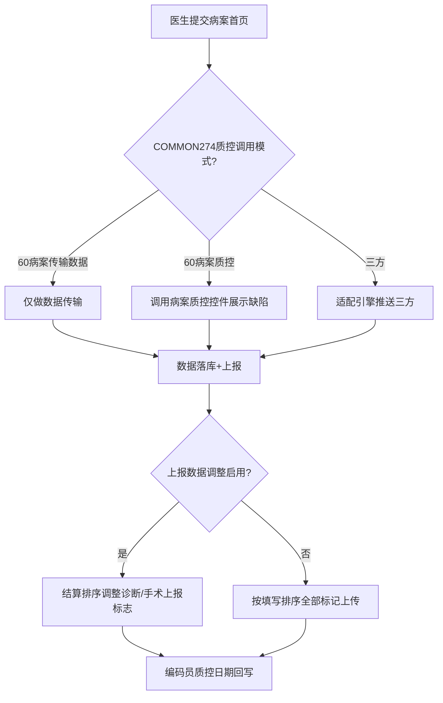
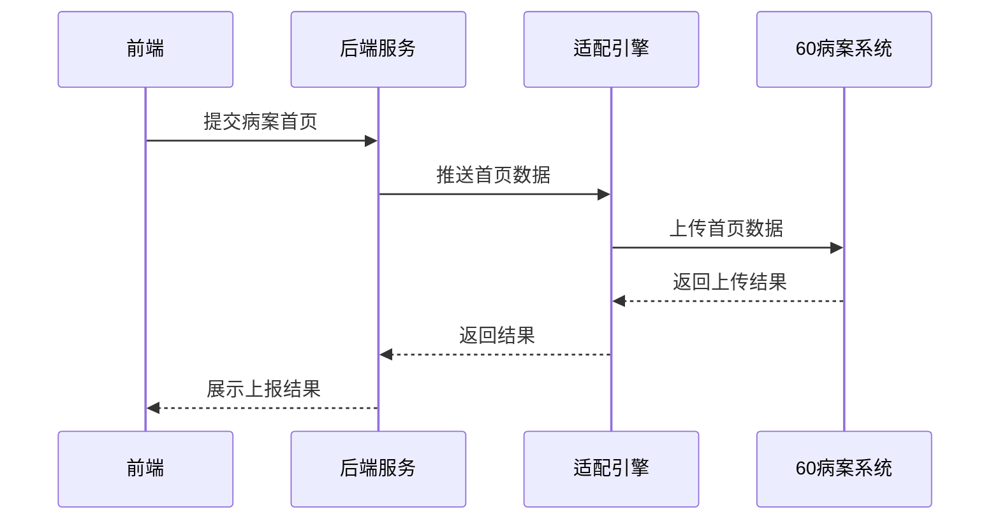

# BLGL-13-BASY-008 病案系统对接与数据上报 - Spec

> **功能编号**：BLGL-13-BASY-008
> **文档类型**：Spec（研发视角）
> **文档版本**：V1.0
> **编写时间**：2026-08-13
> **编写人**：RACC

---

## 文档索引

本节提供本文档的章节结构索引与关联文档索引，便于读者快速定位与检索。

#### 章节索引

**Spec（研发视角）**

| 章节号 | 章节名称 | 内容说明 |
|--------|---------|---------|
| 1、 | 文档概述 | 文档目的、文档范围、术语定义、阅读指南、参考文档 |
| 2、 | 功能背景与定位 | 功能背景、功能定位、目标用户、核心价值 |
| 3、 | 业务流程设计 | 主流程/异常流程/边界流程（Given/When/Then） |
| 4、 | 数据模型设计 | 核心数据结构、状态定义、系统参数定义 |
| 5、 | 接口契约设计 | API列表、接口详细设计、错误码定义 |
| 6、 | 技术方案设计 | 页面路径、技术栈、关键技术点、部署方案 |
| 7、 | 测试用例预设计 | 功能/边界/异常/性能测试用例 |
| 8、 | 非功能性要求 | 性能、安全、可用性、兼容性 |
| 9、 | 依赖与风险 | 外部依赖、风险项 |
| 10、 | 附录 | 流程图、时序图、参考文档 |

**PM-Spec（业务视角）**

| 章节号 | 章节名称 | 内容说明 |
|--------|---------|---------|
| 一 | 目标 | 功能定位与核心价值 |
| 二 | 约束 | 业务/技术/非功能性约束 |
| 三 | 验收标准 | 验收条件与验证方法 |
| 四 | 排除范围 | 本次不做项与明确边界 |
| 五 | 关键决策记录 | 方案决策与选型理由 |
| 六 | 优先级 | 优先级定义 |
| 七 | 关联文档 | 关联文档索引 |
| 附录 | 填写检查清单 | 质量检查 |

**Analyst-Spec（产品视角）**

| 章节号 | 章节名称 | 内容说明 |
|--------|---------|---------|
| 一 | 功能编号体系 | 带父子层级的编号树 |
| 二 | 核心业务流程 | Mermaid 流程图 |
| 三 | 功能规格说明 | 各子功能点的概述、用户角色、业务流程、验收标准 |
| 四 | 排除范围 | 本需求不包含的功能项 |
| 五 | 业务规则清单 | 规则ID、规则名称、规则描述、优先级 |
| 六 | 关联文档 | 文档类型、文档路径、说明 |
| 七 | 待确认问题清单 | 所有 ⏳ 待确认项的汇总 |
| - | 填写检查清单 | 检查项与完成状态 |

#### 版本历史

| 版本 | 日期 | 变更说明 | 编写人 |
|------|------|---------|--------|
| V1.0 | 2026-08-13 | 初始版本 | RACC |

#### 关联文档索引

| 序号 | 文档名称 | 文档类型 | 版本 | 位置 |
|------|---------|---------|------|------|
| 1 | BLGL-13-BASY-008_病案系统对接与数据上报_PM-spec.md | PM-Spec（业务视角） | V0.1 | 本目录 |
| 2 | BLGL-13-BASY-008_病案系统对接与数据上报_Analyst-spec.md | Analyst-Spec（产品视角） | V1.0 | 本目录 |
| 3 | BLGL-13-BASY-008_病案系统对接与数据上报-Spec.md | Spec（研发视角） | V1.0 | 本目录 |
| 4 | BLGL-13-BASY 13病案首页功能点Spec.md | 功能点Spec（模块级） | V1.0 | 上级目录 |

---

## 1、文档概述

### 1.1、文档目的

本文档旨在明确"病案系统对接与数据上报"功能（BLGL-13-BASY-008）的业务背景与设计方案，为需求分析、研发实现、测试验收及评审提供统一的业务上下文、设计口径与决策依据。

**具体目的包括**：

1. 梳理病案系统对接与数据上报功能的业务由来与历史需求演进脉络，说明"为什么要做"；
2. 明确功能的定位边界、目标用户与核心价值，回答"做成什么"；
3. 描述功能的业务流程、数据模型、接口契约与技术方案，回答"怎么做"；
4. 预设计测试用例并明确非功能性要求、依赖与风险，为研发与验收提供依据；
5. 作为 SPEC（功能编号体系、功能详情、业务规则、验收标准等章节）的业务前提与设计输入，保证各层文档业务口径一致。

### 1.2、文档范围

#### 1.2.1 纳入范围

本文档覆盖病案系统对接与数据上报的完整业务背景与设计，包括：

- 病案首页数据上传至60病案系统（数据传输/质控）
- 对接WiNEX病案系统完成质控与编码回写
- 对接三方系统数据推送（适配引擎）
- 字典对照优化（病案系统字典）
- 上报标志与序号管理（诊断/手术医保结算数据调整）
- 补传功能（不撤销提交重新传数据）

#### 1.2.2 排除范围

本文档不涉及以下内容（详见其他功能点或模块）：

- 首页提交与校验（质控校验）——见 BLGL-13-BASY-007
- 首页撤销提交与修改——见 BLGL-13-BASY-009
- 首页参数与映射配置——见 BLGL-13-BASY-010

### 1.3、术语定义

| 术语 | 定义 |
|------|------|
| 60病案系统 | 病案管理系统，接收首页数据 |
| WiNEX病案系统 | 病案质控系统，首页质控校验 |
| 适配引擎 | 三方数据对接的适配引擎接口 |
| 病案首页质控调用模式 | 参数COMMON274，控制60病案质控/60病案传输数据/三方 |
| 上报标志 | 诊断/手术是否上报的标志 |
| 医保结算数据调整 | 诊断/手术医保结算上报状态与排序调整 |

### 1.4、阅读指南

- **章节关系**：第1~2章为阅读铺垫与业务全貌（背景、定位、用户、价值）；第3~10章为设计实现层（流程、数据、接口、技术、测试、非功能、依赖风险、附录），可直接用于研发与测试。与 Analyst-Spec、PM-Spec 的详细规则/验收口径互相引用，保持一致。
- **读者对象**：
  - 产品经理/需求分析师：阅读第1~2章了解业务全貌，据此维护 PM-Spec 与功能清单；
  - 研发：阅读第3~6章用于开发实现，第9~10章用于依赖评估与联调；
  - 测试：阅读第3章、第7~8章用于用例设计与验收；
  - 评审人员：以本文档为业务口径与设计基准，核对各层文档一致性。

### 1.5、参考文档

| 序号 | 文档名称 | 版本/日期 |
|------|---------|----------|
| 1 | 【历史需求】病案首页需求-0727.xlsx | - |
| 2 | BLGL-13-BASY-008_病案系统对接与数据上报_PM-spec.md | V0.1 |
| 3 | BLGL-13-BASY-008_病案系统对接与数据上报_Analyst-spec.md | V1.0 |
| 4 | BLGL-13-BASY 13病案首页功能点Spec.md | V1.0 |
| 5 | WiNEX-病案首页_功能清单_20260325_162900.md | 2026-03-25 |

---

## 2、功能背景与定位

### 2.1 功能背景

病案系统对接与数据上报是病案首页的对外输出，需满足：

- **法规/规范依据**：首页数据需上报病案系统满足病案管理要求
- **管理要求**：首页数据按配置推送60病案/WiNEX病案/三方系统
- **现状痛点**：字典对照实施难度大，需优化
- **历史需求演进**：从"病案首页数据上传"（功能清单 HIST025）→"对接病案质控"→"对接60病案系统字典对照"→"提交对接三方质控"→"不撤销重新传数据"

### 2.2 功能定位

"病案系统对接与数据上报"是WiNEX病历管理-病案首页模块的对外输出层，定位为：

- **数据上报定位**：首页数据推送病案系统
- **质控对接定位**：对接病案质控系统
- **字典对照定位**：病案系统字典对照优化

### 2.3 目标用户

| 用户角色 | 主要使用场景 |
|---------|-------------|
| 住院医生 | 提交首页触发数据上报 |
| 病案室人员 | 病案系统接收首页数据/编码回写 |

### 2.4 核心价值

| 价值维度 | 价值描述 |
|---------|---------|
| 数据上报 | 首页数据推送病案系统 |
| 质控联动 | 对接病案质控保障首页质量 |
| 灵活性 | 参数控制对接模式（60病案/三方） |

---

## 3、业务流程设计（Given/When/Then）

### 3.1 主流程

**Scenario 1: 首页数据上传60病案系统**

```gherkin
Given:
  - 参数 COMMON274 病案首页质控调用模式已配置

When:
  - 医生提交病案首页

Then:
  - 调用60病案系统接口上传首页数据
  - 60病案传输数据：仅做数据传输，不做质控校验
  - 60病案质控：提交时调用病案系统的质控控件展示首页缺陷
```

### 3.2 异常流程

**Scenario 2: 业务异常——补传不撤销**

```gherkin
Given:
  - 首页已提交但数据与病案系统不一致

When:
  - 病案室执行补传功能

Then:
  - 在不撤销提交状态下重新传输完整首页数据到60病案系统
  - 减少重复工作量
```

**Scenario 3: 数据异常——字典对照缺失**

```gherkin
Given:
  - 首页数据元与病案系统字典未对照

When:
  - 首页数据上传

Then:
  - 字典对照失败提示，需完善对照
```

**Scenario 4: 系统异常——上报接口超时**

```gherkin
Given:
  - 病案系统上报接口超时

When:
  - 医生提交首页

Then:
  - 上报失败提示，首页提交状态待确认
  - 记录系统异常日志
```

### 3.3 边界流程

**Scenario 5: 边界场景——诊断/手术上报标志调整**

```gherkin
Given:
  - 参数"病案首页是否启用诊断/手术医保结算数据调整"=是

When:
  - 医生提交首页前调整上报数据

Then:
  - 首页书写界面新增"结算排序"按钮
  - 弹出医保数据上传调整界面（出院西医诊断+手术名称两个tab）
  - 支持诊断/手术上移下移，记录上报状态及上报顺序
```

**Scenario 6: 边界场景——编码员质控日期回写**

```gherkin
Given:
  - 参数"是否启用编码员与质控日期回写"=是

When:
  - 质控员编码后

Then:
  - 将编码员与质控日期回写至病案首页（功能清单 HIS003）
```

---

## 4、数据模型设计

### 4.1 核心数据结构

#### 4.1.1 核心保存请求

| 字段名 | 类型 | 必填 | 备注 |
|--------|------|------|------|
| encounterId | Long | 是 | 患者就诊标识 |
| 上报标志 | Boolean | 否 | 诊断/手术是否上报 |
| 上报序号 | Integer | 否 | 上报顺序 |

#### 4.1.2 核心表/实体

| 表/实体 | 关键字段 | 说明 |
|---------|---------|------|
| INP_EMR_MAHP_DIAG | 上报标志/上报序号字段 | 首页诊断表 |
| INP_EMR_MAHP_SURGERY | 上报标志/上报序号字段 | 首页手术表 |
| EMR_MAHP_FIELD_MAPPING | fieldMappingId | 首页字段映射表 |
| EMR_MAHP_THIRDPARTY_INTERFACE | thirdpartyInterfaceId | 三方接口配置表 |
| EMR_QC_MAHP | emrQcMahpId | 质控首页表 |

### 4.2 状态定义

| 状态码 | 状态名称 | 说明 |
|--------|---------|------|
| 编码状态0 | 未编码 | 对接三方编码状态 |
| 编码状态1 | 已录入 | 对接三方编码状态 |
| 编码状态2 | 已编码 | 对接三方编码状态 |
| 编码状态3 | 编码中 | 对接三方编码状态 |

### 4.3 系统参数定义

| 参数编码 | 参数名称 | 说明 |
|---------|---------|------|
| COMMON274 | 病案首页质控调用模式 | 60病案质控/60病案传输数据/三方 |
| 病案首页是否启用诊断/手术医保结算数据调整 | 默认否 | 上报标志调整控制 |
| 是否启用编码员与质控日期回写 | 默认否 | 编码回写控制 |
| COMMON266 | 是否调用病案系统撤销提交接口 | 撤销对接控制 |

---

## 5、接口契约设计

### 5.1 API列表

| 序号 | API名称（代码函数） | 路径 | 方法 | 说明 |
|:----:|---------|------|:----:|------|
| 1 | queryInpEmrMahpReportDiagnosis | /api/v1/emr/medical_archive/report_diagnosis/query | POST | 查询上报弹框诊断数据 |
| 2 | updateInpatientEmrMahpDiagReportFlag | /api/v1/emr/medical_archive/diag_report_flag/update | POST | 修改诊断上报标志 |
| 3 | updateInpatientEmrMahpSurgeryReportFlag | /api/v1/emr/medical_archive/surgery_report_flag/update | POST | 修改手术上报标志 |
| 4 | getInpEmrMahpThirdPartyMapping | /api/v1/emr_mahp_third_party_interface/get | POST | 获取首页数据上传配置 |
| 5 | queryMahpThirdPartyStatusByEncounterId | /api/v1/mahp/third/party/status/query/by_encounter_id | POST | 查询三方病案状态 |
| 6 | queryInpEmrMahpReportData | /api/v1/emr/medical_archive/report_data/query | POST | 查询首页上报数据 |
| 7 | getMahpCodingByEncounterId | /api/v1/emr/coding_no/by_encounterId | POST | 获取病案上架号 |

### 5.2 接口详细设计

#### 5.2.1 修改诊断上报标志

**请求参数**:
```json
{
  "encounterId": 123456,
  "diagIdList": [1, 2, 3],
  "reportFlag": true,
  "reportSeq": 1
}
```

**返回值（成功）**:
```json
{
  "success": true,
  "data": null
}
```

**返回值（失败）**:
```json
{
  "success": false,
  "message": "上报标志修改失败",
  "data": null
}
```

> 📌 接口路径与函数名来自代码 InpatientMedicalArchiveController；入参/出参字段结构待与接口文档核对，部分为 `⏳ 待确认`。

### 5.3 错误码定义

| 错误码 | 错误信息 | 处理方式 |
|--------|---------|---------|
| statusCode | 三方接口调用失败 | 阻断提交并显示statusMsg失败说明 |
| ruleDetail | 三方返回错误明细 | 展示在质控校验列表 |

---

## 6、技术方案设计

### 6.1 页面路径

- **页面路径**: winning-webui-inpatient-clinicalnote-pango/src/pages/EmrMedicalRecord（病历书写容器）
- **路由**: 病历目录-病案首页
- **核心逻辑模块**: InpEmrMedicalArchiveQcService、InpatientMedicalArchiveController、InpatientEmrMedicalArchiveEsbInfoService

### 6.2 技术栈

| 类别 | 技术 | 版本 |
|------|------|------|
| 前端框架 | Vue（winning-webui-inpatient-clinicalnote-pango） | ⏳ 待确认 |
| 后端框架 | Java Spring Boot + Akso MVC | ⏳ 待确认 |
| 对接方式 | 适配引擎接口/ESB | ⏳ 待确认 |

### 6.3 关键技术点

- 首页提交后通过适配引擎接口推送三方系统
- 三方数据保存至表数据慢时ESB推送时间后移
- 诊断/手术名称与前后缀拼接后传输（北人民专版，）

### 6.4 部署方案

⏳ 待确认：部署方案未在资料区中找到

---

## 7、测试用例预设计

### 7.1 功能测试

| 用例编号 | 测试场景 | Given | When | Then |
|---------|---------|-------|------|------|
| TC-001 | 首页数据上传60病案 | 质控调用模式已配置 | 提交首页 | 数据上传病案系统 |
| TC-002 | 上报标志修改 | 诊断/手术医保结算数据调整启用 | 调整上报数据 | 上报标志/序号更新 |
| TC-003 | 编码员质控日期回写 | 回写参数=是 | 质控员编码后 | 编码员/质控日期回写 |

### 7.2 边界测试

| 用例编号 | 测试场景 | Given | When | Then |
|---------|---------|-------|------|------|
| TC-004 | 补传不撤销 | 首页已提交数据不一致 | 执行补传 | 不撤销重新传输数据 |
| TC-005 | 上报诊断全选/取消全选 | 医保数据上传调整界面 | 全选/取消全选 | 上报标志更新 |

### 7.3 异常测试

| 用例编号 | 测试场景 | Given | When | Then |
|---------|---------|-------|------|------|
| TC-006 | 上报接口超时 | 接口超时 | 提交首页 | 上报失败提示 |
| TC-007 | 字典对照缺失 | 字典未对照 | 数据上传 | 对照失败提示 |

### 7.4 性能测试

| 用例编号 | 测试场景 | 指标 |
|---------|---------|------|
| TC-008 | 数据上报响应时间 | ⏳ 待确认 |

---

## 8、非功能性要求

### 8.1 性能要求

| 指标 | 要求 |
|------|------|
| 数据上报响应时间 | ⏳ 待确认 |

### 8.2 安全要求

| 要求 | 说明 |
|------|------|
| 数据上报准确 | 首页数据上传需准确完整 |

**医疗行业特殊要求**

| 要求 | 说明 |
|------|------|
| 上报合规 | 首页数据上报满足医保/病案管理要求 |

### 8.3 可用性要求

| 指标 | 要求值 |
|------|--------|
| ⏳ 待确认 | - |

### 8.4 兼容性要求

| 类型 | 要求 |
|------|------|
| 60病案系统兼容 | 对接60病案系统 |
| WiNEX病案系统兼容 | 对接WiNEX病案质控 |
| 三方系统兼容 | 适配引擎对接三方 |

---

## 9、依赖与风险

### 9.1 外部依赖

| 依赖项 | 说明 |
|--------|------|
| 60病案系统 | 首页数据接收 |
| WiNEX病案系统 | 病案质控 |
| 三方系统 | 数据推送 |
| 适配引擎/ESB | 数据推送通道 |

### 9.2 风险项

| 风险项 | 等级 | 说明 | 应对方案 |
|--------|------|------|---------|
| 对接模式复杂 | 中 | 多套病案系统对接（60/WiNEX/三方） | 参数COMMON274控制模式 |
| 数据不一致 | 中 | 首页数据与病案系统不一致 | 补传功能不撤销重传 |
| 字典对照 | 中 | 字典对照实施难度大 | 电子病历提供字典查询接口优化对照 |

---

## 10、附录

### 10.1 流程图



### 10.2 时序图



### 10.3 参考文档

- WiNEX-病案首页_功能清单_20260325_162900.md（第2.7节对接60病案系统/第2.8节对接三方）
- 【历史需求】病案首页需求-0727.xlsx（、792880、887852、1478350、1106114、1401733 等）
- BLGL-13-BASY 13病案首页功能点Spec.md（V1.0）
- 关联Spec: BLGL-13-BASY-007 首页提交与校验 -Spec.md

---

## 填写检查清单

| 序号 | 检查项 | 是否完成 |
|:----:|--------|:--------:|
| 1 | 章节索引与正文章节一致 | ✅ |
| 2 | 版本历史记录完整 | ✅ |
| 3 | 关联文档索引已登记全部Spec | ✅ |
| 4 | 文档目的明确回答"为什么做/做成什么/怎么做" | ✅ |
| 5 | 纳入范围/排除范围清晰 | ✅ |
| 6 | 术语定义覆盖关键概念，从资料区可溯源 | ✅ |
| 7 | 参考文档已登记 | ✅ |
| 8 | 功能背景基于法规/规范/需求来源组织 | ✅ |
| 9 | 功能定位体现业务价值（3~5个定位点） | ✅ |
| 10 | 目标用户角色覆盖完整，在需求原文中有出处 | ✅ |
| 11 | 核心价值可陈述，与 Phase 1 口径一致 | ✅ |
| 12 | 业务流程：主流程≥1、异常≥3、边界≥2，Given/When/Then 具体 | ✅ |
| 13 | 数据模型：字段/表/状态/参数可溯源（概念ID/表名/参数编码） | ✅ |
| 14 | 接口契约：API列表+详细设计+错误码齐全或标记待确认 | ✅ |
| 15 | 技术方案：页面路径/技术栈/关键点/部署方案或标记待确认 | ✅ |
| 16 | 测试用例：功能/边界/异常/性能覆盖，与第3章场景对应 | ✅ |
| 17 | 非功能性要求：性能/安全/可用性/兼容性指标可量化或标记待确认 | ✅ |
| 18 | 依赖与风险：外部依赖登记完整，风险有具体应对方案或标记待确认 | ✅ |
| 19 | 附录：流程图/时序图与正文流程一致 | ✅ |
| 20 | 全文无占位符 `< >` 残留 | ✅ |
| 21 | 全文陈述可溯源至资料区，无来源的已标记 ⏳ | ✅ |
| 22 | 人工审核确认完成 | ⏳ 待确认 |

---

**文档状态**：⬜ 待审核
**维护责任**：RACC
**下次更新**：根据评审反馈优化
