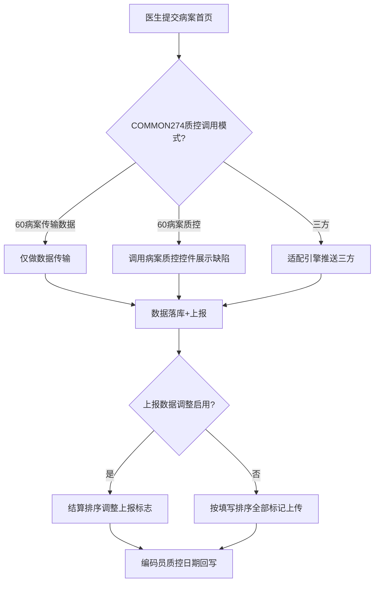
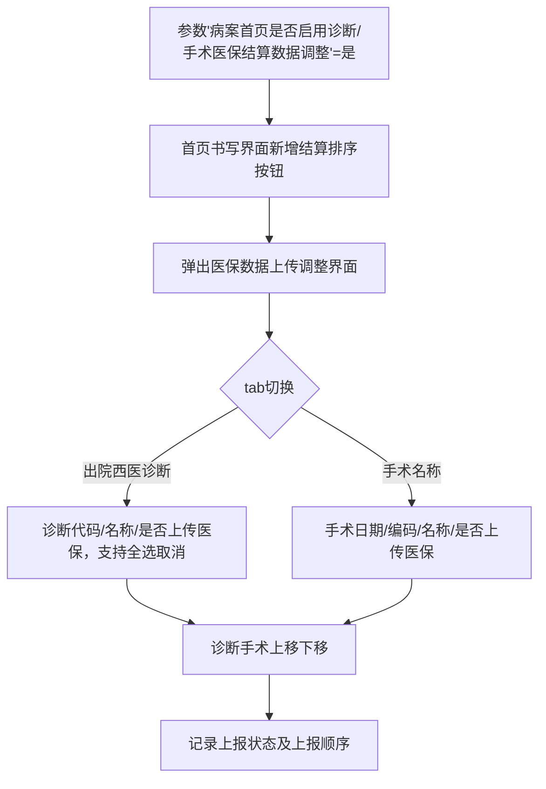

# BLGL-13-BASY-008病案系统对接与数据上报_ Analyst - Spec

> **需求编号**：BLGL-13-BASY-008
> **父需求**：BLGL-13-BASY
> **关联PM Spec**：BLGL-13-BASY-008_病案系统对接与数据上报_PM-spec.md
> **Spec版本**：V1.0
> **编写时间**：2026-08-13
> **编写人**：需求分析师

---

## 一、功能编号体系

### 1.1 功能层级结构

```
BLGL-13-BASY-008: 病案系统对接与数据上报
  ├─ BLGL-13-BASY-008-01: 首页数据上传60病案系统
  ├─ BLGL-13-BASY-008-02: 对接WiNEX病案系统质控
  ├─ BLGL-13-BASY-008-03: 对接三方系统数据推送
  ├─ BLGL-13-BASY-008-04: 病案系统字典对照
  ├─ BLGL-13-BASY-008-05: 上报标志与序号管理
  ├─ BLGL-13-BASY-008-06: 补传功能
  └─ BLGL-13-BASY-008-07: 编码员与质控日期回写
```

### 1.2 功能编号表

| REQ-ID | 功能名称 | 类型 | 优先级 | 说明 |
|--------|---------|------|--------|------|
| BLGL-13-BASY-008-01 | 首页数据上传60病案系统 | 功能 | P0 | 数据传输/质控两种模式 |
| BLGL-13-BASY-008-02 | 对接WiNEX病案系统质控 | 功能 | P1 | 首页质控回传 |
| BLGL-13-BASY-008-03 | 对接三方系统数据推送 | 功能 | P1 | 适配引擎推送三方 |
| BLGL-13-BASY-008-04 | 病案系统字典对照 | 功能 | P1 | 字典对照优化 |
| BLGL-13-BASY-008-05 | 上报标志与序号管理 | 功能 | P1 | 诊断/手术医保结算数据调整 |
| BLGL-13-BASY-008-06 | 补传功能 | 功能 | P1 | 不撤销重传数据 |
| BLGL-13-BASY-008-07 | 编码员与质控日期回写 | 功能 | P1 | 质控员编码后回写 |

---

## 二、核心业务流程

### 2.1 首页数据上报流程



### 2.2 上报标志调整流程



---

## 三、功能规格说明

### BLGL-13-BASY-008-01: 首页数据上传60病案系统

#### 3.1.1 功能概述

参数 COMMON274 病案首页质控调用模式控制首页数据上传方式：60病案传输数据仅做数据传输不做质控校验；60病案质控时提交病案首页调用病案系统的质控控件展示首页的缺陷。

#### 3.1.2 用户角色

| 角色 | 使用场景 | 权限要求 | 操作频率 |
|------|---------|---------|---------|
| 住院医生 | 提交首页触发上传 | 病历书写权限 | 高频 |
| 病案室人员 | 接收首页数据 | 病案查询权限 | 高频 |

#### 3.1.3 业务流程（Given/When/Then）

##### 主流程（1 个）

**Scenario 1: 首页数据上传**

```gherkin
Given:
  - 参数 COMMON274 病案首页质控调用模式已配置

When:
  - 医生提交病案首页

Then:
  - 60病案传输数据：仅做数据传输，不做质控校验
  - 60病案质控：提交时调用病案系统质控控件展示首页缺陷
```

##### 异常流程（3 个）

**Scenario 2: 业务异常——已提交重新传数据**

```gherkin
Given:
  - 首页已提交且数据与病案系统不一致

When:
  - 病案室执行补传

Then:
  - 不撤销提交状态重新传输完整首页数据
```

**Scenario 3: 数据异常——数据校验失败**

```gherkin
Given:
  - 首页数据校验不通过

When:
  - 医生提交首页

Then:
  - 返回错误原因，提示提交失败
```

**Scenario 4: 系统异常——上传接口超时**

```gherkin
Given:
  - 病案系统上传接口超时

When:
  - 医生提交首页

Then:
  - 上传失败提示，首页提交状态待确认
```

##### 边界流程（2 个）

**Scenario 5: 边界——撤销提交重新传数据**

```gherkin
Given:
  - 参数控制"不撤销提交的状态可以重新传数据"

When:
  - 病案室操作

Then:
  - 增加补传菜单入口，重新传输数据
```

**Scenario 6: 边界——数据一致性检查**

```gherkin
Given:
  - 首页数据与病案系统不一致

When:
  - 补传数据

Then:
  - 数据一致性检查通过后再传输
```

#### 3.1.5 验收标准

| AC编号 | 验收标准 | 对应REQ-ID | 验证方法 | 验证场景 |
|--------|---------|-----------|---------|---------|
| AC-001 | 提交首页后按质控调用模式上传数据至60病案系统 | BLGL-13-BASY-008-01 | 集成测试 | Scenario 1 |
| AC-002 | 补传功能不撤销提交重新传输数据 | BLGL-13-BASY-008-01 | 功能测试 | Scenario 2 |

---

### BLGL-13-BASY-008-02: 对接WiNEX病案系统质控

#### 3.2.1 功能概述

医生在住院医生站填写完病案首页后点击提交按钮，调用接口把病案首页数据提交给WiNEX病案系统完成质控。参数"住院病历是否调用WiNEX病案首页质控"控制是否调用（默认否）。

#### 3.2.2 用户角色

| 角色 | 使用场景 | 权限要求 | 操作频率 |
|------|---------|---------|---------|
| 住院医生 | 提交首页触发WiNEX质控 | 病历书写权限 | 高频 |
| 质控人员 | 查看质控缺陷 | 质控查看权限 | 中频 |

#### 3.2.3 业务流程（Given/When/Then）

##### 主流程（1 个）

**Scenario 1: WiNEX病案质控对接**

```gherkin
Given:
  - 参数"住院病历是否调用WiNEX病案首页质控"=是

When:
  - 医生提交病案首页

Then:
  - 调用接口把首页数据提交给WiNEX病案系统
  - 接口自动验证提交数据是否正确
  - 校验不通过返回错误原因提示
```

##### 异常流程（3 个）

**Scenario 2: 业务异常——质控结果回传**

```gherkin
Given:
  - WiNEX病案质控审核首页

When:
  - 病案质控审核完成

Then:
  - 病案质控审核结果返回给病案首页
```

**Scenario 3: 数据异常——消息改造**

```gherkin
Given:
  - 病案首页对接病案质控消息

When:
  - 消息传递

Then:
  - 病案首页消息功能改造
```

**Scenario 4: 系统异常——WiNEX接口超时**

```gherkin
Given:
  - WiNEX病案质控接口超时

When:
  - 医生提交首页

Then:
  - 质控不执行，提示服务异常
```

##### 边界流程（2 个）

**Scenario 5: 边界——辅助助手集成**

```gherkin
Given:
  - 参数开启质控结果组件

When:
  - 首页质控

Then:
  - 辅助助手/智能提醒集成病案系统质控结果组件
```

**Scenario 6: 边界——质控缺陷展示**

```gherkin
Given:
  - 首页质控校验完成

When:
  - 智能提醒展示质控缺陷

Then:
  - 展示病案质控缺陷
```

#### 3.2.5 验收标准

| AC编号 | 验收标准 | 对应REQ-ID | 验证方法 | 验证场景 |
|--------|---------|-----------|---------|---------|
| AC-001 | 参数=是时提交首页调用WiNEX病案质控 | BLGL-13-BASY-008-02 | 集成测试 | Scenario 1 |
| AC-002 | 质控审核结果回传首页 | BLGL-13-BASY-008-02 | 集成测试 | Scenario 2 |

---

### BLGL-13-BASY-008-03: 对接三方系统数据推送

#### 3.3.1 功能概述

病历业务配置-病案首页配置-病案首页数据对接，以病历操作（保存首页、点按钮、提交首页）为触发事项，调用适配引擎接口将数据推送给三方，并按设置判断是否展示三方回传信息。

#### 3.3.2 用户角色

| 角色 | 使用场景 | 权限要求 | 操作频率 |
|------|---------|---------|---------|
| 住院医生 | 保存/提交首页触发推送 | 病历书写权限 | 高频 |
| 病案室人员 | 查看三方回传结果 | 病案查询权限 | 中频 |

#### 3.3.3 业务流程（Given/When/Then）

##### 主流程（1 个）

**Scenario 1: 三方数据推送**

```gherkin
Given:
  - 病案首页数据对接参数已配置

When:
  - 医生保存首页/点击按钮/提交首页

Then:
  - 调用适配引擎接口推送数据给三方
  - 按配置展示三方回传信息
  - 同一操作配置多个事件代码分别调用多次接口
```

##### 异常流程（3 个）

**Scenario 2: 业务异常——打开回传网页**

```gherkin
Given:
  - 对接方式配置为"打开回传的网页"

When:
  - 数据推送后

Then:
  - 打开三方返回URL（功能清单 SUB002）
```

**Scenario 3: 数据异常——展示错误结果**

```gherkin
Given:
  - 对接方式配置为"展示错误结果"

When:
  - 数据推送后

Then:
  - 返回的错误信息（ruleDetail）展示在质控校验列表中（功能清单 SUB002）
```

**Scenario 4: 系统异常——推送接口失败**

```gherkin
Given:
  - 三方推送接口调用不成功

When:
  - 医生保存首页

Then:
  - 返回statusCode并显示statusMsg失败说明（功能清单 SUB002）
```

##### 边界流程（2 个）

**Scenario 5: 边界——ESB推送时间后移**

```gherkin
Given:
  - 首页数据保存至表数据慢

When:
  - ESB推送数据

Then:
  - 推送时间后移，原bas调用改为bmts调用
```

**Scenario 6: 边界——单病种上报**

```gherkin
Given:
  - 参数"病案首页是否对接单病种上报"=是
  - 诊断/手术信息满足单病种上报要求

When:
  - 医生提交首页

Then:
  - 触发单病种补录事件，提醒医生是否填报（需求 HIST033）
```

#### 3.3.5 验收标准

| AC编号 | 验收标准 | 对应REQ-ID | 验证方法 | 验证场景 |
|--------|---------|-----------|---------|---------|
| AC-001 | 保存/提交首页时按配置推送三方系统 | BLGL-13-BASY-008-03 | 集成测试 | Scenario 1 |
| AC-002 | 展示错误结果时ruleDetail展示在质控列表 | BLGL-13-BASY-008-03 | 功能测试 | Scenario 3 |

---

### BLGL-13-BASY-008-04: 病案系统字典对照

#### 3.4.1 功能概述

优化首页提交字典对照逻辑，减少实施难度。电子病历提供接口：查询病案首页模板中使用的数据元的元素名称、元素概念、数据元类型、值级对应类型、下拉选项（包含值+编码）。

#### 3.4.2 用户角色

| 角色 | 使用场景 | 权限要求 | 操作频率 |
|------|---------|---------|---------|
| 病案室人员 | 字典对照 | 病案配置权限 | 低频 |
| 实施人员 | 首页字典对照配置 | 实施配置权限 | 低频 |

#### 3.4.3 业务流程（Given/When/Then）

##### 主流程（1 个）

**Scenario 1: 字典对照优化**

```gherkin
Given:
  - 病案首页模板已使用数据元

When:
  - 病案系统执行字典对照

Then:
  - 电子病历提供数据元元素名称/概念/类型/值级/下拉选项查询接口
  - 对接方式与病案系统直接对接
```

##### 异常流程（3 个）

**Scenario 2: 业务异常——字典对照缺失**

```gherkin
Given:
  - 首页数据元与病案系统字典未对照

When:
  - 首页数据上传

Then:
  - 对照失败提示
```

**Scenario 3: 数据异常——对照编码体系不匹配**

```gherkin
Given:
  - 首页字典与病案系统编码体系不一致

When:
  - 字典对照

Then:
  - 需配置对照关系后上传
```

**Scenario 4: 系统异常——字典查询接口异常**

```gherkin
Given:
  - 字典查询接口异常

When:
  - 病案系统查询字典

Then:
  - 字典对照不执行，提示接口异常
```

##### 边界流程（2 个）

**Scenario 5: 边界——医疗付费方式编码切换**

```gherkin
Given:
  - 医疗付费方式对照切换编码体系

When:
  - 配置人员切换

Then:
  - 切换编码体系不影响各编码类型下已保存的对照内容
```

**Scenario 6: 边界——字典对照优化**

```gherkin
Given:
  - 首页提交字典对照

When:
  - 字典对照执行

Then:
  - 减少实施难度
```

#### 3.4.5 验收标准

| AC编号 | 验收标准 | 对应REQ-ID | 验证方法 | 验证场景 |
|--------|---------|-----------|---------|---------|
| AC-001 | 电子病历提供字典查询接口给病案系统 | BLGL-13-BASY-008-04 | 集成测试 | Scenario 1 |
| AC-002 | 付费方式编码切换不影响已保存对照 | BLGL-13-BASY-008-04 | 功能测试 | Scenario 5 |

---

### BLGL-13-BASY-008-05: 上报标志与序号管理

#### 3.5.1 功能概述

参数"病案首页是否启用诊断/手术医保结算数据调整"=是时，首页书写界面新增"结算排序"按钮，弹出医保数据上传调整界面（出院西医诊断+手术名称两个tab），支持诊断/手术上移下移，记录上报状态及上报顺序。为否时按填写排序全部标记为上传。

#### 3.5.2 用户角色

| 角色 | 使用场景 | 权限要求 | 操作频率 |
|------|---------|---------|---------|
| 住院医生 | 提交首页前调整上报数据 | 病历书写权限 | 中频 |
| 编码员 | 查看上报数据 | 编码权限 | 中频 |

#### 3.5.3 业务流程（Given/When/Then）

##### 主流程（1 个）

**Scenario 1: 结算排序调整**

```gherkin
Given:
  - 参数"病案首页是否启用诊断/手术医保结算数据调整"=是

When:
  - 医生点击结算排序按钮

Then:
  - 弹出医保数据上传调整界面
  - 出院西医诊断tab显示诊断代码、诊断名称、是否上传医保（默认勾选，支持取消勾选）
  - 手术名称tab显示手术日期、手术编码、手术名称、是否上传医保
  - 支持诊断/手术上移下移
  - 记录上报状态及上报顺序
```

##### 异常流程（3 个）

**Scenario 2: 业务异常——提交后不显示按钮**

```gherkin
Given:
  - 首页已提交

When:
  - 医生查看首页书写界面

Then:
  - 结算排序按钮不显示
```

**Scenario 3: 数据异常——上报标志保存**

```gherkin
Given:
  - 医生调整上报标志

When:
  - 保存调整

Then:
  - 病案首页诊断库/手术库新增字段"是否上报/上报序号"保存
```

**Scenario 4: 系统异常——保存接口异常**

```gherkin
Given:
  - 上报标志保存接口异常

When:
  - 医生保存调整

Then:
  - 保存失败提示，重新调整
```

##### 边界流程（2 个）

**Scenario 5: 边界——参数为否**

```gherkin
Given:
  - 参数"病案首页是否启用诊断/手术医保结算数据调整"=否

When:
  - 首页提交

Then:
  - 按填写排序全部标记为上传
```

**Scenario 6: 边界——诊断全选取消全选**

```gherkin
Given:
  - 医保数据上传调整界面出院西医诊断

When:
  - 医生全选/取消全选

Then:
  - 上报标志批量更新
```

#### 3.5.5 验收标准

| AC编号 | 验收标准 | 对应REQ-ID | 验证方法 | 验证场景 |
|--------|---------|-----------|---------|---------|
| AC-001 | 参数=是时首页展示结算排序按钮，支持上报标志调整 | BLGL-13-BASY-008-05 | 功能测试 | Scenario 1 |
| AC-002 | 参数=否时按填写排序全部标记为上传 | BLGL-13-BASY-008-05 | 功能测试 | Scenario 5 |

---

### BLGL-13-BASY-008-06: 补传功能

#### 3.6.1 功能概述

在不撤销提交状态的情况下重新传输完整住院病案首页数据到60病案系统，减少重复工作量，提高工作效率和数据准确性。

#### 3.6.2 用户角色

| 角色 | 使用场景 | 权限要求 | 操作频率 |
|------|---------|---------|---------|
| 病案室人员 | 补传首页数据 | 病案配置权限 | 低频 |

#### 3.6.3 业务流程（Given/When/Then）

##### 主流程（1 个）

**Scenario 1: 补传数据**

```gherkin
Given:
  - 首页已提交但数据与病案系统不一致

When:
  - 病案室执行补传功能

Then:
  - 在不撤销提交状态重新传输完整首页数据到60病案系统
  - 补传菜单入口可访问
```

##### 异常流程（3 个）

**Scenario 2: 业务异常——补传数据一致性检查**

```gherkin
Given:
  - 补传数据

When:
  - 执行补传

Then:
  - 数据一致性检查通过后传输
```

**Scenario 3: 数据异常——数据校验失败**

```gherkin
Given:
  - 补传数据校验不通过

When:
  - 执行补传

Then:
  - 提示校验失败，不传输
```

**Scenario 4: 系统异常——补传接口异常**

```gherkin
Given:
  - 补传接口异常

When:
  - 病案室执行补传

Then:
  - 补传失败提示，重试
```

##### 边界流程（2 个）

**Scenario 5: 边界——补传菜单入口**

```gherkin
Given:
  - 补传功能已启用

When:
  - 病案室访问补传菜单

Then:
  - 补传菜单入口可访问
```

**Scenario 6: 边界——不撤销状态**

```gherkin
Given:
  - 首页提交状态

When:
  - 补传数据

Then:
  - 不撤销提交状态，直接重新传输
```

#### 3.6.5 验收标准

| AC编号 | 验收标准 | 对应REQ-ID | 验证方法 | 验证场景 |
|--------|---------|-----------|---------|---------|
| AC-001 | 补传功能不撤销提交重新传输数据 | BLGL-13-BASY-008-06 | 功能测试 | Scenario 1 |
| AC-002 | 补传数据一致性检查 | BLGL-13-BASY-008-06 | 功能测试 | Scenario 2 |

---

### BLGL-13-BASY-008-07: 编码员与质控日期回写

#### 3.7.1 功能概述

参数"是否启用编码员与质控日期回写"=是时，质控员编码后将编码员与质控日期回写至病案首页。

#### 3.7.2 用户角色

| 角色 | 使用场景 | 权限要求 | 操作频率 |
|------|---------|---------|---------|
| 编码员 | 编码首页 | 编码权限 | 中频 |
| 病案室人员 | 查看回写信息 | 病案查询权限 | 低频 |

#### 3.7.3 业务流程（Given/When/Then）

##### 主流程（1 个）

**Scenario 1: 编码回写**

```gherkin
Given:
  - 参数"是否启用编码员与质控日期回写"=是

When:
  - 质控员编码后

Then:
  - 将编码员与质控日期回写至病案首页
```

##### 异常流程（3 个）

**Scenario 2: 业务异常——编码状态查询**

```gherkin
Given:
  - 对接三方编码状态

When:
  - 病案首页查询编码状态

Then:
  - 编码状态查询接口增加编码状态为编码中（==3）
```

**Scenario 3: 数据异常——编码状态回写**

```gherkin
Given:
  - 编码状态=已录入

When:
  - 病案首页同步

Then:
  - 自动同步病理诊断/死亡诊断/损伤中毒外部原因字段
```

**Scenario 4: 系统异常——回写接口异常**

```gherkin
Given:
  - 编码回写接口异常

When:
  - 质控员编码后

Then:
  - 回写失败，重试
```

##### 边界流程（2 个）

**Scenario 5: 边界——编码中首页控制**

```gherkin
Given:
  - 编码状态=编码中（==3）

When:
  - 医生操作首页

Then:
  - 不能撤销提交（提示"病案室编码中，不可撤销！"）
  - 不能打印（提示"病案室编码中，不可打印！"）
```

**Scenario 6: 边界——回写参数为否**

```gherkin
Given:
  - 参数"是否启用编码员与质控日期回写"=否

When:
  - 质控员编码后

Then:
  - 编码员与质控日期不回写
```

#### 3.7.5 验收标准

| AC编号 | 验收标准 | 对应REQ-ID | 验证方法 | 验证场景 |
|--------|---------|-----------|---------|---------|
| AC-001 | 参数=是时编码员与质控日期回写首页 | BLGL-13-BASY-008-07 | 功能测试 | Scenario 1 |
| AC-002 | 编码中首页不能撤销不能打印 | BLGL-13-BASY-008-07 | 功能测试 | Scenario 5 |

---

## 四、排除范围

本需求不包含以下功能项：

1. **首页提交与校验（质控校验）** - 归属 BLGL-13-BASY-007
2. **首页撤销提交与修改** - 归属 BLGL-13-BASY-009
4. **首页参数与映射配置** - 归属 BLGL-13-BASY-010

---

## 五、业务规则清单

| 规则ID | 规则名称 | 规则描述 | 来源 | 优先级 |
|--------|---------|---------|------|--------|
| BR-001 | 质控调用模式 | COMMON274控制60病案质控/传输/三方 | | P0 |
| BR-002 | 60病案传输 | 仅做数据传输，不做质控校验 | 功能清单 HIS002 | P0 |
| BR-003 | WiNEX质控调用 | 参数控制是否调用WiNEX病案质控 | | P1 |
| BR-004 | 三方数据推送 | 以保存/按钮/提交为触发事项调用适配引擎 | 功能清单 SUB002 | P1 |
| BR-005 | 上报标志调整 | 参数=是时支持结算排序调整上报标志 | | P1 |
| BR-006 | 补传不撤销 | 不撤销提交状态重新传输首页数据 | | P1 |
| BR-007 | 编码回写 | 参数=是时编码员与质控日期回写 | 功能清单 HIS003 | P1 |
| BR-008 | 编码中控制 | 编码状态=3时不能撤销不能打印 | | P1 |

---

## 六、关联文档

| 文档类型 | 文档路径 | 说明 |
|---------|---------|------|
| PM-Spec（业务视角） | 本目录 BLGL-13-BASY-008_病案系统对接与数据上报_PM-spec.md（V0.1） | PM 产出的 Spec 文档 |
| Spec（研发视角） | 本目录 BLGL-13-BASY-008_病案系统对接与数据上报-Spec.md（V1.0） | 业务背景与目标 Spec |
| 功能点Spec（模块级） | BLGL-13-BASY 13病案首页功能点Spec.md（V1.0，上级目录） | Phase 1 功能点索引 |
| data-model.md | 待产出 | 架构师产出的数据建模文档 |
| design.md | 待产出 | 架构师产出的技术方案文档 |
| api-contract.md | 待产出 | 开发经理产出的 API 契约文档 |

---

## 七、待确认问题清单

| 编号 | 问题描述 | 缺失信息 | 影响范围 | 建议补充方 |
|------|---------|---------|---------|-----------|
| Q-001 | 上报接口返回结构具体字段 | 接口契约 | 接口详细设计 | 开发经理 |
| Q-002 | 字典对照完整映射关系 | 数据映射 | 字典对照 | 模块负责人 |
| Q-003 | 数据上报性能指标 | 性能指标 | 非功能性要求 | 产品经理 |
| Q-004 | 三方接口配置完整参数 | 接口配置 | 三方数据推送 | 开发经理 |

---

## 填写检查清单

| 序号 | 检查项 | 是否完成 |
|:----:|--------|:--------:|
| 1 | 功能编号带父子层级 | ✅ |
| 2 | 每个 REQ-ID 有功能概述和用户角色 | ✅ |
| 3 | 主流程至少 1 个 Given/When/Then 场景 | ✅ |
| 4 | 异常流程至少 3 个 Given/When/Then 场景 | ✅ |
| 5 | 边界流程至少 2 个 Given/When/Then 场景 | ✅ |
| 6 | 每个 Given/When/Then 内容具体，不模糊 | ✅ |
| 7 | 数据字段定义完整（字段名、类型、必填、说明、概念ID） | ✅ |
| 8 | 验收标准 AC 编号独立，可验证 | ✅ |
| 9 | 验收标准无"功能正常"等模糊表述 | ✅ |
| 10 | 排除范围明确列出 | ✅ |
| 11 | 业务规则清单列出所有规则，每条标注来源 | ✅ |
| 12 | 流程图使用 Mermaid 格式（≥2 个） | ✅ |
| 13 | 关联文档索引包含 Phase 1 功能点Spec | ✅ |
| 14 | 待确认问题清单汇总了全文所有 ⏳ 项 | ✅ |
| 15 | 全文无占位符 `< >` 残留 | ✅ |
| 16 | 全文陈述可溯源至资料区（S1~S10 溯源核查） | ✅ |
| 17 | 人工审核确认完成 | ⏳ 待确认 |

---

**文档状态**：⬜ 待审核
**维护责任**：需求分析师规范组
**下次更新**：根据评审反馈优化

---

## 版本历史

| 版本 | 日期 | 变更说明 | 编写人 |
|------|------|---------|--------|
| V1.0 | 2026-08-13 | 初始版本 | 需求分析师 |
