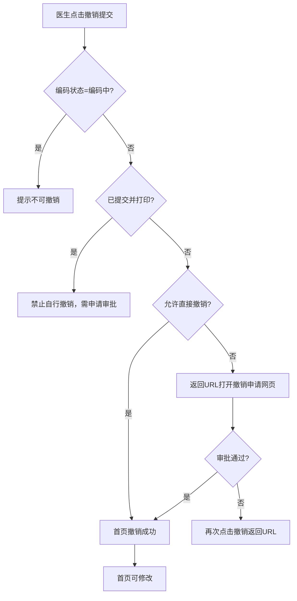
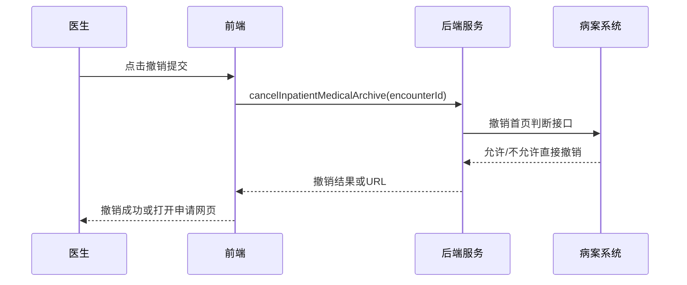

# BLGL-13-BASY-009 首页撤销提交与修改 - Spec

> **功能编号**：BLGL-13-BASY-009
> **文档类型**：Spec（研发视角）
> **文档版本**：V1.0
> **编写时间**：2026-08-13
> **编写人**：RACC

---

## 文档索引

本节提供本文档的章节结构索引与关联文档索引，便于读者快速定位与检索。

#### 章节索引

**Spec（研发视角）**

| 章节号 | 章节名称 | 内容说明 |
|--------|---------|---------|
| 1、 | 文档概述 | 文档目的、文档范围、术语定义、阅读指南、参考文档 |
| 2、 | 功能背景与定位 | 功能背景、功能定位、目标用户、核心价值 |
| 3、 | 业务流程设计 | 主流程/异常流程/边界流程（Given/When/Then） |
| 4、 | 数据模型设计 | 核心数据结构、状态定义、系统参数定义 |
| 5、 | 接口契约设计 | API列表、接口详细设计、错误码定义 |
| 6、 | 技术方案设计 | 页面路径、技术栈、关键技术点、部署方案 |
| 7、 | 测试用例预设计 | 功能/边界/异常/性能测试用例 |
| 8、 | 非功能性要求 | 性能、安全、可用性、兼容性 |
| 9、 | 依赖与风险 | 外部依赖、风险项 |
| 10、 | 附录 | 流程图、时序图、参考文档 |

**PM-Spec（业务视角）**

| 章节号 | 章节名称 | 内容说明 |
|--------|---------|---------|
| 一 | 目标 | 功能定位与核心价值 |
| 二 | 约束 | 业务/技术/非功能性约束 |
| 三 | 验收标准 | 验收条件与验证方法 |
| 四 | 排除范围 | 本次不做项与明确边界 |
| 五 | 关键决策记录 | 方案决策与选型理由 |
| 六 | 优先级 | 优先级定义 |
| 七 | 关联文档 | 关联文档索引 |
| 附录 | 填写检查清单 | 质量检查 |

**Analyst-Spec（产品视角）**

| 章节号 | 章节名称 | 内容说明 |
|--------|---------|---------|
| 一 | 功能编号体系 | 带父子层级的编号树 |
| 二 | 核心业务流程 | Mermaid 流程图 |
| 三 | 功能规格说明 | 各子功能点的概述、用户角色、业务流程、验收标准 |
| 四 | 排除范围 | 本需求不包含的功能项 |
| 五 | 业务规则清单 | 规则ID、规则名称、规则描述、优先级 |
| 六 | 关联文档 | 文档类型、文档路径、说明 |
| 七 | 待确认问题清单 | 所有 ⏳ 待确认项的汇总 |
| - | 填写检查清单 | 检查项与完成状态 |

#### 版本历史

| 版本 | 日期 | 变更说明 | 编写人 |
|------|------|---------|--------|
| V1.0 | 2026-08-13 | 初始版本 | RACC |

#### 关联文档索引

| 序号 | 文档名称 | 文档类型 | 版本 | 位置 |
|------|---------|---------|------|------|
| 1 | BLGL-13-BASY-009_首页撤销提交与修改_PM-spec.md | PM-Spec（业务视角） | V0.1 | 本目录 |
| 2 | BLGL-13-BASY-009_首页撤销提交与修改_Analyst-spec.md | Analyst-Spec（产品视角） | V1.0 | 本目录 |
| 3 | BLGL-13-BASY-009_首页撤销提交与修改-Spec.md | Spec（研发视角） | V1.0 | 本目录 |
| 4 | BLGL-13-BASY 13病案首页功能点Spec.md | 功能点Spec（模块级） | V1.0 | 上级目录 |

---

## 1、文档概述

### 1.1、文档目的

本文档旨在明确"首页撤销提交与修改"功能（BLGL-13-BASY-009）的业务背景与设计方案，为需求分析、研发实现、测试验收及评审提供统一的业务上下文、设计口径与决策依据。

**具体目的包括**：

1. 梳理首页撤销提交与修改功能的业务由来与历史需求演进脉络，说明"为什么要做"；
2. 明确功能的定位边界、目标用户与核心价值，回答"做成什么"；
3. 描述功能的业务流程、数据模型、接口契约与技术方案，回答"怎么做"；
4. 预设计测试用例并明确非功能性要求、依赖与风险，为研发与验收提供依据；
5. 作为 SPEC（功能编号体系、功能详情、业务规则、验收标准等章节）的业务前提与设计输入，保证各层文档业务口径一致。

### 1.2、文档范围

#### 1.2.1 纳入范围

本文档覆盖首页撤销提交与修改的完整业务背景与设计，包括：

- 首页撤销提交（对接60病案/WiNEX病案撤销接口）
- 撤销申请与病案室审批
- 撤销后修改权限控制
- 编码中首页撤销限制
- 已提交首页修改控制（提交并打印后禁止自行撤销）
- 首页删除恢复与回收站

#### 1.2.2 排除范围

本文档不涉及以下内容（详见其他功能点或模块）：

- 首页提交与校验——见 BLGL-13-BASY-007
- 病案系统对接与数据上报——见 BLGL-13-BASY-008
- 病历召回修改（归档召回）——见 BLGL-09-GDJY 归档借阅模块

### 1.3、术语定义

| 术语 | 定义 |
|------|------|
| 撤销提交 | 将已提交的病案首页恢复为未提交状态 |
| 撤销申请 | 病案室要求撤销已提交/已审核首页前的申请 |
| 修改权限限制 | 召回后可修改内容限制（如出院诊断和病理诊断） |
| 编码状态 | 三方病案编码录入状态（0未编码/1已录入/2已编码/3编码中） |

### 1.4、阅读指南

- **章节关系**：第1~2章为阅读铺垫与业务全貌（背景、定位、用户、价值）；第3~10章为设计实现层（流程、数据、接口、技术、测试、非功能、依赖风险、附录），可直接用于研发与测试。与 Analyst-Spec、PM-Spec 的详细规则/验收口径互相引用，保持一致。
- **读者对象**：
  - 产品经理/需求分析师：阅读第1~2章了解业务全貌，据此维护 PM-Spec 与功能清单；
  - 研发：阅读第3~6章用于开发实现，第9~10章用于依赖评估与联调；
  - 测试：阅读第3章、第7~8章用于用例设计与验收；
  - 评审人员：以本文档为业务口径与设计基准，核对各层文档一致性。

### 1.5、参考文档

| 序号 | 文档名称 | 版本/日期 |
|------|---------|----------|
| 1 | 【历史需求】病案首页需求-0727.xlsx | - |
| 2 | BLGL-13-BASY-009_首页撤销提交与修改_PM-spec.md | V0.1 |
| 3 | BLGL-13-BASY-009_首页撤销提交与修改_Analyst-spec.md | V1.0 |
| 4 | BLGL-13-BASY 13病案首页功能点Spec.md | V1.0 |
| 5 | WiNEX-病案首页_功能清单_20260325_162900.md | 2026-03-25 |

---

## 2、功能背景与定位

### 2.1 功能背景

首页撤销提交与修改是病案首页的变更控制，需满足：

- **法规/规范依据**：已提交/审核通过的首页撤销需先申请
- **管理要求**：撤销提交需对接60病案/WiNEX病案系统撤销接口
- **现状痛点**：提交并打印后医生可自行撤销，需限制
- **历史需求演进**：从"首页撤销提交接口对接"→"编码中首页不允许撤销"→"提交并打印后禁止自行撤销"

### 2.2 功能定位

"首页撤销提交与修改"是WiNEX病历管理-病案首页模块的变更控制层，定位为：

- **撤销控制定位**：首页撤销提交流程控制
- **权限控制定位**：撤销后修改权限限制
- **审批衔接定位**：与病案室/医务处审批衔接

### 2.3 目标用户

| 用户角色 | 主要使用场景 |
|---------|-------------|
| 住院医生 | 撤销首页提交、修改首页 |
| 病案室/医务处 | 审批撤销申请 |
| 编码员 | 编码首页 |

### 2.4 核心价值

| 价值维度 | 价值描述 |
|---------|---------|
| 变更可控 | 首页撤销提交流程受控 |
| 数据安全 | 已提交/已编码首页不允许随意撤销 |
| 审批合规 | 撤销需病案室/医务处审批 |

---

## 3、业务流程设计（Given/When/Then）

### 3.1 主流程

**Scenario 1: 首页撤销提交**

```gherkin
Given:
  - 首页已提交
  - 参数 COMMON266=是（开启病历病案首页）

When:
  - 医生点击病案首页撤销提交

Then:
  - 调用病案系统撤销提交接口
  - 允许直接撤销则首页撤销成功
  - 不允许直接撤销则返回URL，医生打开撤销申请网页申请
```

### 3.2 异常流程

**Scenario 2: 业务异常——编码中不允许撤销**

```gherkin
Given:
  - 三方病案编码状态=编码中（==3）
  - 首页编码录入状态控制方式=三方病案（强制同步）

When:
  - 医生点击撤销提交

Then:
  - 不能撤销提交，光标悬浮提示"病案室编码中，不可撤销！"
```

**Scenario 3: 数据异常——提交并打印后撤销**

```gherkin
Given:
  - 首页提交并打印后
  - 医生自行撤销

When:
  - 医生点击撤销提交

Then:
  - 禁止医生自行撤销，提示需申请审批
```

**Scenario 4: 系统异常——撤销接口超时**

```gherkin
Given:
  - 病案系统撤销接口超时

When:
  - 医生点击撤销提交

Then:
  - 撤销失败提示，首页保持已提交状态
```

### 3.3 边界流程

**Scenario 5: 边界场景——撤销申请审批流程**

```gherkin
Given:
  - 首页不允许直接撤销

When:
  - 医生申请撤销

Then:
  - 病案室人工审核通过时病案系统调用医生站接口更新首页为撤销提交状态
  - 审核不通过再次点击撤销返回URL
```

**Scenario 6: 边界场景——修改权限限制**

```gherkin
Given:
  - 病案召回配置-召回修改限制已设置

When:
  - 召回首页后可修改

Then:
  - 召回后只允许修改出院诊断和病理诊断（按修改限制设置）（功能清单 HIST032）
```

---

## 4、数据模型设计

### 4.1 核心数据结构

#### 4.1.1 核心保存请求

| 字段名 | 类型 | 必填 | 备注 |
|--------|------|------|------|
| encounterId | Long | 是 | 患者就诊标识 |
| inpEmrMahpId | Long | 是 | 首页主表ID |
| 撤销状态 | String | 否 | 撤销后状态 |

#### 4.1.2 核心表/实体

| 表/实体 | 关键字段 | 说明 |
|---------|---------|------|
| INP_EMR_MAHP | inpEmrMahpId, encounterId | 首页主表（撤销状态） |
| INP_EMR_ARCHIVE_RECALL | inpEmrArchiveRecallId | 归档召回表 |
| INP_EMR_CA_SIGNATURE_RECORD | inpEmrCaSignatureRecordId | CA签名记录表 |

### 4.2 状态定义

| 状态码 | 状态名称 | 说明 |
|--------|---------|------|
| 已提交 | 首页已提交状态 | 需撤销后可修改 |
| 已撤销提交 | 首页撤销提交状态 | 可修改 |
| 编码中（3） | 三方编码状态 | 不可撤销不可打印 |

### 4.3 系统参数定义

| 参数编码 | 参数名称 | 说明 |
|---------|---------|------|
| COMMON266 | 是否调用病案系统撤销提交接口 | 撤销对接控制 |
| 对接病案首页编码录入状态的首页控制方式 | 三方病案（强制同步） | 编码状态控制 |

---

## 5、接口契约设计

### 5.1 API列表

| 序号 | API名称（代码函数） | 路径 | 方法 | 说明 |
|:----:|---------|------|:----:|------|
| 1 | cancelInpatientMedicalArchiveById | /api/v1/emr/medical_archive/cancel | POST | 撤销提交病案首页 |
| 2 | cancelInpWinexMahpCancelSubmit | /api/v1/emr_medical_archive/winex_mahp_submitted/cancel | POST | 首页WiNEX病案撤销提交 |

### 5.2 接口详细设计

#### 5.2.1 撤销提交病案首页

**请求参数**:
```json
{
  "encounterId": 123456,
  "inpEmrMahpId": 789
}
```

**返回值（成功）**:
```json
{
  "success": true,
  "data": {
    "modifyTime": "2026-08-13 10:00:00"
  }
}
```

**返回值（失败）**:
```json
{
  "success": false,
  "message": "病案室编码中，不可撤销！",
  "data": null
}
```

> 📌 接口路径与函数名来自代码 InpatientMedicalArchiveController；返回结构字段待与接口文档核对，部分为 `⏳ 待确认`。

### 5.3 错误码定义

| 错误码 | 错误信息 | 处理方式 |
|--------|---------|---------|
| ⏳ 待确认 | 病案室编码中，不可撤销！ | 悬浮提示 |

---

## 6、技术方案设计

### 6.1 页面路径

- **页面路径**: winning-webui-inpatient-clinicalnote-pango/src/pages/EmrMedicalRecord（病历书写容器，首页撤销提交按钮）
- **路由**: 病历目录-病案首页
- **核心逻辑模块**: InpatientEmrMedicalArchiveService（cancelInpatientEmrMedicalArchive）、InpEmrMedicalArchiveQcService、InpatientMedicalArchiveController

### 6.2 技术栈

| 类别 | 技术 | 版本 |
|------|------|------|
| 前端框架 | Vue（winning-webui-inpatient-clinicalnote-pango） | ⏳ 待确认 |
| 后端框架 | Java Spring Boot + Akso MVC | ⏳ 待确认 |

### 6.3 关键技术点

- 撤销提交前需调撤销首页判断接口，判断病案是否允许直接撤销
- 不允许直接撤销返回URL，打开撤销申请网页
- 提交并打印后禁止自行撤销，需申请审批

### 6.4 部署方案

⏳ 待确认：部署方案未在资料区中找到

---

## 7、测试用例预设计

### 7.1 功能测试

| 用例编号 | 测试场景 | Given | When | Then |
|---------|---------|-------|------|------|
| TC-001 | 首页撤销提交 | 首页已提交，允许直接撤销 | 点击撤销提交 | 首页撤销成功 |
| TC-002 | 撤销申请审批 | 不允许直接撤销 | 申请撤销 | 返回URL打开申请网页 |
| TC-003 | 编码中撤销限制 | 编码状态=3 | 点击撤销 | 提示不可撤销 |

### 7.2 边界测试

| 用例编号 | 测试场景 | Given | When | Then |
|---------|---------|-------|------|------|
| TC-004 | 提交并打印后撤销 | 首页已提交并打印 | 点击撤销 | 禁止自行撤销需申请 |
| TC-005 | 修改权限限制 | 召回修改限制已配置 | 召回后修改 | 只允许修改出院诊断和病理诊断 |

### 7.3 异常测试

| 用例编号 | 测试场景 | Given | When | Then |
|---------|---------|-------|------|------|
| TC-006 | 撤销接口超时 | 接口超时 | 点击撤销 | 撤销失败，保持已提交 |
| TC-007 | 撤销后内容消失 | 撤销提交后 | 查看首页 | 部分内容自动消失 |

### 7.4 性能测试

| 用例编号 | 测试场景 | 指标 |
|---------|---------|------|
| TC-008 | 撤销提交响应时间 | ⏳ 待确认 |

---

## 8、非功能性要求

### 8.1 性能要求

| 指标 | 要求 |
|------|------|
| 撤销提交响应时间 | ⏳ 待确认 |

### 8.2 安全要求

| 要求 | 说明 |
|------|------|
| 撤销权限控制 | 首页撤销需有权限，编码中/已打印后限制 |

**医疗行业特殊要求**

| 要求 | 说明 |
|------|------|
| 数据不可篡改 | 已提交/已编码首页不允许随意撤销 |

### 8.3 可用性要求

| 指标 | 要求值 |
|------|--------|
| ⏳ 待确认 | - |

### 8.4 兼容性要求

| 类型 | 要求 |
|------|------|
| 60病案系统兼容 | 撤销接口对接 |
| WiNEX病案兼容 | WiNEX病案撤销提交 |

---

## 9、依赖与风险

### 9.1 外部依赖

| 依赖项 | 说明 |
|--------|------|
| 60病案系统 | 撤销接口 |
| WiNEX病案系统 | 撤销提交 |
| 病案室/医务处 | 撤销申请审批 |

### 9.2 风险项

| 风险项 | 等级 | 说明 | 应对方案 |
|--------|------|------|---------|
| 撤销后数据丢失 | 中 | 撤销后签名/血型等不固定信息消失 | 撤销时保留结构化数据 |
| 编码中误撤销 | 中 | 编码中首页误撤销导致编码丢失 | 编码状态=3限制撤销 |

---

## 10、附录

### 10.1 流程图



### 10.2 时序图



### 10.3 参考文档

- WiNEX-病案首页_功能清单_20260325_162900.md（第2.7节首页撤销审核）
- 【历史需求】病案首页需求-0727.xlsx（、1305568、1571912、1470394 等）
- BLGL-13-BASY 13病案首页功能点Spec.md（V1.0）
- 关联Spec: BLGL-13-BASY-008 病案系统对接与数据上报 -Spec.md

---

## 填写检查清单

| 序号 | 检查项 | 是否完成 |
|:----:|--------|:--------:|
| 1 | 章节索引与正文章节一致 | ✅ |
| 2 | 版本历史记录完整 | ✅ |
| 3 | 关联文档索引已登记全部Spec | ✅ |
| 4 | 文档目的明确回答"为什么做/做成什么/怎么做" | ✅ |
| 5 | 纳入范围/排除范围清晰 | ✅ |
| 6 | 术语定义覆盖关键概念，从资料区可溯源 | ✅ |
| 7 | 参考文档已登记 | ✅ |
| 8 | 功能背景基于法规/规范/需求来源组织 | ✅ |
| 9 | 功能定位体现业务价值（3~5个定位点） | ✅ |
| 10 | 目标用户角色覆盖完整，在需求原文中有出处 | ✅ |
| 11 | 核心价值可陈述，与 Phase 1 口径一致 | ✅ |
| 12 | 业务流程：主流程≥1、异常≥3、边界≥2，Given/When/Then 具体 | ✅ |
| 13 | 数据模型：字段/表/状态/参数可溯源（概念ID/表名/参数编码） | ✅ |
| 14 | 接口契约：API列表+详细设计+错误码齐全或标记待确认 | ✅（错误码 ⏳） |
| 15 | 技术方案：页面路径/技术栈/关键点/部署方案或标记待确认 | ✅ |
| 16 | 测试用例：功能/边界/异常/性能覆盖，与第3章场景对应 | ✅ |
| 17 | 非功能性要求：性能/安全/可用性/兼容性指标可量化或标记待确认 | ✅ |
| 18 | 依赖与风险：外部依赖登记完整，风险有具体应对方案或标记待确认 | ✅ |
| 19 | 附录：流程图/时序图与正文流程一致 | ✅ |
| 20 | 全文无占位符 `< >` 残留 | ✅ |
| 21 | 全文陈述可溯源至资料区，无来源的已标记 ⏳ | ✅ |
| 22 | 人工审核确认完成 | ⏳ 待确认 |

---

**文档状态**：⬜ 待审核
**维护责任**：RACC
**下次更新**：根据评审反馈优化
