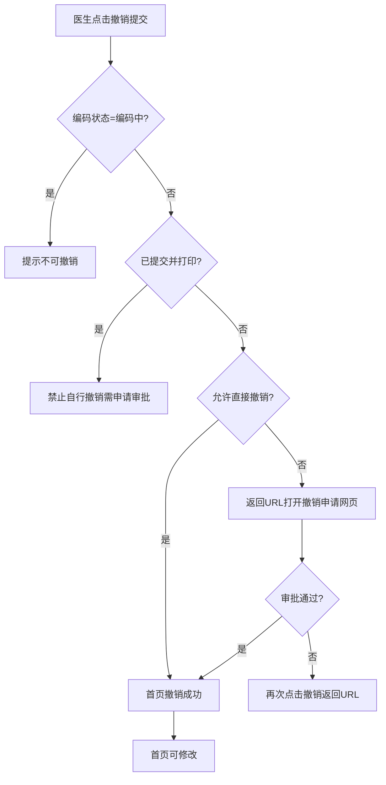
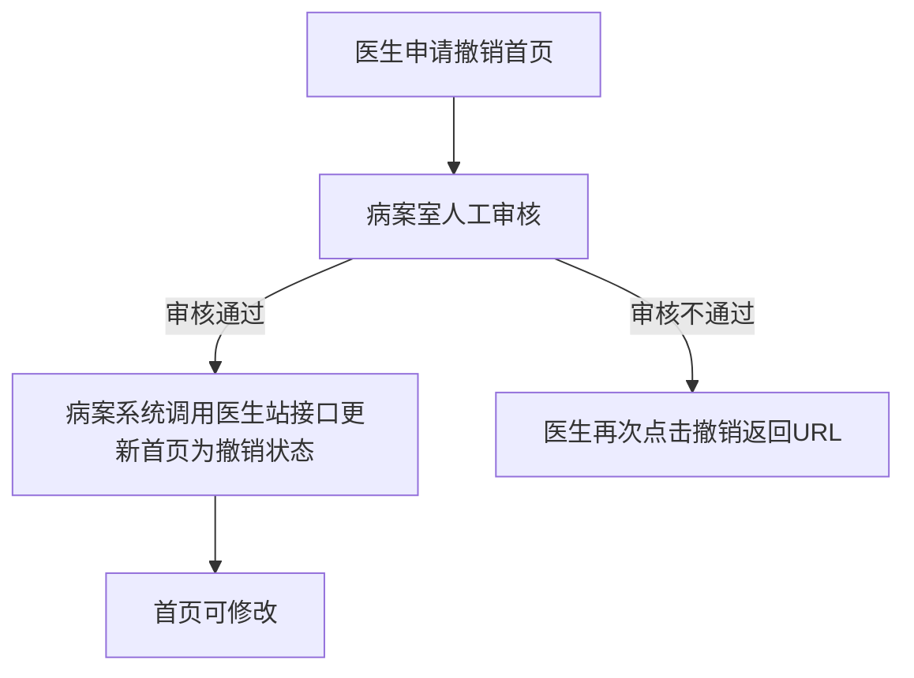

# BLGL-13-BASY-009首页撤销提交与修改_ Analyst - Spec

> **需求编号**：BLGL-13-BASY-009
> **父需求**：BLGL-13-BASY
> **关联PM Spec**：BLGL-13-BASY-009_首页撤销提交与修改_PM-spec.md
> **Spec版本**：V1.0
> **编写时间**：2026-08-13
> **编写人**：需求分析师

---

## 一、功能编号体系

### 1.1 功能层级结构

```
BLGL-13-BASY-009: 首页撤销提交与修改
  ├─ BLGL-13-BASY-009-01: 首页撤销提交
  ├─ BLGL-13-BASY-009-02: 撤销申请与审批
  ├─ BLGL-13-BASY-009-03: 编码中撤销限制
  ├─ BLGL-13-BASY-009-04: 提交并打印后撤销限制
  └─ BLGL-13-BASY-009-05: 撤销后修改权限控制
```

### 1.2 功能编号表

| REQ-ID | 功能名称 | 类型 | 优先级 | 说明 |
|--------|---------|------|--------|------|
| BLGL-13-BASY-009-01 | 首页撤销提交 | 功能 | P0 | 撤销提交对接病案系统接口 |
| BLGL-13-BASY-009-02 | 撤销申请与审批 | 功能 | P0 | 病案室审批撤销申请 |
| BLGL-13-BASY-009-03 | 编码中撤销限制 | 功能 | P0 | 编码状态=3不可撤销 |
| BLGL-13-BASY-009-04 | 提交并打印后撤销限制 | 功能 | P1 | 禁止自行撤销需申请审批 |
| BLGL-13-BASY-009-05 | 撤销后修改权限控制 | 功能 | P1 | 召回后可修改内容限制 |

---

## 二、核心业务流程

### 2.1 首页撤销提交流程



### 2.2 撤销申请审批流程



---

## 三、功能规格说明

### BLGL-13-BASY-009-01: 首页撤销提交

#### 3.1.1 功能概述

病案首页已经提交后，在住院医生站点击病案首页撤销提交时，当开启病历病案首页且参数（COMMON266：是）才需要调用病案系统的撤销提交接口。需先调撤销首页判断接口，判断病案是否允许直接撤销。允许直接撤销则首页直接撤销成功；不允许则返回URL打开撤销首页申请网页。

#### 3.1.2 用户角色

| 角色 | 使用场景 | 权限要求 | 操作频率 |
|------|---------|---------|---------|
| 住院医生 | 撤销首页提交 | 病历书写权限 | 中频 |
| 病案室人员 | 审批撤销申请 | 病案审批权限 | 低频 |

#### 3.1.3 业务流程（Given/When/Then）

##### 主流程（1 个）

**Scenario 1: 首页撤销提交**

```gherkin
Given:
  - 首页已提交
  - 参数 COMMON266=是

When:
  - 医生点击病案首页撤销提交

Then:
  - 调撤销首页判断接口
  - 允许直接撤销则首页直接撤销成功
  - 不允许则返回URL打开撤销申请网页
```

##### 异常流程（3 个）

**Scenario 2: 业务异常——不允许直接撤销**

```gherkin
Given:
  - 病案系统不允许直接撤销

When:
  - 医生点击撤销提交

Then:
  - 出参返回URL，医生站打开撤销首页申请网页
```

**Scenario 3: 数据异常——撤销后内容消失**

```gherkin
Given:
  - 首页撤销提交后

When:
  - 医生查看首页

Then:
  - 主任、住院、质控护士签名；血型等不固定信息自动消失
```

**Scenario 4: 系统异常——撤销接口超时**

```gherkin
Given:
  - 病案系统撤销接口超时

When:
  - 医生点击撤销提交

Then:
  - 撤销失败提示，首页保持已提交状态
```

##### 边界流程（2 个）

**Scenario 5: 边界——参数COMMON266为否**

```gherkin
Given:
  - 参数 COMMON266=否

When:
  - 医生点击撤销提交

Then:
  - 不调用病案系统撤销接口，按原逻辑撤销
```

**Scenario 6: 边界——重新传数据状态**

```gherkin
Given:
  - 首页不撤销提交状态

When:
  - 病案室重新传数据

Then:
  - 补传功能支持不撤销重传
```

#### 3.1.5 验收标准

| AC编号 | 验收标准 | 对应REQ-ID | 验证方法 | 验证场景 |
|--------|---------|-----------|---------|---------|
| AC-001 | 撤销提交调用病案系统撤销接口，允许时撤销成功 | BLGL-13-BASY-009-01 | 集成测试 | Scenario 1 |
| AC-002 | 不允许直接撤销时返回URL打开申请网页 | BLGL-13-BASY-009-01 | 功能测试 | Scenario 2 |

---

### BLGL-13-BASY-009-02: 撤销申请与审批

#### 3.2.1 功能概述

病案室要求对已经录入或审核通过的病案首页，医生站在撤销病案首页提交前必须先申请。在病案室人工审核通过时，病案系统调用医生站接口，直接更新医生病案首页为撤销提交状态。

#### 3.2.2 用户角色

| 角色 | 使用场景 | 权限要求 | 操作频率 |
|------|---------|---------|---------|
| 住院医生 | 申请撤销首页 | 病历书写权限 | 中频 |
| 病案室人员 | 审批撤销申请 | 病案审批权限 | 低频 |

#### 3.2.3 业务流程（Given/When/Then）

##### 主流程（1 个）

**Scenario 1: 撤销申请审批**

```gherkin
Given:
  - 首页不允许直接撤销
  - 医生已提交撤销申请

When:
  - 病案室人工审核通过

Then:
  - 病案系统调用医生站接口
  - 直接更新医生病案首页为撤销提交状态
```

##### 异常流程（3 个）

**Scenario 2: 业务异常——审核不通过**

```gherkin
Given:
  - 撤销申请审核不通过

When:
  - 医生再次点击撤销按钮

Then:
  - 再次返回URL
```

**Scenario 3: 数据异常——审批后更新失败**

```gherkin
Given:
  - 病案系统调用医生站接口失败

When:
  - 审批通过后

Then:
  - 首页未更新为撤销状态，需重试
```

**Scenario 4: 系统异常——审批接口异常**

```gherkin
Given:
  - 病案系统审批接口异常

When:
  - 病案室审批

Then:
  - 审批失败提示，首页保持已提交状态
```

##### 边界流程（2 个）

**Scenario 5: 边界——审批通过后首页修改**

```gherkin
Given:
  - 撤销申请审批通过

When:
  - 医生修改首页

Then:
  - 首页已撤销可修改，需重新提交
```

**Scenario 6: 边界——多次审批**

```gherkin
Given:
  - 首页多次需修改

When:
  - 医生多次申请撤销

Then:
  - 每次撤销均需审批
```

#### 3.2.5 验收标准

| AC编号 | 验收标准 | 对应REQ-ID | 验证方法 | 验证场景 |
|--------|---------|-----------|---------|---------|
| AC-001 | 审批通过后首页更新为撤销提交状态 | BLGL-13-BASY-009-02 | 集成测试 | Scenario 1 |
| AC-002 | 审核不通过再次点击撤销返回URL | BLGL-13-BASY-009-02 | 功能测试 | Scenario 2 |

---

### BLGL-13-BASY-009-03: 编码中撤销限制

#### 3.3.1 功能概述

三方病案编码状态查询接口增加编码状态为编码中（即==3）时，病案首页需做如下控制：不能进行撤销提交，光标悬浮在撤销提交按钮时提示"病案室编码中，不可撤销！"；不能进行打印。

#### 3.3.2 用户角色

| 角色 | 使用场景 | 权限要求 | 操作频率 |
|------|---------|---------|---------|
| 住院医生 | 编码中操作首页 | 病历书写权限 | 中频 |
| 编码员 | 编码首页 | 编码权限 | 中频 |

#### 3.3.3 业务流程（Given/When/Then）

##### 主流程（1 个）

**Scenario 1: 编码中撤销限制**

```gherkin
Given:
  - 首页编码录入状态的首页控制方式=三方病案（强制同步）
  - 三方病案编码状态=编码中（==3）

When:
  - 医生点击撤销提交

Then:
  - 不能撤销提交
  - 光标悬浮提示"病案室编码中，不可撤销！"
```

##### 异常流程（3 个）

**Scenario 2: 业务异常——编码中打印限制**

```gherkin
Given:
  - 编码状态=编码中（==3）

When:
  - 医生点击打印

Then:
  - 不能打印，光标悬浮提示"病案室编码中，不可打印！"
```

**Scenario 3: 数据异常——编码状态查询失败**

```gherkin
Given:
  - 三方编码状态查询接口异常

When:
  - 医生操作首页

Then:
  - 按编码状态未知处理，限制撤销/打印（保守处理）
```

**Scenario 4: 系统异常——编码状态接口超时**

```gherkin
Given:
  - 编码状态查询接口超时

When:
  - 医生点击撤销

Then:
  - 提示编码状态查询失败，暂不可撤销
```

##### 边界流程（2 个）

**Scenario 5: 边界——所有打印场景控制**

```gherkin
Given:
  - 编码状态=编码中

When:
  - 医生打印

Then:
  - 控制所有打印首页场景：病历书写界面打印、集中打印按钮打印、全院病历查询界面打印、病历结构化查询患者查看打印
```

**Scenario 6: 边界——编码状态回写同步**

```gherkin
Given:
  - 编码状态=已录入（==1）

When:
  - 病案首页同步

Then:
  - 自动同步病理诊断/死亡诊断/损伤中毒外部原因字段
```

#### 3.3.5 验收标准

| AC编号 | 验收标准 | 对应REQ-ID | 验证方法 | 验证场景 |
|--------|---------|-----------|---------|---------|
| AC-001 | 编码状态=3时不能撤销提交 | BLGL-13-BASY-009-03 | 功能测试 | Scenario 1 |
| AC-002 | 编码状态=3时不能打印 | BLGL-13-BASY-009-03 | 功能测试 | Scenario 2 |

---

### BLGL-13-BASY-009-04: 提交并打印后撤销限制

#### 3.4.1 功能概述

病案首页提交并打印后禁止医生自行撤销提交；如需编辑，需提出申请，由医务处或病案室审批同意后才能撤销提交并编辑。

#### 3.4.2 用户角色

| 角色 | 使用场景 | 权限要求 | 操作频率 |
|------|---------|---------|---------|
| 住院医生 | 提交并打印首页 | 病历书写权限 | 中频 |
| 病案室/医务处 | 审批撤销申请 | 病案审批权限 | 低频 |

#### 3.4.3 业务流程（Given/When/Then）

##### 主流程（1 个）

**Scenario 1: 提交并打印后撤销限制**

```gherkin
Given:
  - 首页已提交并打印

When:
  - 医生尝试自行撤销提交

Then:
  - 禁止医生自行撤销
  - 提示需提出申请，由医务处或病案室审批同意后才能撤销
```

##### 异常流程（3 个）

**Scenario 2: 业务异常——撤销申请审批**

```gherkin
Given:
  - 医生提交撤销申请

When:
  - 医务处/病案室审批

Then:
  - 审批同意后才能撤销提交并编辑
```

**Scenario 3: 数据异常——作废并删除**

```gherkin
Given:
  - 已打印首页撤销提交

When:
  - 病案申请撤销接口

Then:
  - 调用病案申请撤销接口地址，取消判断打印的逻辑
```

**Scenario 4: 系统异常——审批接口异常**

```gherkin
Given:
  - 审批接口异常

When:
  - 医生申请撤销

Then:
  - 申请失败提示，首页保持已提交并打印状态
```

##### 边界流程（2 个）

**Scenario 5: 边界——未打印首页**

```gherkin
Given:
  - 首页已提交但未打印

When:
  - 医生撤销提交

Then:
  - 按原撤销逻辑处理
```

**Scenario 6: 边界——打印后数据变化提示**

```gherkin
Given:
  - 首页已提交未归档，医生站打印

When:
  - 打印时患者基本信息和诊断变化

Then:
  - 参数控制校验基本信息及诊断信息变化，配置为校验并存在时提醒/阻拦
```

#### 3.4.5 验收标准

| AC编号 | 验收标准 | 对应REQ-ID | 验证方法 | 验证场景 |
|--------|---------|-----------|---------|---------|
| AC-001 | 提交并打印后禁止医生自行撤销 | BLGL-13-BASY-009-04 | 功能测试 | Scenario 1 |
| AC-002 | 需审批同意后才能撤销提交并编辑 | BLGL-13-BASY-009-04 | 功能测试 | Scenario 2 |

---

### BLGL-13-BASY-009-05: 撤销后修改权限控制

#### 3.5.1 功能概述

病案召回配置-召回修改限制：添加限制内容保存时判断设置内容是否为空，适用范围是否已选，内容为空或范围未选不允许保存。召回后可按修改限制设置可操作内容，例如首页召回修改限制"出院诊断和病理诊断"的设置，召回后只允许修改出院诊断和病理诊断。

#### 3.5.2 用户角色

| 角色 | 使用场景 | 权限要求 | 操作频率 |
|------|---------|---------|---------|
| 住院医生 | 召回后修改首页 | 病历书写权限 | 低频 |
| 病案室人员 | 配置召回修改限制 | 病案配置权限 | 低频 |

#### 3.5.3 业务流程（Given/When/Then）

##### 主流程（1 个）

**Scenario 1: 召回后修改权限控制**

```gherkin
Given:
  - 病案召回配置-召回修改限制已设置（出院诊断和病理诊断）

When:
  - 医生召回首页后修改

Then:
  - 召回后只允许修改出院诊断和病理诊断
```

##### 异常流程（3 个）

**Scenario 2: 业务异常——限制内容未配置**

```gherkin
Given:
  - 添加限制内容时内容为空或适用范围未选

When:
  - 保存召回修改限制

Then:
  - 不允许保存（功能清单 HIST032）
```

**Scenario 3: 数据异常——病理延迟修改**

```gherkin
Given:
  - 已进行病理延迟申请并审核通过

When:
  - 召回首页修改

Then:
  - 按修改限制只允许修改出院诊断和病理诊断（功能清单 HIST032）
```

**Scenario 4: 系统异常——权限配置接口异常**

```gherkin
Given:
  - 权限配置接口异常

When:
  - 医生召回首页

Then:
  - 修改权限控制不生效，按默认权限处理
```

##### 边界流程（2 个）

**Scenario 5: 边界——前置条件提醒**

```gherkin
Given:
  - 病理延迟申请通过后

When:
  - 住院医生站点击患者病案首页预览

Then:
  - 弹框创建提醒：前置提醒+前置条件，点击确定自动创建该前置条件（功能清单 HIST032）
```

**Scenario 6: 边界——多次病理延迟**

```gherkin
Given:
  - 存在多次病理延迟操作

When:
  - 医生操作首页

Then:
  - 创建对应的多次"出院后补充病程记录"（功能清单 HIST032）
```

#### 3.5.5 验收标准

| AC编号 | 验收标准 | 对应REQ-ID | 验证方法 | 验证场景 |
|--------|---------|-----------|---------|---------|
| AC-001 | 召回后按修改限制只允许修改出院诊断和病理诊断 | BLGL-13-BASY-009-05 | 功能测试 | Scenario 1 |
| AC-002 | 限制内容为空或范围未选不允许保存 | BLGL-13-BASY-009-05 | 功能测试 | Scenario 2 |

---

## 四、排除范围

本需求不包含以下功能项：

1. **首页提交与校验** - 归属 BLGL-13-BASY-007
2. **病案系统对接与数据上报** - 归属 BLGL-13-BASY-008
3. **病历召回修改（归档召回）** - 归属 BLGL-09-GDJY

---

## 五、业务规则清单

| 规则ID | 规则名称 | 规则描述 | 来源 | 优先级 |
|--------|---------|---------|------|--------|
| BR-001 | 撤销接口调用 | 参数COMMON266=是时调用病案系统撤销接口 | | P0 |
| BR-002 | 撤销判断接口 | 撤销前先调判断接口，允许则直接撤销 | | P0 |
| BR-003 | 撤销申请审批 | 不允许直接撤销时返回URL申请，审批通过更新状态 | | P0 |
| BR-004 | 编码中撤销限制 | 编码状态=3不能撤销不能打印 | | P0 |
| BR-005 | 提交并打印撤销限制 | 提交并打印后禁止自行撤销，需审批 | | P1 |
| BR-006 | 修改权限限制 | 召回后按修改限制设置可修改内容 | 功能清单 HIST032 | P1 |
| BR-007 | 撤销后数据保留 | 撤销提交后结构化数据保留，重新创建无需重新录入 | | P1 |

---

## 六、关联文档

| 文档类型 | 文档路径 | 说明 |
|---------|---------|------|
| PM-Spec（业务视角） | 本目录 BLGL-13-BASY-009_首页撤销提交与修改_PM-spec.md（V0.1） | PM 产出的 Spec 文档 |
| Spec（研发视角） | 本目录 BLGL-13-BASY-009_首页撤销提交与修改-Spec.md（V1.0） | 业务背景与目标 Spec |
| 功能点Spec（模块级） | BLGL-13-BASY 13病案首页功能点Spec.md（V1.0，上级目录） | Phase 1 功能点索引 |
| data-model.md | 待产出 | 架构师产出的数据建模文档 |
| design.md | 待产出 | 架构师产出的技术方案文档 |
| api-contract.md | 待产出 | 开发经理产出的 API 契约文档 |

---

## 七、待确认问题清单

| 编号 | 问题描述 | 缺失信息 | 影响范围 | 建议补充方 |
|------|---------|---------|---------|-----------|
| Q-001 | 撤销接口返回结构具体字段 | 接口契约 | 接口详细设计 | 开发经理 |
| Q-002 | 撤销提交性能指标 | 性能指标 | 非功能性要求 | 产品经理 |
| Q-003 | 撤销后修改权限完整配置 | 权限配置 | 修改权限控制 | 模块负责人 |
| Q-004 | 归档召回与首页撤销的边界 | 流程边界 | 排除范围 | 产品经理 |

---

## 填写检查清单

| 序号 | 检查项 | 是否完成 |
|:----:|--------|:--------:|
| 1 | 功能编号带父子层级 | ✅ |
| 2 | 每个 REQ-ID 有功能概述和用户角色 | ✅ |
| 3 | 主流程至少 1 个 Given/When/Then 场景 | ✅ |
| 4 | 异常流程至少 3 个 Given/When/Then 场景 | ✅ |
| 5 | 边界流程至少 2 个 Given/When/Then 场景 | ✅ |
| 6 | 每个 Given/When/Then 内容具体，不模糊 | ✅ |
| 7 | 数据字段定义完整（字段名、类型、必填、说明、概念ID） | ✅ |
| 8 | 验收标准 AC 编号独立，可验证 | ✅ |
| 9 | 验收标准无"功能正常"等模糊表述 | ✅ |
| 10 | 排除范围明确列出 | ✅ |
| 11 | 业务规则清单列出所有规则，每条标注来源 | ✅ |
| 12 | 流程图使用 Mermaid 格式（≥2 个） | ✅ |
| 13 | 关联文档索引包含 Phase 1 功能点Spec | ✅ |
| 14 | 待确认问题清单汇总了全文所有 ⏳ 项 | ✅ |
| 15 | 全文无占位符 `< >` 残留 | ✅ |
| 16 | 全文陈述可溯源至资料区（S1~S10 溯源核查） | ✅ |
| 17 | 人工审核确认完成 | ⏳ 待确认 |

---

**文档状态**：⬜ 待审核
**维护责任**：需求分析师规范组
**下次更新**：根据评审反馈优化

---

## 版本历史

| 版本 | 日期 | 变更说明 | 编写人 |
|------|------|---------|--------|
| V1.0 | 2026-08-13 | 初始版本 | 需求分析师 |
