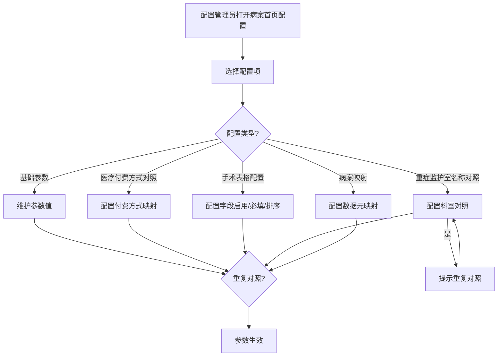
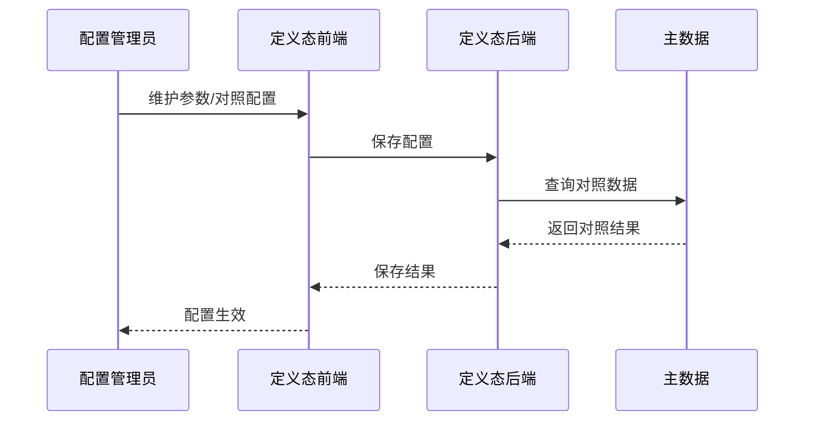

# BLGL-13-BASY-010 首页参数与映射配置 - Spec

> **功能编号**：BLGL-13-BASY-010
> **文档类型**：Spec（研发视角）
> **文档版本**：V1.0
> **编写时间**：2026-08-13
> **编写人**：RACC

---

## 文档索引

本节提供本文档的章节结构索引与关联文档索引，便于读者快速定位与检索。

#### 章节索引

**Spec（研发视角）**

| 章节号 | 章节名称 | 内容说明 |
|--------|---------|---------|
| 1、 | 文档概述 | 文档目的、文档范围、术语定义、阅读指南、参考文档 |
| 2、 | 功能背景与定位 | 功能背景、功能定位、目标用户、核心价值 |
| 3、 | 业务流程设计 | 主流程/异常流程/边界流程（Given/When/Then） |
| 4、 | 数据模型设计 | 核心数据结构、状态定义、系统参数定义 |
| 5、 | 接口契约设计 | API列表、接口详细设计、错误码定义 |
| 6、 | 技术方案设计 | 页面路径、技术栈、关键技术点、部署方案 |
| 7、 | 测试用例预设计 | 功能/边界/异常/性能测试用例 |
| 8、 | 非功能性要求 | 性能、安全、可用性、兼容性 |
| 9、 | 依赖与风险 | 外部依赖、风险项 |
| 10、 | 附录 | 流程图、时序图、参考文档 |

**PM-Spec（业务视角）**

| 章节号 | 章节名称 | 内容说明 |
|--------|---------|---------|
| 一 | 目标 | 功能定位与核心价值 |
| 二 | 约束 | 业务/技术/非功能性约束 |
| 三 | 验收标准 | 验收条件与验证方法 |
| 四 | 排除范围 | 本次不做项与明确边界 |
| 五 | 关键决策记录 | 方案决策与选型理由 |
| 六 | 优先级 | 优先级定义 |
| 七 | 关联文档 | 关联文档索引 |
| 附录 | 填写检查清单 | 质量检查 |

**Analyst-Spec（产品视角）**

| 章节号 | 章节名称 | 内容说明 |
|--------|---------|---------|
| 一 | 功能编号体系 | 带父子层级的编号树 |
| 二 | 核心业务流程 | Mermaid 流程图 |
| 三 | 功能规格说明 | 各子功能点的概述、用户角色、业务流程、验收标准 |
| 四 | 排除范围 | 本需求不包含的功能项 |
| 五 | 业务规则清单 | 规则ID、规则名称、规则描述、优先级 |
| 六 | 关联文档 | 文档类型、文档路径、说明 |
| 七 | 待确认问题清单 | 所有 ⏳ 待确认项的汇总 |
| - | 填写检查清单 | 检查项与完成状态 |

#### 版本历史

| 版本 | 日期 | 变更说明 | 编写人 |
|------|------|---------|--------|
| V1.0 | 2026-08-13 | 初始版本 | RACC |

#### 关联文档索引

| 序号 | 文档名称 | 文档类型 | 版本 | 位置 |
|------|---------|---------|------|------|
| 1 | BLGL-13-BASY-010_首页参数与映射配置_PM-spec.md | PM-Spec（业务视角） | V0.1 | 本目录 |
| 2 | BLGL-13-BASY-010_首页参数与映射配置_Analyst-spec.md | Analyst-Spec（产品视角） | V1.0 | 本目录 |
| 3 | BLGL-13-BASY-010_首页参数与映射配置-Spec.md | Spec（研发视角） | V1.0 | 本目录 |
| 4 | BLGL-13-BASY 13病案首页功能点Spec.md | 功能点Spec（模块级） | V1.0 | 上级目录 |

---

## 1、文档概述

### 1.1、文档目的

本文档旨在明确"首页参数与映射配置"功能（BLGL-13-BASY-010）的业务背景与设计方案，为需求分析、研发实现、测试验收及评审提供统一的业务上下文、设计口径与决策依据。

**具体目的包括**：

1. 梳理首页参数与映射配置功能的业务由来与历史需求演进脉络，说明"为什么要做"；
2. 明确功能的定位边界、目标用户与核心价值，回答"做成什么"；
3. 描述功能的业务流程、数据模型、接口契约与技术方案，回答"怎么做"；
4. 预设计测试用例并明确非功能性要求、依赖与风险，为研发与验收提供依据；
5. 作为 SPEC（功能编号体系、功能详情、业务规则、验收标准等章节）的业务前提与设计输入，保证各层文档业务口径一致。

### 1.2、文档范围

#### 1.2.1 纳入范围

本文档覆盖首页参数与映射配置的完整业务背景与设计，包括：

- 病案首页基础配置/基本参数配置
- 医疗付费方式对照配置
- 手术表格配置/中医治疗性操作配置
- 重症监护室名称对照配置
- 病案映射（首页数据元映射）
- 首页规则配置（校验规则参数）
- 病案项目对照

#### 1.2.2 排除范围

本文档不涉及以下内容（详见其他功能点或模块）：

- 首页模板配置管理——见 BLGL-12-MBGL 模板管理模块
- 各功能点的业务逻辑（诊断/手术/费用/重症等）——见 BLGL-13-BASY-003~006
- 病案系统对接的字典对照——见 BLGL-13-BASY-008

### 1.3、术语定义

| 术语 | 定义 |
|------|------|
| 病案首页配置 | 病历业务配置中病案首页的配置目录 |
| 医疗付费方式对照 | 首页医疗付费方式编码与内容的对照配置 |
| 手术表格配置 | 首页手术表格字段启用/必填/排序等配置 |
| 重症监护室名称对照 | 将院内科室码转换为重症科室标准字典 |
| 病案映射 | 首页数据元与病案系统元素的映射关系 |
| 病案项目对照 | 首页费用类别与术语概念ID对照 |

### 1.4、阅读指南

- **章节关系**：第1~2章为阅读铺垫与业务全貌（背景、定位、用户、价值）；第3~10章为设计实现层（流程、数据、接口、技术、测试、非功能、依赖风险、附录），可直接用于研发与测试。与 Analyst-Spec、PM-Spec 的详细规则/验收口径互相引用，保持一致。
- **读者对象**：
  - 产品经理/需求分析师：阅读第1~2章了解业务全貌，据此维护 PM-Spec 与功能清单；
  - 研发：阅读第3~6章用于开发实现，第9~10章用于依赖评估与联调；
  - 测试：阅读第3章、第7~8章用于用例设计与验收；
  - 评审人员：以本文档为业务口径与设计基准，核对各层文档一致性。

### 1.5、参考文档

| 序号 | 文档名称 | 版本/日期 |
|------|---------|----------|
| 1 | 【历史需求】病案首页需求-0727.xlsx | - |
| 2 | BLGL-13-BASY-010_首页参数与映射配置_PM-spec.md | V0.1 |
| 3 | BLGL-13-BASY-010_首页参数与映射配置_Analyst-spec.md | V1.0 |
| 4 | BLGL-13-BASY 13病案首页功能点Spec.md | V1.0 |
| 5 | WiNEX-病案首页_功能清单_20260325_162900.md | 2026-03-25 |

---

## 2、功能背景与定位

### 2.1 功能背景

首页参数与映射配置是病案首页的可配置基础，需满足：

- **管理要求**：首页行为由参数配置驱动
- **配置灵活性**：手术表格、付费方式、重症监护室名称对照等可配置
- **现状痛点**：医疗付费方式编码切换清空已保存内容
- **历史需求演进**：从"医疗付费方式对照"→"医疗付费方式对照参数优化"→"手术表格配置优化"→"重症监护室名称对照"

### 2.2 功能定位

"首页参数与映射配置"是WiNEX病历管理-病案首页模块的配置支撑层，定位为：

- **参数配置定位**：首页行为参数化配置
- **映射配置定位**：首页数据元与病案系统映射
- **对照配置定位**：付费方式/重症监护室名称/病案项目对照

### 2.3 目标用户

| 用户角色 | 主要使用场景 |
|---------|-------------|
| 配置管理员 | 维护首页参数配置 |
| 病案室人员 | 医疗付费方式对照、病案映射 |
| 实施人员 | 首页参数/对照配置 |

### 2.4 核心价值

| 价值维度 | 价值描述 |
|---------|---------|
| 配置灵活 | 首页行为参数化，适配不同医院需求 |
| 对照规范 | 付费方式/重症/费用项目对照 |
| 维护效率 | 参数切换保存优化 |

---

## 3、业务流程设计（Given/When/Then）

### 3.1 主流程

**Scenario 1: 首页参数配置维护**

```gherkin
Given:
  - 配置管理员有病历配置权限

When:
  - 配置管理员打开病历业务配置-病案首页配置

Then:
  - 可配置基础配置/基本参数/手术表格配置/医疗付费方式对照等参数
  - 参数保存生效
```

### 3.2 异常流程

**Scenario 2: 业务异常——医疗付费方式编码切换**

```gherkin
Given:
  - 医疗付费方式对照切换编码体系

When:
  - 配置人员切换编码体系+对照类别未保存

Then:
  - 切换到原已对照的编码体系时保留原有对照关系
  - 多次切换后再回到体系B时不留缓存，映射关系为空
```

**Scenario 3: 数据异常——参数保存失败**

```gherkin
Given:
  - 参数配置保存接口异常

When:
  - 配置管理员保存参数

Then:
  - 保存失败提示，参数不生效
```

**Scenario 4: 系统异常——配置服务异常**

```gherkin
Given:
  - 配置服务异常

When:
  - 配置管理员打开配置界面

Then:
  - 配置界面加载失败提示
```

### 3.3 边界流程

**Scenario 5: 边界场景——手术表格必填类别配置**

```gherkin
Given:
  - 手术表格配置新增"必填类别"列（多选项）

When:
  - 配置人员配置必填类别

Then:
  - 手术类必填项校验，操作类不校验
```

**Scenario 6: 边界场景——重症监护室名称重复对照**

```gherkin
Given:
  - 同一科室已存在重症监护室名称对照

When:
  - 配置人员再次保存对照关系

Then:
  - 提示"XXX科室存在重复对照，请重新对照"
```

---

## 4、数据模型设计

### 4.1 核心数据结构

#### 4.1.1 核心保存请求

| 字段名 | 类型 | 必填 | 备注 |
|--------|------|------|------|
| hospitalSOID | Long | 是 | 医院机构ID |
| 参数编码 | String | 是 | 参数编码（如COMMON072） |
| 参数值 | String | 是 | 参数值 |

#### 4.1.2 核心表/实体

| 表/实体 | 关键字段 | 说明 |
|---------|---------|------|
| EMR_MAHP_FIELD_MAPPING | fieldMappingId | 首页字段映射表 |
| EMR_MAHP_THIRDPARTY_INTERFACE | thirdpartyInterfaceId | 三方接口配置表 |
| INP_EMR_MAHP_COVERAGE_TYPE | coverageTypeId | 参保人员类别对照 |
| EMR_MAHP_DICT_RELATION | dictRelationId | 字典对照关系 |

### 4.2 状态定义

| 状态码 | 状态名称 | 说明 |
|--------|---------|------|
| ⏳ 待确认 | 参数生效状态 | 状态定义未在资料区完整找到 |

### 4.3 系统参数定义

| 参数编码 | 参数名称 | 说明 |
|---------|---------|------|
| COMMON072 | 住院病历是否启用病案首页 | 首页启用控制 |
| MEDICAL005 | 病案首页的门诊诊断是否只显示主诊断 | 诊断显示 |
| MEDICAL018 | 手术控件填写模式 | 表格/字段形式 |
| MEDICAL019 | 病案首页诊断/手术表格行填充模式 | 行自增长/附页填充 |
| MEDICAL020 | 首页手术信息获取来源配置 | 外部数据/病历文书 |
| COMMON127 | 医疗付费方式对照 | 付费方式对照 |

---

## 5、接口契约设计

### 5.1 API列表

| 序号 | API名称（代码函数） | 路径 | 方法 | 说明 |
|:----:|---------|------|:----:|------|
| 1 | 病案映射保存 | 定义态：InpEmrMahpMappingController | POST | 新增/修改病案映射 |
| 2 | 手术信息配置保存 | 定义态：InpEmrSurgerySettingController | POST | 手术信息配置保存 |
| 3 | 付费方式映射保存 | 定义态：InpEmrMahpChargeDefinitionController | POST | 保存首页付费方式映射 |
| 4 | 更新住院病历参数配置 | 定义态：InpatientEmrParamController | POST | 更新参数配置 |

> 📌 定义态Controller位于 winning-mas-record-inpatient/.../definition/controller/。

### 5.2 接口详细设计

#### 5.2.1 保存病案首页付费方式映射

**请求参数**:
```json
{
  "hospitalSOID": 1000,
  "paymentMethodCode": "1",
  "paymentMethodNo": "399324140",
  "paymentMethod": "城镇职工基本医疗保险"
}
```

**返回值（成功）**:
```json
{
  "success": true,
  "data": null
}
```

**返回值（失败）**:
```json
{
  "success": false,
  "message": "付费方式映射保存失败",
  "data": null
}
```

> 📌 接口路径与函数名来自代码 InpEmrMahpChargeDefinitionController；入参/出参字段结构待与接口文档核对，部分为 `⏳ 待确认`。

### 5.3 错误码定义

| 错误码 | 错误信息 | 处理方式 |
|--------|---------|---------|
| ⏳ 待确认 | XXX科室存在重复对照，请重新对照 | 保存时提示 |

---

## 6、技术方案设计

### 6.1 页面路径

- **页面路径**: winning-mas-record-inpatient/.../definition/controller/（定义态配置）
- **路由**: 病历业务配置-病案首页配置
- **核心逻辑模块**: InpEmrMahpMappingController、InpEmrSurgerySettingController、InpEmrMahpChargeDefinitionController、InpatientEmrParamController

### 6.2 技术栈

| 类别 | 技术 | 版本 |
|------|------|------|
| 前端框架 | Vue（winning-webui-admin-clinicalnote 等管理端） | ⏳ 待确认 |
| 后端框架 | Java Spring Boot + Akso MVC | ⏳ 待确认 |
| 定义态 | winning-mas-record-inpatient / winning-mds-record-inpatient | ⏳ 待确认 |

### 6.3 关键技术点

- 医疗付费方式编码切换时保留各编码类型下已保存的对照内容
- 重症监护室名称对照：同一现场只支持一套编码体系，重复对照校验
- 手术表格配置：必填类别区分手术类/操作类

### 6.4 部署方案

⏳ 待确认：部署方案未在资料区中找到

---

## 7、测试用例预设计

### 7.1 功能测试

| 用例编号 | 测试场景 | Given | When | Then |
|---------|---------|-------|------|------|
| TC-001 | 参数配置保存 | 配置管理员有权限 | 保存参数 | 参数保存生效 |
| TC-002 | 医疗付费方式对照 | 配置付费方式 | 保存对照 | 对照关系保存 |
| TC-003 | 手术表格配置 | 配置必填类别 | 保存配置 | 配置生效 |

### 7.2 边界测试

| 用例编号 | 测试场景 | Given | When | Then |
|---------|---------|-------|------|------|
| TC-004 | 付费方式编码切换 | 切换编码体系 | 切换后保存 | 保留原对照关系 |
| TC-005 | 重症监护室名称重复对照 | 已存在对照 | 再次保存 | 提示重复对照 |

### 7.3 异常测试

| 用例编号 | 测试场景 | Given | When | Then |
|---------|---------|-------|------|------|
| TC-006 | 参数保存失败 | 接口异常 | 保存参数 | 保存失败提示 |
| TC-007 | 配置服务异常 | 服务异常 | 打开配置 | 加载失败提示 |

### 7.4 性能测试

| 用例编号 | 测试场景 | 指标 |
|---------|---------|------|
| TC-008 | 参数保存响应时间 | ⏳ 待确认 |

---

## 8、非功能性要求

### 8.1 性能要求

| 指标 | 要求 |
|------|------|
| 参数保存响应时间 | ⏳ 待确认 |

### 8.2 安全要求

| 要求 | 说明 |
|------|------|
| 配置权限控制 | 参数配置需配置管理员权限 |

**医疗行业特殊要求**

| 要求 | 说明 |
|------|------|
| 对照准确性 | 付费方式/重症监护室名称对照需准确 |

### 8.3 可用性要求

| 指标 | 要求值 |
|------|--------|
| ⏳ 待确认 | - |

### 8.4 兼容性要求

| 类型 | 要求 |
|------|------|
| 编码体系兼容 | 医疗付费方式支持多编码体系切换 |

---

## 9、依赖与风险

### 9.1 外部依赖

| 依赖项 | 说明 |
|--------|------|
| 主数据/术语库 | 付费方式/重症监护室名称对照 |
| 患者端 | 险种类型获取 |

### 9.2 风险项

| 风险项 | 等级 | 说明 | 应对方案 |
|--------|------|------|---------|
| 对照关系丢失 | 中 | 付费方式编码切换清空已保存内容 | 切换时保留原对照关系 |
| 重复对照 | 中 | 重症监护室名称重复对照 | 保存时校验提示 |

---

## 10、附录

### 10.1 流程图



### 10.2 时序图



### 10.3 参考文档

- WiNEX-病案首页_功能清单_20260325_162900.md（第3节参数配置说明）
- 【历史需求】病案首页需求-0727.xlsx（、792880、764915、1382076、892233 等）
- BLGL-13-BASY 13病案首页功能点Spec.md（V1.0）
- 关联Spec: BLGL-13-BASY-004 手术信息获取与管理 -Spec.md

---

## 填写检查清单

| 序号 | 检查项 | 是否完成 |
|:----:|--------|:--------:|
| 1 | 章节索引与正文章节一致 | ✅ |
| 2 | 版本历史记录完整 | ✅ |
| 3 | 关联文档索引已登记全部Spec | ✅ |
| 4 | 文档目的明确回答"为什么做/做成什么/怎么做" | ✅ |
| 5 | 纳入范围/排除范围清晰 | ✅ |
| 6 | 术语定义覆盖关键概念，从资料区可溯源 | ✅ |
| 7 | 参考文档已登记 | ✅ |
| 8 | 功能背景基于法规/规范/需求来源组织 | ✅ |
| 9 | 功能定位体现业务价值（3~5个定位点） | ✅ |
| 10 | 目标用户角色覆盖完整，在需求原文中有出处 | ✅ |
| 11 | 核心价值可陈述，与 Phase 1 口径一致 | ✅ |
| 12 | 业务流程：主流程≥1、异常≥3、边界≥2，Given/When/Then 具体 | ✅ |
| 13 | 数据模型：字段/表/状态/参数可溯源（概念ID/表名/参数编码） | ✅ |
| 14 | 接口契约：API列表+详细设计+错误码齐全或标记待确认 | ✅（错误码 ⏳） |
| 15 | 技术方案：页面路径/技术栈/关键点/部署方案或标记待确认 | ✅ |
| 16 | 测试用例：功能/边界/异常/性能覆盖，与第3章场景对应 | ✅ |
| 17 | 非功能性要求：性能/安全/可用性/兼容性指标可量化或标记待确认 | ✅ |
| 18 | 依赖与风险：外部依赖登记完整，风险有具体应对方案或标记待确认 | ✅ |
| 19 | 附录：流程图/时序图与正文流程一致 | ✅ |
| 20 | 全文无占位符 `< >` 残留 | ✅ |
| 21 | 全文陈述可溯源至资料区，无来源的已标记 ⏳ | ✅ |
| 22 | 人工审核确认完成 | ⏳ 待确认 |

---

**文档状态**：⬜ 待审核
**维护责任**：RACC
**下次更新**：根据评审反馈优化
