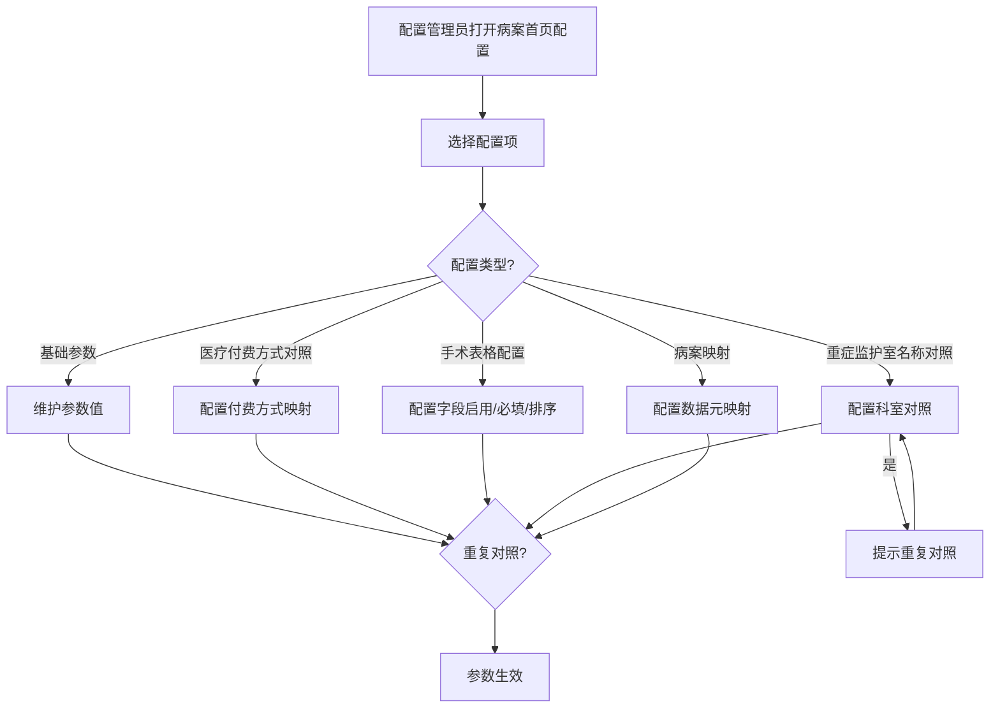
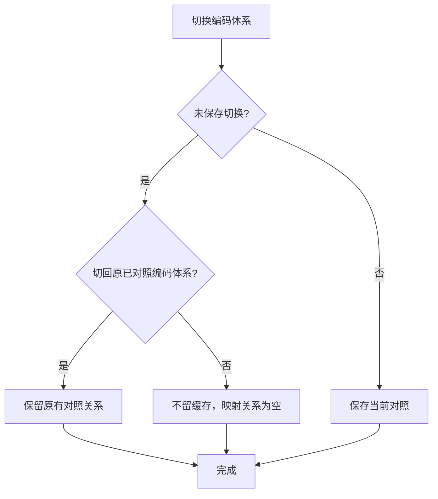

# BLGL-13-BASY-010首页参数与映射配置_ Analyst - Spec

> **需求编号**：BLGL-13-BASY-010
> **父需求**：BLGL-13-BASY
> **关联PM Spec**：BLGL-13-BASY-010_首页参数与映射配置_PM-spec.md
> **Spec版本**：V1.0
> **编写时间**：2026-08-13
> **编写人**：需求分析师

---

## 一、功能编号体系

### 1.1 功能层级结构

```
BLGL-13-BASY-010: 首页参数与映射配置
  ├─ BLGL-13-BASY-010-01: 首页基础配置/基本参数配置
  ├─ BLGL-13-BASY-010-02: 医疗付费方式对照配置
  ├─ BLGL-13-BASY-010-03: 手术表格配置/中医治疗性操作配置
  ├─ BLGL-13-BASY-010-04: 重症监护室名称对照配置
  ├─ BLGL-13-BASY-010-05: 病案映射配置
  └─ BLGL-13-BASY-010-06: 病案项目对照
```

### 1.2 功能编号表

| REQ-ID | 功能名称 | 类型 | 优先级 | 说明 |
|--------|---------|------|--------|------|
| BLGL-13-BASY-010-01 | 首页基础配置/基本参数配置 | 功能 | P0 | 首页行为参数配置 |
| BLGL-13-BASY-010-02 | 医疗付费方式对照配置 | 功能 | P0 | 付费方式编码对照 |
| BLGL-13-BASY-010-03 | 手术表格配置/中医治疗性操作配置 | 功能 | P1 | 手术字段启用/必填/排序 |
| BLGL-13-BASY-010-04 | 重症监护室名称对照配置 | 功能 | P1 | 院内科室码→重症标准字典 |
| BLGL-13-BASY-010-05 | 病案映射配置 | 功能 | P1 | 首页数据元与病案系统映射 |
| BLGL-13-BASY-010-06 | 病案项目对照 | 功能 | P1 | 费用类别与术语概念对照 |

---

## 二、核心业务流程

### 2.1 首页参数配置流程



### 2.2 付费方式对照切换流程



---

## 三、功能规格说明

### BLGL-13-BASY-010-01: 首页基础配置/基本参数配置

#### 3.1.1 功能概述

病历业务配置-病案首页配置提供基础配置、基本参数配置，控制首页行为。参数包括住院病历是否启用病案首页、门诊诊断是否只显示主诊断、手术信息弹框必填项设置等。

#### 3.1.2 用户角色

| 角色 | 使用场景 | 权限要求 | 操作频率 |
|------|---------|---------|---------|
| 配置管理员 | 维护首页参数 | 病历配置权限 | 低频 |
| 实施人员 | 现场参数配置 | 实施配置权限 | 低频 |

#### 3.1.3 业务流程（Given/When/Then）

##### 主流程（1 个）

**Scenario 1: 首页参数配置**

```gherkin
Given:
  - 配置管理员有病历配置权限

When:
  - 配置管理员打开病历业务配置-病案首页配置-基础配置/基本参数

Then:
  - 可维护首页参数值
  - 参数保存生效
```

##### 异常流程（3 个）

**Scenario 2: 业务异常——参数保存失败**

```gherkin
Given:
  - 参数保存接口异常

When:
  - 配置管理员保存参数

Then:
  - 保存失败提示，参数不生效
```

**Scenario 3: 数据异常——参数值不合法**

```gherkin
Given:
  - 参数值超出取值范围

When:
  - 配置管理员保存参数

Then:
  - 校验提示，不允许保存
```

**Scenario 4: 系统异常——配置服务异常**

```gherkin
Given:
  - 配置服务异常

When:
  - 配置管理员打开配置界面

Then:
  - 配置界面加载失败提示
```

##### 边界流程（2 个）

**Scenario 5: 边界——参数默认值**

```gherkin
Given:
  - 参数未配置

When:
  - 首页加载参数

Then:
  - 按参数默认值处理（如住院病历是否启用病案首页默认否）
```

**Scenario 6: 边界——参数切换保存**

```gherkin
Given:
  - 参数切换配置功能

When:
  - 配置人员切换付费方式

Then:
  - 支持参数切换后保存
```

#### 3.1.5 验收标准

| AC编号 | 验收标准 | 对应REQ-ID | 验证方法 | 验证场景 |
|--------|---------|-----------|---------|---------|
| AC-001 | 首页参数配置保存生效 | BLGL-13-BASY-010-01 | 功能测试 | Scenario 1 |
| AC-002 | 参数未配置时按默认值处理 | BLGL-13-BASY-010-01 | 功能测试 | Scenario 5 |

---

### BLGL-13-BASY-010-02: 医疗付费方式对照配置

#### 3.2.1 功能概述

医疗付费方式对照配置位于通用参数设置-病案首页配置。医疗付费方式获取：医疗付费方式代码概念域(65188)，参保人员类型支持多选。切换"病案首页医疗付费方式编码"选项时不影响各编码类型下已保存的"医疗付费方式"对应内容。

#### 3.2.2 用户角色

| 角色 | 使用场景 | 权限要求 | 操作频率 |
|------|---------|---------|---------|
| 配置管理员 | 维护付费方式对照 | 病历配置权限 | 低频 |
| 病案室人员 | 查看付费方式对照 | 病案查询权限 | 低频 |

#### 3.2.3 业务流程（Given/When/Then）

##### 主流程（1 个）

**Scenario 1: 付费方式对照**

```gherkin
Given:
  - 配置管理员有病历配置权限

When:
  - 配置管理员打开医疗付费方式对照

Then:
  - 维护医疗付费方式编码与内容对照关系
  - 保存后对照关系生效
```

##### 异常流程（3 个）

**Scenario 2: 业务异常——编码切换清空**

```gherkin
Given:
  - 医疗付费方式编码切换

When:
  - 切换编码体系+切换对照类别未保存

Then:
  - 切回原已对照编码体系时保留原有对照关系
```

**Scenario 3: 数据异常——编码切换缓存**

```gherkin
Given:
  - 用体系A切换体系B对照未保存

When:
  - 多次切换后再回到体系B

Then:
  - 不留缓存，进入体系B时映射关系为空
```

**Scenario 4: 系统异常——对照保存失败**

```gherkin
Given:
  - 对照保存接口异常

When:
  - 配置管理员保存对照

Then:
  - 保存失败提示
```

##### 边界流程（2 个）

**Scenario 5: 边界——参保人员类别**

```gherkin
Given:
  - 医疗付费方式新增参保人员类型

When:
  - 首页新建/同步数据

Then:
  - 依据接口返回险种类型获取后台配置关联的医疗付费方式填充
```

**Scenario 6: 边界——医保类型转换**

```gherkin
Given:
  - 医保类型对应患者头像保险类型字段

When:
  - 首页获取医疗付费方式

Then:
  - 按医保类型转换（功能清单 DATA001）
```

#### 3.2.5 验收标准

| AC编号 | 验收标准 | 对应REQ-ID | 验证方法 | 验证场景 |
|--------|---------|-----------|---------|---------|
| AC-001 | 付费方式对照保存生效 | BLGL-13-BASY-010-02 | 功能测试 | Scenario 1 |
| AC-002 | 编码切换保留原对照关系 | BLGL-13-BASY-010-02 | 功能测试 | Scenario 2 |

---

### BLGL-13-BASY-010-03: 手术表格配置/中医治疗性操作配置

#### 3.3.1 功能概述

病案首页配置-手术表格配置：增加表格行定位后拖动排序功能，新增"必填类别"列（多选项，默认全部勾选，不可为空），对应选项值手术操作类别代码概念域（957346）首选。新增列是否只读，控制手术编码/操作编码只读属性。

#### 3.3.2 用户角色

| 角色 | 使用场景 | 权限要求 | 操作频率 |
|------|---------|---------|---------|
| 配置管理员 | 维护手术表格配置 | 病历配置权限 | 低频 |
| 实施人员 | 现场手术配置 | 实施配置权限 | 低频 |

#### 3.3.3 业务流程（Given/When/Then）

##### 主流程（1 个）

**Scenario 1: 手术表格配置**

```gherkin
Given:
  - 配置管理员有病历配置权限

When:
  - 配置管理员打开病案首页配置-手术表格配置

Then:
  - 配置手术字段启用/必填/排序
  - 配置必填类别区分手术类/操作类
  - 配置列是否只读
```

##### 异常流程（3 个）

**Scenario 2: 业务异常——必填类别配置**

```gherkin
Given:
  - 手术表格配置新增必填类别列

When:
  - 配置人员配置必填类别

Then:
  - 先勾选手术弹框需要填写的列，再勾选字段是否必填，并配置必填类别
```

**Scenario 3: 数据异常——只读配置**

```gherkin
Given:
  - 手术表格配置列"是否只读"开启

When:
  - 手术表格此字段填写

Then:
  - 填写框不允许编辑
```

**Scenario 4: 系统异常——配置保存失败**

```gherkin
Given:
  - 手术配置保存接口异常

When:
  - 配置管理员保存

Then:
  - 保存失败提示
```

##### 边界流程（2 个）

**Scenario 5: 边界——手术级别只读**

```gherkin
Given:
  - 参数控制手术级别字段只读

When:
  - 医生填写手术级别

Then:
  - 手术级别只读，禁止手动修改
```

**Scenario 6: 边界——中医治疗性操作配置**

```gherkin
Given:
  - 中医治疗性操作配置

When:
  - 配置人员配置

Then:
  - 中医治疗操作配置增加手术/操作类别字段
```

#### 3.3.5 验收标准

| AC编号 | 验收标准 | 对应REQ-ID | 验证方法 | 验证场景 |
|--------|---------|-----------|---------|---------|
| AC-001 | 手术表格配置保存生效 | BLGL-13-BASY-010-03 | 功能测试 | Scenario 1 |
| AC-002 | 必填类别区分手术类/操作类 | BLGL-13-BASY-010-03 | 功能测试 | Scenario 2 |

---

### BLGL-13-BASY-010-04: 重症监护室名称对照配置

#### 3.4.1 功能概述

病历配置管理-病案首页配置新增tab"重症监护室名称对照"，用于将院内科室码转换为重症科室标准字典。重症监护室名称编码体系：下拉选择型，对应ICU类别代码概念域(65035)下的编码体系。不支持同一科室重复对照，同一现场只支持对应一套编码体系。

#### 3.4.2 用户角色

| 角色 | 使用场景 | 权限要求 | 操作频率 |
|------|---------|---------|---------|
| 配置管理员 | 维护重症监护室名称对照 | 病历配置权限 | 低频 |

#### 3.4.3 业务流程（Given/When/Then）

##### 主流程（1 个）

**Scenario 1: 重症监护室名称对照**

```gherkin
Given:
  - 配置管理员有病历配置权限

When:
  - 配置管理员打开病案首页配置-重症监护室名称对照

Then:
  - 选择重症监护室名称编码体系
  - 配置科室编码/科室名称/重症监护室名称对照
  - 新增与保存对照关系
```

##### 异常流程（3 个）

**Scenario 2: 业务异常——重复对照**

```gherkin
Given:
  - 同一科室已存在对照

When:
  - 配置人员保存对照关系

Then:
  - 提示"XXX科室存在重复对照，请重新对照"
```

**Scenario 3: 数据异常——多编码体系切换**

```gherkin
Given:
  - 同一现场多套编码体系反复切换

When:
  - 配置人员切换编码体系

Then:
  - 后台只保存上套编码体系对应值
```

**Scenario 4: 系统异常——对照保存失败**

```gherkin
Given:
  - 对照保存接口异常

When:
  - 配置人员保存

Then:
  - 保存失败提示
```

##### 边界流程（2 个）

**Scenario 5: 边界——科室编码自动生成**

```gherkin
Given:
  - 配置科室名称

When:
  - 配置人员选择科室名称

Then:
  - 科室编码自动生成（只读状态，）
```

**Scenario 6: 边界——重症监护室名称对照应用**

```gherkin
Given:
  - 重症监护室名称对照已配置

When:
  - 首页获取重症信息

Then:
  - 填充对照后的标准名称（399337111，）
```

#### 3.4.5 验收标准

| AC编号 | 验收标准 | 对应REQ-ID | 验证方法 | 验证场景 |
|--------|---------|-----------|---------|---------|
| AC-001 | 重症监护室名称对照保存生效 | BLGL-13-BASY-010-04 | 功能测试 | Scenario 1 |
| AC-002 | 同一科室重复对照时提示 | BLGL-13-BASY-010-04 | 功能测试 | Scenario 2 |

---

### BLGL-13-BASY-010-05: 病案映射配置

#### 3.5.1 功能概述

病案映射配置（定义态）支持新增/修改病案映射、批量删除、分页查询医生病案映射、导入病案映射、导出模板、分页查询病案系统首页元素查询、刷新病案映射。

#### 3.5.2 用户角色

| 角色 | 使用场景 | 权限要求 | 操作频率 |
|------|---------|---------|---------|
| 配置管理员 | 维护病案映射 | 病历配置权限 | 低频 |
| 实施人员 | 现场病案映射配置 | 实施配置权限 | 低频 |

#### 3.5.3 业务流程（Given/When/Then）

##### 主流程（1 个）

**Scenario 1: 病案映射配置**

```gherkin
Given:
  - 配置管理员有病历配置权限

When:
  - 配置管理员打开病案映射配置

Then:
  - 新增/修改病案映射
  - 支持导入/导出模板
  - 刷新病案映射
```

##### 异常流程（3 个）

**Scenario 2: 业务异常——病案映射缺失**

```gherkin
Given:
  - 首页数据元未映射病案系统元素

When:
  - 首页数据上报

Then:
  - 映射缺失提示
```

**Scenario 3: 数据异常——映射导入失败**

```gherkin
Given:
  - 病案映射导入数据格式错误

When:
  - 配置人员导入

Then:
  - 导入失败提示
```

**Scenario 4: 系统异常——映射刷新失败**

```gherkin
Given:
  - 刷新病案映射接口异常

When:
  - 配置人员刷新

Then:
  - 刷新失败提示
```

##### 边界流程（2 个）

**Scenario 5: 边界——字典对照优化**

```gherkin
Given:
  - 病案首页模板使用的数据元

When:
  - 病案系统字典对照

Then:
  - 电子病历提供数据元元素查询接口
```

**Scenario 6: 边界——字段映射查询**

```gherkin
Given:
  - 病案映射配置

When:
  - 配置人员查询

Then:
  - 支持分页查询医生病案映射
```

#### 3.5.5 验收标准

| AC编号 | 验收标准 | 对应REQ-ID | 验证方法 | 验证场景 |
|--------|---------|-----------|---------|---------|
| AC-001 | 病案映射新增/修改保存生效 | BLGL-13-BASY-010-05 | 功能测试 | Scenario 1 |
| AC-002 | 支持导入/导出/刷新病案映射 | BLGL-13-BASY-010-05 | 功能测试 | Scenario 1 |

---

### BLGL-13-BASY-010-06: 病案项目对照

#### 3.6.1 功能概述

按照术语-病案项目对照，将首页需要用到的费用类别启用，并设置对应的概念标识。原则上首页上的费用类别和术语的类别保持一致。病案项目对照需要设置上下级关系。

#### 3.6.2 用户角色

| 角色 | 使用场景 | 权限要求 | 操作频率 |
|------|---------|---------|---------|
| 配置管理员 | 维护病案项目对照 | 病历配置权限 | 低频 |

#### 3.6.3 业务流程（Given/When/Then）

##### 主流程（1 个）

**Scenario 1: 病案项目对照**

```gherkin
Given:
  - 配置管理员有病历配置权限

When:
  - 配置管理员打开病案项目对照

Then:
  - 将首页需要用到的费用类别启用
  - 设置对应概念标识
  - 设置上下级关系
```

##### 异常流程（3 个）

**Scenario 2: 业务异常——费用类别未对照**

```gherkin
Given:
  - 某费用类别未对照

When:
  - 首页获取费用

Then:
  - 该类别不填充
```

**Scenario 3: 数据异常——上下级关系缺失**

```gherkin
Given:
  - 病案项目对照上下级关系未设置

When:
  - 首页费用合计计算

Then:
  - 无法计算上级费用
```

**Scenario 4: 系统异常——对照保存失败**

```gherkin
Given:
  - 对照保存接口异常

When:
  - 配置人员保存

Then:
  - 保存失败提示
```

##### 边界流程（2 个）

**Scenario 5: 边界——上下级合并计算**

```gherkin
Given:
  - 病案项目对照设置上下级关系

When:
  - 首页费用合计计算

Then:
  - 上级费用=本身+所有下级总和
```

**Scenario 6: 边界——费用类别启用**

```gherkin
Given:
  - 病案项目对照

When:
  - 配置人员启用费用类别

Then:
  - 启用后首页费用可获取
```

#### 3.6.5 验收标准

| AC编号 | 验收标准 | 对应REQ-ID | 验证方法 | 验证场景 |
|--------|---------|-----------|---------|---------|
| AC-001 | 病案项目对照保存生效 | BLGL-13-BASY-010-06 | 功能测试 | Scenario 1 |
| AC-002 | 上下级关系支持费用合计计算 | BLGL-13-BASY-010-06 | 功能测试 | Scenario 5 |

---

## 四、排除范围

本需求不包含以下功能项：

1. **首页模板配置管理** - 归属 BLGL-12-MBGL
2. **各功能点的业务逻辑（诊断/手术/费用/重症）** - 归属 BLGL-13-BASY-003~006
3. **病案系统对接的字典对照** - 归属 BLGL-13-BASY-008

---

## 五、业务规则清单

| 规则ID | 规则名称 | 规则描述 | 来源 | 优先级 |
|--------|---------|---------|------|--------|
| BR-001 | 参数驱动首页 | 首页行为由病案首页配置参数驱动 | 功能清单参数表 | P0 |
| BR-002 | 付费方式编码切换 | 切换编码体系不影响各编码类型下已保存对照 | | P0 |
| BR-003 | 手术必填类别 | 手术表格配置必填类别区分手术类/操作类 | | P1 |
| BR-004 | 重症对照唯一 | 同一科室不可重复对照，同一现场一套编码体系 | | P1 |
| BR-005 | 病案项目对照 | 首页费用类别与术语概念对照，设置上下级关系 | 功能清单 DATA032 | P1 |
| BR-006 | 手术列只读 | 手术表格配置列只读后填写框不允许编辑 | | P1 |

---

## 六、关联文档

| 文档类型 | 文档路径 | 说明 |
|---------|---------|------|
| PM-Spec（业务视角） | 本目录 BLGL-13-BASY-010_首页参数与映射配置_PM-spec.md（V0.1） | PM 产出的 Spec 文档 |
| Spec（研发视角） | 本目录 BLGL-13-BASY-010_首页参数与映射配置-Spec.md（V1.0） | 业务背景与目标 Spec |
| 功能点Spec（模块级） | BLGL-13-BASY 13病案首页功能点Spec.md（V1.0，上级目录） | Phase 1 功能点索引 |
| data-model.md | 待产出 | 架构师产出的数据建模文档 |
| design.md | 待产出 | 架构师产出的技术方案文档 |
| api-contract.md | 待产出 | 开发经理产出的 API 契约文档 |

---

## 七、待确认问题清单

| 编号 | 问题描述 | 缺失信息 | 影响范围 | 建议补充方 |
|------|---------|---------|---------|-----------|
| Q-001 | 配置接口返回结构具体字段 | 接口契约 | 接口详细设计 | 开发经理 |
| Q-002 | 参数保存性能指标 | 性能指标 | 非功能性要求 | 产品经理 |
| Q-003 | 完整参数清单 | 参数配置 | 基础参数配置 | 模块负责人 |
| Q-004 | 病案映射完整映射关系 | 数据映射 | 病案映射配置 | 模块负责人 |

---

## 填写检查清单

| 序号 | 检查项 | 是否完成 |
|:----:|--------|:--------:|
| 1 | 功能编号带父子层级 | ✅ |
| 2 | 每个 REQ-ID 有功能概述和用户角色 | ✅ |
| 3 | 主流程至少 1 个 Given/When/Then 场景 | ✅ |
| 4 | 异常流程至少 3 个 Given/When/Then 场景 | ✅ |
| 5 | 边界流程至少 2 个 Given/When/Then 场景 | ✅ |
| 6 | 每个 Given/When/Then 内容具体，不模糊 | ✅ |
| 7 | 数据字段定义完整（字段名、类型、必填、说明、概念ID） | ✅ |
| 8 | 验收标准 AC 编号独立，可验证 | ✅ |
| 9 | 验收标准无"功能正常"等模糊表述 | ✅ |
| 10 | 排除范围明确列出 | ✅ |
| 11 | 业务规则清单列出所有规则，每条标注来源 | ✅ |
| 12 | 流程图使用 Mermaid 格式（≥2 个） | ✅ |
| 13 | 关联文档索引包含 Phase 1 功能点Spec | ✅ |
| 14 | 待确认问题清单汇总了全文所有 ⏳ 项 | ✅ |
| 15 | 全文无占位符 `< >` 残留 | ✅ |
| 16 | 全文陈述可溯源至资料区（S1~S10 溯源核查） | ✅ |
| 17 | 人工审核确认完成 | ⏳ 待确认 |

---

**文档状态**：⬜ 待审核
**维护责任**：需求分析师规范组
**下次更新**：根据评审反馈优化

---

## 版本历史

| 版本 | 日期 | 变更说明 | 编写人 |
|------|------|---------|--------|
| V1.0 | 2026-08-13 | 初始版本 | 需求分析师 |
