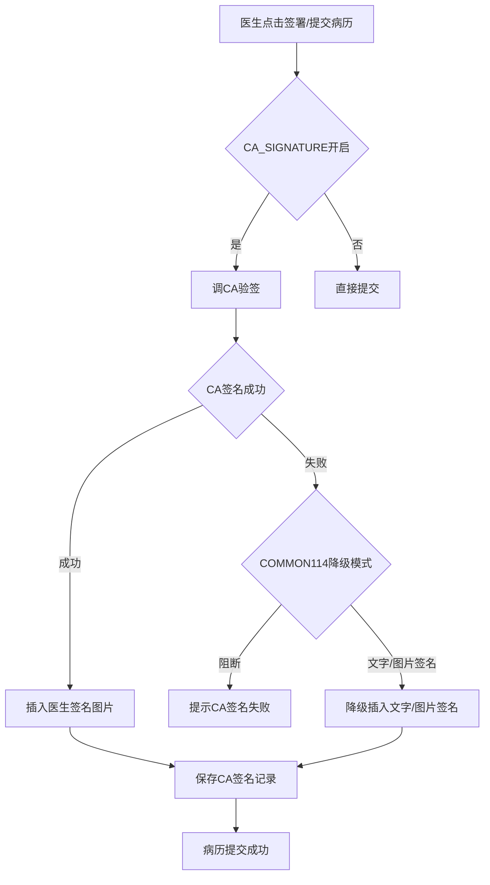
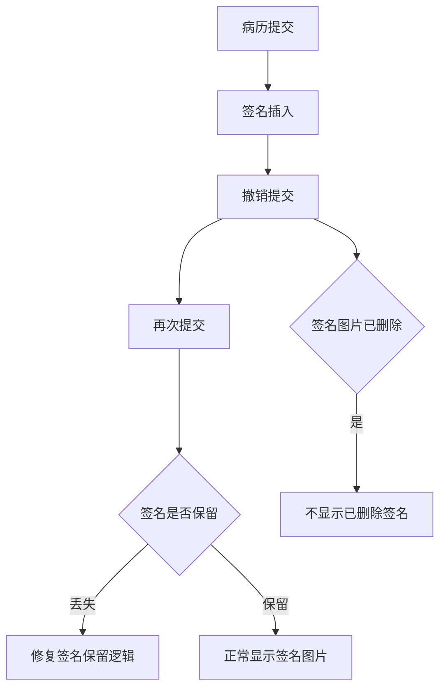

# BLGL-15-QM-001 医生CA签名 _ Analyst - Spec

> **需求编号**：BLGL-15-QM-001
> **父需求**：BLGL-15-QM
> **关联PM Spec**：BLGL-15-QM-001_医生CA签名_PM-spec.md
> **Spec版本**：V1.0
> **编写时间**：2026-08-15
> **编写人**：需求分析师

---

## 一、功能编号体系

#

## 1.1 功能层级结构

```
BLGL-15-QM-001-001: 医生签名执行
  ├─ BLGL-15-QM-001-001-01: 病历提交/审签CA验签
  ├─ BLGL-15-QM-001-001-02: 签名图片插入
  └─ BLGL-15-QM-001-001-03: CA签名记录保存

BLGL-15-QM-001-002: 签名丢失修复
  ├─ BLGL-15-QM-001-002-01: 撤销提交再提交签名保留
  └─ BLGL-15-QM-001-002-02: 签名图片已删除不显示

BLGL-15-QM-001-003: 签名降级
  ├─ BLGL-15-QM-001-003-01: COMMON114 降级模式
  └─ BLGL-15-QM-001-003-02: 文字/图片签名

BLGL-15-QM-001-004: 签名顺序
  └─ BLGL-15-QM-001-004-01: 双签名顺序/加签顺序

BLGL-15-QM-001-005: 签名数据回传
  └─ BLGL-15-QM-001-005-01: CA签署传xml给ca中心
```

#

## 1.2 功能编号表

| REQ-ID | 功能名称 | 类型 | 优先级 | 说明 |
|

----

----|

----

-----|

------|

----

----|

------|
| BLGL-15-QM-001-001 | 医生签名执行 | 功能 | P0 | 病历提交/审签CA验签|
| BLGL-15-QM-001-001-01 | 病历提交/审签CA验签 | 子功能 | P0 | 调CA验签|
| BLGL-15-QM-001-001-02 | 签名图片插入 | 子功能 | P0 | 插入医生签名图片|
| BLGL-15-QM-001-001-03 | CA签名记录保存 | 子功能 | P0 | 保存CA签名记录|
| BLGL-15-QM-001-002 | 签名丢失修复 | 功能 | P0 | 签名丢失修复|
| BLGL-15-QM-001-002-01 | 撤销提交再提交签名保留 | 子功能 | P0 | 签名不丢失|
| BLGL-15-QM-001-002-02 | 签名图片已删除不显示 | 子功能 | P1 | 不显示已删除签名|
| BLGL-15-QM-001-003 | 签名降级 | 功能 | P0 | CA失败降级|
| BLGL-15-QM-001-003-01 | COMMON114 降级模式 | 子功能 | P0 | 不阻断流程插入文字图片|
| BLGL-15-QM-001-003-02 | 文字/图片签名 | 子功能 | P1 | 降级为文字/图片签名|
| BLGL-15-QM-001-004 | 签名顺序 | 功能 | P1 | 双签名顺序|
| BLGL-15-QM-001-004-01 | 双签名顺序/加签顺序 | 子功能 | P1 | 顺序不颠倒|
| BLGL-15-QM-001-005 | 签名数据回传 | 功能 | P1 | 传xml给ca中心|
| BLGL-15-QM-001-005-01 | CA签署传xml给ca中心 | 子功能 | P1 | 病历签署/审签时传|

---

## 二、核心业务流程

#

## 2.1 医生CA签名主流程



#

## 2.2 签名丢失修复流程



---

## 三、功能规格说明

### BLGL-15-QM-001-001: 医生签名执行

#

#

## 3.1.1 功能概述

病历提交/审签时调CA验签插入医生签名图片，保存CA签名记录。病历签署、审签时调签名接口验证CA。病历签署时读取工号信息需与统一配置中员工信息一致。启用 CA 时展示图片签名，不启用 CA 签名时只展示普通宋体文字签名。

#

#

## 3.1.2 用户角色

| 角色 | 使用场景 | 权限要求 | 操作频率 |
|

------|

----

-----|

----

-----|

----

-----|
| 住院医生 | 病历提交/审签时签名 | 病历书写权限 | 高频 |
| 上级医师 | 上级审签/加签 | 上级审签权限 | 中频 |

#

#

## 3.1.3 业务流程（Given/When/Then）

**Scenario 1: 医生CA签名（主流程）**

```gherkin
Given:
  - 医生已完成病历书写
  - 参数 CA_SIGNATURE 开启

When:
  - 医生点击签署/提交病历

Then:
  - 触发CA签名流程（调CA验签）
  - 签名成功插入医生签名图片
  - 保存CA签名记录
  - 病历提交成功
```

**Scenario 2: 签名图片插入**

```gherkin
Given:
  - 参数 CA_SIGNATURE 开启

When:
  - 医生签名

Then:
  - 展示图片签名
  - 不启用CA签名时只展示普通宋体文字签名
```

**Scenario 3: 数据异常——签名丢失**

```gherkin
Given:
  - 病历提交后/撤销提交后

When:
  - 查看病历签名

Then:
  - 医生签名丢失（问题）
  - 需修复签名保留逻辑
```

#

#

## 3.1.4 数据字段定义

| 字段名 | 类型 | 必填 | 默认值 | 取值范围 | 说明 | 概念ID |
|

----

----|

------|

------|

----

----|

----

-----|

------|

----

----|
| inpEmrSetId | Long | 是 | - | - | 病历集ID| ⏳ 待确认 |
| submitBy | Long | 是 | - | - | 提交人（SUBMIT_BY，来源：代码 INP_EMR_CA_SIGNATURE_RECORD） | ⏳ 待确认 |
| caSignatureId | String | 是 | - | - | CA签名流水号（CA_SIGNATURE_ID，来源：代码） | ⏳ 待确认 |
| caSuccessFlag | Long | 是 | - | 1成功/0失败 | CA签名成功标志（CA_SUCCESS_FLAG，来源：代码） | ⏳ 待确认 |
| caActionCode | Long | 是 | - | - | CA操作编码（CA_ACTION_CODE，来源：代码） | ⏳ 待确认 |
| signUrl | String | 否 | - | - | 签名图片地址（SIGNATURE_URL，来源：代码 INP_EMR_SET_ESIGN） | ⏳ 待确认 |

#

#

## 3.1.5 验收标准

| AC编号 | 验收标准 | 对应REQ-ID | 验证方法 | 验证场景 |
|

----

----|

----

-----|

----

----

---|

----

-----|

----

-----|
| AC-001 | 病历提交/审签时调CA验签插入签名图片，保存CA签名记录 | BLGL-15-QM-001-001 | 功能测试 | Scenario 1 |
| AC-002 | 启用CA展示图片签名，不启用展示文字签名 | BLGL-15-QM-001-001 | 功能测试 | Scenario 2 |

---

### BLGL-15-QM-001-002: 签名丢失修复

#

#

## 3.2.1 功能概述

病程记录撤销提交，再次提交后未显示医师签名图片（问题需修复）；病历提交后医生签名丢失（问题需修复）；重儿生产环境偶发医生提交签名后医生签名信息丢失。医生签名图片已被删除，但提交病历时还显示签名图片（需修复，来源：需求）。

#

#

## 3.2.2 用户角色

| 角色 | 使用场景 | 权限要求 | 操作频率 |
|

------|

----

-----|

----

-----|

----

-----|
| 住院医生 | 病历提交/撤销提交 | 病历书写权限 | 高频 |

#

#

## 3.2.3 业务流程（Given/When/Then）

**Scenario 1: 撤销提交再提交签名保留（主流程）**

```gherkin
Given:
  - 病历已签名并提交

When:
  - 撤销提交
  - 再次提交

Then:
  - 医生签名保留不丢失
  - 再次提交后正常显示签名图片
```

**Scenario 2: 异常——签名丢失**

```gherkin
Given:
  - 病历提交后/撤销提交后

When:
  - 查看病历签名

Then:
  - 医生签名丢失（问题）
  - 需修复签名保留逻辑
```

**Scenario 3: 签名图片已删除**

```gherkin
Given:
  - 医生签名图片已被删除

When:
  - 提交病历

Then:
  - 不显示已删除的签名图片
```

#

#

## 3.2.4 数据字段定义

| ⏳ 待确认 | 签名丢失修复无独立数据字段 | 依赖 INP_EMR_SET_ESIGN 签名记录 |

#

#

## 3.2.5 验收标准

| AC编号 | 验收标准 | 对应REQ-ID | 验证方法 | 验证场景 |
|

----

----|

----

-----|

----

----

---|

----

-----|

----

-----|
| AC-003 | 撤销提交再提交后签名保留不丢失 | BLGL-15-QM-001-002 | 功能测试 | Scenario 1 |
| AC-004 | 签名图片已删除时不显示 | BLGL-15-QM-001-002 | 功能测试 | Scenario 3 |

---

### BLGL-15-QM-001-003: 签名降级

#

#

## 3.3.1 功能概述

住院病历新增签名方式：未调用到 ca 的话签署文字，不生成图片。参数 COMMON114"CA签名的UKEY失效或停用时采用的签名模式"增加下拉值"不阻断流程并插入医生姓名文字"。值设置为该选项时，CA签名失败后不阻断流程，直接在签名位置插入当前医生的姓名文字即可。CA失败模式 caFailedMode：1阻断/2图片签名/3文字图片签名/4医生姓名文字签名。

#

#

## 3.3.2 用户角色

| 角色 | 使用场景 | 权限要求 | 操作频率 |
|

------|

----

-----|

----

-----|

----

-----|
| 住院医生 | CA签名失败时签名 | 病历书写权限 | 中频 |

#

#

## 3.3.3 业务流程（Given/When/Then）

**Scenario 1: 签名降级（主流程）**

```gherkin
Given:
  - 参数 COMMON114 配置"不阻断流程并插入医生姓名文字"

When:
  - CA签名失败

Then:
  - 不阻断流程
  - 直接在签名位置插入当前医生的姓名文字
  - 不生成签名图片
```

**Scenario 2: 边界——图片签名降级**

```gherkin
Given:
  - 参数 COMMON114 配置降级为图片签名

When:
  - CA签名失败

Then:
  - 降级插入图片签名
```

#

#

## 3.3.4 数据字段定义

| 字段名 | 类型 | 必填 | 默认值 | 取值范围 | 说明 | 概念ID |
|

----

----|

------|

------|

----

----|

----

-----|

------|

----

----|
| CA签名的UKEY失效或停用时采用的签名模式 | String | 否 | - | 阻断/图片签名/文字图片签名/医生姓名文字签名 | COMMON114| ⏳ 待确认 |
| caFailedMode | Integer | 否 | - | 1阻断/2图片/3文字图片/4医生姓名文字 | CA失败模式| ⏳ 待确认 |

#

#

## 3.3.5 验收标准

| AC编号 | 验收标准 | 对应REQ-ID | 验证方法 | 验证场景 |
|

----

----|

----

-----|

----

----

---|

----

-----|

----

-----|
| AC-005 | CA签名失败按 COMMON114 降级为文字/图片签名，不阻断流程 | BLGL-15-QM-001-003 | 功能测试 | Scenario 1/2 |

---

### BLGL-15-QM-001-004: 签名顺序

#

#

## 3.4.1 功能概述

副主任医师查房病历那边，点击签名控件进行签名之后点击提交，控件中的双签名顺序会颠倒（问题需修复）。手术同意书上级医师加签后生成的 PDF 无签名信息（问题需修复）。

#

#

## 3.4.2 用户角色

| 角色 | 使用场景 | 权限要求 | 操作频率 |
|

------|

----

-----|

----

-----|

----

-----|
| 副主任医师 | 查房病历签名 | 副主任医师权限 | 中频 |
| 上级医师 | 加签 | 上级医师权限 | 中频 |

#

#

## 3.4.3 业务流程（Given/When/Then）

**Scenario 1: 双签名顺序（主流程）**

```gherkin
Given:
  - 副主任医师查房病历点击签名控件签名

When:
  - 点击提交

Then:
  - 双签名顺序不能颠倒
```

**Scenario 2: 上级医师加签**

```gherkin
Given:
  - 手术同意书上级医师加签

When:
  - 生成 PDF

Then:
  - PDF 中签名信息完整
```

#

#

## 3.4.4 数据字段定义

| ⏳ 待确认 | 签名顺序无独立数据字段 | 依赖签名记录顺序 |

#

#

## 3.4.5 验收标准

| AC编号 | 验收标准 | 对应REQ-ID | 验证方法 | 验证场景 |
|

----

----|

----

-----|

----

----

---|

----

-----|

----

-----|
| AC-006 | 双签名顺序不颠倒，上级医师加签签名完整 | BLGL-15-QM-001-004 | 功能测试 | Scenario 1/2 |

---

### BLGL-15-QM-001-005: 签名数据回传

#

#

## 3.5.1 功能概述

病历签署、病历审核时，调签名接口验证CA时，传病历 xml 内容给 ca 中心。

#

#

## 3.5.2 用户角色

| 角色 | 使用场景 | 权限要求 | 操作频率 |
|

------|

----

-----|

----

-----|

----

-----|
| 住院医生 | 病历签署/审签 | 病历书写权限 | 高频 |

#

#

## 3.5.3 业务流程（Given/When/Then）

**Scenario 1: CA签署传xml（主流程）**

```gherkin
Given:
  - 病历签署/审签

When:
  - 调签名接口验证CA

Then:
  - 传病历 xml 内容给 ca 中心
```

#

#

## 3.5.4 数据字段定义

| 字段名 | 类型 | 必填 | 默认值 | 取值范围 | 说明 | 概念ID |
|

----

----|

------|

------|

----

----|

----

-----|

------|

----

----|
| 病历xml内容 | String | 是 | - | - | 传给ca中心| ⏳ 待确认 |

#

#

## 3.5.5 验收标准

| AC编号 | 验收标准 | 对应REQ-ID | 验证方法 | 验证场景 |
|

----

----|

----

-----|

----

----

---|

----

-----|

----

-----|
| AC-007 | 病历签署/审签时传病历 xml 内容给 ca 中心 | BLGL-15-QM-001-005 | 集成测试 | Scenario 1 |

---

## 四、排除范围

本需求不包含以下功能项：

1. **患者签名**（有线/无线手写板）—— BLGL-15-QM-002
2. **多人代理人签名** —— BLGL-15-QM-003
3. **CA接口对接**（信手书/北京CA）—— BLGL-15-QM-004
4. **CA签名配置与方式** —— BLGL-15-QM-005
5. **签名图片与PDF处理** —— BLGL-15-QM-006
6. **CA校验与签名流程** —— BLGL-15-QM-007

---

## 五、业务规则清单

| 规则ID | 规则名称 | 规则描述 | 优先级 |
|

----

----|

----

-----|

----

-----|

------|

----

----|
| BR-001 | 医生签名 | 病历提交/审签时调CA验签插入签名图片，保存CA签名记录 | 需求代码 | P0 |
| BR-002 | 签名降级 | CA签名失败按 COMMON114 配置降级为文字/图片签名，不阻断流程 | P0 |
| BR-003 | 签名展示 | 启用CA展示图片签名，不启用展示普通宋体文字签名 | P0 |
| BR-004 | 传xml给ca | 病历签署/审签时调签名接口验证CA时传病历 xml 内容给 ca 中心 | P1 |
| BR-005 | 签名保留 | 撤销提交再提交后签名保留不丢失 | P0 |
| BR-006 | CA失败模式 | caFailedMode：1阻断/2图片签名/3文字图片签名/4医生姓名文字签名 | 代码caAction.js | P0 |

---

## 六、关联文档

| 文档类型 | 文档路径 | 说明 |
|

----

-----|

----

-----|

------|
| 功能点Spec | BLGL-15-QM CA签名功能点Spec.md（V1.0，上级目录） | Phase 1 功能点索引 |
| PM spec | 本目录 BLGL-15-QM-001_医生CA签名_PM-spec.md（V0.1） | PM 产出的 Spec 文档 |
| -Spec | 本目录 BLGL-15-QM-001_医生CA签名_Spec.md（V1.0） | 业务背景与目标 Spec |
| data-model.md | 待产出 | 架构师产出的数据建模文档 |
| design.md | 待产出 | 架构师产出的技术方案文档 |
| api-contract.md | 待产出 | 开发经理产出的 API 契约文档 |

---

## 七、待确认问题清单

| 编号 | 问题描述 | 缺失信息 | 影响范围 | 建议补充方 |
|

------|

----

-----|

----

-----|

----

-----|

----

----

---|
| Q-001 | CA签名保存接口（InpatEmrCaSignatureRecordAO）完整字段 | API 契约 | -Spec 第5章 | 开发经理 |
| Q-002 | CA签名参数（CA_SIGNATURE/COMMON071/COMMON114）概念 ID | 概念ID | 3.1.4 | 产品经理 |
| Q-003 | 签名丢失根因 | 需求分析原文缺失 | 3.2.3 | 开发经理 |
| Q-004 | 签名图片已删除仍显示根因 | 需求分析原文缺失 | 3.2.3 | 开发经理 |
| Q-005 | 性能指标（医生签名响应时间） | 资料区无量化指标 | -Spec 第8章 | 产品经理 |

---

## 填写检查清单

| 序号 | 检查项 | 是否完成 |
|:

----:|

----

----|:

----

----:|
| 1 | 功能编号带父子层级 | ✅ |
| 2 | 每个 REQ-ID 有功能概述和用户角色 | ✅ |
| 3 | 主流程至少 1 个 Given/When/Then 场景 | ✅ |
| 4 | 异常流程至少 3 个 Given/When/Then 场景 | ✅ |
| 5 | 边界流程至少 2 个 Given/When/Then 场景 | ✅ |
| 6 | 每个 Given/When/Then 内容具体，不模糊 | ✅ |
| 7 | 数据字段定义完整（字段名、类型、必填、说明、概念ID） | ✅ |
| 8 | 验收标准 AC 编号独立，可验证 | ✅ |
| 9 | 验收标准无"功能正常"等模糊表述 | ✅ |
| 10 | 排除范围明确列出 | ✅ |
| 11 | 业务规则清单列出所有规则，每条标注来源 | ✅ |
| 12 | 流程图使用 Mermaid 格式（≥2 个） | ✅ |
| 13 | 关联文档索引包含 Phase 1 功能点Spec | ✅ |
| 14 | 待确认问题清单汇总了全文所有 ⏳ 项 | ✅ |
| 15 | 全文无占位符 `< >` 残留 | ✅ |
| 16 | 全文陈述可溯源至资料区（S1~S10 溯源核查） | ✅ |
| 17 | 人工审核确认完成 | ⏳ 待确认 |

---

**文档状态**：⬜ 待审核
**维护责任**：需求分析师规范组
**下次更新**：根据评审反馈优化

---

## 版本历史

| 版本 | 日期 | 变更说明 | 编写人 |
|

------|

------|

----

-----|

----

----|
| V1.0 | 2026-08-15 | 初始版本 | 需求分析师 |
