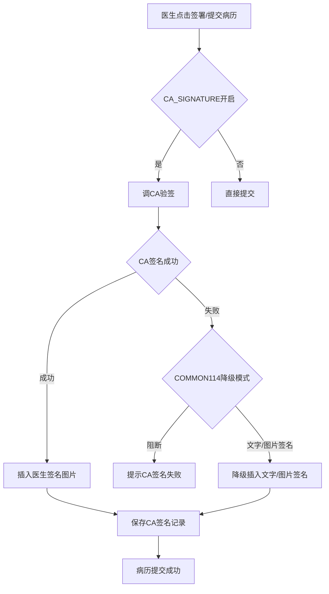
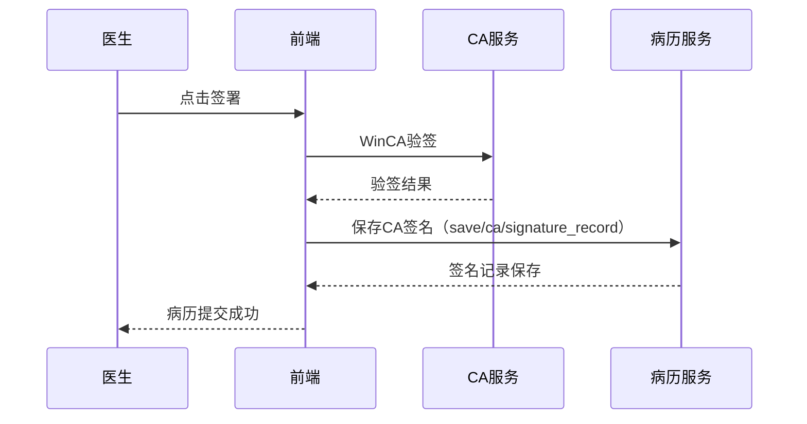

# BLGL-15-QM-001 医生CA签名 - Spec

> **功能编号**：BLGL-15-QM-001
> **文档类型**：功能Spec（业务背景与设计）
> **文档版本**：V1.0
> **编写时间**：2026-08-15
> **编写人**：RACC

---

## 文档索引

#

### 章节索引

**本文档（功能Spec：业务背景与设计）**

| 章节号 | 章节名称 | 内容说明 |
|

----

----|

----

-----|

----

-----|
| 第1章 | 文档概述 | 文档目的、文档范围、术语定义、阅读指南、参考文档 |
| 第2章 | 功能背景与定位 | 功能背景、功能定位、目标用户、核心价值 |
| 第3章 | 业务流程设计 | 主流程/异常流程/边界流程（Given/When/Then） |
| 第4章 | 数据模型设计 | 核心数据结构、状态定义、系统参数定义 |
| 第5章 | 接口契约设计 | API列表、接口详细设计、错误码定义 |
| 第6章 | 技术方案设计 | 页面路径、技术栈、关键技术点、部署方案 |
| 第7章 | 测试用例预设计 | 功能/边界/异常/性能测试用例 |
| 第8章 | 非功能性要求 | 性能、安全、可用性、兼容性 |
| 第9章 | 依赖与风险 | 外部依赖、风险项 |
| 第10章 | 附录 | 流程图、时序图、参考文档 |

**PM-Spec（需求规格）**：目标/约束/验收标准/排除范围/关键决策/优先级
**Analyst-Spec（分析规格）**：功能编号体系/核心业务流程/功能规格/排除范围/业务规则/关联文档/待确认问题

#

### 版本历史

| 版本 | 日期 | 变更说明 | 编写人 |
|

------|

------|

----

-----|

----

----|
| V1.0 | 2026-08-15 | 初始版本 | RACC |

#

### 关联文档索引

| 序号 | 文档名称 | 文档类型 | 版本 | 位置 |
|

------|

----

-----|

----

-----|

------|

------|
| 1 | BLGL-15-QM-001_医生CA签名_Spec.md | 功能Spec（业务背景与设计）（本文档） | V1.0 | 本目录 |
| 2 | BLGL-15-QM-001_医生CA签名_PM-spec.md | PM-Spec（需求规格） | V0.1 | 本目录 |
| 3 | BLGL-15-QM-001_医生CA签名_Analyst-spec.md | Analyst-Spec（分析规格） | V1.0 | 本目录 |
| 4 | BLGL-15-QM CA签名功能点Spec.md | 功能点Spec（模块级） | V1.0 | 上级目录 |

---

## 1、文档概述

#

## 1.1、文档目的

本文档旨在明确"医生CA签名"功能（BLGL-15-QM-001）的业务背景与设计方案，为需求分析、研发实现、测试验收及评审提供统一的业务上下文、设计口径与决策依据。

**具体目的包括**：

1. 梳理医生CA签名功能的业务由来与历史需求演进脉络，说明"为什么要做"；
2. 明确功能的定位边界、目标用户与核心价值，回答"做成什么"；
3. 描述功能的业务流程、数据模型、接口契约与技术方案，回答"怎么做"；
4. 预设计测试用例并明确非功能性要求、依赖与风险，为研发与验收提供依据；
5. 作为 Analyst-Spec 的业务前提与设计输入，保证各层文档业务口径一致。

#

## 1.2、文档范围

#

#

## 1.2.1 纳入范围

本文档覆盖医生CA签名的完整业务背景与设计，包括：

- 医生签名流程：病历提交/审签时调CA验签插入签名图片- 签名丢失修复：提交/撤销提交/再提交后签名丢失修复- 签名顺序：双签名顺序颠倒、上级医师加签签名顺序- 签名降级：CA签名失败降级文字/图片签名- 签名数据回传：CA签署传xml内容给ca中心- 规培医生签名：规培医生书写病历需要签名#

#

## 1.2.2 排除范围

本文档不涉及以下内容（详见其他功能点或模块）：

- 患者签名（有线/无线手写板）—— BLGL-15-QM-002
- 多人代理人签名 —— BLGL-15-QM-003
- CA接口对接—— BLGL-15-QM-004
- CA签名配置与方式 —— BLGL-15-QM-005
- 签名图片与PDF处理 —— BLGL-15-QM-006
- CA校验与签名流程 —— BLGL-15-QM-007

#

## 1.3、术语定义

| 术语 | 定义 |
|

------|

------|
| 医生CA签名 | 病历提交/审签时通过CA验签插入医生签名图片|
| 签名降级 | CA签名失败时按 COMMON114 配置降级为图片/文字签名|
| caFailedMode | CA失败模式：1阻断/2图片签名/3文字图片签名/4医生姓名文字签名|

#

## 1.4、阅读指南


- **章节关系**：第1~2章为业务全貌，第3~10章为设计实现层。与 Analyst-Spec、PM-Spec 互相引用保持一致。

- **读者对象**：产品经理/需求分析师读第1~2章；研发读第3~6、9~10章；测试读第3、7~8章；评审人员核对各层一致性。

#

## 1.5、参考文档

| 序号 | 文档名称 | 版本/日期 |
|

------|

----

-----|

----

------|
| 1 | 【历史需求】住院病历的历史需求.xlsx | - |
| 2 | BLGL-15-QM-001_医生CA签名_PM-spec.md | V0.1 |
| 3 | BLGL-15-QM-001_医生CA签名_Analyst-spec.md | V1.0 |
| 4 | BLGL-15-QM CA签名功能点Spec.md | V1.0 |

---

## 2、功能背景与定位

#

## 2.1 功能背景

医生CA签名是 CA 签名模块的核心起点（L1），需满足：


- **现状痛点**：病历提交后医生签名丢失；病程记录撤销提交再次提交后未显示医师签名图片；签名图片已被删除但提交病历时还显示签名图片
- **管理要求**：住院病历签署、签署验证CA时应传病历 xml 内容给 ca 中心；启用 CA 时展示图片签名，不启用 CA 签名时只展示普通宋体文字签名
- **历史需求演进**：医生签名流程→ 签名丢失修复→ 签名降级文字→ CA 签署传 xml→ 非 CA 登录不提醒

#

## 2.2 功能定位

"医生CA签名"是 WiNEX 病历管理-CA签名的核心起点，定位为：


- **签名执行**：病历提交/审签时调CA验签插入签名图片
- **签名降级**：CA签名失败降级图片/文字签名
- **签名可溯**：CA签名记录、签名图片获取

#

## 2.3 目标用户

| 用户角色 | 主要使用场景 |
|

----

-----|

----

----

-----|
| 住院医生 | 病历提交/审签时签名 |
| 上级医师 | 上级审签/加签 |
| 规培医生 | 规培生书写病历需要签名|
| 护士 | 护理文书协同签名 |

#

## 2.4 核心价值

| 价值维度 | 价值描述 |
|

----

-----|

----

-----|
| 法律效力 | 医生CA签名保证病历电子文书法律效力|
| 签名稳定 | 签名丢失修复，撤销提交再提交签名保留|
| 降级兼容 | CA失败降级文字签名，不阻断流程|

---

## 3、业务流程设计（Given/When/Then）

#

## 3.1 主流程

**Scenario 1: 医生CA签名**

```gherkin
Given:
  - 医生已完成病历书写
  - 病历状态可提交
  - 参数 CA_SIGNATURE 开启

When:
  - 医生点击签署/提交病历

Then:
  - 触发CA签名流程（调CA验签）
  - 签名成功插入医生签名图片
  - 保存CA签名记录（INP_EMR_CA_SIGNATURE_RECORD）
  - 病历提交成功
```

#

## 3.2 异常流程

**Scenario 2: 业务异常——CA签名失败降级**

```gherkin
Given:
  - 参数 COMMON114 配置"CA签名的UKEY失效或停用时采用的签名模式"

When:
  - CA签名失败

Then:
  - 按配置降级：不阻断流程并插入医生姓名文字/图片签名
  - 若配置为阻断则提示"CA签名失败，已使用文字图片签名"
  - 不加载签名图片
```

**Scenario 3: 数据异常——签名丢失**

```gherkin
Given:
  - 病历提交后/撤销提交后

When:
  - 查看病历签名

Then:
  - 医生签名丢失（问题）
  - 需修复签名保留逻辑
```

**Scenario 4: 系统异常——非CA登录不提醒**

```gherkin
Given:
  - 医生非CA登录（工号密码登录）

When:
  - 提交病历

Then:
  - 不显示签名失败提醒
```

#

## 3.3 边界流程

**Scenario 5: 边界——签名顺序**

```gherkin
Given:
  - 副主任医师查房病历点击签名控件签名

When:
  - 提交病历

Then:
  - 双签名顺序不能颠倒
  - 上级医师加签后签名顺序正确
```

**Scenario 6: 边界——签名图片已删除**

```gherkin
Given:
  - 医生签名图片已被删除

When:
  - 提交病历

Then:
  - 不显示已删除的签名图片
```

---

## 4、数据模型设计

#

## 4.1 核心数据结构

#

#

## 4.1.1 核心保存请求

| 字段名 | 类型 | 必填 | 备注 |
|

----

----|

------|

------|

------|
| inpEmrSetId | Long | 是 | 病历集 ID|
| submitBy | Long | 是 | 提交人|
| caSignatureId | String | 是 | CA签名流水号|
| caActionCode | Long | 是 | CA操作编码|
| caSuccessFlag | Long | 是 | CA签名成功标志|

> ⏳ 待确认：CA签名保存接口完整入参/出参以 API 契约为准。

#

#

## 4.1.2 核心表/实体

| 表/实体 | 关键字段 | 说明 |
|

----

-----|

----

-----|

------|
| INP_EMR_SET_ESIGN（InpatEmrSignRecordPO） | inpEmrSignRecordId(INP_EMR_SET_ESIGN_ID)、encounterId、inpEmrSetId、signDate(SIGNED_AT)、displayDate(DISPLAY_SIGNED_AT)、employeeId(ES_DOCTOR_ID)、employeeNo(ES_DOCTOR_NO)、employeeName(ES_DOCTOR_NAME)、conceptId(ES_DATA_ELEMENT_CONCEPT_ID)、expertiseCode(EXPERTISE_CODE)、signUrl(SIGNATURE_URL)、diagnosisGroupNo | 医生签名记录表|
| INP_EMR_CA_SIGNATURE_RECORD（InpatientCASignatureRecordPO） | inpEmrCaId(INP_EMR_CA_SIGNATURE_RECORD_ID)、inpEmrSetId、inpEmrRecordId、encounterId、submitBy(SUBMIT_BY)、caSignatureId(CA_SIGNATURE_ID)、expertiseConceptId、caActionCode(CA_ACTION_CODE)、caSuccessFlag(CA_SUCCESS_FLAG)、caSignatureResponse(CA_SIGNATURE_RESPONSE) | CA签名记录表|

#

## 4.2 状态定义

| 状态码 | 状态名称 | 说明 |
|

----

----|

----

-----|

------|
| caSuccessFlag=1 | CA签名成功 | CA签名成功标志|
| caSuccessFlag=0 | CA签名失败 | CA签名失败|

#

## 4.3 系统参数定义

| 参数编码 | 参数名称 | 说明 |
|

----

-----|

----

-----|

------|
| CA_SIGNATURE | 是否启用CA签名 | 控制除病案首页外的监控类型|
| COMMON071 | 点击签名元素是否弹出签名框 | 是否弹签名框|
| COMMON114 | CA签名的UKEY失效或停用时采用的签名模式 | 降级模式|

---

## 5、接口契约设计

#

## 5.1 API列表

| 序号 | API名称（代码函数） | 路径 | 方法 | 说明 |
|:

----:|

----

-----|

------|:

----:|

------|
| 1 | 签署病历内容操作按钮 | /api/v1/app_record_inpatient/emr_inpatient/emr_set/operate/sign | POST | 签署病历（入参 EmrDataElementSaveInputAO）|
| 2 | 保存ca签名信息 | /api/v1/app_record_inpatient/emr_set/save/ca/signature_record | POST | 保存CA签名（入参 InpatEmrCaSignatureRecordAO）|
| 3 | 撤销ca签名信息 | /api/v1/app_record_inpatient/emr_set/cancel/ca/signature_record | POST | 撤销CA签名|
| 4 | 撤回住院病历签署 | /api/v1/app_record_inpatient/emr_inpatient/cancel_sign/by_id | POST | 撤回签署（入参 InpatientEMRCancelInputAO）|
| 5 | 查询医生签名图片链接地址 | /api/v1/app_record_inpatient/inpatient_emr/doctor_signature_picture_url/query | POST | 查询医生签名图片（入参 InpEmrDoctorSignaturePicUrlQueryInputAO）|
| 6 | 上传医生签名信息 | /api/v1/app_record_inpatient/emr_inpatient/upload_doctor_sign_data | POST | 上传签名（入参 UploadDoctorSignDataInputAO）|
| 7 | 查询病历 CA 签名记录 | /api/v1/app_record_inpatient/emr_inpatient/casignature/query/by_example | POST | 查询CA签名记录（入参 CaSignatureRecordQueryInputAO）|
| 8 | 编辑保存病历内容（已提交病历，签名） | /api/v1/app_record_inpatient/emr_inpatient/emr_set/content/edit_sign | POST | 已提交病历签名|
| 9 | 编辑保存病历内容（已提交病历，撤销签名） | /api/v1/app_record_inpatient/emr_inpatient/emr_set/content/edit_unsign | POST | 已提交病历撤销签名|

#

## 5.2 接口详细设计

#

#

## 5.2.1 保存ca签名信息（emr_set/save/ca/signature_record）

**请求参数**:
```json
{
  "inpEmrSetId": "12345",
  "inpEmrRecordId": "20001",
  "submitBy": "1001",
  "caSignatureId": "CA20260815001",
  "caActionCode": "1",
  "caSuccessFlag": 1
}
```

**返回值（成功）**:
```json
{
  "success": true,
  "data": null
}
```

> ⏳ 待确认：CA签名保存接口字段以代码扫描（InpatEmrCaSignatureRecordAO）和 API 契约为准。

**返回值（失败）**:
```json
{
  "success": false,
  "message": "CA签名失败，已使用文字图片签名",
  "data": null
}
```

#

## 5.3 错误码定义

| 错误码 | 错误信息 | 处理方式 |
|

----

----|

----

-----|

----

-----|
| ⏳ 待确认 | CA签名失败，已使用文字图片签名 | 降级为文字图片签名|
| ⏳ 待确认 | 工号查询失败，请录入正确工号 | 提示录入正确工号|

---

## 6、技术方案设计

#

## 6.1 页面路径


- **页面路径**: 住院医生站→住院病历书写界面→签名控件（EditorSignatureLayer 签名确认层）

- **后端模块**: winning-emr-ipt-emrset/.../controller/InpatientEmrRecordController.java（签署/保存CA签名/撤销CA签名/查询签名图片）
- **前端 mixin**: src/mixin/emrEditor/signature.js（医生签名核心流程）、src/mixin/emrEditor/caAction.js（CA签名流程，@winex-plugin/win-ca WinCA，caFailedMode 1阻断/2图片/3文字图片/4医生姓名文字）
- **前端 API**: src/api/global.js（emrOperateSign → emr_set/operate/sign、saveClinicalnoteSign → emr_set/save/ca/signature_record、signEmrAfterSubmit → emr_set/content/edit_sign、unsignEmrAfterSubmit → emr_set/content/edit_unsign、imageUpLoadApi → upload_doctor_sign_data）

#

## 6.2 技术栈

| 类别 | 技术 | 版本 |
|

------|

------|

------|
| 前端框架 | Vue | 2.6.14 |
| 前端UI | element-ui | 2.13.0 |
| CA插件 | @winex-plugin/win-ca | - |
| 后端框架 | Spring Boot（Java 17）+ JPA/Hibernate | - |
| RPC | winning-akso-rpc-rest | - |

#

## 6.3 关键技术点

- CA签名流程：引入 @winex-plugin/win-ca，WinCA(code, params)，监听 PG_EVENT_CA_SIGNATURE_START- CA失败模式 caFailedMode：1阻断/2图片签名/3文字图片签名/4医生姓名文字签名- 病历签署、审签时调签名接口验证CA时传病历 xml 内容给 ca 中心

#

## 6.4 部署方案

⏳ 待确认：部署方案未在资料区中找到。

---

## 7、测试用例预设计

#

## 7.1 功能测试

| 用例编号 | 测试场景 | Given | When | Then |
|

----

-----|

----

-----|

----

---|

------|

------|
| TC-001 | 医生CA签名 | 病历可提交，CA_SIGNATURE开启 | 点击签署 | 插入签名图片，保存CA签名记录 |
| TC-002 | 签署接口 | 病历书写界面 | 调用 emr_set/operate/sign | 返回签署结果 |

#

## 7.2 边界测试

| 用例编号 | 测试场景 | Given | When | Then |
|

----

-----|

----

-----|

----

---|

------|

------|
| TC-003 | 签名顺序 | 双签名病历 | 提交 | 签名顺序不颠倒 |
| TC-004 | 签名图片已删除 | 签名图片已删除 | 提交 | 不显示已删除签名 |

#

## 7.3 异常测试

| 用例编号 | 测试场景 | Given | When | Then |
|

----

-----|

----

-----|

----

---|

------|

------|
| TC-005 | CA签名失败降级 | COMMON114配置降级 | CA签名失败 | 降级为文字/图片签名 |
| TC-006 | 签名丢失 | 撤销提交再提交 | 查看签名 | 签名保留不丢失 |

#

## 7.4 性能测试

| 用例编号 | 测试场景 | 指标 |
|

----

-----|

----

-----|

------|
| TC-007 | 医生签名响应 | ⏳ 待确认：性能指标未在资料区中找到 |
| TC-008 | CA签名保存接口响应 | ⏳ 待确认：性能指标未在资料区中找到 |

---

## 8、非功能性要求

#

## 8.1 性能要求

| 指标 | 要求 |
|

------|

------|
| 医生签名响应时间 | ⏳ 待确认 |

#

## 8.2 安全要求

| 要求 | 说明 |
|

------|

------|
| 签名法律效力 | CA签名保证病历电子文书法律效力|
| 工号校验 | 签署时读取工号信息需与统一配置一致|

**医疗行业特殊要求**

| 要求 | 说明 |
|

------|

------|
| 签名合规 | CA签名失败降级文字签名不阻断流程，保证病历完整|

#

## 8.3 可用性要求

| 指标 | 要求值 |
|

------|

----

----|
| 可用性 | ⏳ 待确认 |

#

## 8.4 兼容性要求

| 类型 | 要求 |
|

------|

------|
| 登录方式 | CA登录/工号密码登录签名差异|
| 签名模式 | 启用CA图片签名/不启用文字签名|

---

## 9、依赖与风险

#

## 9.1 外部依赖

| 依赖项 | 说明 |
|

----

----|

------|
| CA厂商（普天同签等） | CA验签|
| @winex-plugin/win-ca | CA签名前端插件|

#

## 9.2 风险项

| 风险项 | 等级 | 说明 | 应对方案 |
|

----

----|

------|

------|

----

-----|
| 签名丢失 | 中 | 提交/撤销提交后签名丢失| 修复签名保留逻辑 |
| CA调用失败 | 中 | CA签名失败影响提交| 降级文字/图片签名 |

---

## 10、附录

#

## 10.1 流程图



#

## 10.2 时序图



#

## 10.3 参考文档

- 【历史需求】住院病历的历史需求.xlsx- BLGL-15-QM CA签名功能点Spec.md（V1.0，第5章 BLGL-15-QM-001 行）
- 关联Spec: BLGL-15-QM-001_医生CA签名_PM-spec.md、BLGL-15-QM-001_医生CA签名_Analyst-spec.md

---

## 填写检查清单

| 序号 | 检查项 | 是否完成 |
|:

----:|

----

----|:

----

----:|
| 1 | 章节索引与正文章节一致 | ✅ |
| 2 | 版本历史记录完整 | ✅ |
| 3 | 关联文档索引已登记全部Spec | ✅ |
| 4 | 文档目的明确回答"为什么做/做成什么/怎么做" | ✅ |
| 5 | 纳入范围/排除范围清晰 | ✅ |
| 6 | 术语定义覆盖关键概念，从资料区可溯源 | ✅ |
| 7 | 参考文档已登记 | ✅ |
| 8 | 功能背景基于法规/规范/需求来源组织 | ✅ |
| 9 | 功能定位体现业务价值（3~5个定位点） | ✅ |
| 10 | 目标用户角色覆盖完整，在需求原文中有出处 | ✅ |
| 11 | 核心价值可陈述，与 Phase 1 口径一致 | ✅ |
| 12 | 业务流程：主流程≥1、异常≥3、边界≥2，Given/When/Then 具体 | ✅ |
| 13 | 数据模型：字段/表/状态/参数可溯源 | ✅ |
| 14 | 接口契约：API列表+详细设计+错误码齐全或标记待确认 | ✅ |
| 15 | 技术方案：页面路径/技术栈/关键点/部署方案或标记待确认 | ✅ |
| 16 | 测试用例：功能/边界/异常/性能覆盖 | ✅ |
| 17 | 非功能性要求：性能/安全/可用性/兼容性指标可量化或标记待确认 | ✅ |
| 18 | 依赖与风险：外部依赖登记完整 | ✅ |
| 19 | 附录：流程图/时序图与正文流程一致 | ✅ |
| 20 | 全文无占位符 `< >` 残留 | ✅ |
| 21 | 全文陈述可溯源至资料区 | ✅ |
| 22 | 人工审核确认完成 | ⏳ 待确认 |

---

**文档状态**：⬜ 待审核
**维护责任**：RACC
**下次更新**：根据评审反馈优化
