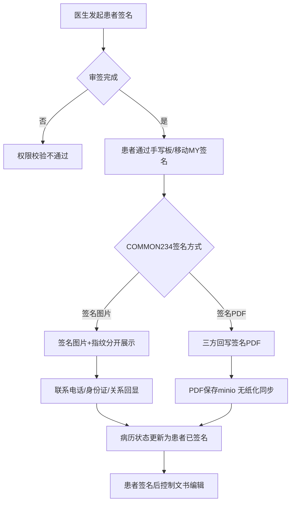
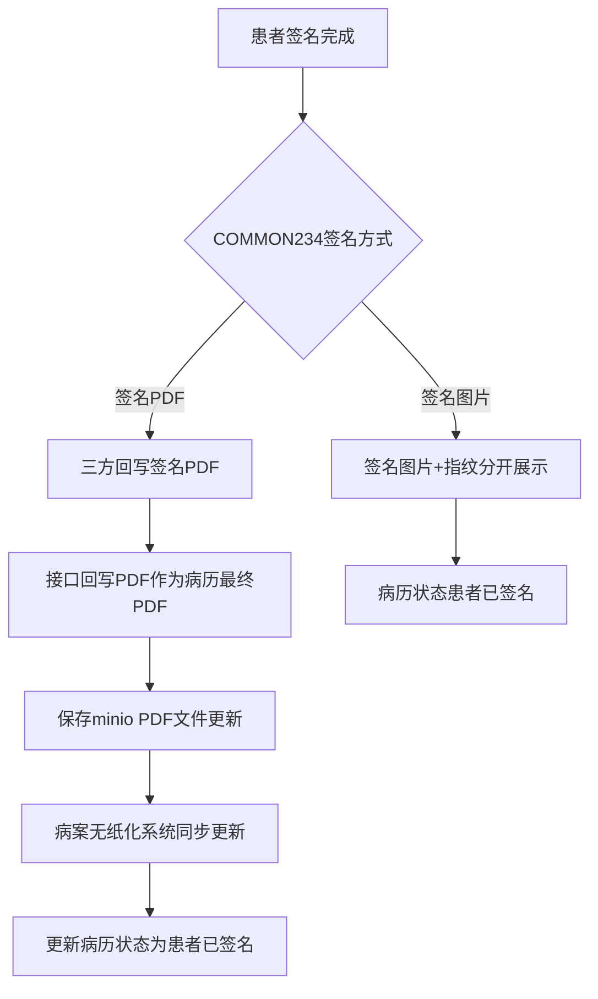

# BLGL-15-QM-002 患者签名 _ Analyst - Spec

> **需求编号**：BLGL-15-QM-002
> **父需求**：BLGL-15-QM
> **关联PM Spec**：BLGL-15-QM-002_患者签名_PM-spec.md
> **Spec版本**：V1.0
> **编写时间**：2026-08-15
> **编写人**：需求分析师

---

## 一、功能编号体系

#

## 1.1 功能层级结构

```
BLGL-15-QM-002-001: 患者签名执行
  ├─ BLGL-15-QM-002-001-01: 手写板签名（有线/无线）
  ├─ BLGL-15-QM-002-001-02: 移动MY签名
  ├─ BLGL-15-QM-002-001-03: 签名图片+指纹分开展示
  └─ BLGL-15-QM-002-001-04: 患者签名权限校验

BLGL-15-QM-002-002: 患者签名数据回显
  ├─ BLGL-15-QM-002-002-01: 联系电话/身份证回显
  ├─ BLGL-15-QM-002-002-02: 患者关系回写
  └─ BLGL-15-QM-002-002-03: 指纹手指回显

BLGL-15-QM-002-003: 患者签名锁定
  ├─ BLGL-15-QM-002-003-01: COMMON265 控制文书编辑
  ├─ BLGL-15-QM-002-003-02: 签名后禁止右键插入诊断
  └─ BLGL-15-QM-002-003-03: 护理文书撤销签名

BLGL-15-QM-002-004: 患者签名PDF模式
  ├─ BLGL-15-QM-002-004-01: 三方回写签名PDF
  ├─ BLGL-15-QM-002-004-02: PDF保存minio
  └─ BLGL-15-QM-002-004-03: 无纸化同步更新

BLGL-15-QM-002-005: 患者签名状态标识
  └─ BLGL-15-QM-002-005-01: patientSignedFlag 已签标识
```

#

## 1.2 功能编号表

| REQ-ID | 功能名称 | 类型 | 优先级 | 说明 |
|

----

----|

----

-----|

------|

----

----|

------|
| BLGL-15-QM-002-001 | 患者签名执行 | 功能 | P0 | 患者签名|
| BLGL-15-QM-002-001-01 | 手写板签名 | 子功能 | P0 | 有线/无线手写板|
| BLGL-15-QM-002-001-02 | 移动MY签名 | 子功能 | P0 | 患者手机端|
| BLGL-15-QM-002-001-03 | 签名图片+指纹分开展示 | 子功能 | P0 | 指纹399317369|
| BLGL-15-QM-002-001-04 | 患者签名权限校验 | 子功能 | P0 | 审签完成才允许签名|
| BLGL-15-QM-002-002 | 患者签名数据回显 | 功能 | P1 | 数据回显|
| BLGL-15-QM-002-002-01 | 联系电话/身份证回显 | 子功能 | P1 | 本人联系电话399336327等|
| BLGL-15-QM-002-002-02 | 患者关系回写 | 子功能 | P1 | 与患者关系|
| BLGL-15-QM-002-002-03 | 指纹手指回显 | 子功能 | P1 | 患者指纹对应手指399786753|
| BLGL-15-QM-002-003 | 患者签名锁定 | 功能 | P0 | 签名后锁定|
| BLGL-15-QM-002-003-01 | COMMON265 控制文书编辑 | 子功能 | P0 | 签名后陈述内容不能编辑|
| BLGL-15-QM-002-003-02 | 签名后禁止右键插入诊断 | 子功能 | P0 | 悬浮提醒"患者签名后不允许插入诊断"|
| BLGL-15-QM-002-003-03 | 护理文书撤销签名 | 子功能 | P1 | 签名完成前护士可中断|
| BLGL-15-QM-002-004 | 患者签名PDF模式 | 功能 | P0 | 签名PDF|
| BLGL-15-QM-002-004-01 | 三方回写签名PDF | 子功能 | P0 | COMMON234=签名PDF|
| BLGL-15-QM-002-004-02 | PDF保存minio | 子功能 | P0 | 存入minio|
| BLGL-15-QM-002-004-03 | 无纸化同步更新 | 子功能 | P0 | 无纸化同步|
| BLGL-15-QM-002-005 | 患者签名状态标识 | 功能 | P1 | 已签标识|
| BLGL-15-QM-002-005-01 | patientSignedFlag 已签标识 | 子功能 | P1 | 98175|

---

## 二、核心业务流程

#

## 2.1 患者签名主流程



#

## 2.2 患者签名PDF模式流程



---

## 三、功能规格说明

### BLGL-15-QM-002-001: 患者签名执行

#

#

## 3.1.1 功能概述

住院病历对接患者手写板，患者签名和指纹分开展示（需传两张图片一张指纹一张签名到病历中）。患者通过有线/无线手写板或移动MY签名。前置条件：是否启用患者CA签名=是，医生先完成全部签名流程（病历状态=审签完成）才允许患者CA签名。

#

#

## 3.1.2 用户角色

| 角色 | 使用场景 | 权限要求 | 操作频率 |
|

------|

----

-----|

----

-----|

----

-----|
| 患者 | 知情同意书手写板签名 | 患者侧 | 中频 |
| 住院医生 | 发起患者签名 | 病历书写权限 | 中频 |
| 护士 | 护理文书发起患者签名 | 护理权限 | 中频 |

#

#

## 3.1.3 业务流程（Given/When/Then）

**Scenario 1: 患者手写板签名（主流程）**

```gherkin
Given:
  - 参数"是否启用患者CA签名"=是
  - 医生已完成全部签名流程（审签完成）

When:
  - 医生发起患者签名
  - 患者通过手写板签名

Then:
  - 签名图片+指纹分开展示
  - 保存患者CA签名记录
  - 病历状态更新为患者已签名
```

**Scenario 2: 患者签名权限校验**

```gherkin
Given:
  - 病历未审签完成

When:
  - 发起患者签名

Then:
  - 患者签名权限校验不通过
```

**Scenario 3: 数据异常——签名图片未返回**

```gherkin
Given:
  - 患者手写板签名完成

When:
  - 病历同步患者签名

Then:
  - 拿不到签名图片（问题）
  - 需排查链路
```

**Scenario 4: 系统异常——护理文书签名路由错误**

```gherkin
Given:
  - 护理文书发起患者签名

When:
  - 签名任务发送

Then:
  - 被路由到医生患者手写板而非护士手写板（问题）
  - 需传病历创建来源（emrSourceCode）区分住院/护理
```

#

#

## 3.1.4 数据字段定义

| 字段名 | 类型 | 必填 | 默认值 | 取值范围 | 说明 | 概念ID |
|

----

----|

------|

------|

----

----|

----

-----|

------|

----

----|
| caSignatureNo | String | 是 | - | - | CA签名流水号| ⏳ 待确认 |
| signatureUrl | String | 是 | - | - | 签名图片地址（SIGNATURE_URL，来源：代码） | ⏳ 待确认 |
| fingerPrintUrl | String | 否 | - | - | 指纹图片地址（FINGER_PRINT_URL，来源：代码） | ⏳ 待确认 |
| signStatus | Long | 是 | - | - | 签名状态（SIGN_STATUS，来源：代码） | ⏳ 待确认 |
| patientName | String | 是 | - | - | 患者姓名| ⏳ 待确认 |
| idcardNo | String | 是 | - | - | 身份证号（IDCARD_NO，来源：代码） | ⏳ 待确认 |
| emrSourceCode | Long | 否 | - | 住院/护理 | 病历创建来源（EMR_SOURCE_CODE，来源：代码） | ⏳ 待确认 |

#

#

## 3.1.5 验收标准

| AC编号 | 验收标准 | 对应REQ-ID | 验证方法 | 验证场景 |
|

----

----|

----

-----|

----

----

---|

----

-----|

----

-----|
| AC-001 | 患者通过手写板/移动MY签名，签名图片+指纹分开展示 | BLGL-15-QM-002-001 | 功能测试 | Scenario 1 |
| AC-002 | 患者签名权限校验（审签完成才允许） | BLGL-15-QM-002-001 | 功能测试 | Scenario 2 |

---

### BLGL-15-QM-002-002: 患者签名数据回显

#

#

## 3.2.1 功能概述

有线、无线手写板数据回显联系电话及身份证：同步模式患者电签事件出参增加联系电话、身份证号，支持回写在签名数据元联动元素中（本人联系电话399336327/法定代理人联系电话399669743、患者身份证号399184870/代理人身份证号399776321）；异步模式网关接口支持三方回写。患签签名后展示具体手指（患者指纹对应手指399786753等）。

#

#

## 3.2.2 用户角色

| 角色 | 使用场景 | 权限要求 | 操作频率 |
|

------|

----

-----|

----

-----|

----

-----|
| 患者 | 手写板签名 | 患者侧 | 中频 |

#

#

## 3.2.3 业务流程（Given/When/Then）

**Scenario 1: 数据回显（主流程）**

```gherkin
Given:
  - 患者通过手写板签名

When:
  - 签名完成

Then:
  - 同步模式：事件出参联系电话/身份证回写在联动元素
  - 异步模式：网关接口三方回写联系电话/身份证
  - 指纹采集手指回显
```

#

#

## 3.2.4 数据字段定义

| 字段名 | 类型 | 必填 | 默认值 | 取值范围 | 说明 | 概念ID |
|

----

----|

------|

------|

----

----|

----

-----|

------|

----

----|
| 本人联系电话 | String | 否 | - | - | 签名数据元联动| 399336327 |
| 法定代理人联系电话 | String | 否 | - | - | 签名数据元联动| 399669743 |
| 患者身份证号 | String | 否 | - | - | 签名数据元联动| 399184870 |
| 代理人身份证号 | String | 否 | - | - | 签名数据元联动| 399776321 |
| 患者指纹对应手指 | String | 否 | - | - | 指纹手指回显| 399786753 |

#

#

## 3.2.5 验收标准

| AC编号 | 验收标准 | 对应REQ-ID | 验证方法 | 验证场景 |
|

----

----|

----

-----|

----

----

---|

----

-----|

----

-----|
| AC-003 | 有线/无线手写板数据回显联系电话/身份证/关系 | BLGL-15-QM-002-002 | 功能测试 | Scenario 1 |
| AC-004 | 指纹采集手指回显 | BLGL-15-QM-002-002 | 功能测试 | Scenario 1 |

---

### BLGL-15-QM-002-003: 患者签名锁定

#

#

## 3.3.1 功能概述

入院记录界面，上边已经进行患者签名了，就不允许医生修改。参数 COMMON265"患者签名后控制未提交病历的陈述内容不能编辑的监控类型"，配置在参数内的监控类型的病历，未提交状态下可以双击患者签名数据元发送患者签名事件。患者签名后右键插入诊断按钮不可操作，悬浮提醒"患者签名后不允许插入诊断"。护理文书签名逻辑与住院医师病历"异步签名"逻辑对齐，签名完成前护士可中断签名流程、回收文书修改权限。

#

#

## 3.3.2 用户角色

| 角色 | 使用场景 | 权限要求 | 操作频率 |
|

------|

----

-----|

----

-----|

----

-----|
| 住院医生 | 患者签名后编辑病历 | 病历书写权限 | 高频 |
| 护士 | 护理文书签名撤销 | 护理权限 | 中频 |

#

#

## 3.3.3 业务流程（Given/When/Then）

**Scenario 1: 患者签名后锁定（主流程）**

```gherkin
Given:
  - 入院记录患者签名已完成
  - 参数 COMMON265 配置了监控类型

When:
  - 医生尝试修改病历

Then:
  - 患者签名后陈述内容不能编辑
  - 患者签名后右键插入诊断按钮不可操作
  - 悬浮提醒"患者签名后不允许插入诊断"
```

**Scenario 2: 护理文书撤销签名**

```gherkin
Given:
  - 护理文书发起无线签名
  - 患者尚未完成签名

When:
  - 护士中断签名流程

Then:
  - 回收文书修改权限
  - 支持取消患者签名
```

#

#

## 3.3.4 数据字段定义

| 字段名 | 类型 | 必填 | 默认值 | 取值范围 | 说明 | 概念ID |
|

----

----|

------|

------|

----

----|

----

-----|

------|

----

----|
| 患者签名后控制未提交病历陈述内容不能编辑的监控类型 | String | 否 | 无 | 多选监控类型 | COMMON265| ⏳ 待确认 |

#

#

## 3.3.5 验收标准

| AC编号 | 验收标准 | 对应REQ-ID | 验证方法 | 验证场景 |
|

----

----|

----

-----|

----

----

---|

----

-----|

----

-----|
| AC-005 | 患者签名后控制文书编辑，右键插入诊断被禁止 | BLGL-15-QM-002-003 | 功能测试 | Scenario 1 |
| AC-006 | 护理文书签名完成前护士可中断 | BLGL-15-QM-002-003 | 功能测试 | Scenario 2 |

---

### BLGL-15-QM-002-004: 患者签名PDF模式

#

#

## 3.4.1 功能概述

住院病历走 PDF 模式，网关接口增加字段供 CA 团队调用回写三方的 PDF 数据（患者签名 PDF 模式）。网关接口回调时：如果是 PDF 模式（COMMON234 患者CA签名对接方式值为签名PDF），将接口回写的 PDF 作为病历最终的 PDF 保存在数据库（存入 minio 的 PDF 文件更新），病案无纸化系统对应上传的病历同步更新，更新病历状态为患者已签名。无纸化补传消息通知后，判断病历是患者已签名状态且 COMMON234 为签名PDF 时，不需要重新生成 PDF，直接将数据库已有的 PDF 传给无纸化系统。

#

#

## 3.4.2 用户角色

| 角色 | 使用场景 | 权限要求 | 操作频率 |
|

------|

----

-----|

----

-----|

----

-----|
| 住院医生 | 患者签名PDF | 病历书写权限 | 中频 |
| 无纸化系统 | 接收签名PDF | 接口对接 | 中频 |

#

#

## 3.4.3 业务流程（Given/When/Then）

**Scenario 1: 患者签名PDF回传（主流程）**

```gherkin
Given:
  - 参数 COMMON234 = 签名PDF

When:
  - 患者签名完成

Then:
  - 网关接口回写三方PDF
  - 回写PDF作为病历最终PDF保存minio
  - 病案无纸化系统同步更新
  - 病历状态更新为患者已签名
```

**Scenario 2: 无纸化补传不覆盖**

```gherkin
Given:
  - 病历患者已签名状态
  - 参数 COMMON234 = 签名PDF

When:
  - 无纸化系统消息通知补传

Then:
  - 不需要重新生成PDF
  - 直接将数据库已有PDF传给无纸化系统
  - 不覆盖三方回传的患者签名PDF
```

**Scenario 3: 重新打开病历触发同步**

```gherkin
Given:
  - 患者签名启用PDF对接模式

When:
  - 重新打开病历/刷新病历/点击同步患者签名

Then:
  - 调用患者签名同步事件
  - 将患者签名过的PDF同步回来
```

#

#

## 3.4.4 数据字段定义

| 字段名 | 类型 | 必填 | 默认值 | 取值范围 | 说明 | 概念ID |
|

----

----|

------|

------|

----

----|

----

-----|

------|

----

----|
| 患者CA签名对接方式 | String | 否 | 签名图片 | 签名图片/签名PDF（签名元素触发）/签名PDF（签名按钮触发） | COMMON234| ⏳ 待确认 |
| 签名PDF | String | 是 | - | - | 三方回写PDF| ⏳ 待确认 |

#

#

## 3.4.5 验收标准

| AC编号 | 验收标准 | 对应REQ-ID | 验证方法 | 验证场景 |
|

----

----|

----

-----|

----

----

---|

----

-----|

----

-----|
| AC-007 | 患者签名PDF回传保存minio，无纸化同步，病历状态患者已签名 | BLGL-15-QM-002-004 | 集成测试 | Scenario 1 |
| AC-008 | 无纸化补传不覆盖三方回传签名PDF | BLGL-15-QM-002-004 | 集成测试 | Scenario 2 |

---

### BLGL-15-QM-002-005: 患者签名状态标识

#

#

## 3.5.1 功能概述

给病历增加患者签名已签署、未签署的标识，突出显示，方便医生确认知情同意文书是否都已正常签署。patientSignedFlag: 98175（患者已签名）。

#

#

## 3.5.2 用户角色

| 角色 | 使用场景 | 权限要求 | 操作频率 |
|

------|

----

-----|

----

-----|

----

-----|
| 住院医生 | 查看病历签名状态 | 病历书写权限 | 高频 |

#

#

## 3.5.3 业务流程（Given/When/Then）

**Scenario 1: 患者已签标识（主流程）**

```gherkin
Given:
  - 患者完成电子签名

When:
  - 查看病历

Then:
  - 病历增加患者签名已签署标识（patientSignedFlag: 98175）
  - 未签署标识突出显示
```

#

#

## 3.5.4 数据字段定义

| 字段名 | 类型 | 必填 | 默认值 | 取值范围 | 说明 | 概念ID |
|

----

----|

------|

------|

----

----|

----

-----|

------|

----

----|
| patientSignedFlag | Long | 否 | - | 98175 | 患者已签名标识| ⏳ 待确认 |

#

#

## 3.5.5 验收标准

| AC编号 | 验收标准 | 对应REQ-ID | 验证方法 | 验证场景 |
|

----

----|

----

-----|

----

----

---|

----

-----|

----

-----|
| AC-009 | 患者签名已签标识 patientSignedFlag: 98175 突出显示 | BLGL-15-QM-002-005 | 功能测试 | Scenario 1 |

---

## 四、排除范围

本需求不包含以下功能项：

1. **医生CA签名** —— BLGL-15-QM-001
2. **多人代理人签名** —— BLGL-15-QM-003
3. **CA接口对接**（信手书/北京CA）—— BLGL-15-QM-004
4. **CA签名配置与方式** —— BLGL-15-QM-005
5. **签名图片与PDF处理** —— BLGL-15-QM-006
6. **CA校验与签名流程** —— BLGL-15-QM-007

---

## 五、业务规则清单

| 规则ID | 规则名称 | 规则描述 | 优先级 |
|

----

----|

----

-----|

----

-----|

------|

----

----|
| BR-001 | 患者签名前置 | 是否启用患者CA签名=是，医生先完成全部签名流程（审签完成）才允许患者CA签名 | P0 |
| BR-002 | 签名方式 | 患者CA签名对接方式 COMMON234：签名图片/签名PDF，默认签名图片 | P0 |
| BR-003 | 签名回显 | 有线无线手写板数据回显联系电话/身份证/关系/指纹手指 | P1 |
| BR-004 | 签名锁定 | 患者签名后控制未提交病历陈述内容不能编辑（COMMON265） | P0 |
| BR-005 | 禁止插入诊断 | 患者签名后右键插入诊断按钮不可操作，悬浮提醒 | P0 |
| BR-006 | PDF模式 | COMMON234=签名PDF时回写PDF保存minio，无纸化同步，病历状态患者已签名 | P0 |
| BR-007 | 补传不覆盖 | 患者已签名且COMMON234=签名PDF时补传直接用数据库已有PDF，不覆盖三方回传 | P0 |
| BR-008 | 已签标识 | 病历增加患者签名已签署标识 patientSignedFlag: 98175 | P1 |

---

## 六、关联文档

| 文档类型 | 文档路径 | 说明 |
|

----

-----|

----

-----|

------|
| 功能点Spec | BLGL-15-QM CA签名功能点Spec.md（V1.0，上级目录） | Phase 1 功能点索引 |
| PM spec | 本目录 BLGL-15-QM-002_患者签名_PM-spec.md（V0.1） | PM 产出的 Spec 文档 |
| -Spec | 本目录 BLGL-15-QM-002_患者签名_Spec.md（V1.0） | 业务背景与目标 Spec |
| data-model.md | 待产出 | 架构师产出的数据建模文档 |
| design.md | 待产出 | 架构师产出的技术方案文档 |
| api-contract.md | 待产出 | 开发经理产出的 API 契约文档 |

---

## 七、待确认问题清单

| 编号 | 问题描述 | 缺失信息 | 影响范围 | 建议补充方 |
|

------|

----

-----|

----

-----|

----

-----|

----

----

---|
| Q-001 | 患者签名接口（InpEmrPatCaRecordSaveInputAO）完整字段 | API 契约 | -Spec 第5章 | 开发经理 |
| Q-002 | 患者签名参数（COMMON234/236/253/260/265）概念 ID | 概念ID | 3.1.4/3.3.4 | 产品经理 |
| Q-003 | 患者签名拿不到签名图片根因 | 需求分析原文缺失 | 3.1.3 | 开发经理 |
| Q-004 | 护理文书签名路由错误修复逻辑 | 需求分析原文缺失 | 3.1.3 | 开发经理 |
| Q-005 | 患者签名PDF回写网关接口字段 | API 契约 | 3.4.3 | 开发经理 |
| Q-006 | 性能指标（患者签名响应时间） | 资料区无量化指标 | -Spec 第8章 | 产品经理 |

---

## 填写检查清单

| 序号 | 检查项 | 是否完成 |
|:

----:|

----

----|:

----

----:|
| 1 | 功能编号带父子层级 | ✅ |
| 2 | 每个 REQ-ID 有功能概述和用户角色 | ✅ |
| 3 | 主流程至少 1 个 Given/When/Then 场景 | ✅ |
| 4 | 异常流程至少 3 个 Given/When/Then 场景 | ✅ |
| 5 | 边界流程至少 2 个 Given/When/Then 场景 | ✅ |
| 6 | 每个 Given/When/Then 内容具体，不模糊 | ✅ |
| 7 | 数据字段定义完整（字段名、类型、必填、说明、概念ID） | ✅ |
| 8 | 验收标准 AC 编号独立，可验证 | ✅ |
| 9 | 验收标准无"功能正常"等模糊表述 | ✅ |
| 10 | 排除范围明确列出 | ✅ |
| 11 | 业务规则清单列出所有规则，每条标注来源 | ✅ |
| 12 | 流程图使用 Mermaid 格式（≥2 个） | ✅ |
| 13 | 关联文档索引包含 Phase 1 功能点Spec | ✅ |
| 14 | 待确认问题清单汇总了全文所有 ⏳ 项 | ✅ |
| 15 | 全文无占位符 `< >` 残留 | ✅ |
| 16 | 全文陈述可溯源至资料区（S1~S10 溯源核查） | ✅ |
| 17 | 人工审核确认完成 | ⏳ 待确认 |

---

**文档状态**：⬜ 待审核
**维护责任**：需求分析师规范组
**下次更新**：根据评审反馈优化

---

## 版本历史

| 版本 | 日期 | 变更说明 | 编写人 |
|

------|

------|

----

-----|

----

----|
| V1.0 | 2026-08-15 | 初始版本 | 需求分析师 |
