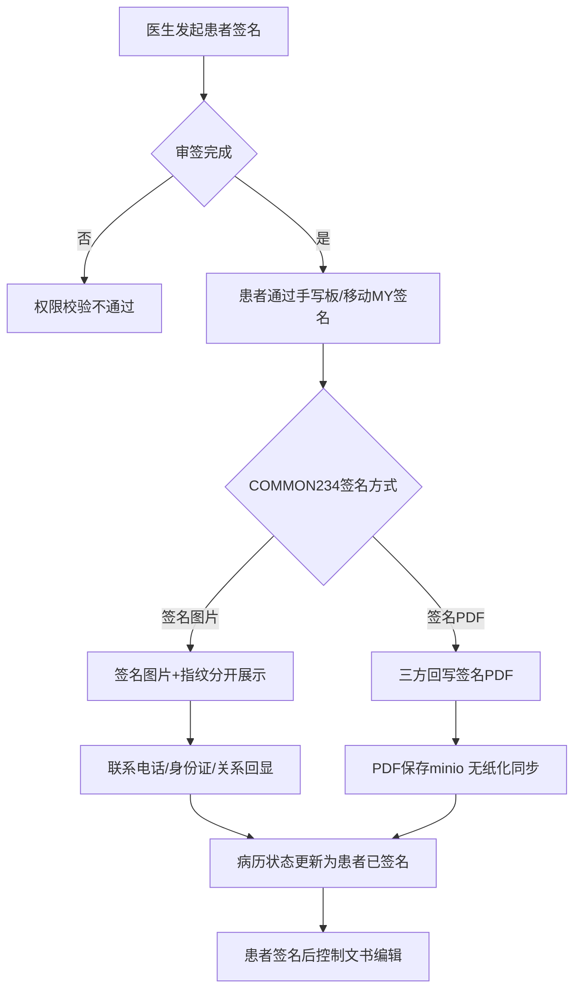
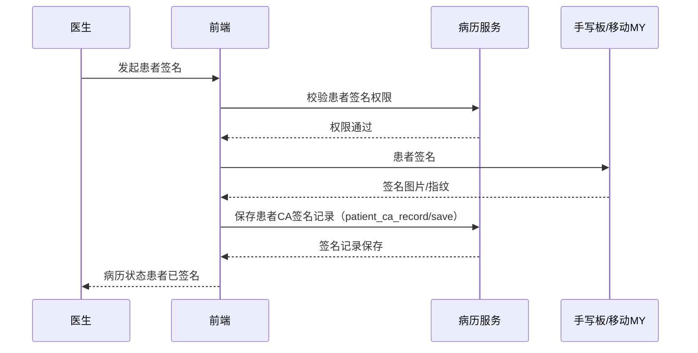

# BLGL-15-QM-002 患者签名 - Spec

> **功能编号**：BLGL-15-QM-002
> **文档类型**：功能Spec（业务背景与设计）
> **文档版本**：V1.0
> **编写时间**：2026-08-15
> **编写人**：RACC

---

## 文档索引

#

### 章节索引

**本文档（功能Spec：业务背景与设计）**

| 章节号 | 章节名称 | 内容说明 |
|

----

----|

----

-----|

----

-----|
| 第1章 | 文档概述 | 文档目的、文档范围、术语定义、阅读指南、参考文档 |
| 第2章 | 功能背景与定位 | 功能背景、功能定位、目标用户、核心价值 |
| 第3章 | 业务流程设计 | 主流程/异常流程/边界流程（Given/When/Then） |
| 第4章 | 数据模型设计 | 核心数据结构、状态定义、系统参数定义 |
| 第5章 | 接口契约设计 | API列表、接口详细设计、错误码定义 |
| 第6章 | 技术方案设计 | 页面路径、技术栈、关键技术点、部署方案 |
| 第7章 | 测试用例预设计 | 功能/边界/异常/性能测试用例 |
| 第8章 | 非功能性要求 | 性能、安全、可用性、兼容性 |
| 第9章 | 依赖与风险 | 外部依赖、风险项 |
| 第10章 | 附录 | 流程图、时序图、参考文档 |

**PM-Spec（需求规格）**：目标/约束/验收标准/排除范围/关键决策/优先级
**Analyst-Spec（分析规格）**：功能编号体系/核心业务流程/功能规格/排除范围/业务规则/关联文档/待确认问题

#

### 版本历史

| 版本 | 日期 | 变更说明 | 编写人 |
|

------|

------|

----

-----|

----

----|
| V1.0 | 2026-08-15 | 初始版本 | RACC |

#

### 关联文档索引

| 序号 | 文档名称 | 文档类型 | 版本 | 位置 |
|

------|

----

-----|

----

-----|

------|

------|
| 1 | BLGL-15-QM-002_患者签名_Spec.md | 功能Spec（业务背景与设计）（本文档） | V1.0 | 本目录 |
| 2 | BLGL-15-QM-002_患者签名_PM-spec.md | PM-Spec（需求规格） | V0.1 | 本目录 |
| 3 | BLGL-15-QM-002_患者签名_Analyst-spec.md | Analyst-Spec（分析规格） | V1.0 | 本目录 |
| 4 | BLGL-15-QM CA签名功能点Spec.md | 功能点Spec（模块级） | V1.0 | 上级目录 |

---

## 1、文档概述

#

## 1.1、文档目的

本文档旨在明确"患者签名"功能（BLGL-15-QM-002）的业务背景与设计方案，为需求分析、研发实现、测试验收及评审提供统一的业务上下文、设计口径与决策依据。

**具体目的包括**：

1. 梳理患者签名功能的业务由来与历史需求演进脉络，说明"为什么要做"；
2. 明确功能的定位边界、目标用户与核心价值，回答"做成什么"；
3. 描述功能的业务流程、数据模型、接口契约与技术方案，回答"怎么做"；
4. 预设计测试用例并明确非功能性要求、依赖与风险，为研发与验收提供依据；
5. 作为 Analyst-Spec 的业务前提与设计输入，保证各层文档业务口径一致。

#

## 1.2、文档范围

#

#

## 1.2.1 纳入范围

本文档覆盖患者签名的完整业务背景与设计，包括：

- 患者签名对接方式：签名图片/签名PDF- 有线/无线手写板签名：签名图片+指纹分开展示、数据回显（联系电话/身份证/关系）- 移动MY签名：患者手机端签名- 签名后锁定编辑：患者签名后控制文书编辑- 患者签名已签标识：patientSignedFlag- 患者签名PDF：签名后PDF重生成/回传无纸化- 批量签名：患者签支持批量签名多份病历#

#

## 1.2.2 排除范围

本文档不涉及以下内容（详见其他功能点或模块）：

- 医生CA签名 —— BLGL-15-QM-001
- 多人代理人签名 —— BLGL-15-QM-003
- CA接口对接—— BLGL-15-QM-004
- CA签名配置与方式 —— BLGL-15-QM-005
- 签名图片与PDF处理 —— BLGL-15-QM-006
- CA校验与签名流程 —— BLGL-15-QM-007

#

## 1.3、术语定义

| 术语 | 定义 |
|

------|

------|
| 患者签名 | 患者通过手写板/移动端对知情同意书等文书进行电子签名|
| 患者签名对接方式 | 参数 COMMON234：签名图片/签名PDF|
| 有线/无线手写板 | 患者签名硬件设备（有线板/无线板）|
| 移动MY签名 | 患者通过手机端 MY 进行签名|
| 患者已签名标识 | patientSignedFlag: 98175|

#

## 1.4、阅读指南


- **章节关系**：第1~2章为业务全貌，第3~10章为设计实现层。与 Analyst-Spec、PM-Spec 互相引用保持一致。

- **读者对象**：产品经理/需求分析师读第1~2章；研发读第3~6、9~10章；测试读第3、7~8章；评审人员核对各层一致性。

#

## 1.5、参考文档

| 序号 | 文档名称 | 版本/日期 |
|

------|

----

-----|

----

------|
| 1 | 【历史需求】住院病历的历史需求.xlsx | - |
| 2 | BLGL-15-QM-002_患者签名_PM-spec.md | V0.1 |
| 3 | BLGL-15-QM-002_患者签名_Analyst-spec.md | V1.0 |
| 4 | BLGL-15-QM CA签名功能点Spec.md | V1.0 |

---

## 2、功能背景与定位

#

## 2.1 功能背景

患者签名是 CA 签名模块的核心（L1），需满足：


- **现状痛点**：患者签名和指纹在一张图片返回，但部分医院需分开返回；患者签名后医生仍可修改文书，需锁定；患者签名后右键添加诊断导致无签名文书传给无纸化
- **管理要求**：有线、无线手写板数据回显联系电话及身份证；患者签名已签署/未签署标识突出显示
- **历史需求演进**：住院病历对接患者手写板→ 患者签名PDF对接→ 有线无线数据回显→ 签名后锁定编辑→ 患者签名已签标识

#

## 2.2 功能定位

"患者签名"是 WiNEX 病历管理-CA签名的患者侧核心，定位为：


- **签名执行**：患者通过有线/无线手写板/移动MY签名
- **签名锁定**：患者签名后控制文书编辑
- **签名回显**：签名/指纹/身份证/关系数据回显

#

## 2.3 目标用户

| 用户角色 | 主要使用场景 |
|

----

-----|

----

----

-----|
| 患者 | 知情同意书等文书手写板/移动端签名 |
| 护士 | 护理文书发起患者签名、取消签名 |
| 住院医生 | 发起患者签名、查看签名状态 |

#

## 2.4 核心价值

| 价值维度 | 价值描述 |
|

----

-----|

----

-----|
| 知情同意 | 患者电子签名保证知情同意文书法律效力|
| 签名锁定 | 患者签名后控制文书编辑，避免无签名文书|
| 状态可视 | 患者已签/未签标识突出显示|

---

## 3、业务流程设计（Given/When/Then）

#

## 3.1 主流程

**Scenario 1: 患者签名**

```gherkin
Given:
  - 参数"是否启用患者CA签名"配置为是
  - 医生已完成全部签名流程（病历状态=审签完成）
  - 患者签名数据元已放置

When:
  - 医生发起患者签名（双击患者签名数据元/提交后弹框）

Then:
  - 患者通过有线/无线手写板或移动MY签名
  - 签名图片+指纹分开展示
  - 联系电话/身份证/关系数据回显
  - 签名后控制文书编辑（COMMON265 配置的监控类型）
  - 病历状态更新为患者已签名
```

#

## 3.2 异常流程

**Scenario 2: 业务异常——患者签名未同步**

```gherkin
Given:
  - 患者发起签名后

When:
  - 医生查看病历

Then:
  - 签名状态为"患者签名中"
  - 未同步时橙色轻提醒"已发起患者签名，请耐心等待签名完成"
  - 同步完成绿色轻提醒"患者签名完成，病历已刷新"
```

**Scenario 3: 数据异常——签名图片未返回**

```gherkin
Given:
  - 患者手写板签名完成

When:
  - 病历同步患者签名

Then:
  - 拿不到签名图片（问题）
  - 需排查链路
```

**Scenario 4: 系统异常——护理文书签名路由错误**

```gherkin
Given:
  - 护理文书发起患者签名

When:
  - 签名任务发送

Then:
  - 被路由到医生患者手写板而非护士手写板（问题）
  - 需传病历创建来源（emrSourceCode）区分住院/护理
```

#

## 3.3 边界流程

**Scenario 5: 边界——患者签名PDF模式**

```gherkin
Given:
  - 参数 COMMON234 配置"签名PDF"

When:
  - 患者签名完成

Then:
  - 三方回写签名PDF
  - 保存为病历最终PDF（存入 minio）
  - 无纸化系统同步更新
  - 病历状态更新为患者已签名
```

**Scenario 6: 边界——患者签名已签标识**

```gherkin
Given:
  - 患者完成电子签名

When:
  - 查看病历

Then:
  - 病历增加患者签名已签署标识（patientSignedFlag: 98175）
  - 未签署标识突出显示，方便医生确认
```

---

## 4、数据模型设计

#

## 4.1 核心数据结构

#

#

## 4.1.1 核心保存请求

| 字段名 | 类型 | 必填 | 备注 |
|

----

----|

------|

------|

------|
| inpEmrSetId | Long | 是 | 病历集ID|
| caSignatureNo | String | 是 | CA签名流水号|
| signatureUrl | String | 是 | 签名图片地址|
| fingerPrintUrl | String | 否 | 指纹图片地址|
| signStatus | Long | 是 | 签名状态|
| signedAt | Date | 否 | 签名时间|

> ⏳ 待确认：患者签名接口完整入参/出参以 API 契约为准。

#

#

## 4.1.2 核心表/实体

| 表/实体 | 关键字段 | 说明 |
|

----

-----|

----

-----|

------|
| INP_EMR_PATIENT_CA_RECORD（InpEmrPatientCaRecordPO） | emrPatientCaRecordId、inpEmrRecordId、inpEmrSetId、encounterId、caSignatureNo(CA_SIGNATURE_NO)、signatureUrl(SIGNATURE_URL)、signPosition(SIGN_POSITION)、patientName、idcardNo(IDCARD_NO)、attachmentUrl(ATTACHMENT_URL)、signedAt(SIGNED_AT)、fingerPrintUrl(FINGER_PRINT_URL)、signStatus(SIGN_STATUS)、relationshipWithPatientDesc、signAnnotationImg(ANNOTATION_CONTENT_PATH)、legalRepresentativePhone(AGENT_CONTACT_NO)、personalPhone(CONTACT_NO)、agentIdCard(AGENT_IDCARD_NO)、fingerName(FINGER_NAME)、emrSourceCode | 患者CA签名记录表|

#

## 4.2 状态定义

| 状态码 | 状态名称 | 说明 |
|

----

----|

----

-----|

------|
| - | 患者签名中 | 患者签名发起未完成|
| - | 患者已签名 | 患者签名完成|
| 98175 | 患者已签名标识 | patientSignedFlag|

#

## 4.3 系统参数定义

| 参数编码 | 参数名称 | 说明 |
|

----

-----|

----

-----|

------|
| COMMON234 | 患者CA签名对接方式 | 签名图片/签名PDF（签名元素触发）/签名PDF（签名按钮触发）|
| COMMON236 | 触发患者电签事件的数据元 | 患者签名数据元|
| COMMON253 | 患者签名方式配置 | 有线签名/无线签名/扫码签名|
| COMMON260 | 审签流程结束时是否自动提醒发起患者电签 | 是/否|
| COMMON265 | 患者签名后控制未提交病历的陈述内容不能编辑的监控类型 | 默认无，多选监控类型|

---

## 5、接口契约设计

#

## 5.1 API列表

| 序号 | API名称（代码函数） | 路径 | 方法 | 说明 |
|:

----:|

----

-----|

------|:

----:|

------|
| 1 | 保存住院病历患者CA签名记录 | /api/v1/app_record_inpatient/inpatient_emr/patient_ca_record/save | POST | 患者签名记录保存（入参 InpEmrPatCaRecordSaveInputAO）|
| 2 | 查询住院病历患者CA签名记录 | /api/v1/app_record_inpatient/inpatient_emr/patient_ca_record/query/by_example | POST | 患者签名记录查询（入参 InpEmrPatCaRecordInputAO）|
| 3 | 校验是否能患者签名 | /api/v1/app_record_inpatient/inpatient_emr/patient_ca/permission/check/by_id | POST | 患者签名权限校验（入参 InpEmrPatCaPermissionCheckInputAO）|
| 4 | 患者签名实时获取 | /api/v1/app_record_inpatient/emr_pat_signature/query/by_example | POST | 患者签名实时获取（入参 InpEmrSignatureImageSyncInputAO）|
| 5 | 清空签名图片地址 | /api/v1/app_record_inpatient/emr_pat_signature/del | POST | 清空签名图片|
| 6 | 查询患者签名病历pdf | /api/v1/app_record_inpatient/emr_inpatient/signed_pdf/query | POST | 患者签名PDF查询（入参 InpEmrPatientSignPdfInputAO）|
| 7 | 保存患者签名病历pdf | /api/v1/app_record_inpatient/emr_inpatient/signed_pdf/save | POST | 患者签名PDF保存|

#

## 5.2 接口详细设计

#

#

## 5.2.1 保存住院病历患者CA签名记录（patient_ca_record/save）

**请求参数**:
```json
{
  "inpEmrSetId": "12345",
  "inpEmrRecordId": "20001",
  "caSignatureNo": "CA20260815001",
  "signatureUrl": "https://.../signature.png",
  "fingerPrintUrl": "https://.../finger.png",
  "signStatus": 1,
  "patientName": "张三",
  "idcardNo": "110101199001011234"
}
```

**返回值（成功）**:
```json
{
  "success": true,
  "data": null
}
```

> ⏳ 待确认：患者签名接口字段以代码扫描（InpEmrPatCaRecordSaveInputAO）和 API 契约为准。

**返回值（失败）**:
```json
{
  "success": false,
  "message": "患者签名未同步，请耐心等待签名完成",
  "data": null
}
```

#

## 5.3 错误码定义

| 错误码 | 错误信息 | 处理方式 |
|

----

----|

----

-----|

----

-----|
| ⏳ 待确认 | 已发起患者签名，请耐心等待签名完成 | 橙色轻提醒|
| ⏳ 待确认 | 患者签名后不允许插入诊断 | 右键插入诊断按钮不可操作|

---

## 6、技术方案设计

#

## 6.1 页面路径


- **页面路径**: 住院医生站→住院病历书写界面→患者签名对话框（PatientSignDialog，支持有线/无线/扫码签名，配置 COMMON253）

- **后端模块**: winning-emr-ipt-emrset/.../controller/sign/EmrSignatureImageController.java（患者签名实时获取、保存/查询患者CA签名记录、患者签名权限校验）
- **前端 mixin**: src/mixin/emrEditor/patientCaAction.js（患者CA签名流程，签名方式 IMAGE/PDF/3）
- **前端 API**: src/api/global.js patientCaApi（saveSignatureRecordID → patient_ca_record/save、getSignatureRecordID → patient_ca_record/query/by_example、savePDFCAPatient → signed_pdf/save、queryPDFCAPatient → signed_pdf/query、isAllowPatientCaFlow → patient_ca/permission/check/by_id）

#

## 6.2 技术栈

| 类别 | 技术 | 版本 |
|

------|

------|

------|
| 前端框架 | Vue | 2.6.14 |
| 前端UI | element-ui | 2.13.0 |
| 签名组件 | PatientSignDialog + @winex-plugin/win-ca | - |
| 后端框架 | Spring Boot（Java 17）+ JPA/Hibernate | - |
| RPC | winning-akso-rpc-rest | - |

#

## 6.3 关键技术点

- 患者签名对接方式 COMMON234：签名图片/签名PDF（签名元素触发）/签名PDF（签名按钮触发）- 同步/异步模式：前端同步模式事件出参回显；后端异步模式网关接口三方回写- 患者签名PDF模式：接口回写PDF作为病历最终PDF保存在数据库（minio），无纸化同步更新，病历状态更新为患者已签名- 护理文书签名路由：传病历创建来源（emrSourceCode）区分住院/护理

#

## 6.4 部署方案

⏳ 待确认：部署方案未在资料区中找到。

---

## 7、测试用例预设计

#

## 7.1 功能测试

| 用例编号 | 测试场景 | Given | When | Then |
|

----

-----|

----

-----|

----

---|

------|

------|
| TC-001 | 患者签名 | 审签完成，患者签名数据元已放 | 发起患者签名 | 签名/指纹分开展示，状态已签名 |
| TC-002 | 患者签名记录保存接口 | 患者签名完成 | 调用 patient_ca_record/save | 保存患者CA签名记录 |

#

## 7.2 边界测试

| 用例编号 | 测试场景 | Given | When | Then |
|

----

-----|

----

-----|

----

---|

------|

------|
| TC-003 | 患者签名PDF模式 | COMMON234=签名PDF | 患者签名完成 | 回写PDF保存minio，无纸化同步 |
| TC-004 | 患者签名已签标识 | 患者完成签名 | 查看病历 | 显示已签署标识（patientSignedFlag 98175） |

#

## 7.3 异常测试

| 用例编号 | 测试场景 | Given | When | Then |
|

----

-----|

----

-----|

----

---|

------|

------|
| TC-005 | 患者签名未同步 | 患者签名中 | 医生查看病历 | 橙色提醒等待签名完成 |
| TC-006 | 患者签名权限校验 | 病历未审签完成 | 发起患者签名 | 权限校验不通过 |

#

## 7.4 性能测试

| 用例编号 | 测试场景 | 指标 |
|

----

-----|

----

-----|

------|
| TC-007 | 患者签名响应 | ⏳ 待确认：性能指标未在资料区中找到 |
| TC-008 | 患者签名PDF同步响应 | ⏳ 待确认：性能指标未在资料区中找到 |

---

## 8、非功能性要求

#

## 8.1 性能要求

| 指标 | 要求 |
|

------|

------|
| 患者签名响应时间 | ⏳ 待确认 |

#

## 8.2 安全要求

| 要求 | 说明 |
|

------|

------|
| 签名权限 | 患者签名需医生先完成全部签名流程（审签完成）|
| 隐私保护 | 患者签名身份证/联系电话数据回显需合规|

**医疗行业特殊要求**

| 要求 | 说明 |
|

------|

------|
| 知情同意 | 患者电子签名保证知情同意文书法律效力|
| 签名锁定 | 患者签名后控制文书编辑，避免无签名文书传给无纸化|

#

## 8.3 可用性要求

| 指标 | 要求值 |
|

------|

----

----|
| 可用性 | ⏳ 待确认 |

#

## 8.4 兼容性要求

| 类型 | 要求 |
|

------|

------|
| 签名方式 | 有线/无线/移动MY/扫码签名兼容|
| 文书类型 | 住院病历/护理文书签名路由区分（emrSourceCode）|

---

## 9、依赖与风险

#

## 9.1 外部依赖

| 依赖项 | 说明 |
|

----

----|

------|
| 有线/无线手写板 | 患者签名硬件|
| 移动MY | 患者手机端签名|
| 无纸化系统 | 患者签名PDF回传|

#

## 9.2 风险项

| 风险项 | 等级 | 说明 | 应对方案 |
|

----

----|

------|

------|

----

-----|
| 签名链路异常 | 中 | 患者签名后拿不到签名图片| 排查链路 |
| 签名路由错误 | 中 | 护理文书签名路由到医生手写板| 传emrSourceCode区分 |

---

## 10、附录

#

## 10.1 流程图



#

## 10.2 时序图



#

## 10.3 参考文档

- 【历史需求】住院病历的历史需求.xlsx- BLGL-15-QM CA签名功能点Spec.md（V1.0，第5章 BLGL-15-QM-002 行）
- 关联Spec: BLGL-15-QM-002_患者签名_PM-spec.md、BLGL-15-QM-002_患者签名_Analyst-spec.md

---

## 填写检查清单

| 序号 | 检查项 | 是否完成 |
|:

----:|

----

----|:

----

----:|
| 1 | 章节索引与正文章节一致 | ✅ |
| 2 | 版本历史记录完整 | ✅ |
| 3 | 关联文档索引已登记全部Spec | ✅ |
| 4 | 文档目的明确回答"为什么做/做成什么/怎么做" | ✅ |
| 5 | 纳入范围/排除范围清晰 | ✅ |
| 6 | 术语定义覆盖关键概念，从资料区可溯源 | ✅ |
| 7 | 参考文档已登记 | ✅ |
| 8 | 功能背景基于法规/规范/需求来源组织 | ✅ |
| 9 | 功能定位体现业务价值（3~5个定位点） | ✅ |
| 10 | 目标用户角色覆盖完整，在需求原文中有出处 | ✅ |
| 11 | 核心价值可陈述，与 Phase 1 口径一致 | ✅ |
| 12 | 业务流程：主流程≥1、异常≥3、边界≥2，Given/When/Then 具体 | ✅ |
| 13 | 数据模型：字段/表/状态/参数可溯源 | ✅ |
| 14 | 接口契约：API列表+详细设计+错误码齐全或标记待确认 | ✅ |
| 15 | 技术方案：页面路径/技术栈/关键点/部署方案或标记待确认 | ✅ |
| 16 | 测试用例：功能/边界/异常/性能覆盖 | ✅ |
| 17 | 非功能性要求：性能/安全/可用性/兼容性指标可量化或标记待确认 | ✅ |
| 18 | 依赖与风险：外部依赖登记完整 | ✅ |
| 19 | 附录：流程图/时序图与正文流程一致 | ✅ |
| 20 | 全文无占位符 `< >` 残留 | ✅ |
| 21 | 全文陈述可溯源至资料区 | ✅ |
| 22 | 人工审核确认完成 | ⏳ 待确认 |

---

**文档状态**：⬜ 待审核
**维护责任**：RACC
**下次更新**：根据评审反馈优化
