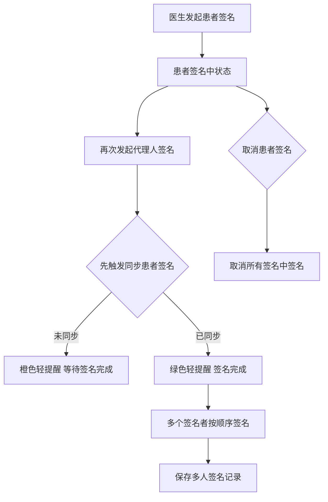
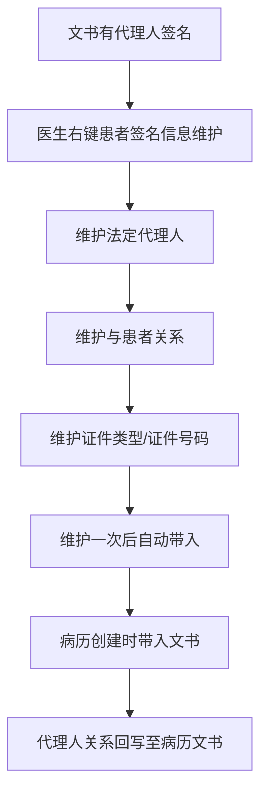

# BLGL-15-QM-003 多人代理人签名 _ Analyst - Spec

> **需求编号**：BLGL-15-QM-003
> **父需求**：BLGL-15-QM
> **关联PM Spec**：BLGL-15-QM-003_多人代理人签名_PM-spec.md
> **Spec版本**：V1.0
> **编写时间**：2026-08-15
> **编写人**：需求分析师

---

## 一、功能编号体系

#

## 1.1 功能层级结构

```
BLGL-15-QM-003-001: 多人签名
  ├─ BLGL-15-QM-003-001-01: 多个患者/家属签名
  ├─ BLGL-15-QM-003-001-02: 签名顺序控制
  └─ BLGL-15-QM-003-001-03: 多人签名记录

BLGL-15-QM-003-002: 签名同步校验
  ├─ BLGL-15-QM-003-002-01: 签名前同步患者签名
  ├─ BLGL-15-QM-003-002-02: 未同步橙色提醒
  └─ BLGL-15-QM-003-002-03: 已同步绿色提醒

BLGL-15-QM-003-003: 取消签名
  └─ BLGL-15-QM-003-003-01: 取消所有签名中签名

BLGL-15-QM-003-004: 代理人信息维护
  ├─ BLGL-15-QM-003-004-01: 患者签名信息维护菜单
  ├─ BLGL-15-QM-003-004-02: 代理人关系/证件维护
  └─ BLGL-15-QM-003-004-03: 代理人关系回写

BLGL-15-QM-003-005: 签名人姓名入参
  └─ BLGL-15-QM-003-005-01: trusteeName/PatientRelativeType
```

#

## 1.2 功能编号表

| REQ-ID | 功能名称 | 类型 | 优先级 | 说明 |
|

----

----|

----

-----|

------|

----

----|

------|
| BLGL-15-QM-003-001 | 多人签名 | 功能 | P0 | 多人签名|
| BLGL-15-QM-003-001-01 | 多个患者/家属签名 | 子功能 | P0 | 多人签名|
| BLGL-15-QM-003-001-02 | 签名顺序控制 | 子功能 | P1 | 顺序不混乱|
| BLGL-15-QM-003-001-03 | 多人签名记录 | 子功能 | P0 | 保存记录|
| BLGL-15-QM-003-002 | 签名同步校验 | 功能 | P0 | 签名前同步|
| BLGL-15-QM-003-002-01 | 签名前同步患者签名 | 子功能 | P0 | 先触发同步|
| BLGL-15-QM-003-002-02 | 未同步橙色提醒 | 子功能 | P0 | 橙色轻提醒|
| BLGL-15-QM-003-002-03 | 已同步绿色提醒 | 子功能 | P0 | 绿色轻提醒|
| BLGL-15-QM-003-003 | 取消签名 | 功能 | P0 | 取消签名|
| BLGL-15-QM-003-003-01 | 取消所有签名中签名 | 子功能 | P0 | 全部取消|
| BLGL-15-QM-003-004 | 代理人信息维护 | 功能 | P1 | 代理人维护|
| BLGL-15-QM-003-004-01 | 患者签名信息维护菜单 | 子功能 | P1 | 右键菜单|
| BLGL-15-QM-003-004-02 | 代理人关系/证件维护 | 子功能 | P1 | 法定代理人/关系/证件|
| BLGL-15-QM-003-004-03 | 代理人关系回写 | 子功能 | P1 | 回写至病历文书|
| BLGL-15-QM-003-005 | 签名人姓名入参 | 功能 | P1 | 签名人姓名|
| BLGL-15-QM-003-005-01 | trusteeName/PatientRelativeType | 子功能 | P1 | 患者签名事件入参|

---

## 二、核心业务流程

#

## 2.1 多人代理人签名主流程



#

## 2.2 代理人信息维护流程



---

## 三、功能规格说明

### BLGL-15-QM-003-001: 多人签名

#

#

## 3.1.1 功能概述

住院病历多个患者/家属/代理人签名。中医科知情同意书出现患者签名和家属签名乱问题需调查原因并处理历史签名问题。同意书多人患者签名报错需修复。

#

#

## 3.1.2 用户角色

| 角色 | 使用场景 | 权限要求 | 操作频率 |
|

------|

----

-----|

----

-----|

----

-----|
| 患者 | 患者签名 | 患者侧 | 中频 |
| 家属/代理人 | 家属/代理人签名 | 代理人侧 | 中频 |
| 住院医生 | 发起多人签名 | 病历书写权限 | 中频 |

#

#

## 3.1.3 业务流程（Given/When/Then）

**Scenario 1: 多人签名（主流程）**

```gherkin
Given:
  - 病历需要多个患者/家属/代理人签名

When:
  - 医生发起多人签名

Then:
  - 多个签名者按顺序签名
  - 签名顺序不混乱
  - 保存多人签名记录
```

**Scenario 2: 异常——多人签名报错**

```gherkin
Given:
  - 同意书多人患者签名

When:
  - 发起多人签名

Then:
  - 报错（问题）
  - 需排查多人签名逻辑
```

**Scenario 3: 异常——签名乱**

```gherkin
Given:
  - 中医科知情同意书

When:
  - 患者和家属签名

Then:
  - 签名乱（问题）
  - 需调查原因并处理历史签名问题
```

#

#

## 3.1.4 数据字段定义

| 字段名 | 类型 | 必填 | 默认值 | 取值范围 | 说明 | 概念ID |
|

----

----|

------|

------|

----

----|

----

-----|

------|

----

----|
| patientName | String | 是 | - | - | 签名人姓名| ⏳ 待确认 |
| relationshipWithPatientDesc | String | 否 | - | - | 与患者关系描述| ⏳ 待确认 |
| signStatus | Long | 是 | - | - | 签名状态| ⏳ 待确认 |

#

#

## 3.1.5 验收标准

| AC编号 | 验收标准 | 对应REQ-ID | 验证方法 | 验证场景 |
|

----

----|

----

-----|

----

----

---|

----

-----|

----

-----|
| AC-001 | 多个签名者按顺序签名，顺序不混乱 | BLGL-15-QM-003-001 | 功能测试 | Scenario 1 |

---

### BLGL-15-QM-003-002: 签名同步校验

#

#

## 3.2.1 功能概述

发起一次患者签名后，第二次再发起代理人签名时需校验，让医生先取消上一次的患者签名或等待上一次完成。发起患者/代理人签名后患者签名中状态，同一个签名数据元再次发起时需先触发【同步患者签名】；未同步到橙色轻提醒"已发起患者/代理人签名，请耐心等待签名完成"；已同步到绿色轻提醒"患者/代理人签名完成，病历已刷新"。不同患者签名数据元发起时先触发【同步患者签名】，同步当前病历的全部患者/代理人签名。

#

#

## 3.2.2 用户角色

| 角色 | 使用场景 | 权限要求 | 操作频率 |
|

------|

----

-----|

----

-----|

----

-----|
| 住院医生 | 再次发起签名 | 病历书写权限 | 中频 |

#

#

## 3.2.3 业务流程（Given/When/Then）

**Scenario 1: 签名前同步（主流程）**

```gherkin
Given:
  - 患者签名中状态
  - 医生再次发起代理人签名

When:
  - 先触发【同步患者签名】

Then:
  - 未同步到：橙色轻提醒"已发起患者/代理人签名，请耐心等待签名完成"
  - 已同步到：绿色轻提醒"患者/代理人签名完成，病历已刷新"
```

**Scenario 2: 不同数据元发起**

```gherkin
Given:
  - 不同患者签名数据元发起

When:
  - 先触发【同步患者签名】

Then:
  - 同步当前病历的全部患者/代理人签名
  - 然后正常发起患者签名不做限制
```

#

#

## 3.2.4 数据字段定义

| ⏳ 待确认 | 签名同步校验无独立数据字段 | 依赖签名状态 |

#

#

## 3.2.5 验收标准

| AC编号 | 验收标准 | 对应REQ-ID | 验证方法 | 验证场景 |
|

----

----|

----

-----|

----

----

---|

----

-----|

----

-----|
| AC-002 | 签名前同步患者签名，未同步橙色提醒、已同步绿色提醒 | BLGL-15-QM-003-002 | 功能测试 | Scenario 1/2 |

---

### BLGL-15-QM-003-003: 取消签名

#

#

## 3.3.1 功能概述

病历多个患者/代理人签名都是患者签名中状态，那么点击【取消患者签名】，取消所有签名中的患者/代理人签名。病历只有一个患者/代理人签名时取消该签名。

#

#

## 3.3.2 用户角色

| 角色 | 使用场景 | 权限要求 | 操作频率 |
|

------|

----

-----|

----

-----|

----

-----|
| 住院医生 | 取消患者签名 | 病历书写权限 | 低频 |

#

#

## 3.3.3 业务流程（Given/When/Then）

**Scenario 1: 取消签名（主流程）**

```gherkin
Given:
  - 病历多个患者/代理人签名都是患者签名中状态

When:
  - 点击【取消患者签名】

Then:
  - 取消所有签名中的患者/代理人签名
  - 病历只有一个签名时取消该签名
```

#

#

## 3.3.4 数据字段定义

| ⏳ 待确认 | 取消签名无独立数据字段 | 依赖签名状态 |

#

#

## 3.3.5 验收标准

| AC编号 | 验收标准 | 对应REQ-ID | 验证方法 | 验证场景 |
|

----

----|

----

-----|

----

----

---|

----

-----|

----

-----|
| AC-003 | 取消患者签名时取消所有签名中的患者/代理人签名 | BLGL-15-QM-003-003 | 功能测试 | Scenario 1 |

---

### BLGL-15-QM-003-004: 代理人信息维护

#

#

## 3.4.1 功能概述

文书中有代理人或被授权人签名的，需要支持维护联系人关系，维护一次之后后面选择即可，而不是每份文书都要医生手工输入。老系统实现方式：根据患者维护患者联系人、联系方式、患者关系、身份证号，病历创建时自动带入文书。增加右键菜单【患者签名信息维护】，支持维护法定代理人、与患者关系、证件类型、证件号码（法定代理人签名399660559、法定代理人与患者关系代码399336335）。代理人关系回写至病历文书（无线签字板应用）。

#

#

## 3.4.2 用户角色

| 角色 | 使用场景 | 权限要求 | 操作频率 |
|

------|

----

-----|

----

-----|

----

-----|
| 住院医生 | 维护患者签名信息 | 病历书写权限 | 低频 |

#

#

## 3.4.3 业务流程（Given/When/Then）

**Scenario 1: 代理人信息维护（主流程）**

```gherkin
Given:
  - 文书有代理人或被授权人签名

When:
  - 医生右键【患者签名信息维护】

Then:
  - 支持维护法定代理人、与患者关系、证件类型、证件号码
  - 维护一次之后后面选择即可
  - 病历创建时自动带入文书
  - 代理人关系回写至病历文书
```

#

#

## 3.4.4 数据字段定义

| 字段名 | 类型 | 必填 | 默认值 | 取值范围 | 说明 | 概念ID |
|

----

----|

------|

------|

----

----|

----

-----|

------|

----

----|
| 法定代理人 | String | 否 | - | - | 法定代理人签名| 399660559 |
| 与患者关系 | String | 否 | - | - | 关系代码| 399336335 |
| 证件号码 | String | 否 | - | - | 代理人证件号码| ⏳ 待确认 |
| 身份证号 | String | 否 | - | - | 患者身份证号| 399184870 |

#

#

## 3.4.5 验收标准

| AC编号 | 验收标准 | 对应REQ-ID | 验证方法 | 验证场景 |
|

----

----|

----

-----|

----

----

---|

----

-----|

----

-----|
| AC-004 | 右键【患者签名信息维护】维护法定代理人/关系/证件 | BLGL-15-QM-003-004 | 功能测试 | Scenario 1 |
| AC-005 | 代理人关系回写至病历文书 | BLGL-15-QM-003-004 | 功能测试 | Scenario 1 |

---

### BLGL-15-QM-003-005: 签名人姓名入参

#

#

## 3.5.1 功能概述

患者签名事件增加入参：签名人姓名（trusteeName）。发起患者签名数据元如果是【患者签名399556072】，传入混合框架的入参 PatientRelativeType 患者关系类别为0-本人，签名人姓名（trusteeName）传患者本人姓名；发起患者签名数据元如果是其他数据元（例如【法定代理人签名399660559】、【患者/法定代理人意见399336357】），传入相应关系类别和代理人姓名。

#

#

## 3.5.2 用户角色

| 角色 | 使用场景 | 权限要求 | 操作频率 |
|

------|

----

-----|

----

-----|

----

-----|
| 住院医生 | 发起签名 | 病历书写权限 | 中频 |

#

#

## 3.5.3 业务流程（Given/When/Then）

**Scenario 1: 签名人姓名入参（主流程）**

```gherkin
Given:
  - 医生发起患者签名

When:
  - 患者签名数据元为【患者签名399556072】

Then:
  - 传入 PatientRelativeType = 0（本人）
  - 签名人姓名（trusteeName）传患者本人姓名
  - 其他数据元传入相应关系类别和代理人姓名
```

#

#

## 3.5.4 数据字段定义

| 字段名 | 类型 | 必填 | 默认值 | 取值范围 | 说明 | 概念ID |
|

----

----|

------|

------|

----

----|

----

-----|

------|

----

----|
| trusteeName | String | 是 | - | - | 签名人姓名| ⏳ 待确认 |
| PatientRelativeType | String | 是 | - | 0-本人等 | 患者关系类别| ⏳ 待确认 |

#

#

## 3.5.5 验收标准

| AC编号 | 验收标准 | 对应REQ-ID | 验证方法 | 验证场景 |
|

----

----|

----

-----|

----

----

---|

----

-----|

----

-----|
| AC-006 | 患者签名事件传签名人姓名（trusteeName）、患者关系类别 | BLGL-15-QM-003-005 | 接口测试 | Scenario 1 |

---

## 四、排除范围

本需求不包含以下功能项：

1. **医生CA签名** —— BLGL-15-QM-001
2. **患者签名**（手写板）—— BLGL-15-QM-002
3. **CA接口对接**（信手书/北京CA）—— BLGL-15-QM-004
4. **CA签名配置与方式** —— BLGL-15-QM-005
5. **签名图片与PDF处理** —— BLGL-15-QM-006
6. **CA校验与签名流程** —— BLGL-15-QM-007

---

## 五、业务规则清单

| 规则ID | 规则名称 | 规则描述 | 优先级 |
|

----

----|

----

-----|

----

-----|

------|

----

----|
| BR-001 | 签名前同步 | 发起患者/代理人签名后再次发起需先触发【同步患者签名】 | P0 |
| BR-002 | 同步提醒 | 未同步橙色轻提醒"已发起患者/代理人签名，请耐心等待签名完成"；已同步绿色轻提醒"患者/代理人签名完成，病历已刷新" | P0 |
| BR-003 | 取消签名 | 病历多个签名者签名中状态时点击【取消患者签名】取消所有签名中签名 | P0 |
| BR-004 | 代理人维护 | 右键【患者签名信息维护】维护法定代理人/关系/证件类型/证件号码 | P1 |
| BR-005 | 关系回写 | 代理人关系回写至病历文书（无线签字板应用） | P1 |
| BR-006 | 签名人入参 | 患者签名事件传 trusteeName、PatientRelativeType（0-本人） | P1 |
| BR-007 | 签名顺序 | 患者/家属签名顺序正确，不混乱 | P1 |

---

## 六、关联文档

| 文档类型 | 文档路径 | 说明 |
|

----

-----|

----

-----|

------|
| 功能点Spec | BLGL-15-QM CA签名功能点Spec.md（V1.0，上级目录） | Phase 1 功能点索引 |
| PM spec | 本目录 BLGL-15-QM-003_多人代理人签名_PM-spec.md（V0.1） | PM 产出的 Spec 文档 |
| -Spec | 本目录 BLGL-15-QM-003_多人代理人签名_Spec.md（V1.0） | 业务背景与目标 Spec |
| data-model.md | 待产出 | 架构师产出的数据建模文档 |
| design.md | 待产出 | 架构师产出的技术方案文档 |
| api-contract.md | 待产出 | 开发经理产出的 API 契约文档 |

---

## 七、待确认问题清单

| 编号 | 问题描述 | 缺失信息 | 影响范围 | 建议补充方 |
|

------|

----

-----|

----

-----|

----

-----|

----

----

---|
| Q-001 | 多人签名接口（InpEmrPatCaRecordSaveInputAO）完整字段 | API 契约 | -Spec 第5章 | 开发经理 |
| Q-002 | 代理人维护表模型 | 数据模型 | 3.4.4 | 架构师 |
| Q-003 | 多人签名报错根因 | 需求分析原文缺失 | 3.1.3 | 开发经理 |
| Q-004 | 患者/家属签名乱根因 | 需求分析原文缺失 | 3.1.3 | 开发经理 |
| Q-005 | 提交走到多人签名方法根因 | 需求分析原文缺失 | 3.1.3 | 开发经理 |
| Q-006 | 性能指标（多人签名响应时间） | 资料区无量化指标 | -Spec 第8章 | 产品经理 |

---

## 填写检查清单

| 序号 | 检查项 | 是否完成 |
|:

----:|

----

----|:

----

----:|
| 1 | 功能编号带父子层级 | ✅ |
| 2 | 每个 REQ-ID 有功能概述和用户角色 | ✅ |
| 3 | 主流程至少 1 个 Given/When/Then 场景 | ✅ |
| 4 | 异常流程至少 3 个 Given/When/Then 场景 | ✅ |
| 5 | 边界流程至少 2 个 Given/When/Then 场景 | ✅ |
| 6 | 每个 Given/When/Then 内容具体，不模糊 | ✅ |
| 7 | 数据字段定义完整（字段名、类型、必填、说明、概念ID） | ✅ |
| 8 | 验收标准 AC 编号独立，可验证 | ✅ |
| 9 | 验收标准无"功能正常"等模糊表述 | ✅ |
| 10 | 排除范围明确列出 | ✅ |
| 11 | 业务规则清单列出所有规则，每条标注来源 | ✅ |
| 12 | 流程图使用 Mermaid 格式（≥2 个） | ✅ |
| 13 | 关联文档索引包含 Phase 1 功能点Spec | ✅ |
| 14 | 待确认问题清单汇总了全文所有 ⏳ 项 | ✅ |
| 15 | 全文无占位符 `< >` 残留 | ✅ |
| 16 | 全文陈述可溯源至资料区（S1~S10 溯源核查） | ✅ |
| 17 | 人工审核确认完成 | ⏳ 待确认 |

---

**文档状态**：⬜ 待审核
**维护责任**：需求分析师规范组
**下次更新**：根据评审反馈优化

---

## 版本历史

| 版本 | 日期 | 变更说明 | 编写人 |
|

------|

------|

----

-----|

----

----|
| V1.0 | 2026-08-15 | 初始版本 | 需求分析师 |
