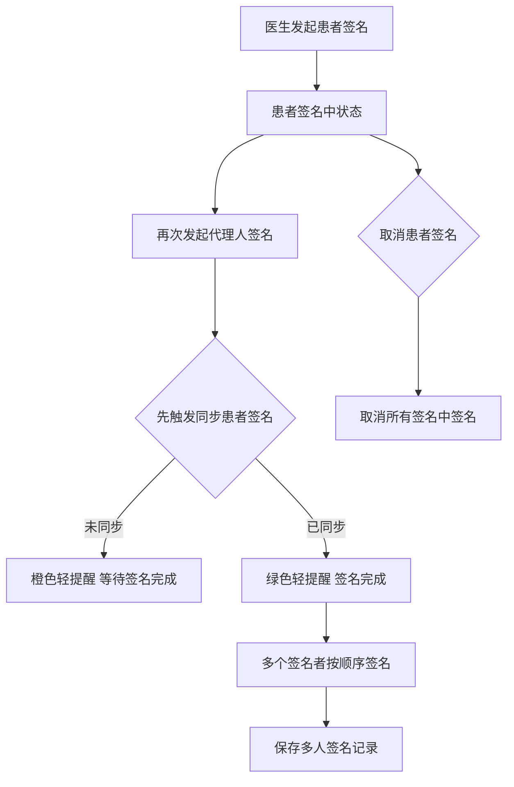
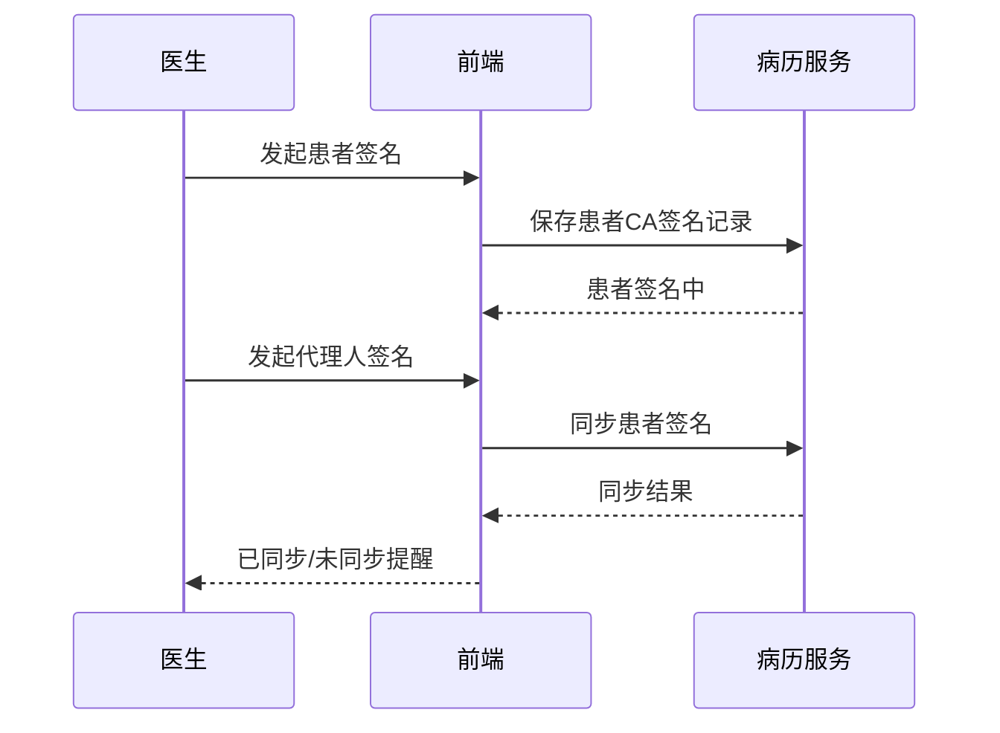

# BLGL-15-QM-003 多人代理人签名 - Spec

> **功能编号**：BLGL-15-QM-003
> **文档类型**：功能Spec（业务背景与设计）
> **文档版本**：V1.0
> **编写时间**：2026-08-15
> **编写人**：RACC

---

## 文档索引

#

### 章节索引

**本文档（功能Spec：业务背景与设计）**

| 章节号 | 章节名称 | 内容说明 |
|

----

----|

----

-----|

----

-----|
| 第1章 | 文档概述 | 文档目的、文档范围、术语定义、阅读指南、参考文档 |
| 第2章 | 功能背景与定位 | 功能背景、功能定位、目标用户、核心价值 |
| 第3章 | 业务流程设计 | 主流程/异常流程/边界流程（Given/When/Then） |
| 第4章 | 数据模型设计 | 核心数据结构、状态定义、系统参数定义 |
| 第5章 | 接口契约设计 | API列表、接口详细设计、错误码定义 |
| 第6章 | 技术方案设计 | 页面路径、技术栈、关键技术点、部署方案 |
| 第7章 | 测试用例预设计 | 功能/边界/异常/性能测试用例 |
| 第8章 | 非功能性要求 | 性能、安全、可用性、兼容性 |
| 第9章 | 依赖与风险 | 外部依赖、风险项 |
| 第10章 | 附录 | 流程图、时序图、参考文档 |

**PM-Spec（需求规格）**：目标/约束/验收标准/排除范围/关键决策/优先级
**Analyst-Spec（分析规格）**：功能编号体系/核心业务流程/功能规格/排除范围/业务规则/关联文档/待确认问题

#

### 版本历史

| 版本 | 日期 | 变更说明 | 编写人 |
|

------|

------|

----

-----|

----

----|
| V1.0 | 2026-08-15 | 初始版本 | RACC |

#

### 关联文档索引

| 序号 | 文档名称 | 文档类型 | 版本 | 位置 |
|

------|

----

-----|

----

-----|

------|

------|
| 1 | BLGL-15-QM-003_多人代理人签名_Spec.md | 功能Spec（业务背景与设计）（本文档） | V1.0 | 本目录 |
| 2 | BLGL-15-QM-003_多人代理人签名_PM-spec.md | PM-Spec（需求规格） | V0.1 | 本目录 |
| 3 | BLGL-15-QM-003_多人代理人签名_Analyst-spec.md | Analyst-Spec（分析规格） | V1.0 | 本目录 |
| 4 | BLGL-15-QM CA签名功能点Spec.md | 功能点Spec（模块级） | V1.0 | 上级目录 |

---

## 1、文档概述

#

## 1.1、文档目的

本文档旨在明确"多人代理人签名"功能（BLGL-15-QM-003）的业务背景与设计方案，为需求分析、研发实现、测试验收及评审提供统一的业务上下文、设计口径与决策依据。

**具体目的包括**：

1. 梳理多人代理人签名功能的业务由来与历史需求演进脉络，说明"为什么要做"；
2. 明确功能的定位边界、目标用户与核心价值，回答"做成什么"；
3. 描述功能的业务流程、数据模型、接口契约与技术方案，回答"怎么做"；
4. 预设计测试用例并明确非功能性要求、依赖与风险，为研发与验收提供依据；
5. 作为 Analyst-Spec 的业务前提与设计输入，保证各层文档业务口径一致。

#

## 1.2、文档范围

#

#

## 1.2.1 纳入范围

本文档覆盖多人代理人签名的完整业务背景与设计，包括：

- 多人签名：多个患者/家属签名、签名顺序- 代理人签名：患者/代理人签名、代理人信息维护- 签名同步校验：签名前同步患者签名、未同步提醒- 取消签名：取消所有签名中的患者/代理人签名- 代理人关系回写：代理人关系/身份证号回写至病历文书- 签名人姓名入参：患者签名事件增加签名人姓名#

#

## 1.2.2 排除范围

本文档不涉及以下内容（详见其他功能点或模块）：

- 医生CA签名 —— BLGL-15-QM-001
- 患者签名—— BLGL-15-QM-002
- CA接口对接—— BLGL-15-QM-004
- CA签名配置与方式 —— BLGL-15-QM-005
- 签名图片与PDF处理 —— BLGL-15-QM-006
- CA校验与签名流程 —— BLGL-15-QM-007

#

## 1.3、术语定义

| 术语 | 定义 |
|

------|

------|
| 多人签名 | 同一病历多个患者/家属/代理人签名|
| 法定代理人 | 患者签名中法定代理人签名数据元（399660559）|
| 患者签名信息维护 | 右键菜单维护患者联系人/代理人信息|
| 签名同步 | 发起签名前先触发【同步患者签名】|

#

## 1.4、阅读指南


- **章节关系**：第1~2章为业务全貌，第3~10章为设计实现层。与 Analyst-Spec、PM-Spec 互相引用保持一致。

- **读者对象**：产品经理/需求分析师读第1~2章；研发读第3~6、9~10章；测试读第3、7~8章；评审人员核对各层一致性。

#

## 1.5、参考文档

| 序号 | 文档名称 | 版本/日期 |
|

------|

----

-----|

----

------|
| 1 | 【历史需求】住院病历的历史需求.xlsx | - |
| 2 | BLGL-15-QM-003_多人代理人签名_PM-spec.md | V0.1 |
| 3 | BLGL-15-QM-003_多人代理人签名_Analyst-spec.md | V1.0 |
| 4 | BLGL-15-QM CA签名功能点Spec.md | V1.0 |

---

## 2、功能背景与定位

#

## 2.1 功能背景

多人代理人签名是 CA 签名模块的多人协同层（L1），需满足：


- **现状痛点**：病历多个患者/代理人签名都是患者签名中状态时取消签名逻辑复杂；同意书多人患者签名报错；中医科知情同意书患者签名和家属签名乱
- **管理要求**：有线签名只能签患者或联系人签名，无法录入联系人其他信息，需支持维护联系人信息并引用到病历
- **历史需求演进**：患者/代理人签名→ 代理人信息维护→ 代理人关系回写→ 签名人姓名入参

#

## 2.2 功能定位

"多人代理人签名"是 WiNEX 病历管理-CA签名的多人协同层，定位为：


- **多人协同**：多个患者/家属/代理人签名
- **签名管控**：签名前同步校验、取消签名
- **代理人维护**：代理人信息维护/关系回写

#

## 2.3 目标用户

| 用户角色 | 主要使用场景 |
|

----

-----|

----

----

-----|
| 患者 | 患者签名 |
| 家属/代理人 | 法定代理人签名 |
| 住院医生 | 发起多人代理人签名、维护代理人信息 |

#

## 2.4 核心价值

| 价值维度 | 价值描述 |
|

----

-----|

----

-----|
| 多人合规 | 多个签名者电子签名合规|
| 签名管控 | 签名前同步校验、未同步提醒|
| 代理人可溯 | 代理人信息维护/关系回写|

---

## 3、业务流程设计（Given/When/Then）

#

## 3.1 主流程

**Scenario 1: 多人代理人签名**

```gherkin
Given:
  - 病历需要患者/代理人/家属多人签名

When:
  - 医生发起患者签名
  - 再次发起代理人签名

Then:
  - 发起签名前先触发【同步患者签名】
  - 未同步到橙色轻提醒"已发起患者/代理人签名，请耐心等待签名完成"
  - 已同步到绿色轻提醒"患者/代理人签名完成，病历已刷新"
  - 多个签名者按顺序签名
```

#

## 3.2 异常流程

**Scenario 2: 业务异常——多人签名报错**

```gherkin
Given:
  - 同意书多人患者签名

When:
  - 发起多人签名

Then:
  - 报错（问题）
  - 需排查多人签名逻辑
```

**Scenario 3: 数据异常——患者/家属签名乱**

```gherkin
Given:
  - 中医科知情同意书

When:
  - 患者和家属签名

Then:
  - 签名乱（问题）
  - 需调查原因并处理历史签名问题
```

**Scenario 4: 系统异常——提交走到多人签名方法**

```gherkin
Given:
  - 住院病历提交

When:
  - 提交

Then:
  - 走到了多人签名方法（问题）
  - 需排查提交签名逻辑
```

#

## 3.3 边界流程

**Scenario 5: 边界——取消患者签名**

```gherkin
Given:
  - 病历多个患者/代理人签名都是患者签名中状态

When:
  - 点击【取消患者签名】

Then:
  - 取消所有签名中的患者/代理人签名
  - 病历只有一个签名时取消该签名
```

**Scenario 6: 边界——代理人信息维护**

```gherkin
Given:
  - 文书有代理人或被授权人签名

When:
  - 医生右键【患者签名信息维护】

Then:
  - 支持维护法定代理人、与患者关系、证件类型、证件号码
  - 维护一次之后后面选择即可
  - 病历创建时自动带入文书
```

---

## 4、数据模型设计

#

## 4.1 核心数据结构

#

#

## 4.1.1 核心保存请求

| 字段名 | 类型 | 必填 | 备注 |
|

----

----|

------|

------|

------|
| 签名人姓名 | String | 是 | trusteeName|
| 患者关系类别 | String | 是 | PatientRelativeType，0-本人|
| 法定代理人 | String | 否 | 法定代理人签名维护|
| 与患者关系 | String | 否 | 关系代码 399336335|

> ⏳ 待确认：多人签名接口完整入参/出参以 API 契约为准。

#

#

## 4.1.2 核心表/实体

| 表/实体 | 关键字段 | 说明 |
|

----

-----|

----

-----|

------|
| INP_EMR_PATIENT_CA_RECORD（InpEmrPatientCaRecordPO） | emrPatientCaRecordId、patientName、idcardNo(IDCARD_NO)、relationshipWithPatientDesc、legalRepresentativePhone(AGENT_CONTACT_NO)、personalPhone(CONTACT_NO)、agentIdCard(AGENT_IDCARD_NO)、fingerName(FINGER_NAME) | 患者CA签名记录表（含代理人信息，来源：代码） |

#

## 4.2 状态定义

| 状态码 | 状态名称 | 说明 |
|

----

----|

----

-----|

------|
| - | 患者签名中 | 签名发起未完成|
| - | 患者已签名 | 签名完成|

#

## 4.3 系统参数定义

| ⏳ 待确认 | 多人代理人签名无独立参数 | 依赖患者签名参数（COMMON234/253/260/265） |

---

## 5、接口契约设计

#

## 5.1 API列表

| 序号 | API名称（代码函数） | 路径 | 方法 | 说明 |
|:

----:|

----

-----|

------|:

----:|

------|
| 1 | 保存住院病历患者CA签名记录 | /api/v1/app_record_inpatient/inpatient_emr/patient_ca_record/save | POST | 多人签名记录保存（入参 InpEmrPatCaRecordSaveInputAO）|
| 2 | 查询住院病历患者CA签名记录 | /api/v1/app_record_inpatient/inpatient_emr/patient_ca_record/query/by_example | POST | 多人签名记录查询（入参 InpEmrPatCaRecordInputAO）|
| 3 | 患者签名实时获取 | /api/v1/app_record_inpatient/emr_pat_signature/query/by_example | POST | 签名同步（入参 InpEmrSignatureImageSyncInputAO）|
| 4 | 清空签名图片地址 | /api/v1/app_record_inpatient/emr_pat_signature/del | POST | 取消签名|

#

## 5.2 接口详细设计

#

#

## 5.2.1 保存患者CA签名记录（patient_ca_record/save，多人）

**请求参数**:
```json
{
  "inpEmrSetId": "12345",
  "caSignatureNo": "CA20260815002",
  "signatureUrl": "https://.../agent_signature.png",
  "patientName": "李四",
  "relationshipWithPatientDesc": "法定代理人",
  "agentIdCard": "110101199002022345",
  "trusteeName": "李四"
}
```

**返回值（成功）**:
```json
{
  "success": true,
  "data": null
}
```

> ⏳ 待确认：多人签名接口字段以代码扫描（InpEmrPatCaRecordSaveInputAO）和 API 契约为准。

**返回值（失败）**:
```json
{
  "success": false,
  "message": "已发起患者/代理人签名，请耐心等待签名完成",
  "data": null
}
```

#

## 5.3 错误码定义

| 错误码 | 错误信息 | 处理方式 |
|

----

----|

----

-----|

----

-----|
| ⏳ 待确认 | 已发起患者/代理人签名，请耐心等待签名完成 | 橙色轻提醒|
| ⏳ 待确认 | 患者/代理人签名完成，病历已刷新 | 绿色轻提醒|

---

## 6、技术方案设计

#

## 6.1 页面路径


- **页面路径**: 住院医生站→住院病历书写界面→患者签名对话框（PatientSignDialog）+ 右键【患者签名信息维护】

- **后端模块**: winning-emr-ipt-emrset/.../controller/sign/EmrSignatureImageController.java（患者签名实时获取、保存/查询患者CA签名记录）
- **前端 mixin**: src/mixin/emrEditor/patientCaAction.js（患者CA签名流程，含多人签名）
- **前端 API**: src/api/global.js patientCaApi（saveSignatureRecordID/getSignatureRecordID）

#

## 6.2 技术栈

| 类别 | 技术 | 版本 |
|

------|

------|

------|
| 前端框架 | Vue | 2.6.14 |
| 前端UI | element-ui | 2.13.0 |
| 签名组件 | PatientSignDialog + @winex-plugin/win-ca | - |
| 后端框架 | Spring Boot（Java 17）+ JPA/Hibernate | - |
| RPC | winning-akso-rpc-rest | - |

#

## 6.3 关键技术点

- 发起患者/代理人签名后患者签名中状态，再次发起需先触发【同步患者签名】- 患者签名事件增加入参签名人姓名（trusteeName）、患者关系类别（PatientRelativeType，0-本人）- 右键【患者签名信息维护】维护法定代理人/关系/证件类型/证件号码

#

## 6.4 部署方案

⏳ 待确认：部署方案未在资料区中找到。

---

## 7、测试用例预设计

#

## 7.1 功能测试

| 用例编号 | 测试场景 | Given | When | Then |
|

----

-----|

----

-----|

----

---|

------|

------|
| TC-001 | 多人签名 | 病历需多人签名 | 患者+代理人签名 | 按顺序签名，状态更新 |

#

## 7.2 边界测试

| 用例编号 | 测试场景 | Given | When | Then |
|

----

-----|

----

-----|

----

---|

------|

------|
| TC-002 | 取消患者签名 | 多个签名者签名中 | 点击取消患者签名 | 取消所有签名中的签名 |

#

## 7.3 异常测试

| 用例编号 | 测试场景 | Given | When | Then |
|

----

-----|

----

-----|

----

---|

------|

------|
| TC-003 | 签名未同步 | 代理人签名未同步 | 再次发起 | 橙色提醒等待签名完成 |

#

## 7.4 性能测试

| 用例编号 | 测试场景 | 指标 |
|

----

-----|

----

-----|

------|
| TC-004 | 多人签名响应 | ⏳ 待确认：性能指标未在资料区中找到 |

---

## 8、非功能性要求

#

## 8.1 性能要求

| 指标 | 要求 |
|

------|

------|
| 多人签名响应时间 | ⏳ 待确认 |

#

## 8.2 安全要求

| 要求 | 说明 |
|

------|

------|
| 签名管控 | 签名前同步校验，未同步不发起|
| 代理人隐私 | 代理人身份证号维护需合规|

**医疗行业特殊要求**

| 要求 | 说明 |
|

------|

------|
| 多人签名合规 | 多个签名者电子签名保证法律效力|

#

## 8.3 可用性要求

| 指标 | 要求值 |
|

------|

----

----|
| 可用性 | ⏳ 待确认 |

#

## 8.4 兼容性要求

| 类型 | 要求 |
|

------|

------|
| 签名数据元 | 患者签名399556072/法定代理人签名399660559|
| 签名顺序 | 患者/家属签名顺序正确|

---

## 9、依赖与风险

#

## 9.1 外部依赖

| 依赖项 | 说明 |
|

----

----|

------|
| 患者签名系统 | 多人签名同步|

#

## 9.2 风险项

| 风险项 | 等级 | 说明 | 应对方案 |
|

----

----|

------|

------|

----

-----|
| 多人签名报错 | 中 | 同意书多人签名报错| 排查多人签名逻辑 |
| 签名顺序乱 | 中 | 患者/家属签名乱| 修复签名顺序 |

---

## 10、附录

#

## 10.1 流程图



#

## 10.2 时序图



#

## 10.3 参考文档

- 【历史需求】住院病历的历史需求.xlsx- BLGL-15-QM CA签名功能点Spec.md（V1.0，第5章 BLGL-15-QM-003 行）
- 关联Spec: BLGL-15-QM-003_多人代理人签名_PM-spec.md、BLGL-15-QM-003_多人代理人签名_Analyst-spec.md

---

## 填写检查清单

| 序号 | 检查项 | 是否完成 |
|:

----:|

----

----|:

----

----:|
| 1 | 章节索引与正文章节一致 | ✅ |
| 2 | 版本历史记录完整 | ✅ |
| 3 | 关联文档索引已登记全部Spec | ✅ |
| 4 | 文档目的明确回答"为什么做/做成什么/怎么做" | ✅ |
| 5 | 纳入范围/排除范围清晰 | ✅ |
| 6 | 术语定义覆盖关键概念，从资料区可溯源 | ✅ |
| 7 | 参考文档已登记 | ✅ |
| 8 | 功能背景基于法规/规范/需求来源组织 | ✅ |
| 9 | 功能定位体现业务价值（3~5个定位点） | ✅ |
| 10 | 目标用户角色覆盖完整，在需求原文中有出处 | ✅ |
| 11 | 核心价值可陈述，与 Phase 1 口径一致 | ✅ |
| 12 | 业务流程：主流程≥1、异常≥3、边界≥2，Given/When/Then 具体 | ✅ |
| 13 | 数据模型：字段/表/状态/参数可溯源 | ✅ |
| 14 | 接口契约：API列表+详细设计+错误码齐全或标记待确认 | ✅ |
| 15 | 技术方案：页面路径/技术栈/关键点/部署方案或标记待确认 | ✅ |
| 16 | 测试用例：功能/边界/异常/性能覆盖 | ✅ |
| 17 | 非功能性要求：性能/安全/可用性/兼容性指标可量化或标记待确认 | ✅ |
| 18 | 依赖与风险：外部依赖登记完整 | ✅ |
| 19 | 附录：流程图/时序图与正文流程一致 | ✅ |
| 20 | 全文无占位符 `< >` 残留 | ✅ |
| 21 | 全文陈述可溯源至资料区 | ✅ |
| 22 | 人工审核确认完成 | ⏳ 待确认 |

---

**文档状态**：⬜ 待审核
**维护责任**：RACC
**下次更新**：根据评审反馈优化
