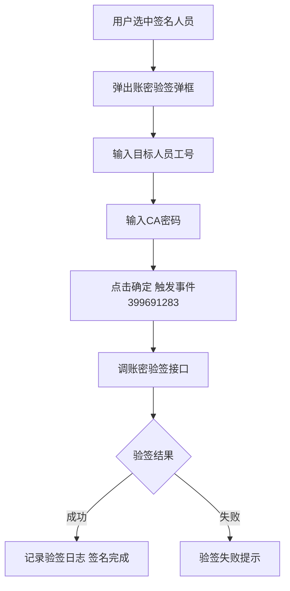
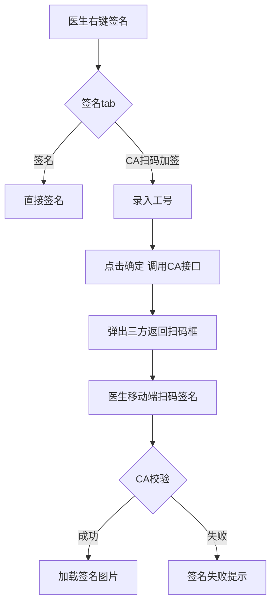

# BLGL-15-QM-004 CA接口对接 _ Analyst - Spec

> **需求编号**：BLGL-15-QM-004
> **父需求**：BLGL-15-QM
> **关联PM Spec**：BLGL-15-QM-004_CA接口对接_PM-spec.md
> **Spec版本**：V1.0
> **编写时间**：2026-08-15
> **编写人**：需求分析师

---

## 一、功能编号体系

#

## 1.1 功能层级结构

```
BLGL-15-QM-004-001: 账密验签
  ├─ BLGL-15-QM-004-001-01: 账密验签弹框
  ├─ BLGL-15-QM-004-001-02: 签名密码设置/修改
  └─ BLGL-15-QM-004-001-03: 验签日志

BLGL-15-QM-004-002: CA厂商对接
  ├─ BLGL-15-QM-004-002-01: 信手书对接
  ├─ BLGL-15-QM-004-002-02: 北京CA对接
  └─ BLGL-15-QM-004-002-03: 医信签对接

BLGL-15-QM-004-003: 扫码签名
  ├─ BLGL-15-QM-004-003-01: CA扫码加签
  └─ BLGL-15-QM-004-003-02: 移动端扫码签名

BLGL-15-QM-004-004: 病案首页CA签名推送
  └─ BLGL-15-QM-004-004-01: 推送签名信息到CA应用

BLGL-15-QM-004-005: CA签名查询
  ├─ BLGL-15-QM-004-005-01: CA查询记录调用方式
  └─ BLGL-15-QM-004-005-02: CA签名记录查询
```

#

## 1.2 功能编号表

| REQ-ID | 功能名称 | 类型 | 优先级 | 说明 |
|

----

----|

----

-----|

------|

----

----|

------|
| BLGL-15-QM-004-001 | 账密验签 | 功能 | P0 | 账密验签|
| BLGL-15-QM-004-001-01 | 账密验签弹框 | 子功能 | P0 | 输入工号/CA密码|
| BLGL-15-QM-004-001-02 | 签名密码设置/修改 | 子功能 | P1 | 支持修改|
| BLGL-15-QM-004-001-03 | 验签日志 | 子功能 | P1 | 记录验签日志|
| BLGL-15-QM-004-002 | CA厂商对接 | 功能 | P0 | 厂商对接|
| BLGL-15-QM-004-002-01 | 信手书对接 | 子功能 | P0 | 卫宁患者CA标准接口|
| BLGL-15-QM-004-002-02 | 北京CA对接 | 子功能 | P0 | 患签对接|
| BLGL-15-QM-004-002-03 | 医信签对接 | 子功能 | P1 | 患者手写板交互|
| BLGL-15-QM-004-003 | 扫码签名 | 功能 | P0 | 扫码签名|
| BLGL-15-QM-004-003-01 | CA扫码加签 | 子功能 | P0 | 录入工号调CA接口|
| BLGL-15-QM-004-003-02 | 移动端扫码签名 | 子功能 | P0 | 移动端扫码|
| BLGL-15-QM-004-004 | 病案首页CA签名推送 | 功能 | P1 | CA推送|
| BLGL-15-QM-004-004-01 | 推送签名信息到CA应用 | 子功能 | P1 | 北京CA电子签名应用|
| BLGL-15-QM-004-005 | CA签名查询 | 功能 | P1 | CA查询|
| BLGL-15-QM-004-005-01 | CA查询记录调用方式 | 子功能 | P1 | 业务中台/混合框架|
| BLGL-15-QM-004-005-02 | CA签名记录查询 | 子功能 | P1 | casignature/query|

---

## 二、核心业务流程

#

## 2.1 账密验签主流程



#

## 2.2 扫码签名流程



---

## 三、功能规格说明

### BLGL-15-QM-004-001: 账密验签

#

#

## 3.1.1 功能概述

根据普天同签提供的 CA 文档 4.1 验证签名密码、签名密码设置或修改，拓展账密验签 CA 的方式，支持账密验签及修改密码。新增账密验签 CA 的方式：用户在文书模板里选中一个人员，弹出账密验签的弹框，输入目标人员的工号、CA密码，调账密验签接口。CA验签事件：事件代码 399691283，输入工号、CA密码，点击"确定"通过该事件调接口触发验签，记录验签日志。

#

#

## 3.1.2 用户角色

| 角色 | 使用场景 | 权限要求 | 操作频率 |
|

------|

----

-----|

----

-----|

----

-----|
| 住院医生 | 手术安全核查表验签 | 病历书写权限 | 中频 |

#

#

## 3.1.3 业务流程（Given/When/Then）

**Scenario 1: 账密验签（主流程）**

```gherkin
Given:
  - 手术安全核查表场景特殊，手术医生不便使用电脑

When:
  - 用户在文书模板中选中一个人员
  - 弹出账密验签弹框
  - 输入工号、CA密码
  - 点击确定（事件399691283）

Then:
  - 调账密验签接口触发验签
  - 记录验签日志
  - 支持签名密码设置或修改
```

#

#

## 3.1.4 数据字段定义

| 字段名 | 类型 | 必填 | 默认值 | 取值范围 | 说明 | 概念ID |
|

----

----|

------|

------|

----

----|

----

-----|

------|

----

----|
| 工号 | String | 是 | - | - | 账密验签| ⏳ 待确认 |
| CA密码 | String | 是 | - | - | 账密验签| ⏳ 待确认 |
| 验签事件 | String | 是 | - | 399691283 | CA验签事件代码| 399691283 |

#

#

## 3.1.5 验收标准

| AC编号 | 验收标准 | 对应REQ-ID | 验证方法 | 验证场景 |
|

----

----|

----

-----|

----

----

---|

----

-----|

----

-----|
| AC-001 | 账密验签（事件399691283）输入工号/CA密码触发验签，记录验签日志 | BLGL-15-QM-004-001 | 功能测试 | Scenario 1 |

---

### BLGL-15-QM-004-002: CA厂商对接

#

#

## 3.2.1 功能概述

对接北京CA患者签名卫宁患者CA标准接口（信手书）接口、北京CA患签对接、医信签患者手写板交互。卫宁患者CA标准接口（信手书）入参缺少医生信息需补充。

#

#

## 3.2.2 用户角色

| 角色 | 使用场景 | 权限要求 | 操作频率 |
|

------|

----

-----|

----

-----|

----

-----|
| 住院医生 | 患者签名 | 病历书写权限 | 中频 |
| CA厂商 | 签名接口对接 | 接口对接 | 中频 |

#

#

## 3.2.3 业务流程（Given/When/Then）

**Scenario 1: 信手书对接（主流程）**

```gherkin
Given:
  - 医院需对接信手书患者签名

When:
  - 调用信手书接口

Then:
  - 患者签名成功
  - 入参需含医生信息
```

**Scenario 2: 异常——北京CA缺失ywxx参数**

```gherkin
Given:
  - 温州市第七人民医院对接北京CA

When:
  - 患者签名接口调用

Then:
  - 因缺失 ywxx 参数异常（问题）
  - 需补充 ywxx 参数
```

**Scenario 3: 异常——信手书报错**

```gherkin
Given:
  - 知情同意书调用信手书CA签名

When:
  - 签名

Then:
  - PDF 不存在适配签署关键字，签名失败
```

#

#

## 3.2.4 数据字段定义

| ⏳ 待确认 | CA厂商对接无独立数据字段 | 依赖CA厂商API |

#

#

## 3.2.5 验收标准

| AC编号 | 验收标准 | 对应REQ-ID | 验证方法 | 验证场景 |
|

----

----|

----

-----|

----

----

---|

----

-----|

----

-----|
| AC-002 | 对接信手书/北京CA/医信签患者签名接口 | BLGL-15-QM-004-002 | 集成测试 | Scenario 1 |

---

### BLGL-15-QM-004-003: 扫码签名

#

#

## 3.3.1 功能概述

右键【签名】时分成【签名】和【CA扫码加签】tab，在【CA扫码加签】tab录入工号后点击【确定】，调用CA接口，弹出三方返回的扫码框，由医生在移动端进行扫码签名。若CA校验成功，则在病历中鼠标定位的地方加载签名图片；校验失败则签名失败，不加载签名图片，并提示"CA签名失败"；若医生工号录入错误则提示"工号查询失败，请录入正确工号"。

#

#

## 3.3.2 用户角色

| 角色 | 使用场景 | 权限要求 | 操作频率 |
|

------|

----

-----|

----

-----|

----

-----|
| 住院医生 | 扫码加签 | 病历书写权限 | 中频 |

#

#

## 3.3.3 业务流程（Given/When/Then）

**Scenario 1: 扫码签名（主流程）**

```gherkin
Given:
  - 医生右键【签名】

When:
  - 选择【CA扫码加签】tab
  - 录入工号点击确定

Then:
  - 调用CA接口
  - 弹出三方返回扫码框
  - 医生移动端扫码签名
  - CA校验成功则加载签名图片
  - 校验失败提示"CA签名失败"
```

**Scenario 2: 异常——工号录入错误**

```gherkin
Given:
  - 医生工号录入错误

When:
  - 点击确定

Then:
  - 提示"工号查询失败，请录入正确工号"
```

#

#

## 3.3.4 数据字段定义

| 字段名 | 类型 | 必填 | 默认值 | 取值范围 | 说明 | 概念ID |
|

----

----|

------|

------|

----

----|

----

-----|

------|

----

----|
| 工号 | String | 是 | - | - | 扫码加签| ⏳ 待确认 |

#

#

## 3.3.5 验收标准

| AC编号 | 验收标准 | 对应REQ-ID | 验证方法 | 验证场景 |
|

----

----|

----

-----|

----

----

---|

----

-----|

----

-----|
| AC-003 | 扫码签名：录入工号调CA接口弹出三方扫码框，医生移动端扫码签名 | BLGL-15-QM-004-003 | 功能测试 | Scenario 1 |

---

### BLGL-15-QM-004-004: 病案首页CA签名推送

#

#

## 3.4.1 功能概述

病案首页需要多位医护人员签名，采用推送的方式将签名信息推送到北京CA电子签名手机应用程序上，用户在应用程序上确认签名。病案首页完成后在首页元素中选择需要签名的人员，全部人员签完名之后病案首页才能提交。增加事件参数 pdfBase64（上级签名时需要审阅的pdf）。

#

#

## 3.4.2 用户角色

| 角色 | 使用场景 | 权限要求 | 操作频率 |
|

------|

----

-----|

----

-----|

----

-----|
| 病案管理员 | 病案首页签名推送 | 病案权限 | 低频 |
| 医护人员 | CA应用确认签名 | - | 中频 |

#

#

## 3.4.3 业务流程（Given/When/Then）

**Scenario 1: 病案首页CA推送（主流程）**

```gherkin
Given:
  - 病案首页需要多位医护人员签名

When:
  - 首页签名时推送签名信息到CA应用

Then:
  - 用户在应用程序上确认签名
  - 全部人员签完名后病案首页才能提交
  - 上级签名时增加 pdfBase64 事件参数
```

#

#

## 3.4.4 数据字段定义

| 字段名 | 类型 | 必填 | 默认值 | 取值范围 | 说明 | 概念ID |
|

----

----|

------|

------|

----

----|

----

-----|

------|

----

----|
| pdfBase64 | String | 否 | - | - | 上级签名需审阅的pdf| ⏳ 待确认 |

#

#

## 3.4.5 验收标准

| AC编号 | 验收标准 | 对应REQ-ID | 验证方法 | 验证场景 |
|

----

----|

----

-----|

----

----

---|

----

-----|

----

-----|
| AC-004 | 病案首页CA签名推送至CA应用，全部签名后首页可提交 | BLGL-15-QM-004-004 | 集成测试 | Scenario 1 |

---

### BLGL-15-QM-004-005: CA签名查询

#

#

## 3.5.1 功能概述

病历业务配置→病历书写配置→签名参数：新增参数"CA查询记录调用方式"，选项值{业务中台，混合框架}，默认业务中台。参数=业务中台时保持现有功能逻辑，CA签署后病历列表上的"CA签名查询"图标点击后调用业务中台提供的CA查询记录组件；参数=混合框架时点击后触发前端事件"调用CA查询记录"，入参需传当前这份病历CA签名记录中调用成功的CA业务流水集合。

#

#

## 3.5.2 用户角色

| 角色 | 使用场景 | 权限要求 | 操作频率 |
|

------|

----

-----|

----

-----|

----

-----|
| 住院医生 | 病历目录右键CA签名查询 | 病历书写权限 | 低频 |

#

#

## 3.5.3 业务流程（Given/When/Then）

**Scenario 1: CA签名查询（主流程）**

```gherkin
Given:
  - 参数"CA查询记录调用方式"配置

When:
  - 病历列表点击"CA签名查询"图标

Then:
  - 业务中台：调用业务中台CA查询记录组件
  - 混合框架：触发前端事件"调用CA查询记录"，入参传CA业务流水集合
```

#

#

## 3.5.4 数据字段定义

| 字段名 | 类型 | 必填 | 默认值 | 取值范围 | 说明 | 概念ID |
|

----

----|

------|

------|

----

----|

----

-----|

------|

----

----|
| CA查询记录调用方式 | String | 否 | 业务中台 | 业务中台/混合框架 | CA查询参数| ⏳ 待确认 |
| CA业务流水 | String | 否 | - | - | 混合框架入参| ⏳ 待确认 |

#

#

## 3.5.5 验收标准

| AC编号 | 验收标准 | 对应REQ-ID | 验证方法 | 验证场景 |
|

----

----|

----

-----|

----

----

---|

----

-----|

----

-----|
| AC-005 | CA查询记录调用方式（业务中台/混合框架）生效 | BLGL-15-QM-004-005 | 功能测试 | Scenario 1 |

---

## 四、排除范围

本需求不包含以下功能项：

1. **医生CA签名** —— BLGL-15-QM-001
2. **患者签名**（手写板）—— BLGL-15-QM-002
3. **多人代理人签名** —— BLGL-15-QM-003
4. **CA签名配置与方式** —— BLGL-15-QM-005
5. **签名图片与PDF处理** —— BLGL-15-QM-006
6. **CA校验与签名流程** —— BLGL-15-QM-007

---

## 五、业务规则清单

| 规则ID | 规则名称 | 规则描述 | 优先级 |
|

----

----|

----

-----|

----

-----|

------|

----

----|
| BR-001 | 账密验签 | CA验签事件399691283，输入工号/CA密码触发验签，记录验签日志 | P0 |
| BR-002 | 扫码签名 | 右键签名分签名/CA扫码加签tab，扫码成功加载签名图片，失败提示CA签名失败 | P0 |
| BR-003 | 工号校验 | 医生工号录入错误提示"工号查询失败，请录入正确工号" | P0 |
| BR-004 | 首页CA推送 | 病案首页签名推送至北京CA应用，全部签名后首页才能提交 | P1 |
| BR-005 | CA查询方式 | CA查询记录调用方式：业务中台/混合框架，混合框架入参传CA业务流水 | P1 |

---

## 六、关联文档

| 文档类型 | 文档路径 | 说明 |
|

----

-----|

----

-----|

------|
| 功能点Spec | BLGL-15-QM CA签名功能点Spec.md（V1.0，上级目录） | Phase 1 功能点索引 |
| PM spec | 本目录 BLGL-15-QM-004_CA接口对接_PM-spec.md（V0.1） | PM 产出的 Spec 文档 |
| -Spec | 本目录 BLGL-15-QM-004_CA接口对接_Spec.md（V1.0） | 业务背景与目标 Spec |
| data-model.md | 待产出 | 架构师产出的数据建模文档 |
| design.md | 待产出 | 架构师产出的技术方案文档 |
| api-contract.md | 待产出 | 开发经理产出的 API 契约文档 |

---

## 七、待确认问题清单

| 编号 | 问题描述 | 缺失信息 | 影响范围 | 建议补充方 |
|

------|

----

-----|

----

-----|

----

-----|

----

----

---|
| Q-001 | CA厂商接口（账密验签/信手书/北京CA）完整契约 | CA厂商API文档 | -Spec 第5章 | CA厂商/开发经理 |
| Q-002 | 扫码加签功能异常根因 | 需求分析原文缺失 | 3.3.3 | 开发经理 |
| Q-003 | 患者签名弹窗扫码无响应根因 | 需求分析原文缺失 | 3.3.3 | 开发经理 |
| Q-004 | 病案首页CA推送接口字段 | CA厂商API文档 | 3.4.4 | CA厂商/开发经理 |
| Q-005 | 总院区/新老院区CA差异根因 | 需求分析原文缺失 | 3.2.3 | 开发经理 |
| Q-006 | 性能指标（CA验签响应时间） | 资料区无量化指标 | -Spec 第8章 | 产品经理 |

---

## 填写检查清单

| 序号 | 检查项 | 是否完成 |
|:

----:|

----

----|:

----

----:|
| 1 | 功能编号带父子层级 | ✅ |
| 2 | 每个 REQ-ID 有功能概述和用户角色 | ✅ |
| 3 | 主流程至少 1 个 Given/When/Then 场景 | ✅ |
| 4 | 异常流程至少 3 个 Given/When/Then 场景 | ✅ |
| 5 | 边界流程至少 2 个 Given/When/Then 场景 | ✅ |
| 6 | 每个 Given/When/Then 内容具体，不模糊 | ✅ |
| 7 | 数据字段定义完整（字段名、类型、必填、说明、概念ID） | ✅ |
| 8 | 验收标准 AC 编号独立，可验证 | ✅ |
| 9 | 验收标准无"功能正常"等模糊表述 | ✅ |
| 10 | 排除范围明确列出 | ✅ |
| 11 | 业务规则清单列出所有规则，每条标注来源 | ✅ |
| 12 | 流程图使用 Mermaid 格式（≥2 个） | ✅ |
| 13 | 关联文档索引包含 Phase 1 功能点Spec | ✅ |
| 14 | 待确认问题清单汇总了全文所有 ⏳ 项 | ✅ |
| 15 | 全文无占位符 `< >` 残留 | ✅ |
| 16 | 全文陈述可溯源至资料区（S1~S10 溯源核查） | ✅ |
| 17 | 人工审核确认完成 | ⏳ 待确认 |

---

**文档状态**：⬜ 待审核
**维护责任**：需求分析师规范组
**下次更新**：根据评审反馈优化

---

## 版本历史

| 版本 | 日期 | 变更说明 | 编写人 |
|

------|

------|

----

-----|

----

----|
| V1.0 | 2026-08-15 | 初始版本 | 需求分析师 |
