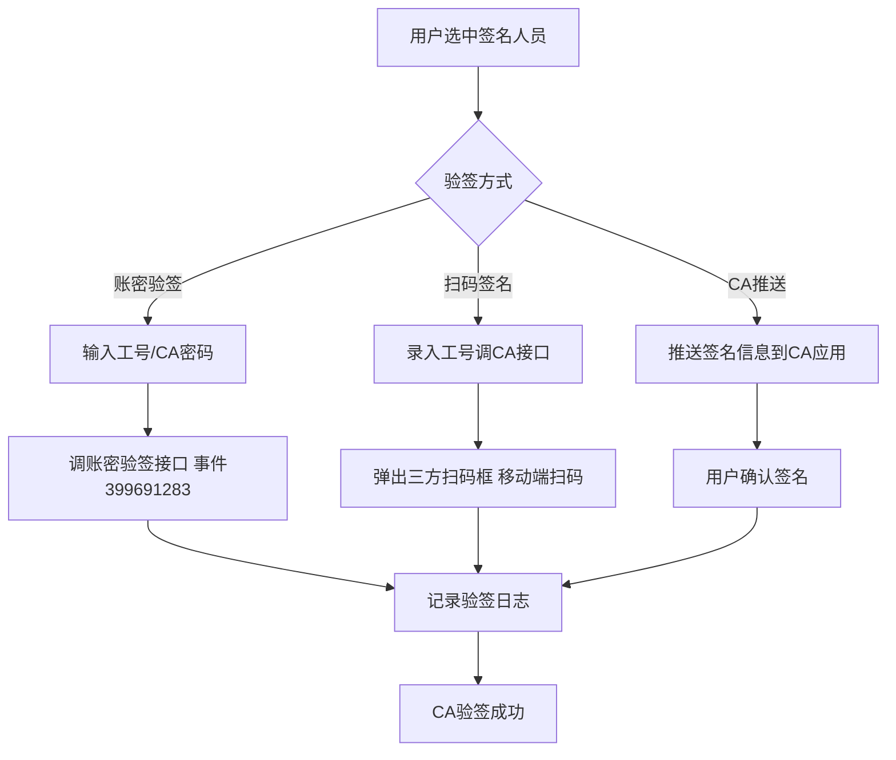
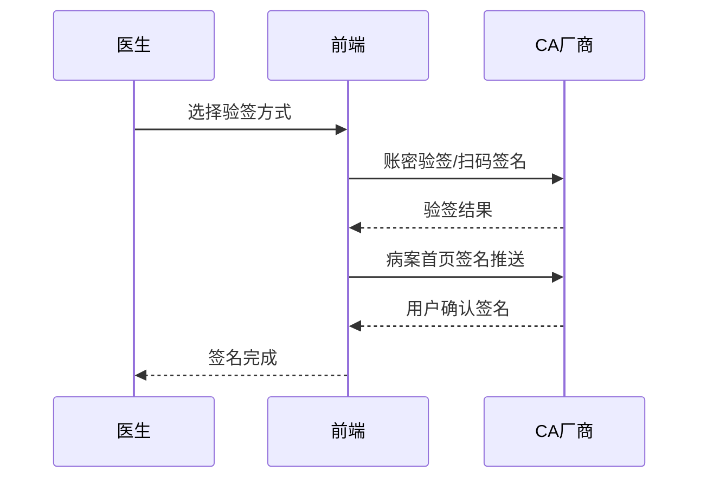

# BLGL-15-QM-004 CA接口对接 - Spec

> **功能编号**：BLGL-15-QM-004
> **文档类型**：功能Spec（业务背景与设计）
> **文档版本**：V1.0
> **编写时间**：2026-08-15
> **编写人**：RACC

---

## 文档索引

#

### 章节索引

**本文档（功能Spec：业务背景与设计）**

| 章节号 | 章节名称 | 内容说明 |
|

----

----|

----

-----|

----

-----|
| 第1章 | 文档概述 | 文档目的、文档范围、术语定义、阅读指南、参考文档 |
| 第2章 | 功能背景与定位 | 功能背景、功能定位、目标用户、核心价值 |
| 第3章 | 业务流程设计 | 主流程/异常流程/边界流程（Given/When/Then） |
| 第4章 | 数据模型设计 | 核心数据结构、状态定义、系统参数定义 |
| 第5章 | 接口契约设计 | API列表、接口详细设计、错误码定义 |
| 第6章 | 技术方案设计 | 页面路径、技术栈、关键技术点、部署方案 |
| 第7章 | 测试用例预设计 | 功能/边界/异常/性能测试用例 |
| 第8章 | 非功能性要求 | 性能、安全、可用性、兼容性 |
| 第9章 | 依赖与风险 | 外部依赖、风险项 |
| 第10章 | 附录 | 流程图、时序图、参考文档 |

**PM-Spec（需求规格）**：目标/约束/验收标准/排除范围/关键决策/优先级
**Analyst-Spec（分析规格）**：功能编号体系/核心业务流程/功能规格/排除范围/业务规则/关联文档/待确认问题

#

### 版本历史

| 版本 | 日期 | 变更说明 | 编写人 |
|

------|

------|

----

-----|

----

----|
| V1.0 | 2026-08-15 | 初始版本 | RACC |

#

### 关联文档索引

| 序号 | 文档名称 | 文档类型 | 版本 | 位置 |
|

------|

----

-----|

----

-----|

------|

------|
| 1 | BLGL-15-QM-004_CA接口对接_Spec.md | 功能Spec（业务背景与设计）（本文档） | V1.0 | 本目录 |
| 2 | BLGL-15-QM-004_CA接口对接_PM-spec.md | PM-Spec（需求规格） | V0.1 | 本目录 |
| 3 | BLGL-15-QM-004_CA接口对接_Analyst-spec.md | Analyst-Spec（分析规格） | V1.0 | 本目录 |
| 4 | BLGL-15-QM CA签名功能点Spec.md | 功能点Spec（模块级） | V1.0 | 上级目录 |

---

## 1、文档概述

#

## 1.1、文档目的

本文档旨在明确"CA接口对接"功能（BLGL-15-QM-004）的业务背景与设计方案，为需求分析、研发实现、测试验收及评审提供统一的业务上下文、设计口径与决策依据。

**具体目的包括**：

1. 梳理 CA 接口对接功能的业务由来与历史需求演进脉络，说明"为什么要做"；
2. 明确功能的定位边界、目标用户与核心价值，回答"做成什么"；
3. 描述功能的业务流程、数据模型、接口契约与技术方案，回答"怎么做"；
4. 预设计测试用例并明确非功能性要求、依赖与风险，为研发与验收提供依据；
5. 作为 Analyst-Spec 的业务前提与设计输入，保证各层文档业务口径一致。

#

## 1.2、文档范围

#

#

## 1.2.1 纳入范围

本文档覆盖 CA 接口对接的完整业务背景与设计，包括：

- 账密验签：普天同签 CA 文档 4.1 验证签名密码- 信手书对接：卫宁患者 CA 标准接口（信手书）- 北京CA对接：北京 CA 患签对接、扫码签名- 医信签对接：医信签患者手写板交互- 病案首页CA签名推送：推送至北京CA电子签名手机应用- CA签名查询：病历目录右键 CA 签名查询#

#

## 1.2.2 排除范围

本文档不涉及以下内容（详见其他功能点或模块）：

- 医生CA签名 —— BLGL-15-QM-001
- 患者签名—— BLGL-15-QM-002
- 多人代理人签名 —— BLGL-15-QM-003
- CA签名配置与方式 —— BLGL-15-QM-005
- 签名图片与PDF处理 —— BLGL-15-QM-006
- CA校验与签名流程 —— BLGL-15-QM-007

#

## 1.3、术语定义

| 术语 | 定义 |
|

------|

------|
| 账密验签 | 输入目标人员工号、CA密码调账密验签接口触发验签|
| 信手书 | 卫宁患者 CA 标准接口|
| 扫码签名 | 弹出三方返回扫码框，医生移动端扫码签名|
| CA签名查询 | 病历列表"CA签名查询"图标，调用 CA 查询记录组件|

#

## 1.4、阅读指南


- **章节关系**：第1~2章为业务全貌，第3~10章为设计实现层。与 Analyst-Spec、PM-Spec 互相引用保持一致。

- **读者对象**：产品经理/需求分析师读第1~2章；研发读第3~6、9~10章；测试读第3、7~8章；评审人员核对各层一致性。

#

## 1.5、参考文档

| 序号 | 文档名称 | 版本/日期 |
|

------|

----

-----|

----

------|
| 1 | 【历史需求】住院病历的历史需求.xlsx | - |
| 2 | BLGL-15-QM-004_CA接口对接_PM-spec.md | V0.1 |
| 3 | BLGL-15-QM-004_CA接口对接_Analyst-spec.md | V1.0 |
| 4 | BLGL-15-QM CA签名功能点Spec.md | V1.0 |

---

## 2、功能背景与定位

#

## 2.1 功能背景

CA接口对接是 CA 签名模块的外部系统协同层（L1），需满足：


- **现状痛点**：卫宁患者 CA 标准接口（信手书）入参缺少医生信息；对接北京 CA 时患者签名接口因缺失 ywxx 参数异常；患者签名弹窗点击扫码无响应
- **管理要求**：病案首页需要多位医护人员签名，采用推送方式将签名信息推送到北京 CA 电子签名手机应用程序
- **历史需求演进**：普天同签账密验签→ 信手书对接→ 北京CA患签→ 病案首页CA推送

#

## 2.2 功能定位

"CA接口对接"是 WiNEX 病历管理-CA签名的外部系统协同层，定位为：


- **CA厂商协同**：普天同签/信手书/北京CA/医信签对接
- **验签方式**：账密验签/扫码签名
- **CA查询**：CA 签名查询记录

#

## 2.3 目标用户

| 用户角色 | 主要使用场景 |
|

----

-----|

----

----

-----|
| 住院医生 | 扫码签名/账密验签 |
| 病案管理员 | 病案首页CA签名推送 |
| CA厂商 | 验签/签名对接 |

#

## 2.4 核心价值

| 价值维度 | 价值描述 |
|

----

-----|

----

-----|
| 厂商兼容 | 支持普天同签/信手书/北京CA/医信签|
| 验签多样 | 账密验签/扫码签名/CA推送|
| 查询可溯 | CA签名查询记录|

---

## 3、业务流程设计（Given/When/Then）

#

## 3.1 主流程

**Scenario 1: 账密验签**

```gherkin
Given:
  - 手术安全核查表场景特殊，手术医生不便使用电脑
  - 医院要求支持账密验签CA

When:
  - 用户在文书模板中选中一个人员
  - 弹出账密验签弹框
  - 输入目标人员工号、CA密码
  - 点击确定（触发事件 399691283）

Then:
  - 调账密验签接口触发验签
  - 记录验签日志
  - 支持签名密码设置或修改
```

#

## 3.2 异常流程

**Scenario 2: 业务异常——扫码签名异常**

```gherkin
Given:
  - 住院病历扫码加签

When:
  - 医生扫码签名

Then:
  - 扫码加签功能异常（问题）
  - 需排查扫码加签逻辑
```

**Scenario 3: 数据异常——信手书入参缺医生信息**

```gherkin
Given:
  - 卫宁患者CA标准接口（信手书）

When:
  - 调用信手书接口

Then:
  - 入参缺少医生信息（问题）
  - 需补充医生信息入参
```

**Scenario 4: 系统异常——北京CA缺失ywxx参数**

```gherkin
Given:
  - 温州市第七人民医院对接北京CA

When:
  - 患者签名接口调用

Then:
  - 因缺失 ywxx 参数异常（问题）
  - 需补充 ywxx 参数
```

#

## 3.3 边界流程

**Scenario 5: 边界——病案首页CA签名推送**

```gherkin
Given:
  - 病案首页需要多位医护人员签名

When:
  - 首页签名时将签名信息推送到CA应用程序

Then:
  - 用户在应用程序上确认签名
  - 全部人员签完名之后病案首页才能提交
  - 上级签名时增加 pdfBase64 事件参数（需审阅的pdf）
```

**Scenario 6: 边界——CA签名查询**

```gherkin
Given:
  - 病历业务配置→病历书写配置→签名参数

When:
  - 配置"CA查询记录调用方式"（业务中台/混合框架）

Then:
  - 业务中台：调用业务中台CA查询记录组件
  - 混合框架：触发前端事件"调用CA查询记录"，入参传CA业务流水集合
```

---

## 4、数据模型设计

#

## 4.1 核心数据结构

#

#

## 4.1.1 核心保存请求

| 字段名 | 类型 | 必填 | 备注 |
|

----

----|

------|

------|

------|
| 工号 | String | 是 | 账密验签|
| CA密码 | String | 是 | 账密验签|
| CA业务流水 | String | 否 | CA查询记录入参|

> ⏳ 待确认：CA接口对接完整入参/出参以 CA 厂商 API 契约为准。

#

#

## 4.1.2 核心表/实体

| 表/实体 | 关键字段 | 说明 |
|

----

-----|

----

-----|

------|
| INP_EMR_CA_SIGNATURE_RECORD（InpatientCASignatureRecordPO） | inpEmrCaId、inpEmrSetId、caSignatureId(CA_SIGNATURE_ID)、caActionCode(CA_ACTION_CODE)、caSuccessFlag(CA_SUCCESS_FLAG)、caSignatureResponse(CA_SIGNATURE_RESPONSE) | CA签名记录表|

#

## 4.2 状态定义

| 状态码 | 状态名称 | 说明 |
|

----

----|

----

-----|

------|
| caSuccessFlag=1 | CA验签成功 | CA签名成功|
| caSuccessFlag=0 | CA验签失败 | CA签名失败|

#

## 4.3 系统参数定义

| 参数编码 | 参数名称 | 说明 |
|

----

-----|

----

-----|

------|
| - | CA查询记录调用方式 | 业务中台/混合框架|

---

## 5、接口契约设计

#

## 5.1 API列表

| 序号 | API名称（代码函数） | 路径 | 方法 | 说明 |
|:

----:|

----

-----|

------|:

----:|

------|
| 1 | 查询病历 CA 签名记录 | /api/v1/app_record_inpatient/emr_inpatient/casignature/query/by_example | POST | CA签名记录查询（入参 CaSignatureRecordQueryInputAO）|
| 2 | 账密验签 | ⏳ 待确认（CA厂商接口，事件399691283） | - | 账密验签|
| 3 | 信手书接口 | ⏳ 待确认（CA厂商接口） | - | 患者签名|
| 4 | 北京CA接口 | ⏳ 待确认（CA厂商接口） | - | 患者签名/扫码|
| 5 | CA签名回写 | /api/v1/record_emr/emr_ca_signed_record_rewrite/save | POST | ca签名回写更新|

#

## 5.2 接口详细设计

#

#

## 5.2.1 账密验签（事件 399691283）

**请求参数**:
```json
{
  "employeeNo": "1001",
  "caPassword": "******"
}
```

**返回值（成功）**:
```json
{
  "success": true,
  "data": null
}
```

> ⏳ 待确认：账密验签接口字段以 CA 厂商 API 契约为准（事件代码 399691283）。

**返回值（失败）**:
```json
{
  "success": false,
  "message": "CA验签失败",
  "data": null
}
```

#

## 5.3 错误码定义

| 错误码 | 错误信息 | 处理方式 |
|

----

----|

----

-----|

----

-----|
| ⏳ 待确认 | PDF 不存在适配签署关键字，签名失败 | 提示信手书签名失败|
| ⏳ 待确认 | 报无关键字 | 排查北京CA对接|

---

## 6、技术方案设计

#

## 6.1 页面路径


- **页面路径**: 住院医生站→住院病历书写界面→签名控件/患者签名对话框（PatientSignDialog）+ 病历目录 CA 签名查询图标

- **后端模块**: winning-emr-ipt-emrset/.../controller/InpatientEmrRecordController.java（查询病历 CA 签名记录）+ winning-emr-opt/.../rest/EmrCaSignedRecordEndpointImpl.java（CA签名回写 RPC）
- **前端**: src/mixin/emrEditor/caAction.js（CA签名流程，@winex-plugin/win-ca）、src/pages/CaSupplementarySignature（CA补签）、src/pages/CounterSign（病历加签）

#

## 6.2 技术栈

| 类别 | 技术 | 版本 |
|

------|

------|

------|
| 前端框架 | Vue | 2.6.14 |
| 前端UI | element-ui | 2.13.0 |
| CA插件 | @winex-plugin/win-ca | - |
| 后端框架 | Spring Boot（Java 17）+ JPA/Hibernate | - |
| RPC | winning-akso-rpc-rest | - |

#

## 6.3 关键技术点

- CA验签事件：事件代码 399691283，输入工号、CA密码触发验签，记录验签日志- 扫码签名：CA扫码加签 tab 录入工号，调CA接口弹出三方扫码框，医生移动端扫码签名- 病案首页CA推送：签名信息推送到北京CA电子签名手机应用程序，增加 pdfBase64 事件参数

#

## 6.4 部署方案

⏳ 待确认：部署方案未在资料区中找到。

---

## 7、测试用例预设计

#

## 7.1 功能测试

| 用例编号 | 测试场景 | Given | When | Then |
|

----

-----|

----

-----|

----

---|

------|

------|
| TC-001 | 账密验签 | 手术安全核查表场景 | 输入工号/CA密码 | 验签成功，记录日志 |
| TC-002 | CA签名记录查询 | 病历目录右键 | 调用 casignature/query/by_example | 返回CA签名记录 |

#

## 7.2 边界测试

| 用例编号 | 测试场景 | Given | When | Then |
|

----

-----|

----

-----|

----

---|

------|

------|
| TC-003 | 病案首页CA推送 | 病案首页多位签名 | 推送到CA应用 | 全部签名后首页可提交 |
| TC-004 | CA签名查询方式 | 参数=混合框架 | 点击CA签名查询 | 触发前端事件调用CA查询记录 |

#

## 7.3 异常测试

| 用例编号 | 测试场景 | Given | When | Then |
|

----

-----|

----

-----|

----

---|

------|

------|
| TC-005 | 扫码加签异常 | 扫码加签 | 医生扫码 | 加签异常需排查 |
| TC-006 | 信手书入参缺医生信息 | 信手书接口 | 调用 | 补充医生信息入参 |

#

## 7.4 性能测试

| 用例编号 | 测试场景 | 指标 |
|

----

-----|

----

-----|

------|
| TC-007 | CA验签响应 | ⏳ 待确认：性能指标未在资料区中找到 |

---

## 8、非功能性要求

#

## 8.1 性能要求

| 指标 | 要求 |
|

------|

------|
| CA验签响应时间 | ⏳ 待确认 |

#

## 8.2 安全要求

| 要求 | 说明 |
|

------|

------|
| 验签安全 | 账密验签密码校验|
| 签名法律效力 | CA签名保证病历法律效力|

**医疗行业特殊要求**

| 要求 | 说明 |
|

------|

------|
| 签名合规 | 病案首页全部人员签完名才能提交|

#

## 8.3 可用性要求

| 指标 | 要求值 |
|

------|

----

----|
| 可用性 | ⏳ 待确认 |

#

## 8.4 兼容性要求

| 类型 | 要求 |
|

------|

------|
| CA厂商 | 普天同签/信手书/北京CA/医信签兼容|
| 登录方式 | CA登录/工号密码登录|

---

## 9、依赖与风险

#

## 9.1 外部依赖

| 依赖项 | 说明 |
|

----

----|

------|
| 普天同签 | 账密验签|
| 信手书 | 患者签名标准接口|
| 北京CA | 患者签名/扫码/推送|
| 医信签 | 患者手写板交互|

#

## 9.2 风险项

| 风险项 | 等级 | 说明 | 应对方案 |
|

----

----|

------|

------|

----

-----|
| 厂商参数差异 | 中 | 北京CA缺失ywxx参数| 按厂商API补充参数 |
| 扫码无响应 | 中 | 患者签名弹窗点击扫码无响应| 排查扫码逻辑 |

---

## 10、附录

#

## 10.1 流程图



#

## 10.2 时序图



#

## 10.3 参考文档

- 【历史需求】住院病历的历史需求.xlsx- BLGL-15-QM CA签名功能点Spec.md（V1.0，第5章 BLGL-15-QM-004 行）
- 关联Spec: BLGL-15-QM-004_CA接口对接_PM-spec.md、BLGL-15-QM-004_CA接口对接_Analyst-spec.md

---

## 填写检查清单

| 序号 | 检查项 | 是否完成 |
|:

----:|

----

----|:

----

----:|
| 1 | 章节索引与正文章节一致 | ✅ |
| 2 | 版本历史记录完整 | ✅ |
| 3 | 关联文档索引已登记全部Spec | ✅ |
| 4 | 文档目的明确回答"为什么做/做成什么/怎么做" | ✅ |
| 5 | 纳入范围/排除范围清晰 | ✅ |
| 6 | 术语定义覆盖关键概念，从资料区可溯源 | ✅ |
| 7 | 参考文档已登记 | ✅ |
| 8 | 功能背景基于法规/规范/需求来源组织 | ✅ |
| 9 | 功能定位体现业务价值（3~5个定位点） | ✅ |
| 10 | 目标用户角色覆盖完整，在需求原文中有出处 | ✅ |
| 11 | 核心价值可陈述，与 Phase 1 口径一致 | ✅ |
| 12 | 业务流程：主流程≥1、异常≥3、边界≥2，Given/When/Then 具体 | ✅ |
| 13 | 数据模型：字段/表/状态/参数可溯源 | ✅ |
| 14 | 接口契约：API列表+详细设计+错误码齐全或标记待确认 | ✅ |
| 15 | 技术方案：页面路径/技术栈/关键点/部署方案或标记待确认 | ✅ |
| 16 | 测试用例：功能/边界/异常/性能覆盖 | ✅ |
| 17 | 非功能性要求：性能/安全/可用性/兼容性指标可量化或标记待确认 | ✅ |
| 18 | 依赖与风险：外部依赖登记完整 | ✅ |
| 19 | 附录：流程图/时序图与正文流程一致 | ✅ |
| 20 | 全文无占位符 `< >` 残留 | ✅ |
| 21 | 全文陈述可溯源至资料区 | ✅ |
| 22 | 人工审核确认完成 | ⏳ 待确认 |

---

**文档状态**：⬜ 待审核
**维护责任**：RACC
**下次更新**：根据评审反馈优化
