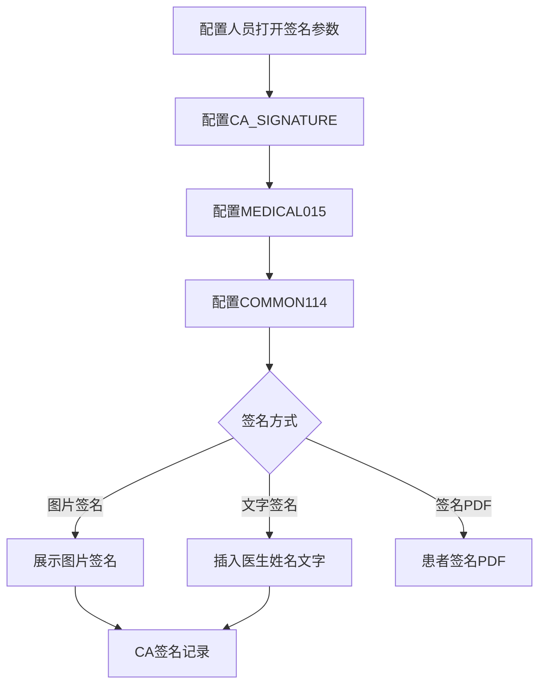
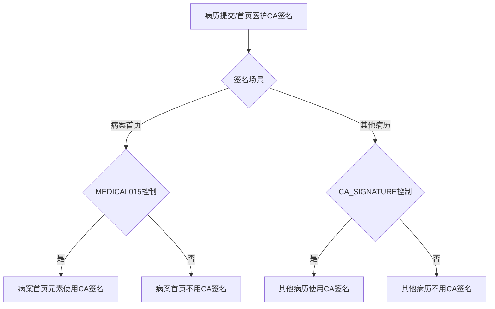

# BLGL-15-QM-005 CA签名配置与方式 _ Analyst - Spec

> **需求编号**：BLGL-15-QM-005
> **父需求**：BLGL-15-QM
> **关联PM Spec**：BLGL-15-QM-005_CA签名配置与方式_PM-spec.md
> **Spec版本**：V1.0
> **编写时间**：2026-08-15
> **编写人**：需求分析师

---

## 一、功能编号体系

#

## 1.1 功能层级结构

```
BLGL-15-QM-005-001: CA签名参数配置
  ├─ BLGL-15-QM-005-001-01: CA_SIGNATURE 参数
  ├─ BLGL-15-QM-005-001-02: MEDICAL015 参数
  ├─ BLGL-15-QM-005-001-03: COMMON071/114/196/234/236/253/260/265 参数
  └─ BLGL-15-QM-005-001-04: CA查询记录调用方式

BLGL-15-QM-005-002: 区分场景CA签名
  ├─ BLGL-15-QM-005-002-01: 病历提交CA签名
  └─ BLGL-15-QM-005-002-02: 首页医护CA签名

BLGL-15-QM-005-003: 签名方式
  ├─ BLGL-15-QM-005-003-01: 图片签名
  ├─ BLGL-15-QM-005-003-02: PDF签名
  └─ BLGL-15-QM-005-003-03: 文字签名

BLGL-15-QM-005-004: 签名图片获取
  └─ BLGL-15-QM-005-004-01: 业务中台/OSS获取
```

#

## 1.2 功能编号表

| REQ-ID | 功能名称 | 类型 | 优先级 | 说明 |
|

----

----|

----

-----|

------|

----

----|

------|
| BLGL-15-QM-005-001 | CA签名参数配置 | 功能 | P0 | 签名参数|
| BLGL-15-QM-005-001-01 | CA_SIGNATURE 参数 | 子功能 | P0 | 是否启用CA签名|
| BLGL-15-QM-005-001-02 | MEDICAL015 参数 | 子功能 | P0 | 病案首页CA签名元素|
| BLGL-15-QM-005-001-03 | COMMON 参数组 | 子功能 | P0 | COMMON071/114等|
| BLGL-15-QM-005-001-04 | CA查询记录调用方式 | 子功能 | P1 | 业务中台/混合框架|
| BLGL-15-QM-005-002 | 区分场景CA签名 | 功能 | P0 | 场景区分|
| BLGL-15-QM-005-002-01 | 病历提交CA签名 | 子功能 | P0 | 受CA_SIGNATURE控制|
| BLGL-15-QM-005-002-02 | 首页医护CA签名 | 子功能 | P0 | 受MEDICAL015控制|
| BLGL-15-QM-005-003 | 签名方式 | 功能 | P0 | 图片/PDF/文字|
| BLGL-15-QM-005-003-01 | 图片签名 | 子功能 | P0 | 启用CA展示图片|
| BLGL-15-QM-005-003-02 | PDF签名 | 子功能 | P1 | 患者签名PDF|
| BLGL-15-QM-005-003-03 | 文字签名 | 子功能 | P0 | 降级文字签名|
| BLGL-15-QM-005-004 | 签名图片获取 | 功能 | P1 | 图片获取|
| BLGL-15-QM-005-004-01 | 业务中台/OSS获取 | 子功能 | P1 | EMPLOYEE_PHOTO|

---

## 二、核心业务流程

#

## 2.1 CA签名参数配置流程



#

## 2.2 区分场景CA签名流程



---

## 三、功能规格说明

### BLGL-15-QM-005-001: CA签名参数配置

#

#

## 3.1.1 功能概述

需要区分场景进行 CA 签名，病历提交、首页医护 CA 签名。病案首页是否采用 CA 签名只受参数 MEDICAL015（病案首页中哪些签名元素使用CA签名）控制；参数 CA_SIGNATURE（是否启用CA签名）控制除病案首页外的监控类型。参数 COMMON114（CA签名的UKEY失效或停用时采用的签名模式）增加下拉值"不阻断流程并插入医生姓名文字"。

#

#

## 3.1.2 用户角色

| 角色 | 使用场景 | 权限要求 | 操作频率 |
|

------|

----

-----|

----

-----|

----

-----|
| 病案管理员 | 配置签名参数 | 配置权限 | 低频 |

#

#

## 3.1.3 业务流程（Given/When/Then）

**Scenario 1: CA签名参数配置（主流程）**

```gherkin
Given:
  - 配置人员打开病历书写配置→签名参数

When:
  - 配置 CA_SIGNATURE、MEDICAL015、COMMON114

Then:
  - 病案首页是否采用CA签名只受 MEDICAL015 控制
  - 除病案首页外的监控类型受 CA_SIGNATURE 控制
  - CA签名失败按 COMMON114 配置降级
```

**Scenario 2: CA查询记录调用方式**

```gherkin
Given:
  - 病历业务配置→病历书写配置→签名参数

When:
  - 配置"CA查询记录调用方式"（业务中台/混合框架）

Then:
  - 业务中台：调用业务中台CA查询记录组件
  - 混合框架：触发前端事件"调用CA查询记录"，入参传CA业务流水集合
```

**Scenario 3: 异常——COMMON114配置不生效**

```gherkin
Given:
  - 参数 COMMON114 配置为"不阻断流程并插入文字图片"

When:
  - 前台未插CA

Then:
  - 仍显示签名图片（问题）
  - 需排查COMMON114配置逻辑
```

#

#

## 3.1.4 数据字段定义

| 字段名 | 类型 | 必填 | 默认值 | 取值范围 | 说明 | 概念ID |
|

----

----|

------|

------|

----

----|

----

-----|

------|

----

----|
| 是否启用CA签名 | Boolean | 否 | - | 是/否 | CA_SIGNATURE| ⏳ 待确认 |
| 病案首页中哪些签名元素使用CA签名 | String | 否 | - | 多选签名元素 | MEDICAL015| ⏳ 待确认 |
| CA签名的UKEY失效或停用时采用的签名模式 | String | 否 | - | 阻断/图片/文字图片/医生姓名文字 | COMMON114| ⏳ 待确认 |
| CA查询记录调用方式 | String | 否 | 业务中台 | 业务中台/混合框架 | CA查询参数| ⏳ 待确认 |

#

#

## 3.1.5 验收标准

| AC编号 | 验收标准 | 对应REQ-ID | 验证方法 | 验证场景 |
|

----

----|

----

-----|

----

----

---|

----

-----|

----

-----|
| AC-001 | CA签名参数配置生效：病案首页受MEDICAL015控制，其他病历受CA_SIGNATURE控制 | BLGL-15-QM-005-001 | 功能测试 | Scenario 1 |
| AC-002 | CA查询记录调用方式（业务中台/混合框架）生效 | BLGL-15-QM-005-001 | 功能测试 | Scenario 2 |

---

### BLGL-15-QM-005-002: 区分场景CA签名

#

#

## 3.2.1 功能概述

需要区分场景进行 CA 签名，病历提交、首页医护 CA 签名。接口组改造：当登录方式采用 CA 登陆时默认为登陆时更新电子签章。

#

#

## 3.2.2 用户角色

| 角色 | 使用场景 | 权限要求 | 操作频率 |
|

------|

----

-----|

----

-----|

----

-----|
| 住院医生 | 病历提交CA签名 | 病历书写权限 | 高频 |
| 病案管理员 | 首页医护CA签名 | 病案权限 | 中频 |

#

#

## 3.2.3 业务流程（Given/When/Then）

**Scenario 1: 区分场景（主流程）**

```gherkin
Given:
  - 病历提交/首页医护CA签名

When:
  - 区分签名场景

Then:
  - 病案首页CA签名受 MEDICAL015 控制
  - 其他病历CA签名受 CA_SIGNATURE 控制
  - CA登陆时默认为登陆时更新电子签章
```

#

#

## 3.2.4 数据字段定义

| ⏳ 待确认 | 场景区分无独立数据字段 | 依赖MEDICAL015/CA_SIGNATURE参数 |

#

#

## 3.2.5 验收标准

| AC编号 | 验收标准 | 对应REQ-ID | 验证方法 | 验证场景 |
|

----

----|

----

-----|

----

----

---|

----

-----|

----

-----|
| AC-003 | 病案首页/其他病历CA签名场景区分生效 | BLGL-15-QM-005-002 | 功能测试 | Scenario 1 |

---

### BLGL-15-QM-005-003: 签名方式

#

#

## 3.3.1 功能概述

住院病历新增签名方式：未调用到 ca 的话签署文字，不生成图片。参数 COMMON114 增加下拉值"不阻断流程并插入医生姓名文字"，CA签名失败后不阻断流程，直接在签名位置插入当前医生的姓名文字。启用 CA 时展示图片签名，不启用 CA 签名时只展示普通宋体文字签名。

#

#

## 3.3.2 用户角色

| 角色 | 使用场景 | 权限要求 | 操作频率 |
|

------|

----

-----|

----

-----|

----

-----|
| 住院医生 | 签名方式选择 | 病历书写权限 | 高频 |

#

#

## 3.3.3 业务流程（Given/When/Then）

**Scenario 1: 文字签名降级（主流程）**

```gherkin
Given:
  - 参数 COMMON114 配置"不阻断流程并插入医生姓名文字"

When:
  - CA签名失败

Then:
  - 不阻断流程
  - 直接在签名位置插入当前医生的姓名文字
  - 不生成签名图片
```

**Scenario 2: 图片/文字签名切换**

```gherkin
Given:
  - 启用CA时

When:
  - 医生签名

Then:
  - 展示图片签名
  - 不启用CA签名时只展示普通宋体文字签名
```

#

#

## 3.3.4 数据字段定义

| 字段名 | 类型 | 必填 | 默认值 | 取值范围 | 说明 | 概念ID |
|

----

----|

------|

------|

----

----|

----

-----|

------|

----

----|
| CA签名的UKEY失效或停用时采用的签名模式 | String | 否 | - | 不阻断流程并插入医生姓名文字等 | COMMON114| ⏳ 待确认 |

#

#

## 3.3.5 验收标准

| AC编号 | 验收标准 | 对应REQ-ID | 验证方法 | 验证场景 |
|

----

----|

----

-----|

----

----

---|

----

-----|

----

-----|
| AC-004 | COMMON114配置"不阻断流程并插入医生姓名文字"时CA失败降级文字签名 | BLGL-15-QM-005-003 | 功能测试 | Scenario 1 |
| AC-005 | 启用CA展示图片签名，不启用展示文字签名 | BLGL-15-QM-005-003 | 功能测试 | Scenario 2 |

---

### BLGL-15-QM-005-004: 签名图片获取

#

#

## 3.4.1 功能概述

住院病历 CA 签名图片获取逻辑修改：业务系统获取当前图片内容和 ID。select EMPLOYEE_PHOTO_ID, EMPLOYEE_PHOTO_CONTENT from EMPLOYEE_PHOTO where EMPLOYEE_ID = ? and HOSPITAL_SOID=? AND EMPLOYEE_PHOTO_CODE = 399784104 AND (ENABLED_FLAG is null or ENABLED_FLAG = 98175) 获取员工当前最新的图片。业务系统存储 EMPLOYEE_PHOTO_ID 字段，该内容可以和 OSS 的内容兼容。

#

#

## 3.4.2 用户角色

| 角色 | 使用场景 | 权限要求 | 操作频率 |
|

------|

----

-----|

----

-----|

----

-----|
| 住院医生 | 签名图片获取 | 病历书写权限 | 高频 |

#

#

## 3.4.3 业务流程（Given/When/Then）

**Scenario 1: 签名图片获取（主流程）**

```gherkin
Given:
  - 员工签名图片存储于 EMPLOYEE_PHOTO 表

When:
  - 获取员工当前最新图片

Then:
  - 按 EMPLOYEE_PHOTO_CODE = 399784104 查询
  - 兼容从表和OSS 2 种获取途径
  - 业务系统存储 EMPLOYEE_PHOTO_ID 字段
```

#

#

## 3.4.4 数据字段定义

| 字段名 | 类型 | 必填 | 默认值 | 取值范围 | 说明 | 概念ID |
|

----

----|

------|

------|

----

----|

----

-----|

------|

----

----|
| EMPLOYEE_PHOTO_ID | Long | 否 | - | - | 员工签名图片ID| ⏳ 待确认 |
| EMPLOYEE_PHOTO_CONTENT | String | 否 | - | - | 员工签名图片内容| ⏳ 待确认 |

#

#

## 3.4.5 验收标准

| AC编号 | 验收标准 | 对应REQ-ID | 验证方法 | 验证场景 |
|

----

----|

----

-----|

----

----

---|

----

-----|

----

-----|
| AC-006 | 签名图片获取从表和OSS兼容 | BLGL-15-QM-005-004 | 集成测试 | Scenario 1 |

---

## 四、排除范围

本需求不包含以下功能项：

1. **医生CA签名** —— BLGL-15-QM-001
2. **患者签名**（手写板）—— BLGL-15-QM-002
3. **多人代理人签名** —— BLGL-15-QM-003
4. **CA接口对接**（信手书/北京CA）—— BLGL-15-QM-004
5. **签名图片与PDF处理** —— BLGL-15-QM-006
6. **CA校验与签名流程** —— BLGL-15-QM-007

---

## 五、业务规则清单

| 规则ID | 规则名称 | 规则描述 | 优先级 |
|

----

----|

----

-----|

----

-----|

------|

----

----|
| BR-001 | 场景区分 | 病案首页CA签名受MEDICAL015控制，其他病历受CA_SIGNATURE控制 | P0 |
| BR-002 | 文字降级 | COMMON114配置"不阻断流程并插入医生姓名文字"，CA失败降级文字签名 | P0 |
| BR-003 | 签名展示 | 启用CA展示图片签名，不启用展示普通宋体文字签名 | P0 |
| BR-004 | 图片获取 | 签名图片按EMPLOYEE_PHOTO_CODE=399784104查询，兼容从表和OSS | P1 |
| BR-005 | CA查询方式 | CA查询记录调用方式：业务中台/混合框架，默认业务中台 | P1 |

---

## 六、关联文档

| 文档类型 | 文档路径 | 说明 |
|

----

-----|

----

-----|

------|
| 功能点Spec | BLGL-15-QM CA签名功能点Spec.md（V1.0，上级目录） | Phase 1 功能点索引 |
| PM spec | 本目录 BLGL-15-QM-005_CA签名配置与方式_PM-spec.md（V0.1） | PM 产出的 Spec 文档 |
| -Spec | 本目录 BLGL-15-QM-005_CA签名配置与方式_Spec.md（V1.0） | 业务背景与目标 Spec |
| data-model.md | 待产出 | 架构师产出的数据建模文档 |
| design.md | 待产出 | 架构师产出的技术方案文档 |
| api-contract.md | 待产出 | 开发经理产出的 API 契约文档 |

---

## 七、待确认问题清单

| 编号 | 问题描述 | 缺失信息 | 影响范围 | 建议补充方 |
|

------|

----

-----|

----

-----|

----

-----|

----

----

---|
| Q-001 | 签名参数配置接口 | API 契约 | -Spec 第5章 | 开发经理 |
| Q-002 | 签名参数（CA_SIGNATURE/MEDICAL015/COMMON071等）概念 ID | 概念ID | 3.1.4 | 产品经理 |
| Q-003 | COMMON114配置不生效根因 | 需求分析原文缺失 | 3.1.3 | 开发经理 |
| Q-004 | CA签署方式调用配置无效根因 | 需求分析原文缺失 | 3.1.3 | 开发经理 |
| Q-005 | 性能指标（CA签名配置查询响应时间） | 资料区无量化指标 | -Spec 第8章 | 产品经理 |

---

## 填写检查清单

| 序号 | 检查项 | 是否完成 |
|:

----:|

----

----|:

----

----:|
| 1 | 功能编号带父子层级 | ✅ |
| 2 | 每个 REQ-ID 有功能概述和用户角色 | ✅ |
| 3 | 主流程至少 1 个 Given/When/Then 场景 | ✅ |
| 4 | 异常流程至少 3 个 Given/When/Then 场景 | ✅ |
| 5 | 边界流程至少 2 个 Given/When/Then 场景 | ✅ |
| 6 | 每个 Given/When/Then 内容具体，不模糊 | ✅ |
| 7 | 数据字段定义完整（字段名、类型、必填、说明、概念ID） | ✅ |
| 8 | 验收标准 AC 编号独立，可验证 | ✅ |
| 9 | 验收标准无"功能正常"等模糊表述 | ✅ |
| 10 | 排除范围明确列出 | ✅ |
| 11 | 业务规则清单列出所有规则，每条标注来源 | ✅ |
| 12 | 流程图使用 Mermaid 格式（≥2 个） | ✅ |
| 13 | 关联文档索引包含 Phase 1 功能点Spec | ✅ |
| 14 | 待确认问题清单汇总了全文所有 ⏳ 项 | ✅ |
| 15 | 全文无占位符 `< >` 残留 | ✅ |
| 16 | 全文陈述可溯源至资料区（S1~S10 溯源核查） | ✅ |
| 17 | 人工审核确认完成 | ⏳ 待确认 |

---

**文档状态**：⬜ 待审核
**维护责任**：需求分析师规范组
**下次更新**：根据评审反馈优化

---

## 版本历史

| 版本 | 日期 | 变更说明 | 编写人 |
|

------|

------|

----

-----|

----

----|
| V1.0 | 2026-08-15 | 初始版本 | 需求分析师 |
