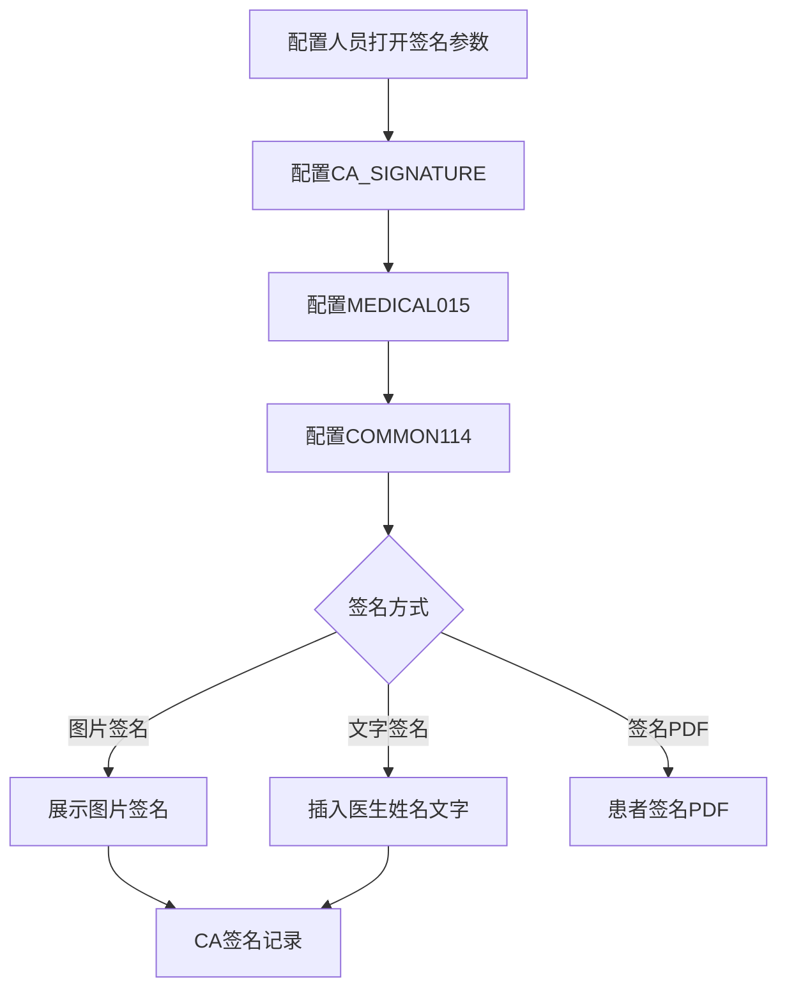
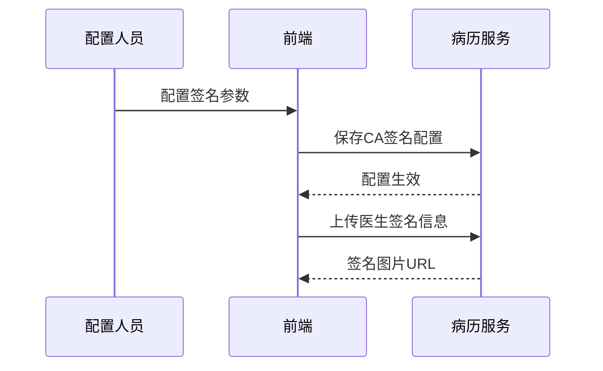

# BLGL-15-QM-005 CA签名配置与方式 - Spec

> **功能编号**：BLGL-15-QM-005
> **文档类型**：功能Spec（业务背景与设计）
> **文档版本**：V1.0
> **编写时间**：2026-08-15
> **编写人**：RACC

---

## 文档索引

#

### 章节索引

**本文档（功能Spec：业务背景与设计）**

| 章节号 | 章节名称 | 内容说明 |
|

----

----|

----

-----|

----

-----|
| 第1章 | 文档概述 | 文档目的、文档范围、术语定义、阅读指南、参考文档 |
| 第2章 | 功能背景与定位 | 功能背景、功能定位、目标用户、核心价值 |
| 第3章 | 业务流程设计 | 主流程/异常流程/边界流程（Given/When/Then） |
| 第4章 | 数据模型设计 | 核心数据结构、状态定义、系统参数定义 |
| 第5章 | 接口契约设计 | API列表、接口详细设计、错误码定义 |
| 第6章 | 技术方案设计 | 页面路径、技术栈、关键技术点、部署方案 |
| 第7章 | 测试用例预设计 | 功能/边界/异常/性能测试用例 |
| 第8章 | 非功能性要求 | 性能、安全、可用性、兼容性 |
| 第9章 | 依赖与风险 | 外部依赖、风险项 |
| 第10章 | 附录 | 流程图、时序图、参考文档 |

**PM-Spec（需求规格）**：目标/约束/验收标准/排除范围/关键决策/优先级
**Analyst-Spec（分析规格）**：功能编号体系/核心业务流程/功能规格/排除范围/业务规则/关联文档/待确认问题

#

### 版本历史

| 版本 | 日期 | 变更说明 | 编写人 |
|

------|

------|

----

-----|

----

----|
| V1.0 | 2026-08-15 | 初始版本 | RACC |

#

### 关联文档索引

| 序号 | 文档名称 | 文档类型 | 版本 | 位置 |
|

------|

----

-----|

----

-----|

------|

------|
| 1 | BLGL-15-QM-005_CA签名配置与方式_Spec.md | 功能Spec（业务背景与设计）（本文档） | V1.0 | 本目录 |
| 2 | BLGL-15-QM-005_CA签名配置与方式_PM-spec.md | PM-Spec（需求规格） | V0.1 | 本目录 |
| 3 | BLGL-15-QM-005_CA签名配置与方式_Analyst-spec.md | Analyst-Spec（分析规格） | V1.0 | 本目录 |
| 4 | BLGL-15-QM CA签名功能点Spec.md | 功能点Spec（模块级） | V1.0 | 上级目录 |

---

## 1、文档概述

#

## 1.1、文档目的

本文档旨在明确"CA签名配置与方式"功能（BLGL-15-QM-005）的业务背景与设计方案，为需求分析、研发实现、测试验收及评审提供统一的业务上下文、设计口径与决策依据。

**具体目的包括**：

1. 梳理 CA 签名配置与方式功能的业务由来与历史需求演进脉络，说明"为什么要做"；
2. 明确功能的定位边界、目标用户与核心价值，回答"做成什么"；
3. 描述功能的业务流程、数据模型、接口契约与技术方案，回答"怎么做"；
4. 预设计测试用例并明确非功能性要求、依赖与风险，为研发与验收提供依据；
5. 作为 Analyst-Spec 的业务前提与设计输入，保证各层文档业务口径一致。

#

## 1.2、文档范围

#

#

## 1.2.1 纳入范围

本文档覆盖 CA 签名配置与方式的完整业务背景与设计，包括：

- 签名参数配置：CA_SIGNATURE/COMMON071/COMMON114/COMMON196/COMMON234/COMMON236/COMMON253/COMMON260/COMMON265/MEDICAL015- 区分场景CA签名：病历提交/首页医护CA签名- 签名方式：图片/PDF/文字签名- 签名图片获取方式：业务中台/OSS- CA查询记录调用方式：业务中台/混合框架- 非CA登录提示：提交病历不显示签名失败提醒#

#

## 1.2.2 排除范围

本文档不涉及以下内容（详见其他功能点或模块）：

- 医生CA签名 —— BLGL-15-QM-001
- 患者签名—— BLGL-15-QM-002
- 多人代理人签名 —— BLGL-15-QM-003
- CA接口对接—— BLGL-15-QM-004
- 签名图片与PDF处理 —— BLGL-15-QM-006
- CA校验与签名流程 —— BLGL-15-QM-007

#

## 1.3、术语定义

| 术语 | 定义 |
|

------|

------|
| CA_SIGNATURE | 是否启用CA签名参数，控制除病案首页外的监控类型|
| MEDICAL015 | 病案首页中哪些签名元素使用CA签名参数|
| COMMON114 | CA签名的UKEY失效或停用时采用的签名模式|
| COMMON234 | 患者CA签名对接方式（签名图片/签名PDF）|
| CA查询记录调用方式 | 业务中台/混合框架|

#

## 1.4、阅读指南


- **章节关系**：第1~2章为业务全貌，第3~10章为设计实现层。与 Analyst-Spec、PM-Spec 互相引用保持一致。

- **读者对象**：产品经理/需求分析师读第1~2章；研发读第3~6、9~10章；测试读第3、7~8章；评审人员核对各层一致性。

#

## 1.5、参考文档

| 序号 | 文档名称 | 版本/日期 |
|

------|

----

-----|

----

------|
| 1 | 【历史需求】住院病历的历史需求.xlsx | - |
| 2 | BLGL-15-QM-005_CA签名配置与方式_PM-spec.md | V0.1 |
| 3 | BLGL-15-QM-005_CA签名配置与方式_Analyst-spec.md | V1.0 |
| 4 | BLGL-15-QM CA签名功能点Spec.md | V1.0 |

---

## 2、功能背景与定位

#

## 2.1 功能背景

CA签名配置与方式是 CA 签名模块的配置支撑层（L2），需满足：


- **现状痛点**：参数 COMMON114 配置为"不阻断流程并插入文字图片"但前台没有插CA还是可以显示签名图片；住院病历 CA 签署方式调用配置无法实现效果
- **管理要求**：需要区分场景进行 CA 签名，病历提交、首页医护 CA 签名
- **历史需求演进**：区分场景CA签名→ 新增文字签名方式→ 签名图片获取改造→ CA查询记录调用方式

#

## 2.2 功能定位

"CA签名配置与方式"是 WiNEX 病历管理-CA签名的配置支撑层，定位为：


- **参数配置**：签名参数统一配置
- **场景区分**：病历提交/首页医护 CA 签名区分
- **签名方式**：图片/PDF/文字签名

#

## 2.3 目标用户

| 用户角色 | 主要使用场景 |
|

----

-----|

----

----

-----|
| 病案管理员 | 配置CA签名参数 |
| 住院医生 | 签名方式选择 |

#

## 2.4 核心价值

| 价值维度 | 价值描述 |
|

----

-----|

----

-----|
| 配置灵活 | 签名参数化配置|
| 场景区分 | 病历提交/首页医护CA签名区分|
| 方式兼容 | 图片/PDF/文字签名兼容|

---

## 3、业务流程设计（Given/When/Then）

#

## 3.1 主流程

**Scenario 1: CA签名参数配置**

```gherkin
Given:
  - 配置人员打开病历书写配置→签名参数

When:
  - 配置 CA_SIGNATURE（是否启用CA签名）
  - 配置 MEDICAL015（病案首页哪些签名元素使用CA签名）
  - 配置 COMMON114（CA签名的UKEY失效或停用时采用的签名模式）

Then:
  - 病案首页是否采用CA签名只受 MEDICAL015 控制
  - 除病案首页外的监控类型受 CA_SIGNATURE 控制
  - CA签名失败按 COMMON114 配置降级
```

#

## 3.2 异常流程

**Scenario 2: 业务异常——COMMON114配置不生效**

```gherkin
Given:
  - 参数 COMMON114 配置为"不阻断流程并插入文字图片"

When:
  - 前台未插CA

Then:
  - 仍显示签名图片（问题）
  - 需排查COMMON114配置逻辑
```

**Scenario 3: 数据异常——CA签署方式调用配置无效**

```gherkin
Given:
  - 住院病历CA签署方式调用配置

When:
  - 调用CA

Then:
  - 配置无法实现效果（问题）
  - 需排查配置逻辑
```

**Scenario 4: 系统异常——非CA登录提示**

```gherkin
Given:
  - 医生非CA登录（工号密码）

When:
  - 提交病历

Then:
  - 原逻辑弹出"CA签名失败，已使用医生姓名文字签名"
  - 改为提示"本次签署未使用 CA 签名，如需使用 CA 签名，请退出后重新CA扫码登录"
```

#

## 3.3 边界流程

**Scenario 5: 边界——签名图片获取方式**

```gherkin
Given:
  - 住院病历CA签名图片获取逻辑修改

When:
  - 获取员工当前最新的图片

Then:
  - select EMPLOYEE_PHOTO_ID, EMPLOYEE_PHOTO_CONTENT from EMPLOYEE_PHOTO where EMPLOYEE_ID = ? and HOSPITAL_SOID=? AND EMPLOYEE_PHOTO_CODE = 399784104 AND (ENABLED_FLAG is null or ENABLED_FLAG = 98175)
  - 兼容从表和OSS 2 种获取途径
```

**Scenario 6: 边界——CA查询记录调用方式**

```gherkin
Given:
  - 病历业务配置→病历书写配置→签名参数

When:
  - 配置"CA查询记录调用方式"（业务中台/混合框架）

Then:
  - 业务中台：调用业务中台CA查询记录组件
  - 混合框架：触发前端事件"调用CA查询记录"，入参传CA业务流水集合
```

---

## 4、数据模型设计

#

## 4.1 核心数据结构

#

#

## 4.1.1 核心保存请求

| 字段名 | 类型 | 必填 | 备注 |
|

----

----|

------|

------|

------|
| CA签名参数 | String | 否 | CA_SIGNATURE 等|

> ⏳ 待确认：签名参数配置接口完整入参/出参以 API 契约为准。

#

#

## 4.1.2 核心表/实体

| 表/实体 | 关键字段 | 说明 |
|

----

-----|

----

-----|

------|
| EMPLOYEE_PHOTO | EMPLOYEE_PHOTO_ID、EMPLOYEE_PHOTO_CONTENT、EMPLOYEE_PHOTO_CODE | 员工签名图片表|

#

## 4.2 状态定义

| ⏳ 待确认 | CA签名配置无状态定义 | 依赖签名参数 |

#

## 4.3 系统参数定义

| 参数编码 | 参数名称 | 说明 |
|

----

-----|

----

-----|

------|
| CA_SIGNATURE | 是否启用CA签名 | 控制除病案首页外的监控类型|
| MEDICAL015 | 病案首页中哪些签名元素使用CA签名 | 控制病案首页CA签名|
| COMMON071 | 点击签名元素是否弹出签名框 | 是否弹框|
| COMMON114 | CA签名的UKEY失效或停用时采用的签名模式 | 降级模式|
| COMMON196 | 是否允许删除患者CA签名 | 患者签名删除|
| COMMON234 | 患者CA签名对接方式 | 签名图片/签名PDF|
| COMMON236 | 触发患者电签事件的数据元 | 患者签名数据元|
| COMMON253 | 患者签名方式配置 | 有线/无线/扫码|
| COMMON260 | 审签流程结束时是否自动提醒发起患者电签 | 是/否|
| COMMON265 | 患者签名后控制未提交病历陈述内容不能编辑的监控类型 | 默认无多选|
| - | CA查询记录调用方式 | 业务中台/混合框架|

---

## 5、接口契约设计

#

## 5.1 API列表

| 序号 | API名称（代码函数） | 路径 | 方法 | 说明 |
|:

----:|

----

-----|

------|:

----:|

------|
| 1 | 查询病历 CA 签名记录 | /api/v1/app_record_inpatient/emr_inpatient/casignature/query/by_example | POST | CA签名记录查询|
| 2 | 上传医生签名信息 | /api/v1/app_record_inpatient/emr_inpatient/upload_doctor_sign_data | POST | 签名图片上传|

#

## 5.2 接口详细设计

#

#

## 5.2.1 上传医生签名信息（upload_doctor_sign_data）

**请求参数**:
```json
{
  "employeeId": "1001",
  "signatureImageData": "base64...",
  "signatureUrl": "https://..."
}
```

**返回值（成功）**:
```json
{
  "success": true,
  "data": "签名图片URL"
}
```

> ⏳ 待确认：签名配置接口字段以代码扫描（UploadDoctorSignDataInputAO）和 API 契约为准。

**返回值（失败）**:
```json
{
  "success": false,
  "message": "上传签名信息失败",
  "data": null
}
```

#

## 5.3 错误码定义

| 错误码 | 错误信息 | 处理方式 |
|

----

----|

----

-----|

----

-----|
| ⏳ 待确认 | CA签名失败，已使用医生姓名文字签名 | 降级文字签名|
| ⏳ 待确认 | 本次签署未使用 CA 签名，如需使用请重新CA扫码登录 | 非CA登录提示|

---

## 6、技术方案设计

#

## 6.1 页面路径


- **页面路径**: 病历业务配置→病历书写配置→签名参数

- **后端模块**: winning-emr-ipt-emrset/.../controller/InpatientEmrRecordController.java（上传医生签名信息、查询CA签名记录）
- **前端 API**: src/api/global.js（imageUpLoadApi → upload_doctor_sign_data、queryCaSignatureRecord → casignature/query/by_example）

#

## 6.2 技术栈

| 类别 | 技术 | 版本 |
|

------|

------|

------|
| 前端框架 | Vue | 2.6.14 |
| 前端UI | element-ui | 2.13.0 |
| 后端框架 | Spring Boot（Java 17）+ JPA/Hibernate | - |
| RPC | winning-akso-rpc-rest | - |

#

## 6.3 关键技术点

- 病案首页是否采用CA签名只受参数 MEDICAL015 控制，除病案首页外的监控类型受 CA_SIGNATURE 控制- CA签名失败按 COMMON114 配置降级：不阻断流程并插入医生姓名文字- 签名图片获取：select EMPLOYEE_PHOTO from EMPLOYEE_PHOTO，兼容从表和OSS

#

## 6.4 部署方案

⏳ 待确认：部署方案未在资料区中找到。

---

## 7、测试用例预设计

#

## 7.1 功能测试

| 用例编号 | 测试场景 | Given | When | Then |
|

----

-----|

----

-----|

----

---|

------|

------|
| TC-001 | CA签名参数配置 | 病历书写配置签名参数 | 配置CA_SIGNATURE/MEDICAL015 | 病案首页/其他病历CA签名区分生效 |

#

## 7.2 边界测试

| 用例编号 | 测试场景 | Given | When | Then |
|

----

-----|

----

-----|

----

---|

------|

------|
| TC-002 | 签名图片获取方式 | 员工签名图片 | 获取最新图片 | 兼容从表和OSS |

#

## 7.3 异常测试

| 用例编号 | 测试场景 | Given | When | Then |
|

----

-----|

----

-----|

----

---|

------|

------|
| TC-003 | COMMON114配置不生效 | 配置不阻断并插入文字图片 | 前台未插CA | 仍显示签名图片（问题） |

#

## 7.4 性能测试

| 用例编号 | 测试场景 | 指标 |
|

----

-----|

----

-----|

------|
| TC-004 | CA签名配置查询 | ⏳ 待确认：性能指标未在资料区中找到 |

---

## 8、非功能性要求

#

## 8.1 性能要求

| 指标 | 要求 |
|

------|

------|
| CA签名配置查询响应时间 | ⏳ 待确认 |

#

## 8.2 安全要求

| 要求 | 说明 |
|

------|

------|
| 配置权限 | 签名参数配置需配置权限 |

**医疗行业特殊要求**

| 要求 | 说明 |
|

------|

------|
| 签名合规 | CA签名失败降级文字签名保证病历完整|

#

## 8.3 可用性要求

| 指标 | 要求值 |
|

------|

----

----|
| 可用性 | ⏳ 待确认 |

#

## 8.4 兼容性要求

| 类型 | 要求 |
|

------|

------|
| 签名方式 | 图片/PDF/文字签名兼容|
| 登录方式 | CA登录/工号密码登录提示差异|

---

## 9、依赖与风险

#

## 9.1 外部依赖

| 依赖项 | 说明 |
|

----

----|

------|
| 业务中台 | 签名图片获取|

#

## 9.2 风险项

| 风险项 | 等级 | 说明 | 应对方案 |
|

----

----|

------|

------|

----

-----|
| 配置不生效 | 中 | COMMON114配置不生效| 排查配置逻辑 |
| 提示不准确 | 中 | 非CA登录提示不准确| 修改提示内容 |

---

## 10、附录

#

## 10.1 流程图



#

## 10.2 时序图



#

## 10.3 参考文档

- 【历史需求】住院病历的历史需求.xlsx- BLGL-15-QM CA签名功能点Spec.md（V1.0，第5章 BLGL-15-QM-005 行）
- 关联Spec: BLGL-15-QM-005_CA签名配置与方式_PM-spec.md、BLGL-15-QM-005_CA签名配置与方式_Analyst-spec.md

---

## 填写检查清单

| 序号 | 检查项 | 是否完成 |
|:

----:|

----

----|:

----

----:|
| 1 | 章节索引与正文章节一致 | ✅ |
| 2 | 版本历史记录完整 | ✅ |
| 3 | 关联文档索引已登记全部Spec | ✅ |
| 4 | 文档目的明确回答"为什么做/做成什么/怎么做" | ✅ |
| 5 | 纳入范围/排除范围清晰 | ✅ |
| 6 | 术语定义覆盖关键概念，从资料区可溯源 | ✅ |
| 7 | 参考文档已登记 | ✅ |
| 8 | 功能背景基于法规/规范/需求来源组织 | ✅ |
| 9 | 功能定位体现业务价值（3~5个定位点） | ✅ |
| 10 | 目标用户角色覆盖完整，在需求原文中有出处 | ✅ |
| 11 | 核心价值可陈述，与 Phase 1 口径一致 | ✅ |
| 12 | 业务流程：主流程≥1、异常≥3、边界≥2，Given/When/Then 具体 | ✅ |
| 13 | 数据模型：字段/表/状态/参数可溯源 | ✅ |
| 14 | 接口契约：API列表+详细设计+错误码齐全或标记待确认 | ✅ |
| 15 | 技术方案：页面路径/技术栈/关键点/部署方案或标记待确认 | ✅ |
| 16 | 测试用例：功能/边界/异常/性能覆盖 | ✅ |
| 17 | 非功能性要求：性能/安全/可用性/兼容性指标可量化或标记待确认 | ✅ |
| 18 | 依赖与风险：外部依赖登记完整 | ✅ |
| 19 | 附录：流程图/时序图与正文流程一致 | ✅ |
| 20 | 全文无占位符 `< >` 残留 | ✅ |
| 21 | 全文陈述可溯源至资料区 | ✅ |
| 22 | 人工审核确认完成 | ⏳ 待确认 |

---

**文档状态**：⬜ 待审核
**维护责任**：RACC
**下次更新**：根据评审反馈优化
