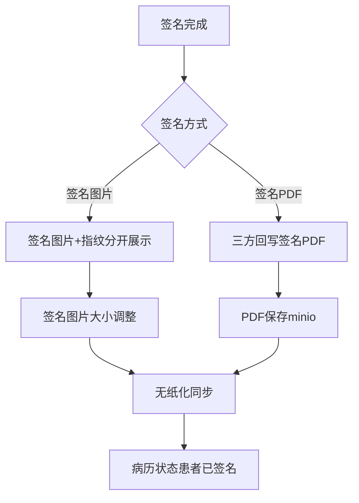
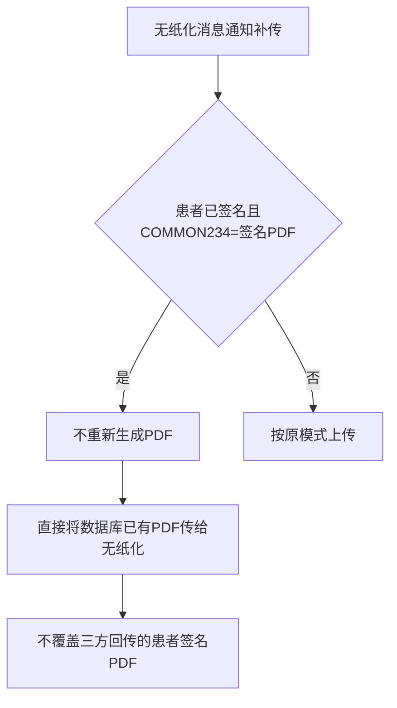

# BLGL-15-QM-006 签名图片与PDF处理 _ Analyst - Spec

> **需求编号**：BLGL-15-QM-006
> **父需求**：BLGL-15-QM
> **关联PM Spec**：BLGL-15-QM-006_签名图片与PDF处理_PM-spec.md
> **Spec版本**：V1.0
> **编写时间**：2026-08-15
> **编写人**：需求分析师

---

## 一、功能编号体系

#

## 1.1 功能层级结构

```
BLGL-15-QM-006-001: 签名图片获取
  ├─ BLGL-15-QM-006-001-01: 业务中台/OSS获取
  ├─ BLGL-15-QM-006-001-02: 指纹图片分开展示
  └─ BLGL-15-QM-006-001-03: 签名图片大小调整

BLGL-15-QM-006-002: 患者签名PDF处理
  ├─ BLGL-15-QM-006-002-01: 签名PDF保存
  ├─ BLGL-15-QM-006-002-02: 签名PDF查询
  ├─ BLGL-15-QM-006-002-03: 签名PDF重生成
  └─ BLGL-15-QM-006-002-04: 补传不覆盖

BLGL-15-QM-006-003: 批注位置
  └─ BLGL-15-QM-006-003-01: 批注位置序号传参

BLGL-15-QM-006-004: 签名PDF传无纸化
  └─ BLGL-15-QM-006-004-01: 签名PDF传无纸化
```

#

## 1.2 功能编号表

| REQ-ID | 功能名称 | 类型 | 优先级 | 说明 |
|

----

----|

----

-----|

------|

----

----|

------|
| BLGL-15-QM-006-001 | 签名图片获取 | 功能 | P0 | 图片获取|
| BLGL-15-QM-006-001-01 | 业务中台/OSS获取 | 子功能 | P0 | EMPLOYEE_PHOTO|
| BLGL-15-QM-006-001-02 | 指纹图片分开展示 | 子功能 | P0 | 指纹399317369|
| BLGL-15-QM-006-001-03 | 签名图片大小调整 | 子功能 | P1 | 签名图片高度|
| BLGL-15-QM-006-002 | 患者签名PDF处理 | 功能 | P0 | PDF处理|
| BLGL-15-QM-006-002-01 | 签名PDF保存 | 子功能 | P0 | signed_pdf/save|
| BLGL-15-QM-006-002-02 | 签名PDF查询 | 子功能 | P0 | signed_pdf/query|
| BLGL-15-QM-006-002-03 | 签名PDF重生成 | 子功能 | P0 | 上级加签PDF无签名|
| BLGL-15-QM-006-002-04 | 补传不覆盖 | 子功能 | P0 | 用已有PDF|
| BLGL-15-QM-006-003 | 批注位置 | 功能 | P1 | 批注位置|
| BLGL-15-QM-006-003-01 | 批注位置序号传参 | 子功能 | P1 | keywordOffsetX/Y|
| BLGL-15-QM-006-004 | 签名PDF传无纸化 | 功能 | P1 | 传无纸化|
| BLGL-15-QM-006-004-01 | 签名PDF传无纸化 | 子功能 | P1 | 签名PDF回传|

---

## 二、核心业务流程

#

## 2.1 患者签名PDF处理流程



#

## 2.2 补传不覆盖流程



---

## 三、功能规格说明

### BLGL-15-QM-006-001: 签名图片获取

#

#

## 3.1.1 功能概述

住院病历 CA 签名图片获取逻辑修改：业务系统获取当前图片内容和 ID。select EMPLOYEE_PHOTO_ID, EMPLOYEE_PHOTO_CONTENT from EMPLOYEE_PHOTO where EMPLOYEE_ID = ? and HOSPITAL_SOID=? AND EMPLOYEE_PHOTO_CODE = 399784104 AND (ENABLED_FLAG is null or ENABLED_FLAG = 98175) 获取员工当前最新的图片。业务系统存储 EMPLOYEE_PHOTO_ID 字段，该内容可以和 OSS 的内容兼容。住院病历对接患者手写板，患者签名和指纹分开展示。患者签名后返回的图片过小、指模小，需支持调整大，签名图片大小读取模板配置元素属性-签名图片高度。

#

#

## 3.1.2 用户角色

| 角色 | 使用场景 | 权限要求 | 操作频率 |
|

------|

----

-----|

----

-----|

----

-----|
| 住院医生 | 签名图片获取/调整 | 病历书写权限 | 高频 |

#

#

## 3.1.3 业务流程（Given/When/Then）

**Scenario 1: 签名图片获取（主流程）**

```gherkin
Given:
  - 员工签名图片存储于 EMPLOYEE_PHOTO 表

When:
  - 获取员工当前最新图片

Then:
  - 按 EMPLOYEE_PHOTO_CODE = 399784104 查询
  - 兼容从表和OSS 2 种获取途径
  - 业务系统存储 EMPLOYEE_PHOTO_ID 字段
```

**Scenario 2: 签名图片大小调整**

```gherkin
Given:
  - 患者签名后返回的图片过小、指模小

When:
  - 调整签名图片大小

Then:
  - 签名图片大小读取模板配置元素属性-签名图片高度
  - 同步模式、异步模式均需处理
```

**Scenario 3: 异常——签字时间显示png路径**

```gherkin
Given:
  - 授权书签名完成

When:
  - 显示签字时间

Then:
  - 显示了一串png的路径，没有转化成图片内容（问题）
  - 需修复图片内容转化
```

#

#

## 3.1.4 数据字段定义

| 字段名 | 类型 | 必填 | 默认值 | 取值范围 | 说明 | 概念ID |
|

----

----|

------|

------|

----

----|

----

-----|

------|

----

----|
| EMPLOYEE_PHOTO_ID | Long | 否 | - | - | 员工签名图片ID| ⏳ 待确认 |
| EMPLOYEE_PHOTO_CONTENT | String | 否 | - | - | 员工签名图片内容| ⏳ 待确认 |
| 签名图片高度 | String | 否 | - | - | 模板配置元素属性| ⏳ 待确认 |

#

#

## 3.1.5 验收标准

| AC编号 | 验收标准 | 对应REQ-ID | 验证方法 | 验证场景 |
|

----

----|

----

-----|

----

----

---|

----

-----|

----

-----|
| AC-001 | 签名图片获取从表和OSS兼容 | BLGL-15-QM-006-001 | 集成测试 | Scenario 1 |
| AC-002 | 签名图片大小读取模板配置签名图片高度 | BLGL-15-QM-006-001 | 功能测试 | Scenario 2 |

---

### BLGL-15-QM-006-002: 患者签名PDF处理

#

#

## 3.2.1 功能概述

患者签名PDF模式（COMMON234 值为签名PDF），接口回写PDF作为病历最终PDF保存在数据库（存入 minio 的 PDF 文件更新），病案无纸化系统对应上传的病历同步更新，更新病历状态为患者已签名。患者电子签名病历没有生成 PDF 需修复。手术同意书上级医师加签后生成的 PDF 无签名信息需重新生成。

#

#

## 3.2.2 用户角色

| 角色 | 使用场景 | 权限要求 | 操作频率 |
|

------|

----

-----|

----

-----|

----

-----|
| 住院医生 | 签名PDF生成 | 病历书写权限 | 中频 |
| 病案管理员 | 签名PDF查看 | 病案权限 | 中频 |

#

#

## 3.2.3 业务流程（Given/When/Then）

**Scenario 1: 患者签名PDF保存（主流程）**

```gherkin
Given:
  - 参数 COMMON234 = 签名PDF

When:
  - 患者签名完成

Then:
  - 接口回写PDF作为病历最终PDF
  - 保存minio PDF文件更新
  - 无纸化系统同步更新
  - 病历状态更新为患者已签名
```

**Scenario 2: 签名PDF重生成**

```gherkin
Given:
  - 手术同意书上级医师加签后生成的PDF无签名信息

When:
  - 重新生成PDF

Then:
  - 重新生成含签名PDF
```

**Scenario 3: 补传不覆盖**

```gherkin
Given:
  - 病历患者已签名状态
  - 参数 COMMON234 = 签名PDF

When:
  - 无纸化系统消息通知补传

Then:
  - 不需要重新生成PDF
  - 直接将数据库已有PDF传给无纸化系统
  - 不覆盖三方回传的患者签名PDF
```

#

#

## 3.2.4 数据字段定义

| 字段名 | 类型 | 必填 | 默认值 | 取值范围 | 说明 | 概念ID |
|

----

----|

------|

------|

----

----|

----

-----|

------|

----

----|
| 患者CA签名对接方式 | String | 否 | 签名图片 | 签名图片/签名PDF | COMMON234| ⏳ 待确认 |
| 签名PDF | String | 是 | - | - | 三方回写PDF| ⏳ 待确认 |

#

#

## 3.2.5 验收标准

| AC编号 | 验收标准 | 对应REQ-ID | 验证方法 | 验证场景 |
|

----

----|

----

-----|

----

----

---|

----

-----|

----

-----|
| AC-003 | 患者签名PDF保存minio，无纸化同步，病历状态患者已签名 | BLGL-15-QM-006-002 | 集成测试 | Scenario 1 |
| AC-004 | 手术同意书上级加签后PDF含签名信息 | BLGL-15-QM-006-002 | 功能测试 | Scenario 2 |
| AC-005 | 无纸化补传不覆盖三方回传签名PDF | BLGL-15-QM-006-002 | 集成测试 | Scenario 3 |

---

### BLGL-15-QM-006-003: 批注位置

#

#

## 3.3.1 功能概述

病历患者签需增加批注位置序号进行传参。若该份同意书上有4个同意关键字，三方都会在这4个值附近放上患者批注签名文本，但在文书上只有一个地方才是患者批注的位置。模板在批注数据元的自定义设置中手动添加 keywordOffsetX（患者签名数据元/批注数据元关键字偏移，左右）、keywordOffsetY（上下）、keywordIndex。

#

#

## 3.3.2 用户角色

| 角色 | 使用场景 | 权限要求 | 操作频率 |
|

------|

----

-----|

----

-----|

----

-----|
| 住院医生 | 患者签名批注 | 病历书写权限 | 中频 |

#

#

## 3.3.3 业务流程（Given/When/Then）

**Scenario 1: 批注位置传参（主流程）**

```gherkin
Given:
  - 同意书有多个同意关键字

When:
  - 模板批注数据元自定义设置添加 keywordOffsetX/keywordOffsetY/keywordIndex

Then:
  - 按偏移量定位批注数据元
  - 患者批注位置准确
```

#

#

## 3.3.4 数据字段定义

| 字段名 | 类型 | 必填 | 默认值 | 取值范围 | 说明 | 概念ID |
|

----

----|

------|

------|

----

----|

----

-----|

------|

----

----|
| keywordOffsetX | String | 否 | - | 负数左偏/正数右偏 | 批注偏移（左右）| ⏳ 待确认 |
| keywordOffsetY | String | 否 | - | 负数上偏/正数下偏 | 批注偏移（上下）| ⏳ 待确认 |

#

#

## 3.3.5 验收标准

| AC编号 | 验收标准 | 对应REQ-ID | 验证方法 | 验证场景 |
|

----

----|

----

-----|

----

----

---|

----

-----|

----

-----|
| AC-006 | 批注位置序号传参，按偏移量定位批注数据元 | BLGL-15-QM-006-003 | 功能测试 | Scenario 1 |

---

### BLGL-15-QM-006-004: 签名PDF传无纸化

#

#

## 3.4.1 功能概述

住院病历患者签名没有传给无纸化 PDF（问题需修复）。患者签名PDF回传至无纸化系统。

#

#

## 3.4.2 用户角色

| 角色 | 使用场景 | 权限要求 | 操作频率 |
|

------|

----

-----|

----

-----|

----

-----|
| 病案管理员 | 签名PDF传无纸化 | 病案权限 | 中频 |

#

#

## 3.4.3 业务流程（Given/When/Then）

**Scenario 1: 签名PDF传无纸化（主流程）**

```gherkin
Given:
  - 住院病历患者签名完成

When:
  - 传PDF给无纸化

Then:
  - 患者签名PDF正确传给无纸化系统
  - 无缺失
```

#

#

## 3.4.4 数据字段定义

| ⏳ 待确认 | 签名PDF传无纸化无独立数据字段 | 依赖签名PDF |

#

#

## 3.4.5 验收标准

| AC编号 | 验收标准 | 对应REQ-ID | 验证方法 | 验证场景 |
|

----

----|

----

-----|

----

----

---|

----

-----|

----

-----|
| AC-007 | 患者签名PDF正确传无纸化，无缺失 | BLGL-15-QM-006-004 | 集成测试 | Scenario 1 |

---

## 四、排除范围

本需求不包含以下功能项：

1. **医生CA签名** —— BLGL-15-QM-001
2. **患者签名**（手写板）—— BLGL-15-QM-002
3. **多人代理人签名** —— BLGL-15-QM-003
4. **CA接口对接**（信手书/北京CA）—— BLGL-15-QM-004
5. **CA签名配置与方式** —— BLGL-15-QM-005
6. **CA校验与签名流程** —— BLGL-15-QM-007

---

## 五、业务规则清单

| 规则ID | 规则名称 | 规则描述 | 优先级 |
|

----

----|

----

-----|

----

-----|

------|

----

----|
| BR-001 | 图片获取 | 签名图片按EMPLOYEE_PHOTO_CODE=399784104查询，兼容从表和OSS | P0 |
| BR-002 | 图片大小 | 签名图片大小读取模板配置元素属性-签名图片高度，同步/异步模式均处理 | P1 |
| BR-003 | PDF保存 | 患者签名PDF模式回写PDF保存minio，无纸化同步，病历状态患者已签名 | P0 |
| BR-004 | PDF重生成 | 上级加签后PDF无签名需重新生成含签名PDF | P0 |
| BR-005 | 补传不覆盖 | 患者已签名且COMMON234=签名PDF时补传直接用数据库已有PDF | P0 |
| BR-006 | 批注位置 | 模板批注数据元自定义属性 keywordOffsetX/keywordOffsetY/keywordIndex | P1 |

---

## 六、关联文档

| 文档类型 | 文档路径 | 说明 |
|

----

-----|

----

-----|

------|
| 功能点Spec | BLGL-15-QM CA签名功能点Spec.md（V1.0，上级目录） | Phase 1 功能点索引 |
| PM spec | 本目录 BLGL-15-QM-006_签名图片与PDF处理_PM-spec.md（V0.1） | PM 产出的 Spec 文档 |
| -Spec | 本目录 BLGL-15-QM-006_签名图片与PDF处理_Spec.md（V1.0） | 业务背景与目标 Spec |
| data-model.md | 待产出 | 架构师产出的数据建模文档 |
| design.md | 待产出 | 架构师产出的技术方案文档 |
| api-contract.md | 待产出 | 开发经理产出的 API 契约文档 |

---

## 七、待确认问题清单

| 编号 | 问题描述 | 缺失信息 | 影响范围 | 建议补充方 |
|

------|

----

-----|

----

-----|

----

-----|

----

----

---|
| Q-001 | 患者签名PDF接口（InpEmrPatientSignPdfInputAO）完整字段 | API 契约 | -Spec 第5章 | 开发经理 |
| Q-002 | 患者电子签名病历未生成PDF根因 | 需求分析原文缺失 | 3.2.3 | 开发经理 |
| Q-003 | 患者签名未传无纸化PDF根因 | 需求分析原文缺失 | 3.4.3 | 开发经理 |
| Q-004 | 上级加签PDF无签名根因 | 需求分析原文缺失 | 3.2.3 | 开发经理 |
| Q-005 | 签名图片高度配置概念 ID | 概念ID | 3.1.4 | 产品经理 |
| Q-006 | 性能指标（签名PDF生成响应时间） | 资料区无量化指标 | -Spec 第8章 | 产品经理 |

---

## 填写检查清单

| 序号 | 检查项 | 是否完成 |
|:

----:|

----

----|:

----

----:|
| 1 | 功能编号带父子层级 | ✅ |
| 2 | 每个 REQ-ID 有功能概述和用户角色 | ✅ |
| 3 | 主流程至少 1 个 Given/When/Then 场景 | ✅ |
| 4 | 异常流程至少 3 个 Given/When/Then 场景 | ✅ |
| 5 | 边界流程至少 2 个 Given/When/Then 场景 | ✅ |
| 6 | 每个 Given/When/Then 内容具体，不模糊 | ✅ |
| 7 | 数据字段定义完整（字段名、类型、必填、说明、概念ID） | ✅ |
| 8 | 验收标准 AC 编号独立，可验证 | ✅ |
| 9 | 验收标准无"功能正常"等模糊表述 | ✅ |
| 10 | 排除范围明确列出 | ✅ |
| 11 | 业务规则清单列出所有规则，每条标注来源 | ✅ |
| 12 | 流程图使用 Mermaid 格式（≥2 个） | ✅ |
| 13 | 关联文档索引包含 Phase 1 功能点Spec | ✅ |
| 14 | 待确认问题清单汇总了全文所有 ⏳ 项 | ✅ |
| 15 | 全文无占位符 `< >` 残留 | ✅ |
| 16 | 全文陈述可溯源至资料区（S1~S10 溯源核查） | ✅ |
| 17 | 人工审核确认完成 | ⏳ 待确认 |

---

**文档状态**：⬜ 待审核
**维护责任**：需求分析师规范组
**下次更新**：根据评审反馈优化

---

## 版本历史

| 版本 | 日期 | 变更说明 | 编写人 |
|

------|

------|

----

-----|

----

----|
| V1.0 | 2026-08-15 | 初始版本 | 需求分析师 |
