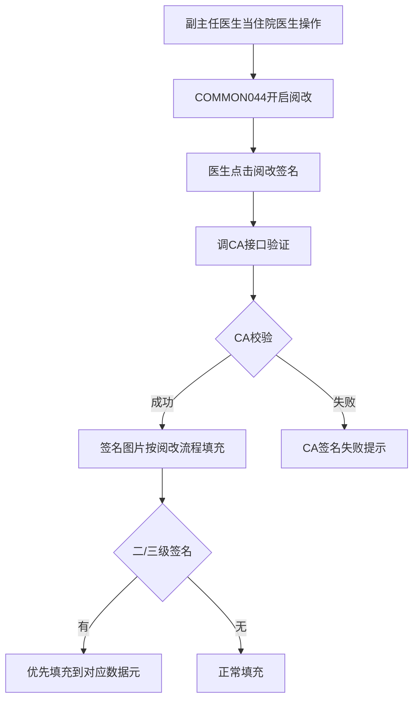
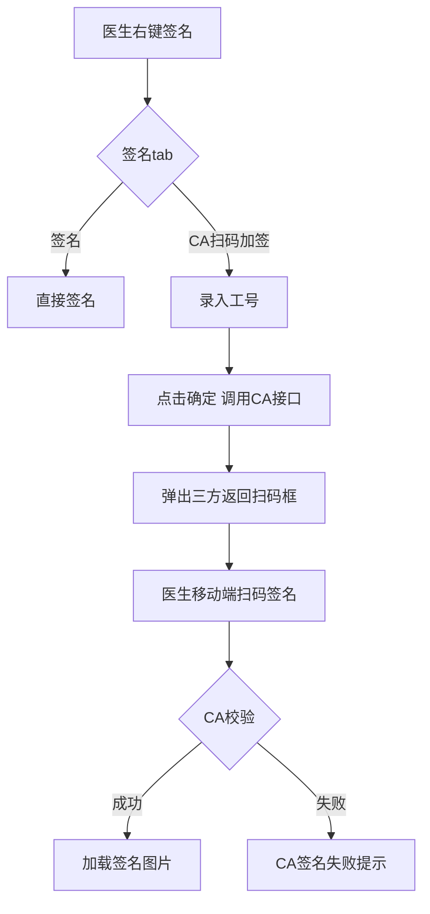

# BLGL-15-QM-007 CA校验与签名流程 _ Analyst - Spec

> **需求编号**：BLGL-15-QM-007
> **父需求**：BLGL-15-QM
> **关联PM Spec**：BLGL-15-QM-007_CA校验与签名流程_PM-spec.md
> **Spec版本**：V1.0
> **编写时间**：2026-08-15
> **编写人**：需求分析师

---

## 一、功能编号体系

#

## 1.1 功能层级结构

```
BLGL-15-QM-007-001: 阅改签名CA校验
  ├─ BLGL-15-QM-007-001-01: 阅改签名调CA接口
  ├─ BLGL-15-QM-007-001-02: 签名图片按阅改流程填充
  └─ BLGL-15-QM-007-001-03: 二/三级签名优先填充

BLGL-15-QM-007-002: 代签/扫码加签
  ├─ BLGL-15-QM-007-002-01: 右键签名分tab
  ├─ BLGL-15-QM-007-002-02: CA扫码加签
  └─ BLGL-15-QM-007-002-03: 移动端扫码签名

BLGL-15-QM-007-003: 双击签名元素扫码
  └─ BLGL-15-QM-007-003-01: 弹出CA二维码

BLGL-15-QM-007-004: 首页护士签名校验
  └─ BLGL-15-QM-007-004-01: 责任/质控护士签名CA校验

BLGL-15-QM-007-005: 病案首页CA签名推送
  └─ BLGL-15-QM-007-005-01: 推送至北京CA应用
```

#

## 1.2 功能编号表

| REQ-ID | 功能名称 | 类型 | 优先级 | 说明 |
|

----

----|

----

-----|

------|

----

----|

------|
| BLGL-15-QM-007-001 | 阅改签名CA校验 | 功能 | P0 | 阅改CA校验|
| BLGL-15-QM-007-001-01 | 阅改签名调CA接口 | 子功能 | P0 | 调CA验证|
| BLGL-15-QM-007-001-02 | 签名图片按阅改流程填充 | 子功能 | P0 | 按阅改填充|
| BLGL-15-QM-007-001-03 | 二/三级签名优先填充 | 子功能 | P1 | 优先填充对应数据元|
| BLGL-15-QM-007-002 | 代签/扫码加签 | 功能 | P0 | 代签改签名|
| BLGL-15-QM-007-002-01 | 右键签名分tab | 子功能 | P0 | 签名/CA扫码加签|
| BLGL-15-QM-007-002-02 | CA扫码加签 | 子功能 | P0 | 录入工号调CA|
| BLGL-15-QM-007-002-03 | 移动端扫码签名 | 子功能 | P0 | 移动端扫码|
| BLGL-15-QM-007-003 | 双击签名元素扫码 | 功能 | P1 | 双击扫码|
| BLGL-15-QM-007-003-01 | 弹出CA二维码 | 子功能 | P1 | 扫码签名验证|
| BLGL-15-QM-007-004 | 首页护士签名校验 | 功能 | P0 | 护士CA校验|
| BLGL-15-QM-007-004-01 | 责任/质控护士签名CA校验 | 子功能 | P0 | 增加CA校验|
| BLGL-15-QM-007-005 | 病案首页CA签名推送 | 功能 | P1 | 首页推送|
| BLGL-15-QM-007-005-01 | 推送至北京CA应用 | 子功能 | P1 | 推送签名信息|

---

## 二、核心业务流程

#

## 2.1 阅改签名CA校验流程



#

## 2.2 代签/扫码加签流程



---

## 三、功能规格说明

### BLGL-15-QM-007-001: 阅改签名CA校验

#

#

## 3.1.1 功能概述

医院管理上科室存在没有住院医生，副主任医生当住院医生操作的情况，又强制要求部分病历必须走三级签名，目前按阅改流程来处理。把所有的主任+副主任都映射成主治医生，并开启参数 COMMON044（是否阅改同级及下级医生提交的病历）。阅改签名时需进行 CA 校验。有二级签名时、三级签名时优先填充到对应的数据元内，不按照光标。

#

#

## 3.1.2 用户角色

| 角色 | 使用场景 | 权限要求 | 操作频率 |
|

------|

----

-----|

----

-----|

----

-----|
| 副主任医生 | 阅改签名 | 阅改权限 | 中频 |

#

#

## 3.1.3 业务流程（Given/When/Then）

**Scenario 1: 阅改签名CA校验（主流程）**

```gherkin
Given:
  - 科室没有住院医生，副主任医生当住院医生操作
  - 参数 COMMON044 开启

When:
  - 医生点击阅改签名按钮

Then:
  - 调CA接口验证CA
  - 签名图片按阅改流程填充
  - 有二级/三级签名时优先填充到对应数据元
```

#

#

## 3.1.4 数据字段定义

| 字段名 | 类型 | 必填 | 默认值 | 取值范围 | 说明 | 概念ID |
|

----

----|

------|

------|

----

----|

----

-----|

------|

----

----|
| 是否阅改同级及下级医生提交的病历 | Boolean | 否 | - | 是/否 | COMMON044| ⏳ 待确认 |
| caSignatureId | String | 是 | - | - | CA签名流水号| ⏳ 待确认 |

#

#

## 3.1.5 验收标准

| AC编号 | 验收标准 | 对应REQ-ID | 验证方法 | 验证场景 |
|

----

----|

----

-----|

----

----

---|

----

-----|

----

-----|
| AC-001 | 阅改签名时调CA接口验证，签名图片按阅改流程填充 | BLGL-15-QM-007-001 | 功能测试 | Scenario 1 |

---

### BLGL-15-QM-007-002: 代签/扫码加签

#

#

## 3.2.1 功能概述

右键【代签】改为右键【签名】；右键【签名】时分成【签名】和【CA扫码加签】tab，在【CA扫码加签】tab录入工号后点击【确定】，调用CA接口，弹出三方返回的扫码框，由医生在移动端进行扫码签名。若CA校验成功，则在病历中鼠标定位的地方加载签名图片；校验失败则签名失败，不加载签名图片，并提示"CA签名失败"。

#

#

## 3.2.2 用户角色

| 角色 | 使用场景 | 权限要求 | 操作频率 |
|

------|

----

-----|

----

-----|

----

-----|
| 住院医生 | 代签/扫码加签 | 病历书写权限 | 中频 |

#

#

## 3.2.3 业务流程（Given/When/Then）

**Scenario 1: 扫码加签（主流程）**

```gherkin
Given:
  - 医生右键【签名】

When:
  - 选择【CA扫码加签】tab
  - 录入工号点击确定

Then:
  - 调用CA接口
  - 弹出三方返回扫码框
  - 医生移动端扫码签名
  - CA校验成功则加载签名图片
```

**Scenario 2: 异常——CA校验失败**

```gherkin
Given:
  - 医生移动端扫码签名

When:
  - CA校验失败

Then:
  - 签名失败，不加载签名图片
  - 提示"CA签名失败"
```

#

#

## 3.2.4 数据字段定义

| 字段名 | 类型 | 必填 | 默认值 | 取值范围 | 说明 | 概念ID |
|

----

----|

------|

------|

----

----|

----

-----|

------|

----

----|
| 工号 | String | 是 | - | - | 扫码加签| ⏳ 待确认 |

#

#

## 3.2.5 验收标准

| AC编号 | 验收标准 | 对应REQ-ID | 验证方法 | 验证场景 |
|

----

----|

----

-----|

----

----

---|

----

-----|

----

-----|
| AC-002 | 右键签名分【签名】和【CA扫码加签】tab，扫码成功加载签名图片 | BLGL-15-QM-007-002 | 功能测试 | Scenario 1/2 |

---

### BLGL-15-QM-007-003: 双击签名元素扫码

#

#

## 3.3.1 功能概述

双击签名元素弹出 CA 二维码进行扫码签名验证。

#

#

## 3.3.2 用户角色

| 角色 | 使用场景 | 权限要求 | 操作频率 |
|

------|

----

-----|

----

-----|

----

-----|
| 住院医生 | 双击签名元素扫码 | 病历书写权限 | 中频 |

#

#

## 3.3.3 业务流程（Given/When/Then）

**Scenario 1: 双击签名元素扫码（主流程）**

```gherkin
Given:
  - 病历签名元素

When:
  - 双击签名元素

Then:
  - 弹出CA二维码进行扫码签名验证
  - 展示二维码后关闭二维码不取消签名事件
```

#

#

## 3.3.4 数据字段定义

| ⏳ 待确认 | 双击扫码无独立数据字段 | 依赖CA签名 |

#

#

## 3.3.5 验收标准

| AC编号 | 验收标准 | 对应REQ-ID | 验证方法 | 验证场景 |
|

----

----|

----

-----|

----

----

---|

----

-----|

----

-----|
| AC-003 | 双击签名元素弹出 CA 二维码进行扫码签名验证 | BLGL-15-QM-007-003 | 功能测试 | Scenario 1 |

---

### BLGL-15-QM-007-004: 首页护士签名校验

#

#

## 3.4.1 功能概述

病案首页责任护士和质控护士签名，医生可以签名，没有 CA 校验（问题需增加）。

#

#

## 3.4.2 用户角色

| 角色 | 使用场景 | 权限要求 | 操作频率 |
|

------|

----

-----|

----

-----|

----

-----|
| 护士 | 责任护士/质控护士签名 | 护理权限 | 中频 |

#

#

## 3.4.3 业务流程（Given/When/Then）

**Scenario 1: 首页护士签名CA校验（主流程）**

```gherkin
Given:
  - 病案首页责任护士和质控护士签名

When:
  - 医生可以签名

Then:
  - 需增加 CA 校验
  - 校验通过才允许签名
```

#

#

## 3.4.4 数据字段定义

| ⏳ 待确认 | 首页护士签名校验无独立数据字段 | 依赖CA签名记录 |

#

#

## 3.4.5 验收标准

| AC编号 | 验收标准 | 对应REQ-ID | 验证方法 | 验证场景 |
|

----

----|

----

-----|

----

----

---|

----

-----|

----

-----|
| AC-004 | 病案首页责任护士/质控护士签名增加 CA 校验 | BLGL-15-QM-007-004 | 功能测试 | Scenario 1 |

---

### BLGL-15-QM-007-005: 病案首页CA签名推送

#

#

## 3.5.1 功能概述

病案首页需要多位医护人员签名，采用推送方式将签名信息推送到北京 CA 电子签名手机应用程序上，用户在应用程序上确认签名。病案首页完成后在首页元素中选择需要签名的人员，全部人员签完名之后病案首页才能提交。增加事件参数 pdfBase64（上级签名时需要审阅的 pdf）。

#

#

## 3.5.2 用户角色

| 角色 | 使用场景 | 权限要求 | 操作频率 |
|

------|

----

-----|

----

-----|

----

-----|
| 病案管理员 | 病案首页签名推送 | 病案权限 | 低频 |
| 医护人员 | CA应用确认签名 | - | 中频 |

#

#

## 3.5.3 业务流程（Given/When/Then）

**Scenario 1: 病案首页CA推送（主流程）**

```gherkin
Given:
  - 病案首页需要多位医护人员签名

When:
  - 首页签名时推送签名信息到CA应用

Then:
  - 用户在应用程序上确认签名
  - 全部人员签完名后病案首页才能提交
  - 上级签名时增加 pdfBase64 事件参数
```

#

#

## 3.5.4 数据字段定义

| 字段名 | 类型 | 必填 | 默认值 | 取值范围 | 说明 | 概念ID |
|

----

----|

------|

------|

----

----|

----

-----|

------|

----

----|
| pdfBase64 | String | 否 | - | - | 上级签名需审阅的pdf| ⏳ 待确认 |

#

#

## 3.5.5 验收标准

| AC编号 | 验收标准 | 对应REQ-ID | 验证方法 | 验证场景 |
|

----

----|

----

-----|

----

----

---|

----

-----|

----

-----|
| AC-005 | 病案首页CA签名推送至CA应用，全部签名后首页可提交 | BLGL-15-QM-007-005 | 集成测试 | Scenario 1 |

---

## 四、排除范围

本需求不包含以下功能项：

1. **医生CA签名** —— BLGL-15-QM-001
2. **患者签名**（手写板）—— BLGL-15-QM-002
3. **多人代理人签名** —— BLGL-15-QM-003
4. **CA接口对接**（信手书/北京CA）—— BLGL-15-QM-004
5. **CA签名配置与方式** —— BLGL-15-QM-005
6. **签名图片与PDF处理** —— BLGL-15-QM-006

---

## 五、业务规则清单

| 规则ID | 规则名称 | 规则描述 | 优先级 |
|

----

----|

----

-----|

----

-----|

------|

----

----|
| BR-001 | 阅改CA校验 | 阅改签名时调CA接口验证，签名图片按阅改流程填充 | P0 |
| BR-002 | 二三级签名填充 | 有二级/三级签名时优先填充到对应数据元，不按照光标 | P1 |
| BR-003 | 扫码加签 | 右键签名分签名/CA扫码加签tab，扫码成功加载签名图片 | P0 |
| BR-004 | 工号校验 | 医生工号录入错误提示"工号查询失败，请录入正确工号" | P0 |
| BR-005 | 首页护士CA校验 | 病案首页责任护士/质控护士签名需CA校验 | P0 |
| BR-006 | 首页推送 | 病案首页签名推送至北京CA应用，全部签名后首页才能提交 | P1 |

---

## 六、关联文档

| 文档类型 | 文档路径 | 说明 |
|

----

-----|

----

-----|

------|
| 功能点Spec | BLGL-15-QM CA签名功能点Spec.md（V1.0，上级目录） | Phase 1 功能点索引 |
| PM spec | 本目录 BLGL-15-QM-007_CA校验与签名流程_PM-spec.md（V0.1） | PM 产出的 Spec 文档 |
| -Spec | 本目录 BLGL-15-QM-007_CA校验与签名流程_Spec.md（V1.0） | 业务背景与目标 Spec |
| data-model.md | 待产出 | 架构师产出的数据建模文档 |
| design.md | 待产出 | 架构师产出的技术方案文档 |
| api-contract.md | 待产出 | 开发经理产出的 API 契约文档 |

---

## 七、待确认问题清单

| 编号 | 问题描述 | 缺失信息 | 影响范围 | 建议补充方 |
|

------|

----

-----|

----

-----|

----

-----|

----

----

---|
| Q-001 | CA校验接口（InpatEmrCaSignatureRecordAO）完整字段 | API 契约 | -Spec 第5章 | 开发经理 |
| Q-002 | 首页护士签名无CA校验修复范围 | 需求分析原文缺失 | 3.4.3 | 开发经理 |
| Q-003 | 病案首页CA签名失败根因 | 需求分析原文缺失 | 3.2.3 | 开发经理 |
| Q-004 | 扫码加签异常根因 | 需求分析原文缺失 | 3.2.3 | 开发经理 |
| Q-005 | 病案首页CA推送接口字段 | CA厂商API文档 | 3.5.4 | CA厂商/开发经理 |
| Q-006 | 性能指标（CA校验响应时间） | 资料区无量化指标 | -Spec 第8章 | 产品经理 |

---

## 填写检查清单

| 序号 | 检查项 | 是否完成 |
|:

----:|

----

----|:

----

----:|
| 1 | 功能编号带父子层级 | ✅ |
| 2 | 每个 REQ-ID 有功能概述和用户角色 | ✅ |
| 3 | 主流程至少 1 个 Given/When/Then 场景 | ✅ |
| 4 | 异常流程至少 3 个 Given/When/Then 场景 | ✅ |
| 5 | 边界流程至少 2 个 Given/When/Then 场景 | ✅ |
| 6 | 每个 Given/When/Then 内容具体，不模糊 | ✅ |
| 7 | 数据字段定义完整（字段名、类型、必填、说明、概念ID） | ✅ |
| 8 | 验收标准 AC 编号独立，可验证 | ✅ |
| 9 | 验收标准无"功能正常"等模糊表述 | ✅ |
| 10 | 排除范围明确列出 | ✅ |
| 11 | 业务规则清单列出所有规则，每条标注来源 | ✅ |
| 12 | 流程图使用 Mermaid 格式（≥2 个） | ✅ |
| 13 | 关联文档索引包含 Phase 1 功能点Spec | ✅ |
| 14 | 待确认问题清单汇总了全文所有 ⏳ 项 | ✅ |
| 15 | 全文无占位符 `< >` 残留 | ✅ |
| 16 | 全文陈述可溯源至资料区（S1~S10 溯源核查） | ✅ |
| 17 | 人工审核确认完成 | ⏳ 待确认 |

---

**文档状态**：⬜ 待审核
**维护责任**：需求分析师规范组
**下次更新**：根据评审反馈优化

---

## 版本历史

| 版本 | 日期 | 变更说明 | 编写人 |
|

------|

------|

----

-----|

----

----|
| V1.0 | 2026-08-15 | 初始版本 | 需求分析师 |
