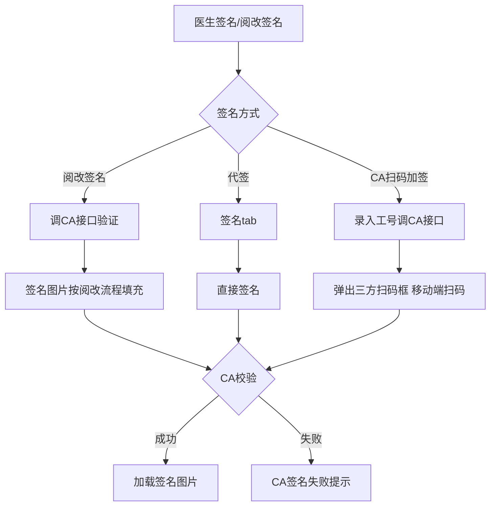
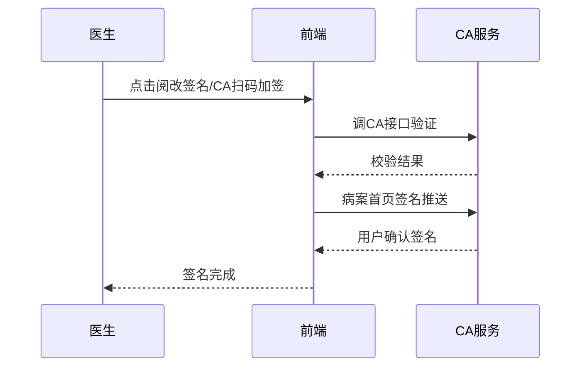

# BLGL-15-QM-007 CA校验与签名流程 - Spec

> **功能编号**：BLGL-15-QM-007
> **文档类型**：功能Spec（业务背景与设计）
> **文档版本**：V1.0
> **编写时间**：2026-08-15
> **编写人**：RACC

---

## 文档索引

#

### 章节索引

**本文档（功能Spec：业务背景与设计）**

| 章节号 | 章节名称 | 内容说明 |
|

----

----|

----

-----|

----

-----|
| 第1章 | 文档概述 | 文档目的、文档范围、术语定义、阅读指南、参考文档 |
| 第2章 | 功能背景与定位 | 功能背景、功能定位、目标用户、核心价值 |
| 第3章 | 业务流程设计 | 主流程/异常流程/边界流程（Given/When/Then） |
| 第4章 | 数据模型设计 | 核心数据结构、状态定义、系统参数定义 |
| 第5章 | 接口契约设计 | API列表、接口详细设计、错误码定义 |
| 第6章 | 技术方案设计 | 页面路径、技术栈、关键技术点、部署方案 |
| 第7章 | 测试用例预设计 | 功能/边界/异常/性能测试用例 |
| 第8章 | 非功能性要求 | 性能、安全、可用性、兼容性 |
| 第9章 | 依赖与风险 | 外部依赖、风险项 |
| 第10章 | 附录 | 流程图、时序图、参考文档 |

**PM-Spec（需求规格）**：目标/约束/验收标准/排除范围/关键决策/优先级
**Analyst-Spec（分析规格）**：功能编号体系/核心业务流程/功能规格/排除范围/业务规则/关联文档/待确认问题

#

### 版本历史

| 版本 | 日期 | 变更说明 | 编写人 |
|

------|

------|

----

-----|

----

----|
| V1.0 | 2026-08-15 | 初始版本 | RACC |

#

### 关联文档索引

| 序号 | 文档名称 | 文档类型 | 版本 | 位置 |
|

------|

----

-----|

----

-----|

------|

------|
| 1 | BLGL-15-QM-007_CA校验与签名流程_Spec.md | 功能Spec（业务背景与设计）（本文档） | V1.0 | 本目录 |
| 2 | BLGL-15-QM-007_CA校验与签名流程_PM-spec.md | PM-Spec（需求规格） | V0.1 | 本目录 |
| 3 | BLGL-15-QM-007_CA校验与签名流程_Analyst-spec.md | Analyst-Spec（分析规格） | V1.0 | 本目录 |
| 4 | BLGL-15-QM CA签名功能点Spec.md | 功能点Spec（模块级） | V1.0 | 上级目录 |

---

## 1、文档概述

#

## 1.1、文档目的

本文档旨在明确"CA校验与签名流程"功能（BLGL-15-QM-007）的业务背景与设计方案，为需求分析、研发实现、测试验收及评审提供统一的业务上下文、设计口径与决策依据。

**具体目的包括**：

1. 梳理 CA 校验与签名流程功能的业务由来与历史需求演进脉络，说明"为什么要做"；
2. 明确功能的定位边界、目标用户与核心价值，回答"做成什么"；
3. 描述功能的业务流程、数据模型、接口契约与技术方案，回答"怎么做"；
4. 预设计测试用例并明确非功能性要求、依赖与风险，为研发与验收提供依据；
5. 作为 Analyst-Spec 的业务前提与设计输入，保证各层文档业务口径一致。

#

## 1.2、文档范围

#

#

## 1.2.1 纳入范围

本文档覆盖 CA 校验与签名流程的完整业务背景与设计，包括：

- 阅改签名CA校验：阅改签名时需进行 CA 校验- 代签/扫码加签：右键签名分成签名和 CA 扫码加签 tab- 病案首页签名校验：责任护士/质控护士签名 CA 校验- 双击签名元素扫码：双击签名元素弹出 CA 二维码进行扫码签名- 病案首页CA签名失败修复- 病案首页CA签名推送：推送至北京CA应用#

#

## 1.2.2 排除范围

本文档不涉及以下内容（详见其他功能点或模块）：

- 医生CA签名 —— BLGL-15-QM-001
- 患者签名—— BLGL-15-QM-002
- 多人代理人签名 —— BLGL-15-QM-003
- CA接口对接—— BLGL-15-QM-004
- CA签名配置与方式 —— BLGL-15-QM-005
- 签名图片与PDF处理 —— BLGL-15-QM-006

#

## 1.3、术语定义

| 术语 | 定义 |
|

------|

------|
| 阅改签名 | 副主任医生当住院医生操作时的同级阅改签名|
| 代签/扫码加签 | 右键签名分签名和 CA 扫码加签 tab|
| CA校验 | 签名时调 CA 接口验证|

#

## 1.4、阅读指南


- **章节关系**：第1~2章为业务全貌，第3~10章为设计实现层。与 Analyst-Spec、PM-Spec 互相引用保持一致。

- **读者对象**：产品经理/需求分析师读第1~2章；研发读第3~6、9~10章；测试读第3、7~8章；评审人员核对各层一致性。

#

## 1.5、参考文档

| 序号 | 文档名称 | 版本/日期 |
|

------|

----

-----|

----

------|
| 1 | 【历史需求】住院病历的历史需求.xlsx | - |
| 2 | BLGL-15-QM-007_CA校验与签名流程_PM-spec.md | V0.1 |
| 3 | BLGL-15-QM-007_CA校验与签名流程_Analyst-spec.md | V1.0 |
| 4 | BLGL-15-QM CA签名功能点Spec.md | V1.0 |

---

## 2、功能背景与定位

#

## 2.1 功能背景

CA校验与签名流程是 CA 签名模块的流程管控层（L2），需满足：


- **现状痛点**：病案首页责任护士和质控护士签名，医生可以签名，没有 CA 校验；病案首页 CA 签名失败；住院病历扫码加签功能异常
- **管理要求**：阅改签名时需进行 CA 校验；病案首页签名推送至 CA 应用，全部签名后首页才能提交
- **历史需求演进**：阅改签名CA校验→ 代签对接CA→ 双击签名元素弹出CA二维码→ 病案首页CA签名推送

#

## 2.2 功能定位

"CA校验与签名流程"是 WiNEX 病历管理-CA签名的流程管控层，定位为：


- **CA校验**：阅改签名/首页护士签名 CA 校验
- **签名流程**：代签/扫码加签/双击扫码
- **首页推送**：病案首页 CA 签名推送

#

## 2.3 目标用户

| 用户角色 | 主要使用场景 |
|

----

-----|

----

----

-----|
| 住院医生 | 阅改签名/代签/扫码加签 |
| 护士 | 责任护士/质控护士签名 |
| 病案管理员 | 病案首页CA签名推送 |

#

## 2.4 核心价值

| 价值维度 | 价值描述 |
|

----

-----|

----

-----|
| 校验合规 | 阅改/护士签名 CA 校验|
| 流程多样 | 代签/扫码加签/双击扫码|
| 首页推送 | 病案首页 CA 签名推送|

---

## 3、业务流程设计（Given/When/Then）

#

## 3.1 主流程

**Scenario 1: 阅改签名CA校验**

```gherkin
Given:
  - 科室没有住院医生，副主任医生当住院医生操作
  - 强制要求部分病历必须走三级签名，按阅改流程处理
  - 参数 COMMON044（是否阅改同级及下级医生提交的病历）开启

When:
  - 医生点击阅改签名按钮

Then:
  - 调CA接口验证CA
  - 签名图片按阅改流程填充到对应数据元
  - 有二级签名时、三级签名时优先填充到对应数据元
```

#

## 3.2 异常流程

**Scenario 2: 业务异常——首页护士签名无CA校验**

```gherkin
Given:
  - 病案首页责任护士和质控护士签名

When:
  - 医生可以签名

Then:
  - 没有CA校验（问题）
  - 需增加CA校验
```

**Scenario 3: 数据异常——病案首页CA签名失败**

```gherkin
Given:
  - 病案首页CA签名

When:
  - 签名

Then:
  - CA签名失败（问题）
  - 需排查接口传参
```

**Scenario 4: 系统异常——扫码加签异常**

```gherkin
Given:
  - 住院病历扫码加签

When:
  - 医生扫码签名

Then:
  - 扫码加签功能异常（问题）
  - 需排查扫码加签逻辑
```

#

## 3.3 边界流程

**Scenario 5: 边界——代签/扫码加签**

```gherkin
Given:
  - 医生右键【签名】

When:
  - 选择【CA扫码加签】tab
  - 录入工号点击确定

Then:
  - 调用CA接口弹出三方扫码框
  - 医生移动端扫码签名
  - CA校验成功则加载签名图片
```

**Scenario 6: 边界——双击签名元素弹出CA二维码**

```gherkin
Given:
  - 病历签名元素

When:
  - 双击签名元素

Then:
  - 弹出CA二维码进行扫码签名验证
```

---

## 4、数据模型设计

#

## 4.1 核心数据结构

#

#

## 4.1.1 核心保存请求

| 字段名 | 类型 | 必填 | 备注 |
|

----

----|

------|

------|

------|
| caSignatureId | String | 是 | CA签名流水号|
| caSuccessFlag | Long | 是 | CA校验成功标志|

> ⏳ 待确认：CA校验接口完整入参/出参以 API 契约为准。

#

#

## 4.1.2 核心表/实体

| 表/实体 | 关键字段 | 说明 |
|

----

-----|

----

-----|

------|
| INP_EMR_CA_SIGNATURE_RECORD（InpatientCASignatureRecordPO） | inpEmrCaId、inpEmrSetId、caSignatureId(CA_SIGNATURE_ID)、caActionCode(CA_ACTION_CODE)、caSuccessFlag(CA_SUCCESS_FLAG) | CA签名记录表|
| INPATIENT_EMR_SIGN_AUTH（InpatientEmrSignAuthPO） | inpatientEmrSignAuthId、inpatEmrSetId、days(DAYS)、authStatus(AUTH_STATUS)、authFromEmployeeId、authToEmployeeId | 授权加签表|

#

## 4.2 状态定义

| 状态码 | 状态名称 | 说明 |
|

----

----|

----

-----|

------|
| caSuccessFlag=1 | CA校验成功 | CA签名成功|
| caSuccessFlag=0 | CA校验失败 | CA签名失败|
| 399631413 | 未加签 | 病历加签状态|
| 399631414 | 已加签 | 病历加签状态|
| 399631415 | 超时未签 | 病历加签状态|

#

## 4.3 系统参数定义

| 参数编码 | 参数名称 | 说明 |
|

----

-----|

----

-----|

------|
| COMMON044 | 是否阅改同级及下级医生提交的病历 | 阅改签名|

---

## 5、接口契约设计

#

## 5.1 API列表

| 序号 | API名称（代码函数） | 路径 | 方法 | 说明 |
|:

----:|

----

-----|

------|:

----:|

------|
| 1 | 保存ca签名信息 | /api/v1/app_record_inpatient/emr_set/save/ca/signature_record | POST | 保存CA签名（入参 InpatEmrCaSignatureRecordAO）|
| 2 | 查询病历 CA 签名记录 | /api/v1/app_record_inpatient/emr_inpatient/casignature/query/by_example | POST | CA签名记录查询|
| 3 | 查询病历授权加签记录 | /api/v1/app_record_inpatient/emr_inpatient/auth_sign/query/by_example | POST | 授权加签查询（入参 InpatientEmrSignAuthQueryInputAO）|
| 4 | 新增病历授权加签记录 | /api/v1/app_record_inpatient/emr_inpatient/auth_sigin/add_auth_sign | POST | 授权加签新增（入参 InpatientEmrSignAuthInputAO）|

#

## 5.2 接口详细设计

#

#

## 5.2.1 保存ca签名信息（emr_set/save/ca/signature_record）

**请求参数**:
```json
{
  "inpEmrSetId": "12345",
  "caSignatureId": "CA20260815003",
  "caActionCode": "2",
  "caSuccessFlag": 1
}
```

**返回值（成功）**:
```json
{
  "success": true,
  "data": null
}
```

> ⏳ 待确认：CA校验接口字段以代码扫描（InpatEmrCaSignatureRecordAO）和 API 契约为准。

**返回值（失败）**:
```json
{
  "success": false,
  "message": "CA签名失败",
  "data": null
}
```

#

## 5.3 错误码定义

| 错误码 | 错误信息 | 处理方式 |
|

----

----|

----

-----|

----

-----|
| ⏳ 待确认 | CA签名失败 | 提示签名失败|
| ⏳ 待确认 | 工号查询失败，请录入正确工号 | 提示正确工号|

---

## 6、技术方案设计

#

## 6.1 页面路径


- **页面路径**: 住院医生站→住院病历书写界面→签名控件/右键签名/双击签名元素

- **后端模块**: winning-emr-ipt-emrset/.../controller/InpatientEmrRecordController.java（保存CA签名、查询CA签名记录）+ winning-emr-ipt-manage/.../EmrAuthSignController.java（授权加签）
- **前端**: src/mixin/emrEditor/caAction.js（CA签名流程）、src/pages/CounterSign（病历加签）、src/pages/EmrEditor/components/AllographDialog.vue（代签/签名图片对话框）

#

## 6.2 技术栈

| 类别 | 技术 | 版本 |
|

------|

------|

------|
| 前端框架 | Vue | 2.6.14 |
| 前端UI | element-ui | 2.13.0 |
| CA插件 | @winex-plugin/win-ca | - |
| 后端框架 | Spring Boot（Java 17）+ JPA/Hibernate | - |
| RPC | winning-akso-rpc-rest | - |

#

## 6.3 关键技术点

- 阅改签名时调 CA 接口验证 CA，签名图片按阅改流程填充- 代签改签名，分签名和 CA 扫码加签 tab- 病案首页 CA 签名推送：推送至北京CA应用，增加 pdfBase64 事件参数

#

## 6.4 部署方案

⏳ 待确认：部署方案未在资料区中找到。

---

## 7、测试用例预设计

#

## 7.1 功能测试

| 用例编号 | 测试场景 | Given | When | Then |
|

----

-----|

----

-----|

----

---|

------|

------|
| TC-001 | 阅改签名CA校验 | COMMON044开启 | 点击阅改签名 | 调CA验证，签名填充 |

#

## 7.2 边界测试

| 用例编号 | 测试场景 | Given | When | Then |
|

----

-----|

----

-----|

----

---|

------|

------|
| TC-002 | 双击签名元素扫码 | 签名元素 | 双击 | 弹出CA二维码扫码签名 |

#

## 7.3 异常测试

| 用例编号 | 测试场景 | Given | When | Then |
|

----

-----|

----

-----|

----

---|

------|

------|
| TC-003 | 首页护士签名无CA校验 | 责任护士/质控护士签名 | 医生签名 | 无CA校验（问题） |

#

## 7.4 性能测试

| 用例编号 | 测试场景 | 指标 |
|

----

-----|

----

-----|

------|
| TC-004 | CA校验响应 | ⏳ 待确认：性能指标未在资料区中找到 |

---

## 8、非功能性要求

#

## 8.1 性能要求

| 指标 | 要求 |
|

------|

------|
| CA校验响应时间 | ⏳ 待确认 |

#

## 8.2 安全要求

| 要求 | 说明 |
|

------|

------|
| 校验合规 | 阅改/护士签名需 CA 校验|

**医疗行业特殊要求**

| 要求 | 说明 |
|

------|

------|
| 签名法律效力 | CA校验保证签名法律效力|

#

## 8.3 可用性要求

| 指标 | 要求值 |
|

------|

----

----|
| 可用性 | ⏳ 待确认 |

#

## 8.4 兼容性要求

| 类型 | 要求 |
|

------|

------|
| 签名流程 | 阅改/代签/扫码加签/双击扫码兼容|
| 首页签名 | 病案首页CA签名推送|

---

## 9、依赖与风险

#

## 9.1 外部依赖

| 依赖项 | 说明 |
|

----

----|

------|
| CA厂商 | CA校验|
| 北京CA | 病案首页签名推送|

#

## 9.2 风险项

| 风险项 | 等级 | 说明 | 应对方案 |
|

----

----|

------|

------|

----

-----|
| 校验缺失 | 中 | 首页护士签名无CA校验| 增加CA校验 |
| 首页签名失败 | 中 | 病案首页CA签名失败| 排查接口传参 |

---

## 10、附录

#

## 10.1 流程图



#

## 10.2 时序图



#

## 10.3 参考文档

- 【历史需求】住院病历的历史需求.xlsx- BLGL-15-QM CA签名功能点Spec.md（V1.0，第5章 BLGL-15-QM-007 行）
- 关联Spec: BLGL-15-QM-007_CA校验与签名流程_PM-spec.md、BLGL-15-QM-007_CA校验与签名流程_Analyst-spec.md

---

## 填写检查清单

| 序号 | 检查项 | 是否完成 |
|:

----:|

----

----|:

----

----:|
| 1 | 章节索引与正文章节一致 | ✅ |
| 2 | 版本历史记录完整 | ✅ |
| 3 | 关联文档索引已登记全部Spec | ✅ |
| 4 | 文档目的明确回答"为什么做/做成什么/怎么做" | ✅ |
| 5 | 纳入范围/排除范围清晰 | ✅ |
| 6 | 术语定义覆盖关键概念，从资料区可溯源 | ✅ |
| 7 | 参考文档已登记 | ✅ |
| 8 | 功能背景基于法规/规范/需求来源组织 | ✅ |
| 9 | 功能定位体现业务价值（3~5个定位点） | ✅ |
| 10 | 目标用户角色覆盖完整，在需求原文中有出处 | ✅ |
| 11 | 核心价值可陈述，与 Phase 1 口径一致 | ✅ |
| 12 | 业务流程：主流程≥1、异常≥3、边界≥2，Given/When/Then 具体 | ✅ |
| 13 | 数据模型：字段/表/状态/参数可溯源 | ✅ |
| 14 | 接口契约：API列表+详细设计+错误码齐全或标记待确认 | ✅ |
| 15 | 技术方案：页面路径/技术栈/关键点/部署方案或标记待确认 | ✅ |
| 16 | 测试用例：功能/边界/异常/性能覆盖 | ✅ |
| 17 | 非功能性要求：性能/安全/可用性/兼容性指标可量化或标记待确认 | ✅ |
| 18 | 依赖与风险：外部依赖登记完整 | ✅ |
| 19 | 附录：流程图/时序图与正文流程一致 | ✅ |
| 20 | 全文无占位符 `< >` 残留 | ✅ |
| 21 | 全文陈述可溯源至资料区 | ✅ |
| 22 | 人工审核确认完成 | ⏳ 待确认 |

---

**文档状态**：⬜ 待审核
**维护责任**：RACC
**下次更新**：根据评审反馈优化
