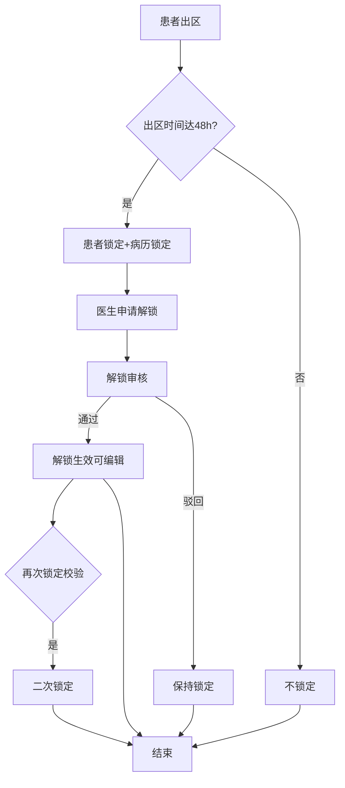
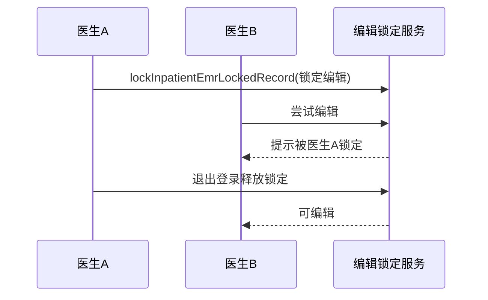

# BLGL-17-BLJS-001 病历时限锁定与编辑锁定 - Spec

> **功能编号**：BLGL-17-BLJS-001
> **文档类型**：功能Spec（业务背景与设计）
> **文档版本**：V1.0
> **编写时间**：2026-08-14
> **编写人**：RACC

---

## 文档索引

#### 章节索引

**Spec（研发视角）**

| 章节号 | 章节名称 | 内容说明 |
|--------|---------|---------|
| 1、 | 文档概述 | 文档目的、文档范围、术语定义、阅读指南、参考文档 |
| 2、 | 功能背景与定位 | 功能背景、功能定位、目标用户、核心价值 |
| 3、 | 业务流程设计 | 主流程/异常流程/边界流程（Given/When/Then） |
| 4、 | 数据模型设计 | 核心数据结构、状态定义、系统参数定义 |
| 5、 | 接口契约设计 | API列表、接口详细设计、错误码定义 |
| 6、 | 技术方案设计 | 页面路径、技术栈、关键技术点、部署方案 |
| 7、 | 测试用例预设计 | 功能/边界/异常/性能测试用例 |
| 8、 | 非功能性要求 | 性能、安全、可用性、兼容性 |
| 9、 | 依赖与风险 | 外部依赖、风险项 |
| 10、 | 附录 | 流程图、时序图、参考文档 |

**PM-Spec（业务视角）**

| 章节号 | 章节名称 | 内容说明 |
|--------|---------|---------|
| 一 | 目标 | 功能定位与核心价值 |
| 二 | 约束 | 业务/技术/非功能性约束 |
| 三 | 验收标准 | 验收条件与验证方法 |
| 四 | 排除范围 | 本次不做项与明确边界 |
| 五 | 关键决策记录 | 方案决策与选型理由 |
| 六 | 优先级 | 优先级定义 |
| 七 | 关联文档 | 关联文档索引 |
| 附录 | 填写检查清单 | 质量检查 |

**Analyst-Spec（产品视角）**

| 章节号 | 章节名称 | 内容说明 |
|--------|---------|---------|
| 一 | 功能编号体系 | 功能编号与层级结构 |
| 二 | 核心业务流程 | 核心业务流程与时序 |
| 三 | 功能规格说明 | 详细功能规格与验收标准 |
| 四 | 排除范围 | 排除范围 |
| 五 | 业务规则清单 | 业务规则清单 |
| 六 | 关联文档 | 关联文档索引 |
| 七 | 待确认问题清单 | 待确认问题汇总 |
| - | 填写检查清单 | 质量检查 |

#### 版本历史

| 版本 | 日期 | 变更说明 | 编写人 |
|------|------|---------|--------|
| V1.0 | 2026-08-14 | 初始版本 | RACC |

#### 关联文档索引

| 序号 | 文档名称 | 文档类型 | 版本 | 位置 |
|------|---------|---------|------|------|
| 1 | BLGL-17-BLJS 17病历解锁功能点Spec.md | 功能点Spec（模块级） | V1.0 | 上级目录 |
| 2 | BLGL-17-BLJS-001_病历时限锁定与编辑锁定-Spec.md | 功能Spec（业务背景与设计）（本文档） | V1.0 | 本目录 |
| 3 | BLGL-17-BLJS-001_病历时限锁定与编辑锁定_Analyst-spec.md | Analyst-Spec（分析规格） | V1.0 | 本目录 |
| 4 | BLGL-17-BLJS-001_病历时限锁定与编辑锁定_PM-spec.md | PM-Spec（需求规格） | V0.1 | 本目录 |

---

## 1、文档概述

### 1.1、文档目的

本文档旨在明确"病历时限锁定与编辑锁定"功能（BLGL-17-BLJS-001）的业务背景与设计方案，为需求分析、研发实现、测试验收及评审提供统一的业务上下文、设计口径与决策依据。

### 1.2、文档范围

#### 1.2.1 纳入范围

本文档覆盖病历时限锁定与编辑锁定的完整业务背景与设计，包括：

- 患者出区48小时后自动锁定病历（患者锁定/病历锁定区分）
- 病历时限锁定（超时未创建文书锁定）
- 住院病历编辑锁定（同一份病历不允许两人同时编辑）
- 当前用户退出登录后释放病历编辑锁定
- 编辑锁定异常退出释放

#### 1.2.2 排除范围

本文档不涉及以下内容（详见其他功能点或模块）：

- 病历解锁申请—— BLGL-17-BLJS-002
- 病历解锁审核—— BLGL-17-BLJS-003
- 解锁参数与流程配置—— BLGL-17-BLJS-004
- 锁定状态/图标展示、患者/病历锁定区分、二次锁定 —— Phase 1 功能点Spec 第6章基础能力（BC-BLJS-003、005、006）

### 1.3、术语定义

| 术语 | 定义 |
|------|------|
| 时限锁定 | 患者出区48小时/超时自动锁定病历 |
| 患者锁定 | 锁定患者不能新增和修改病历 |
| 病历锁定 | 单份病历被锁定 |
| 编辑锁定 | 同一份病历不允许两人同时编辑 |

> ⏳ 待确认：规范术语表待产品文档确认。

### 1.4、阅读指南

- **章节关系**：第1~2章为业务全貌，第3~10章为设计实现层。与 Analyst-Spec、PM-Spec 互相引用保持一致。
- **读者对象**：产品经理/需求分析师读第1~2章；研发读第3~6、9~10章；测试读第3、7~8章；评审人员核对各层一致性。

### 1.5、参考文档

| 序号 | 文档名称 | 版本/日期 |
|------|---------|----------|
| 1 | 【历史需求】住院病历的历史需求.xlsx | - |
| 2 | BLGL-17-BLJS-001_病历时限锁定与编辑锁定_PM-spec.md | V0.1 |
| 3 | BLGL-17-BLJS-001_病历时限锁定与编辑锁定_Analyst-spec.md | V1.0 |
| 4 | BLGL-17-BLJS 17病历解锁功能点Spec.md | V1.0 |

---

## 2、功能背景与定位

### 2.1 功能背景

病历时限锁定与编辑锁定是病历解锁流程的锁定环节，需满足：

- **管理要求**：出区48小时后锁定患者不让医生操作病历，质控科开始质控；同一份病历不允许两人同时编辑
- **现状痛点**：
  - 单客户端编辑模式下异常退出后锁定未释放，其他病程无法书写
  - 取消入区后再次入区仍用旧入区时间计算时限，病历被错误锁定
- **历史需求演进**：从编辑锁定建立（3、1222975）→ 出区48h时限锁定→ 异常锁定释放优化（3）→ 实际入区时间判定（8）

### 2.2 功能定位

"病历时限锁定与编辑锁定"是 WiNEX 病历管理-病历解锁模块的锁定环节，定位为：

- **时限锁定保护**：出区48h/超时自动锁定病历，支撑质控
- **并发编辑保护**：同一份病历不允许两人同时编辑
- **锁定状态管理**：患者锁定/病历锁定统一管理

### 2.3 目标用户

| 用户角色 | 主要使用场景 |
|---------|-------------|
| 住院医生 | 编辑病历（编辑锁定）、查看锁定状态 |
| 质控科 | 出区48h后质控（时限锁定） |

### 2.4 核心价值

| 价值维度 | 价值描述 |
|---------|---------|
| 质控支撑 | 时限锁定保障质控科质控 |
| 并发保护 | 同一病历不允许两人同时编辑 |
| 锁定释放 | 退出登录/异常退出释放锁定 |

---

## 3、业务流程设计（Given/When/Then）

### 3.1 主流程

**Scenario 1: 患者出区48小时自动锁定**

```gherkin
Given:
  - 参数"超时锁定患者的条件配置"已配置（患者出区/48小时）
  - 患者已出区48小时

When:
  - 出区时间达到48小时

Then:
  - 患者锁定，不能新增和修改病历
  - 区分患者锁定/病历锁定
  - 质控科开始质控
```

### 3.2 异常流程

**Scenario 2: 业务异常——异常锁定未释放**

```gherkin
Given:
  - 参数 COMMON319（是否启用病历单客户端编辑模式）=是
  - 病历被当前电脑锁定正在编辑

When:
  - 程序闪退等异常退出

Then:
  - 应释放锁定，不能一直锁定占用
  - 异常退出也需及时释放锁定
```

**Scenario 3: 数据异常——错误锁定**

```gherkin
Given:
  - 患者取消入区后再次入区

When:
  - 时限锁定规则计算

Then:
  - 应使用当次实际入区时间（最新有效入区记录）
  - 不能使用已取消的入区时间导致错误锁定
```

**Scenario 4: 系统异常——编辑锁定未释放**

```gherkin
Given:
  - 病历打开在编辑界面

When:
  - 用户退出登录/切换科室/跳转/锁屏

Then:
  - 应释放当前病历编辑锁定，让其他人可编辑
  - 锁屏只通知不拦截，自动保存
```

### 3.3 边界流程

**Scenario 5: 边界场景——同一病历两人同时编辑**

```gherkin
Given:
  - 病历已被用户A编辑

When:
  - 用户B尝试编辑

Then:
  - 图标显示锁定标识
  - 提示"当前病历正在被***，IP为***的用户编辑"
  - 用户A可在文书目录右键解锁
```

**Scenario 6: 边界场景——新建病历锁定校验**

```gherkin
Given:
  - 医生新建病历

When:
  - 点击确定

Then:
  - 校验病历锁定流程
  - 文书锁定状态提示"文书超时未创建，现已锁定请申请解锁"
  - 不可创建病历
```

---

## 4、数据模型设计

> 数据模型信息来自代码扫描（`E:\39EMR\sr-next`）和历史需求。标注 `` 的表名/字段来自 PO 实体，标注 `` 的来自需求文本。

### 4.1 核心数据结构

#### 4.1.1 核心表/实体

| 表/实体 | 关键字段 | 说明 |
|---------|---------|------|
| INP_EMR_TIME_QCR_LOCK_ACTION（InpEmrTimeQcrLockActionPO） | INP_EMR_TIME_QCR_LOCK_ACT_ID、INP_EMR_QCR_UNLOCK_APPLY_ID、INP_RHB_RECORD_ID、INP_MRT_MONITOR_ID、ENCOUNTER_ID、LOCKED_TIMES | 时限锁定动作表 |
| InpatientEmrLockedRecordPO | 锁定记录 | 编辑锁定记录表 |
| 住院就诊表 | 病历锁定标志 | 患者锁定/病历锁定状态 |

> ⏳ 待确认：完整数据表清单待代码扫描或功能清单数据表清单补充。

### 4.2 状态定义

| 状态码 | 状态名称 | 说明 |
|--------|---------|------|
| 患者锁定 | 是/否 | 患者锁定状态 |
| 病历锁定 | 锁定/解锁 | 病历锁定状态 |
| LOCKED_TIMES | 锁定次数 | 锁定次数 |

### 4.3 系统参数定义

| 参数编码 | 参数名称 | 说明 |
|---------|---------|------|
| 超时锁定患者的条件配置 | 锁定条件 | 默认空，如患者出区/48小时 |
| COMMON319 | 是否启用病历单客户端编辑模式 | 控制编辑锁定 |
| 病历时限锁定 | 时限锁定开关 | 默认否 |

---

## 5、接口契约设计

> 接口信息来自代码扫描（`E:\39EMR\sr-next`）的 InpEmrLockController + InpEmrLockedController。标注 ``。

### 5.1 API列表

| 序号 | API名称（代码函数） | 路径 | 方法 | 说明 |
|:----:|---------|------|:----:|------|
| 1 | queryInpEmrTimeQcrLockActionByExample | /api/v1/app_record_inpatient/emr_inpatient/inp_emr_time_qcr_lock_action/query/by_example | POST | 查询锁定病历 |
| 2 | queryInpEmrTimeQcrLock | /api/v1/app_record_inpatient/emr_inpatient/time_qcr_lock/query | POST | 查询时限质控是否患者锁定 |
| 3 | lockInpatientEmrLockedRecord | /api/v1/app_record_inpatient/emr_inpatient/locked_record/lock | POST | 锁定编辑病历锁定记录 |
| 4 | unlockInpatientEmrLockedRecord | /api/v1/app_record_inpatient/emr_inpatient/locked_record/unlock | POST | 解锁编辑病历锁定记录 |
| 5 | deleteInpatientEmrLockedRecord | /api/v1/app_record_inpatient/emr_inpatient/locked_record/delete | POST | 批量删除病历锁定记录 |

> 前端实际请求前缀：`/inpatient-clinicalnote/api/v1/app_record_inpatient/`。

### 5.2 接口详细设计

#### 5.2.1 查询锁定病历（queryInpEmrTimeQcrLockActionByExample）

**请求参数（InpEmrTimeQcrLockActionQueryInputAO）**:
```json
{
  "encounterId": 1001,
  "inpRhbRecordId": 2001,
  "lockStatus": 1,
  "pageNum": 1,
  "pageSize": 20
}
```

**返回值（成功，WinPagedList<InpEmrTimeLockActionOutputVO>）**:
```json
{
  "success": true,
  "data": {
    "list": [
      {
        "inpEmrTimeQcrLockActId": 5001,
        "inpRhbRecordId": 2001,
        "inpMrtMonitorName": "首次病程记录",
        "lockedTimes": 1
      }
    ],
    "total": 3
  }
}
```

**返回值（失败）**:
```json
{
  "success": false,
  "message": "查询失败",
  "data": null
}
```

> ⏳ 待确认：具体字段名/结构以接口契约文档为准。

### 5.3 错误码定义

| 错误码 | 错误信息 | 处理方式 |
|--------|---------|---------|
| ⏳ 待确认 | 解锁审核系统报错 | 排查解锁流程 |

> ⏳ 待确认：业务错误码定义未在代码扫描中提取完整。

---

## 6、技术方案设计

### 6.1 页面路径

- **页面路径**: 住院医生站→病历书写页面；日常管理→病历管理→病历解锁申请
- **前端组件**: MedicalRecordLocking/（病历解锁主页面）
- **后端接口**: InpEmrLockController（时限锁定）+ InpEmrLockedController（编辑锁定）

### 6.2 技术栈

| 类别 | 技术 | 版本 |
|------|------|------|
| 前端框架 | Vue | 2.6.14 |
| 前端UI | element-ui | 2.13.0 |
| 后端框架 | Spring Boot（Java） | java.version 17 |
| 构建工具 | webpack / Maven | 前端 webpack + 后端 Maven |

### 6.3 关键技术点

- 时限锁定：超时锁定患者配置（出区48h），患者锁定/病历锁定区分
- 编辑锁定：lockInpatientEmrLockedRecord / unlockInpatientEmrLockedRecord
- 锁定释放：退出登录/切换科室/跳转/锁屏释放
- 异常释放：闪退等异常退出释放锁定
- 实际入区时间：按最新有效入区记录计算时限

### 6.4 部署方案

⏳ 待确认：部署方案未在资料区中找到。

---

## 7、测试用例预设计

### 7.1 功能测试

| 用例编号 | 测试场景 | Given | When | Then |
|---------|---------|-------|------|------|
| TC-001 | 出区48h自动锁定 | 参数已配置，患者出区48h | 出区时间达48h | 患者锁定不能新增修改病历 |
| TC-002 | 编辑锁定释放 | 单客户端编辑模式 | 退出登录 | 释放编辑锁定（3） |

### 7.2 边界测试

| 用例编号 | 测试场景 | Given | When | Then |
|---------|---------|-------|------|------|
| TC-003 | 同一病历两人编辑 | 病历被用户A编辑 | 用户B编辑 | 显示锁定标识+提示（5） |
| TC-004 | 新建病历锁定校验 | 文书超时锁定 | 新建病历 | 提示申请解锁，不可创建 |

### 7.3 异常测试

| 用例编号 | 测试场景 | Given | When | Then |
|---------|---------|-------|------|------|
| TC-005 | 异常锁定未释放 | 编辑界面异常退出 | 再次打开 | 释放锁定（3） |
| TC-006 | 错误锁定 | 取消入区再入区 | 时限锁定计算 | 按实际入区时间（8） |

### 7.4 性能测试

| 用例编号 | 测试场景 | 指标 |
|---------|---------|------|
| TC-007 | 锁定校验响应 | ⏳ 待确认：性能指标未在资料区中找到 |

---

## 8、非功能性要求

### 8.1 性能要求

| 指标 | 要求 |
|------|------|
| 锁定校验响应 | ⏳ 待确认 |

### 8.2 安全要求

| 要求 | 说明 |
|------|------|
| 并发保护 | 同一病历不允许两人同时编辑 |

**医疗行业特殊要求**

| 要求 | 说明 |
|------|------|
| 质控合规 | 时限锁定支撑质控 |
| 病历安全 | 锁定防并发修改 |

### 8.3 可用性要求

| 指标 | 要求值 |
|------|--------|
| 可用性 | ⏳ 待确认 |

### 8.4 兼容性要求

| 类型 | 要求 |
|------|------|
| 编辑模式兼容 | COMMON319单客户端编辑模式 |

---

## 9、依赖与风险

### 9.1 外部依赖

| 依赖项 | 说明 |
|--------|------|
| 主数据系统 | 锁定参数配置 |

### 9.2 风险项

| 风险项 | 等级 | 说明 | 应对方案 |
|--------|------|------|---------|
| 锁定未释放 | 中 | 异常退出锁定占用 | 异常退出释放锁定 |
| 错误锁定 | 中 | 取消入区再入区误锁 | 按实际入区时间 |

---

## 10、附录

### 10.1 流程图



### 10.2 时序图



### 10.3 参考文档

- BLGL-17-BLJS 17病历解锁功能点Spec.md（V1.0，第5章 -001 行）
- 关联Spec: BLGL-17-BLJS-002（解锁申请）、-004（参数配置）

---

## 填写检查清单

| 序号 | 检查项 | 是否完成 |
|:----:|--------|:--------:|
| 1 | 章节索引与正文章节一致 | ✅ |
| 2 | 版本历史记录完整 | ✅ |
| 3 | 关联文档索引已登记全部Spec | ✅ |
| 4 | 文档目的明确回答"为什么做/做成什么/怎么做" | ✅ |
| 5 | 纳入范围/排除范围清晰 | ✅ |
| 6 | 术语定义覆盖关键概念，从资料区可溯源 | ✅ |
| 7 | 参考文档已登记 | ✅ |
| 8 | 功能背景基于法规/规范/需求来源组织 | ✅ |
| 9 | 功能定位体现业务价值（3~5个定位点） | ✅ |
| 10 | 目标用户角色覆盖完整，在需求原文中有出处 | ✅ |
| 11 | 核心价值可陈述，与 Phase 1 口径一致 | ✅ |
| 12 | 业务流程：主流程≥1、异常≥3、边界≥2，Given/When/Then 具体 | ✅ |
| 13 | 数据模型：字段/表/状态/参数可溯源 | ✅ |
| 14 | 接口契约：API列表+详细设计+错误码齐全或标记待确认 | ✅ |
| 15 | 技术方案：页面路径/技术栈/关键点/部署方案或标记待确认 | ✅ |
| 16 | 测试用例：功能/边界/异常/性能覆盖 | ✅ |
| 17 | 非功能性要求：性能/安全/可用性/兼容性指标可量化或标记待确认 | ✅ |
| 18 | 依赖与风险：外部依赖登记完整 | ✅ |
| 19 | 附录：流程图/时序图与正文流程一致 | ✅ |
| 20 | 全文无占位符 `< >` 残留 | ✅ |
| 21 | 全文陈述可溯源至资料区 | ✅ |
| 22 | 人工审核确认完成 | ⏳ 待确认 |

---

**文档状态**：⬜ 待审核
**维护责任**：RACC
**下次更新**：根据评审反馈优化
