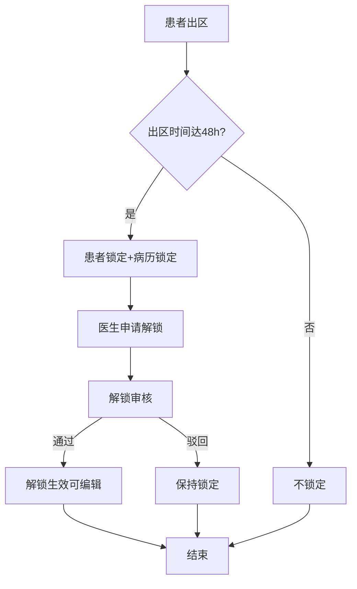
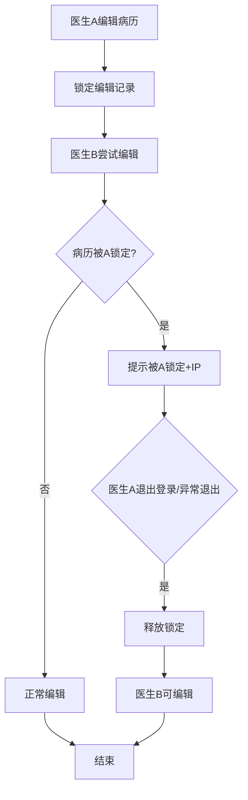

# BLGL-17-BLJS-001病历时限锁定与编辑锁定_ Analyst - Spec

> **需求编号**：BLGL-17-BLJS-001
> **父需求**：BLGL-17-BLJS
> **关联PM Spec**：BLGL-17-BLJS-001_病历时限锁定与编辑锁定_PM-spec.md
> **Spec版本**：V1.0
> **编写时间**：2026-08-14
> **编写人**：需求分析师

---

## 一、功能编号体系

### 1.1 功能层级结构

```
BLGL-17-BLJS-001: 病历时限锁定与编辑锁定
  ├─ BLGL-17-BLJS-001-01: 病历时限锁定
  │   ├─ -01-01: 患者出区48h自动锁定
  │   ├─ -01-02: 超时未创建文书锁定
  │   └─ -01-03: 患者锁定/病历锁定区分
  ├─ BLGL-17-BLJS-001-02: 病历编辑锁定
  │   ├─ -02-01: 同一病历两人同时编辑锁定
  │   ├─ -02-02: 退出登录释放锁定
  │   └─ -02-03: 异常退出释放锁定
  └─ BLGL-17-BLJS-001-03: 锁定校验与时间判定
      ├─ -03-01: 新建病历锁定校验
      └─ -03-02: 按实际入区时间判定
```

### 1.2 功能编号表

| REQ-ID | 功能名称 | 类型 | 优先级 | 说明 |
|--------|---------|------|--------|------|
| BLGL-17-BLJS-001-01 | 病历时限锁定 | 功能 | P0 | 出区48h/超时锁定 |
| BLGL-17-BLJS-001-01-01 | 出区48h自动锁定 | 子功能 | P0 | 患者锁定不能编辑 |
| BLGL-17-BLJS-001-01-02 | 超时未创建锁定 | 子功能 | P0 | 文书锁定提示 |
| BLGL-17-BLJS-001-01-03 | 患者/病历锁定区分 | 子功能 | P1 | 区分展示 |
| BLGL-17-BLJS-001-02 | 病历编辑锁定 | 功能 | P0 | 并发保护 |
| BLGL-17-BLJS-001-02-01 | 两人同时编辑锁定 | 子功能 | P0 | 锁定标识+提示 |
| BLGL-17-BLJS-001-02-02 | 退出登录释放 | 子功能 | P0 | 释放锁定 |
| BLGL-17-BLJS-001-02-03 | 异常退出释放 | 子功能 | P1 | 闪退释放 |
| BLGL-17-BLJS-001-03 | 锁定校验与时间判定 | 功能 | P1 | 校验/时间判定 |
| BLGL-17-BLJS-001-03-01 | 新建病历锁定校验 | 子功能 | P1 | 校验锁定流程 |
| BLGL-17-BLJS-001-03-02 | 实际入区时间判定 | 子功能 | P1 | 最新有效入区 |

---

## 二、核心业务流程

### 2.1 时限锁定流程



### 2.2 编辑锁定流程



---

## 三、功能规格说明

---

### BLGL-17-BLJS-001-01: 病历时限锁定

#### 3.1.1 功能概述

患者出区48小时后自动锁定病历（患者锁定/病历锁定区分），超时未创建的文书锁定并提示申请解锁。

#### 3.1.2 用户角色

| 角色 | 使用场景 | 权限要求 | 操作频率 |
|------|---------|---------|---------|
| 质控科 | 出区48h后质控 | 质控权限 | 低频 |
| 住院医生 | 查看锁定状态 | 病历权限 | 中频 |

#### 3.1.3 业务流程（Given/When/Then）

##### 主流程

**Scenario 1: 患者出区48小时自动锁定**

```gherkin
Given:
  - 参数"超时锁定患者的条件配置"已配置（患者出区/48小时）
  - 患者已出区48小时

When:
  - 出区时间达到48小时

Then:
  - 患者锁定，不能新增和修改病历
  - 区分患者锁定/病历锁定
  - 质控科开始质控
```

##### 异常流程

**Scenario 2: 数据异常——错误锁定**

```gherkin
Given:
  - 患者取消入区后再次入区

When:
  - 时限锁定规则计算

Then:
  - 应使用当次实际入区时间（最新有效入区记录）
  - 不能使用已取消的入区时间导致错误锁定
```

##### 边界流程

**Scenario 3: 边界场景——新建病历锁定校验**

```gherkin
Given:
  - 医生新建病历

When:
  - 点击确定

Then:
  - 校验病历锁定流程
  - 文书锁定状态提示"文书超时未创建，现已锁定请申请解锁"
  - 不可创建病历
```

**Scenario 4: 边界场景——患者/病历锁定区分**

```gherkin
Given:
  - 患者出区48h锁定

When:
  - 查看解锁申请页面

Then:
  - 患者锁定显示【是/否】
  - 患者锁定置顶并显示蓝色
  - 锁定类型区分患者锁定/病历锁定
```

#### 3.1.4 数据字段定义

> 字段名来自代码扫描（`E:\39EMR\sr-next`，标注 ``）。

| 字段名 | 类型 | 必填 | 默认值 | 取值范围 | 说明 | 概念ID |
|--------|------|------|--------|---------|------|--------|
| inpEmrTimeQcrLockActId | Long | 是 | - | - | 时限锁定ID | ⏳ 待确认 |
| inpRhbRecordId | Long | 是 | - | - | 病历簿ID | ⏳ 待确认 |
| inpMrtMonitorId | Long | 是 | - | - | 监控类型ID | ⏳ 待确认 |
| lockedTimes | Integer | 否 | 0 | - | 锁定次数 | ⏳ 待确认 |

#### 3.1.5 验收标准

| AC编号 | 验收标准 | 对应REQ-ID | 验证方法 | 验证场景 |
|--------|---------|-----------|---------|---------|
| AC-001 | 患者出区48小时后自动锁定，不能新增修改病历 | -001-01 | 功能测试 | Scenario 1 |
| AC-002 | 病历时限锁定按当次实际入区时间判定 | -001-01 | 功能测试 | Scenario 2 |
| AC-003 | 新建病历锁定校验提示申请解锁 | -001-01 | 功能测试 | Scenario 3 |

---

### BLGL-17-BLJS-001-02: 病历编辑锁定

#### 3.2.1 功能概述

同一份病历不允许两人同时编辑，当前用户退出登录后释放锁定，异常退出（闪退）也释放锁定。

#### 3.2.2 用户角色

| 角色 | 使用场景 | 权限要求 | 操作频率 |
|------|---------|---------|---------|
| 住院医生 | 编辑病历（编辑锁定） | 病历编辑权限 | 高频 |

#### 3.2.3 业务流程（Given/When/Then）

##### 主流程

**Scenario 1: 同一病历两人同时编辑锁定**

```gherkin
Given:
  - 病历已被用户A编辑

When:
  - 用户B尝试编辑

Then:
  - 图标显示锁定标识
  - 提示"当前病历正在被***，IP为***的用户编辑"
  - 用户A可在文书目录右键解锁
```

##### 异常流程

**Scenario 2: 业务异常——异常锁定未释放**

```gherkin
Given:
  - 参数 COMMON319=是
  - 病历被当前电脑锁定正在编辑

When:
  - 程序闪退等异常退出

Then:
  - 应释放锁定，不能一直锁定占用
  - 异常退出也需及时释放锁定
```

**Scenario 3: 系统异常——编辑锁定未释放**

```gherkin
Given:
  - 病历打开在编辑界面

When:
  - 用户退出登录/切换科室/跳转/锁屏

Then:
  - 应释放当前病历编辑锁定，让其他人可编辑
  - 锁屏只通知不拦截，自动保存
```

##### 边界流程

**Scenario 4: 边界场景——右键解锁**

```gherkin
Given:
  - 已锁定的病历

When:
  - 用户A在文书目录右键

Then:
  - 提供解锁操作
  - 解锁后他人可编辑
```

#### 3.2.4 数据字段定义

| 字段名 | 类型 | 必填 | 默认值 | 取值范围 | 说明 | 概念ID |
|--------|------|------|--------|---------|------|--------|
| lockInpatientEmrLockedRecord | - | 否 | - | - | 锁定编辑接口 | ⏳ 待确认 |
| unlockInpatientEmrLockedRecord | - | 否 | - | - | 解锁编辑接口 | ⏳ 待确认 |

#### 3.2.5 验收标准

| AC编号 | 验收标准 | 对应REQ-ID | 验证方法 | 验证场景 |
|--------|---------|-----------|---------|---------|
| AC-004 | 同一份病历不允许两人同时编辑，提示锁定信息 | -001-02 | 功能测试 | Scenario 1 |
| AC-005 | 当前用户退出登录后释放病历编辑锁定 | -001-02 | 功能测试 | Scenario 3 |
| AC-006 | 编辑界面异常退出后释放锁定 | -001-02 | 功能测试 | Scenario 2 |

---

### BLGL-17-BLJS-001-03: 锁定校验与时间判定

#### 3.3.1 功能概述

新建病历锁定校验（校验锁定流程提示申请解锁），病历时限锁定按实际入区时间判定。

#### 3.3.2 用户角色

| 角色 | 使用场景 | 权限要求 | 操作频率 |
|------|---------|---------|---------|
| 住院医生 | 新建病历/书写 | 病历编辑权限 | 高频 |

#### 3.3.3 业务流程（Given/When/Then）

##### 主流程

**Scenario 1: 新建病历锁定校验**

```gherkin
Given:
  - 医生新建病历

When:
  - 点击确定

Then:
  - 优先校验病历业务流程
  - 通过后再校验锁定流程
  - 锁定状态提示"文书超时未创建，现已锁定请申请解锁"
```

##### 边界流程

**Scenario 2: 边界场景——实际入区时间判定**

```gherkin
Given:
  - 患者取消入区后再次入区

When:
  - 时限锁定规则计算

Then:
  - 按当次实际入区时间（最新有效入区记录）计算
  - 取消入区时处理关联锁定记录
```

#### 3.3.4 数据字段定义

| 字段名 | 类型 | 必填 | 默认值 | 取值范围 | 说明 | 概念ID |
|--------|------|------|--------|---------|------|--------|
| 实际入区时间 | Date | 否 | - | - | 最新有效入区记录 | ⏳ 待确认 |

#### 3.3.5 验收标准

| AC编号 | 验收标准 | 对应REQ-ID | 验证方法 | 验证场景 |
|--------|---------|-----------|---------|---------|
| AC-007 | 新建病历锁定校验提示申请解锁，不可创建 | -001-03 | 功能测试 | Scenario 1 |

---

## 四、排除范围

本需求不包含以下功能项：

1. **病历解锁申请** - 属 BLGL-17-BLJS-002
2. **病历解锁审核** - 属 BLGL-17-BLJS-003
3. **解锁参数与流程配置** - 属 BLGL-17-BLJS-004
4. **锁定状态展示、患者/病历锁定区分、二次锁定** - 属基础能力 BC-BLJS-003/005/006

> 与 PM-Spec 第四章一致。对照 Phase 1 功能点Spec 第6章（基线能力），确保不越界。

---

## 五、业务规则清单

| 规则ID | 规则名称 | 规则描述 | 来源 | 优先级 |
|--------|---------|---------|------|--------|
| BR-001 | 出区48h锁定 | 患者出区48小时后自动锁定病历 |  | P0 |
| BR-002 | 患者/病历锁定区分 | 区分患者锁定和病历锁定 |  | P1 |
| BR-003 | 超时未创建锁定 | 文书超时未创建提示申请解锁 |  | P1 |
| BR-004 | 并发编辑锁定 | 同一份病历不允许两人同时编辑 | 5 | P0 |
| BR-005 | 退出释放锁定 | 当前用户退出登录后释放编辑锁定 | 3 | P0 |
| BR-006 | 异常释放锁定 | 闪退等异常退出释放锁定 | 3 | P1 |
| BR-007 | 实际入区时间 | 时限锁定按当次实际入区时间判定 | 8 | P1 |

---

## 六、关联文档

| 文档类型 | 文档路径 | 说明 |
|---------|---------|------|
| 功能点Spec（模块级） | 上级目录 BLGL-17-BLJS 17病历解锁功能点Spec.md（V1.0） | 模块级功能点索引 |
| 功能Spec（业务背景与设计） | 本目录 BLGL-17-BLJS-001_病历时限锁定与编辑锁定-Spec.md（V1.0） | 业务背景与目标 Spec |
| Analyst-Spec（分析规格） | 本目录 BLGL-17-BLJS-001_病历时限锁定与编辑锁定_Analyst-spec.md（V1.0）（本文档） | 分析规格 |
| PM-Spec（需求规格） | 本目录 BLGL-17-BLJS-001_病历时限锁定与编辑锁定_PM-spec.md（V0.1） | PM 产出的 Spec 文档 |
| data-model.md | 待产出 | 架构师产出的数据建模文档 |
| design.md | 待产出 | 架构师产出的技术方案文档 |
| api-contract.md | 待产出 | 开发经理产出的 API 契约文档 |

---

## 七、待确认问题清单

| 编号 | 问题描述 | 缺失信息 | 影响范围 | 建议补充方 |
|------|---------|---------|---------|-----------|
| Q-001 | 锁定校验接口契约 | 新建病历锁定校验接口 | 第5章接口设计 | 开发经理 |
| Q-002 | 编辑锁定释放机制 | 异常退出释放技术方案 | 3.2.3 Scenario 2 | 开发经理 |
| Q-003 | 概念ID、性能指标 | 字段概念ID、锁定SLA | 数据模型、非功能 | 架构师/产品经理 |

---

## 填写检查清单

| 序号 | 检查项 | 是否完成 |
|:----:|--------|:--------:|
| 1 | 功能编号带父子层级 | ✅ |
| 2 | 每个 REQ-ID 有功能概述和用户角色 | ✅ |
| 3 | 主流程至少 1 个 Given/When/Then 场景 | ✅ |
| 4 | 异常流程至少 3 个 Given/When/Then 场景 | ✅ |
| 5 | 边界流程至少 2 个 Given/When/Then 场景 | ✅ |
| 6 | 每个 Given/When/Then 内容具体，不模糊 | ✅ |
| 7 | 数据字段定义完整 | ✅ |
| 8 | 验收标准 AC 编号独立，可验证 | ✅ |
| 9 | 验收标准无"功能正常"等模糊表述 | ✅ |
| 10 | 排除范围明确列出 | ✅ |
| 11 | 业务规则清单列出所有规则，每条标注来源 | ✅ |
| 12 | 流程图使用 Mermaid 格式（≥2 个） | ✅ |
| 13 | 关联文档索引包含 Phase 1 功能点Spec | ✅ |
| 14 | 待确认问题清单汇总了全文所有 ⏳ 项 | ✅ |
| 15 | 全文无占位符 `< >` 残留 | ✅ |
| 16 | 全文陈述可溯源至资料区（S1~S10 溯源核查） | ✅ |
| 17 | 人工审核确认完成 | ⏳ 待确认 |

---

**文档状态**：⬜ 待审核
**维护责任**：需求分析师规范组
**下次更新**：根据评审反馈优化

---

## 版本历史

| 版本 | 日期 | 变更说明 | 编写人 |
|------|------|---------|--------|
| V1.0 | 2026-08-14 | 初始版本 | 需求分析师 |
