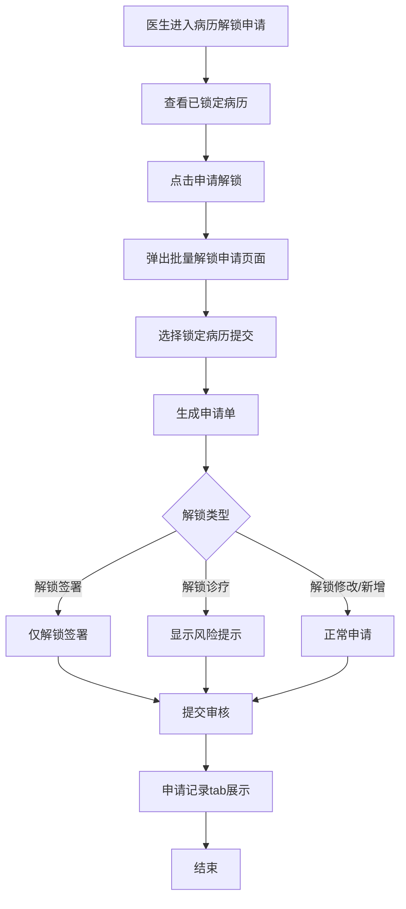
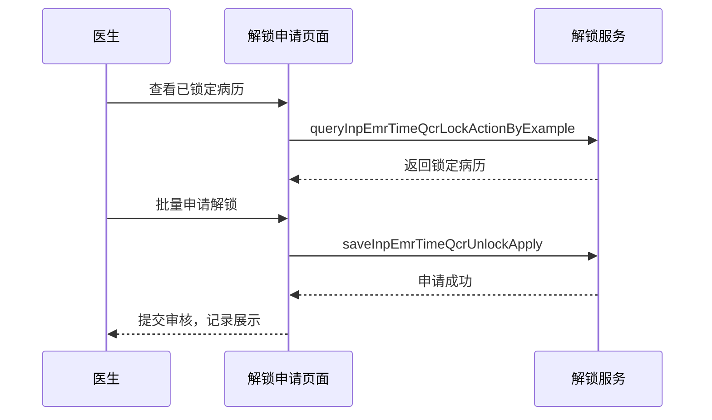

# BLGL-17-BLJS-002 病历解锁申请 - Spec

> **功能编号**：BLGL-17-BLJS-002
> **文档类型**：功能Spec（业务背景与设计）
> **文档版本**：V1.0
> **编写时间**：2026-08-14
> **编写人**：RACC

---

## 文档索引

#### 章节索引

**Spec（研发视角）**

| 章节号 | 章节名称 | 内容说明 |
|--------|---------|---------|
| 1、 | 文档概述 | 文档目的、文档范围、术语定义、阅读指南、参考文档 |
| 2、 | 功能背景与定位 | 功能背景、功能定位、目标用户、核心价值 |
| 3、 | 业务流程设计 | 主流程/异常流程/边界流程（Given/When/Then） |
| 4、 | 数据模型设计 | 核心数据结构、状态定义、系统参数定义 |
| 5、 | 接口契约设计 | API列表、接口详细设计、错误码定义 |
| 6、 | 技术方案设计 | 页面路径、技术栈、关键技术点、部署方案 |
| 7、 | 测试用例预设计 | 功能/边界/异常/性能测试用例 |
| 8、 | 非功能性要求 | 性能、安全、可用性、兼容性 |
| 9、 | 依赖与风险 | 外部依赖、风险项 |
| 10、 | 附录 | 流程图、时序图、参考文档 |

**PM-Spec（业务视角）**

| 章节号 | 章节名称 | 内容说明 |
|--------|---------|---------|
| 一 | 目标 | 功能定位与核心价值 |
| 二 | 约束 | 业务/技术/非功能性约束 |
| 三 | 验收标准 | 验收条件与验证方法 |
| 四 | 排除范围 | 本次不做项与明确边界 |
| 五 | 关键决策记录 | 方案决策与选型理由 |
| 六 | 优先级 | 优先级定义 |
| 七 | 关联文档 | 关联文档索引 |
| 附录 | 填写检查清单 | 质量检查 |

**Analyst-Spec（产品视角）**

| 章节号 | 章节名称 | 内容说明 |
|--------|---------|---------|
| 一 | 功能编号体系 | 功能编号与层级结构 |
| 二 | 核心业务流程 | 核心业务流程与时序 |
| 三 | 功能规格说明 | 详细功能规格与验收标准 |
| 四 | 排除范围 | 排除范围 |
| 五 | 业务规则清单 | 业务规则清单 |
| 六 | 关联文档 | 关联文档索引 |
| 七 | 待确认问题清单 | 待确认问题汇总 |
| - | 填写检查清单 | 质量检查 |

#### 版本历史

| 版本 | 日期 | 变更说明 | 编写人 |
|------|------|---------|--------|
| V1.0 | 2026-08-14 | 初始版本 | RACC |

#### 关联文档索引

| 序号 | 文档名称 | 文档类型 | 版本 | 位置 |
|------|---------|---------|------|------|
| 1 | BLGL-17-BLJS 17病历解锁功能点Spec.md | 功能点Spec（模块级） | V1.0 | 上级目录 |
| 2 | BLGL-17-BLJS-002_病历解锁申请-Spec.md | 功能Spec（业务背景与设计）（本文档） | V1.0 | 本目录 |
| 3 | BLGL-17-BLJS-002_病历解锁申请_Analyst-spec.md | Analyst-Spec（分析规格） | V1.0 | 本目录 |
| 4 | BLGL-17-BLJS-002_病历解锁申请_PM-spec.md | PM-Spec（需求规格） | V0.1 | 本目录 |

---

## 1、文档概述

### 1.1、文档目的

本文档旨在明确"病历解锁申请"功能（BLGL-17-BLJS-002）的业务背景与设计方案，为需求分析、研发实现、测试验收及评审提供统一的业务上下文、设计口径与决策依据。

### 1.2、文档范围

#### 1.2.1 纳入范围

本文档覆盖病历解锁申请的完整业务背景与设计，包括：

- 已锁定病历查询与申请解锁（批量解锁申请）
- 病历解锁申请记录查询（已锁定病历/申请记录两个tab）
- 解锁签署申请（按病历有效期锁定）
- 解锁诊疗申请（含风险提示信息）
- 患者锁定/病历锁定区分展示

#### 1.2.2 排除范围

本文档不涉及以下内容（详见其他功能点或模块）：

- 病历时限锁定与编辑锁定—— BLGL-17-BLJS-001
- 病历解锁审核—— BLGL-17-BLJS-003
- 解锁参数与流程配置—— BLGL-17-BLJS-004
- 解锁申请导出、风险提示 —— Phase 1 功能点Spec 第6章基础能力（BC-BLJS-002、004）

### 1.3、术语定义

| 术语 | 定义 |
|------|------|
| 病历解锁申请 | 医生对已锁定病历提交解锁申请 |
| 批量解锁申请 | 一个申请单包含多个任务 |
| 解锁签署 | 锁定后仅允许申请解锁签署 |
| 解锁诊疗 | 解锁诊疗功能，申请时显示风险提示 |

> ⏳ 待确认：规范术语表待产品文档确认。

### 1.4、阅读指南

- **章节关系**：第1~2章为业务全貌，第3~10章为设计实现层。与 Analyst-Spec、PM-Spec 互相引用保持一致。
- **读者对象**：产品经理/需求分析师读第1~2章；研发读第3~6、9~10章；测试读第3、7~8章；评审人员核对各层一致性。

### 1.5、参考文档

| 序号 | 文档名称 | 版本/日期 |
|------|---------|----------|
| 1 | 【历史需求】住院病历的历史需求.xlsx | - |
| 2 | BLGL-17-BLJS-002_病历解锁申请_PM-spec.md | V0.1 |
| 3 | BLGL-17-BLJS-002_病历解锁申请_Analyst-spec.md | V1.0 |
| 4 | BLGL-17-BLJS 17病历解锁功能点Spec.md | V1.0 |

---

## 2、功能背景与定位

### 2.1 功能背景

病历解锁申请是解锁流程的提交环节，需满足：

- **管理要求**：医生对已锁定病历提交解锁申请，走审批流程
- **现状痛点**：
  - 科主任无法审批已提交的解锁申请
  - 解锁申请无批量操作，需逐个申请
- **历史需求演进**：从解锁申请建立→ 批量申请→ 解锁签署（1）→ 解锁诊疗风险提示（4）

### 2.2 功能定位

"病历解锁申请"是 WiNEX 病历管理-病历解锁模块的提交环节，定位为：

- **解锁申请入口**：医生提交解锁申请
- **批量操作**：一个申请单包含多个任务
- **类型多样**：解锁修改/新增/签署/诊疗

### 2.3 目标用户

| 用户角色 | 主要使用场景 |
|---------|-------------|
| 住院医生 | 提交病历解锁申请 |
| 责任医生 | 查看已锁定病历申请解锁 |

### 2.4 核心价值

| 价值维度 | 价值描述 |
|---------|---------|
| 效率提升 | 批量解锁申请 |
| 类型灵活 | 解锁修改/新增/签署/诊疗 |
| 风险提示 | 解锁诊疗风险提示 |

---

## 3、业务流程设计（Given/When/Then）

### 3.1 主流程

**Scenario 1: 病历解锁申请**

```gherkin
Given:
  - 医生有待解锁的已锁定病历

When:
  - 医生进入"病历解锁申请"页面
  - 查看已锁定病历
  - 点击申请解锁（可批量）
  - 弹出批量解锁申请页面

Then:
  - 生成申请单（一个申请单包含多个任务）
  - 提交后进入审核流程
  - 申请记录显示在"申请记录"tab
```

### 3.2 异常流程

**Scenario 2: 业务异常——科主任无法审批**

```gherkin
Given:
  - 医生已提交病历解锁申请

When:
  - 科主任尝试审批

Then:
  - 科主任无法审批（原问题）
  - ⏳ 待确认：审批流程配置问题（4）
```

**Scenario 3: 数据异常——申请记录缺失**

```gherkin
Given:
  - 医生已提交解锁申请

When:
  - 医生查询申请记录

Then:
  - 申请记录按申请单模式展示
  - 状态：审核中/已通过/不通过
  - ⏳ 待确认：申请记录缺失时的处理
```

**Scenario 4: 系统异常——解锁异常**

```gherkin
Given:
  - 病历锁定后

When:
  - 医生提交解锁申请

Then:
  - 应正常处理
  - ⏳ 待确认：解锁异常导致其他病程无法书写（3）
```

### 3.3 边界流程

**Scenario 5: 边界场景——解锁签署**

```gherkin
Given:
  - 参数 CON2380=3（按就诊锁定，仅允许解锁签署）

When:
  - 医生申请解锁

Then:
  - 仅允许申请"解锁签署"
  - 屏蔽"解锁新增"和"解锁修改"按钮
  - 优先根据病历有效期锁定，未设置根据挂号有效期
```

**Scenario 6: 边界场景——解锁诊疗风险提示**

```gherkin
Given:
  - 参数"病历解锁是否开启解锁诊疗"=是

When:
  - 医生发起解锁诊疗申请

Then:
  - 申请页面下方显示参数配置的风险提示信息
```

---

## 4、数据模型设计

> 数据模型信息来自代码扫描（`E:\39EMR\sr-next`）和历史需求。标注 `` 的来自 PO 实体，标注 `` 的来自需求文本。

### 4.1 核心数据结构

#### 4.1.1 核心表/实体

| 表/实体 | 关键字段 | 说明 |
|---------|---------|------|
| INP_EMR_TIME_QCR_LOCK_ACTION（InpEmrTimeQcrLockActionPO） | INP_EMR_TIME_QCR_LOCK_ACT_ID、INP_EMR_QCR_UNLOCK_APPLY_ID | 时限锁定动作，申请对象 |
| INP_EMR_TIME_QCR_UNLOCK_APPLY | 申请单 | 解锁申请表 |
| INP_EMR_TIME_QCR_UNLOCK_REVIEW | 审核记录 | 解锁审核记录 |

> ⏳ 待确认：完整数据表清单待代码扫描或功能清单数据表清单补充。

### 4.2 状态定义

| 状态码 | 状态名称 | 说明 |
|--------|---------|------|
| 审核中 | 默认 | 申请已提交待审核 |
| 已通过 | 状态 | 审核通过 |
| 不通过 | 状态 | 审核驳回 |

### 4.3 系统参数定义

| 参数编码 | 参数名称 | 说明 |
|---------|---------|------|
| CON2380 | 病历有效期锁定类型 | 0-按就诊/1-按病历/2-新建按就诊/3-解锁签署 |
| 病历解锁是否开启解锁诊疗 | 解锁诊疗开关 | 控制解锁诊疗功能 |
| 申请解锁诊疗的风险提示信息 | 风险提示 | 文本框 |

---

## 5、接口契约设计

> 接口信息来自代码扫描（`E:\39EMR\sr-next`）的 InpEmrLockController。标注 ``。

### 5.1 API列表

| 序号 | API名称（代码函数） | 路径 | 方法 | 说明 |
|:----:|---------|------|:----:|------|
| 1 | queryInpEmrTimeQcrLockActionByExample | /api/v1/app_record_inpatient/emr_inpatient/inp_emr_time_qcr_lock_action/query/by_example | POST | 查询已锁定病历 |
| 2 | saveInpEmrTimeQcrUnlockApply | /api/v1/app_record_inpatient/emr_inpatient/inp_emr_time_qcr_unlock_apply/save | POST | 文书解锁申请 |
| 3 | queryInpEmrTimeQcrUnlockApplyByExample | /api/v1/app_record_inpatient/emr_inpatient/inp_emr_time_qcr_unlock_apply/query/by_example | POST | 解锁申请查询 |
| 4 | queryInpEmrTimeQcrLockActionByInpRhbRecordId | /api/v1/app_record_inpatient/emr_inpatient/inp_emr_time_qcr_lock_action/query/by_inp_rhb_record_id | POST | 按病历簿查询锁定病历 |

> 前端实际请求前缀：`/inpatient-clinicalnote/api/v1/app_record_inpatient/`。

### 5.2 接口详细设计

#### 5.2.1 文书解锁申请（saveInpEmrTimeQcrUnlockApply）

**请求参数（InpEmrTimeQcrUnlockApplyInputAO）**:
```json
{
  "inpRhbRecordId": 1001,
  "encounterId": 2001,
  "unlockType": 1,
  "applyReason": "需要补充记录"
}
```

**返回值（成功）**:
```json
{
  "success": true,
  "data": true
}
```

**返回值（失败）**:
```json
{
  "success": false,
  "message": "申请失败",
  "data": null
}
```

> ⏳ 待确认：具体字段名/结构以接口契约文档为准。

### 5.3 错误码定义

| 错误码 | 错误信息 | 处理方式 |
|--------|---------|---------|
| ⏳ 待确认 | 解锁审核系统报错 | 排查解锁流程 |

> ⏳ 待确认：业务错误码定义未在代码扫描中提取完整。

---

## 6、技术方案设计

### 6.1 页面路径

- **页面路径**: 日常管理→病历管理→病历解锁申请
- **路由**: /unlockTheApplication（病历解锁申请，EmrManage.js）
- **前端组件**: MedicalRecordLocking/routerPages/UnlockTheApplication/index.vue + components/ApplyForDialog.vue（申请弹窗）+ PatientLock.vue
- **后端接口**: InpEmrLockController（tags: 住院病历锁定相关）

### 6.2 技术栈

| 类别 | 技术 | 版本 |
|------|------|------|
| 前端框架 | Vue | 2.6.14 |
| 前端UI | element-ui | 2.13.0 |
| 后端框架 | Spring Boot（Java） | java.version 17 |
| 构建工具 | webpack / Maven | 前端 webpack + 后端 Maven |

### 6.3 关键技术点

- 批量解锁申请：一个申请单包含多个任务
- 已锁定病历查询：queryInpEmrTimeQcrLockActionByExample
- 解锁签署：CON2380=3 时仅允许解锁签署
- 解锁诊疗风险提示：参数配置风险提示信息
- 患者锁定/病历锁定区分：患者锁定置顶显示蓝色

### 6.4 部署方案

⏳ 待确认：部署方案未在资料区中找到。

---

## 7、测试用例预设计

### 7.1 功能测试

| 用例编号 | 测试场景 | Given | When | Then |
|---------|---------|-------|------|------|
| TC-001 | 批量解锁申请 | 有待解锁病历 | 点击申请解锁 | 生成申请单，提交审核 |
| TC-002 | 申请记录查询 | 已提交申请 | 查看申请记录 | 状态展示审核中/已通过/不通过 |

### 7.2 边界测试

| 用例编号 | 测试场景 | Given | When | Then |
|---------|---------|-------|------|------|
| TC-003 | 解锁签署 | CON2380=3 | 申请解锁 | 仅解锁签署，屏蔽新增/修改（1） |
| TC-004 | 解锁诊疗风险提示 | 解锁诊疗开关=是 | 发起解锁诊疗 | 显示风险提示（4） |

### 7.3 异常测试

| 用例编号 | 测试场景 | Given | When | Then |
|---------|---------|-------|------|------|
| TC-005 | 科主任无法审批 | 已提交申请 | 科主任审批 | ⏳ 待确认：审批流程问题（4） |
| TC-006 | 解锁异常 | 病历锁定 | 申请解锁 | ⏳ 待确认：异常处理（3） |

### 7.4 性能测试

| 用例编号 | 测试场景 | 指标 |
|---------|---------|------|
| TC-007 | 解锁申请响应 | ⏳ 待确认：性能指标未在资料区中找到 |

---

## 8、非功能性要求

### 8.1 性能要求

| 指标 | 要求 |
|------|------|
| 解锁申请响应 | ⏳ 待确认 |

### 8.2 安全要求

| 要求 | 说明 |
|------|------|
| 解锁类型权限 | 按 CON2380 控制解锁类型 |

**医疗行业特殊要求**

| 要求 | 说明 |
|------|------|
| 解锁合规 | 解锁需走审批流程 |

### 8.3 可用性要求

| 指标 | 要求值 |
|------|--------|
| 可用性 | ⏳ 待确认 |

### 8.4 兼容性要求

| 类型 | 要求 |
|------|------|
| 锁定类型兼容 | 患者锁定/病历锁定统一展示 |

---

## 9、依赖与风险

### 9.1 外部依赖

| 依赖项 | 说明 |
|--------|------|
| 审批流程 | 解锁审批节点 |
| 主数据参数 | CON2380/解锁诊疗参数 |

### 9.2 风险项

| 风险项 | 等级 | 说明 | 应对方案 |
|--------|------|------|---------|
| 审批流程异常 | 中 | 科主任无法审批 | 排查流程配置 |
| 解锁异常 | 中 | 解锁异常影响其他病程 | 修复解锁流程 |

---

## 10、附录

### 10.1 流程图



### 10.2 时序图



### 10.3 参考文档

- BLGL-17-BLJS 17病历解锁功能点Spec.md（V1.0，第5章 -002 行）
- 关联Spec: BLGL-17-BLJS-001（锁定）、-003（解锁审核）

---

## 填写检查清单

| 序号 | 检查项 | 是否完成 |
|:----:|--------|:--------:|
| 1 | 章节索引与正文章节一致 | ✅ |
| 2 | 版本历史记录完整 | ✅ |
| 3 | 关联文档索引已登记全部Spec | ✅ |
| 4 | 文档目的明确回答"为什么做/做成什么/怎么做" | ✅ |
| 5 | 纳入范围/排除范围清晰 | ✅ |
| 6 | 术语定义覆盖关键概念，从资料区可溯源 | ✅ |
| 7 | 参考文档已登记 | ✅ |
| 8 | 功能背景基于法规/规范/需求来源组织 | ✅ |
| 9 | 功能定位体现业务价值（3~5个定位点） | ✅ |
| 10 | 目标用户角色覆盖完整，在需求原文中有出处 | ✅ |
| 11 | 核心价值可陈述，与 Phase 1 口径一致 | ✅ |
| 12 | 业务流程：主流程≥1、异常≥3、边界≥2，Given/When/Then 具体 | ✅ |
| 13 | 数据模型：字段/表/状态/参数可溯源 | ✅ |
| 14 | 接口契约：API列表+详细设计+错误码齐全或标记待确认 | ✅ |
| 15 | 技术方案：页面路径/技术栈/关键点/部署方案或标记待确认 | ✅ |
| 16 | 测试用例：功能/边界/异常/性能覆盖 | ✅ |
| 17 | 非功能性要求：性能/安全/可用性/兼容性指标可量化或标记待确认 | ✅ |
| 18 | 依赖与风险：外部依赖登记完整 | ✅ |
| 19 | 附录：流程图/时序图与正文流程一致 | ✅ |
| 20 | 全文无占位符 `< >` 残留 | ✅ |
| 21 | 全文陈述可溯源至资料区 | ✅ |
| 22 | 人工审核确认完成 | ⏳ 待确认 |

---

**文档状态**：⬜ 待审核
**维护责任**：RACC
**下次更新**：根据评审反馈优化
