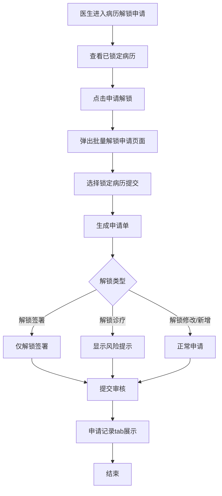
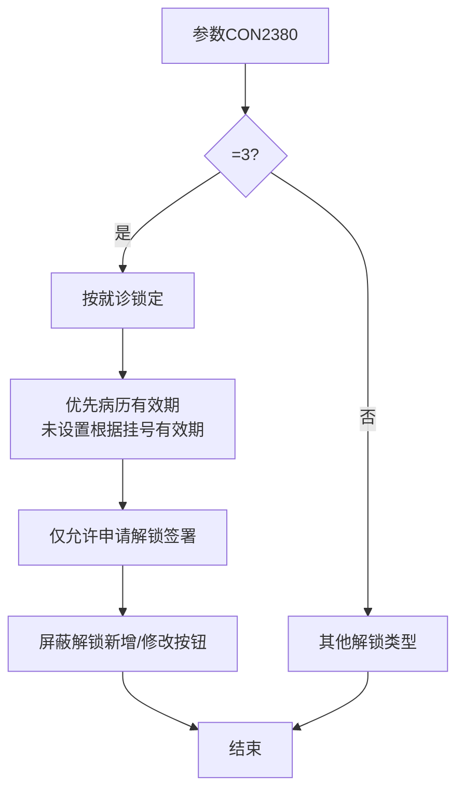

# BLGL-17-BLJS-002病历解锁申请_ Analyst - Spec

> **需求编号**：BLGL-17-BLJS-002
> **父需求**：BLGL-17-BLJS
> **关联PM Spec**：BLGL-17-BLJS-002_病历解锁申请_PM-spec.md
> **Spec版本**：V1.0
> **编写时间**：2026-08-14
> **编写人**：需求分析师

---

## 一、功能编号体系

### 1.1 功能层级结构

```
BLGL-17-BLJS-002: 病历解锁申请
  ├─ BLGL-17-BLJS-002-01: 已锁定病历查询与申请
  │   ├─ -01-01: 已锁定病历查询
  │   ├─ -01-02: 批量申请解锁
  │   └─ -01-03: 申请单生成
  ├─ BLGL-17-BLJS-002-02: 申请记录查询
  │   ├─ -02-01: 申请记录列表（已锁定病历/申请记录tab）
  │   └─ -02-02: 申请记录状态展示
  ├─ BLGL-17-BLJS-002-03: 解锁签署
  │   └─ -03-01: CON2380=3仅解锁签署
  └─ BLGL-17-BLJS-002-04: 解锁诊疗
      └─ -04-01: 风险提示信息
```

### 1.2 功能编号表

| REQ-ID | 功能名称 | 类型 | 优先级 | 说明 |
|--------|---------|------|--------|------|
| BLGL-17-BLJS-002-01 | 已锁定病历查询与申请 | 功能 | P0 | 查询+申请 |
| BLGL-17-BLJS-002-01-01 | 已锁定病历查询 | 子功能 | P0 | 查询条件 |
| BLGL-17-BLJS-002-01-02 | 批量申请解锁 | 子功能 | P0 | 批量弹窗 |
| BLGL-17-BLJS-002-01-03 | 申请单生成 | 子功能 | P0 | 一单多任务 |
| BLGL-17-BLJS-002-02 | 申请记录查询 | 功能 | P1 | 记录展示 |
| BLGL-17-BLJS-002-02-01 | 申请记录列表 | 子功能 | P1 | tab展示 |
| BLGL-17-BLJS-002-02-02 | 状态展示 | 子功能 | P1 | 审核中/已通过/不通过 |
| BLGL-17-BLJS-002-03 | 解锁签署 | 功能 | P1 | CON2380 |
| BLGL-17-BLJS-002-03-01 | 仅解锁签署 | 子功能 | P1 | 屏蔽新增/修改 |
| BLGL-17-BLJS-002-04 | 解锁诊疗 | 功能 | P1 | 风险提示 |
| BLGL-17-BLJS-002-04-01 | 风险提示信息 | 子功能 | P1 | 参数配置 |

---

## 二、核心业务流程

### 2.1 解锁申请流程



### 2.2 解锁签署流程



---

## 三、功能规格说明

---

### BLGL-17-BLJS-002-01: 已锁定病历查询与申请

#### 3.1.1 功能概述

医生查询已锁定病历，点击申请解锁弹出批量解锁申请页面，生成申请单（一个申请单包含多个任务）提交审核。

#### 3.1.2 用户角色

| 角色 | 使用场景 | 权限要求 | 操作频率 |
|------|---------|---------|---------|
| 住院医生 | 查询锁定病历并申请解锁 | 病历权限 | 中频 |

#### 3.1.3 业务流程（Given/When/Then）

##### 主流程

**Scenario 1: 病历解锁申请**

```gherkin
Given:
  - 医生有待解锁的已锁定病历

When:
  - 医生进入"病历解锁申请"页面
  - 查看已锁定病历
  - 点击申请解锁（可批量）
  - 弹出批量解锁申请页面

Then:
  - 生成申请单（一个申请单包含多个任务）
  - 提交后进入审核流程
  - 申请记录显示在"申请记录"tab
```

##### 异常流程

**Scenario 2: 业务异常——科主任无法审批**

```gherkin
Given:
  - 医生已提交病历解锁申请

When:
  - 科主任尝试审批

Then:
  - 科主任无法审批（原问题）
  - ⏳ 待确认：审批流程配置问题（4）
```

##### 边界流程

**Scenario 3: 边界场景——批量申请**

```gherkin
Given:
  - 医生有多个已锁定病历

When:
  - 医生点击申请解锁

Then:
  - 弹窗展示锁定类型、责任医生、截止创建时间
  - 批量选择后一个申请单提交
```

**Scenario 4: 边界场景——患者/病历锁定区分**

```gherkin
Given:
  - 患者出区48h锁定

When:
  - 查看解锁申请页面

Then:
  - 患者锁定置顶并显示蓝色
  - 锁定类型区分患者锁定/病历锁定
```

#### 3.1.4 数据字段定义

> 字段名来自代码扫描（`E:\39EMR\sr-next`，标注 ``）。

| 字段名 | 类型 | 必填 | 默认值 | 取值范围 | 说明 | 概念ID |
|--------|------|------|--------|---------|------|--------|
| inpRhbRecordId | Long | 是 | - | - | 病历簿ID | ⏳ 待确认 |
| encounterId | Long | 是 | - | - | 就诊标识 | ⏳ 待确认 |
| unlockType | Long | 是 | - | 修改/新增/签署/诊疗 | 解锁类型 | ⏳ 待确认 |
| applyReason | String | 否 | - | - | 申请原因 | ⏳ 待确认 |

#### 3.1.5 验收标准

| AC编号 | 验收标准 | 对应REQ-ID | 验证方法 | 验证场景 |
|--------|---------|-----------|---------|---------|
| AC-001 | 医生对已锁定病历提交解锁申请，生成申请单 | -002-01 | 功能测试 | Scenario 1 |
| AC-002 | 批量申请一个申请单提交 | -002-01 | 功能测试 | Scenario 3 |

---

### BLGL-17-BLJS-002-02: 申请记录查询

#### 3.2.1 功能概述

病历解锁申请页面新增两个tab（已锁定病历/申请记录），申请记录按申请单模式展示，含状态。

#### 3.2.2 用户角色

| 角色 | 使用场景 | 权限要求 | 操作频率 |
|------|---------|---------|---------|
| 住院医生 | 查看申请记录 | 病历权限 | 中频 |

#### 3.2.3 业务流程（Given/When/Then）

##### 主流程

**Scenario 1: 申请记录查询**

```gherkin
Given:
  - 医生已提交解锁申请

When:
  - 医生进入申请记录tab

Then:
  - 展示申请单（一个申请单包含多个任务）
  - 状态：审核中（默认）/已通过/不通过/全部
  - 展示申请医生、申请时间、审核人、审核时间
  - 提供详情、进度操作
```

##### 异常流程

**Scenario 2: 数据异常——申请记录缺失**

```gherkin
Given:
  - 医生已提交解锁申请

When:
  - 医生查询申请记录

Then:
  - ⏳ 待确认：申请记录缺失时的处理
```

#### 3.2.4 数据字段定义

| 字段名 | 类型 | 必填 | 默认值 | 取值范围 | 说明 | 概念ID |
|--------|------|------|--------|---------|------|--------|
| 申请单ID | Long | 是 | - | - | 申请单标识 | ⏳ 待确认 |
| 申请状态 | String | 是 | 审核中 | 审核中/已通过/不通过 | 申请状态 | ⏳ 待确认 |

#### 3.2.5 验收标准

| AC编号 | 验收标准 | 对应REQ-ID | 验证方法 | 验证场景 |
|--------|---------|-----------|---------|---------|
| AC-003 | 申请记录按申请单展示，状态审核中/已通过/不通过 | -002-02 | 功能测试 | Scenario 1 |

---

### BLGL-17-BLJS-002-03: 解锁签署

#### 3.3.1 功能概述

CON2380=3 时按就诊锁定，锁定后仅允许申请解锁签署，屏蔽解锁新增/解锁修改按钮。

#### 3.3.2 用户角色

| 角色 | 使用场景 | 权限要求 | 操作频率 |
|------|---------|---------|---------|
| 住院医生 | 申请解锁签署 | 病历权限 | 低频 |

#### 3.3.3 业务流程（Given/When/Then）

##### 主流程

**Scenario 1: 解锁签署**

```gherkin
Given:
  - 参数 CON2380=3（按就诊锁定，仅允许解锁签署）

When:
  - 医生申请解锁

Then:
  - 优先根据病历有效期锁定，未设置根据挂号有效期
  - 仅允许申请"解锁签署"
  - 屏蔽"解锁新增"和"解锁修改"按钮
```

#### 3.3.4 数据字段定义

| 字段名 | 类型 | 必填 | 默认值 | 取值范围 | 说明 | 概念ID |
|--------|------|------|--------|---------|------|--------|
| CON2380 | Int | 是 | 0 | 0/1/2/3 | 病历有效期锁定类型 | ⏳ 待确认 |

#### 3.3.5 验收标准

| AC编号 | 验收标准 | 对应REQ-ID | 验证方法 | 验证场景 |
|--------|---------|-----------|---------|---------|
| AC-004 | CON2380=3 时仅允许申请解锁签署，屏蔽新增/修改 | -002-03 | 功能测试 | Scenario 1 |

---

### BLGL-17-BLJS-002-04: 解锁诊疗

#### 3.4.1 功能概述

解锁诊疗开启时，发起解锁诊疗申请显示参数配置的风险提示信息。

#### 3.4.2 用户角色

| 角色 | 使用场景 | 权限要求 | 操作频率 |
|------|---------|---------|---------|
| 住院医生 | 发起解锁诊疗申请 | 病历权限 | 低频 |

#### 3.4.3 业务流程（Given/When/Then）

##### 主流程

**Scenario 1: 解锁诊疗风险提示**

```gherkin
Given:
  - 参数"病历解锁是否开启解锁诊疗"=是

When:
  - 医生发起解锁诊疗申请

Then:
  - 申请页面下方显示参数配置的风险提示信息
```

#### 3.4.4 数据字段定义

| 字段名 | 类型 | 必填 | 默认值 | 取值范围 | 说明 | 概念ID |
|--------|------|------|--------|---------|------|--------|
| 解锁诊疗开关 | Boolean | 否 | 否 | 是/否 | 是否开启解锁诊疗 | ⏳ 待确认 |
| 风险提示信息 | String | 否 | - | 文本框 | 申请解锁诊疗风险提示 | ⏳ 待确认 |

#### 3.4.5 验收标准

| AC编号 | 验收标准 | 对应REQ-ID | 验证方法 | 验证场景 |
|--------|---------|-----------|---------|---------|
| AC-005 | 解锁诊疗开启时申请显示风险提示信息 | -002-04 | 功能测试 | Scenario 1 |

---

## 四、排除范围

本需求不包含以下功能项：

1. **病历时限锁定与编辑锁定** - 属 BLGL-17-BLJS-001
2. **病历解锁审核** - 属 BLGL-17-BLJS-003
3. **解锁参数与流程配置** - 属 BLGL-17-BLJS-004
4. **解锁申请导出、风险提示实现** - 属基础能力 BC-BLJS-002/004

> 与 PM-Spec 第四章一致。对照 Phase 1 功能点Spec 第6章（基线能力），确保不越界。

---

## 五、业务规则清单

| 规则ID | 规则名称 | 规则描述 | 来源 | 优先级 |
|--------|---------|---------|------|--------|
| BR-001 | 申请模式 | 申请按申请单模式，一单多任务 |  | P0 |
| BR-002 | 批量申请 | 支持批量申请解锁 |  | P1 |
| BR-003 | 申请状态 | 状态：审核中/已通过/不通过 |  | P1 |
| BR-004 | 解锁签署 | CON2380=3 仅允许解锁签署 | 1 | P1 |
| BR-005 | 解锁诊疗 | 解锁诊疗开启显示风险提示 | 4 | P1 |
| BR-006 | 患者/病历锁定 | 患者锁定置顶显示蓝色 |  | P1 |

---

## 六、关联文档

| 文档类型 | 文档路径 | 说明 |
|---------|---------|------|
| 功能点Spec（模块级） | 上级目录 BLGL-17-BLJS 17病历解锁功能点Spec.md（V1.0） | 模块级功能点索引 |
| 功能Spec（业务背景与设计） | 本目录 BLGL-17-BLJS-002_病历解锁申请-Spec.md（V1.0） | 业务背景与目标 Spec |
| Analyst-Spec（分析规格） | 本目录 BLGL-17-BLJS-002_病历解锁申请_Analyst-spec.md（V1.0）（本文档） | 分析规格 |
| PM-Spec（需求规格） | 本目录 BLGL-17-BLJS-002_病历解锁申请_PM-spec.md（V0.1） | PM 产出的 Spec 文档 |
| data-model.md | 待产出 | 架构师产出的数据建模文档 |
| design.md | 待产出 | 架构师产出的技术方案文档 |
| api-contract.md | 待产出 | 开发经理产出的 API 契约文档 |

---

## 七、待确认问题清单

| 编号 | 问题描述 | 缺失信息 | 影响范围 | 建议补充方 |
|------|---------|---------|---------|-----------|
| Q-001 | 科主任无法审批 | 审批流程配置问题 | 3.1.3 Scenario 2 | 开发经理 |
| Q-002 | 申请记录缺失 | 申请记录展示异常 | 3.2.3 Scenario 2 | 开发经理 |
| Q-003 | 完整接口契约 | API 请求/返回字段 | 第5章接口设计 | 开发经理 |
| Q-004 | 概念ID、性能指标 | 字段概念ID、申请SLA | 数据模型、非功能 | 架构师/产品经理 |

---

## 填写检查清单

| 序号 | 检查项 | 是否完成 |
|:----:|--------|:--------:|
| 1 | 功能编号带父子层级 | ✅ |
| 2 | 每个 REQ-ID 有功能概述和用户角色 | ✅ |
| 3 | 主流程至少 1 个 Given/When/Then 场景 | ✅ |
| 4 | 异常流程至少 3 个 Given/When/Then 场景 | ✅ |
| 5 | 边界流程至少 2 个 Given/When/Then 场景 | ✅ |
| 6 | 每个 Given/When/Then 内容具体，不模糊 | ✅ |
| 7 | 数据字段定义完整 | ✅ |
| 8 | 验收标准 AC 编号独立，可验证 | ✅ |
| 9 | 验收标准无"功能正常"等模糊表述 | ✅ |
| 10 | 排除范围明确列出 | ✅ |
| 11 | 业务规则清单列出所有规则，每条标注来源 | ✅ |
| 12 | 流程图使用 Mermaid 格式（≥2 个） | ✅ |
| 13 | 关联文档索引包含 Phase 1 功能点Spec | ✅ |
| 14 | 待确认问题清单汇总了全文所有 ⏳ 项 | ✅ |
| 15 | 全文无占位符 `< >` 残留 | ✅ |
| 16 | 全文陈述可溯源至资料区（S1~S10 溯源核查） | ✅ |
| 17 | 人工审核确认完成 | ⏳ 待确认 |

---

**文档状态**：⬜ 待审核
**维护责任**：需求分析师规范组
**下次更新**：根据评审反馈优化

---

## 版本历史

| 版本 | 日期 | 变更说明 | 编写人 |
|------|------|---------|--------|
| V1.0 | 2026-08-14 | 初始版本 | 需求分析师 |
