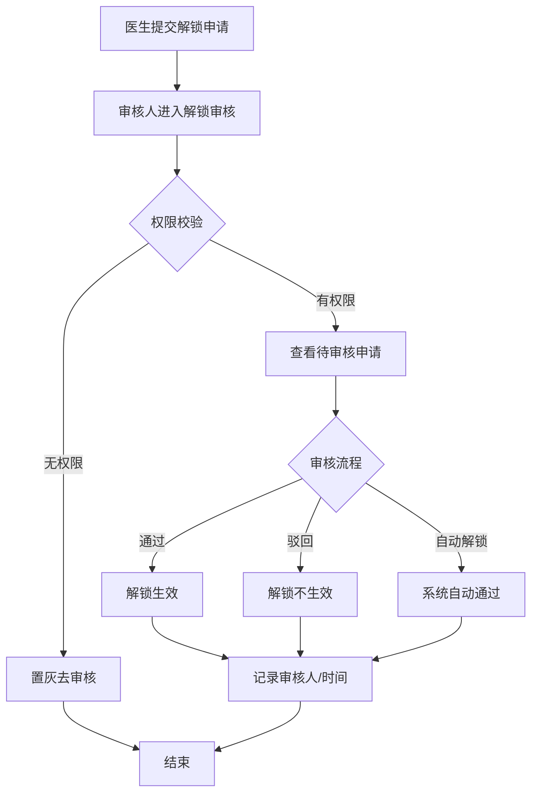
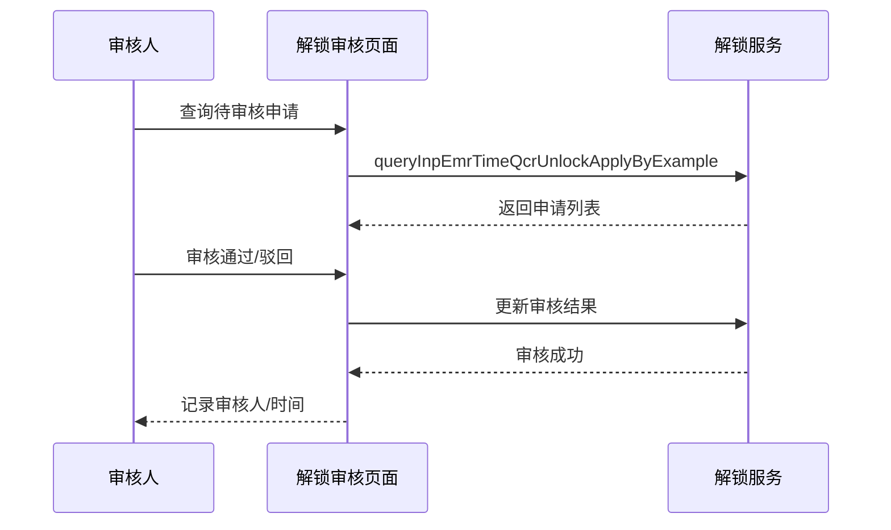

# BLGL-17-BLJS-003 病历解锁审核 - Spec

> **功能编号**：BLGL-17-BLJS-003
> **文档类型**：功能Spec（业务背景与设计）
> **文档版本**：V1.0
> **编写时间**：2026-08-14
> **编写人**：RACC

---

## 文档索引

#### 章节索引

**Spec（研发视角）**

| 章节号 | 章节名称 | 内容说明 |
|--------|---------|---------|
| 1、 | 文档概述 | 文档目的、文档范围、术语定义、阅读指南、参考文档 |
| 2、 | 功能背景与定位 | 功能背景、功能定位、目标用户、核心价值 |
| 3、 | 业务流程设计 | 主流程/异常流程/边界流程（Given/When/Then） |
| 4、 | 数据模型设计 | 核心数据结构、状态定义、系统参数定义 |
| 5、 | 接口契约设计 | API列表、接口详细设计、错误码定义 |
| 6、 | 技术方案设计 | 页面路径、技术栈、关键技术点、部署方案 |
| 7、 | 测试用例预设计 | 功能/边界/异常/性能测试用例 |
| 8、 | 非功能性要求 | 性能、安全、可用性、兼容性 |
| 9、 | 依赖与风险 | 外部依赖、风险项 |
| 10、 | 附录 | 流程图、时序图、参考文档 |

**PM-Spec（业务视角）**

| 章节号 | 章节名称 | 内容说明 |
|--------|---------|---------|
| 一 | 目标 | 功能定位与核心价值 |
| 二 | 约束 | 业务/技术/非功能性约束 |
| 三 | 验收标准 | 验收条件与验证方法 |
| 四 | 排除范围 | 本次不做项与明确边界 |
| 五 | 关键决策记录 | 方案决策与选型理由 |
| 六 | 优先级 | 优先级定义 |
| 七 | 关联文档 | 关联文档索引 |
| 附录 | 填写检查清单 | 质量检查 |

**Analyst-Spec（产品视角）**

| 章节号 | 章节名称 | 内容说明 |
|--------|---------|---------|
| 一 | 功能编号体系 | 功能编号与层级结构 |
| 二 | 核心业务流程 | 核心业务流程与时序 |
| 三 | 功能规格说明 | 详细功能规格与验收标准 |
| 四 | 排除范围 | 排除范围 |
| 五 | 业务规则清单 | 业务规则清单 |
| 六 | 关联文档 | 关联文档索引 |
| 七 | 待确认问题清单 | 待确认问题汇总 |
| - | 填写检查清单 | 质量检查 |

#### 版本历史

| 版本 | 日期 | 变更说明 | 编写人 |
|------|------|---------|--------|
| V1.0 | 2026-08-14 | 初始版本 | RACC |

#### 关联文档索引

| 序号 | 文档名称 | 文档类型 | 版本 | 位置 |
|------|---------|---------|------|------|
| 1 | BLGL-17-BLJS 17病历解锁功能点Spec.md | 功能点Spec（模块级） | V1.0 | 上级目录 |
| 2 | BLGL-17-BLJS-003_病历解锁审核-Spec.md | 功能Spec（业务背景与设计）（本文档） | V1.0 | 本目录 |
| 3 | BLGL-17-BLJS-003_病历解锁审核_Analyst-spec.md | Analyst-Spec（分析规格） | V1.0 | 本目录 |
| 4 | BLGL-17-BLJS-003_病历解锁审核_PM-spec.md | PM-Spec（需求规格） | V0.1 | 本目录 |

---

## 1、文档概述

### 1.1、文档目的

本文档旨在明确"病历解锁审核"功能（BLGL-17-BLJS-003）的业务背景与设计方案，为需求分析、研发实现、测试验收及评审提供统一的业务上下文、设计口径与决策依据。

### 1.2、文档范围

#### 1.2.1 纳入范围

本文档覆盖病历解锁审核的完整业务背景与设计，包括：

- 病历解锁审核菜单（按角色权限显示）
- 解锁申请审核（依据审核流程配置）
- 审核记录查询
- 审核进度查询

#### 1.2.2 排除范围

本文档不涉及以下内容（详见其他功能点或模块）：

- 病历时限锁定与编辑锁定—— BLGL-17-BLJS-001
- 病历解锁申请—— BLGL-17-BLJS-002
- 解锁参数与流程配置—— BLGL-17-BLJS-004
- 解锁记录导出 —— Phase 1 功能点Spec 第6章基础能力（BC-BLJS-002）

### 1.3、术语定义

| 术语 | 定义 |
|------|------|
| 病历解锁审核 | 对医生申请的病历解锁依据审核流程配置进行审核 |
| 审核流程配置 | 控制解锁审核节点和审核模式 |
| 审核记录 | 解锁审核的历史记录查询 |

> ⏳ 待确认：规范术语表待产品文档确认。

### 1.4、阅读指南

- **章节关系**：第1~2章为业务全貌，第3~10章为设计实现层。与 Analyst-Spec、PM-Spec 互相引用保持一致。
- **读者对象**：产品经理/需求分析师读第1~2章；研发读第3~6、9~10章；测试读第3、7~8章；评审人员核对各层一致性。

### 1.5、参考文档

| 序号 | 文档名称 | 版本/日期 |
|------|---------|----------|
| 1 | 【历史需求】住院病历的历史需求.xlsx | - |
| 2 | BLGL-17-BLJS-003_病历解锁审核_PM-spec.md | V0.1 |
| 3 | BLGL-17-BLJS-003_病历解锁审核_Analyst-spec.md | V1.0 |
| 4 | BLGL-17-BLJS 17病历解锁功能点Spec.md | V1.0 |

---

## 2、功能背景与定位

### 2.1 功能背景

病历解锁审核是解锁流程的审批环节，需满足：

- **管理要求**：对医生申请的病历解锁依据审核流程配置进行解锁审核
- **现状痛点**：
  - 科主任无法审批已提交的解锁申请
  - 解锁审核系统报错
  - 解锁异常导致其他病程无法书写
- **历史需求演进**：从解锁审核建立→ 审核记录查询→ 审核报错修复（0）

### 2.2 功能定位

"病历解锁审核"是 WiNEX 病历管理-病历解锁模块的审批环节，定位为：

- **审批把关**：审核解锁申请通过/驳回
- **权限管控**：按角色权限显示审核功能
- **审核追溯**：审核记录与进度查询

### 2.3 目标用户

| 用户角色 | 主要使用场景 |
|---------|-------------|
| 科主任/质控 | 审核解锁申请 |
| 病案管理员 | 查看审核记录 |

### 2.4 核心价值

| 价值维度 | 价值描述 |
|---------|---------|
| 审批合规 | 解锁需审核流程 |
| 权限管控 | 按角色权限显示 |
| 审核追溯 | 审核记录可查询 |

---

## 3、业务流程设计（Given/When/Then）

### 3.1 主流程

**Scenario 1: 病历解锁审核**

```gherkin
Given:
  - 医生已提交解锁申请
  - 审核人具有审核权限

When:
  - 审核人进入"病历解锁审核"菜单
  - 查看待审核申请
  - 点击去审核

Then:
  - 依据审核流程配置进行审核
  - 审核通过或驳回
  - 审核记录与进度更新
```

### 3.2 异常流程

**Scenario 2: 业务异常——无权限审核**

```gherkin
Given:
  - 未配置审核权限的医生

When:
  - 医生点击去审核

Then:
  - 提示无权限审核
  - 置灰去审核按钮
```

**Scenario 3: 数据异常——解锁审核报错**

```gherkin
Given:
  - 病历锁定后

When:
  - 解锁审核

Then:
  - 系统报错
  - ⏳ 待确认：解锁审核报错根因（0）
```

**Scenario 4: 系统异常——解锁异常影响书写**

```gherkin
Given:
  - 病历解锁

When:
  - 解锁后书写其他病程

Then:
  - 其他病程无法书写（原问题）
  - ⏳ 待确认：解锁异常根因（3）
```

### 3.3 边界流程

**Scenario 5: 边界场景——自动解锁**

```gherkin
Given:
  - 审核流程配置支持自动解锁

When:
  - 解锁申请到达自动解锁节点

Then:
  - 审核人为系统
  - 审核时间为自动解锁时间
```

**Scenario 6: 边界场景——审核记录查询**

```gherkin
Given:
  - 审核人完成审核

When:
  - 查询审核记录

Then:
  - 展示审核人、审核时间、审核结果
  - 按申请时间正序排列
```

---

## 4、数据模型设计

> 数据模型信息来自代码扫描（`E:\39EMR\sr-next`）和历史需求。标注 `` 的来自 PO 实体，标注 `` 的来自需求文本。

### 4.1 核心数据结构

#### 4.1.1 核心表/实体

| 表/实体 | 关键字段 | 说明 |
|---------|---------|------|
| INP_EMR_TIME_QCR_UNLOCK_REVIEW | 审核记录 | 解锁审核记录表 |
| INP_EMR_TIME_QCR_UNLOCK_APPLY | 申请单 | 解锁申请 |

> ⏳ 待确认：完整数据表清单待代码扫描或功能清单数据表清单补充。

### 4.2 状态定义

| 状态码 | 状态名称 | 说明 |
|--------|---------|------|
| 待审核 | 默认 | 待审核状态 |
| 已通过 | 状态 | 审核通过 |
| 不通过 | 状态 | 审核驳回 |

### 4.3 系统参数定义

| 参数编码 | 参数名称 | 说明 |
|---------|---------|------|
| 审核流程配置 | 审核节点/模式 | 控制解锁审核节点和模式 |

---

## 5、接口契约设计

> 接口信息来自代码扫描（`E:\39EMR\sr-next`）的 InpEmrLockController。标注 ``。

### 5.1 API列表

| 序号 | API名称（代码函数） | 路径 | 方法 | 说明 |
|:----:|---------|------|:----:|------|
| 1 | queryInpEmrTimeQcrUnlockApplyByExample | /api/v1/app_record_inpatient/emr_inpatient/inp_emr_time_qcr_unlock_apply/query/by_example | POST | 解锁申请查询（审核列表） |
| 2 | inpEmrTimeQcrUnlockApplyReviewScheduleByInpEmrQcrUnlockApplyId | /api/v1/app_record_inpatient/emr_inpatient/inp_emr_time_qcr_unlock_apply/review_schedule/query/by_inp_emr_qcr_unlock_apply_id | POST | 审核申请进度查询 |
| 3 | queryInpEmrTimeQcrUnlockApplyByInpEmrQcrUnlockApplyId | /api/v1/app_record_inpatient/emr_inpatient/inp_emr_time_qcr_unlock_apply/query/by_inp_emr_qcr_unlock_apply_id | POST | 解锁申请详情查询 |

> ⏳ 待确认：审核执行接口（原注释代码）待接口文档补充。

### 5.2 接口详细设计

#### 5.2.1 解锁申请查询（queryInpEmrTimeQcrUnlockApplyByExample）

**请求参数**:
```json
{
  "status": 1,
  "deptId": 101,
  "pageNum": 1,
  "pageSize": 20
}
```

**返回值（成功，WinPagedList<InpEmrTimeQcrUnlockApplyQueryOutputVO>）**:
```json
{
  "success": true,
  "data": {
    "list": [
      {
        "inpEmrQcrUnlockApplyId": 7001,
        "patientName": "张三",
        "applyStatus": 1,
        "applyDoctorName": "李医生"
      }
    ],
    "total": 5
  }
}
```

**返回值（失败）**:
```json
{
  "success": false,
  "message": "查询失败",
  "data": null
}
```

> ⏳ 待确认：具体字段名/结构以接口契约文档为准。

### 5.3 错误码定义

| 错误码 | 错误信息 | 处理方式 |
|--------|---------|---------|
| ⏳ 待确认 | 解锁审核系统报错 | 排查解锁审核流程 |

> ⏳ 待确认：业务错误码定义未在代码扫描中提取完整。

---

## 6、技术方案设计

### 6.1 页面路径

- **页面路径**: 日常管理→病历管理→病历解锁审核
- **路由**: /unlockTheAudit（病历解锁审核，EmrManage.js）
- **前端组件**: MedicalRecordLocking/routerPages/UnlockTheAudit/index.vue + components/AuditDialog.vue（审核弹窗）+ ParticularsDialog.vue（详情）
- **后端接口**: InpEmrLockController（tags: 住院病历锁定相关）

### 6.2 技术栈

| 类别 | 技术 | 版本 |
|------|------|------|
| 前端框架 | Vue | 2.6.14 |
| 前端UI | element-ui | 2.13.0 |
| 后端框架 | Spring Boot（Java） | java.version 17 |
| 构建工具 | webpack / Maven | 前端 webpack + 后端 Maven |

### 6.3 关键技术点

- 审核权限：按角色权限显示，无权限置灰去审核
- 审核流程：依据审核流程配置
- 自动解锁：审核人为系统，审核时间为自动解锁时间
- 审核进度：review_schedule 查询

### 6.4 部署方案

⏳ 待确认：部署方案未在资料区中找到。

---

## 7、测试用例预设计

### 7.1 功能测试

| 用例编号 | 测试场景 | Given | When | Then |
|---------|---------|-------|------|------|
| TC-001 | 解锁审核通过 | 有审核权限 | 审核通过 | 解锁生效 |
| TC-002 | 解锁审核驳回 | 有审核权限 | 审核驳回 | 解锁不生效 |

### 7.2 边界测试

| 用例编号 | 测试场景 | Given | When | Then |
|---------|---------|-------|------|------|
| TC-003 | 无权限审核 | 未配置审核权限 | 点击去审核 | 提示无权限+置灰 |
| TC-004 | 自动解锁 | 配置自动解锁节点 | 申请到达 | 审核人为系统 |

### 7.3 异常测试

| 用例编号 | 测试场景 | Given | When | Then |
|---------|---------|-------|------|------|
| TC-005 | 解锁审核报错 | 病历锁定 | 解锁审核 | ⏳ 待确认：报错根因（0） |
| TC-006 | 解锁异常影响书写 | 病历解锁 | 书写其他病程 | ⏳ 待确认：异常根因（3） |

### 7.4 性能测试

| 用例编号 | 测试场景 | 指标 |
|---------|---------|------|
| TC-007 | 解锁审核响应 | ⏳ 待确认：性能指标未在资料区中找到 |

---

## 8、非功能性要求

### 8.1 性能要求

| 指标 | 要求 |
|------|------|
| 解锁审核响应 | ⏳ 待确认 |

### 8.2 安全要求

| 要求 | 说明 |
|------|------|
| 审核权限 | 按角色权限显示 |

**医疗行业特殊要求**

| 要求 | 说明 |
|------|------|
| 审批合规 | 解锁需审核流程 |

### 8.3 可用性要求

| 指标 | 要求值 |
|------|--------|
| 可用性 | ⏳ 待确认 |

### 8.4 兼容性要求

| 类型 | 要求 |
|------|------|
| 系统挂载 | 支持挂载病案系统或质控系统 |

---

## 9、依赖与风险

### 9.1 外部依赖

| 依赖项 | 说明 |
|--------|------|
| 审批流程 | 审核流程配置 |

### 9.2 风险项

| 风险项 | 等级 | 说明 | 应对方案 |
|--------|------|------|---------|
| 审核报错 | 中 | 解锁审核系统报错 | 排查审核流程 |
| 解锁异常 | 中 | 解锁异常影响病程书写 | 修复解锁流程 |

---

## 10、附录

### 10.1 流程图



### 10.2 时序图



### 10.3 参考文档

- BLGL-17-BLJS 17病历解锁功能点Spec.md（V1.0，第5章 -003 行）
- 关联Spec: BLGL-17-BLJS-002（解锁申请）、-004（流程配置）

---

## 填写检查清单

| 序号 | 检查项 | 是否完成 |
|:----:|--------|:--------:|
| 1 | 章节索引与正文章节一致 | ✅ |
| 2 | 版本历史记录完整 | ✅ |
| 3 | 关联文档索引已登记全部Spec | ✅ |
| 4 | 文档目的明确回答"为什么做/做成什么/怎么做" | ✅ |
| 5 | 纳入范围/排除范围清晰 | ✅ |
| 6 | 术语定义覆盖关键概念，从资料区可溯源 | ✅ |
| 7 | 参考文档已登记 | ✅ |
| 8 | 功能背景基于法规/规范/需求来源组织 | ✅ |
| 9 | 功能定位体现业务价值（3~5个定位点） | ✅ |
| 10 | 目标用户角色覆盖完整，在需求原文中有出处 | ✅ |
| 11 | 核心价值可陈述，与 Phase 1 口径一致 | ✅ |
| 12 | 业务流程：主流程≥1、异常≥3、边界≥2，Given/When/Then 具体 | ✅ |
| 13 | 数据模型：字段/表/状态/参数可溯源 | ✅ |
| 14 | 接口契约：API列表+详细设计+错误码齐全或标记待确认 | ✅ |
| 15 | 技术方案：页面路径/技术栈/关键点/部署方案或标记待确认 | ✅ |
| 16 | 测试用例：功能/边界/异常/性能覆盖 | ✅ |
| 17 | 非功能性要求：性能/安全/可用性/兼容性指标可量化或标记待确认 | ✅ |
| 18 | 依赖与风险：外部依赖登记完整 | ✅ |
| 19 | 附录：流程图/时序图与正文流程一致 | ✅ |
| 20 | 全文无占位符 `< >` 残留 | ✅ |
| 21 | 全文陈述可溯源至资料区 | ✅ |
| 22 | 人工审核确认完成 | ⏳ 待确认 |

---

**文档状态**：⬜ 待审核
**维护责任**：RACC
**下次更新**：根据评审反馈优化
