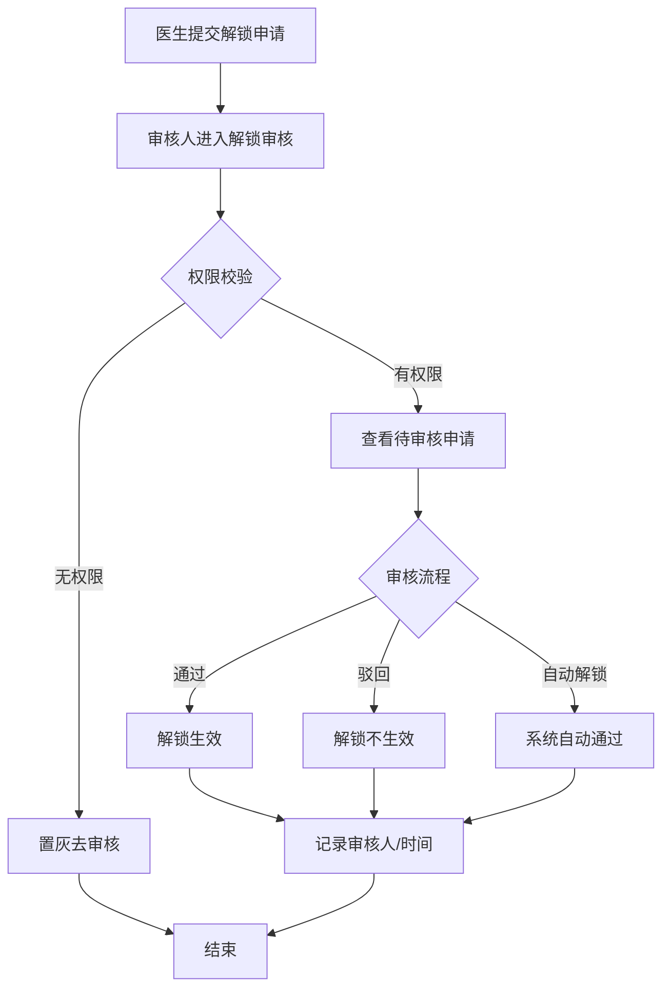
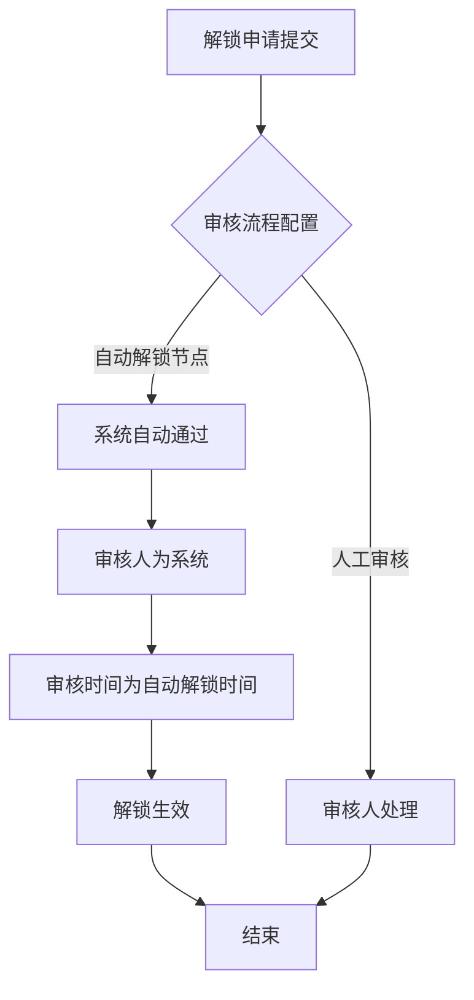

# BLGL-17-BLJS-003病历解锁审核_ Analyst - Spec

> **需求编号**：BLGL-17-BLJS-003
> **父需求**：BLGL-17-BLJS
> **关联PM Spec**：BLGL-17-BLJS-003_病历解锁审核_PM-spec.md
> **Spec版本**：V1.0
> **编写时间**：2026-08-14
> **编写人**：需求分析师

---

## 一、功能编号体系

### 1.1 功能层级结构

```
BLGL-17-BLJS-003: 病历解锁审核
  ├─ BLGL-17-BLJS-003-01: 解锁审核列表
  │   ├─ -01-01: 待审核申请查询
  │   ├─ -01-02: 权限校验（角色权限）
  │   └─ -01-03: 审核列表展示（状态/审核人）
  ├─ BLGL-17-BLJS-003-02: 解锁审核操作
  │   ├─ -02-01: 审核通过
  │   ├─ -02-02: 审核驳回
  │   └─ -02-03: 自动解锁
  └─ BLGL-17-BLJS-003-03: 审核记录与进度
      ├─ -03-01: 审核记录查询
      └─ -03-02: 审核进度查询
```

### 1.2 功能编号表

| REQ-ID | 功能名称 | 类型 | 优先级 | 说明 |
|--------|---------|------|--------|------|
| BLGL-17-BLJS-003-01 | 解锁审核列表 | 功能 | P0 | 待审核查询+权限 |
| BLGL-17-BLJS-003-01-01 | 待审核申请查询 | 子功能 | P0 | 查询条件 |
| BLGL-17-BLJS-003-01-02 | 权限校验 | 子功能 | P0 | 角色权限 |
| BLGL-17-BLJS-003-01-03 | 审核列表展示 | 子功能 | P1 | 状态/审核人 |
| BLGL-17-BLJS-003-02 | 解锁审核操作 | 功能 | P0 | 审核执行 |
| BLGL-17-BLJS-003-02-01 | 审核通过 | 子功能 | P0 | 解锁生效 |
| BLGL-17-BLJS-003-02-02 | 审核驳回 | 子功能 | P0 | 解锁不生效 |
| BLGL-17-BLJS-003-02-03 | 自动解锁 | 子功能 | P1 | 系统审核 |
| BLGL-17-BLJS-003-03 | 审核记录与进度 | 功能 | P1 | 追溯 |
| BLGL-17-BLJS-003-03-01 | 审核记录查询 | 子功能 | P1 | 审核人/时间 |
| BLGL-17-BLJS-003-03-02 | 审核进度查询 | 子功能 | P1 | 进度展示 |

---

## 二、核心业务流程

### 2.1 解锁审核流程



### 2.2 自动解锁流程



---

## 三、功能规格说明

---

### BLGL-17-BLJS-003-01: 解锁审核列表

#### 3.1.1 功能概述

审核人进入病历解锁审核菜单，按角色权限显示，查询待审核申请，展示状态与审核人。

#### 3.1.2 用户角色

| 角色 | 使用场景 | 权限要求 | 操作频率 |
|------|---------|---------|---------|
| 科主任/质控 | 查询待审核申请 | 审核权限 | 中频 |

#### 3.1.3 业务流程（Given/When/Then）

##### 主流程

**Scenario 1: 解锁审核列表**

```gherkin
Given:
  - 审核人具有审核权限

When:
  - 审核人进入"病历解锁审核"菜单
  - 查询待审核申请

Then:
  - 展示申请列表（按申请时间正序）
  - 状态：待审核（默认）/已通过/不通过/全部
  - 审核人：当前节点审核人名称
```

##### 异常流程

**Scenario 2: 业务异常——无权限审核**

```gherkin
Given:
  - 未配置审核权限的医生

When:
  - 医生点击去审核

Then:
  - 提示无权限审核
  - 置灰去审核按钮
```

##### 边界流程

**Scenario 3: 边界场景——系统挂载**

```gherkin
Given:
  - 病历解锁审核菜单

When:
  - 系统配置

Then:
  - 支持挂载病案系统或质控系统
```

#### 3.1.4 数据字段定义

> 字段名来自代码扫描（`E:\39EMR\sr-next`，标注 ``）。

| 字段名 | 类型 | 必填 | 默认值 | 取值范围 | 说明 | 概念ID |
|--------|------|------|--------|---------|------|--------|
| inpEmrQcrUnlockApplyId | Long | 是 | - | - | 解锁申请ID | ⏳ 待确认 |
| applyStatus | Long | 是 | 待审核 | 待审核/已通过/不通过 | 申请状态 | ⏳ 待确认 |

#### 3.1.5 验收标准

| AC编号 | 验收标准 | 对应REQ-ID | 验证方法 | 验证场景 |
|--------|---------|-----------|---------|---------|
| AC-001 | 有审核权限用户可查询待审核申请 | -003-01 | 功能测试 | Scenario 1 |
| AC-002 | 未配置审核权限用户去审核按钮置灰 | -003-01 | 功能测试 | Scenario 2 |

---

### BLGL-17-BLJS-003-02: 解锁审核操作

#### 3.2.1 功能概述

审核人依据审核流程配置执行审核通过/驳回，自动解锁节点系统自动通过。

#### 3.2.2 用户角色

| 角色 | 使用场景 | 权限要求 | 操作频率 |
|------|---------|---------|---------|
| 科主任/质控 | 审核通过/驳回 | 审核权限 | 中频 |
| 系统 | 自动解锁 | 系统权限 | 低频 |

#### 3.2.3 业务流程（Given/When/Then）

##### 主流程

**Scenario 1: 解锁审核通过**

```gherkin
Given:
  - 审核人具有审核权限
  - 有待审核的解锁申请

When:
  - 审核人点击去审核
  - 审核通过

Then:
  - 解锁生效
  - 审核记录与进度更新
```

##### 异常流程

**Scenario 2: 数据异常——解锁审核报错**

```gherkin
Given:
  - 病历锁定后

When:
  - 解锁审核

Then:
  - 系统报错
  - ⏳ 待确认：解锁审核报错根因（0）
```

##### 边界流程

**Scenario 3: 边界场景——自动解锁**

```gherkin
Given:
  - 审核流程配置支持自动解锁

When:
  - 解锁申请到达自动解锁节点

Then:
  - 审核人为系统
  - 审核时间为自动解锁时间
```

**Scenario 4: 边界场景——审核驳回**

```gherkin
Given:
  - 审核人查看待审核申请

When:
  - 审核人审核驳回

Then:
  - 解锁不生效
  - 申请状态变更为不通过
```

#### 3.2.4 数据字段定义

| 字段名 | 类型 | 必填 | 默认值 | 取值范围 | 说明 | 概念ID |
|--------|------|------|--------|---------|------|--------|
| 审核结果 | String | 是 | - | 通过/驳回 | 审核结果 | ⏳ 待确认 |

#### 3.2.5 验收标准

| AC编号 | 验收标准 | 对应REQ-ID | 验证方法 | 验证场景 |
|--------|---------|-----------|---------|---------|
| AC-003 | 有审核权限用户可审核解锁申请通过/驳回 | -003-02 | 功能测试 | Scenario 1 |
| AC-004 | 自动解锁节点审核人为系统，审核时间为自动解锁时间 | -003-02 | 功能测试 | Scenario 3 |

---

### BLGL-17-BLJS-003-03: 审核记录与进度

#### 3.3.1 功能概述

审核记录查询（审核人/时间/结果）与审核进度查询。

#### 3.3.2 用户角色

| 角色 | 使用场景 | 权限要求 | 操作频率 |
|------|---------|---------|---------|
| 病案管理员 | 查看审核记录/进度 | 病历权限 | 低频 |

#### 3.3.3 业务流程（Given/When/Then）

##### 主流程

**Scenario 1: 审核记录查询**

```gherkin
Given:
  - 审核人完成审核

When:
  - 审核人查询审核记录

Then:
  - 展示审核人、审核时间、审核结果
  - 审核时间取流程结束审核时间
```

##### 边界流程

**Scenario 2: 边界场景——审核进度查询**

```gherkin
Given:
  - 解锁申请审核中

When:
  - 查询审核进度

Then:
  - 展示审核进度（review_schedule）
  - 提供详情、进度操作
```

#### 3.3.4 数据字段定义

| 字段名 | 类型 | 必填 | 默认值 | 取值范围 | 说明 | 概念ID |
|--------|------|------|--------|---------|------|--------|
| 审核人 | String | 是 | - | - | 审核人名称 | ⏳ 待确认 |
| 审核时间 | Date | 是 | - | - | 流程结束审核时间 | ⏳ 待确认 |

#### 3.3.5 验收标准

| AC编号 | 验收标准 | 对应REQ-ID | 验证方法 | 验证场景 |
|--------|---------|-----------|---------|---------|
| AC-005 | 审核记录与进度可查询 | -003-03 | 功能测试 | Scenario 1 |

---

## 四、排除范围

本需求不包含以下功能项：

1. **病历时限锁定与编辑锁定** - 属 BLGL-17-BLJS-001
2. **病历解锁申请** - 属 BLGL-17-BLJS-002
3. **解锁参数与流程配置** - 属 BLGL-17-BLJS-004
4. **解锁记录导出** - 属基础能力 BC-BLJS-002

> 与 PM-Spec 第四章一致。对照 Phase 1 功能点Spec 第6章（基线能力），确保不越界。

---

## 五、业务规则清单

| 规则ID | 规则名称 | 规则描述 | 来源 | 优先级 |
|--------|---------|---------|------|--------|
| BR-001 | 审核权限 | 解锁审核按角色权限显示，无权限置灰 |  | P0 |
| BR-002 | 审核流程 | 依据审核流程配置进行审核 |  | P0 |
| BR-003 | 审核状态 | 状态：待审核/已通过/不通过 |  | P1 |
| BR-004 | 自动解锁 | 自动解锁节点审核人为系统 |  | P1 |
| BR-005 | 审核排序 | 按申请时间正序排列 |  | P1 |
| BR-006 | 系统挂载 | 支持挂载病案系统或质控系统 |  | P1 |

---

## 六、关联文档

| 文档类型 | 文档路径 | 说明 |
|---------|---------|------|
| 功能点Spec（模块级） | 上级目录 BLGL-17-BLJS 17病历解锁功能点Spec.md（V1.0） | 模块级功能点索引 |
| 功能Spec（业务背景与设计） | 本目录 BLGL-17-BLJS-003_病历解锁审核-Spec.md（V1.0） | 业务背景与目标 Spec |
| Analyst-Spec（分析规格） | 本目录 BLGL-17-BLJS-003_病历解锁审核_Analyst-spec.md（V1.0）（本文档） | 分析规格 |
| PM-Spec（需求规格） | 本目录 BLGL-17-BLJS-003_病历解锁审核_PM-spec.md（V0.1） | PM 产出的 Spec 文档 |
| data-model.md | 待产出 | 架构师产出的数据建模文档 |
| design.md | 待产出 | 架构师产出的技术方案文档 |
| api-contract.md | 待产出 | 开发经理产出的 API 契约文档 |

---

## 七、待确认问题清单

| 编号 | 问题描述 | 缺失信息 | 影响范围 | 建议补充方 |
|------|---------|---------|---------|-----------|
| Q-001 | 解锁审核报错根因 | 审核系统报错原因 | 3.2.3 Scenario 2 | 开发经理 |
| Q-002 | 解锁异常影响书写根因 | 解锁异常导致病程无法书写 | 3.2.3 关联 | 开发经理 |
| Q-003 | 完整接口契约 | 审核执行接口字段 | 第5章接口设计 | 开发经理 |
| Q-004 | 概念ID、性能指标 | 字段概念ID、审核SLA | 数据模型、非功能 | 架构师/产品经理 |

---

## 填写检查清单

| 序号 | 检查项 | 是否完成 |
|:----:|--------|:--------:|
| 1 | 功能编号带父子层级 | ✅ |
| 2 | 每个 REQ-ID 有功能概述和用户角色 | ✅ |
| 3 | 主流程至少 1 个 Given/When/Then 场景 | ✅ |
| 4 | 异常流程至少 3 个 Given/When/Then 场景 | ✅ |
| 5 | 边界流程至少 2 个 Given/When/Then 场景 | ✅ |
| 6 | 每个 Given/When/Then 内容具体，不模糊 | ✅ |
| 7 | 数据字段定义完整 | ✅ |
| 8 | 验收标准 AC 编号独立，可验证 | ✅ |
| 9 | 验收标准无"功能正常"等模糊表述 | ✅ |
| 10 | 排除范围明确列出 | ✅ |
| 11 | 业务规则清单列出所有规则，每条标注来源 | ✅ |
| 12 | 流程图使用 Mermaid 格式（≥2 个） | ✅ |
| 13 | 关联文档索引包含 Phase 1 功能点Spec | ✅ |
| 14 | 待确认问题清单汇总了全文所有 ⏳ 项 | ✅ |
| 15 | 全文无占位符 `< >` 残留 | ✅ |
| 16 | 全文陈述可溯源至资料区（S1~S10 溯源核查） | ✅ |
| 17 | 人工审核确认完成 | ⏳ 待确认 |

---

**文档状态**：⬜ 待审核
**维护责任**：需求分析师规范组
**下次更新**：根据评审反馈优化

---

## 版本历史

| 版本 | 日期 | 变更说明 | 编写人 |
|------|------|---------|--------|
| V1.0 | 2026-08-14 | 初始版本 | 需求分析师 |
