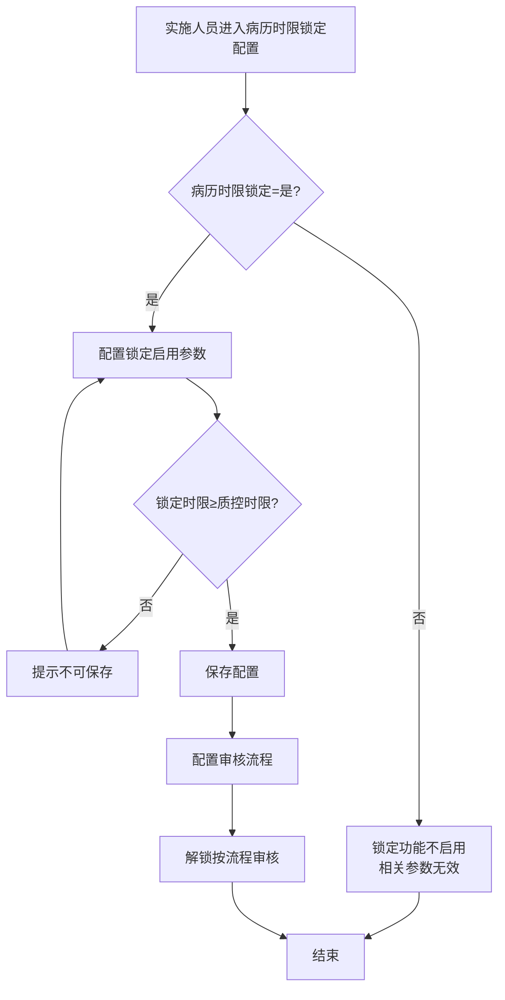
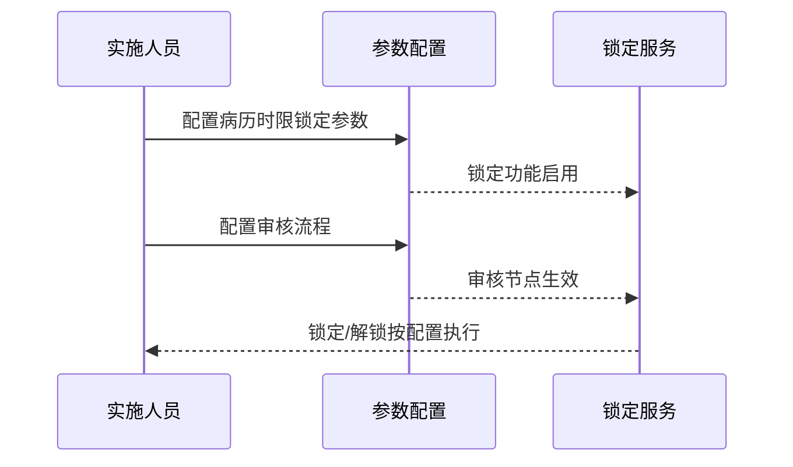

# BLGL-17-BLJS-004 解锁参数与流程配置 - Spec

> **功能编号**：BLGL-17-BLJS-004
> **文档类型**：功能Spec（业务背景与设计）
> **文档版本**：V1.0
> **编写时间**：2026-08-14
> **编写人**：RACC

---

## 文档索引

#### 章节索引

**Spec（研发视角）**

| 章节号 | 章节名称 | 内容说明 |
|--------|---------|---------|
| 1、 | 文档概述 | 文档目的、文档范围、术语定义、阅读指南、参考文档 |
| 2、 | 功能背景与定位 | 功能背景、功能定位、目标用户、核心价值 |
| 3、 | 业务流程设计 | 主流程/异常流程/边界流程（Given/When/Then） |
| 4、 | 数据模型设计 | 核心数据结构、状态定义、系统参数定义 |
| 5、 | 接口契约设计 | API列表、接口详细设计、错误码定义 |
| 6、 | 技术方案设计 | 页面路径、技术栈、关键技术点、部署方案 |
| 7、 | 测试用例预设计 | 功能/边界/异常/性能测试用例 |
| 8、 | 非功能性要求 | 性能、安全、可用性、兼容性 |
| 9、 | 依赖与风险 | 外部依赖、风险项 |
| 10、 | 附录 | 流程图、时序图、参考文档 |

**PM-Spec（业务视角）**

| 章节号 | 章节名称 | 内容说明 |
|--------|---------|---------|
| 一 | 目标 | 功能定位与核心价值 |
| 二 | 约束 | 业务/技术/非功能性约束 |
| 三 | 验收标准 | 验收条件与验证方法 |
| 四 | 排除范围 | 本次不做项与明确边界 |
| 五 | 关键决策记录 | 方案决策与选型理由 |
| 六 | 优先级 | 优先级定义 |
| 七 | 关联文档 | 关联文档索引 |
| 附录 | 填写检查清单 | 质量检查 |

**Analyst-Spec（产品视角）**

| 章节号 | 章节名称 | 内容说明 |
|--------|---------|---------|
| 一 | 功能编号体系 | 功能编号与层级结构 |
| 二 | 核心业务流程 | 核心业务流程与时序 |
| 三 | 功能规格说明 | 详细功能规格与验收标准 |
| 四 | 排除范围 | 排除范围 |
| 五 | 业务规则清单 | 业务规则清单 |
| 六 | 关联文档 | 关联文档索引 |
| 七 | 待确认问题清单 | 待确认问题汇总 |
| - | 填写检查清单 | 质量检查 |

#### 版本历史

| 版本 | 日期 | 变更说明 | 编写人 |
|------|------|---------|--------|
| V1.0 | 2026-08-14 | 初始版本 | RACC |

#### 关联文档索引

| 序号 | 文档名称 | 文档类型 | 版本 | 位置 |
|------|---------|---------|------|------|
| 1 | BLGL-17-BLJS 17病历解锁功能点Spec.md | 功能点Spec（模块级） | V1.0 | 上级目录 |
| 2 | BLGL-17-BLJS-004_解锁参数与流程配置-Spec.md | 功能Spec（业务背景与设计）（本文档） | V1.0 | 本目录 |
| 3 | BLGL-17-BLJS-004_解锁参数与流程配置_Analyst-spec.md | Analyst-Spec（分析规格） | V1.0 | 本目录 |
| 4 | BLGL-17-BLJS-004_解锁参数与流程配置_PM-spec.md | PM-Spec（需求规格） | V0.1 | 本目录 |

---

## 1、文档概述

### 1.1、文档目的

本文档旨在明确"解锁参数与流程配置"功能（BLGL-17-BLJS-004）的业务背景与设计方案，为需求分析、研发实现、测试验收及评审提供统一的业务上下文、设计口径与决策依据。

### 1.2、文档范围

#### 1.2.1 纳入范围

本文档覆盖解锁参数与流程配置的完整业务背景与设计，包括：

- 病历时限锁定开关配置
- 解锁后再次锁定配置（二次锁定）
- 审核流程配置（审核节点和审核模式）
- 锁定启用参数（按监控类型）
- 超时锁定患者的条件配置
- 解锁诊疗风险提示参数

#### 1.2.2 排除范围

本文档不涉及以下内容（详见其他功能点或模块）：

- 病历时限锁定与编辑锁定—— BLGL-17-BLJS-001
- 病历解锁申请—— BLGL-17-BLJS-002
- 病历解锁审核—— BLGL-17-BLJS-003

### 1.3、术语定义

| 术语 | 定义 |
|------|------|
| 病历时限锁定配置 | 记录域-病历业务配置新增的时限锁定配置 |
| 解锁后再次锁定 | 已解锁病历按再次锁定时间锁定 |
| 审核流程配置 | 控制解锁审核节点和审核模式 |
| 锁定启用参数 | 控制对应监控类型文书是否启用病历锁定 |

> ⏳ 待确认：规范术语表待产品文档确认。

### 1.4、阅读指南

- **章节关系**：第1~2章为业务全貌，第3~10章为设计实现层。与 Analyst-Spec、PM-Spec 互相引用保持一致。
- **读者对象**：产品经理/需求分析师读第1~2章；研发读第3~6、9~10章；测试读第3、7~8章；评审人员核对各层一致性。

### 1.5、参考文档

| 序号 | 文档名称 | 版本/日期 |
|------|---------|----------|
| 1 | 【历史需求】住院病历的历史需求.xlsx | - |
| 2 | BLGL-17-BLJS-004_解锁参数与流程配置_PM-spec.md | V0.1 |
| 3 | BLGL-17-BLJS-004_解锁参数与流程配置_Analyst-spec.md | V1.0 |
| 4 | BLGL-17-BLJS 17病历解锁功能点Spec.md | V1.0 |

---

## 2、功能背景与定位

### 2.1 功能背景

解锁参数与流程配置是病历解锁的定义态基础，需满足：

- **管理要求**：增加参数和配置流程，病历锁定相关业务配置，通过审核流程配置控制解锁审核节点
- **现状痛点**：
  - 病历时限锁定功能默认关闭，需配置开启
  - 锁定启用参数需与时限质控配置关联
  - 锁定时限需大于等于质控时限或书写周期
- **历史需求演进**：从病历时限锁定配置建立→ 锁定启用参数→ 超时锁定患者条件→ 解锁诊疗风险提示参数（4）

### 2.2 功能定位

"解锁参数与流程配置"是 WiNEX 病历管理-病历解锁模块的定义态基础，定位为：

- **参数治理**：病历时限锁定开关、再次锁定、风险提示等参数
- **流程配置**：审核节点和审核模式配置
- **锁定控制**：按监控类型启用锁定

### 2.3 目标用户

| 用户角色 | 主要使用场景 |
|---------|-------------|
| 病案管理员/实施人员 | 配置解锁参数与流程 |
| 质控办 | 配置锁定启用参数 |

### 2.4 核心价值

| 价值维度 | 价值描述 |
|---------|---------|
| 灵活配置 | 锁定/解锁参数可配置 |
| 流程管控 | 审核流程节点配置 |
| 规则校验 | 锁定时限校验 |

---

## 3、业务流程设计（Given/When/Then）

### 3.1 主流程

**Scenario 1: 病历时限锁定配置**

```gherkin
Given:
  - 实施人员有配置权限

When:
  - 实施人员进入病历时限锁定配置
  - 配置参数（病历时限锁定=是/解锁后再次锁定）

Then:
  - 病历时限锁定功能启用
  - 已解锁病历按再次锁定时间锁定
  - 相关参数生效
```

### 3.2 异常流程

**Scenario 2: 业务异常——锁定时限校验**

```gherkin
Given:
  - 实施人员配置锁定时限

When:
  - 锁定时限小于质控时限或书写周期

Then:
  - 提示"锁定时限需大于等于质控时限"
  - 不可保存
```

**Scenario 3: 数据异常——锁定启用开关**

```gherkin
Given:
  - 病历时限锁定功能未开启
  - 或是否启用开关未启用

When:
  - 实施人员点击开启锁定启用开关

Then:
  - 提示"不可开启锁定"或"病历时限锁定功能关闭，不可开启锁定"
```

**Scenario 4: 系统异常——审核流程配置**

```gherkin
Given:
  - 实施人员配置审核流程

When:
  - 配置审核节点和审核模式

Then:
  - 控制解锁审核流程
  - ⏳ 待确认：审核流程配置异常时的处理
```

### 3.3 边界流程

**Scenario 5: 边界场景——超时锁定患者条件**

```gherkin
Given:
  - 实施人员配置"超时锁定患者的条件配置"

When:
  - 配置患者出区/48小时

Then:
  - 患者出区48小时后不允许编辑病历
  - 锁定说明50字以内
```

**Scenario 6: 边界场景——解锁诊疗风险提示参数**

```gherkin
Given:
  - 参数"病历解锁是否开启解锁诊疗"=是

When:
  - 实施人员配置"申请解锁诊疗的风险提示信息"

Then:
  - 发起解锁诊疗申请时下方显示风险提示
```

---

## 4、数据模型设计

> 数据模型信息来自代码扫描（`E:\39EMR\sr-next`）和历史需求。标注 `` 的来自 PO 实体，标注 `` 的来自需求文本。

### 4.1 核心数据结构

#### 4.1.1 核心表/实体

| 表/实体 | 关键字段 | 说明 |
|---------|---------|------|
| 主数据参数表 | 参数编码/值 | 锁定/解锁参数配置 |
| 时限质控配置 | 锁定启用/锁定时限 | 监控类型锁定配置 |
| INP_EMR_TIME_QCR_LOCK_ACTION | - | 锁定记录 |

> ⏳ 待确认：完整数据表清单待代码扫描或功能清单数据表清单补充。

### 4.2 状态定义

| 状态码 | 状态名称 | 说明 |
|--------|---------|------|
| 病历时限锁定 | 是/否 | 功能开关 |
| 解锁后再次锁定 | 是/否 | 二次锁定开关 |

### 4.3 系统参数定义

| 参数编码 | 参数名称 | 说明 |
|---------|---------|------|
| 病历时限锁定 | 功能开关 | 默认否 |
| 解锁后再次锁定 | 二次锁定 | 默认否 |
| 锁定启用 | 监控类型锁定 | 默认关闭 |
| 锁定时限 | 锁定时间 | 需≥质控时限或书写周期 |
| 超时锁定患者的条件配置 | 患者锁定条件 | 默认空 |
| 病历解锁是否开启解锁诊疗 | 解锁诊疗开关 | 控制解锁诊疗 |
| 申请解锁诊疗的风险提示信息 | 风险提示 | 文本框 |

---

## 5、接口契约设计

> 接口信息来自代码扫描（`E:\39EMR\sr-next`）和历史需求。标注 ``。

### 5.1 API列表

| 序号 | API名称（代码函数） | 路径 | 方法 | 说明 |
|:----:|---------|------|:----:|------|
| 1 | 参数查询/保存 | ⏳ 待确认：主数据参数接口 | POST | 配置锁定/解锁参数 |
| 2 | 时限质控锁定配置 | ⏳ 待确认：时限质控配置接口 | POST | 配置锁定启用/锁定时限 |

> ⏳ 待确认：参数配置接口契约待接口文档补充。

### 5.2 接口详细设计

#### 5.2.1 参数配置

> ⏳ 待确认：参数查询/保存接口契约待接口文档补充，当前为配置场景描述。

### 5.3 错误码定义

| 错误码 | 错误信息 | 处理方式 |
|--------|---------|---------|
| ⏳ 待确认 | 锁定时限需大于等于质控时限 | 阻止保存 |

> ⏳ 待确认：错误码定义未在代码扫描中提取完整。

---

## 6、技术方案设计

### 6.1 页面路径

- **页面路径**: 记录域→病历业务配置→病历时限锁定配置；时限质控配置
- **前端工程**: 管理端配置页面

> ⏳ 待确认：配置页面组件待代码扫描补充。

### 6.2 技术栈

| 类别 | 技术 | 版本 |
|------|------|------|
| 前端框架 | ⏳ 待确认 | ⏳ 待确认 |
| 后端框架 | ⏳ 待确认 | ⏳ 待确认 |

> ⏳ 待确认：配置服务技术栈待代码扫描。

### 6.3 关键技术点

- 病历时限锁定开关：控制全机构住院病历时限锁定功能
- 解锁后再次锁定：二次锁定校验
- 审核流程配置：控制解锁审核节点和模式
- 锁定启用参数：按监控类型控制
- 锁定时限校验：≥质控时限或书写周期

### 6.4 部署方案

⏳ 待确认：部署方案未在资料区中找到。

---

## 7、测试用例预设计

### 7.1 功能测试

| 用例编号 | 测试场景 | Given | When | Then |
|---------|---------|-------|------|------|
| TC-001 | 病历时限锁定配置 | 有配置权限 | 配置=是 | 锁定功能启用 |
| TC-002 | 锁定启用参数 | 监控类型配置 | 开启锁定 | 该类型文书校验锁定 |

### 7.2 边界测试

| 用例编号 | 测试场景 | Given | When | Then |
|---------|---------|-------|------|------|
| TC-003 | 锁定时限校验 | 锁定时限<质控时限 | 保存 | 提示不可保存 |
| TC-004 | 解锁诊疗风险提示 | 开启解锁诊疗 | 配置风险提示 | 申请时显示（4） |

### 7.3 异常测试

| 用例编号 | 测试场景 | Given | When | Then |
|---------|---------|-------|------|------|
| TC-005 | 锁定启用未开启 | 功能未开启 | 开启锁定 | 提示不可开启锁定 |
| TC-006 | 超时锁定条件 | 配置患者出区48h | 保存 | 出区48h后锁定 |

### 7.4 性能测试

| 用例编号 | 测试场景 | 指标 |
|---------|---------|------|
| TC-007 | 参数配置响应 | ⏳ 待确认：性能指标未在资料区中找到 |

---

## 8、非功能性要求

### 8.1 性能要求

| 指标 | 要求 |
|------|------|
| 参数配置响应 | ⏳ 待确认 |

### 8.2 安全要求

| 要求 | 说明 |
|------|------|
| 配置权限 | 仅实施人员/病案管理员可配置 |

**医疗行业特殊要求**

| 要求 | 说明 |
|------|------|
| 锁定合规 | 锁定配置支撑质控合规 |

### 8.3 可用性要求

| 指标 | 要求值 |
|------|--------|
| 可用性 | ⏳ 待确认 |

### 8.4 兼容性要求

| 类型 | 要求 |
|------|------|
| 参数生效 | 配置后锁定功能生效 |

---

## 9、依赖与风险

### 9.1 外部依赖

| 依赖项 | 说明 |
|--------|------|
| 主数据系统 | 参数配置存储 |

### 9.2 风险项

| 风险项 | 等级 | 说明 | 应对方案 |
|--------|------|------|---------|
| 参数未生效 | 中 | 锁定功能配置后不生效 | 排查参数生效链路 |
| 校验复杂 | 中 | 锁定时限多条件校验（质控时限/书写周期） | 明确校验规则 |

---

## 10、附录

### 10.1 流程图



### 10.2 时序图



### 10.3 参考文档

- BLGL-17-BLJS 17病历解锁功能点Spec.md（V1.0，第5章 -004 行）
- 关联Spec: BLGL-17-BLJS-001（锁定）、-002（申请）、-003（审核）

---

## 填写检查清单

| 序号 | 检查项 | 是否完成 |
|:----:|--------|:--------:|
| 1 | 章节索引与正文章节一致 | ✅ |
| 2 | 版本历史记录完整 | ✅ |
| 3 | 关联文档索引已登记全部Spec | ✅ |
| 4 | 文档目的明确回答"为什么做/做成什么/怎么做" | ✅ |
| 5 | 纳入范围/排除范围清晰 | ✅ |
| 6 | 术语定义覆盖关键概念，从资料区可溯源 | ✅ |
| 7 | 参考文档已登记 | ✅ |
| 8 | 功能背景基于法规/规范/需求来源组织 | ✅ |
| 9 | 功能定位体现业务价值（3~5个定位点） | ✅ |
| 10 | 目标用户角色覆盖完整，在需求原文中有出处 | ✅ |
| 11 | 核心价值可陈述，与 Phase 1 口径一致 | ✅ |
| 12 | 业务流程：主流程≥1、异常≥3、边界≥2，Given/When/Then 具体 | ✅ |
| 13 | 数据模型：字段/表/状态/参数可溯源 | ✅ |
| 14 | 接口契约：API列表+详细设计+错误码齐全或标记待确认 | ✅ |
| 15 | 技术方案：页面路径/技术栈/关键点/部署方案或标记待确认 | ✅ |
| 16 | 测试用例：功能/边界/异常/性能覆盖 | ✅ |
| 17 | 非功能性要求：性能/安全/可用性/兼容性指标可量化或标记待确认 | ✅ |
| 18 | 依赖与风险：外部依赖登记完整 | ✅ |
| 19 | 附录：流程图/时序图与正文流程一致 | ✅ |
| 20 | 全文无占位符 `< >` 残留 | ✅ |
| 21 | 全文陈述可溯源至资料区 | ✅ |
| 22 | 人工审核确认完成 | ⏳ 待确认 |

---

**文档状态**：⬜ 待审核
**维护责任**：RACC
**下次更新**：根据评审反馈优化
