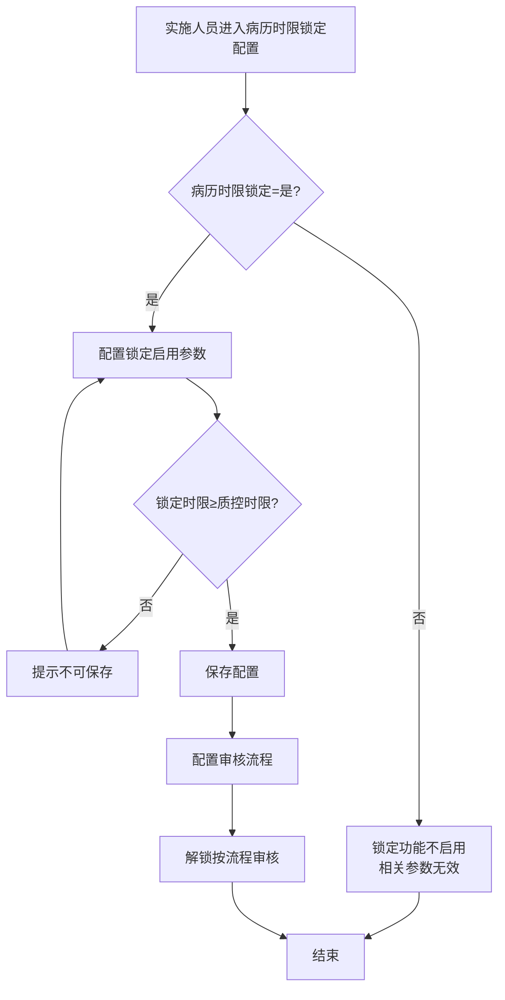
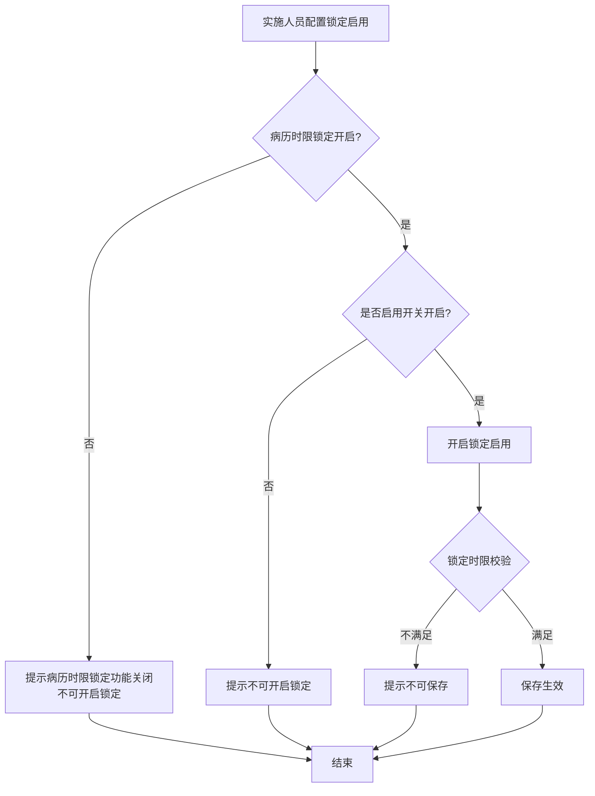

# BLGL-17-BLJS-004解锁参数与流程配置_ Analyst - Spec

> **需求编号**：BLGL-17-BLJS-004
> **父需求**：BLGL-17-BLJS
> **关联PM Spec**：BLGL-17-BLJS-004_解锁参数与流程配置_PM-spec.md
> **Spec版本**：V1.0
> **编写时间**：2026-08-14
> **编写人**：需求分析师

---

## 一、功能编号体系

### 1.1 功能层级结构

```
BLGL-17-BLJS-004: 解锁参数与流程配置
  ├─ BLGL-17-BLJS-004-01: 病历时限锁定配置
  │   ├─ -01-01: 病历时限锁定开关
  │   ├─ -01-02: 解锁后再次锁定
  │   └─ -01-03: 超时锁定患者条件配置
  ├─ BLGL-17-BLJS-004-02: 锁定启用与时限配置
  │   ├─ -02-01: 锁定启用参数（按监控类型）
  │   └─ -02-02: 锁定时限校验
  ├─ BLGL-17-BLJS-004-03: 审核流程配置
  │   └─ -03-01: 审核节点和审核模式
  └─ BLGL-17-BLJS-004-04: 解锁诊疗参数
      └─ -04-01: 解锁诊疗风险提示
```

### 1.2 功能编号表

| REQ-ID | 功能名称 | 类型 | 优先级 | 说明 |
|--------|---------|------|--------|------|
| BLGL-17-BLJS-004-01 | 病历时限锁定配置 | 功能 | P0 | 锁定开关/二次锁定/锁定条件 |
| BLGL-17-BLJS-004-01-01 | 病历时限锁定开关 | 子功能 | P0 | 是/否控制 |
| BLGL-17-BLJS-004-01-02 | 解锁后再次锁定 | 子功能 | P1 | 二次锁定 |
| BLGL-17-BLJS-004-01-03 | 超时锁定患者条件 | 子功能 | P1 | 患者出区48h |
| BLGL-17-BLJS-004-02 | 锁定启用与时限配置 | 功能 | P0 | 锁定启用/时限校验 |
| BLGL-17-BLJS-004-02-01 | 锁定启用参数 | 子功能 | P0 | 按监控类型 |
| BLGL-17-BLJS-004-02-02 | 锁定时限校验 | 子功能 | P1 | ≥质控时限 |
| BLGL-17-BLJS-004-03 | 审核流程配置 | 功能 | P1 | 审核节点/模式 |
| BLGL-17-BLJS-004-03-01 | 审核流程配置 | 子功能 | P1 | 控制审核 |
| BLGL-17-BLJS-004-04 | 解锁诊疗参数 | 功能 | P1 | 风险提示 |
| BLGL-17-BLJS-004-04-01 | 解锁诊疗风险提示 | 子功能 | P1 | 参数配置 |

---

## 二、核心业务流程

### 2.1 病历时限锁定配置流程



### 2.2 锁定启用配置流程



---

## 三、功能规格说明

---

### BLGL-17-BLJS-004-01: 病历时限锁定配置

#### 3.1.1 功能概述

配置病历时限锁定开关（默认否）、解锁后再次锁定、超时锁定患者条件。

#### 3.1.2 用户角色

| 角色 | 使用场景 | 权限要求 | 操作频率 |
|------|---------|---------|---------|
| 实施人员/病案管理员 | 配置病历时限锁定 | 配置权限 | 低频 |

#### 3.1.3 业务流程（Given/When/Then）

##### 主流程

**Scenario 1: 病历时限锁定配置**

```gherkin
Given:
  - 实施人员有配置权限

When:
  - 实施人员进入病历时限锁定配置
  - 配置参数（病历时限锁定=是/解锁后再次锁定）

Then:
  - 病历时限锁定功能启用
  - 已解锁病历按再次锁定时间锁定
  - 相关参数生效
```

##### 异常流程

**Scenario 2: 系统异常——审核流程配置**

```gherkin
Given:
  - 实施人员配置审核流程

When:
  - 配置审核节点和审核模式

Then:
  - 控制解锁审核流程
  - ⏳ 待确认：审核流程配置异常时的处理
```

##### 边界流程

**Scenario 3: 边界场景——超时锁定患者条件**

```gherkin
Given:
  - 实施人员配置"超时锁定患者的条件配置"

When:
  - 配置患者出区/48小时

Then:
  - 患者出区48小时后不允许编辑病历
  - 锁定说明50字以内
```

**Scenario 4: 边界场景——锁定开关关闭**

```gherkin
Given:
  - 病历时限锁定=否

When:
  - 配置相关参数

Then:
  - 全机构住院病历时限锁定功能不启用
  - 相关参数无效
```

#### 3.1.4 数据字段定义

| 字段名 | 类型 | 必填 | 默认值 | 取值范围 | 说明 | 概念ID |
|--------|------|------|--------|---------|------|--------|
| 病历时限锁定 | Boolean | 是 | 否 | 是/否 | 功能开关 | ⏳ 待确认 |
| 解锁后再次锁定 | Boolean | 否 | 否 | 是/否 | 二次锁定 | ⏳ 待确认 |
| 超时锁定患者条件 | String | 否 | 空 | 患者出区/48h | 锁定条件 | ⏳ 待确认 |

#### 3.1.5 验收标准

| AC编号 | 验收标准 | 对应REQ-ID | 验证方法 | 验证场景 |
|--------|---------|-----------|---------|---------|
| AC-001 | 病历时限锁定开关=是时锁定功能启用，=否时相关参数无效 | -004-01 | 功能测试 | Scenario 1/4 |
| AC-002 | 解锁后再次锁定配置后已解锁病历按再次锁定时间锁定 | -004-01 | 功能测试 | Scenario 1 |
| AC-003 | 超时锁定患者条件配置后出区48h锁定 | -004-01 | 功能测试 | Scenario 3 |

---

### BLGL-17-BLJS-004-02: 锁定启用与时限配置

#### 3.2.1 功能概述

配置锁定启用参数（按监控类型控制），锁定时限校验（≥质控时限或书写周期）。

#### 3.2.2 用户角色

| 角色 | 使用场景 | 权限要求 | 操作频率 |
|------|---------|---------|---------|
| 实施人员/质控办 | 配置锁定启用 | 配置权限 | 低频 |

#### 3.2.3 业务流程（Given/When/Then）

##### 主流程

**Scenario 1: 锁定启用参数**

```gherkin
Given:
  - 病历时限锁定功能已开启

When:
  - 实施人员配置锁定启用（按监控类型）

Then:
  - 该监控类型文书校验锁定流程
  - 锁定时限需≥质控时限或书写周期
```

##### 异常流程

**Scenario 2: 业务异常——锁定时限校验**

```gherkin
Given:
  - 实施人员配置锁定时限

When:
  - 锁定时限小于质控时限或书写周期

Then:
  - 提示"锁定时限需大于等于质控时限"
  - 不可保存
```

**Scenario 3: 数据异常——锁定启用未开启**

```gherkin
Given:
  - 病历时限锁定功能未开启
  - 或是否启用开关未启用

When:
  - 实施人员点击开启锁定启用开关

Then:
  - 提示"不可开启锁定"或"病历时限锁定功能关闭，不可开启锁定"
```

#### 3.2.4 数据字段定义

| 字段名 | 类型 | 必填 | 默认值 | 取值范围 | 说明 | 概念ID |
|--------|------|------|--------|---------|------|--------|
| 锁定启用 | Boolean | 否 | 关闭 | 开启/关闭 | 监控类型锁定 | ⏳ 待确认 |
| 锁定时限 | Int | 否 | - | - | ≥质控时限/书写周期 | ⏳ 待确认 |

#### 3.2.5 验收标准

| AC编号 | 验收标准 | 对应REQ-ID | 验证方法 | 验证场景 |
|--------|---------|-----------|---------|---------|
| AC-004 | 锁定启用参数按监控类型控制 | -004-02 | 功能测试 | Scenario 1 |
| AC-005 | 锁定时限小于质控时限时提示不可保存 | -004-02 | 功能测试 | Scenario 2 |

---

### BLGL-17-BLJS-004-03: 审核流程配置

#### 3.3.1 功能概述

通过审核流程配置，控制病历解锁审核节点和审核模式。

#### 3.3.2 用户角色

| 角色 | 使用场景 | 权限要求 | 操作频率 |
|------|---------|---------|---------|
| 实施人员 | 配置审核流程 | 配置权限 | 低频 |

#### 3.3.3 业务流程（Given/When/Then）

##### 主流程

**Scenario 1: 审核流程配置**

```gherkin
Given:
  - 实施人员有配置权限

When:
  - 实施人员配置审核流程（审核节点/审核模式）

Then:
  - 控制解锁审核节点和审核模式
  - 解锁申请按配置流程审核
```

##### 边界流程

**Scenario 2: 边界场景——自动解锁节点**

```gherkin
Given:
  - 审核流程配置自动解锁节点

When:
  - 解锁申请到达自动解锁节点

Then:
  - 审核人为系统，自动通过
```

#### 3.3.4 数据字段定义

| 字段名 | 类型 | 必填 | 默认值 | 取值范围 | 说明 | 概念ID |
|--------|------|------|--------|---------|------|--------|
| 审核节点 | String | 是 | - | - | 审核流程节点 | ⏳ 待确认 |
| 审核模式 | String | 是 | - | 人工/自动 | 审核模式 | ⏳ 待确认 |

#### 3.3.5 验收标准

| AC编号 | 验收标准 | 对应REQ-ID | 验证方法 | 验证场景 |
|--------|---------|-----------|---------|---------|
| AC-006 | 审核流程配置控制解锁审核节点和模式 | -004-03 | 功能测试 | Scenario 1 |

---

### BLGL-17-BLJS-004-04: 解锁诊疗参数

#### 3.4.1 功能概述

配置"病历解锁是否开启解锁诊疗"和"申请解锁诊疗的风险提示信息"参数。

#### 3.4.2 用户角色

| 角色 | 使用场景 | 权限要求 | 操作频率 |
|------|---------|---------|---------|
| 病案管理员 | 配置解锁诊疗参数 | 配置权限 | 低频 |

#### 3.4.3 业务流程（Given/When/Then）

##### 主流程

**Scenario 1: 解锁诊疗风险提示**

```gherkin
Given:
  - 参数"病历解锁是否开启解锁诊疗"=是

When:
  - 实施人员配置"申请解锁诊疗的风险提示信息"

Then:
  - 发起解锁诊疗申请时下方显示风险提示
```

#### 3.4.4 数据字段定义

| 字段名 | 类型 | 必填 | 默认值 | 取值范围 | 说明 | 概念ID |
|--------|------|------|--------|---------|------|--------|
| 解锁诊疗开关 | Boolean | 否 | 否 | 是/否 | 是否开启解锁诊疗 | ⏳ 待确认 |
| 风险提示信息 | String | 否 | - | 文本框 | 解锁诊疗风险提示 | ⏳ 待确认 |

#### 3.4.5 验收标准

| AC编号 | 验收标准 | 对应REQ-ID | 验证方法 | 验证场景 |
|--------|---------|-----------|---------|---------|
| AC-007 | 解锁诊疗风险提示参数配置后申请显示 | -004-04 | 功能测试 | Scenario 1 |

---

## 四、排除范围

本需求不包含以下功能项：

1. **病历时限锁定与编辑锁定** - 属 BLGL-17-BLJS-001
2. **病历解锁申请** - 属 BLGL-17-BLJS-002
3. **病历解锁审核** - 属 BLGL-17-BLJS-003

> 与 PM-Spec 第四章一致。对照 Phase 1 功能点Spec 第6章（基线能力），确保不越界。

---

## 五、业务规则清单

| 规则ID | 规则名称 | 规则描述 | 来源 | 优先级 |
|--------|---------|---------|------|--------|
| BR-001 | 锁定开关 | 病历时限锁定开关控制全机构锁定功能，默认否 |  | P0 |
| BR-002 | 二次锁定 | 解锁后再次锁定配置二次锁定 |  | P1 |
| BR-003 | 锁定启用 | 锁定启用参数按监控类型控制 |  | P0 |
| BR-004 | 锁定时限校验 | 锁定时限需≥质控时限或书写周期 |  | P1 |
| BR-005 | 审核流程 | 审核流程配置控制解锁审核节点和模式 |  | P1 |
| BR-006 | 超时锁定条件 | 超时锁定患者条件配置（患者出区） |  | P1 |
| BR-007 | 解锁诊疗 | 解锁诊疗开关和风险提示参数 | 4 | P1 |

---

## 六、关联文档

| 文档类型 | 文档路径 | 说明 |
|---------|---------|------|
| 功能点Spec（模块级） | 上级目录 BLGL-17-BLJS 17病历解锁功能点Spec.md（V1.0） | 模块级功能点索引 |
| 功能Spec（业务背景与设计） | 本目录 BLGL-17-BLJS-004_解锁参数与流程配置-Spec.md（V1.0） | 业务背景与目标 Spec |
| Analyst-Spec（分析规格） | 本目录 BLGL-17-BLJS-004_解锁参数与流程配置_Analyst-spec.md（V1.0）（本文档） | 分析规格 |
| PM-Spec（需求规格） | 本目录 BLGL-17-BLJS-004_解锁参数与流程配置_PM-spec.md（V0.1） | PM 产出的 Spec 文档 |
| data-model.md | 待产出 | 架构师产出的数据建模文档 |
| design.md | 待产出 | 架构师产出的技术方案文档 |
| api-contract.md | 待产出 | 开发经理产出的 API 契约文档 |

---

## 七、待确认问题清单

| 编号 | 问题描述 | 缺失信息 | 影响范围 | 建议补充方 |
|------|---------|---------|---------|-----------|
| Q-001 | 审核流程配置异常 | 审核流程配置失败处理 | 3.1.3 Scenario 2 | 开发经理 |
| Q-002 | 参数配置接口契约 | 主数据参数查询/保存接口 | 第5章接口设计 | 开发经理 |
| Q-003 | 概念ID、性能指标 | 参数概念ID、配置SLA | 数据模型、非功能 | 架构师/产品经理 |

---

## 填写检查清单

| 序号 | 检查项 | 是否完成 |
|:----:|--------|:--------:|
| 1 | 功能编号带父子层级 | ✅ |
| 2 | 每个 REQ-ID 有功能概述和用户角色 | ✅ |
| 3 | 主流程至少 1 个 Given/When/Then 场景 | ✅ |
| 4 | 异常流程至少 3 个 Given/When/Then 场景 | ✅ |
| 5 | 边界流程至少 2 个 Given/When/Then 场景 | ✅ |
| 6 | 每个 Given/When/Then 内容具体，不模糊 | ✅ |
| 7 | 数据字段定义完整 | ✅ |
| 8 | 验收标准 AC 编号独立，可验证 | ✅ |
| 9 | 验收标准无"功能正常"等模糊表述 | ✅ |
| 10 | 排除范围明确列出 | ✅ |
| 11 | 业务规则清单列出所有规则，每条标注来源 | ✅ |
| 12 | 流程图使用 Mermaid 格式（≥2 个） | ✅ |
| 13 | 关联文档索引包含 Phase 1 功能点Spec | ✅ |
| 14 | 待确认问题清单汇总了全文所有 ⏳ 项 | ✅ |
| 15 | 全文无占位符 `< >` 残留 | ✅ |
| 16 | 全文陈述可溯源至资料区（S1~S10 溯源核查） | ✅ |
| 17 | 人工审核确认完成 | ⏳ 待确认 |

---

**文档状态**：⬜ 待审核
**维护责任**：需求分析师规范组
**下次更新**：根据评审反馈优化

---

## 版本历史

| 版本 | 日期 | 变更说明 | 编写人 |
|------|------|---------|--------|
| V1.0 | 2026-08-14 | 初始版本 | 需求分析师 |
