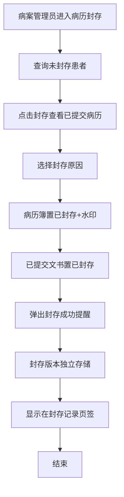
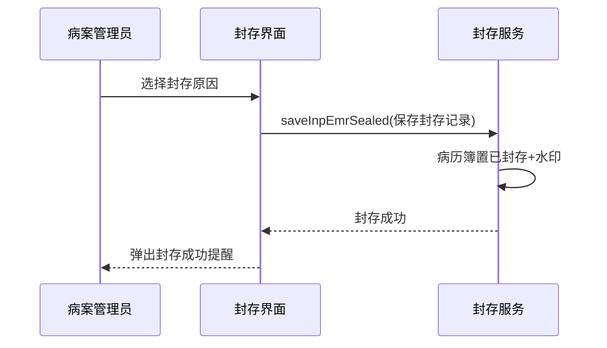

# BLGL-18-BLFC-001 病历封存与解封操作-Spec

> **功能编号**：BLGL-18-BLFC-001
> **文档类型**：功能Spec（业务背景与设计）
> **文档版本**：V1.0
> **编写时间**：2026-08-14
> **编写人**：RACC

---

## 文档索引

#### 章节索引

**Spec（研发视角）**

| 章节号 | 章节名称 |
|--------|---------|
| 1、 | 文档概述 |
| 2、 | 功能背景与定位 |
| 3、 | 业务流程设计 |
| 4、 | 数据模型设计 |
| 5、 | 接口契约设计 |
| 6、 | 技术方案设计 |
| 7、 | 测试用例预设计 |
| 8、 | 非功能性要求 |
| 9、 | 依赖与风险 |
| 10、 | 附录 |

**PM-Spec（业务视角）**

| 章节号 | 章节名称 | 内容说明 |
|--------|---------|---------|
| 一 | 目标 | 功能定位与核心价值 |
| 二 | 约束 | 业务/技术/非功能性约束 |
| 三 | 验收标准 | 验收条件与验证方法 |
| 四 | 排除范围 | 本次不做项与明确边界 |
| 五 | 关键决策记录 | 方案决策与选型理由 |
| 六 | 优先级 | 优先级定义 |
| 七 | 关联文档 | 关联文档索引 |
| 附录 | 填写检查清单 | 质量检查 |

**Analyst-Spec（产品视角）**

| 章节号 | 章节名称 | 内容说明 |
|--------|---------|---------|
| 一 | 功能编号体系 | 功能编号与层级结构 |
| 二 | 核心业务流程 | 核心业务流程与时序 |
| 三 | 功能规格说明 | 详细功能规格与验收标准 |
| 四 | 排除范围 | 排除范围 |
| 五 | 业务规则清单 | 业务规则清单 |
| 六 | 关联文档 | 关联文档索引 |
| 七 | 待确认问题清单 | 待确认问题汇总 |
| - | 填写检查清单 | 质量检查 |

#### 版本历史

| 版本 | 日期 | 变更说明 | 编写人 |
|------|------|---------|--------|
| V1.0 | 2026-08-14 | 初始版本 | RACC |

#### 关联文档索引

| 序号 | 文档名称 | 文档类型 | 版本 | 位置 |
|------|---------|---------|------|------|
| 1 | BLGL-18-BLFC-001_病历封存与解封操作-Spec.md | 功能Spec（业务背景与设计）（本文档） | V1.0 | 本目录 |
| 2 | BLGL-18-BLFC-001_病历封存与解封操作_PM-spec.md | PM-Spec（需求规格） | V0.1 | 本目录 |
| 3 | BLGL-18-BLFC-001_病历封存与解封操作_Analyst-spec.md | Analyst-Spec（分析规格） | V1.0 | 本目录 |
| 4 | BLGL-18-BLFC 18病历封存功能点Spec.md | 功能点Spec（模块级） | V1.1 | 上级目录 |

---

## 1、文档概述

### 1.1、文档目的

本文档旨在明确"病历封存与解封操作"功能（BLGL-18-BLFC-001）的业务背景与设计方案，为需求分析、研发实现、测试验收及评审提供统一的业务上下文、设计口径与决策依据。

### 1.2、文档范围

#### 1.2.1 纳入范围

本文档覆盖病历封存与解封操作的完整业务背景与设计，包括：

- 病历封存界面查询未封存就诊、执行封存（选择封存原因、病历簿置已封存加水印）
- 病历封存/再封存/解封操作及操作成功提醒
- 封存版本管理（封存时点独立存储、多次封存生成多次版本、可找回打印）
- 封存后病历操作限制（不允许编辑/提交/审签）

#### 1.2.2 排除范围

本文档不涉及以下内容（详见其他功能点或模块）：

- 封存权限与操作控制（权限/时间段/打印控制）—— BLGL-18-BLFC-002
- 无纸化三方对接—— BLGL-18-BLFC-003
- 封存记录查询导出、封存状态/印章/图标、另起一页、不允许召回、版本PDF找回 —— Phase 1 功能点Spec 第6章基础能力（BC-BLFC-001~008）

### 1.3、术语定义

| 术语 | 定义 |
|------|------|
| 病历封存 | 病案管理员将病历簿设为"已封存"状态，加水印 |
| 再封存 | 对已封存病历再次执行封存操作 |
| 解封 | 解除病历封存状态 |
| 封存版本 | 封存时点的病历独立存储版本，多次封存生成多次记录 |

> ⏳ 待确认：规范术语表待产品文档确认。

### 1.4、阅读指南

- **章节关系**：第1~2章为业务全貌，第3~10章为设计实现层。与 Analyst-Spec、PM-Spec 互相引用保持一致。
- **读者对象**：产品经理/需求分析师读第1~2章；研发读第3~6、9~10章；测试读第3、7~8章；评审人员核对各层一致性。

### 1.5、参考文档

| 序号 | 文档名称 | 版本/日期 |
|------|---------|
| 1 | 【历史需求】住院病历的历史需求.xlsx | - |
| 2 | BLGL-18-BLFC-001_病历封存与解封操作_PM-spec.md | V0.1 |
| 3 | BLGL-18-BLFC-001_病历封存与解封操作_Analyst-spec.md | V1.0 |
| 4 | BLGL-18-BLFC 18病历封存功能点Spec.md | V1.1 |

---

## 2、功能背景与定位

### 2.1 功能背景

病历封存与解封操作是病历封存的核心状态管理，需满足：

- **管理要求**：遇到医疗事故时病人的病历将被封存，已封存病历不能修改和删除
- **现状痛点**：
 - 封存后无任何提示，仅界面左下角封存按钮消失
 - 点击再封存直接弹出封存窗口，无法查看当前病历明细
 - 三方点击封存后住院病历无变化
- **历史需求演进**：从病历文书封存建立（、176633）→ 封存成功提醒→ 再封存优化→ 封存版本管理（、472238）→ 允许编辑参数

### 2.2 功能定位

"病历封存与解封操作"是 WiNEX 病历管理-病历封存模块的核心状态管理，定位为：

- **病历封存保护**：将病历簿和已提交文书置为已封存
- **版本独立存储**：封存时点版本可找回、打印
- **操作反馈**：封存/再封存/解封操作成功提醒

### 2.3 目标用户

| 用户角色 | 主要使用场景 |
|---------|-------------|
| 病案管理员 | 执行封存/再封存/解封操作 |
| 住院医生 | 查看封存状态（不允许编辑） |

### 2.4 核心价值

| 价值维度 | 价值描述 |
|---------|---------|
| 病历真实 | 封存保护病历真实性 |
| 举证支撑 | 封存版本独立存储可找回打印 |
| 操作反馈 | 封存成功提醒避免误判 |

---

## 3、业务流程设计（Given/When/Then）

### 3.1 主流程

**Scenario 1: 病历封存**

```gherkin
Given:
 - 病案管理员有封存权限
 - 存在从未封存过的就诊信息

When:
 - 病案管理员进入病历封存界面
 - 查询未封存患者
 - 点击封存，查看当前时间所有已提交的病历
 - 点击封存按钮，选择封存原因

Then:
 - 病历簿设为状态"已封存"，加水印
 - 所有已提交的病历文书也设为"已封存"
 - 已封存病历簿允许新增病历
 - 弹出封存成功提醒
 - 该就诊信息显示在封存记录页签
```

### 3.2 异常流程

**Scenario 2: 业务异常——再封存无法查看明细**

```gherkin
Given:
 - 已封存的就诊信息

When:
 - 病案管理员点击"再封存"按钮

Then:
 - 直接弹出封存窗口（原问题：无法查看当前病历明细）
 - 应进入病历详情页面，在详情页面下方显示"再封存"按钮
```

**Scenario 3: 数据异常——三方封存无变化**

```gherkin
Given:
 - 三方（病案系统）点击封存

When:
 - 三方通知住院病历

Then:
 - 住院病历无变化（原问题）
 - ⏳ 待确认：三方封存同步住院病历的机制
```

**Scenario 4: 系统异常——封存后无提示**

```gherkin
Given:
 - 病历封存/再封存/解封操作

When:
 - 操作完成

Then:
 - 弹出操作成功提醒（原无提示问题）
```

### 3.3 边界流程

**Scenario 5: 边界场景——封存后允许编辑**

```gherkin
Given:
 - 参数"已封存的病历文书是否允许编辑"配置为"是"
 - 未对接60病案系统

When:
 - 封存后医生编辑原病历

Then:
 - 允许编辑原病历
 - 封存版本独立存储可找回
 - 若对接60病案系统则不允许编辑（参数无效）
```

**Scenario 6: 边界场景——封存后新建病历**

```gherkin
Given:
 - 病历已封存

When:
 - 医生新增病历

Then:
 - 已封存病历簿允许新增病历
 - 封存后书写的第一份病程（参数开启时）另起一页显示
```

---

## 4、数据模型设计

> 数据模型信息来自代码扫描（`E:\39EMR\sr-next`）和历史需求。标注 `` 的表名/字段来自 PO 实体，标注 `` 的来自需求文本。

### 4.1 核心数据结构

#### 4.1.1 核心表/实体

| 表/实体 | 关键字段 | 说明 |
|---------|---------|------|
| INP_RHB_SEALING（InpRhbSealingPO） | INP_RHB_SEALING_ID、INP_RHB_RECORD_ID、ENCOUNTER_ID、ACTION_REASON、SEALED_STATUS、SEALED_AT、SEALED_BY、MEMO、SERVICE_CHANNEL_CODE | 封存记录表 |
| INP_EMR_SEALED（InpEmrSealedPO） | INP_EMR_SEALED_ID、INP_RHB_SEALING_ID、INP_EMR_SET_ID、INP_EMR_CLASS_ID、ENCOUNTER_ID | 封存明细表 |
| INPATIENT_EMR_INCOMPLETE / 病历簿 | 封存状态 | 病历簿封存状态 |

> ⏳ 待确认：完整数据表清单待代码扫描或功能清单数据表清单补充。

#### 4.1.2 封存关键字段

| 字段名 | 类型 | 说明 |
|--------|------|
| ACTION_REASON | String | 封存原因 |
| SEALED_STATUS | Long | 封存状态 |
| SEALED_AT | Date | 封存时间 |
| SEALED_BY | Long | 封存人 |
| MEMO | String | 封存备注 |

### 4.2 状态定义

| 状态码 | 状态名称 | 说明 |
|--------|---------|------|
| SEALED_STATUS | 已封存 | 病历簿封存状态 |
| 未封存 | 未封存 | 未封存状态 |

### 4.3 系统参数定义

| 参数编码 | 参数名称 | 说明 |
|---------|---------|------|
| 已封存的病历文书是否允许编辑 | 允许编辑参数 | 默认为否；对接60病案系统时参数无效 |
| 病案归档是否开启与60病案系统对接模式 | 60对接参数 | 233283456546350001；开启时不判断允许编辑参数 |
| 封存后新建的病程是否另起一页 | 另起一页参数 | 默认否 |

---

## 5、接口契约设计

> 接口信息来自代码扫描（`E:\39EMR\sr-next`）的 InpatientEmrSealController + InpEmrSealingApiPathConstants。标注 ``。

### 5.1 API列表

| 序号 | API名称（代码函数） | 路径 | 方法 | 说明 |
|:----:|---------|------|:----:|------|
| 1 | saveInpEmrSealed | /api/v1/app_record_inpatient/inp_rhb_sealing/save | POST | 保存封存记录（已提交的病历） |
| 2 | queryInpRhbSealingByExample | /api/v1/app_record_inpatient/inp_rhb_sealing/query/by_example | POST | 分页查询封存记录 |
| 3 | queryInpEmrSealedByExample | /api/v1/app_record_inpatient/inp_emr_sealed/query/by_example | POST | 查询封存记录明细 |

> 前端实际请求前缀：`/inpatient-clinicalnote/api/v1/app_record_inpatient/`。

### 5.2 接口详细设计

#### 5.2.1 保存封存记录（saveInpEmrSealed）

**请求参数（InpRhbSealingSaveInputAO）**:
```json
{
 "inpRhbRecordId": 1001
 "encounterId": 2001
 "actionReason": "医疗纠纷举证"
 "memo": "封存备注"
}
```

**返回值（成功）**:
```json
{
 "success": true
 "data": null
}
```

**返回值（失败）**:
```json
{
 "success": false
 "message": "封存失败"
 "data": null
}
```

> ⏳ 待确认：具体字段名/结构以接口契约文档为准。

### 5.3 错误码定义

| 错误码 | 错误信息 | 处理方式 |
|--------|---------|---------|
| ⏳ 待确认 | 封存失败 | 提示错误并返回封存界面 |

> ⏳ 待确认：业务错误码定义未在代码扫描中提取完整。

---

## 6、技术方案设计

### 6.1 页面路径

- **页面路径**: 病历管理→病历封存（病历封存/封存记录两个页签）
- **路由**: /clinicalnote-sealing（病历封存，EmrManage.js）
- **前端组件**: ClinicalnoteSealingManagement/index.vue + components/clinicalnoteSeal.vue（封存）+ sealRecord.vue（封存记录）
- **后端接口**: InpatientEmrSealController（tags: 病历封存）

### 6.2 技术栈

| 类别 | 技术 | 版本 |
|------|------|------|
| 前端框架 | Vue | 2.6.14 |
| 前端UI | element-ui | 2.13.0 |
| 后端框架 | Spring Boot（Java） | java.version 17 |
| 构建工具 | webpack / Maven | 前端 webpack + 后端 Maven |

### 6.3 关键技术点

- 封存保存：saveInpEmrSealed（/inp_rhb_sealing/save）
- 封存状态：SEALED_STATUS 病历簿置已封存 + 水印
- 封存版本：record ID 记录每次封存版本
- 再封存：进入病历详情页面下方显示"再封存"按钮
- 封存成功提醒：封存/再封存/解封操作后弹出提醒

### 6.4 部署方案

⏳ 待确认：部署方案未在资料区中找到。

---

## 7、测试用例预设计

### 7.1 功能测试

| 用例编号 | 测试场景 | Given | When | Then |
|---------|---------|-------|--------|
| TC-001 | 病历封存 | 有未封存就诊 | 执行封存并选原因 | 病历簿置已封存加水印，弹出成功提醒 |
| TC-002 | 再封存 | 已封存病历 | 点击再封存 | 进入详情页显示再封存按钮 |

### 7.2 边界测试

| 用例编号 | 测试场景 | Given | When | Then |
|---------|---------|-------|--------|
| TC-003 | 封存后允许编辑 | 参数为是，未对接60 | 编辑原病历 | 允许编辑，版本独立存储 |
| TC-004 | 封存后新建病历 | 已封存病历簿 | 新增病历 | 允许新增，另起一页（参数开启） |

### 7.3 异常测试

| 用例编号 | 测试场景 | Given | When | Then |
|---------|---------|-------|--------|
| TC-005 | 三方封存无变化 | 三方点击封存 | 同步住院病历 | ⏳ 待确认：同步机制 |
| TC-006 | 封存无提示 | 执行封存操作 | 操作完成 | 弹出成功提醒 |

### 7.4 性能测试

| 用例编号 | 测试场景 | 指标 |
|---------|---------|
| TC-007 | 封存操作响应 |

---

## 8、非功能性要求

### 8.1 性能要求

| 指标 | 要求 |
|------|------|
| 封存操作响应 | ⏳ 待确认 |

### 8.2 安全要求

| 要求 | 说明 |
|------|------|
| 封存权限 | 仅病案管理员可封存 |

**医疗行业特殊要求**

| 要求 | 说明 |
|------|------|
| 病历真实 | 封存保护病历真实性 |
| 举证支撑 | 封存版本可找回打印 |

### 8.3 可用性要求

| 指标 | 要求值 |
|------|--------|
| 可用性 | ⏳ 待确认 |

### 8.4 兼容性要求

| 类型 | 要求 |
|------|------|
| 60病案系统兼容 | 对接60病案系统时不允许编辑，允许编辑参数无效 |

---

## 9、依赖与风险

### 9.1 外部依赖

| 依赖项 | 说明 |
|--------|------|
| 病案系统 | 三方封存状态回传 |

### 9.2 风险项

| 风险项 | 等级 | 说明 | 应对方案 |
|--------|------|------|---------|
| 三方封存无同步 | 中 | 三方封存住院病历无变化 | 对接同步机制 |
| 版本管理复杂 | 中 | 多次封存生成多版本 | record ID 记录版本 |

---

## 10、附录

### 10.1 流程图



### 10.2 时序图



### 10.3 参考文档

- 【历史需求】住院病历的历史需求.xlsx（、280463、550459、267880、472238、267809、176633、1299423）
- BLGL-18-BLFC 18病历封存功能点Spec.md（V1.1，第5章 -001 行）
- 关联Spec: BLGL-18-BLFC-002（权限控制）、-003（无纸化对接）

---

## 填写检查清单

| 序号 | 检查项 | 是否完成 |
|:----:|--------|:--------:|
| 1 | 章节索引与正文章节一致 | ✅ |
| 2 | 版本历史记录完整 | ✅ |
| 3 | 关联文档索引已登记全部Spec | ✅ |
| 4 | 文档目的明确回答"为什么做/做成什么/怎么做" | ✅ |
| 5 | 纳入范围/排除范围清晰 | ✅ |
| 6 | 术语定义覆盖关键概念，从资料区可溯源 | ✅ |
| 7 | 参考文档已登记 | ✅ |
| 8 | 功能背景基于法规/规范/需求来源组织 | ✅ |
| 9 | 功能定位体现业务价值（3~5个定位点） | ✅ |
| 10 | 目标用户角色覆盖完整，在需求原文中有出处 | ✅ |
| 11 | 核心价值可陈述，与 Phase 1 口径一致 | ✅ |
| 12 | 业务流程：主流程≥1、异常≥3、边界≥2，Given/When/Then 具体 | ✅ |
| 13 | 数据模型：字段/表/状态/参数可溯源 | ✅ |
| 14 | 接口契约：API列表+详细设计+错误码齐全或标记待确认 | ✅ |
| 15 | 技术方案：页面路径/技术栈/关键点/部署方案或标记待确认 | ✅ |
| 16 | 测试用例：功能/边界/异常/性能覆盖 | ✅ |
| 17 | 非功能性要求：性能/安全/可用性/兼容性指标可量化或标记待确认 | ✅ |
| 18 | 依赖与风险：外部依赖登记完整 | ✅ |
| 19 | 附录：流程图/时序图与正文流程一致 | ✅ |
| 20 | 全文无占位符 `< >` 残留 | ✅ |
| 21 | 全文陈述可溯源至资料区 | ✅ |
| 22 | 人工审核确认完成 | ⏳ 待确认 |

---

**文档状态**：⬜ 待审核
**维护责任**：RACC
**下次更新**：根据评审反馈优化
