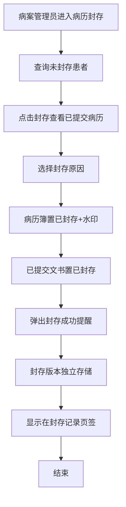
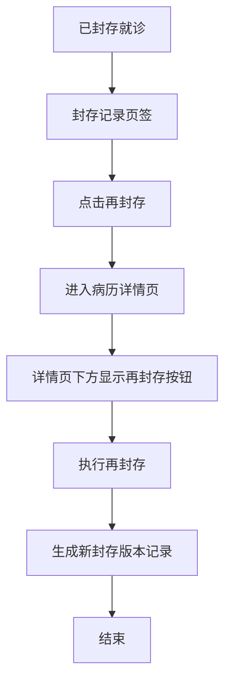

# BLGL-18-BLFC-001病历封存与解封操作_ Analyst - Spec

> **需求编号**：BLGL-18-BLFC-001
> **父需求**：BLGL-18-BLFC
> **关联PM Spec**：BLGL-18-BLFC-001_病历封存与解封操作_PM-spec.md
> **Spec版本**：V1.0
> **编写时间**：2026-08-14
> **编写人**：需求分析师

---

## 一、功能编号体系

### 1.1 功能层级结构

```
BLGL-18-BLFC-001: 病历封存与解封操作
 ├─ BLGL-18-BLFC-001-01: 病历封存操作
 │ ├─ -01-01: 查询未封存就诊
 │ ├─ -01-02: 执行封存（选择封存原因）
 │ ├─ -01-03: 病历簿置已封存+水印
 │ └─ -01-04: 封存成功提醒
 ├─ BLGL-18-BLFC-001-02: 再封存与解封
 │ ├─ -02-01: 再封存（病历详情页）
 │ └─ -02-02: 解封操作
 └─ BLGL-18-BLFC-001-03: 封存版本管理
 ├─ -03-01: 封存版本独立存储
 ├─ -03-02: 多次封存生成多次记录
 └─ -03-03: 版本可找回打印
```

### 1.2 功能编号表

| REQ-ID | 功能名称 | 类型 | 优先级 | 说明 |
|--------|---------|------|--------|
| BLGL-18-BLFC-001-01 | 病历封存操作 | 功能 | P0 | 查询未封存就诊执行封存 |
| BLGL-18-BLFC-001-01-01 | 查询未封存就诊 | 子功能 | P0 | 只查询从未封存过 |
| BLGL-18-BLFC-001-01-02 | 执行封存 | 子功能 | P0 | 选择封存原因 |
| BLGL-18-BLFC-001-01-03 | 病历簿置已封存 | 子功能 | P0 | 加水印 |
| BLGL-18-BLFC-001-01-04 | 封存成功提醒 | 子功能 | P1 | 弹出提醒 |
| BLGL-18-BLFC-001-02 | 再封存与解封 | 功能 | P0 | 再封存/解封 |
| BLGL-18-BLFC-001-02-01 | 再封存 | 子功能 | P0 | 详情页再封存按钮 |
| BLGL-18-BLFC-001-02-02 | 解封操作 | 子功能 | P1 | 解除封存 |
| BLGL-18-BLFC-001-03 | 封存版本管理 | 功能 | P1 | 版本独立存储 |
| BLGL-18-BLFC-001-03-01 | 版本独立存储 | 子功能 | P1 | 封存时点存储 |
| BLGL-18-BLFC-001-03-02 | 多次封存版本 | 子功能 | P1 | record ID记录 |
| BLGL-18-BLFC-001-03-03 | 版本找回打印 | 子功能 | P1 | 可找回打印 |

---

## 二、核心业务流程

### 2.1 病历封存流程



### 2.2 再封存与版本管理流程



---

## 三、功能规格说明

---

### BLGL-18-BLFC-001-01: 病历封存操作

#### 3.1.1 功能概述

病案管理员在病历封存界面查询从未封存过的就诊信息，点击封存查看当前时间所有已提交的病历，选择封存原因后将病历簿设为"已封存"加水印。

#### 3.1.2 用户角色

| 角色 | 使用场景 | 权限要求 | 操作频率 |
|------|---------|---------|---------|
| 病案管理员 | 执行病历封存 | 封存权限 | 低频 |

#### 3.1.3 业务流程（Given/When/Then）

##### 主流程

**Scenario 1: 病历封存**

```gherkin
Given:
 - 病案管理员有封存权限
 - 存在从未封存过的就诊信息

When:
 - 病案管理员进入病历封存界面
 - 查询未封存患者
 - 点击封存，查看当前时间所有已提交的病历
 - 点击封存按钮，选择封存原因

Then:
 - 病历簿设为状态"已封存"，加水印
 - 所有已提交的病历文书也设为"已封存"
 - 已封存病历簿允许新增病历
 - 弹出封存成功提醒
 - 该就诊信息显示在封存记录页签
```

##### 异常流程

**Scenario 2: 系统异常——封存后无提示**

```gherkin
Given:
 - 病历封存/再封存/解封操作

When:
 - 操作完成

Then:
 - 弹出操作成功提醒（原无提示问题）
```

**Scenario 3: 数据异常——三方封存无变化**

```gherkin
Given:
 - 三方（病案系统）点击封存

When:
 - 三方通知住院病历

Then:
 - 住院病历无变化（原问题）
 - ⏳ 待确认：三方封存同步住院病历的机制
```

##### 边界流程

**Scenario 4: 边界场景——封存后新建病历**

```gherkin
Given:
 - 病历已封存

When:
 - 医生新增病历

Then:
 - 已封存病历簿允许新增病历
 - 封存后书写的第一份病程（参数开启时）另起一页显示
```

**Scenario 5: 边界场景——封存后操作限制**

```gherkin
Given:
 - 患者封存

When:
 - 医生操作已提交病历

Then:
 - 不能进行操作（提交、审签、撤销审签、阅改等）
 - 病历目录上有封存图标，文书上有"已封存"印章
```

#### 3.1.4 数据字段定义

> 字段名来自代码扫描（`E:\39EMR\sr-next`，标注 `` 的来自 InpRhbSealingPO / InpEmrSealedPO）。

| 字段名 | 类型 | 必填 | 默认值 | 取值范围 | 说明 | 概念ID |
|--------|------|------|--------|---------|------|--------|
| inpRhbRecordId | Long | 是 | - | - | 病历簿ID | ⏳ 待确认 |
| encounterId | Long | 是 | - | - | 就诊标识 | ⏳ 待确认 |
| actionReason | String | 是 | - | - | 封存原因 | ⏳ 待确认 |
| sealedStatus | Long | 是 | - | 已封存/未封存 | 封存状态 | ⏳ 待确认 |
| memo | String | 否 | - | - | 封存备注 | ⏳ 待确认 |

#### 3.1.5 验收标准

| AC编号 | 验收标准 | 对应REQ-ID | 验证方法 | 验证场景 |
|--------|---------|-----------|--------|
| AC-001 | 查询未封存就诊执行封存，病历簿置已封存加水印 | -001-01 | 功能测试 | Scenario 1 |
| AC-002 | 封存成功弹出提醒 | -001-01 | 功能测试 | Scenario 2 |
| AC-003 | 封存后新建病历允许，另起一页（参数开启） | -001-01 | 功能测试 | Scenario 4 |

---

### BLGL-18-BLFC-001-02: 再封存与解封

#### 3.2.1 功能概述

对已封存就诊执行再封存（进入病历详情页显示再封存按钮）和解封操作，操作后弹出成功提醒。

#### 3.2.2 用户角色

| 角色 | 使用场景 | 权限要求 | 操作频率 |
|------|---------|---------|---------|
| 病案管理员 | 再封存/解封 | 封存权限 | 低频 |

#### 3.2.3 业务流程（Given/When/Then）

##### 主流程

**Scenario 1: 再封存**

```gherkin
Given:
 - 已封存的就诊信息

When:
 - 病案管理员点击"再封存"按钮

Then:
 - 进入病历详情页面
 - 在详情页面下方显示"再封存"按钮
 - 执行再封存后弹出成功提醒
```

##### 异常流程

**Scenario 2: 业务异常——再封存无法查看明细**

```gherkin
Given:
 - 点击再封存

When:
 - 旧逻辑直接弹出封存窗口

Then:
 - 无法查看当前病历明细（原问题）
 - 应进入病历详情页
```

##### 边界流程

**Scenario 3: 边界场景——解封操作**

```gherkin
Given:
 - 已封存病历

When:
 - 病案管理员执行解封

Then:
 - 解除封存状态
 - 弹出解封成功提醒
```

#### 3.2.4 数据字段定义

| 字段名 | 类型 | 必填 | 默认值 | 取值范围 | 说明 | 概念ID |
|--------|------|------|--------|---------|------|--------|
| 再封存按钮 | - | 否 | - | - | 病历详情页下方按钮 | ⏳ 待确认 |

#### 3.2.5 验收标准

| AC编号 | 验收标准 | 对应REQ-ID | 验证方法 | 验证场景 |
|--------|---------|-----------|--------|
| AC-004 | 再封存进入病历详情页下方显示再封存按钮 | -001-02 | 功能测试 | Scenario 1 |
| AC-005 | 解封后弹出成功提醒 | -001-02 | 功能测试 | Scenario 3 |

---

### BLGL-18-BLFC-001-03: 封存版本管理

#### 3.3.1 功能概述

封存时点的病历独立存储，多次封存生成多次版本记录（record ID），封存版本可找回、打印。

#### 3.3.2 用户角色

| 角色 | 使用场景 | 权限要求 | 操作频率 |
|------|---------|---------|---------|
| 病案管理员 | 查看封存版本 | 封存权限 | 低频 |

#### 3.3.3 业务流程（Given/When/Then）

##### 主流程

**Scenario 1: 封存版本独立存储**

```gherkin
Given:
 - 病历封存

When:
 - 封存操作完成

Then:
 - 封存时点的病历独立存储
 - 记录 record ID（每次封存的病历版本）
 - 多次封存生成多次记录
 - 封存版本可找回、打印
```

##### 异常流程

**Scenario 2: 业务异常——封存后允许编辑**

```gherkin
Given:
 - 参数"已封存的病历文书是否允许编辑"=是
 - 未对接60病案系统

When:
 - 封存后医生编辑原病历

Then:
 - 允许编辑原病历，也允许删除原病历
 - 封存版本独立存储不受影响
 - 若对接60病案系统则不允许编辑（参数无效）
```

##### 边界流程

**Scenario 3: 边界场景——无纸化封存版本**

```gherkin
Given:
 - 启用无纸化封存（参数=是）

When:
 - 无纸化封存病历

Then:
 - 同样记录 record ID 和病历版本
```

#### 3.3.4 数据字段定义

| 字段名 | 类型 | 必填 | 默认值 | 取值范围 | 说明 | 概念ID |
|--------|------|------|--------|---------|------|--------|
| record ID | Long | 是 | - | - | 每次封存的病历版本记录 | ⏳ 待确认 |
| 已封存允许编辑 | Boolean | 否 | 否 | 是/否 | 允许编辑参数 | ⏳ 待确认 |

#### 3.3.5 验收标准

| AC编号 | 验收标准 | 对应REQ-ID | 验证方法 | 验证场景 |
|--------|---------|-----------|--------|
| AC-006 | 封存时点版本独立存储，多次封存生成多次记录 | -001-03 | 功能测试 | Scenario 1 |
| AC-007 | 参数允许编辑=是且未对接60时，封存后可编辑原病历 | -001-03 | 功能测试 | Scenario 2 |

---

## 四、排除范围

本需求不包含以下功能项：

1. **封存权限与操作控制** - 权限/时间段/打印控制，属 BLGL-18-BLFC-002
2. **无纸化三方对接** - 属 BLGL-18-BLFC-003
3. **封存记录查询导出、状态展示、另起一页、不允许召回、版本PDF找回** - 属基础能力 BC-BLFC-001~008

> 与 PM-Spec 第四章一致。对照 Phase 1 功能点Spec 第6章（基线能力），确保不越界。

---

## 五、业务规则清单

| 规则ID | 规则名称 | 规则描述 | 优先级 |
|--------|---------|---------|--------|
| BR-001 | 封存查询范围 | 只查询从未封存过的就诊信息 | P0 |
| BR-002 | 封存置状态 | 封存时病历簿和所有已提交文书置已封存，加水印 | P0 |
| BR-003 | 封存后新增 | 已封存病历簿允许新增病历 | P1 |
| BR-004 | 操作提醒 | 封存/再封存/解封操作后弹出成功提醒 | P1 |
| BR-005 | 再封存 | 再封存进入病历详情页显示按钮 | P1 |
| BR-006 | 版本记录 | 封存记录记录 record ID，每次封存版本 | P1 |
| BR-007 | 允许编辑 | 参数控制已封存文书是否允许编辑，对接60时无效 | P1 |

---

## 六、关联文档

| 文档类型 | 文档路径 | 说明 |
|---------|---------|
| 功能点Spec | BLGL-18-BLFC 18病历封存功能点Spec.md（V1.1，上级目录） | Phase 1 功能点索引 |
| PM spec | 本目录 BLGL-18-BLFC-001_病历封存与解封操作_PM-spec.md（V0.1） | PM 产出的 Spec 文档 |
| -Spec | 本目录 BLGL-18-BLFC-001_病历封存与解封操作-Spec.md（V1.0） | 业务背景与目标 Spec |
| data-model.md | 待产出 | 架构师产出的数据建模文档 |
| design.md | 待产出 | 架构师产出的技术方案文档 |
| api-contract.md | 待产出 | 开发经理产出的 API 契约文档 |

---

## 七、待确认问题清单

| 编号 | 问题描述 | 缺失信息 | 影响范围 | 建议补充方 |
|------|---------|---------|--------|
| Q-001 | 三方封存同步机制 | 三方封存同步住院病历的方式 | 3.1.3 Scenario 3 | 开发经理 |
| Q-002 | 封存版本存储方案 | 版本独立存储的技术方案 | 3.3.3 Scenario 1 | 架构师 |
| Q-003 | 完整接口契约 | API 请求/返回字段 | 第5章接口设计 | 开发经理 |
| Q-004 | 概念ID、性能指标 | 字段概念ID、封存SLA | 数据模型、非功能 | 架构师/产品经理 |

---

## 填写检查清单

| 序号 | 检查项 | 是否完成 |
|:----:|--------|:--------:|
| 1 | 功能编号带父子层级 | ✅ |
| 2 | 每个 REQ-ID 有功能概述和用户角色 | ✅ |
| 3 | 主流程至少 1 个 Given/When/Then 场景 | ✅ |
| 4 | 异常流程至少 3 个 Given/When/Then 场景 | ✅ |
| 5 | 边界流程至少 2 个 Given/When/Then 场景 | ✅ |
| 6 | 每个 Given/When/Then 内容具体，不模糊 | ✅ |
| 7 | 数据字段定义完整 | ✅ |
| 8 | 验收标准 AC 编号独立，可验证 | ✅ |
| 9 | 验收标准无"功能正常"等模糊表述 | ✅ |
| 10 | 排除范围明确列出 | ✅ |
| 11 | 业务规则清单列出所有规则，每条标注来源 | ✅ |
| 12 | 流程图使用 Mermaid 格式（≥2 个） | ✅ |
| 13 | 关联文档索引包含 Phase 1 功能点Spec | ✅ |
| 14 | 待确认问题清单汇总了全文所有 ⏳ 项 | ✅ |
| 15 | 全文无占位符 `< >` 残留 | ✅ |
| 16 | 全文陈述可溯源至资料区（S1~S10 溯源核查） | ✅ |
| 17 | 人工审核确认完成 | ⏳ 待确认 |

---

**文档状态**：⬜ 待审核
**维护责任**：需求分析师规范组
**下次更新**：根据评审反馈优化

---

## 版本历史

| 版本 | 日期 | 变更说明 | 编写人 |
|------|------|---------|--------|
| V1.0 | 2026-08-14 | 初始版本 | 需求分析师 |
