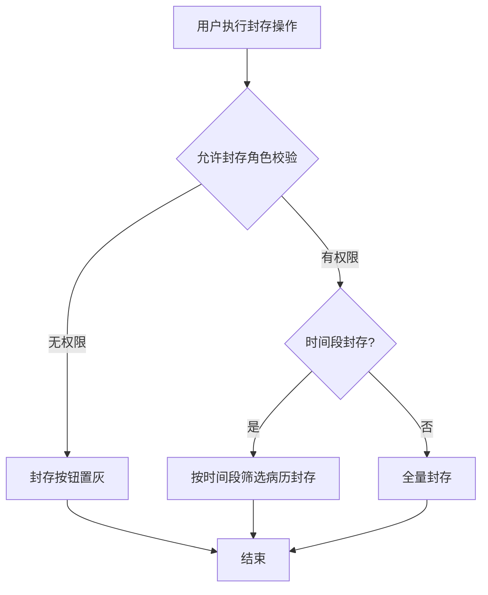
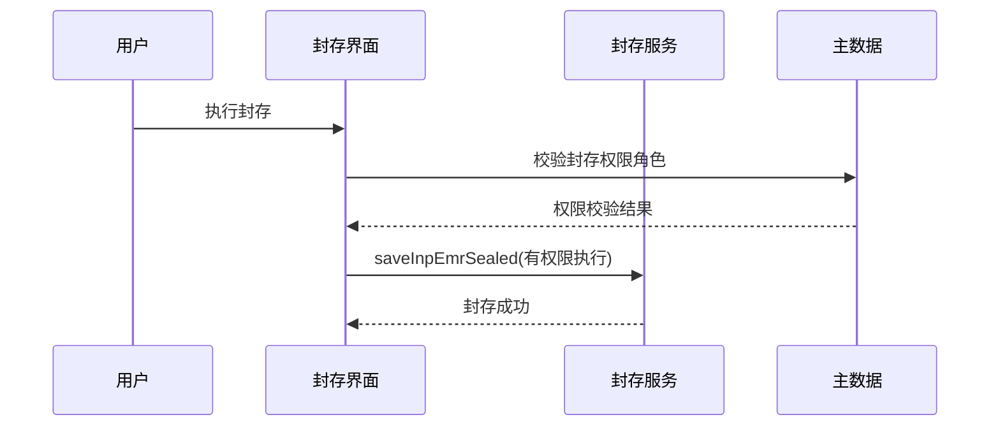

# BLGL-18-BLFC-002 封存权限与操作控制-Spec

> **功能编号**：BLGL-18-BLFC-002
> **文档类型**：功能Spec（业务背景与设计）
> **文档版本**：V1.0
> **编写时间**：2026-08-14
> **编写人**：RACC

---

## 文档索引

#### 章节索引

**Spec（研发视角）**

| 章节号 | 章节名称 |
|--------|---------|
| 1、 | 文档概述 |
| 2、 | 功能背景与定位 |
| 3、 | 业务流程设计 |
| 4、 | 数据模型设计 |
| 5、 | 接口契约设计 |
| 6、 | 技术方案设计 |
| 7、 | 测试用例预设计 |
| 8、 | 非功能性要求 |
| 9、 | 依赖与风险 |
| 10、 | 附录 |

**PM-Spec（业务视角）**

| 章节号 | 章节名称 | 内容说明 |
|--------|---------|---------|
| 一 | 目标 | 功能定位与核心价值 |
| 二 | 约束 | 业务/技术/非功能性约束 |
| 三 | 验收标准 | 验收条件与验证方法 |
| 四 | 排除范围 | 本次不做项与明确边界 |
| 五 | 关键决策记录 | 方案决策与选型理由 |
| 六 | 优先级 | 优先级定义 |
| 七 | 关联文档 | 关联文档索引 |
| 附录 | 填写检查清单 | 质量检查 |

**Analyst-Spec（产品视角）**

| 章节号 | 章节名称 | 内容说明 |
|--------|---------|---------|
| 一 | 功能编号体系 | 功能编号与层级结构 |
| 二 | 核心业务流程 | 核心业务流程与时序 |
| 三 | 功能规格说明 | 详细功能规格与验收标准 |
| 四 | 排除范围 | 排除范围 |
| 五 | 业务规则清单 | 业务规则清单 |
| 六 | 关联文档 | 关联文档索引 |
| 七 | 待确认问题清单 | 待确认问题汇总 |
| - | 填写检查清单 | 质量检查 |

#### 版本历史

| 版本 | 日期 | 变更说明 | 编写人 |
|------|------|---------|--------|
| V1.0 | 2026-08-14 | 初始版本 | RACC |

#### 关联文档索引

| 序号 | 文档名称 | 文档类型 | 版本 | 位置 |
|------|---------|---------|------|------|
| 1 | BLGL-18-BLFC-002_封存权限与操作控制-Spec.md | 功能Spec（业务背景与设计）（本文档） | V1.0 | 本目录 |
| 2 | BLGL-18-BLFC-002_封存权限与操作控制_PM-spec.md | PM-Spec（需求规格） | V0.1 | 本目录 |
| 3 | BLGL-18-BLFC-002_封存权限与操作控制_Analyst-spec.md | Analyst-Spec（分析规格） | V1.0 | 本目录 |
| 4 | BLGL-18-BLFC 18病历封存功能点Spec.md | 功能点Spec（模块级） | V1.1 | 上级目录 |

---

## 1、文档概述

### 1.1、文档目的

本文档旨在明确"封存权限与操作控制"功能（BLGL-18-BLFC-002）的业务背景与设计方案，为需求分析、研发实现、测试验收及评审提供统一的业务上下文、设计口径与决策依据。

### 1.2、文档范围

#### 1.2.1 纳入范围

本文档覆盖封存权限与操作控制的完整业务背景与设计，包括：

- 封存/解封权限控制（允许病历封存权限角色/允许病历解封权限角色）
- 按时间段选择封存
- 保密患者封存查询权限控制
- 封存病历打印权限控制（打印按钮置灰）—— 注：打印控制为支撑能力，权限校验属本功能点

#### 1.2.2 排除范围

本文档不涉及以下内容（详见其他功能点或模块）：

- 病历封存与解封操作—— BLGL-18-BLFC-001
- 无纸化三方对接—— BLGL-18-BLFC-003
- 封存病历打印按钮置灰、解锁申请 —— Phase 1 功能点Spec 第6章基础能力（BC-BLFC-005、006）

### 1.3、术语定义

| 术语 | 定义 |
|------|------|
| 封存权限 | 允许执行病历封存操作的角色 |
| 解封权限 | 允许执行病历解封操作的角色 |
| 时间段封存 | 按时间段选择部分病历进行封存 |
| 保密患者 | 已配置保密级别的患者，按员工保密级别过滤 |

> ⏳ 待确认：规范术语表待产品文档确认。

### 1.4、阅读指南

- **章节关系**：第1~2章为业务全貌，第3~10章为设计实现层。与 Analyst-Spec、PM-Spec 互相引用保持一致。
- **读者对象**：产品经理/需求分析师读第1~2章；研发读第3~6、9~10章；测试读第3、7~8章；评审人员核对各层一致性。

### 1.5、参考文档

| 序号 | 文档名称 | 版本/日期 |
|------|---------|
| 1 | 【历史需求】住院病历的历史需求.xlsx | - |
| 2 | BLGL-18-BLFC-002_封存权限与操作控制_PM-spec.md | V0.1 |
| 3 | BLGL-18-BLFC-002_封存权限与操作控制_Analyst-spec.md | V1.0 |
| 4 | BLGL-18-BLFC 18病历封存功能点Spec.md | V1.1 |

---

## 2、功能背景与定位

### 2.1 功能背景

封存权限与操作控制是病历封存的权限管控层，需满足：

- **管理要求**：封存操作需权限管控，防止无权限用户执行封存/解封
- **现状痛点**：
 - 封存操作无权限控制，任何有菜单权限的用户均可执行封存/解封
 - 封存时将患者所有已提交病历全部封存，无法按时间段筛选
 - 封存病历医生站无打印控制，病案系统已控制但医生站可打印
 - 保密患者的病历封存查询权限未控制
- **历史需求演进**：从无权限控制 → 封存/解封权限+时间段封存→ 打印权限控制（、1491653）→ 保密患者权限

### 2.2 功能定位

"封存权限与操作控制"是 WiNEX 病历管理-病历封存模块的权限管控层，定位为：

- **权限管控**：封存/解封按角色控制
- **操作灵活**：按时间段选择封存
- **安全合规**：保密患者封存查询权限控制

### 2.3 目标用户

| 用户角色 | 主要使用场景 |
|---------|-------------|
| 病案管理员 | 执行封存/解封（有权限角色） |
| 住院医生 | 查看封存状态（无权限操作） |
| 保密患者相关医生 | 查询封存病历（按保密级别过滤） |

### 2.4 核心价值

| 价值维度 | 价值描述 |
|---------|---------|
| 权限合规 | 封存/解封按角色控制 |
| 操作灵活 | 按时间段选择封存 |
| 安全控制 | 保密患者封存查询权限 |

---

## 3、业务流程设计（Given/When/Then）

### 3.1 主流程

**Scenario 1: 封存权限校验**

```gherkin
Given:
 - 参数"允许病历封存权限角色"已配置
 - 用户具有封存菜单权限

When:
 - 用户执行封存操作

Then:
 - 校验用户是否在允许封存角色中
 - 无权限时封存按钮置灰
 - 有权限时执行封存
```

### 3.2 异常流程

**Scenario 2: 业务异常——无权限操作**

```gherkin
Given:
 - 用户不在允许封存/解封角色中

When:
 - 用户尝试封存/解封

Then:
 - 封存/解封按钮置灰
 - 不能执行操作
```

**Scenario 3: 数据异常——保密患者权限**

```gherkin
Given:
 - 患者已定义保密级别
 - 员工保密级别以集合中最高为准

When:
 - 医生查询封存病历

Then:
 - 按员工保密级别过滤患者数据
 - 未达标医生查不到保密患者封存病历
```

**Scenario 4: 系统异常——打印控制**

```gherkin
Given:
 - 患者病历状态已封存
 - 参数"已封存的病历允许打印的角色"=否

When:
 - 医生点击打印/集中打印

Then:
 - 打印按钮、集中打印按钮置灰
 - 鼠标移入显示"病历已封存，不允许打印"
```

### 3.3 边界流程

**Scenario 5: 边界场景——按时间段封存**

```gherkin
Given:
 - 封存界面支持按时间段选择

When:
 - 病案管理员按时间段筛选部分病历

Then:
 - 仅封存时间段内的病历，非全量封存
```

**Scenario 6: 边界场景——打印权限参数为是**

```gherkin
Given:
 - 参数"已封存的病历允许打印的角色"=是

When:
 - 医生点击打印

Then:
 - 保持原样可打印
```

---

## 4、数据模型设计

> 数据模型信息来自代码扫描（`E:\39EMR\sr-next`）和历史需求。标注 `` 的来自 PO 实体，标注 `` 的来自需求文本。

### 4.1 核心数据结构

#### 4.1.1 核心表/实体

| 表/实体 | 关键字段 | 说明 |
|---------|---------|------|
| INP_RHB_SEALING（InpRhbSealingPO） | INP_RHB_SEALING_ID、SEALED_STATUS、SEALED_AT | 封存记录，权限操作对象 |
| 主数据参数表 | 参数编码/值 | 封存/解封权限角色参数 |

> ⏳ 待确认：完整数据表清单待代码扫描或功能清单数据表清单补充。

### 4.2 状态定义

| 状态码 | 状态名称 | 说明 |
|--------|---------|------|
| SEALED_STATUS | 已封存 | 封存状态 |
| 未封存 | 未封存 | 未封存状态 |

### 4.3 系统参数定义

| 参数编码 | 参数名称 | 说明 |
|---------|---------|------|
| 允许病历封存权限角色 | 封存角色 | 默认全部，多选，不能为空 |
| 允许病历解封权限角色 | 解封角色 | 默认全部，多选，不能为空 |
| 已封存的病历允许打印的角色 | 打印角色 | 默认无 |
| 是否启用用户查询保密患者的功能 | 保密查询开关 | 默认否 |
| COMMON037 / COMMON099 | 原有参数 | 移入病历封存tab |

---

## 5、接口契约设计

> 接口信息来自代码扫描（`E:\39EMR\sr-next`）和历史需求。标注 `` 或 ``。

### 5.1 API列表

| 序号 | API名称（代码函数） | 路径 | 方法 | 说明 |
|:----:|---------|------|:----:|------|
| 1 | queryInpRhbSealingByExample | /api/v1/app_record_inpatient/inp_rhb_sealing/query/by_example | POST | 分页查询封存记录（权限校验后） |
| 2 | saveInpEmrSealed | /api/v1/app_record_inpatient/inp_rhb_sealing/save | POST | 保存封存记录（有封存权限） |
| 3 | 查询患者保密级别 | /api/v1/person/person_info/get/by_biz_role_id | POST | 保密患者封存查询权限 |

> ⏳ 待确认：封存/解封权限校验接口待接口文档补充。

### 5.2 接口详细设计

#### 5.2.1 保存封存记录（saveInpEmrSealed，权限校验）

**请求参数**:
```json
{
 "inpRhbRecordId": 1001
 "encounterId": 2001
 "actionReason": "医疗纠纷举证"
 "roleCode": "BA_ADMIN"
}
```

**返回值（成功）**:
```json
{
 "success": true
 "data": null
}
```

**返回值（失败/无权限）**:
```json
{
 "success": false
 "message": "当前账号无病历封存权限"
 "data": null
}
```

> ⏳ 待确认：权限校验接口契约待接口文档补充。

### 5.3 错误码定义

| 错误码 | 错误信息 | 处理方式 |
|--------|---------|---------|
| ⏳ 待确认 | 当前账号无病历封存权限 | 按钮置灰或提示 |

> ⏳ 待确认：业务错误码定义未在代码扫描中提取完整。

---

## 6、技术方案设计

### 6.1 页面路径

- **页面路径**: 病历管理→病历封存；住院通用配置→病历封存tab
- **前端组件**: ClinicalnoteSealingManagement/（封存界面）
- **后端接口**: InpatientEmrSealController（tags: 病历封存）

### 6.2 技术栈

| 类别 | 技术 | 版本 |
|------|------|------|
| 前端框架 | Vue | 2.6.14 |
| 前端UI | element-ui | 2.13.0 |
| 后端框架 | Spring Boot（Java） | java.version 17 |
| 构建工具 | webpack / Maven | 前端 webpack + 后端 Maven |

### 6.3 关键技术点

- 封存/解封权限：参数控制角色，无权限按钮置灰
- 时间段封存：按时间段筛选部分病历封存
- 保密患者：员工保密级别集合取最高，过滤封存查询
- 打印控制：已封存病历按参数控制打印，按钮置灰

### 6.4 部署方案

⏳ 待确认：部署方案未在资料区中找到。

---

## 7、测试用例预设计

### 7.1 功能测试

| 用例编号 | 测试场景 | Given | When | Then |
|---------|---------|-------|--------|
| TC-001 | 封存权限校验 | 配置允许封存角色 | 无权限用户封存 | 按钮置灰不能操作 |
| TC-002 | 时间段封存 | 支持按时间段选择 | 按时间段筛选 | 仅封存时间段内病历 |

### 7.2 边界测试

| 用例编号 | 测试场景 | Given | When | Then |
|---------|---------|-------|--------|
| TC-003 | 保密患者权限 | 患者保密级别高 | 医生查询封存 | 未达标查不到 |
| TC-004 | 打印权限=是 | 参数为是 | 打印 | 保持原样可打印 |

### 7.3 异常测试

| 用例编号 | 测试场景 | Given | When | Then |
|---------|---------|-------|--------|
| TC-005 | 打印控制 | 病历已封存 | 打印按钮 | 置灰+提示"病历已封存，不允许打印" |
| TC-006 | 解封权限 | 用户无解封权限 | 尝试解封 | 按钮置灰 |

### 7.4 性能测试

| 用例编号 | 测试场景 | 指标 |
|---------|---------|
| TC-007 | 权限校验响应 |

---

## 8、非功能性要求

### 8.1 性能要求

| 指标 | 要求 |
|------|------|
| 权限校验响应 | ⏳ 待确认 |

### 8.2 安全要求

| 要求 | 说明 |
|------|------|
| 封存/解封权限 | 按参数角色控制 |
| 保密患者 | 按保密级别过滤 |

**医疗行业特殊要求**

| 要求 | 说明 |
|------|------|
| 封存安全 | 防止无权限用户封存/解封 |

### 8.3 可用性要求

| 指标 | 要求值 |
|------|--------|
| 可用性 | ⏳ 待确认 |

### 8.4 兼容性要求

| 类型 | 要求 |
|------|------|
| 打印入口兼容 | 医生主页面/日常管理/病历归档多处打印入口控制 |

---

## 9、依赖与风险

### 9.1 外部依赖

| 依赖项 | 说明 |
|--------|------|
| 主数据系统 | 权限角色参数 |

### 9.2 风险项

| 风险项 | 等级 | 说明 | 应对方案 |
|--------|------|------|---------|
| 无权限封存 | 中 | 任何菜单权限用户可封存 | 参数角色控制 |
| 打印失控 | 中 | 封存病历医生站可打印 | 打印按钮置灰 |

---

## 10、附录

### 10.1 流程图



### 10.2 时序图



### 10.3 参考文档

- 【历史需求】住院病历的历史需求.xlsx（、1041577、1491653、742231）
- BLGL-18-BLFC 18病历封存功能点Spec.md（V1.1，第5章 -002 行）
- 关联Spec: BLGL-18-BLFC-001（封存操作）、-003（无纸化对接）

---

## 填写检查清单

| 序号 | 检查项 | 是否完成 |
|:----:|--------|:--------:|
| 1 | 章节索引与正文章节一致 | ✅ |
| 2 | 版本历史记录完整 | ✅ |
| 3 | 关联文档索引已登记全部Spec | ✅ |
| 4 | 文档目的明确回答"为什么做/做成什么/怎么做" | ✅ |
| 5 | 纳入范围/排除范围清晰 | ✅ |
| 6 | 术语定义覆盖关键概念，从资料区可溯源 | ✅ |
| 7 | 参考文档已登记 | ✅ |
| 8 | 功能背景基于法规/规范/需求来源组织 | ✅ |
| 9 | 功能定位体现业务价值（3~5个定位点） | ✅ |
| 10 | 目标用户角色覆盖完整，在需求原文中有出处 | ✅ |
| 11 | 核心价值可陈述，与 Phase 1 口径一致 | ✅ |
| 12 | 业务流程：主流程≥1、异常≥3、边界≥2，Given/When/Then 具体 | ✅ |
| 13 | 数据模型：字段/表/状态/参数可溯源 | ✅ |
| 14 | 接口契约：API列表+详细设计+错误码齐全或标记待确认 | ✅ |
| 15 | 技术方案：页面路径/技术栈/关键点/部署方案或标记待确认 | ✅ |
| 16 | 测试用例：功能/边界/异常/性能覆盖 | ✅ |
| 17 | 非功能性要求：性能/安全/可用性/兼容性指标可量化或标记待确认 | ✅ |
| 18 | 依赖与风险：外部依赖登记完整 | ✅ |
| 19 | 附录：流程图/时序图与正文流程一致 | ✅ |
| 20 | 全文无占位符 `< >` 残留 | ✅ |
| 21 | 全文陈述可溯源至资料区 | ✅ |
| 22 | 人工审核确认完成 | ⏳ 待确认 |

---

**文档状态**：⬜ 待审核
**维护责任**：RACC
**下次更新**：根据评审反馈优化
