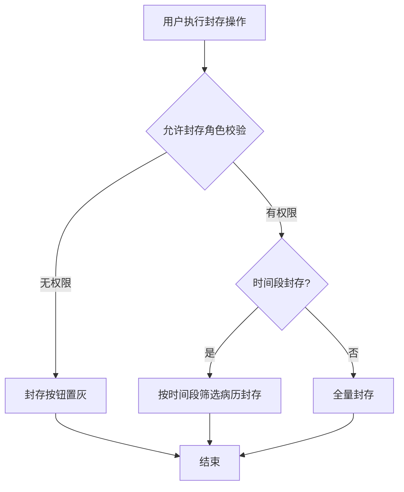
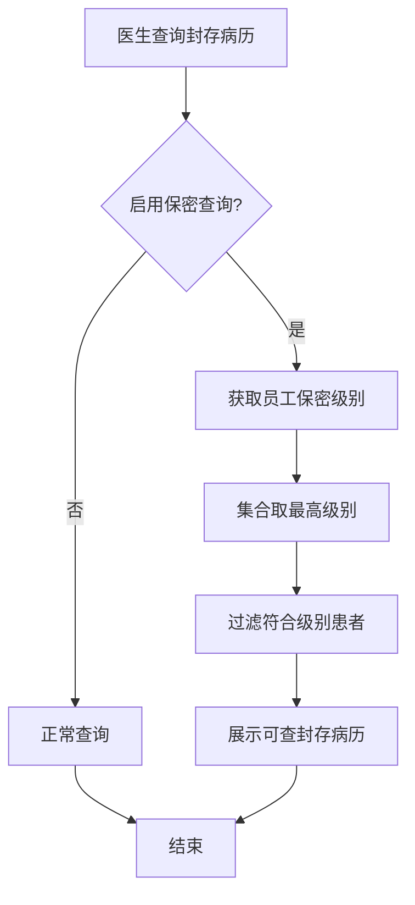

# BLGL-18-BLFC-002封存权限与操作控制_ Analyst - Spec

> **需求编号**：BLGL-18-BLFC-002
> **父需求**：BLGL-18-BLFC
> **关联PM Spec**：BLGL-18-BLFC-002_封存权限与操作控制_PM-spec.md
> **Spec版本**：V1.0
> **编写时间**：2026-08-14
> **编写人**：需求分析师

---

## 一、功能编号体系

### 1.1 功能层级结构

```
BLGL-18-BLFC-002: 封存权限与操作控制
 ├─ BLGL-18-BLFC-002-01: 封存/解封权限控制
 │ ├─ -01-01: 允许封存权限角色配置
 │ ├─ -01-02: 允许解封权限角色配置
 │ └─ -01-03: 无权限按钮置灰
 ├─ BLGL-18-BLFC-002-02: 时间段封存
 │ └─ -02-01: 按时间段筛选部分病历封存
 ├─ BLGL-18-BLFC-002-03: 保密患者封存查询
 │ └─ -03-01: 按员工保密级别过滤
 └─ BLGL-18-BLFC-002-04: 封存打印权限（支撑）
 └─ -04-01: 已封存打印角色校验
```

### 1.2 功能编号表

| REQ-ID | 功能名称 | 类型 | 优先级 | 说明 |
|--------|---------|------|--------|
| BLGL-18-BLFC-002-01 | 封存/解封权限控制 | 功能 | P0 | 权限角色控制 |
| BLGL-18-BLFC-002-01-01 | 允许封存角色 | 子功能 | P0 | 角色参数配置 |
| BLGL-18-BLFC-002-01-02 | 允许解封角色 | 子功能 | P0 | 角色参数配置 |
| BLGL-18-BLFC-002-01-03 | 无权限置灰 | 子功能 | P1 | 按钮置灰 |
| BLGL-18-BLFC-002-02 | 时间段封存 | 功能 | P1 | 按时间段筛选 |
| BLGL-18-BLFC-002-02-01 | 时间段筛选封存 | 子功能 | P1 | 部分病历封存 |
| BLGL-18-BLFC-002-03 | 保密患者封存查询 | 功能 | P1 | 保密级别过滤 |
| BLGL-18-BLFC-002-03-01 | 保密级别过滤 | 子功能 | P1 | 集合取最高 |
| BLGL-18-BLFC-002-04 | 封存打印权限 | 功能 | P1 | 打印角色校验 |
| BLGL-18-BLFC-002-04-01 | 打印角色校验 | 子功能 | P1 | 无权限置灰 |

---

## 二、核心业务流程

### 2.1 封存权限校验流程



### 2.2 保密患者封存查询流程



---

## 三、功能规格说明

---

### BLGL-18-BLFC-002-01: 封存/解封权限控制

#### 3.1.1 功能概述

配置允许病历封存权限角色和允许病历解封权限角色，无权限用户封存/解封按钮置灰。

#### 3.1.2 用户角色

| 角色 | 使用场景 | 权限要求 | 操作频率 |
|------|---------|---------|---------|
| 病案管理员 | 执行封存/解封 | 允许封存/解封角色 | 低频 |
| 无权限用户 | 查看封存界面 | 菜单权限 | 中频 |

#### 3.1.3 业务流程（Given/When/Then）

##### 主流程

**Scenario 1: 封存权限校验**

```gherkin
Given:
 - 参数"允许病历封存权限角色"已配置
 - 用户具有封存菜单权限

When:
 - 用户执行封存操作

Then:
 - 校验用户是否在允许封存角色中
 - 无权限时封存按钮置灰
 - 有权限时执行封存
```

##### 异常流程

**Scenario 2: 业务异常——无权限操作**

```gherkin
Given:
 - 用户不在允许封存/解封角色中

When:
 - 用户尝试封存/解封

Then:
 - 封存/解封按钮置灰
 - 不能执行操作
```

##### 边界流程

**Scenario 3: 边界场景——权限参数配置**

```gherkin
Given:
 - 住院通用配置新增病历封存tab

When:
 - 配置允许封存/解封权限角色

Then:
 - 默认全部，支持多选，不能为空
 - 分别控制封存/解封权限
```

#### 3.1.4 数据字段定义

| 字段名 | 类型 | 必填 | 默认值 | 取值范围 | 说明 | 概念ID |
|--------|------|------|--------|---------|------|--------|
| 允许病历封存权限角色 | List | 是 | 全部 | 角色多选 | 封存权限 | ⏳ 待确认 |
| 允许病历解封权限角色 | List | 是 | 全部 | 角色多选 | 解封权限 | ⏳ 待确认 |

#### 3.1.5 验收标准

| AC编号 | 验收标准 | 对应REQ-ID | 验证方法 | 验证场景 |
|--------|---------|-----------|--------|
| AC-001 | 无封存权限角色用户封存按钮置灰 | -002-01 | 功能测试 | Scenario 2 |
| AC-002 | 权限参数默认全部，多选不能为空 | -002-01 | 功能测试 | Scenario 3 |

---

### BLGL-18-BLFC-002-02: 时间段封存

#### 3.2.1 功能概述

封存界面支持按时间段选择封存部分病历，而非全量封存。

#### 3.2.2 用户角色

| 角色 | 使用场景 | 权限要求 | 操作频率 |
|------|---------|---------|---------|
| 病案管理员 | 按时间段封存 | 封存权限 | 低频 |

#### 3.2.3 业务流程（Given/When/Then）

##### 主流程

**Scenario 1: 按时间段封存**

```gherkin
Given:
 - 病案管理员有封存权限

When:
 - 病案管理员在封存界面按时间段筛选病历

Then:
 - 仅封存时间段内的病历
 - 非全量封存
```

##### 边界流程

**Scenario 2: 边界场景——时间段为空**

```gherkin
Given:
 - 未选择时间段

When:
 - 执行封存

Then:
 - ⏳ 待确认：未选时间段时默认全量封存
```

#### 3.2.4 数据字段定义

| 字段名 | 类型 | 必填 | 默认值 | 取值范围 | 说明 | 概念ID |
|--------|------|------|--------|---------|------|--------|
| 时间段开始 | Date | 否 | - | - | 封存时间段 | ⏳ 待确认 |
| 时间段结束 | Date | 否 | - | - | 封存时间段 | ⏳ 待确认 |

#### 3.2.5 验收标准

| AC编号 | 验收标准 | 对应REQ-ID | 验证方法 | 验证场景 |
|--------|---------|-----------|--------|
| AC-003 | 按时间段筛选封存部分病历 | -002-02 | 功能测试 | Scenario 1 |

---

### BLGL-18-BLFC-002-03: 保密患者封存查询

#### 3.3.1 功能概述

保密患者按员工保密级别过滤封存查询，员工以集合中最高级别为准。

#### 3.3.2 用户角色

| 角色 | 使用场景 | 权限要求 | 操作频率 |
|------|---------|---------|---------|
| 住院医生 | 查询封存病历 | 保密级别达标 | 中频 |

#### 3.3.3 业务流程（Given/When/Then）

##### 主流程

**Scenario 1: 保密患者封存查询**

```gherkin
Given:
 - 患者已定义保密级别
 - 参数"是否启用用户查询保密患者的功能"=是

When:
 - 医生查询封存病历

Then:
 - 按员工保密级别过滤患者数据
 - 员工以集合中最高保密级别为准（如员工最高4级，可查看0~4级患者）
```

##### 异常流程

**Scenario 2: 数据异常——保密配置缺失**

```gherkin
Given:
 - 保密查询参数未启用

When:
 - 医生查询封存病历

Then:
 - 不进行保密过滤，正常查询
```

#### 3.3.4 数据字段定义

| 字段名 | 类型 | 必填 | 默认值 | 取值范围 | 说明 | 概念ID |
|--------|------|------|--------|---------|------|--------|
| 保密级别 | Int | 否 | - | 0~4 | 患者保密级别 | ⏳ 待确认 |
| 员工保密级别 | Int | 否 | - | 0~4 | 员工保密级别 | ⏳ 待确认 |

#### 3.3.5 验收标准

| AC编号 | 验收标准 | 对应REQ-ID | 验证方法 | 验证场景 |
|--------|---------|-----------|--------|
| AC-004 | 保密患者按员工保密级别过滤封存查询 | -002-03 | 安全测试 | Scenario 1 |

---

### BLGL-18-BLFC-002-04: 封存打印权限（支撑）

#### 3.4.1 功能概述

已封存病历按参数"已封存的病历允许打印的角色"控制打印权限，无权限时打印按钮置灰。打印按钮置灰实现细节归基础能力 BC-BLFC-006，本子功能点处理权限校验。

#### 3.4.2 用户角色

| 角色 | 使用场景 | 权限要求 | 操作频率 |
|------|---------|---------|---------|
| 住院医生 | 打印封存病历 | 打印角色 | 中频 |

#### 3.4.3 业务流程（Given/When/Then）

##### 主流程

**Scenario 1: 封存打印权限校验**

```gherkin
Given:
 - 患者病历状态已封存
 - 参数"已封存的病历允许打印的角色"配置

When:
 - 医生点击打印

Then:
 - 校验医生是否在允许打印角色中
 - 无权限时打印按钮置灰，提示"病历已封存，不允许打印"
 - 有权限时正常打印
```

##### 边界流程

**Scenario 2: 边界场景——参数为是**

```gherkin
Given:
 - 参数"已封存的病历允许打印的角色"=是

When:
 - 医生点击打印

Then:
 - 保持原样可打印
```

#### 3.4.4 数据字段定义

| 字段名 | 类型 | 必填 | 默认值 | 取值范围 | 说明 | 概念ID |
|--------|------|------|--------|---------|------|--------|
| 已封存允许打印角色 | List | 否 | 无 | 角色多选 | 封存打印权限 | ⏳ 待确认 |

#### 3.4.5 验收标准

| AC编号 | 验收标准 | 对应REQ-ID | 验证方法 | 验证场景 |
|--------|---------|-----------|--------|
| AC-005 | 无打印角色医生打印按钮置灰，提示"病历已封存，不允许打印" | -002-04 | 功能测试 | Scenario 1 |

---

## 四、排除范围

本需求不包含以下功能项：

1. **病历封存与解封操作** - 属 BLGL-18-BLFC-001
2. **无纸化三方对接** - 属 BLGL-18-BLFC-003
3. **封存病历打印按钮置灰实现、解锁申请** - 属基础能力 BC-BLFC-005/006

> 与 PM-Spec 第四章一致。对照 Phase 1 功能点Spec 第6章（基线能力），确保不越界。

---

## 五、业务规则清单

| 规则ID | 规则名称 | 规则描述 | 优先级 |
|--------|---------|---------|--------|
| BR-001 | 封存权限 | 允许病历封存权限角色控制，默认全部，多选不能为空 | P0 |
| BR-002 | 解封权限 | 允许病历解封权限角色控制 | P0 |
| BR-003 | 无权限置灰 | 无权限用户封存/解封按钮置灰 | P1 |
| BR-004 | 时间段封存 | 支持按时间段选择封存部分病历 | P1 |
| BR-005 | 保密过滤 | 保密患者按员工保密级别过滤，集合取最高 | P1 |
| BR-006 | 打印权限 | 已封存病历按允许打印角色控制 | P1 |

---

## 六、关联文档

| 文档类型 | 文档路径 | 说明 |
|---------|---------|
| 功能点Spec | BLGL-18-BLFC 18病历封存功能点Spec.md（V1.1，上级目录） | Phase 1 功能点索引 |
| PM spec | 本目录 BLGL-18-BLFC-002_封存权限与操作控制_PM-spec.md（V0.1） | PM 产出的 Spec 文档 |
| -Spec | 本目录 BLGL-18-BLFC-002_封存权限与操作控制-Spec.md（V1.0） | 业务背景与目标 Spec |
| data-model.md | 待产出 | 架构师产出的数据建模文档 |
| design.md | 待产出 | 架构师产出的技术方案文档 |
| api-contract.md | 待产出 | 开发经理产出的 API 契约文档 |

---

## 七、待确认问题清单

| 编号 | 问题描述 | 缺失信息 | 影响范围 | 建议补充方 |
|------|---------|---------|--------|
| Q-001 | 未选时间段默认封存范围 | 时间段为空时全量封存 | 3.2.3 Scenario 2 | 产品经理 |
| Q-002 | 权限校验接口契约 | 封存/解封权限校验接口 | 第5章接口设计 | 开发经理 |
| Q-003 | 概念ID、性能指标 | 字段概念ID、权限SLA | 数据模型、非功能 | 架构师/产品经理 |

---

## 填写检查清单

| 序号 | 检查项 | 是否完成 |
|:----:|--------|:--------:|
| 1 | 功能编号带父子层级 | ✅ |
| 2 | 每个 REQ-ID 有功能概述和用户角色 | ✅ |
| 3 | 主流程至少 1 个 Given/When/Then 场景 | ✅ |
| 4 | 异常流程至少 3 个 Given/When/Then 场景 | ✅ |
| 5 | 边界流程至少 2 个 Given/When/Then 场景 | ✅ |
| 6 | 每个 Given/When/Then 内容具体，不模糊 | ✅ |
| 7 | 数据字段定义完整 | ✅ |
| 8 | 验收标准 AC 编号独立，可验证 | ✅ |
| 9 | 验收标准无"功能正常"等模糊表述 | ✅ |
| 10 | 排除范围明确列出 | ✅ |
| 11 | 业务规则清单列出所有规则，每条标注来源 | ✅ |
| 12 | 流程图使用 Mermaid 格式（≥2 个） | ✅ |
| 13 | 关联文档索引包含 Phase 1 功能点Spec | ✅ |
| 14 | 待确认问题清单汇总了全文所有 ⏳ 项 | ✅ |
| 15 | 全文无占位符 `< >` 残留 | ✅ |
| 16 | 全文陈述可溯源至资料区（S1~S10 溯源核查） | ✅ |
| 17 | 人工审核确认完成 | ⏳ 待确认 |

---

**文档状态**：⬜ 待审核
**维护责任**：需求分析师规范组
**下次更新**：根据评审反馈优化

---

## 版本历史

| 版本 | 日期 | 变更说明 | 编写人 |
|------|------|---------|--------|
| V1.0 | 2026-08-14 | 初始版本 | 需求分析师 |
