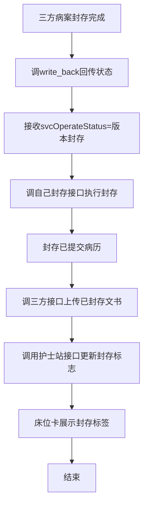
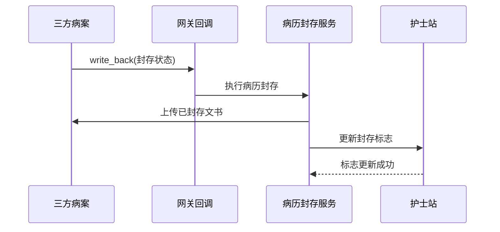

# BLGL-18-BLFC-003 无纸化三方对接-Spec

> **功能编号**：BLGL-18-BLFC-003
> **文档类型**：功能Spec（业务背景与设计）
> **文档版本**：V1.0
> **编写时间**：2026-08-14
> **编写人**：RACC

---

## 文档索引

#### 章节索引

**Spec（研发视角）**

| 章节号 | 章节名称 |
|--------|---------|
| 1、 | 文档概述 |
| 2、 | 功能背景与定位 |
| 3、 | 业务流程设计 |
| 4、 | 数据模型设计 |
| 5、 | 接口契约设计 |
| 6、 | 技术方案设计 |
| 7、 | 测试用例预设计 |
| 8、 | 非功能性要求 |
| 9、 | 依赖与风险 |
| 10、 | 附录 |

**PM-Spec（业务视角）**

| 章节号 | 章节名称 | 内容说明 |
|--------|---------|---------|
| 一 | 目标 | 功能定位与核心价值 |
| 二 | 约束 | 业务/技术/非功能性约束 |
| 三 | 验收标准 | 验收条件与验证方法 |
| 四 | 排除范围 | 本次不做项与明确边界 |
| 五 | 关键决策记录 | 方案决策与选型理由 |
| 六 | 优先级 | 优先级定义 |
| 七 | 关联文档 | 关联文档索引 |
| 附录 | 填写检查清单 | 质量检查 |

**Analyst-Spec（产品视角）**

| 章节号 | 章节名称 | 内容说明 |
|--------|---------|---------|
| 一 | 功能编号体系 | 功能编号与层级结构 |
| 二 | 核心业务流程 | 核心业务流程与时序 |
| 三 | 功能规格说明 | 详细功能规格与验收标准 |
| 四 | 排除范围 | 排除范围 |
| 五 | 业务规则清单 | 业务规则清单 |
| 六 | 关联文档 | 关联文档索引 |
| 七 | 待确认问题清单 | 待确认问题汇总 |
| - | 填写检查清单 | 质量检查 |

#### 版本历史

| 版本 | 日期 | 变更说明 | 编写人 |
|------|------|---------|--------|
| V1.0 | 2026-08-14 | 初始版本 | RACC |

#### 关联文档索引

| 序号 | 文档名称 | 文档类型 | 版本 | 位置 |
|------|---------|---------|------|------|
| 1 | BLGL-18-BLFC-003_无纸化三方对接-Spec.md | 功能Spec（业务背景与设计）（本文档） | V1.0 | 本目录 |
| 2 | BLGL-18-BLFC-003_无纸化三方对接_PM-spec.md | PM-Spec（需求规格） | V0.1 | 本目录 |
| 3 | BLGL-18-BLFC-003_无纸化三方对接_Analyst-spec.md | Analyst-Spec（分析规格） | V1.0 | 本目录 |
| 4 | BLGL-18-BLFC 18病历封存功能点Spec.md | 功能点Spec（模块级） | V1.1 | 上级目录 |

---

## 1、文档概述

### 1.1、文档目的

本文档旨在明确"无纸化三方对接"功能（BLGL-18-BLFC-003）的业务背景与设计方案，为需求分析、研发实现、测试验收及评审提供统一的业务上下文、设计口径与决策依据。

### 1.2、文档范围

#### 1.2.1 纳入范围

本文档覆盖无纸化三方对接的完整业务背景与设计，包括：

- 对接可信/兰软无纸化病案系统（病历封存/归档）
- 三方封存状态回传执行病历封存（网关回调）
- 病历封存调用护士站接口更新封存标志
- 无纸化PDF生成/上传对接
- 三方对接参数（归档方式/科室范围/对接模式）

#### 1.2.2 排除范围

本文档不涉及以下内容（详见其他功能点或模块）：

- 病历封存与解封操作—— BLGL-18-BLFC-001
- 封存权限与操作控制—— BLGL-18-BLFC-002
- 无纸化PDF生成/上传、封存状态展示 —— Phase 1 功能点Spec 第6章基础能力（BC-BLFC-007）

### 1.3、术语定义

| 术语 | 定义 |
|------|------|
| 无纸化对接 | 对接可信/兰软病案无纸化系统 |
| 三方封存回传 | 三方病案封存后调接口回传封存状态 |
| 封存标志 | 病历封存调用护士站接口更新的标志，床位卡展示 |
| 归档方式参数 | 住院病历归档方式：三方病案 |

> ⏳ 待确认：规范术语表待产品文档确认。

### 1.4、阅读指南

- **章节关系**：第1~2章为业务全貌，第3~10章为设计实现层。与 Analyst-Spec、PM-Spec 互相引用保持一致。
- **读者对象**：产品经理/需求分析师读第1~2章；研发读第3~6、9~10章；测试读第3、7~8章；评审人员核对各层一致性。

### 1.5、参考文档

| 序号 | 文档名称 | 版本/日期 |
|------|---------|
| 1 | 【历史需求】住院病历的历史需求.xlsx | - |
| 2 | BLGL-18-BLFC-003_无纸化三方对接_PM-spec.md | V0.1 |
| 3 | BLGL-18-BLFC-003_无纸化三方对接_Analyst-spec.md | V1.0 |
| 4 | BLGL-18-BLFC 18病历封存功能点Spec.md | V1.1 |

---

## 2、功能背景与定位

### 2.1 功能背景

无纸化三方对接是病历封存与病案系统协作的通道，需满足：

- **管理要求**：对接三方病案无纸化系统，病历封存/归档状态同步
- **现状痛点**：
 - 三方点击封存后住院病历无变化，状态不同步
 - 封存时未调用护士站接口同步封存标志
- **历史需求演进**：从无纸化PDF生成对接→ 对接可信/兰软系统（、762804、806227）→ 三方封存回传→ 护士站封存标志→ 科室范围配置

### 2.2 功能定位

"无纸化三方对接"是 WiNEX 病历管理-病历封存模块的三方协作通道，定位为：

- **三方封存同步**：接收三方封存状态回传执行病历封存
- **护士站标志**：封存后更新护士站封存标志
- **无纸化协作**：PDF生成/上传对接病案系统

### 2.3 目标用户

| 用户角色 | 主要使用场景 |
|---------|-------------|
| 病案系统（三方） | 发起封存、接收病历文书 |
| 护士站 | 展示封存标签 |
| 病案管理员 | 配置归档方式/科室范围 |

### 2.4 核心价值

| 价值维度 | 价值描述 |
|---------|---------|
| 状态同步 | 三方封存状态与住院病历一致 |
| 信息联动 | 护士站封存标签展示 |
| 无纸化协作 | PDF生成/上传对接 |

---

## 3、业务流程设计（Given/When/Then）

### 3.1 主流程

**Scenario 1: 三方封存状态回传**

```gherkin
Given:
 - 三方病案封存操作完成
 - 网关回调接口已配置

When:
 - 三方调接口回传封存状态（svcOperateStatus=版本封存）

Then:
 - 病历系统接收状态
 - 调自己封存接口执行病历封存（封存已提交病历）
 - 调三方接口上传已封存病历文书
```

### 3.2 异常流程

**Scenario 2: 业务异常——三方封存无变化**

```gherkin
Given:
 - 三方点击封存

When:
 - 三方通知住院病历

Then:
 - 住院病历无变化（原问题）
 - 应同步三方封存状态
 - ⏳ 待确认：三方封存同步住院病历机制
```

**Scenario 3: 数据异常——护士站标志未更新**

```gherkin
Given:
 - 病历封存/解封操作完成

When:
 - 封存后查看住院床位卡

Then:
 - 床位卡未展示封存标签（原问题）
 - 应调用护士站接口更新封存标志，解封后标签消失
```

**Scenario 4: 系统异常——PDF上传失败**

```gherkin
Given:
 - 病历文书提交/编辑后再提交

When:
 - 生成PDF并通知病案系统

Then:
 - 生成PDF到指定服务器
 - 发送MQ消息通知无纸化病案系统
 - ⏳ 待确认：PDF生成失败的处理
```

### 3.3 边界流程

**Scenario 5: 边界场景——按科室配置归档调用**

```gherkin
Given:
 - 参数 MEDICAL032 控制的科室范围已配置

When:
 - 病历归档（自动/手动）

Then:
 - 选中的科室归档时调三方地址上传病历文书
 - 未选中的科室归档时不调三方地址
```

**Scenario 6: 边界场景——归档方式参数**

```gherkin
Given:
 - 参数"住院病历归档方式"=三方病案

When:
 - 病历归档/封存

Then:
 - 未归档病历在住院医生站完成封存，推送PDF URL给三方
 - 已归档病历在三方系统完成封存
```

---

## 4、数据模型设计

> 数据模型信息来自代码扫描（`E:\39EMR\sr-next`）和历史需求。标注 `` 的来自 PO 实体，标注 `` 的来自需求文本。

### 4.1 核心数据结构

#### 4.1.1 核心表/实体

| 表/实体 | 关键字段 | 说明 |
|---------|---------|------|
| INP_RHB_SEALING（InpRhbSealingPO） | SEALED_STATUS、SERVICE_CHANNEL_CODE | 封存记录，三方封存回传结果 |
| 住院就诊表 | 病历封存标志字段 | 护士站封存标志预留字段 |
| INP_EMR_SEALED | 封存明细 | 封存明细 |

> ⏳ 待确认：完整数据表清单待代码扫描或功能清单数据表清单补充。

### 4.2 状态定义

| 状态码 | 状态名称 | 说明 |
|--------|---------|------|
| SEALED_STATUS | 已封存 | 三方回传后封存状态 |
| 封存标志 | 封存/解封 | 护士站封存标志 |

### 4.3 系统参数定义

| 参数编码 | 参数名称 | 说明 |
|---------|---------|------|
| MEDICAL032 | 三方归档接口地址 | 配置的三方接口 |
| MEDICAL032 控制的科室范围 | 归档调用科室范围 | 默认科室全选，多选 |
| 住院病历归档方式 | 三方病案/院内 | 三方病案时对接 |
| 病案归档是否开启与60病案系统对接模式 | 60对接模式 | 控制三方对接 |

---

## 5、接口契约设计

> 接口信息来自代码扫描（`E:\39EMR\sr-next`）和历史需求。标注 `` 或 ``。

### 5.1 API列表

| 序号 | API名称（代码函数） | 路径 | 方法 | 说明 |
|:----:|---------|------|:----:|------|
| 1 | 三方封存状态回传 | /api/v1/biz_gateway/inpatient_emr/tripartite_recall_review/write_back | POST | 接收三方封存状态（svcOperateStatus=版本封存） |
| 2 | saveInpEmrSealed | /api/v1/app_record_inpatient/inp_rhb_sealing/save | POST | 调自己封存接口执行封存 |
| 3 | 三方上传病历文书 | MEDICAL032 配置接口 | POST | 上传已封存病历文书给三方 |
| 4 | 护士站封存标志更新 | 护士站接口 | POST | 更新病历封存标志 |

> ⏳ 待确认：三方接口契约待接口文档补充。

### 5.2 接口详细设计

#### 5.2.1 三方封存状态回传（write_back）

**请求参数**:
```json
{
 "svcOperateStatus": "版本封存"
 "inpRhbRecordId": 1001
 "encounterId": 2001
}
```

**返回值（成功）**:
```json
{
 "success": true
 "data": null
}
```

**返回值（失败）**:
```json
{
 "success": false
 "message": "处理失败"
 "data": null
}
```

> ⏳ 待确认：三方回传字段名/结构待接口文档确认。

### 5.3 错误码定义

| 错误码 | 错误信息 | 处理方式 |
|--------|---------|---------|
| ⏳ 待确认 | 三方封存处理失败 | 记录日志并重试 |

> ⏳ 待确认：错误码定义未在代码扫描中提取完整。

---

## 6、技术方案设计

### 6.1 页面路径

- **页面路径**: 病历管理→病历封存；住院通用配置→参数配置
- **后端接口**: InpatientEmrSealController + 三方网关回调
- **桥接服务**: InpatientEmrSealRpcService、InpEmrPaperlessService

### 6.2 技术栈

| 类别 | 技术 | 版本 |
|------|------|------|
| 前端框架 | Vue | 2.6.14 |
| 前端UI | element-ui | 2.13.0 |
| 后端框架 | Spring Boot（Java） | java.version 17 |
| 构建工具 | webpack / Maven | 前端 webpack + 后端 Maven |

### 6.3 关键技术点

- 三方封存回传：write_back 接口接收 svcOperateStatus，执行封存+上传
- 护士站标志：封存/解封后调用护士站接口更新标志
- 无纸化PDF：文书提交/再提交生成PDF+MQupload事件（399331112）
- 归档方式：三方病案参数控制对接
- 科室范围：MEDICAL032控制科室范围配置归档调用

### 6.4 部署方案

⏳ 待确认：部署方案未在资料区中找到。

---

## 7、测试用例预设计

### 7.1 功能测试

| 用例编号 | 测试场景 | Given | When | Then |
|---------|---------|-------|--------|
| TC-001 | 三方封存回传 | 三方封存完成 | 回传状态 | 执行病历封存+上传 |
| TC-002 | 护士站标志更新 | 病历封存/解封 | 调用护士站接口 | 床位卡封存标签展示/消失 |

### 7.2 边界测试

| 用例编号 | 测试场景 | Given | When | Then |
|---------|---------|-------|--------|
| TC-003 | 科室范围配置 | MEDICAL032控制科室 | 归档 | 选中科室调三方，未选不调 |
| TC-004 | 归档方式参数 | 归档方式=三方病案 | 归档/封存 | 按三方对接流程 |

### 7.3 异常测试

| 用例编号 | 测试场景 | Given | When | Then |
|---------|---------|-------|--------|
| TC-005 | 三方封存无变化 | 三方点击封存 | 同步 | ⏳ 待确认：同步机制 |
| TC-006 | PDF上传失败 | 文书提交 | 生成PDF | ⏳ 待确认：失败处理 |

### 7.4 性能测试

| 用例编号 | 测试场景 | 指标 |
|---------|---------|
| TC-007 | 三方对接响应 |

---

## 8、非功能性要求

### 8.1 性能要求

| 指标 | 要求 |
|------|------|
| 三方对接响应 | ⏳ 待确认 |

### 8.2 安全要求

| 要求 | 说明 |
|------|------|
| 三方对接权限 | 按归档方式参数控制 |

**医疗行业特殊要求**

| 要求 | 说明 |
|------|------|
| 状态一致性 | 三方封存状态与住院病历一致 |

### 8.3 可用性要求

| 指标 | 要求值 |
|------|--------|
| 可用性 | ⏳ 待确认 |

### 8.4 兼容性要求

| 类型 | 要求 |
|------|------|
| 三方系统兼容 | 支持可信/兰软病案系统 |

---

## 9、依赖与风险

### 9.1 外部依赖

| 依赖项 | 说明 |
|--------|------|
| 可信/兰软病案系统 | 无纸化对接 |
| 护士站系统 | 封存标志 |
| 网关回调 | 三方封存状态 |

### 9.2 风险项

| 风险项 | 等级 | 说明 | 应对方案 |
|--------|------|------|---------|
| 三方封存无同步 | 高 | 三方封存住院病历无变化 | 回传同步机制 |
| 护士站标志缺失 | 中 | 封存后床位卡无标签 | 调用护士站接口 |

---

## 10、附录

### 10.1 流程图



### 10.2 时序图



### 10.3 参考文档

- 【历史需求】住院病历的历史需求.xlsx（、1683703、162957、806227、863305、762804、902794、1611858、936683）
- BLGL-18-BLFC 18病历封存功能点Spec.md（V1.1，第5章 -003 行）
- 关联Spec: BLGL-18-BLFC-001（封存操作）、-002（权限控制）

---

## 填写检查清单

| 序号 | 检查项 | 是否完成 |
|:----:|--------|:--------:|
| 1 | 章节索引与正文章节一致 | ✅ |
| 2 | 版本历史记录完整 | ✅ |
| 3 | 关联文档索引已登记全部Spec | ✅ |
| 4 | 文档目的明确回答"为什么做/做成什么/怎么做" | ✅ |
| 5 | 纳入范围/排除范围清晰 | ✅ |
| 6 | 术语定义覆盖关键概念，从资料区可溯源 | ✅ |
| 7 | 参考文档已登记 | ✅ |
| 8 | 功能背景基于法规/规范/需求来源组织 | ✅ |
| 9 | 功能定位体现业务价值（3~5个定位点） | ✅ |
| 10 | 目标用户角色覆盖完整，在需求原文中有出处 | ✅ |
| 11 | 核心价值可陈述，与 Phase 1 口径一致 | ✅ |
| 12 | 业务流程：主流程≥1、异常≥3、边界≥2，Given/When/Then 具体 | ✅ |
| 13 | 数据模型：字段/表/状态/参数可溯源 | ✅ |
| 14 | 接口契约：API列表+详细设计+错误码齐全或标记待确认 | ✅ |
| 15 | 技术方案：页面路径/技术栈/关键点/部署方案或标记待确认 | ✅ |
| 16 | 测试用例：功能/边界/异常/性能覆盖 | ✅ |
| 17 | 非功能性要求：性能/安全/可用性/兼容性指标可量化或标记待确认 | ✅ |
| 18 | 依赖与风险：外部依赖登记完整 | ✅ |
| 19 | 附录：流程图/时序图与正文流程一致 | ✅ |
| 20 | 全文无占位符 `< >` 残留 | ✅ |
| 21 | 全文陈述可溯源至资料区 | ✅ |
| 22 | 人工审核确认完成 | ⏳ 待确认 |

---

**文档状态**：⬜ 待审核
**维护责任**：RACC
**下次更新**：根据评审反馈优化
