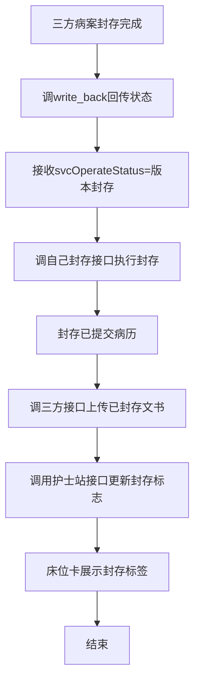
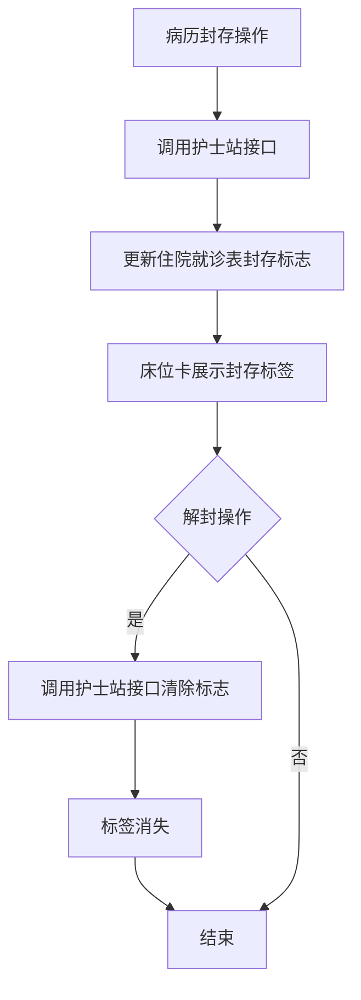

# BLGL-18-BLFC-003无纸化三方对接_ Analyst - Spec

> **需求编号**：BLGL-18-BLFC-003
> **父需求**：BLGL-18-BLFC
> **关联PM Spec**：BLGL-18-BLFC-003_无纸化三方对接_PM-spec.md
> **Spec版本**：V1.0
> **编写时间**：2026-08-14
> **编写人**：需求分析师

---

## 一、功能编号体系

### 1.1 功能层级结构

```
BLGL-18-BLFC-003: 无纸化三方对接
 ├─ BLGL-18-BLFC-003-01: 三方封存状态同步
 │ ├─ -01-01: 三方封存回传（write_back）
 │ ├─ -01-02: 执行病历封存
 │ └─ -01-03: 上传已封存文书
 ├─ BLGL-18-BLFC-003-02: 护士站封存标志
 │ └─ -02-01: 封存/解封更新封存标志
 ├─ BLGL-18-BLFC-003-03: 无纸化PDF对接
 │ └─ -03-01: PDF生成/上传病案系统
 └─ BLGL-18-BLFC-003-04: 三方对接参数
 ├─ -04-01: 归档方式参数
 └─ -04-02: MEDICAL032科室范围
```

### 1.2 功能编号表

| REQ-ID | 功能名称 | 类型 | 优先级 | 说明 |
|--------|---------|------|--------|
| BLGL-18-BLFC-003-01 | 三方封存状态同步 | 功能 | P0 | 回传+执行封存+上传 |
| BLGL-18-BLFC-003-01-01 | 三方封存回传 | 子功能 | P0 | write_back接口 |
| BLGL-18-BLFC-003-01-02 | 执行病历封存 | 子功能 | P0 | 封存已提交病历 |
| BLGL-18-BLFC-003-01-03 | 上传已封存文书 | 子功能 | P1 | 调三方接口 |
| BLGL-18-BLFC-003-02 | 护士站封存标志 | 功能 | P1 | 更新标志 |
| BLGL-18-BLFC-003-02-01 | 封存标志更新 | 子功能 | P1 | 床位卡标签 |
| BLGL-18-BLFC-003-03 | 无纸化PDF对接 | 功能 | P1 | PDF生成上传 |
| BLGL-18-BLFC-003-03-01 | PDF生成上传 | 子功能 | P1 | MQ通知 |
| BLGL-18-BLFC-003-04 | 三方对接参数 | 功能 | P1 | 参数配置 |
| BLGL-18-BLFC-003-04-01 | 归档方式参数 | 子功能 | P1 | 三方病案 |
| BLGL-18-BLFC-003-04-02 | MEDICAL032科室范围 | 子功能 | P1 | 科室多选 |

---

## 二、核心业务流程

### 2.1 三方封存同步流程



### 2.2 护士站封存标志流程



---

## 三、功能规格说明

---

### BLGL-18-BLFC-003-01: 三方封存状态同步

#### 3.1.1 功能概述

三方病案封存操作后调接口回传封存状态，病历系统执行病历封存并上传已封存文书。

#### 3.1.2 用户角色

| 角色 | 使用场景 | 权限要求 | 操作频率 |
|------|---------|---------|---------|
| 三方病案系统 | 发起封存回传 | 三方接口权限 | 低频 |
| 病历封存服务 | 执行封存+上传 | 系统权限 | 低频 |

#### 3.1.3 业务流程（Given/When/Then）

##### 主流程

**Scenario 1: 三方封存状态回传**

```gherkin
Given:
 - 三方病案封存操作完成
 - 网关回调接口已配置

When:
 - 三方调接口回传封存状态（svcOperateStatus=版本封存）

Then:
 - 病历系统接收状态
 - 调自己封存接口执行病历封存（封存已提交病历）
 - 调三方接口上传已封存病历文书
```

##### 异常流程

**Scenario 2: 业务异常——三方封存无变化**

```gherkin
Given:
 - 三方点击封存

When:
 - 三方通知住院病历

Then:
 - 住院病历无变化（原问题）
 - 应同步三方封存状态
 - ⏳ 待确认：三方封存同步住院病历机制
```

##### 边界流程

**Scenario 3: 边界场景——解封状态同步**

```gherkin
Given:
 - 三方发起解封

When:
 - 三方回传解封状态

Then:
 - 病历系统同步解封状态
```

#### 3.1.4 数据字段定义

| 字段名 | 类型 | 必填 | 默认值 | 取值范围 | 说明 | 概念ID |
|--------|------|------|--------|---------|------|--------|
| svcOperateStatus | String | 是 | - | 版本封存 | 三方封存状态 | ⏳ 待确认 |
| encounterId | Long | 是 | - | - | 就诊标识 | ⏳ 待确认 |

#### 3.1.5 验收标准

| AC编号 | 验收标准 | 对应REQ-ID | 验证方法 | 验证场景 |
|--------|---------|-----------|--------|
| AC-001 | 三方封存状态回传后执行病历封存并上传已封存文书 | -003-01 | 集成测试 | Scenario 1 |
| AC-002 | 三方解封状态同步 | -003-01 | 集成测试 | Scenario 3 |

---

### BLGL-18-BLFC-003-02: 护士站封存标志

#### 3.2.1 功能概述

病历封存/解封操作后调用护士站接口更新病历封存标志，住院床位卡展示封存标签，解封后标签消失。

#### 3.2.2 用户角色

| 角色 | 使用场景 | 权限要求 | 操作频率 |
|------|---------|---------|---------|
| 护士站 | 展示封存标签 | 护士站权限 | 中频 |
| 住院医生 | 查看封存标签 | 病历权限 | 中频 |

#### 3.2.3 业务流程（Given/When/Then）

##### 主流程

**Scenario 1: 封存标志更新**

```gherkin
Given:
 - 病历封存操作完成

When:
 - 系统调用护士站接口更新封存标志

Then:
 - 住院就诊表封存标志更新
 - 住院床位卡展示封存标签
 - 提示医生/护士该患者已封存、之前文书不得再修改
 - 解封后标签自动消失
```

##### 异常流程

**Scenario 2: 数据异常——封存标志缺失**

```gherkin
Given:
 - 病历封存操作完成

When:
 - 查看住院床位卡

Then:
 - 床位卡未展示封存标签（原问题）
 - 应调用护士站接口更新封存标志
```

#### 3.2.4 数据字段定义

| 字段名 | 类型 | 必填 | 默认值 | 取值范围 | 说明 | 概念ID |
|--------|------|------|--------|---------|------|--------|
| 病历封存标志 | Long | 否 | - | 封存/解封 | 住院就诊表预留字段 | ⏳ 待确认 |

#### 3.2.5 验收标准

| AC编号 | 验收标准 | 对应REQ-ID | 验证方法 | 验证场景 |
|--------|---------|-----------|--------|
| AC-003 | 封存/解封后调用护士站接口更新封存标志，床位卡标签展示/消失 | -003-02 | 集成测试 | Scenario 1 |

---

### BLGL-18-BLFC-003-03: 无纸化PDF对接

#### 3.3.1 功能概述

病历文书提交/编辑后再提交生成PDF到指定服务器，发送MQ消息通知无纸化病案系统，触发PDF上传事件。

#### 3.3.2 用户角色

| 角色 | 使用场景 | 权限要求 | 操作频率 |
|------|---------|---------|---------|
| 病历系统 | 生成PDF通知病案系统 | 系统权限 | 高频 |

#### 3.3.3 业务流程（Given/When/Then）

##### 主流程

**Scenario 1: 病历PDF生成对接**

```gherkin
Given:
 - 病历文书初次提交/编辑后再提交

When:
 - 提交/审签通过/阅改

Then:
 - 生成PDF文件到指定服务器（路径支持配置）
 - 发送MQ消息通知无纸化病案系统
 - 触发事件：病历PDF上传（ID：399331112）
 - 编辑后再提交重新生成PDF并更新
```

##### 异常流程

**Scenario 2: 系统异常——PDF生成失败**

```gherkin
Given:
 - 病历文书提交

When:
 - 生成PDF

Then:
 - ⏳ 待确认：PDF生成失败的处理
```

#### 3.3.4 数据字段定义

| 字段名 | 类型 | 必填 | 默认值 | 取值范围 | 说明 | 概念ID |
|--------|------|------|--------|---------|------|--------|
| PDF服务器路径 | String | 是 | - | 可配置 | PDF生成路径 | ⏳ 待确认 |
| 病历PDF上传事件 | - | 否 | - | 399331112 | 触发事件 | ⏳ 待确认 |

#### 3.3.5 验收标准

| AC编号 | 验收标准 | 对应REQ-ID | 验证方法 | 验证场景 |
|--------|---------|-----------|--------|
| AC-004 | 病历文书提交后生成PDF并通知病案系统 | -003-03 | 集成测试 | Scenario 1 |

---

### BLGL-18-BLFC-003-04: 三方对接参数

#### 3.4.1 功能概述

配置归档方式参数（三方病案）和 MEDICAL032 控制的科室范围，控制归档/封存时是否调三方接口。

#### 3.4.2 用户角色

| 角色 | 使用场景 | 权限要求 | 操作频率 |
|------|---------|---------|---------|
| 病案管理员 | 配置三方对接参数 | 配置权限 | 低频 |

#### 3.4.3 业务流程（Given/When/Then）

##### 主流程

**Scenario 1: 归档方式参数**

```gherkin
Given:
 - 参数"住院病历归档方式"=三方病案

When:
 - 病历归档/封存

Then:
 - 未归档病历在住院医生站完成封存，推送PDF URL给三方
 - 已归档病历在三方系统完成封存
```

##### 边界流程

**Scenario 2: 边界场景——科室范围配置**

```gherkin
Given:
 - MEDICAL032 控制的科室范围已配置（多选，默认全选）

When:
 - 病历归档

Then:
 - 选中的科室归档时调三方地址上传病历文书
 - 未选中的科室归档时不调三方地址
```

#### 3.4.4 数据字段定义

| 字段名 | 类型 | 必填 | 默认值 | 取值范围 | 说明 | 概念ID |
|--------|------|------|--------|---------|------|--------|
| 住院病历归档方式 | String | 是 | 院内 | 三方病案/院内 | 归档方式 | ⏳ 待确认 |
| MEDICAL032控制科室范围 | List | 否 | 科室全选 | 科室多选 | 归档调用范围 | ⏳ 待确认 |

#### 3.4.5 验收标准

| AC编号 | 验收标准 | 对应REQ-ID | 验证方法 | 验证场景 |
|--------|---------|-----------|--------|
| AC-005 | 归档方式=三方病案时按三方对接流程 | -003-04 | 功能测试 | Scenario 1 |
| AC-006 | MEDICAL032控制科室归档时调三方，未选科室不调 | -003-04 | 功能测试 | Scenario 2 |

---

## 四、排除范围

本需求不包含以下功能项：

1. **病历封存与解封操作** - 属 BLGL-18-BLFC-001
2. **封存权限与操作控制** - 属 BLGL-18-BLFC-002
3. **无纸化PDF生成/上传实现、封存状态展示** - 属基础能力 BC-BLFC-007

> 与 PM-Spec 第四章一致。对照 Phase 1 功能点Spec 第6章（基线能力），确保不越界。

---

## 五、业务规则清单

| 规则ID | 规则名称 | 规则描述 | 优先级 |
|--------|---------|---------|--------|
| BR-001 | 三方封存回传 | 三方封存后回传状态，病历系统执行封存 | P0 |
| BR-002 | 上传已封存文书 | 封存后调三方接口上传文书 | P1 |
| BR-003 | 护士站标志 | 封存/解封后更新护士站封存标志 | P1 |
| BR-004 | PDF生成 | 文书提交后生成PDF+MQupload通知 | P1 |
| BR-005 | 归档方式 | 归档方式参数控制三方对接 | P1 |
| BR-006 | 科室范围 | MEDICAL032控制科室范围归档调用 | P1 |
| BR-007 | 状态同步 | 三方封存/解封状态与住院病历同步 | P1 |

---

## 六、关联文档

| 文档类型 | 文档路径 | 说明 |
|---------|---------|
| 功能点Spec | BLGL-18-BLFC 18病历封存功能点Spec.md（V1.1，上级目录） | Phase 1 功能点索引 |
| PM spec | 本目录 BLGL-18-BLFC-003_无纸化三方对接_PM-spec.md（V0.1） | PM 产出的 Spec 文档 |
| -Spec | 本目录 BLGL-18-BLFC-003_无纸化三方对接-Spec.md（V1.0） | 业务背景与目标 Spec |
| data-model.md | 待产出 | 架构师产出的数据建模文档 |
| design.md | 待产出 | 架构师产出的技术方案文档 |
| api-contract.md | 待产出 | 开发经理产出的 API 契约文档 |

---

## 七、待确认问题清单

| 编号 | 问题描述 | 缺失信息 | 影响范围 | 建议补充方 |
|------|---------|---------|--------|
| Q-001 | 三方封存同步机制 | 三方封存同步住院病历方式 | 3.1.3 Scenario 2 | 开发经理 |
| Q-002 | PDF生成失败处理 | PDF失败降级方案 | 3.3.3 Scenario 2 | 开发经理 |
| Q-003 | 三方接口契约 | write_back/上传/护士站接口字段 | 第5章接口设计 | 开发经理 |
| Q-004 | 概念ID、性能指标 | 字段概念ID、对接SLA | 数据模型、非功能 | 架构师/产品经理 |

---

## 填写检查清单

| 序号 | 检查项 | 是否完成 |
|:----:|--------|:--------:|
| 1 | 功能编号带父子层级 | ✅ |
| 2 | 每个 REQ-ID 有功能概述和用户角色 | ✅ |
| 3 | 主流程至少 1 个 Given/When/Then 场景 | ✅ |
| 4 | 异常流程至少 3 个 Given/When/Then 场景 | ✅ |
| 5 | 边界流程至少 2 个 Given/When/Then 场景 | ✅ |
| 6 | 每个 Given/When/Then 内容具体，不模糊 | ✅ |
| 7 | 数据字段定义完整 | ✅ |
| 8 | 验收标准 AC 编号独立，可验证 | ✅ |
| 9 | 验收标准无"功能正常"等模糊表述 | ✅ |
| 10 | 排除范围明确列出 | ✅ |
| 11 | 业务规则清单列出所有规则，每条标注来源 | ✅ |
| 12 | 流程图使用 Mermaid 格式（≥2 个） | ✅ |
| 13 | 关联文档索引包含 Phase 1 功能点Spec | ✅ |
| 14 | 待确认问题清单汇总了全文所有 ⏳ 项 | ✅ |
| 15 | 全文无占位符 `< >` 残留 | ✅ |
| 16 | 全文陈述可溯源至资料区（S1~S10 溯源核查） | ✅ |
| 17 | 人工审核确认完成 | ⏳ 待确认 |

---

**文档状态**：⬜ 待审核
**维护责任**：需求分析师规范组
**下次更新**：根据评审反馈优化

---

## 版本历史

| 版本 | 日期 | 变更说明 | 编写人 |
|------|------|---------|--------|
| V1.0 | 2026-08-14 | 初始版本 | 需求分析师 |
