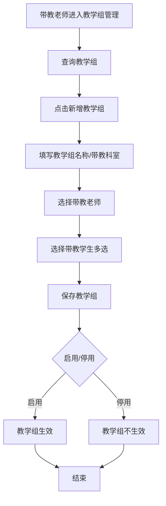
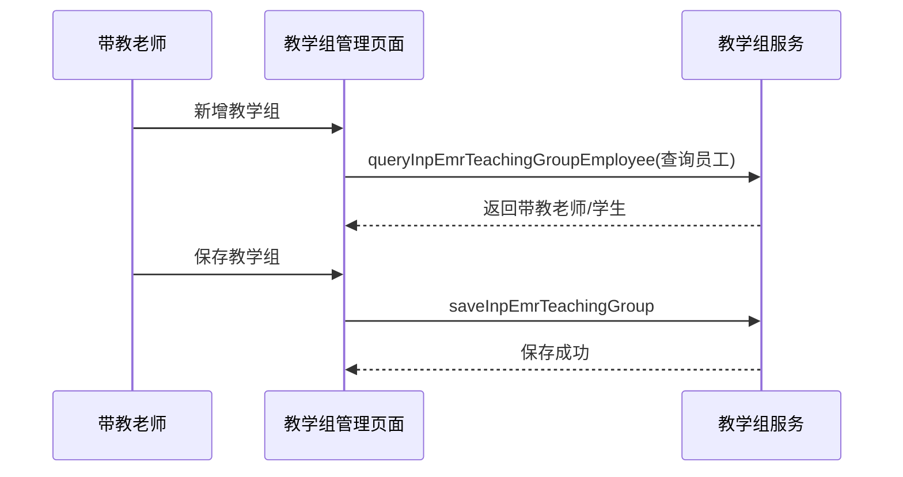

# BLGL-19-BLJXZ-001 教学组管理 - Spec

> **功能编号**：BLGL-19-BLJXZ-001
> **文档类型**：Spec（研发视角）
> **文档版本**：V1.0
> **编写时间**：2026-08-14
> **编写人**：RACC

---

## 文档索引

#### 章节索引

**Spec（研发视角）**

| 章节号 | 章节名称 | 内容说明 |
|--------|---------|---------|
| 1、 | 文档概述 | 文档目的、文档范围、术语定义、阅读指南、参考文档 |
| 2、 | 功能背景与定位 | 功能背景、功能定位、目标用户、核心价值 |
| 3、 | 业务流程设计 | 主流程/异常流程/边界流程（Given/When/Then） |
| 4、 | 数据模型设计 | 核心数据结构、状态定义、系统参数定义 |
| 5、 | 接口契约设计 | API列表、接口详细设计、错误码定义 |
| 6、 | 技术方案设计 | 页面路径、技术栈、关键技术点、部署方案 |
| 7、 | 测试用例预设计 | 功能/边界/异常/性能测试用例 |
| 8、 | 非功能性要求 | 性能、安全、可用性、兼容性 |
| 9、 | 依赖与风险 | 外部依赖、风险项 |
| 10、 | 附录 | 流程图、时序图、参考文档 |

**PM-Spec（业务视角）**

| 章节号 | 章节名称 | 内容说明 |
|--------|---------|---------|
| 一 | 目标 | 功能定位与核心价值 |
| 二 | 约束 | 业务/技术/非功能性约束 |
| 三 | 验收标准 | 验收条件与验证方法 |
| 四 | 排除范围 | 本次不做项与明确边界 |
| 五 | 关键决策记录 | 方案决策与选型理由 |
| 六 | 优先级 | 优先级定义 |
| 七 | 关联文档 | 关联文档索引 |
| 附录 | 填写检查清单 | 质量检查 |

**Analyst-Spec（产品视角）**

| 章节号 | 章节名称 | 内容说明 |
|--------|---------|---------|
| 一 | 功能编号体系 | 功能编号与层级结构 |
| 二 | 核心业务流程 | 核心业务流程与时序 |
| 三 | 功能规格说明 | 详细功能规格与验收标准 |
| 四 | 排除范围 | 排除范围 |
| 五 | 业务规则清单 | 业务规则清单 |
| 六 | 关联文档 | 关联文档索引 |
| 七 | 待确认问题清单 | 待确认问题汇总 |
| - | 填写检查清单 | 质量检查 |

#### 版本历史

| 版本 | 日期 | 变更说明 | 编写人 |
|------|------|---------|--------|
| V1.0 | 2026-08-14 | 初始版本 | RACC |

#### 关联文档索引

| 序号 | 文档名称 | 文档类型 | 版本 | 位置 |
|------|---------|---------|------|------|
| 1 | BLGL-19-BLJXZ-001_教学组管理_PM-spec.md | PM-Spec（业务视角） | V0.1 | 本目录 |
| 2 | BLGL-19-BLJXZ-001_教学组管理_Analyst-spec.md | Analyst-Spec（产品视角） | V1.0 | 本目录 |
| 3 | BLGL-19-BLJXZ-001_教学组管理-Spec.md | Spec（研发视角） | V1.0 | 本目录 |
| 4 | BLGL-19-BLJXZ 19病历教学组功能点Spec.md | 功能点Spec（模块级） | V1.0 | 上级目录 |

---

## 1、文档概述

### 1.1、文档目的

本文档旨在明确"教学组管理"功能（BLGL-19-BLJXZ-001）的业务背景与设计方案，为需求分析、研发实现、测试验收及评审提供统一的业务上下文、设计口径与决策依据。

### 1.2、文档范围

#### 1.2.1 纳入范围

本文档覆盖教学组管理的完整业务背景与设计，包括：

- 日常管理下新增教学组管理功能
- 带教老师自主维护规培生/进修生（新增/删除学生）
- 教学组配置（教学组名称/带教科室/带教老师/带教学生）
- 教学组查询（模糊搜索/带教科室/带教老师学生）
- 教学组状态管理（启用/停用）

#### 1.2.2 排除范围

本文档不涉及以下内容（详见其他功能点或模块）：

- 规培生病历书写权限—— BLGL-19-BLJXZ-002
- 规培生身份标识配置—— BLGL-19-BLJXZ-003
- 病历带教字段与归档校验—— BLGL-19-BLJXZ-004
- 带教学生批量维护 —— Phase 1 功能点Spec 第6章基础能力（BC-BLJXZ-006）

### 1.3、术语定义

| 术语 | 定义 |
|------|------|
| 教学组管理 | 日常管理下带教老师维护规培生/进修生的功能 |
| 带教老师 | 维护教学组下的学生 |
| 教学组名称 | 教学组标识，限制50字以内 |
| 带教科室 | 教学组所属科室 |

> ⏳ 待确认：规范术语表待产品文档确认。

### 1.4、阅读指南

- **章节关系**：第1~2章为业务全貌，第3~10章为设计实现层。与 Analyst-Spec、PM-Spec 互相引用保持一致。
- **读者对象**：产品经理/需求分析师读第1~2章；研发读第3~6、9~10章；测试读第3、7~8章；评审人员核对各层一致性。

### 1.5、参考文档

| 序号 | 文档名称 | 版本/日期 |
|------|---------|----------|
| 1 | 【历史需求】住院病历的历史需求.xlsx | - |
| 2 | BLGL-19-BLJXZ-001_教学组管理_PM-spec.md | V0.1 |
| 3 | BLGL-19-BLJXZ-001_教学组管理_Analyst-spec.md | V1.0 |
| 4 | BLGL-19-BLJXZ 19病历教学组功能点Spec.md | V1.0 |

---

## 2、功能背景与定位

### 2.1 功能背景

教学组管理是规培生/进修生病历书写的带教基础，需满足：

- **管理要求**：复星医院需要规培生/进修生书写病历，带教老师自主维护学生
- **现状痛点**：
  - 不能一个带教老师同时维护多个学生
  - 带教老师和学生可选择的数据集没有身份区分
  - 没在教学组的规培生也能创建病历
- **历史需求演进**：从教学组管理建立→ 教学组功能改造

### 2.2 功能定位

"教学组管理"是 WiNEX 病历管理-病历教学组模块的带教基础，定位为：

- **带教关系维护**：带教老师维护规培生/进修生
- **教学组配置**：名称/科室/老师/学生配置
- **身份区分**：带教老师和学生数据集区分

### 2.3 目标用户

| 用户角色 | 主要使用场景 |
|---------|-------------|
| 带教老师 | 维护教学组下的学生 |
| 科室管理者 | 查看教学组数据 |

### 2.4 核心价值

| 价值维度 | 价值描述 |
|---------|---------|
| 带教管理 | 带教老师自主维护学生 |
| 身份区分 | 带教老师/学生数据集区分 |
| 状态管控 | 教学组启用/停用 |

---

## 3、业务流程设计（Given/When/Then）

### 3.1 主流程

**Scenario 1: 教学组新增**

```gherkin
Given:
  - 带教老师有教学组管理权限

When:
  - 带教老师进入教学组管理
  - 点击新增教学组
  - 填写教学组名称（≤50字）、选择带教科室、带教老师、带教学生（多选）
  - 保存

Then:
  - 教学组创建成功
  - 带教老师可维护个人教学组下的学生
```

### 3.2 异常流程

**Scenario 2: 业务异常——教学组查询**

```gherkin
Given:
  - 带教老师进入教学组界面

When:
  - 带教老师查询教学组

Then:
  - 支持教学组名称模糊搜索
  - 带教科室默认有权限的所有科室
  - 带教老师/学生对员工姓名/编码/账号模糊搜索
```

**Scenario 3: 数据异常——带教学生身份区分**

```gherkin
Given:
  - 带教老师选择带教学生

When:
  - 带教学生下拉选择

Then:
  - 下拉选项为带教科室下员工类型是进修医师/实习医师/规培医师的员工
  - 与带教老师（专业技术职称医师/主治/副主任/主任）数据集区分
```

**Scenario 4: 系统异常——未在教学组的规培生创建病历**

```gherkin
Given:
  - 规培生未在教学组中

When:
  - 规培生尝试创建病历

Then:
  - 应控制不能创建病历（原问题）
  - ⏳ 待确认：教学组外规培生权限控制
```

### 3.3 边界流程

**Scenario 5: 边界场景——一个带教老师多个学生**

```gherkin
Given:
  - 带教老师需要维护多个学生

When:
  - 带教老师新增教学组

Then:
  - 支持一个带教老师同时维护多个学生
  - 多个带教学生拼接显示
```

**Scenario 6: 边界场景——教学组状态**

```gherkin
Given:
  - 教学组已配置

When:
  - 带教老师管理教学组

Then:
  - 增加状态：启用/停用
  - 停用后教学组不生效
```

---

## 4、数据模型设计

> 数据模型信息来自代码扫描（`E:\39EMR\sr-next`）和历史。标注 `` 的来自输入 AO/输出 VO，标注 `` 的来自需求文本。

### 4.1 核心数据结构

#### 4.1.1 核心输入（InpEmrTeachingGroupInputAO）

| 字段名 | 类型 | 必填 | 备注 |
|--------|------|------|------|
| inpEmrTeachingGroupId | Long | 否 | 教学组ID |
| teacherEmployeeId | Long | 是 | 带教老师 |
| teachingDeptId | Long | 是 | 带教科室 |
| studentEmployeeId | Long | 是 | 带教学生 |
| enabledFlag | Long | 是 | 启用标志 |

> ⏳ 待确认：完整入参结构待接口契约文档补充。

#### 4.1.2 核心表/实体

| 表/实体 | 关键字段 | 说明 |
|---------|---------|------|
| 教学组表 | 教学组ID/带教老师/带教科室/学生 | 教学组配置 |

> ⏳ 待确认：教学组数据表结构待代码扫描或功能清单数据表清单补充。

### 4.2 状态定义

| 状态码 | 状态名称 | 说明 |
|--------|---------|------|
| 启用 | 状态 | 教学组生效 |
| 停用 | 状态 | 教学组不生效 |

### 4.3 系统参数定义

| 参数编码 | 参数名称 | 说明 |
|---------|---------|------|
| 规培生身份标识来源 | 身份标识 | 患者信息/员工类型/教学组 |

---

## 5、接口契约设计

> 接口信息来自代码扫描（`E:\39EMR\sr-next`）的 EmrTeachingGroupController。标注 ``。

### 5.1 API列表

| 序号 | API名称（代码函数） | 路径 | 方法 | 说明 |
|:----:|---------|------|:----:|------|
| 1 | saveInpEmrTeachingGroup | /api/v1/app_record_inpatient/emr_inpatient/inp_emr_teaching_group/save | POST | 保存住院病历教学组 |
| 2 | queryInpEmrTeachingGroupByExample | /api/v1/app_record_inpatient/emr_inpatient/inp_emr_teaching_group/query | POST | 查询住院病历教学组 |
| 3 | queryInpEmrTeachingGroupEmployee | /api/v1/app_record_inpatient/emr_inpatient/inp_emr_teaching_group_employee/query | POST | 查询教学组员工信息（带教老师/学生） |
| 4 | saveInpEmrTeachingClassGroup | /api/v1/app_record_inpatient/emr_inpatient/inp_emr_teaching_group_class/save | POST | 保存教学组 |
| 5 | queryInpEmrTeachingGroupClassByExample | /api/v1/app_record_inpatient/emr_inpatient/inp_emr_teaching_group_class/query | POST | 查询教学组 |

> 前端实际请求前缀：`/inpatient-clinicalnote/api/v1/app_record_inpatient/`。

### 5.2 接口详细设计

#### 5.2.1 保存住院病历教学组（saveInpEmrTeachingGroup）

**请求参数（InpEmrTeachingGroupInputAO）**:
```json
{
  "teacherEmployeeId": 1001,
  "teachingDeptId": 101,
  "studentEmployeeId": 2001,
  "enabledFlag": 1
}
```

**返回值（成功）**:
```json
{
  "success": true,
  "data": 5001
}
```

**返回值（失败）**:
```json
{
  "success": false,
  "message": "保存失败",
  "data": null
}
```

> ⏳ 待确认：具体字段名/结构以接口契约文档为准。

### 5.3 错误码定义

| 错误码 | 错误信息 | 处理方式 |
|--------|---------|---------|
| ⏳ 待确认 | 保存失败 | 提示错误并返回教学组界面 |

> ⏳ 待确认：业务错误码定义未在代码扫描中提取完整。

---

## 6、技术方案设计

### 6.1 页面路径

- **页面路径**: 日常管理→病历管理→教学组管理
- **路由**: /clinicalnote-teachingSection（病历管理-教学组管理，EmrManage.js）
- **前端组件**: TeachingGroupManagement/index.vue + components/AddGroupDialog.vue（新增教学组弹窗）
- **后端接口**: EmrTeachingGroupController（tags: 教学组）

### 6.2 技术栈

| 类别 | 技术 | 版本 |
|------|------|------|
| 前端框架 | Vue | 2.6.14 |
| 前端UI | element-ui | 2.13.0 |
| 后端框架 | Spring Boot（Java） | java.version 17 |
| 构建工具 | webpack / Maven | 前端 webpack + 后端 Maven |

### 6.3 关键技术点

- 教学组保存：saveInpEmrTeachingGroup
- 教学组员工查询：queryInpEmrTeachingGroupEmployee（带教老师/学生身份区分）
- 教学组查询：queryInpEmrTeachingGroupByExample
- 一个带教老师多个学生：学生多选

### 6.4 部署方案

⏳ 待确认：部署方案未在资料区中找到。

---

## 7、测试用例预设计

### 7.1 功能测试

| 用例编号 | 测试场景 | Given | When | Then |
|---------|---------|-------|------|------|
| TC-001 | 教学组新增 | 带教老师有权限 | 新增教学组 | 创建成功 |
| TC-002 | 教学组查询 | 带教老师进入 | 查询教学组 | 支持模糊搜索/科室/老师学生 |

### 7.2 边界测试

| 用例编号 | 测试场景 | Given | When | Then |
|---------|---------|-------|------|------|
| TC-003 | 一个老师多个学生 | 带教老师 | 维护学生 | 多选学生拼接显示 |
| TC-004 | 教学组状态 | 已配置教学组 | 停用/启用 | 停用不生效 |

### 7.3 异常测试

| 用例编号 | 测试场景 | Given | When | Then |
|---------|---------|-------|------|------|
| TC-005 | 学生身份区分 | 选择带教学生 | 下拉选择 | 仅进修/实习/规培医师 |
| TC-006 | 未在教学组创建 | 规培生未入组 | 创建病历 | ⏳ 待确认：权限控制 |

### 7.4 性能测试

| 用例编号 | 测试场景 | 指标 |
|---------|---------|------|
| TC-007 | 教学组查询响应 | ⏳ 待确认：性能指标未在资料区中找到 |

---

## 8、非功能性要求

### 8.1 性能要求

| 指标 | 要求 |
|------|------|
| 教学组查询响应 | ⏳ 待确认 |

### 8.2 安全要求

| 要求 | 说明 |
|------|------|
| 教学组权限 | 带教老师可维护个人教学组 |

**医疗行业特殊要求**

| 要求 | 说明 |
|------|------|
| 带教合规 | 教学组支撑规培生带教 |

### 8.3 可用性要求

| 指标 | 要求值 |
|------|--------|
| 可用性 | ⏳ 待确认 |

### 8.4 兼容性要求

| 类型 | 要求 |
|------|------|
| 身份区分 | 带教老师/学生数据集区分 |

---

## 9、依赖与风险

### 9.1 外部依赖

| 依赖项 | 说明 |
|--------|------|
| 主数据系统 | 员工类型/职称 |

### 9.2 风险项

| 风险项 | 等级 | 说明 | 应对方案 |
|--------|------|------|---------|
| 身份区分不足 | 中 | 老师/学生数据集混淆 | 按职称/员工类型区分 |
| 权限失控 | 中 | 未入组规培生创建病历 | 教学组权限控制 |

---

## 10、附录

### 10.1 流程图



### 10.2 时序图



### 10.3 参考文档

- 【历史需求】住院病历的历史需求.xlsx
- BLGL-19-BLJXZ 19病历教学组功能点Spec.md（V1.0，第5章 -001 行）
- 关联Spec: BLGL-19-BLJXZ-002（规培生权限）、-003（身份标识）

---

## 填写检查清单

| 序号 | 检查项 | 是否完成 |
|:----:|--------|:--------:|
| 1 | 章节索引与正文章节一致 | ✅ |
| 2 | 版本历史记录完整 | ✅ |
| 3 | 关联文档索引已登记全部Spec | ✅ |
| 4 | 文档目的明确回答"为什么做/做成什么/怎么做" | ✅ |
| 5 | 纳入范围/排除范围清晰 | ✅ |
| 6 | 术语定义覆盖关键概念，从资料区可溯源 | ✅ |
| 7 | 参考文档已登记 | ✅ |
| 8 | 功能背景基于法规/规范/需求来源组织 | ✅ |
| 9 | 功能定位体现业务价值（3~5个定位点） | ✅ |
| 10 | 目标用户角色覆盖完整，在需求原文中有出处 | ✅ |
| 11 | 核心价值可陈述，与 Phase 1 口径一致 | ✅ |
| 12 | 业务流程：主流程≥1、异常≥3、边界≥2，Given/When/Then 具体 | ✅ |
| 13 | 数据模型：字段/表/状态/参数可溯源 | ✅ |
| 14 | 接口契约：API列表+详细设计+错误码齐全或标记待确认 | ✅ |
| 15 | 技术方案：页面路径/技术栈/关键点/部署方案或标记待确认 | ✅ |
| 16 | 测试用例：功能/边界/异常/性能覆盖 | ✅ |
| 17 | 非功能性要求：性能/安全/可用性/兼容性指标可量化或标记待确认 | ✅ |
| 18 | 依赖与风险：外部依赖登记完整 | ✅ |
| 19 | 附录：流程图/时序图与正文流程一致 | ✅ |
| 20 | 全文无占位符 `< >` 残留 | ✅ |
| 21 | 全文陈述可溯源至资料区 | ✅ |
| 22 | 人工审核确认完成 | ⏳ 待确认 |

---

**文档状态**：⬜ 待审核
**维护责任**：RACC
**下次更新**：根据评审反馈优化
