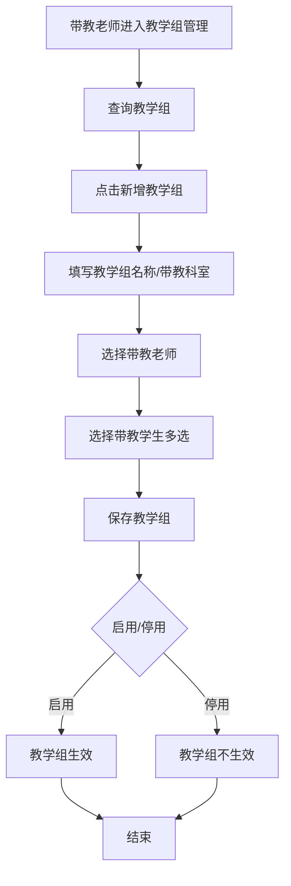
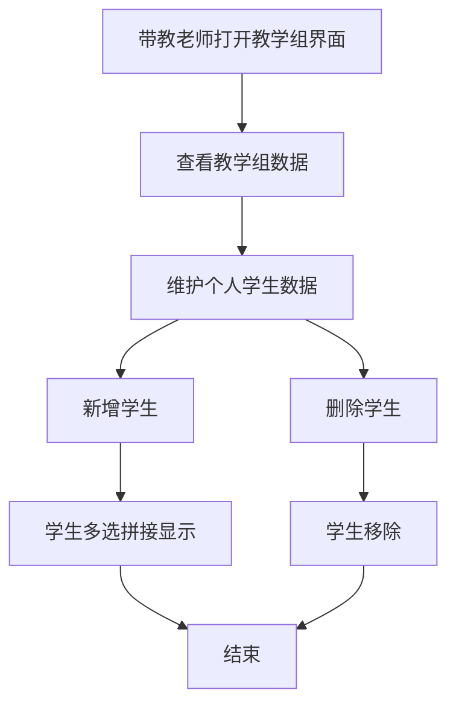

# BLGL-19-BLJXZ-001教学组管理_ Analyst - Spec

> **需求编号**：BLGL-19-BLJXZ-001
> **父需求**：BLGL-19-BLJXZ
> **关联PM Spec**：BLGL-19-BLJXZ-001_教学组管理_PM-spec.md
> **Spec版本**：V1.0
> **编写时间**：2026-08-14
> **编写人**：需求分析师

---

## 一、功能编号体系

### 1.1 功能层级结构

```
BLGL-19-BLJXZ-001: 教学组管理
  ├─ BLGL-19-BLJXZ-001-01: 教学组维护
  │   ├─ -01-01: 教学组新增（名称/带教科室/带教老师/学生）
  │   ├─ -01-02: 带教学生新增/删除
  │   └─ -01-03: 教学组修改
  ├─ BLGL-19-BLJXZ-001-02: 教学组查询
  │   ├─ -02-01: 教学组名称模糊搜索
  │   └─ -02-02: 带教科室/带教老师/学生查询
  └─ BLGL-19-BLJXZ-001-03: 教学组状态管理
      ├─ -03-01: 启用/停用
      └─ -03-02: 多个学生拼接显示
```

### 1.2 功能编号表

| REQ-ID | 功能名称 | 类型 | 优先级 | 说明 |
|--------|---------|------|--------|------|
| BLGL-19-BLJXZ-001-01 | 教学组维护 | 功能 | P0 | 新增/删除/修改 |
| BLGL-19-BLJXZ-001-01-01 | 教学组新增 | 子功能 | P0 | 名称/科室/老师/学生 |
| BLGL-19-BLJXZ-001-01-02 | 带教学生维护 | 子功能 | P0 | 新增/删除学生 |
| BLGL-19-BLJXZ-001-01-03 | 教学组修改 | 子功能 | P1 | 编辑教学组 |
| BLGL-19-BLJXZ-001-02 | 教学组查询 | 功能 | P1 | 查询 |
| BLGL-19-BLJXZ-001-02-01 | 名称模糊搜索 | 子功能 | P1 | 教学组名称 |
| BLGL-19-BLJXZ-001-02-02 | 科室/老师/学生查询 | 子功能 | P1 | 多维度 |
| BLGL-19-BLJXZ-001-03 | 教学组状态管理 | 功能 | P1 | 状态 |
| BLGL-19-BLJXZ-001-03-01 | 启用/停用 | 子功能 | P1 | 状态控制 |
| BLGL-19-BLJXZ-001-03-02 | 多学生拼接 | 子功能 | P1 | 展示 |

---

## 二、核心业务流程

### 2.1 教学组新增流程



### 2.2 带教关系维护流程



---

## 三、功能规格说明

---

### BLGL-19-BLJXZ-001-01: 教学组维护

#### 3.1.1 功能概述

带教老师新增/修改教学组，配置教学组名称（≤50字）、带教科室、带教老师、带教学生（多选），新增/删除个人教学组下的学生。

#### 3.1.2 用户角色

| 角色 | 使用场景 | 权限要求 | 操作频率 |
|------|---------|---------|---------|
| 带教老师 | 维护教学组 | 教学组管理权限 | 低频 |

#### 3.1.3 业务流程（Given/When/Then）

##### 主流程

**Scenario 1: 教学组新增**

```gherkin
Given:
  - 带教老师有教学组管理权限

When:
  - 带教老师进入教学组管理
  - 点击新增教学组
  - 填写教学组名称（≤50字）、选择带教科室、带教老师、带教学生（多选）
  - 保存

Then:
  - 教学组创建成功
  - 带教老师可维护个人教学组下的学生
```

##### 异常流程

**Scenario 2: 数据异常——身份数据集区分**

```gherkin
Given:
  - 带教老师选择带教学生

When:
  - 带教学生下拉选择

Then:
  - 下拉选项为带教科室下员工类型是进修医师/实习医师/规培医师的员工
  - 与带教老师（职称医师/主治/副主任/主任）数据集区分
```

**Scenario 3: 系统异常——未在教学组的规培生创建病历**

```gherkin
Given:
  - 规培生未在教学组中

When:
  - 规培生尝试创建病历

Then:
  - 应控制不能创建病历（原问题）
  - ⏳ 待确认：教学组外规培生权限控制
```

##### 边界流程

**Scenario 4: 边界场景——一个带教老师多个学生**

```gherkin
Given:
  - 带教老师需要维护多个学生

When:
  - 带教老师新增教学组

Then:
  - 支持一个带教老师同时维护多个学生
  - 多个带教学生拼接显示
```

**Scenario 5: 边界场景——教学组名称限制**

```gherkin
Given:
  - 带教老师填写教学组名称

When:
  - 名称超过50字

Then:
  - 限制50字以内
```

> 字段名来自代码扫描（`E:\39EMR\sr-next`，标注 `` 的来自 InpEmrTeachingGroupInputAO）。

#### 3.1.5 验收标准

| AC编号 | 验收标准 | 对应REQ-ID | 验证方法 | 验证场景 |
|--------|---------|-----------|---------|---------|
| AC-001 | 带教老师可新增教学组并维护学生 | -001-01 | 功能测试 | Scenario 1 |
| AC-002 | 一个带教老师可同时维护多个学生 | -001-01 | 功能测试 | Scenario 4 |
| AC-003 | 带教老师/学生数据集身份区分 | -001-01 | 功能测试 | Scenario 2 |

---

### BLGL-19-BLJXZ-001-02: 教学组查询

#### 3.2.1 功能概述

教学组查询支持教学组名称模糊搜索、带教科室（有权限科室）、带教老师/学生对员工姓名/编码/账号模糊搜索。

#### 3.2.2 用户角色

| 角色 | 使用场景 | 权限要求 | 操作频率 |
|------|---------|---------|---------|
| 带教老师 | 查询教学组 | 教学组管理权限 | 中频 |

#### 3.2.3 业务流程（Given/When/Then）

##### 主流程

**Scenario 1: 教学组查询**

```gherkin
Given:
  - 带教老师进入教学组界面

When:
  - 带教老师查询教学组

Then:
  - 支持教学组名称模糊搜索
  - 带教科室默认有权限的所有科室，可下拉选择
  - 带教老师/学生对员工姓名/编码/账号模糊搜索
```

##### 边界流程

**Scenario 2: 边界场景——多个学生展示**

```gherkin
Given:
  - 教学组含多个带教学生

When:
  - 带教老师查询教学组

Then:
  - 多个带教学生拼接显示
  - 增加状态：启用/停用
```

#### 3.2.5 验收标准

| AC编号 | 验收标准 | 对应REQ-ID | 验证方法 | 验证场景 |
|--------|---------|-----------|---------|---------|
| AC-004 | 教学组支持名称模糊搜索、带教科室/老师/学生查询 | -001-02 | 功能测试 | Scenario 1 |

---

### BLGL-19-BLJXZ-001-03: 教学组状态管理

#### 3.3.1 功能概述

教学组增加状态（启用/停用），停用后教学组不生效。

#### 3.3.2 用户角色

| 角色 | 使用场景 | 权限要求 | 操作频率 |
|------|---------|---------|---------|
| 带教老师 | 管理教学组状态 | 教学组管理权限 | 低频 |

#### 3.3.3 业务流程（Given/When/Then）

##### 主流程

**Scenario 1: 教学组停用/启用**

```gherkin
Given:
  - 教学组已配置

When:
  - 带教老师停用/启用教学组

Then:
  - 停用后教学组不生效
  - 启用后教学组生效
```

#### 3.3.5 验收标准

| AC编号 | 验收标准 | 对应REQ-ID | 验证方法 | 验证场景 |
|--------|---------|-----------|---------|---------|
| AC-005 | 教学组支持启用/停用状态管理 | -001-03 | 功能测试 | Scenario 1 |

---

## 四、排除范围

本需求不包含以下功能项：

1. **规培生病历书写权限** - 属 BLGL-19-BLJXZ-002
2. **规培生身份标识配置** - 属 BLGL-19-BLJXZ-003
3. **病历带教字段与归档校验** - 属 BLGL-19-BLJXZ-004
4. **带教学生批量维护** - 属基础能力 BC-BLJXZ-006

> 与 PM-Spec 第四章一致。对照 Phase 1 功能点Spec 第6章（基线能力），确保不越界。

---

## 五、业务规则清单

| 规则ID | 规则名称 | 规则描述 | 来源 | 优先级 |
|--------|---------|---------|------|--------|
| BR-001 | 教学组管理 | 日常管理下新增教学组管理功能 | | P0 |
| BR-002 | 学生维护 | 带教老师可新增/删除个人教学组下的学生 | | P0 |
| BR-003 | 一对多 | 一个带教老师可同时维护多个学生 | | P0 |
| BR-004 | 身份区分 | 带教老师/学生数据集身份区分 | | P1 |
| BR-005 | 名称限制 | 教学组名称限制50字以内 | | P1 |
| BR-006 | 状态管理 | 教学组增加启用/停用状态 | | P1 |

---

## 六、关联文档

| 文档类型 | 文档路径 | 说明 |
|---------|---------|------|
| PM-Spec（业务视角） | 本目录 BLGL-19-BLJXZ-001_教学组管理_PM-spec.md（V0.1） | PM 产出的 Spec 文档 |
| Spec（研发视角） | 本目录 BLGL-19-BLJXZ-001_教学组管理-Spec.md（V1.0） | 业务背景与目标 Spec |
| 功能点Spec（模块级） | BLGL-19-BLJXZ 19病历教学组功能点Spec.md（V1.0，上级目录） | Phase 1 功能点索引 |
| data-model.md | 待产出 | 架构师产出的数据建模文档 |
| design.md | 待产出 | 架构师产出的技术方案文档 |
| api-contract.md | 待产出 | 开发经理产出的 API 契约文档 |

---

## 七、待确认问题清单

| 编号 | 问题描述 | 缺失信息 | 影响范围 | 建议补充方 |
|------|---------|---------|---------|-----------|
| Q-001 | 教学组外规培生权限 | 未入组规培生创建病历控制 | 3.1.3 Scenario 3 | 产品经理 |
| Q-002 | 教学组表结构 | 教学组数据表字段 | 4.1.2 数据模型 | 架构师 |
| Q-003 | 完整接口契约 | API 请求/返回字段 | 第5章接口设计 | 开发经理 |
| Q-004 | 概念ID、性能指标 | 字段概念ID、查询SLA | 数据模型、非功能 | 架构师/产品经理 |

---

## 填写检查清单

| 序号 | 检查项 | 是否完成 |
|:----:|--------|:--------:|
| 1 | 功能编号带父子层级 | ✅ |
| 2 | 每个 REQ-ID 有功能概述和用户角色 | ✅ |
| 3 | 主流程至少 1 个 Given/When/Then 场景 | ✅ |
| 4 | 异常流程至少 3 个 Given/When/Then 场景 | ✅ |
| 5 | 边界流程至少 2 个 Given/When/Then 场景 | ✅ |
| 6 | 每个 Given/When/Then 内容具体，不模糊 | ✅ |
| 7 | 数据字段定义完整 | ✅ |
| 8 | 验收标准 AC 编号独立，可验证 | ✅ |
| 9 | 验收标准无"功能正常"等模糊表述 | ✅ |
| 10 | 排除范围明确列出 | ✅ |
| 11 | 业务规则清单列出所有规则，每条标注来源 | ✅ |
| 12 | 流程图使用 Mermaid 格式（≥2 个） | ✅ |
| 13 | 关联文档索引包含 Phase 1 功能点Spec | ✅ |
| 14 | 待确认问题清单汇总了全文所有 ⏳ 项 | ✅ |
| 15 | 全文无占位符 `< >` 残留 | ✅ |
| 16 | 全文陈述可溯源至资料区（S1~S10 溯源核查） | ✅ |
| 17 | 人工审核确认完成 | ⏳ 待确认 |

---

**文档状态**：⬜ 待审核
**维护责任**：需求分析师规范组
**下次更新**：根据评审反馈优化

---

## 版本历史

| 版本 | 日期 | 变更说明 | 编写人 |
|------|------|---------|--------|
| V1.0 | 2026-08-14 | 初始版本 | 需求分析师 |
