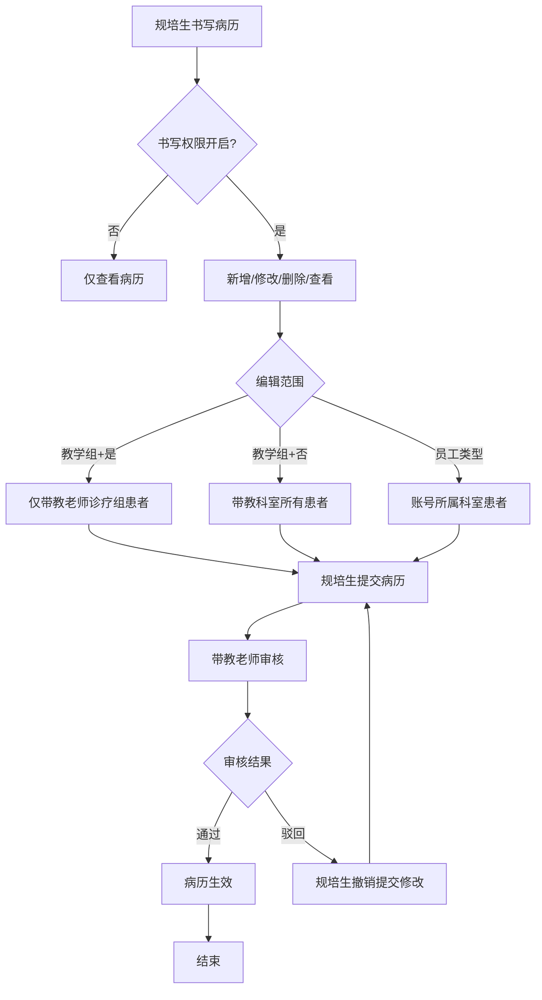
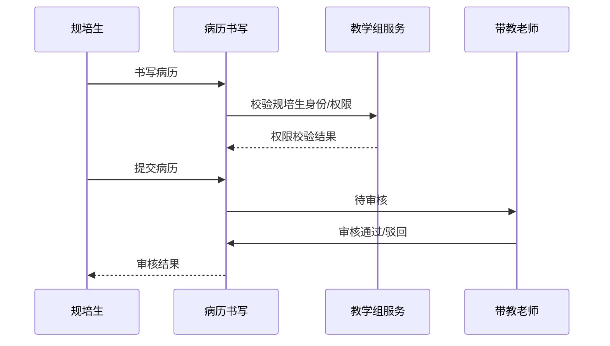

# BLGL-19-BLJXZ-002 规培生病历书写权限 - Spec

> **功能编号**：BLGL-19-BLJXZ-002
> **文档类型**：Spec（研发视角）
> **文档版本**：V1.0
> **编写时间**：2026-08-14
> **编写人**：RACC

---

## 文档索引

#### 章节索引

**Spec（研发视角）**

| 章节号 | 章节名称 | 内容说明 |
|--------|---------|---------|
| 1、 | 文档概述 | 文档目的、文档范围、术语定义、阅读指南、参考文档 |
| 2、 | 功能背景与定位 | 功能背景、功能定位、目标用户、核心价值 |
| 3、 | 业务流程设计 | 主流程/异常流程/边界流程（Given/When/Then） |
| 4、 | 数据模型设计 | 核心数据结构、状态定义、系统参数定义 |
| 5、 | 接口契约设计 | API列表、接口详细设计、错误码定义 |
| 6、 | 技术方案设计 | 页面路径、技术栈、关键技术点、部署方案 |
| 7、 | 测试用例预设计 | 功能/边界/异常/性能测试用例 |
| 8、 | 非功能性要求 | 性能、安全、可用性、兼容性 |
| 9、 | 依赖与风险 | 外部依赖、风险项 |
| 10、 | 附录 | 流程图、时序图、参考文档 |

**PM-Spec（业务视角）**

| 章节号 | 章节名称 | 内容说明 |
|--------|---------|---------|
| 一 | 目标 | 功能定位与核心价值 |
| 二 | 约束 | 业务/技术/非功能性约束 |
| 三 | 验收标准 | 验收条件与验证方法 |
| 四 | 排除范围 | 本次不做项与明确边界 |
| 五 | 关键决策记录 | 方案决策与选型理由 |
| 六 | 优先级 | 优先级定义 |
| 七 | 关联文档 | 关联文档索引 |
| 附录 | 填写检查清单 | 质量检查 |

**Analyst-Spec（产品视角）**

| 章节号 | 章节名称 | 内容说明 |
|--------|---------|---------|
| 一 | 功能编号体系 | 功能编号与层级结构 |
| 二 | 核心业务流程 | 核心业务流程与时序 |
| 三 | 功能规格说明 | 详细功能规格与验收标准 |
| 四 | 排除范围 | 排除范围 |
| 五 | 业务规则清单 | 业务规则清单 |
| 六 | 关联文档 | 关联文档索引 |
| 七 | 待确认问题清单 | 待确认问题汇总 |
| - | 填写检查清单 | 质量检查 |

#### 版本历史

| 版本 | 日期 | 变更说明 | 编写人 |
|------|------|---------|--------|
| V1.0 | 2026-08-14 | 初始版本 | RACC |

#### 关联文档索引

| 序号 | 文档名称 | 文档类型 | 版本 | 位置 |
|------|---------|---------|------|------|
| 1 | BLGL-19-BLJXZ-002_规培生病历书写权限_PM-spec.md | PM-Spec（业务视角） | V0.1 | 本目录 |
| 2 | BLGL-19-BLJXZ-002_规培生病历书写权限_Analyst-spec.md | Analyst-Spec（产品视角） | V1.0 | 本目录 |
| 3 | BLGL-19-BLJXZ-002_规培生病历书写权限-Spec.md | Spec（研发视角） | V1.0 | 本目录 |
| 4 | BLGL-19-BLJXZ 19病历教学组功能点Spec.md | 功能点Spec（模块级） | V1.0 | 上级目录 |

---

## 1、文档概述

### 1.1、文档目的

本文档旨在明确"规培生病历书写权限"功能（BLGL-19-BLJXZ-002）的业务背景与设计方案，为需求分析、研发实现、测试验收及评审提供统一的业务上下文、设计口径与决策依据。

### 1.2、文档范围

#### 1.2.1 纳入范围

本文档覆盖规培生病历书写权限的完整业务背景与设计，包括：

- 规培生/进修生书写病历权限（新增/修改/删除自己创建/查看）
- 教学组模式下规培生编辑范围控制（带教老师诊疗组/带教科室）
- 规培生书写病历的带教老师审核流程
- 规培生签名格式

#### 1.2.2 排除范围

本文档不涉及以下内容（详见其他功能点或模块）：

- 教学组管理—— BLGL-19-BLJXZ-001
- 规培生身份标识配置—— BLGL-19-BLJXZ-003
- 病历带教字段与归档校验—— BLGL-19-BLJXZ-004
- 规培生签名格式 —— Phase 1 功能点Spec 第6章基础能力（BC-BLJXZ-003）

### 1.3、术语定义

| 术语 | 定义 |
|------|------|
| 规培生 | 规培/进修医生，员工类型 |
| 教学组模式 | 省中规培生模式，教学组配置带教关系 |
| 诊疗组模式 | 省中书写病历模式，诊疗组内医生和带教学生可书写 |

> ⏳ 待确认：规范术语表待产品文档确认。

### 1.4、阅读指南

- **章节关系**：第1~2章为业务全貌，第3~10章为设计实现层。与 Analyst-Spec、PM-Spec 互相引用保持一致。
- **读者对象**：产品经理/需求分析师读第1~2章；研发读第3~6、9~10章；测试读第3、7~8章；评审人员核对各层一致性。

### 1.5、参考文档

| 序号 | 文档名称 | 版本/日期 |
|------|---------|----------|
| 1 | 【历史需求】住院病历的历史需求.xlsx | - |
| 2 | BLGL-19-BLJXZ-002_规培生病历书写权限_PM-spec.md | V0.1 |
| 3 | BLGL-19-BLJXZ-002_规培生病历书写权限_Analyst-spec.md | V1.0 |
| 4 | BLGL-19-BLJXZ 19病历教学组功能点Spec.md | V1.0 |

---

## 2、功能背景与定位

### 2.1 功能背景

规培生病历书写权限是规培生带教书写病历的权限控制，需满足：

- **管理要求**：新规范要求允许规培生、进修生书写病历文书
- **现状痛点**：
  - 没在教学组的规培生也能创建病历
  - 规培生编辑范围需控制（带教老师诊疗组/带教科室）
- **历史需求演进**：从规培生书写规则建立→ 规培生书写流程→ 身份标识来源

### 2.2 功能定位

"规培生病历书写权限"是 WiNEX 病历管理-病历教学组模块的权限控制，定位为：

- **书写权限控制**：规培生新增/修改/删除/查看病历
- **编辑范围控制**：教学组模式下带教老师诊疗组/带教科室
- **带教审核**：规培生病历需带教老师审核

### 2.3 目标用户

| 用户角色 | 主要使用场景 |
|---------|-------------|
| 规培生/进修生 | 书写病历（有权限时） |
| 带教老师 | 审核规培生书写病历 |

### 2.4 核心价值

| 价值维度 | 价值描述 |
|---------|---------|
| 合规书写 | 规培生可书写病历 |
| 权限受控 | 编辑范围按诊疗组/科室控制 |
| 带教审核 | 规培生病历带教老师审核 |

---

## 3、业务流程设计（Given/When/Then）

### 3.1 主流程

**Scenario 1: 规培生病历书写**

```gherkin
Given:
  - 规培生书写病历权限开启
  - 规培生已识别身份（教学组/员工类型）

When:
  - 规培生书写病历

Then:
  - 开放新增、修改、删除（删除自己创建的病历）、查看
  - 病历未提交：规培生（暂存/删除/提交）
  - 病历提交后需带教老师审核
```

### 3.2 异常流程

**Scenario 2: 业务异常——权限关闭**

```gherkin
Given:
  - 规培生书写病历的权限关闭

When:
  - 规培生书写病历

Then:
  - 仅开放查看病历
  - 不能新增/修改/删除
```

**Scenario 3: 数据异常——编辑范围控制**

```gherkin
Given:
  - 规培生身份标识来源=教学组
  - 参数"规培生可编辑病历的患者范围是否限制为带教老师诊疗组"

When:
  - 规培生编辑病历

Then:
  - 参数=是：仅可编辑带教老师所属诊疗组负责的患者病历
  - 参数=否：可编辑带教科室所有患者病历
```

**Scenario 4: 系统异常——未在教学组**

```gherkin
Given:
  - 规培生未在教学组中

When:
  - 规培生尝试创建病历

Then:
  - 应控制不能创建病历（原问题）
  - ⏳ 待确认：教学组外规培生权限控制
```

### 3.3 边界流程

**Scenario 5: 边界场景——带教审核**

```gherkin
Given:
  - 规培生提交病历

When:
  - 病历进入审核流程

Then:
  - 带教老师权限：暂存、提交、驳回
  - 规培生权限：撤销提交
```

**Scenario 6: 边界场景——规培生配置菜单**

```gherkin
Given:
  - 省中规培生模式

When:
  - 配置规培生相关参数

Then:
  - 规培生相关参数挪到专门【规培生配置】菜单
```

---

## 4、数据模型设计

> 数据模型信息来自代码扫描（`E:\39EMR\sr-next`）和历史。标注 `` 的来自 PO 实体，标注 `` 的来自需求文本。

### 4.1 核心数据结构

#### 4.1.1 核心表/实体

| 表/实体 | 关键字段 | 说明 |
|---------|---------|------|
| 教学组表 | 带教老师/带教学生/带教科室 | 规培生身份识别 |
| 员工类型表 | 员工类型 | 规培生/实习生/进修生 |
| 患者信息表 | 带教老师/规培生字段 | 规培生身份来源 |

> ⏳ 待确认：完整数据表清单待代码扫描或功能清单数据表清单补充。

### 4.2 状态定义

| 状态码 | 状态名称 | 说明 |
|--------|---------|------|
| 未提交 | 病历状态 | 规培生/带教老师可暂存/删除/提交 |
| 已提交 | 病历状态 | 带教老师审核 |

### 4.3 系统参数定义

| 参数编码 | 参数名称 | 说明 |
|---------|---------|------|
| 规培生身份标识来源 | 身份标识 | 患者信息/员工类型/教学组 |
| 教学组模式下规培生编辑范围限制 | 编辑范围 | 是/否，默认否 |
| 规培生书写病历权限 | 书写权限 | 开启/关闭 |

---

## 5、接口契约设计

> 接口信息来自代码扫描（`E:\39EMR\sr-next`）和历史。标注 `` 或 ``。

### 5.1 API列表

| 序号 | API名称（代码函数） | 路径 | 方法 | 说明 |
|:----:|---------|------|:----:|------|
| 1 | 主数据员工类型查询 | ⏳ 待确认：主数据接口 | POST | 获取员工类型（规培生/进修生） |
| 2 | 教学组带教老师查询 | /api/v1/app_record_inpatient/emr_inpatient/inp_emr_teaching_group_employee/query | POST | 从教学组获取带教老师 |

> ⏳ 待确认：规培生权限校验接口待接口文档补充。

### 5.2 接口详细设计

#### 5.2.1 教学组带教老师查询（queryInpEmrTeachingGroupEmployee）

**请求参数**:
```json
{
  "teachingDeptId": 101,
  "employeeType": "规培生"
}
```

**返回值（成功）**:
```json
{
  "success": true,
  "data": [
    {
      "teacherEmployeeId": 1001,
      "teacherEmployeeName": "张老师",
      "studentEmployeeId": 2001,
      "studentEmployeeName": "李规培生"
    }
  ]
}
```

**返回值（失败）**:
```json
{
  "success": false,
  "message": "查询失败",
  "data": null
}
```

> ⏳ 待确认：具体字段名/结构以接口契约文档为准。

### 5.3 错误码定义

| 错误码 | 错误信息 | 处理方式 |
|--------|---------|---------|
| ⏳ 待确认 | 无规培生书写权限 | 提示并仅开放查看 |

> ⏳ 待确认：业务错误码定义未在代码扫描中提取完整。

---

## 6、技术方案设计

### 6.1 页面路径

- **页面路径**: 住院医生站→病历书写；规培生配置菜单
- **后端接口**: EmrTeachingGroupController（tags: 教学组）

### 6.2 技术栈

| 类别 | 技术 | 版本 |
|------|------|------|
| 前端框架 | Vue | 2.6.14 |
| 前端UI | element-ui | 2.13.0 |
| 后端框架 | Spring Boot（Java） | java.version 17 |
| 构建工具 | webpack / Maven | 前端 webpack + 后端 Maven |

### 6.3 关键技术点

- 规培生身份识别：员工类型/教学组/患者信息
- 编辑范围：教学组模式下带教老师诊疗组/带教科室
- 带教审核：规培生提交病历带教老师审核
- 权限开关：规培生书写病历权限参数控制

### 6.4 部署方案

⏳ 待确认：部署方案未在资料区中找到。

---

## 7、测试用例预设计

### 7.1 功能测试

| 用例编号 | 测试场景 | Given | When | Then |
|---------|---------|-------|------|------|
| TC-001 | 规培生书写权限开启 | 权限开启 | 规培生书写 | 新增/修改/删除/查看 |
| TC-002 | 规培生权限关闭 | 权限关闭 | 规培生书写 | 仅查看 |

### 7.2 边界测试

| 用例编号 | 测试场景 | Given | When | Then |
|---------|---------|-------|------|------|
| TC-003 | 编辑范围=是 | 教学组模式 | 规培生编辑 | 仅带教老师诊疗组患者 |
| TC-004 | 编辑范围=否 | 教学组模式 | 规培生编辑 | 带教科室所有患者 |

### 7.3 异常测试

| 用例编号 | 测试场景 | Given | When | Then |
|---------|---------|-------|------|------|
| TC-005 | 未在教学组 | 规培生未入组 | 创建病历 | ⏳ 待确认：权限控制 |
| TC-006 | 带教审核 | 规培生提交病历 | 带教老师审核 | 带教老师暂存/提交/驳回 |

### 7.4 性能测试

| 用例编号 | 测试场景 | 指标 |
|---------|---------|------|
| TC-007 | 规培生权限校验响应 | ⏳ 待确认：性能指标未在资料区中找到 |

---

## 8、非功能性要求

### 8.1 性能要求

| 指标 | 要求 |
|------|------|
| 权限校验响应 | ⏳ 待确认 |

### 8.2 安全要求

| 要求 | 说明 |
|------|------|
| 书写权限 | 按参数控制规培生书写权限 |

**医疗行业特殊要求**

| 要求 | 说明 |
|------|------|
| 带教合规 | 规培生病历需带教老师审核 |

### 8.3 可用性要求

| 指标 | 要求值 |
|------|--------|
| 可用性 | ⏳ 待确认 |

### 8.4 兼容性要求

| 类型 | 要求 |
|------|------|
| 模式兼容 | 支持诊疗组模式/教学组模式 |

---

## 9、依赖与风险

### 9.1 外部依赖

| 依赖项 | 说明 |
|--------|------|
| 主数据系统 | 员工类型/规培生识别 |

### 9.2 风险项

| 风险项 | 等级 | 说明 | 应对方案 |
|--------|------|------|---------|
| 权限失控 | 中 | 未入组规培生创建病历 | 教学组权限控制 |
| 审核缺失 | 中 | 规培生病历未经带教审核 | 带教审核流程 |

---

## 10、附录

### 10.1 流程图



### 10.2 时序图



### 10.3 参考文档

- 【历史需求】住院病历的历史需求.xlsx
- BLGL-19-BLJXZ 19病历教学组功能点Spec.md（V1.0，第5章 -002 行）
- 关联Spec: BLGL-19-BLJXZ-001（教学组管理）、-003（身份标识）

---

## 填写检查清单

| 序号 | 检查项 | 是否完成 |
|:----:|--------|:--------:|
| 1 | 章节索引与正文章节一致 | ✅ |
| 2 | 版本历史记录完整 | ✅ |
| 3 | 关联文档索引已登记全部Spec | ✅ |
| 4 | 文档目的明确回答"为什么做/做成什么/怎么做" | ✅ |
| 5 | 纳入范围/排除范围清晰 | ✅ |
| 6 | 术语定义覆盖关键概念，从资料区可溯源 | ✅ |
| 7 | 参考文档已登记 | ✅ |
| 8 | 功能背景基于法规/规范/需求来源组织 | ✅ |
| 9 | 功能定位体现业务价值（3~5个定位点） | ✅ |
| 10 | 目标用户角色覆盖完整，在需求原文中有出处 | ✅ |
| 11 | 核心价值可陈述，与 Phase 1 口径一致 | ✅ |
| 12 | 业务流程：主流程≥1、异常≥3、边界≥2，Given/When/Then 具体 | ✅ |
| 13 | 数据模型：字段/表/状态/参数可溯源 | ✅ |
| 14 | 接口契约：API列表+详细设计+错误码齐全或标记待确认 | ✅ |
| 15 | 技术方案：页面路径/技术栈/关键点/部署方案或标记待确认 | ✅ |
| 16 | 测试用例：功能/边界/异常/性能覆盖 | ✅ |
| 17 | 非功能性要求：性能/安全/可用性/兼容性指标可量化或标记待确认 | ✅ |
| 18 | 依赖与风险：外部依赖登记完整 | ✅ |
| 19 | 附录：流程图/时序图与正文流程一致 | ✅ |
| 20 | 全文无占位符 `< >` 残留 | ✅ |
| 21 | 全文陈述可溯源至资料区 | ✅ |
| 22 | 人工审核确认完成 | ⏳ 待确认 |

---

**文档状态**：⬜ 待审核
**维护责任**：RACC
**下次更新**：根据评审反馈优化
