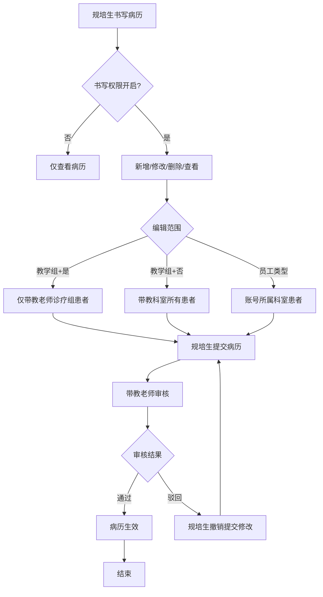
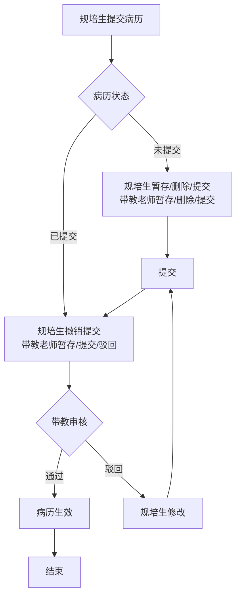

# BLGL-19-BLJXZ-002规培生病历书写权限_ Analyst - Spec

> **需求编号**：BLGL-19-BLJXZ-002
> **父需求**：BLGL-19-BLJXZ
> **关联PM Spec**：BLGL-19-BLJXZ-002_规培生病历书写权限_PM-spec.md
> **Spec版本**：V1.0
> **编写时间**：2026-08-14
> **编写人**：需求分析师

---

## 一、功能编号体系

### 1.1 功能层级结构

```
BLGL-19-BLJXZ-002: 规培生病历书写权限
  ├─ BLGL-19-BLJXZ-002-01: 规培生书写权限控制
  │   ├─ -01-01: 书写权限开关（开启/关闭）
  │   ├─ -01-02: 新增/修改/删除自己创建/查看
  │   └─ -01-03: 权限关闭仅查看
  ├─ BLGL-19-BLJXZ-002-02: 编辑范围控制
  │   ├─ -02-01: 教学组模式诊疗组范围
  │   └─ -02-02: 教学组模式科室范围
  ├─ BLGL-19-BLJXZ-002-03: 带教审核
  │   ├─ -03-01: 规培生提交病历
  │   └─ -03-02: 带教老师审核
```

### 1.2 功能编号表

| REQ-ID | 功能名称 | 类型 | 优先级 | 说明 |
|--------|---------|------|--------|------|
| BLGL-19-BLJXZ-002-01 | 规培生书写权限控制 | 功能 | P0 | 权限开关 |
| BLGL-19-BLJXZ-002-01-01 | 书写权限开关 | 子功能 | P0 | 开启/关闭 |
| BLGL-19-BLJXZ-002-01-02 | 书写操作权限 | 子功能 | P0 | 新增/修改/删除/查看 |
| BLGL-19-BLJXZ-002-01-03 | 权限关闭仅查看 | 子功能 | P1 | 关闭时 |
| BLGL-19-BLJXZ-002-02 | 编辑范围控制 | 功能 | P1 | 范围控制 |
| BLGL-19-BLJXZ-002-02-01 | 诊疗组范围 | 子功能 | P1 | 带教老师诊疗组 |
| BLGL-19-BLJXZ-002-02-02 | 科室范围 | 子功能 | P1 | 带教科室 |
| BLGL-19-BLJXZ-002-03 | 带教审核 | 功能 | P1 | 审核流程 |
| BLGL-19-BLJXZ-002-03-01 | 规培生提交 | 子功能 | P1 | 提交病历 |
| BLGL-19-BLJXZ-002-03-02 | 带教老师审核 | 子功能 | P1 | 暂存/提交/驳回 |

---

## 二、核心业务流程

### 2.1 规培生书写权限流程



### 2.2 带教审核流程



---

## 三、功能规格说明

---

### BLGL-19-BLJXZ-002-01: 规培生书写权限控制

#### 3.1.1 功能概述

规培生/进修生书写病历权限控制：权限开启时开放新增/修改/删除自己创建/查看，权限关闭时仅开放查看。

#### 3.1.2 用户角色

| 角色 | 使用场景 | 权限要求 | 操作频率 |
|------|---------|---------|---------|
| 规培生/进修生 | 书写病历 | 书写权限开启 | 高频 |

#### 3.1.3 业务流程（Given/When/Then）

##### 主流程

**Scenario 1: 规培生病历书写**

```gherkin
Given:
  - 规培生书写病历权限开启
  - 规培生已识别身份

When:
  - 规培生书写病历

Then:
  - 开放新增、修改、删除（删除自己创建的病历）、查看
  - 病历未提交：规培生（暂存/删除/提交）
  - 病历提交后需带教老师审核
```

##### 异常流程

**Scenario 2: 业务异常——权限关闭**

```gherkin
Given:
  - 规培生书写病历的权限关闭

When:
  - 规培生书写病历

Then:
  - 仅开放查看病历
  - 不能新增/修改/删除
```

##### 边界流程

**Scenario 3: 边界场景——规培生删除**

```gherkin
Given:
  - 规培生创建的病历

When:
  - 规培生删除病历

Then:
  - 仅可删除自己创建的病历
  - 不能删除他人病历
```

#### 3.1.5 验收标准

| AC编号 | 验收标准 | 对应REQ-ID | 验证方法 | 验证场景 |
|--------|---------|-----------|---------|---------|
| AC-001 | 规培生书写权限开启时开放新增/修改/删除自己创建/查看 | -002-01 | 功能测试 | Scenario 1 |
| AC-002 | 规培生权限关闭时仅开放查看 | -002-01 | 功能测试 | Scenario 2 |

---

### BLGL-19-BLJXZ-002-02: 编辑范围控制

#### 3.2.1 功能概述

教学组模式下规培生编辑范围控制：参数=是仅带教老师诊疗组患者，参数=否带教科室所有患者。

#### 3.2.2 用户角色

| 角色 | 使用场景 | 权限要求 | 操作频率 |
|------|---------|---------|---------|
| 规培生 | 编辑病历 | 教学组身份 | 高频 |

#### 3.2.3 业务流程（Given/When/Then）

##### 主流程

**Scenario 1: 编辑范围控制**

```gherkin
Given:
  - 规培生身份标识来源=教学组
  - 参数"规培生可编辑病历的患者范围是否限制为带教老师诊疗组"

When:
  - 规培生编辑病历

Then:
  - 参数=是：仅可编辑带教老师所属诊疗组负责的患者病历
  - 参数=否：可编辑带教科室所有患者病历
```

##### 异常流程

**Scenario 2: 系统异常——未在教学组**

```gherkin
Given:
  - 规培生未在教学组中

When:
  - 规培生尝试创建病历

Then:
  - 应控制不能创建病历（原问题）
  - ⏳ 待确认：教学组外规培生权限控制
```

##### 边界流程

**Scenario 3: 边界场景——诊疗组模式**

```gherkin
Given:
  - 省中书写病历采用诊疗组模式

When:
  - 患者选择诊疗组

Then:
  - 诊疗组内医生和其带教学生可对诊疗组患者书写病历
```

#### 3.2.5 验收标准

| AC编号 | 验收标准 | 对应REQ-ID | 验证方法 | 验证场景 |
|--------|---------|-----------|---------|---------|
| AC-003 | 教学组模式编辑范围=是时仅带教老师诊疗组患者 | -002-02 | 功能测试 | Scenario 1 |
| AC-004 | 编辑范围=否时带教科室所有患者 | -002-02 | 功能测试 | Scenario 1 |

---

### BLGL-19-BLJXZ-002-03: 带教审核

#### 3.3.1 功能概述

规培生提交病历后带教老师审核（暂存/提交/驳回），规培生可撤销提交。

#### 3.3.2 用户角色

| 角色 | 使用场景 | 权限要求 | 操作频率 |
|------|---------|---------|---------|
| 带教老师 | 审核规培生病历 | 带教老师权限 | 中频 |
| 规培生 | 撤销提交 | 规培生权限 | 中频 |

#### 3.3.3 业务流程（Given/When/Then）

##### 主流程

**Scenario 1: 带教审核**

```gherkin
Given:
  - 规培生提交病历

When:
  - 病历进入审核流程

Then:
  - 带教老师权限：暂存、提交、驳回
  - 规培生权限：撤销提交
```

##### 边界流程

**Scenario 2: 边界场景——驳回修改**

```gherkin
Given:
  - 带教老师审核驳回

When:
  - 规培生收到驳回

Then:
  - 规培生修改病历后重新提交
```

#### 3.3.5 验收标准

| AC编号 | 验收标准 | 对应REQ-ID | 验证方法 | 验证场景 |
|--------|---------|-----------|---------|---------|
| AC-005 | 规培生提交病历后带教老师可审核 | -002-03 | 功能测试 | Scenario 1 |

---

## 四、排除范围

本需求不包含以下功能项：

1. **教学组管理** - 属 BLGL-19-BLJXZ-001
2. **规培生身份标识配置** - 属 BLGL-19-BLJXZ-003
3. **病历带教字段与归档校验** - 属 BLGL-19-BLJXZ-004
4. **规培生签名格式** - 属基础能力 BC-BLJXZ-003

> 与 PM-Spec 第四章一致。对照 Phase 1 功能点Spec 第6章（基线能力），确保不越界。

---

## 五、业务规则清单

| 规则ID | 规则名称 | 规则描述 | 来源 | 优先级 |
|--------|---------|---------|------|--------|
| BR-001 | 书写权限 | 规培生书写权限开启开放新增/修改/删除自己创建/查看 | | P0 |
| BR-002 | 权限关闭 | 规培生权限关闭仅开放查看 | | P1 |
| BR-003 | 编辑范围 | 教学组模式编辑范围按参数控制 | | P1 |
| BR-004 | 诊疗组模式 | 诊疗组内医生和带教学生可书写病历 | | P1 |
| BR-005 | 带教审核 | 规培生提交病历带教老师审核 | | P1 |

---

## 六、关联文档

| 文档类型 | 文档路径 | 说明 |
|---------|---------|------|
| PM-Spec（业务视角） | 本目录 BLGL-19-BLJXZ-002_规培生病历书写权限_PM-spec.md（V0.1） | PM 产出的 Spec 文档 |
| Spec（研发视角） | 本目录 BLGL-19-BLJXZ-002_规培生病历书写权限-Spec.md（V1.0） | 业务背景与目标 Spec |
| 功能点Spec（模块级） | BLGL-19-BLJXZ 19病历教学组功能点Spec.md（V1.0，上级目录） | Phase 1 功能点索引 |
| data-model.md | 待产出 | 架构师产出的数据建模文档 |
| design.md | 待产出 | 架构师产出的技术方案文档 |
| api-contract.md | 待产出 | 开发经理产出的 API 契约文档 |

---

## 七、待确认问题清单

| 编号 | 问题描述 | 缺失信息 | 影响范围 | 建议补充方 |
|------|---------|---------|---------|-----------|
| Q-001 | 教学组外规培生权限 | 未入组规培生创建病历控制 | 3.2.3 Scenario 2 | 产品经理 |
| Q-002 | 权限校验接口契约 | 规培生权限校验接口 | 第5章接口设计 | 开发经理 |
| Q-003 | 概念ID、性能指标 | 字段概念ID、权限SLA | 数据模型、非功能 | 架构师/产品经理 |

---

## 填写检查清单

| 序号 | 检查项 | 是否完成 |
|:----:|--------|:--------:|
| 1 | 功能编号带父子层级 | ✅ |
| 2 | 每个 REQ-ID 有功能概述和用户角色 | ✅ |
| 3 | 主流程至少 1 个 Given/When/Then 场景 | ✅ |
| 4 | 异常流程至少 3 个 Given/When/Then 场景 | ✅ |
| 5 | 边界流程至少 2 个 Given/When/Then 场景 | ✅ |
| 6 | 每个 Given/When/Then 内容具体，不模糊 | ✅ |
| 7 | 数据字段定义完整 | ✅ |
| 8 | 验收标准 AC 编号独立，可验证 | ✅ |
| 9 | 验收标准无"功能正常"等模糊表述 | ✅ |
| 10 | 排除范围明确列出 | ✅ |
| 11 | 业务规则清单列出所有规则，每条标注来源 | ✅ |
| 12 | 流程图使用 Mermaid 格式（≥2 个） | ✅ |
| 13 | 关联文档索引包含 Phase 1 功能点Spec | ✅ |
| 14 | 待确认问题清单汇总了全文所有 ⏳ 项 | ✅ |
| 15 | 全文无占位符 `< >` 残留 | ✅ |
| 16 | 全文陈述可溯源至资料区（S1~S10 溯源核查） | ✅ |
| 17 | 人工审核确认完成 | ⏳ 待确认 |

---

**文档状态**：⬜ 待审核
**维护责任**：需求分析师规范组
**下次更新**：根据评审反馈优化

---

## 版本历史

| 版本 | 日期 | 变更说明 | 编写人 |
|------|------|---------|--------|
| V1.0 | 2026-08-14 | 初始版本 | 需求分析师 |
